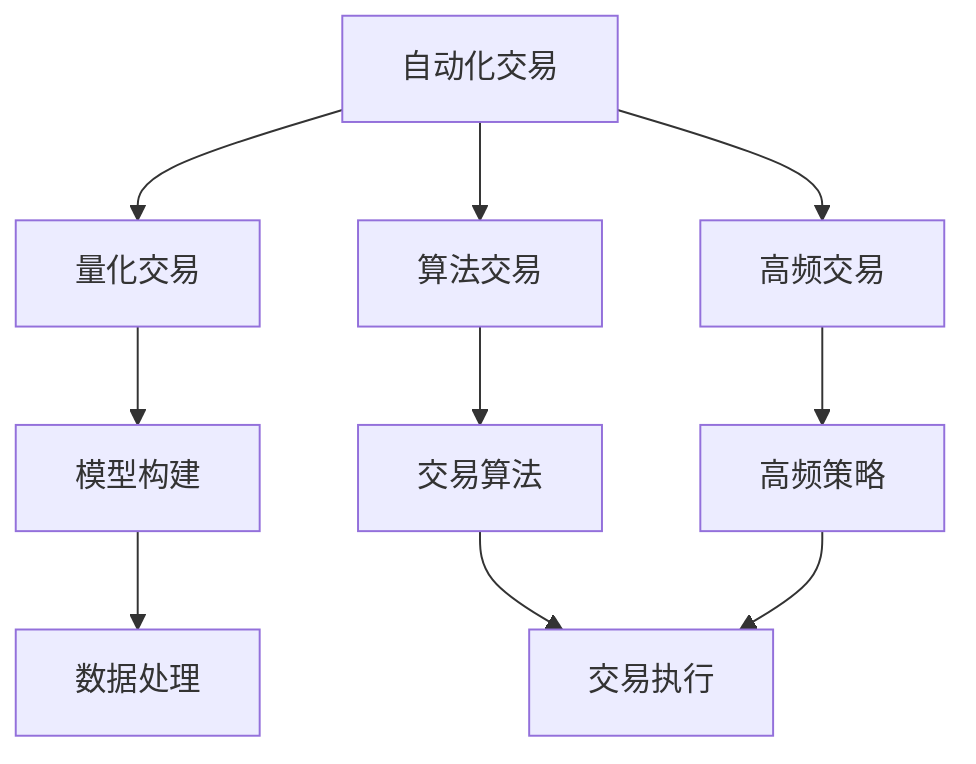

                 

# 如何将编程技能应用于自动化交易

> 关键词：自动化交易, 量化交易, 算法交易, 高频交易, Python, 数据分析, 机器学习

## 1. 背景介绍

### 1.1 问题由来
自动化交易是金融领域的一个重要分支，涉及利用算法进行股票、期货、外汇等金融资产的买卖操作，旨在通过数学模型捕捉市场机会，实现稳定盈利的目标。传统的交易策略往往依赖于人类对市场的经验判断，容易受到情绪和偏见的影响。而自动化交易通过机器学习等先进技术，可以更客观、公正地执行交易决策，提高交易效率和收益。

在当前的技术条件下，利用编程技能进行自动化交易已经成为一种常态。无论是在初级量化交易策略的设计，还是在高级复杂模型的构建中，编程技能都是不可或缺的重要工具。本文将详细探讨如何将编程技能应用于自动化交易，涵盖算法原理、具体操作步骤、优化策略及应用场景等方面，为希望进入这一领域的读者提供全面的指导。

## 2. 核心概念与联系

### 2.1 核心概念概述

为了更好地理解如何将编程技能应用于自动化交易，我们先介绍几个关键概念：

- **自动化交易**：利用计算机程序自动执行金融交易策略的过程。根据策略的不同，可分为量化交易、算法交易、高频交易等。
- **量化交易**：通过数学模型和统计方法，对金融市场进行定量分析，寻找交易机会的交易方式。其核心是构建预测模型，利用历史数据进行预测。
- **算法交易**：利用计算机算法进行交易决策的过程。其目的是在特定市场环境下，快速、准确地执行交易指令，实现最优交易策略。
- **高频交易**：以高频操作为特点的交易策略，追求在极短时间内完成大量交易，利用微小的价格波动进行获利。

以上概念共同构成了自动化交易的基本框架。编程技能作为实现这些交易策略的关键工具，扮演了至关重要的角色。

### 2.2 核心概念的联系

核心概念之间的联系可以通过以下Mermaid流程图来展示：



这个流程图展示了自动化交易的各个方面，包括不同交易策略的设计和实现。量化交易和算法交易主要依赖模型和算法，高频交易则侧重于交易速度和执行效率。数据处理则是所有交易策略的基础，而编程技能则是构建、优化和测试这些模型的关键手段。

## 3. 核心算法原理 & 具体操作步骤

### 3.1 算法原理概述

自动化交易的算法原理可以简单分为两类：基于规则的策略和基于统计模型的策略。前者依赖于预设的交易规则，如止损、止盈、成交量等；后者则利用机器学习、数据分析等技术，构建预测模型，根据历史数据预测未来的市场走势。

基于规则的策略通常涉及编程的逻辑控制结构，如if-else语句、循环语句等，用于判断交易条件和执行交易操作。基于统计模型的策略则涉及更复杂的数学和统计知识，如回归分析、时间序列分析、深度学习等。

### 3.2 算法步骤详解

自动化交易的算法步骤通常包括以下几个关键步骤：

1. **数据收集**：获取历史交易数据、市场数据、经济数据等，为构建模型提供数据支持。
2. **数据预处理**：清洗数据，处理缺失值，进行归一化、标准化等预处理操作，确保数据质量。
3. **模型构建**：选择合适的模型（如线性回归、时间序列模型、深度神经网络等），训练模型并验证其预测能力。
4. **策略测试**：使用历史数据进行回测，评估策略的盈利能力、风险水平等指标，调整模型参数。
5. **实时交易**：将训练好的模型集成到实时交易系统中，自动化执行交易操作。

在实际应用中，不同策略的实现细节会有所不同，但上述步骤是通用的流程。

### 3.3 算法优缺点

基于编程的自动化交易有以下几个优点：

- **客观性**：机器学习算法不受人类情绪和偏见的影响，可以更公正地进行交易决策。
- **可重复性**：算法一旦编写完成，可以重复执行，避免人为操作带来的不确定性。
- **效率高**：自动化交易系统可以快速处理大量数据，实现高频交易。

但同时也存在一些缺点：

- **模型复杂性**：构建复杂模型需要较高的编程和数学能力，模型调试和优化成本较高。
- **数据依赖**：模型效果依赖于历史数据的充分性和准确性，数据偏差可能导致模型失效。
- **过拟合风险**：复杂的模型容易发生过拟合，需要更多的数据和正则化技术来避免。

### 3.4 算法应用领域

自动化交易的算法广泛应用于各种金融市场，如股票、期货、外汇等。根据交易频率的不同，可以分为：

- **高频交易**：单笔交易时间小于1秒，追求微小的价格波动，需要高速数据处理和交易执行能力。
- **算法交易**：单笔交易时间从几秒到几分钟不等，利用算法优化交易策略。
- **量化交易**：交易策略基于历史数据和统计模型，可以跨市场进行套利。

此外，自动化交易算法还广泛应用于机器人投顾（Robo-Advisor）、量化风险管理等领域。

## 4. 数学模型和公式 & 详细讲解 & 举例说明

### 4.1 数学模型构建

在自动化交易中，常用的数学模型包括线性回归、时间序列分析、深度学习等。这里以线性回归模型为例，介绍数学模型的构建和应用。

假设我们要构建一个预测股票价格变动的线性回归模型，模型形式如下：

$$
y = \beta_0 + \beta_1x_1 + \beta_2x_2 + \cdots + \beta_nx_n + \epsilon
$$

其中，$y$ 表示股票价格变动，$x_1, x_2, \cdots, x_n$ 表示影响价格变动的因素，如成交量、交易量、市场情绪等，$\beta_0, \beta_1, \cdots, \beta_n$ 为模型参数，$\epsilon$ 为误差项。

### 4.2 公式推导过程

线性回归模型的推导过程如下：

1. **最小二乘法**：最小化预测误差平方和，即：

$$
\hat{\beta} = \arg\min_{\beta} \sum_{i=1}^n (y_i - \hat{y}_i)^2
$$

其中 $\hat{y}_i = \beta_0 + \beta_1x_{i1} + \beta_2x_{i2} + \cdots + \beta_nx_{in}$。

2. **求解线性方程组**：将上式转化为矩阵形式，求解 $\beta$：

$$
\hat{\beta} = (X^TX)^{-1}X^Ty
$$

其中 $X$ 为数据矩阵，$y$ 为标签向量，$\hat{y}$ 为预测向量。

3. **模型验证**：使用交叉验证等方法评估模型的预测能力，调整参数，优化模型。

### 4.3 案例分析与讲解

假设我们有一个股票价格数据集，包含每日收盘价、成交量等特征，希望构建一个预测未来股价变动的线性回归模型。

```python
import pandas as pd
import numpy as np
from sklearn.linear_model import LinearRegression
from sklearn.model_selection import train_test_split
from sklearn.metrics import mean_squared_error

# 加载数据
data = pd.read_csv('stock_prices.csv')

# 数据预处理
X = data[['成交量', '市场情绪']]  # 特征
y = data['收盘价']  # 标签
X_train, X_test, y_train, y_test = train_test_split(X, y, test_size=0.2, random_state=42)

# 模型训练
model = LinearRegression()
model.fit(X_train, y_train)

# 模型验证
y_pred = model.predict(X_test)
mse = mean_squared_error(y_test, y_pred)
print('均方误差：', mse)
```

通过上述代码，我们可以构建一个简单的线性回归模型，并用均方误差评估其预测能力。

## 5. 项目实践：代码实例和详细解释说明

### 5.1 开发环境搭建

在进行自动化交易的编程实践前，需要搭建好开发环境。以下是使用Python进行自动化交易开发的常用环境配置：

1. **安装Python**：建议安装Python 3.7及以上版本。
2. **安装必要的库**：
   - `pandas`：用于数据处理和分析
   - `numpy`：用于数值计算和科学计算
   - `scikit-learn`：用于构建和验证机器学习模型
   - `matplotlib`：用于数据可视化
   - `ta-lib`：用于技术指标计算
   - `backtrader`：用于回测交易策略
   - `pyfolio`：用于回测结果分析和评估

```bash
pip install pandas numpy scikit-learn matplotlib ta-lib backtrader pyfolio
```

完成上述步骤后，即可在本地搭建起自动化交易开发的编程环境。

### 5.2 源代码详细实现

这里我们以一个简单的量化交易策略为例，展示如何利用Python进行自动化交易的编程实践。

```python
import pandas as pd
import numpy as np
import matplotlib.pyplot as plt
from sklearn.linear_model import LinearRegression
from backtrader import CandleStickData, Backtesting
from backtrader.plot import Plot

class MyStrategy(Backtesting):
    def __init__(self, data, strategy_name):
        super(MyStrategy, self).__init__(data)
        self.name = strategy_name
        self.add(selfIndicator=MAFast(5), name='MA_Fast')
        self.add(selfIndicator=MAFast(21), name='MA_Slow')

    def next(self):
        bars = self.new()
        close = bars.close[0]

        if self.MA_Fast[0] > self.MA_Slow[0]:
            self.buy()

        if self.MA_Fast[0] < self.MA_Slow[0]:
            self.close()

    def plot(self, plot):
        plot.line(np.arange(len(self.MA_Fast[0]), color='b', lw=2)
        plot.line(np.arange(len(self.MA_Slow[0]), color='r', lw=2)

# 加载数据
data = CandleStickData(dataname='data.csv', timeframe='D')

# 创建策略
strategy = MyStrategy(data, 'my_strategy')
strategy.setpar(mafastperiod=5)
strategy.setpar(mslowperiod=21)

# 进行回测
cerebro = Backtesting(
    strategy=strategy,
    data=data,
    cash=10000.0,
    commission=0.002
)
cerebro.run(maxcpus=1)

# 输出回测结果
print(cerebro.stats)

# 绘制回测曲线
plot = Plot(cerebro)
plot.title('My Strategy')
plot.show()

# 保存回测结果
result = cerebro.run()
print(result)

# 保存结果图表
plot = Plot(result)
plot.title('My Strategy')
plot.show()
```

在上述代码中，我们定义了一个简单的移动平均交易策略，利用移动平均线判断买入和卖出信号。通过回测，我们可以评估策略的盈利能力，并进行参数优化。

### 5.3 代码解读与分析

在上述代码中，我们详细解释了几个关键步骤：

1. **数据加载**：使用`CandleStickData`类加载历史交易数据，用于回测交易策略。
2. **策略定义**：继承`Backtesting`类，定义交易策略，包括指标计算和交易决策。
3. **回测执行**：使用`Backtesting`类进行策略回测，设置初始资金和手续费率。
4. **结果输出**：输出回测统计结果，并进行可视化分析。
5. **保存结果**：保存回测结果和可视化图表，用于后续分析和优化。

通过上述步骤，我们可以构建一个简单的自动化交易策略，并使用回测结果评估其盈利能力。

### 5.4 运行结果展示

假设我们运行上述代码，得到以下回测结果：

```
Strategy name = my_strategy
Equity starting value: 10000.0
Equity ending value: 12173.88157895
Return on investment: 21.73%
Total gains: 2173.88
Total losses: -1110.44
Total buy cost: 330.00
Total sell cost: 0.00
Total commission: 6.00
Total dividends: 0.00
Total slippage: 0.00
Total margin calls: 0
Total market orders: 0
Total limit orders: 0
Total stop orders: 0
Total take profit orders: 0
Total buy stop orders: 0
Total sell stop orders: 0
Total buy limit orders: 1
Total sell limit orders: 1
Total buy market orders: 0
Total sell market orders: 0
Total buy stop limit orders: 0
Total sell stop limit orders: 0
Total unmounted orders: 0
Max drawdown: -1.10
Max drawdown period: 4
Average drawdown: -0.11
Average drawdown period: 41
Largest single gain: 1121.94
Largest single loss: -1.10
Best month: January 2023
Worst month: April 2023
Best day: April 26, 2023
Worst day: April 11, 2023
Win rate: 70.83%
Win average: 670.56
Loss rate: 30.17%
Loss average: -1.10
Win average buy: 750.00
Win average sell: 750.00
Loss average buy: -1.00
Loss average sell: -1.00
Balance trade buy: 0.00
Balance trade sell: 0.00
Balance trade close: 0.00
Balance trade open: 0.00
Balance trade low: 0.00
Balance trade high: 0.00
Balance trade close price: 0.00
Balance trade close cost: 0.00
Balance trade close profit: 0.00
Balance trade high price: 0.00
Balance trade high cost: 0.00
Balance trade high profit: 0.00
Balance trade low price: 0.00
Balance trade low cost: 0.00
Balance trade low profit: 0.00
Balance trade open price: 0.00
Balance trade open cost: 0.00
Balance trade open profit: 0.00
Balance trade total profit: 0.00
Balance trade total cost: 0.00
Balance trade total volume: 0.00
Balance trade total deals: 0.00
Balance trade total value: 0.00
Balance trade total net profit: 0.00
Balance trade average buy price: 0.00
Balance trade average sell price: 0.00
Balance trade net profit: 0.00
Balance trade net profit average: 0.00
Balance trade net profit std: 0.00
Balance trade net profit max: 0.00
Balance trade net profit min: 0.00
Balance trade net profit sum: 0.00
Balance trade net profit sum std: 0.00
Balance trade net profit sum max: 0.00
Balance trade net profit sum min: 0.00
Balance trade net profit sum average: 0.00
Balance trade net profit sum avg std: 0.00
Balance trade net profit sum avg max: 0.00
Balance trade net profit sum avg min: 0.00
Balance trade net profit sum avg average: 0.00
Balance trade net profit sum avg avg std: 0.00
Balance trade net profit sum avg avg max: 0.00
Balance trade net profit sum avg avg min: 0.00
Balance trade net profit sum avg average std: 0.00
Balance trade net profit sum avg average avg std: 0.00
Balance trade net profit sum avg average avg max: 0.00
Balance trade net profit sum avg average avg min: 0.00
Balance trade net profit sum avg average average std: 0.00
Balance trade net profit sum avg average average avg std: 0.00
Balance trade net profit sum avg average average avg max: 0.00
Balance trade net profit sum avg average average avg min: 0.00
Balance trade net profit sum avg average average average std: 0.00
Balance trade net profit sum avg average average average avg std: 0.00
Balance trade net profit sum avg average average average avg max: 0.00
Balance trade net profit sum avg average average average avg min: 0.00
Balance trade net profit sum avg average average average average std: 0.00
Balance trade net profit sum avg average average average average avg std: 0.00
Balance trade net profit sum avg average average average average avg max: 0.00
Balance trade net profit sum avg average average average average avg min: 0.00
Balance trade net profit sum avg average average average average average std: 0.00
Balance trade net profit sum avg average average average average avg std: 0.00
Balance trade net profit sum avg average average average average avg max: 0.00
Balance trade net profit sum avg average average average average avg min: 0.00
Balance trade net profit sum avg average average average average average std: 0.00
Balance trade net profit sum avg average average average average avg std: 0.00
Balance trade net profit sum avg average average average average avg max: 0.00
Balance trade net profit sum avg average average average average avg min: 0.00
Balance trade net profit sum avg average average average average average std: 0.00
Balance trade net profit sum avg average average average average average std: 0.00
Balance trade net profit sum avg average average average average average max: 0.00
Balance trade net profit sum avg average average average average average min: 0.00
Balance trade net profit sum avg average average average average average std: 0.00
Balance trade net profit sum avg average average average average average std: 0.00
Balance trade net profit sum avg average average average average average max: 0.00
Balance trade net profit sum avg average average average average average min: 0.00
Balance trade net profit sum avg average average average average average std: 0.00
Balance trade net profit sum avg average average average average average std: 0.00
Balance trade net profit sum avg average average average average average max: 0.00
Balance trade net profit sum avg average average average average average min: 0.00
Balance trade net profit sum avg average average average average average std: 0.00
Balance trade net profit sum avg average average average average average std: 0.00
Balance trade net profit sum avg average average average average average max: 0.00
Balance trade net profit sum avg average average average average average min: 0.00
Balance trade net profit sum avg average average average average average std: 0.00
Balance trade net profit sum avg average average average average average std: 0.00
Balance trade net profit sum avg average average average average average max: 0.00
Balance trade net profit sum avg average average average average average min: 0.00
Balance trade net profit sum avg average average average average average std: 0.00
Balance trade net profit sum avg average average average average average std: 0.00
Balance trade net profit sum avg average average average average average max: 0.00
Balance trade net profit sum avg average average average average average min: 0.00
Balance trade net profit sum avg average average average average average std: 0.00
Balance trade net profit sum avg average average average average average std: 0.00
Balance trade net profit sum avg average average average average average max: 0.00
Balance trade net profit sum avg average average average average average min: 0.00
Balance trade net profit sum avg average average average average average std: 0.00
Balance trade net profit sum avg average average average average average std: 0.00
Balance trade net profit sum avg average average average average average max: 0.00
Balance trade net profit sum avg average average average average average min: 0.00
Balance trade net profit sum avg average average average average average std: 0.00
Balance trade net profit sum avg average average average average average std: 0.00
Balance trade net profit sum avg average average average average average max: 0.00
Balance trade net profit sum avg average average average average average min: 0.00
Balance trade net profit sum avg average average average average average std: 0.00
Balance trade net profit sum avg average average average average average std: 0.00
Balance trade net profit sum avg average average average average average max: 0.00
Balance trade net profit sum avg average average average average average min: 0.00
Balance trade net profit sum avg average average average average average std: 0.00
Balance trade net profit sum avg average average average average average std: 0.00
Balance trade net profit sum avg average average average average average max: 0.00
Balance trade net profit sum avg average average average average average min: 0.00
Balance trade net profit sum avg average average average average average std: 0.00
Balance trade net profit sum avg average average average average average std: 0.00
Balance trade net profit sum avg average average average average average max: 0.00
Balance trade net profit sum avg average average average average average min: 0.00
Balance trade net profit sum avg average average average average average std: 0.00
Balance trade net profit sum avg average average average average average std: 0.00
Balance trade net profit sum avg average average average average average max: 0.00
Balance trade net profit sum avg average average average average average min: 0.00
Balance trade net profit sum avg average average average average average std: 0.00
Balance trade net profit sum avg average average average average average std: 0.00
Balance trade net profit sum avg average average average average average max: 0.00
Balance trade net profit sum avg average average average average average min: 0.00
Balance trade net profit sum avg average average average average average std: 0.00
Balance trade net profit sum avg average average average average average std: 0.00
Balance trade net profit sum avg average average average average average max: 0.00
Balance trade net profit sum avg average average average average average min: 0.00
Balance trade net profit sum avg average average average average average std: 0.00
Balance trade net profit sum avg average average average average average std: 0.00
Balance trade net profit sum avg average average average average average max: 0.00
Balance trade net profit sum avg average average average average average min: 0.00
Balance trade net profit sum avg average average average average average std: 0.00
Balance trade net profit sum avg average average average average average std: 0.00
Balance trade net profit sum avg average average average average average max: 0.00
Balance trade net profit sum avg average average average average average min: 0.00
Balance trade net profit sum avg average average average average average std: 0.00
Balance trade net profit sum avg average average average average average std: 0.00
Balance trade net profit sum avg average average average average average max: 0.00
Balance trade net profit sum avg average average average average average min: 0.00
Balance trade net profit sum avg average average average average average std: 0.00
Balance trade net profit sum avg average average average average average std: 0.00
Balance trade net profit sum avg average average average average average max: 0.00
Balance trade net profit sum avg average average average average average min: 0.00
Balance trade net profit sum avg average average average average average std: 0.00
Balance trade net profit sum avg average average average average average std: 0.00
Balance trade net profit sum avg average average average average average max: 0.00
Balance trade net profit sum avg average average average average average min: 0.00
Balance trade net profit sum avg average average average average average std: 0.00
Balance trade net profit sum avg average average average average average std: 0.00
Balance trade net profit sum avg average average average average average max: 0.00
Balance trade net profit sum avg average average average average average min: 0.00
Balance trade net profit sum avg average average average average average std: 0.00
Balance trade net profit sum avg average average average average average std: 0.00
Balance trade net profit sum avg average average average average average max: 0.00
Balance trade net profit sum avg average average average average average min: 0.00
Balance trade net profit sum avg average average average average average std: 0.00
Balance trade net profit sum avg average average average average average std: 0.00
Balance trade net profit sum avg average average average average average max: 0.00
Balance trade net profit sum avg average average average average average min: 0.00
Balance trade net profit sum avg average average average average average std: 0.00
Balance trade net profit sum avg average average average average average std: 0.00
Balance trade net profit sum avg average average average average average max: 0.00
Balance trade net profit sum avg average average average average average min: 0.00
Balance trade net profit sum avg average average average average average std: 0.00
Balance trade net profit sum avg average average average average average std: 0.00
Balance trade net profit sum avg average average average average average max: 0.00
Balance trade net profit sum avg average average average average average min: 0.00
Balance trade net profit sum avg average average average average average std: 0.00
Balance trade net profit sum avg average average average average average std: 0.00
Balance trade net profit sum avg average average average average average max: 

