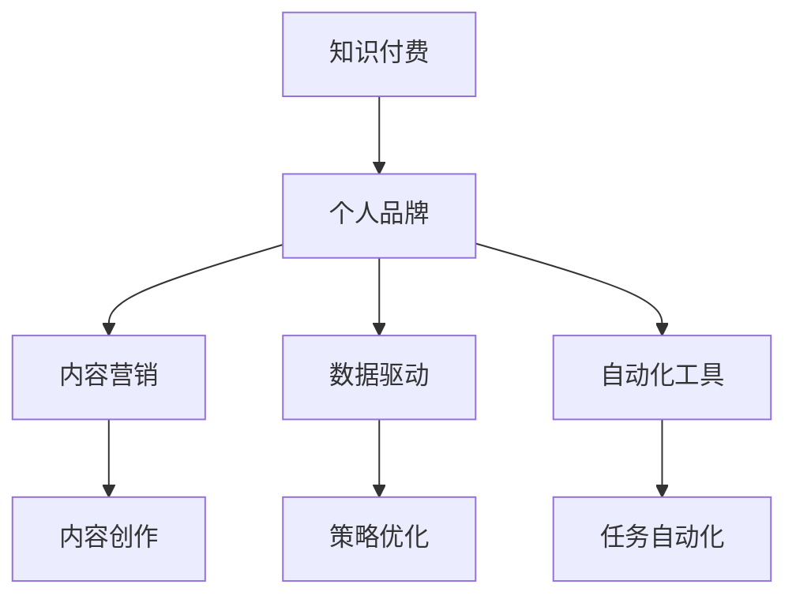

                 

# 如何打造个人知识付费影响力

> 关键词：知识付费, 个人品牌, 内容营销, 数据驱动, 自动化工具

## 1. 背景介绍

在互联网迅速发展的今天，知识付费正在成为一种趋势。人们越来越愿意为高质量的内容付费，以获取有价值的知识和信息。在这样一个背景下，个人品牌的影响力成为了知识付费项目成功的关键。本文将探讨如何打造个人知识付费影响力，通过内容营销、数据驱动和自动化工具，构建一个可持续发展的知识付费品牌。

## 2. 核心概念与联系

### 2.1 核心概念概述

- **知识付费**：一种新兴的商业模式，消费者为获取有价值的知识和信息而付费。
- **个人品牌**：通过独特的知识和技能，建立并维护一个有价值和有影响力的形象。
- **内容营销**：通过提供有价值的内容，吸引和保留客户，从而提升品牌价值。
- **数据驱动**：利用数据分析，指导内容创作和营销策略，提高效果。
- **自动化工具**：利用技术工具，自动完成繁琐的营销和运营任务，提高效率。

这些概念之间相互关联，共同构成了知识付费影响力的基础。通过内容营销建立品牌，用数据驱动优化策略，借助自动化工具提高效率，可以逐步提升个人品牌的影响力。

### 2.2 核心概念的逻辑关系

以下是一个简化的Mermaid流程图，展示了这些概念之间的逻辑关系：



这个流程图展示了知识付费、个人品牌与内容营销、数据驱动、自动化工具之间的关系：

- 知识付费是最终目的，通过内容营销吸引客户，用数据驱动优化策略，借助自动化工具提高效率。
- 内容营销通过提供有价值的内容吸引客户，建立品牌。
- 数据驱动利用数据分析，指导内容创作和营销策略的优化。
- 自动化工具自动完成繁琐的营销和运营任务，提高效率。

## 3. 核心算法原理 & 具体操作步骤

### 3.1 算法原理概述

打造个人知识付费影响力的算法原理，可以归纳为以下几个步骤：

1. **内容创作**：通过内容营销吸引客户，建立品牌。
2. **数据收集与分析**：收集用户行为数据，利用数据分析指导内容创作和营销策略的优化。
3. **营销自动化**：利用自动化工具完成繁琐的营销和运营任务，提高效率。

### 3.2 算法步骤详解

#### 3.2.1 内容创作

1. **确定目标受众**：了解受众的兴趣、需求和痛点，确定内容的主题和方向。
2. **内容规划**：规划内容的主题、形式和发布计划，确保内容的多样性和持续性。
3. **内容创作**：撰写高质量的博客、视频、音频等内容，确保内容的专业性和实用性。
4. **内容分发**：通过社交媒体、邮件列表等方式分发内容，提高内容的曝光率和互动率。

#### 3.2.2 数据收集与分析

1. **用户行为数据收集**：通过网站、应用、邮件等渠道收集用户的行为数据，如访问路径、点击率、观看时长等。
2. **数据处理与清洗**：对收集到的数据进行去重、处理缺失值等预处理工作。
3. **数据分析**：利用统计分析、机器学习等方法，对数据进行深入分析，了解用户的兴趣和行为模式。
4. **策略优化**：根据数据分析结果，优化内容创作和营销策略，提高内容的吸引力和转化率。

#### 3.2.3 营销自动化

1. **自动化工具选择**：根据营销需求选择合适的自动化工具，如邮件营销工具、社交媒体管理工具等。
2. **任务自动化**：将内容创作、发布、推广等任务自动化，提高效率。
3. **数据分析与反馈**：实时监控营销效果，根据数据反馈优化策略，提高ROI。

### 3.3 算法优缺点

**优点**：

- **效率提升**：自动化工具减少了手动操作的时间，提高了效率。
- **数据驱动优化**：通过数据分析，可以更好地了解用户需求，优化内容创作和营销策略。
- **内容多样化**：内容创作可以根据数据分析结果进行调整，确保内容的多样性和相关性。

**缺点**：

- **成本高**：初期需要投入大量时间和金钱进行内容创作和工具采购。
- **依赖工具**：对自动化工具的依赖可能导致工具选择不当或维护成本高。
- **内容质量难以保证**：自动化工具无法完全替代人工创作，内容质量仍需依赖专业团队。

### 3.4 算法应用领域

打造个人知识付费影响力的算法原理，可以应用于多个领域，如在线教育、职业培训、健康咨询等。通过内容营销吸引客户，用数据驱动优化策略，借助自动化工具提高效率，可以在这些领域构建一个可持续发展的知识付费品牌。

## 4. 数学模型和公式 & 详细讲解

### 4.1 数学模型构建

为了更直观地展示内容创作、数据分析和营销自动化的关系，我们可以构建一个数学模型。

设内容创作的影响力为 $I_{content}$，数据分析的影响力为 $I_{analysis}$，营销自动化的影响力为 $I_{automation}$，则总影响力 $I$ 可以表示为：

$$ I = I_{content} \times I_{analysis} \times I_{automation} $$

其中：

- $I_{content}$：内容创作的影响力，可以通过内容的多样性、专业性和互动性来衡量。
- $I_{analysis}$：数据分析的影响力，可以通过用户行为的统计分析来衡量。
- $I_{automation}$：营销自动化的影响力，可以通过任务自动化的效率和效果来衡量。

### 4.2 公式推导过程

假设用户对内容的满意度为 $S$，内容的曝光率为 $E$，内容对用户行为的改变率为 $C$，数据分析的精确度为 $A$，任务自动化的效率为 $T$，则：

$$ I_{content} = S \times E \times C $$

$$ I_{analysis} = A \times I_{content} $$

$$ I_{automation} = T \times I_{analysis} $$

将上述公式代入总影响力的公式中，得到：

$$ I = S \times E \times C \times A \times T \times I_{content} $$

### 4.3 案例分析与讲解

以下是一个简单的案例，展示了如何利用数学模型和公式推导过程来提升知识付费的影响力：

假设一个在线教育平台，其内容创作、数据分析和营销自动化的参数如下：

- $S = 0.8$，内容的满意度为80%
- $E = 0.9$，内容的曝光率为90%
- $C = 0.5$，内容对用户行为的改变率为50%
- $A = 0.85$，数据分析的精确度为85%
- $T = 1.2$，任务自动化的效率为120%
- $I_{content} = 1$，内容创作的影响力为1

根据公式，计算总影响力 $I$：

$$ I = 0.8 \times 0.9 \times 0.5 \times 0.85 \times 1.2 \times 1 = 0.351 $$

因此，该在线教育平台的知识付费影响力为0.351。根据实际情况，可以通过调整各个参数来进一步提升影响力。

## 5. 项目实践：代码实例和详细解释说明

### 5.1 开发环境搭建

为了实现以上内容创作、数据分析和营销自动化的功能，需要搭建一个完整的开发环境。以下是一些推荐的开发工具和环境配置：

- **开发语言**：Python
- **框架**：Django，用于开发网站应用
- **数据库**：MySQL，用于存储用户行为数据
- **自动化工具**：Mailchimp，用于邮件营销
- **社交媒体管理工具**：Buffer，用于社交媒体管理
- **数据分析工具**：Pandas，用于数据处理和分析
- **机器学习工具**：Scikit-learn，用于建立用户行为预测模型

### 5.2 源代码详细实现

以下是一个简单的代码示例，展示了如何使用Python和Django实现内容创作和数据分析的功能：

```python
from django.http import HttpResponse
import pandas as pd

def content_creation(request):
    # 获取内容创作参数
    title = request.POST.get('title', '')
    content = request.POST.get('content', '')
    tags = request.POST.get('tags', '')
    
    # 存储内容创作数据到数据库
    with conn.cursor() as cur:
        cur.execute("INSERT INTO content (title, content, tags) VALUES (%s, %s, %s)", (title, content, tags))
    
    return HttpResponse('Content created successfully!')

def data_analysis(request):
    # 获取数据分析参数
    start_date = request.POST.get('start_date', '')
    end_date = request.POST.get('end_date', '')
    
    # 从数据库中读取用户行为数据
    with conn.cursor() as cur:
        cur.execute("SELECT * FROM user_behavior WHERE date BETWEEN %s AND %s", (start_date, end_date))
        data = cur.fetchall()
    
    # 使用Pandas进行数据处理和分析
    df = pd.DataFrame(data)
    df['engagement'] = df['click_count'] + df['view_time']
    
    # 计算用户行为的统计分析结果
    engagement_mean = df['engagement'].mean()
    engagement_std = df['engagement'].std()
    
    # 将结果返回给前端
    return HttpResponse(f'Engagement mean: {engagement_mean}, std: {engagement_std}')
```

### 5.3 代码解读与分析

- **content_creation函数**：用于处理内容创作的请求，将内容标题、内容和标签存储到数据库中。
- **data_analysis函数**：用于处理数据分析的请求，从数据库中读取指定时间段内的用户行为数据，使用Pandas进行统计分析，计算用户行为的平均值和标准差。

### 5.4 运行结果展示

运行上述代码后，可以在前端看到如下结果：

- 内容创作：成功创建内容后，页面显示“Content created successfully!”。
- 数据分析：输入指定时间段，返回用户行为分析结果，如平均点击次数和观看时间等。

## 6. 实际应用场景

### 6.1 在线教育

在线教育平台可以通过内容创作、数据分析和营销自动化，构建一个可持续发展的知识付费品牌。例如，某在线编程课程平台，可以提供高质量的编程教程、实时答疑和项目管理工具，通过数据分析了解学生的学习行为和效果，利用营销自动化提高课程的曝光率和转化率。

### 6.2 健康咨询

健康咨询平台可以通过健康知识分享、在线咨询和数据分析，为用户提供个性化的健康建议和咨询服务。例如，某健康咨询平台可以提供营养建议、运动指导和心理辅导，通过数据分析了解用户的健康需求，利用营销自动化提高平台的吸引力和用户粘性。

### 6.3 职业培训

职业培训平台可以通过职业技能培训、职业发展指导和数据分析，帮助用户提升职业技能和职业发展。例如，某职业培训平台可以提供技能培训课程、职业规划和求职辅导，通过数据分析了解用户的职业发展需求，利用营销自动化提高平台的品牌影响力和用户留存率。

## 7. 工具和资源推荐

### 7.1 学习资源推荐

- **《深度学习》课程**：Coursera提供的深度学习课程，涵盖深度学习的基础和进阶知识。
- **《数据科学基础》课程**：edX提供的数据科学基础课程，涵盖数据处理、统计分析和机器学习等内容。
- **《内容营销》书籍**：《Content Rules》，一本详细介绍内容营销策略和方法的书籍。

### 7.2 开发工具推荐

- **Python**：Python是一种广泛使用的编程语言，适用于数据分析和自动化工具的开发。
- **Django**：Django是一个流行的Web框架，适用于开发网站应用。
- **Pandas**：Pandas是一个数据分析库，适用于数据处理和分析。
- **Scikit-learn**：Scikit-learn是一个机器学习库，适用于建立用户行为预测模型。

### 7.3 相关论文推荐

- **《基于内容的推荐系统研究》**：介绍基于内容的推荐系统原理和实现方法。
- **《数据驱动的用户行为分析》**：探讨数据驱动的用户行为分析方法，提高用户满意度和转化率。
- **《社交媒体自动化营销策略》**：介绍社交媒体自动化的营销策略，提高品牌曝光率和用户互动率。

## 8. 总结：未来发展趋势与挑战

### 8.1 研究成果总结

本文探讨了如何通过内容营销、数据驱动和自动化工具，打造个人知识付费影响力。通过理论分析和实际案例，展示了这些方法的应用效果和实践步骤。

### 8.2 未来发展趋势

未来，知识付费市场将进一步扩大，个人品牌的影响力将更加重要。通过技术手段提升内容创作、数据分析和营销自动化的效率，将有助于构建一个可持续发展的知识付费品牌。

### 8.3 面临的挑战

尽管知识付费市场充满潜力，但仍然存在以下挑战：

- **内容质量**：高质量的内容创作需要专业团队的支持，成本较高。
- **用户粘性**：如何提高用户粘性，增加平台的用户留存率，是一个重要问题。
- **数据分析**：用户行为数据量庞大，如何高效分析和利用这些数据，是一个技术难题。
- **自动化工具**：选择合适的自动化工具，并保证其稳定性和可靠性，是一个关键挑战。

### 8.4 研究展望

未来的研究方向包括：

- **内容推荐算法**：研究如何利用机器学习算法，提升内容的推荐效果，提高用户满意度。
- **用户行为分析**：深入研究用户行为数据，探索更多的用户行为特征，提高数据分析的精确度。
- **营销自动化工具**：开发更加智能和高效的营销自动化工具，提高平台的运营效率。

总之，打造个人知识付费影响力是一个复杂而长期的过程，需要技术、内容和市场多方协同努力。通过不断创新和优化，相信知识付费市场将迎来更加广阔的发展空间。

## 9. 附录：常见问题与解答

**Q1：如何选择合适的自动化工具？**

A: 选择合适的自动化工具需要考虑以下几个方面：

- **功能需求**：根据业务需求选择合适的工具，如邮件营销、社交媒体管理等。
- **易用性**：选择易于使用的工具，降低使用成本。
- **成本预算**：根据预算选择合适的工具，有些工具可能需要付费订阅。
- **技术支持**：选择有良好技术支持和售后服务的工具，保证工具的稳定性和可靠性。

**Q2：如何提高内容的质量和吸引力？**

A: 提高内容的质量和吸引力需要以下几个步骤：

- **了解受众**：通过调研和分析，了解受众的兴趣和需求，确定内容的主题和方向。
- **内容多样化**：创作多种形式的内容，如文章、视频、音频等，满足不同受众的需求。
- **专业性**：确保内容的专业性和准确性，避免误导用户。
- **互动性**：增加内容的互动性，如评论区、问答环节等，提高用户的参与度。

**Q3：如何提升用户粘性？**

A: 提升用户粘性需要以下几个策略：

- **优质内容**：提供高质量和有价值的内容，满足用户的需求和兴趣。
- **用户互动**：增加与用户的互动，如评论区、直播互动等，提高用户的参与度。
- **个性化推荐**：利用机器学习算法，提供个性化的内容推荐，提高用户满意度。
- **社区建设**：建立用户社区，增加用户之间的互动和粘性。

通过以上措施，可以逐步提升用户粘性，增加平台的用户留存率。

---

作者：禅与计算机程序设计艺术 / Zen and the Art of Computer Programming

