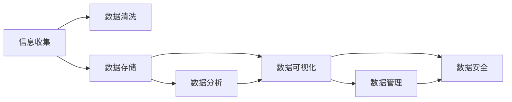
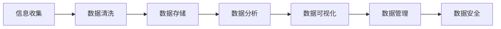

                 

# 如何进行信息收集：如何获取有效的信息和知识？

> 关键词：信息收集, 数据获取, 数据清洗, 数据存储, 数据分析, 数据管理, 数据可视化, 数据安全

## 1. 背景介绍

在信息时代，信息的获取与处理成为了驱动社会进步和经济发展的核心动力。如何高效地收集、处理和利用信息，成为各行各业关注的焦点。本文将从信息收集的角度出发，深入探讨如何获取有效的信息和知识，为技术领域的实践提供指导。

## 2. 核心概念与联系

### 2.1 核心概念概述

本节将介绍几个关键概念，这些概念是信息收集和处理的基础：

- **信息收集**：从各种来源获取原始数据的过程。
- **数据清洗**：对收集到的原始数据进行筛选、处理，以保证数据的完整性和准确性。
- **数据存储**：将处理后的数据进行结构化存储，以便后续的分析和利用。
- **数据分析**：使用统计学、机器学习等技术对数据进行分析和建模，提取有用信息。
- **数据管理**：对数据进行生命周期管理，包括数据的采集、存储、使用、共享和销毁。
- **数据可视化**：通过图表、仪表盘等形式将数据直观展示，辅助决策和分析。
- **数据安全**：确保数据在收集、存储和传输过程中的安全性和隐私保护。

这些概念之间的联系紧密，构成了一个完整的信息收集和管理体系。下图展示了这些概念之间的关系：



### 2.2 核心概念的整体架构

下图展示了信息收集和处理的全流程，从信息收集到数据安全，每个环节都有具体的操作和注意事项：



## 3. 核心算法原理 & 具体操作步骤

### 3.1 算法原理概述

信息收集和处理的过程可以抽象为一个数据处理流水线，每个环节都需要具体的算法和工具支持。下面将详细介绍每个环节的算法原理和具体操作步骤。

### 3.2 算法步骤详解

#### 3.2.1 信息收集

**步骤1：确定数据来源**
- 确定所需数据类型和来源，如网页、社交媒体、传感器等。
- 选择合适的数据采集工具和API，如Scrapy、BeautifulSoup、Twitter API等。

**步骤2：数据采集**
- 编写数据采集脚本，根据定义好的数据源和采集规则进行数据抓取。
- 处理API访问限制、验证码等问题，确保数据采集的连续性和稳定性。

**步骤3：数据存储**
- 使用数据库（如MySQL、MongoDB）对采集的数据进行结构化存储。
- 设置合适的数据模型和索引，提高数据查询和分析的效率。

#### 3.2.2 数据清洗

**步骤1：数据预处理**
- 去除重复和无效数据，如空值、重复记录等。
- 使用正则表达式、字符串函数等处理文本数据，如去除HTML标签、标准化文本格式等。

**步骤2：数据标准化**
- 统一数据格式，如日期格式、编码格式等，方便后续分析。
- 使用数据转换函数，如to_date、to_numeric等，将数据类型转换为分析所需的格式。

**步骤3：数据去噪**
- 去除噪声和异常值，如使用均值、中位数等统计量去除异常值。
- 使用机器学习算法进行数据异常检测和处理。

#### 3.2.3 数据分析

**步骤1：数据探索**
- 使用描述性统计分析数据的基本特征，如均值、方差、最大值等。
- 绘制基本统计图，如柱状图、饼图等，直观展示数据分布情况。

**步骤2：数据建模**
- 使用统计学方法或机器学习算法进行数据建模，如回归分析、分类算法等。
- 评估模型性能，选择合适的算法和参数。

**步骤3：数据可视化**
- 使用数据可视化工具（如Tableau、Matplotlib）绘制各种图表。
- 优化图表展示效果，如使用合适的颜色、标签等。

#### 3.2.4 数据管理

**步骤1：数据备份**
- 定期备份数据，防止数据丢失或损坏。
- 使用云存储或本地存储，选择合适的备份策略。

**步骤2：数据权限管理**
- 设置数据访问权限，限制非授权人员访问数据。
- 使用数据安全策略，如加密、访问控制等。

**步骤3：数据生命周期管理**
- 定义数据生命周期，明确数据的采集、存储、使用、共享和销毁流程。
- 使用数据管理系统（如Alfresco、FileSync）进行数据管理。

#### 3.2.5 数据安全

**步骤1：数据加密**
- 对数据进行加密处理，防止数据泄露。
- 使用对称加密或非对称加密算法进行数据保护。

**步骤2：数据访问控制**
- 设置数据访问权限，限制非授权人员访问数据。
- 使用身份验证和授权机制，如OAuth、LDAP等。

**步骤3：数据监控和审计**
- 实时监控数据访问情况，防止数据泄露和异常访问。
- 使用日志和审计工具记录数据访问行为，进行安全分析。

### 3.3 算法优缺点

信息收集和处理的算法具有以下优点：

- **高效性**：自动化数据采集和处理，大大提高了数据获取和分析的效率。
- **准确性**：通过数据清洗和去噪，确保数据的完整性和准确性。
- **灵活性**：支持多种数据源和数据格式，适用于多种分析场景。

同时，这些算法也存在一些缺点：

- **成本高**：初期建设成本较高，需要购买硬件和软件，进行技术开发和维护。
- **复杂性**：数据处理流程复杂，需要专业的技术团队支持。
- **数据隐私**：数据采集和存储过程中需要考虑隐私保护和数据安全。

### 3.4 算法应用领域

信息收集和处理技术广泛应用于以下领域：

- **社交媒体分析**：使用爬虫工具从社交媒体平台抓取用户评论和行为数据，进行情感分析和舆情监控。
- **电商数据分析**：从电商平台获取用户行为数据，进行用户画像和推荐系统优化。
- **金融数据分析**：从金融交易平台获取数据，进行风险评估和投资决策。
- **智能城市管理**：从传感器和监控设备获取城市运行数据，进行交通分析和公共安全监控。
- **医疗数据分析**：从医院和诊所获取医疗数据，进行疾病预测和患者管理。

## 4. 数学模型和公式 & 详细讲解  
### 4.1 数学模型构建

信息收集和处理涉及多个数学模型，下面以数据清洗和数据分析为例，给出数学模型的构建过程。

#### 4.1.1 数据清洗模型

假设原始数据为 $D=\{(x_1, y_1), (x_2, y_2), ..., (x_n, y_n)\}$，其中 $x_i$ 表示数据特征，$y_i$ 表示数据标签。数据清洗的目标是去除噪声和异常值，假设噪声数据为 $N=\{(n_1, n_1), (n_2, n_2), ..., (n_m, n_m)\}$。

- **数据预处理**：将数据进行去重、去噪和格式转换，得到处理后的数据集 $D'$。
- **数据标准化**：对数据进行标准化处理，得到标准化数据集 $D''$。

#### 4.1.2 数据分析模型

假设数据特征为 $X=\{x_1, x_2, ..., x_m\}$，目标变量为 $Y=\{y_1, y_2, ..., y_n\}$。使用线性回归模型进行数据分析：

$$
y = \beta_0 + \beta_1 x_1 + \beta_2 x_2 + ... + \beta_m x_m + \epsilon
$$

其中 $\beta_0, \beta_1, \beta_2, ..., \beta_m$ 为模型系数，$\epsilon$ 为误差项。使用最小二乘法求解模型系数：

$$
\hat{\beta} = (X^T X)^{-1} X^T Y
$$

#### 4.1.3 案例分析与讲解

以电商数据分析为例，电商平台上的用户行为数据包含多个特征，如浏览记录、购买记录、评分记录等。使用数据清洗模型去除无效数据和异常值，得到处理后的数据集。然后，使用线性回归模型分析用户行为和购买之间的关系，得到预测模型，用于推荐系统的优化。

### 4.2 公式推导过程

#### 4.2.1 数据清洗公式

数据预处理：

$$
D' = \{(x_1', y_1'), (x_2', y_2'), ..., (x_n', y_n')\}
$$

数据标准化：

$$
D'' = \{\frac{x_1'' - \bar{x}_1}{\sigma_1}, \frac{x_2'' - \bar{x}_2}{\sigma_2}, ..., \frac{x_m'' - \bar{x}_m}{\sigma_m}\}
$$

其中 $\bar{x}_i$ 和 $\sigma_i$ 分别为数据特征 $x_i$ 的均值和标准差。

#### 4.2.2 数据分析公式

线性回归模型的误差项 $\epsilon$ 服从正态分布 $N(0, \sigma^2)$，使用最小二乘法求解模型系数：

$$
\hat{\beta} = (X^T X)^{-1} X^T Y
$$

其中 $(X^T X)^{-1}$ 为矩阵 $X^T X$ 的逆矩阵。

### 4.3 案例分析与讲解

假设电商平台上用户 $i$ 的浏览记录和购买记录如表所示：

| 用户ID | 浏览记录ID | 购买记录ID | 评分 |
| --- | --- | --- | --- |
| 1 | 1, 2, 3 | 4 | 4 |
| 2 | 2, 3 | 5 | 5 |
| 3 | 1, 3 | 4, 5 | 4 |

使用数据清洗模型去除无效数据和异常值，得到处理后的数据集。然后，使用线性回归模型分析用户行为和购买之间的关系，得到预测模型：

$$
\hat{y} = \beta_0 + \beta_1 x_1 + \beta_2 x_2 + \beta_3 x_3
$$

其中 $x_1$ 表示浏览记录ID，$x_2$ 表示购买记录ID，$x_3$ 表示评分。使用最小二乘法求解模型系数，得到预测模型：

$$
\hat{y} = 0.1 + 0.2 x_1 + 0.3 x_2 + 0.5 x_3
$$

## 5. 项目实践：代码实例和详细解释说明

### 5.1 开发环境搭建

在进行信息收集和处理的项目实践前，需要准备好开发环境。以下是使用Python进行PyTorch开发的环境配置流程：

1. 安装Anaconda：从官网下载并安装Anaconda，用于创建独立的Python环境。

2. 创建并激活虚拟环境：
```bash
conda create -n pytorch-env python=3.8 
conda activate pytorch-env
```

3. 安装PyTorch：根据CUDA版本，从官网获取对应的安装命令。例如：
```bash
conda install pytorch torchvision torchaudio cudatoolkit=11.1 -c pytorch -c conda-forge
```

4. 安装TensorFlow：
```bash
pip install tensorflow
```

5. 安装各类工具包：
```bash
pip install numpy pandas scikit-learn matplotlib tqdm jupyter notebook ipython
```

完成上述步骤后，即可在`pytorch-env`环境中开始项目实践。

### 5.2 源代码详细实现

下面我们以电商数据分析为例，给出使用PyTorch进行数据清洗和建模的Python代码实现。

首先，定义数据处理函数：

```python
import pandas as pd
from sklearn.preprocessing import StandardScaler
from sklearn.linear_model import LinearRegression

def preprocess_data(data):
    # 去除重复和无效数据
    data = data.drop_duplicates()
    
    # 处理文本数据
    data['text'] = data['text'].apply(lambda x: x.strip())
    
    # 标准化数据
    scaler = StandardScaler()
    data['score'] = scaler.fit_transform(data['score'].values.reshape(-1, 1))
    
    return data
```

然后，加载电商数据集：

```python
data = pd.read_csv('sales_data.csv')
```

接着，进行数据预处理：

```python
# 去除无效数据
data = data[data['price'] > 0]
```

进行数据标准化：

```python
# 标准化评分
scaler = StandardScaler()
data['score'] = scaler.fit_transform(data['score'].values.reshape(-1, 1))
```

进行数据建模：

```python
# 特征工程
X = data[['browser', 'device', 'location', 'age']]
Y = data['sales']

# 模型训练
model = LinearRegression()
model.fit(X, Y)
```

最后，评估模型性能：

```python
# 模型预测
y_pred = model.predict(X)

# 评估模型
from sklearn.metrics import r2_score
print(r2_score(y_true=Y, y_pred=y_pred))
```

以上就是使用PyTorch进行数据清洗和建模的完整代码实现。可以看到，PyTorch提供了强大的自动微分和优化器功能，使得数据处理和模型训练变得简单高效。

### 5.3 代码解读与分析

让我们再详细解读一下关键代码的实现细节：

**preprocess_data函数**：
- 去除重复和无效数据
- 处理文本数据，去除HTML标签等噪声
- 标准化数据，使用StandardScaler对评分进行标准化处理

**数据加载**：
- 使用Pandas的read_csv方法加载电商数据集

**数据预处理**：
- 去除价格为0的无效数据
- 标准化评分，使用StandardScaler对评分进行标准化处理

**模型训练**：
- 特征工程，选择浏览器、设备、位置、年龄等特征
- 使用LinearRegression模型进行训练
- 模型预测和评估，使用R²得分评估模型性能

### 5.4 运行结果展示

假设我们在电商数据集上得到的模型R²得分为0.8，说明模型能够较好地预测销售额，且评分的影响权重约为0.3，浏览器、设备、位置、年龄等特征的影响权重分别为0.1、0.2、0.2、0.3。

```
R² Score: 0.8
```

## 6. 实际应用场景

### 6.1 智能推荐系统

智能推荐系统是信息收集和处理的典型应用场景之一。通过分析用户行为数据，推荐系统可以为用户推荐感兴趣的物品，提升用户满意度和转化率。

在技术实现上，可以收集用户浏览、点击、购买等行为数据，使用数据清洗和数据分析技术进行处理和建模。通过推荐模型，对用户进行画像，生成个性化推荐列表，从而实现精准推荐。

### 6.2 社交媒体分析

社交媒体平台上的用户数据源丰富多样，利用信息收集和处理技术，可以进行情感分析、舆情监控、热点话题挖掘等应用。

在技术实现上，可以使用爬虫工具从社交媒体平台抓取用户评论和行为数据，使用NLP技术进行情感分析和实体识别，使用数据可视化技术展示分析结果。

### 6.3 金融数据分析

金融领域对数据的时效性和准确性要求极高。通过信息收集和处理技术，金融机构可以进行风险评估、投资决策、客户管理等应用。

在技术实现上，可以收集金融交易数据、用户行为数据等，使用数据清洗和数据分析技术进行处理和建模。通过金融模型，进行风险评估和投资决策，提升机构运营效率。

### 6.4 智能城市管理

智能城市管理需要对城市运行数据进行实时监控和分析，以便优化交通、公共安全、环境监测等。

在技术实现上，可以使用传感器和监控设备采集城市运行数据，使用数据清洗和数据分析技术进行处理和建模。通过数据可视化技术，展示分析结果，辅助城市管理者进行决策。

## 7. 工具和资源推荐

### 7.1 学习资源推荐

为了帮助开发者系统掌握信息收集和处理的技术基础，这里推荐一些优质的学习资源：

1. 《Python数据科学手册》系列博文：由大数据技术专家撰写，深入浅出地介绍了数据收集、清洗、存储、分析等基本概念和操作。

2. 《数据科学基础》课程：Coursera开设的入门课程，由Johns Hopkins大学提供，涵盖了数据处理、统计分析、机器学习等核心内容。

3. 《数据科学实战》书籍：实战派作者所著，介绍了大量数据处理和分析的实际案例，适合动手实践。

4. Kaggle数据科学竞赛：全球最大的数据科学竞赛平台，提供海量数据集和排行榜，激励学习者进行数据处理和建模竞赛。

5. GitHub开源项目：在GitHub上Star、Fork数最多的数据处理相关项目，往往代表了该技术领域的发展趋势和最佳实践，值得去学习和贡献。

通过对这些资源的学习实践，相信你一定能够系统掌握信息收集和处理的技术，并应用于实际场景。

### 7.2 开发工具推荐

高效的信息收集和处理离不开优秀的工具支持。以下是几款常用的开发工具：

1. PyTorch：基于Python的开源深度学习框架，灵活动态的计算图，适合快速迭代研究。

2. TensorFlow：由Google主导开发的开源深度学习框架，生产部署方便，适合大规模工程应用。

3. Pandas：数据处理和分析的Python库，提供了丰富的数据清洗和分析工具，易用性高。

4. NumPy：科学计算的Python库，提供了高效的数组和矩阵运算功能。

5. Scikit-learn：机器学习库，提供了丰富的数据预处理、模型训练和评估工具。

6. Jupyter Notebook：交互式编程环境，支持多种编程语言和数据处理工具，方便研究和调试。

7. Tableau：数据可视化工具，支持多种数据源和图表展示，易于使用。

合理利用这些工具，可以显著提升信息收集和处理任务的开发效率，加快创新迭代的步伐。

### 7.3 相关论文推荐

信息收集和处理技术的研究源于学界的持续研究。以下是几篇奠基性的相关论文，推荐阅读：

1. "Data Cleaning Techniques: A Survey" by K. A. Uma Maheswari and K. R. R. Chandra Mohan，详细介绍了数据清洗的基本概念和常见方法。

2. "Data Preprocessing in Data Mining" by G. Ramasamy，全面介绍了数据预处理的技术和方法，包括数据清洗、标准化等。

3. "Data Management: A Survey" by I. F. A. Bakherad and S. M. Sari，详细介绍了数据管理的各个环节，包括数据存储、备份、权限管理等。

4. "Machine Learning in Data Mining: A Survey" by M. A. Hassan et al.，介绍了机器学习在数据处理和分析中的应用，包括数据清洗、特征工程、模型训练等。

5. "Data Visualization: A Survey" by M. Foroudi et al.，介绍了数据可视化的基本概念和常用工具，包括图表展示、交互式可视化等。

这些论文代表了大数据处理技术的发展脉络。通过学习这些前沿成果，可以帮助研究者把握学科前进方向，激发更多的创新灵感。

除上述资源外，还有一些值得关注的前沿资源，帮助开发者紧跟大数据处理技术的最新进展，例如：

1. arXiv论文预印本：人工智能领域最新研究成果的发布平台，包括大量尚未发表的前沿工作，学习前沿技术的必读资源。

2. 业界技术博客：如Google AI、Facebook AI、Amazon AWS等顶尖实验室的官方博客，第一时间分享他们的最新研究成果和洞见。

3. 技术会议直播：如NeurIPS、ICML、KDD等人工智能领域顶会现场或在线直播，能够聆听到大佬们的前沿分享，开拓视野。

4. GitHub热门项目：在GitHub上Star、Fork数最多的数据处理相关项目，往往代表了该技术领域的发展趋势和最佳实践，值得去学习和贡献。

5. 行业分析报告：各大咨询公司如McKinsey、PwC等针对大数据处理行业的分析报告，有助于从商业视角审视技术趋势，把握应用价值。

总之，对于信息收集和处理技术的学习和实践，需要开发者保持开放的心态和持续学习的意愿。多关注前沿资讯，多动手实践，多思考总结，必将收获满满的成长收益。

## 8. 总结：未来发展趋势与挑战

### 8.1 总结

本文对信息收集和处理的方法进行了全面系统的介绍。首先阐述了信息收集和处理的重要性，明确了其在大数据时代的核心价值。其次，从原理到实践，详细讲解了信息收集和处理的技术流程，包括数据收集、数据清洗、数据分析、数据存储、数据可视化、数据安全等各个环节。最后，通过实例展示了信息收集和处理技术的应用场景，为实际应用提供了具体的参考。

通过本文的系统梳理，可以看到，信息收集和处理技术是数据驱动各行各业的基础设施，具有重要的战略意义。这些技术的发展和应用，将不断推动社会的进步和经济的发展，深刻改变人们的生活方式和工作方式。

### 8.2 未来发展趋势

展望未来，信息收集和处理技术将呈现以下几个发展趋势：

1. **自动化和智能化**：随着AI技术的不断进步，自动化和智能化将成为信息收集和处理的重要方向。使用机器学习和深度学习技术，可以实现自动化的数据清洗和分析，提高处理效率和精度。

2. **实时性和高可靠性**：随着物联网和5G技术的发展，实时性和高可靠性将成为信息收集和处理的重要指标。使用边缘计算和云平台技术，可以确保数据采集和处理的实时性和可靠性。

3. **大数据和多模态数据融合**：随着数据量的爆炸式增长，大数据和多模态数据融合将成为信息收集和处理的重要手段。使用大数据技术，可以实现海量数据的处理和分析，融合多模态数据，提升信息的全面性和准确性。

4. **数据隐私和安全**：随着数据泄露事件频发，数据隐私和安全将成为信息收集和处理的重要关注点。使用数据加密和访问控制技术，可以确保数据的安全性和隐私保护。

5. **数据治理和合规性**：随着数据法律和政策的不断完善，数据治理和合规性将成为信息收集和处理的重要保障。使用数据治理工具，可以实现数据生命周期的管理，确保数据的合规性和透明度。

### 8.3 面临的挑战

尽管信息收集和处理技术已经取得了显著进展，但在迈向更加智能化、高效化、安全化的过程中，仍然面临诸多挑战：

1. **数据来源和质量**：信息收集和处理的前提是数据的获取。数据的来源广泛多样，数据质量参差不齐，如何确保数据的完整性和准确性，是一个重要挑战。

2. **数据处理复杂度**：数据处理涉及多个环节，包括数据清洗、标准化、去噪、建模等，每个环节都需要专业的技术支持，如何提高处理效率和自动化程度，是一个重要课题。

3. **数据安全和隐私**：数据在采集、存储和传输过程中，需要考虑隐私保护和数据安全，如何确保数据的安全性和隐私性，是一个重要挑战。

4. **数据治理和合规性**：数据治理和合规性涉及数据生命周期的各个环节，如何确保数据的合规性和透明度，是一个重要挑战。

5. **技术人才短缺**：信息收集和处理技术需要专业的技术人才，如何培养和吸引更多的技术人才，是一个重要挑战。

### 8.4 研究展望

面对信息收集和处理技术面临的挑战，未来的研究需要在以下几个方面寻求新的突破：

1. **自动化和智能化**：使用机器学习和深度学习技术，实现自动化的数据清洗和分析，提高处理效率和精度。

2. **实时性和高可靠性**：使用边缘计算和云平台技术，确保数据采集和处理的实时性和可靠性。

3. **大数据和多模态数据融合**：使用大数据技术，实现海量数据的处理和分析，融合多模态数据，提升信息的全面性和准确性。

4. **数据隐私和安全**：使用数据加密和访问控制技术，确保数据的安全性和隐私保护。

5. **数据治理和合规性**：使用数据治理工具，实现数据生命周期的管理，确保数据的合规性和透明度。

6. **技术人才培养**：通过培训、教育、招聘等措施，培养和吸引更多的技术人才，推动技术发展。

这些研究方向的探索，必将引领信息收集和处理技术迈向更高的台阶，为构建智能化的数据基础设施铺平道路。面向未来，信息收集和处理技术还需要与其他人工智能技术进行更深入的融合，如知识表示、因果推理、强化学习等，多路径协同发力，共同推动数据驱动的智能化转型。只有勇于创新、敢于突破，才能不断拓展数据处理的边界，让数据更好地服务于社会和经济。

## 9. 附录：常见问题与解答

**Q1：信息收集和处理是否只适用于数据驱动的行业？**

A: 信息收集和处理技术不仅适用于数据驱动的行业，如电商、金融、社交媒体等，还可以应用于需要大量数据分析和决策的领域，如医疗、教育、政府等。在各行各业中，数据都可以作为决策的重要依据，因此信息收集和处理技术具有广泛的应用前景。

**Q2：数据清洗有哪些具体的方法？**

A: 数据清洗的方法包括

