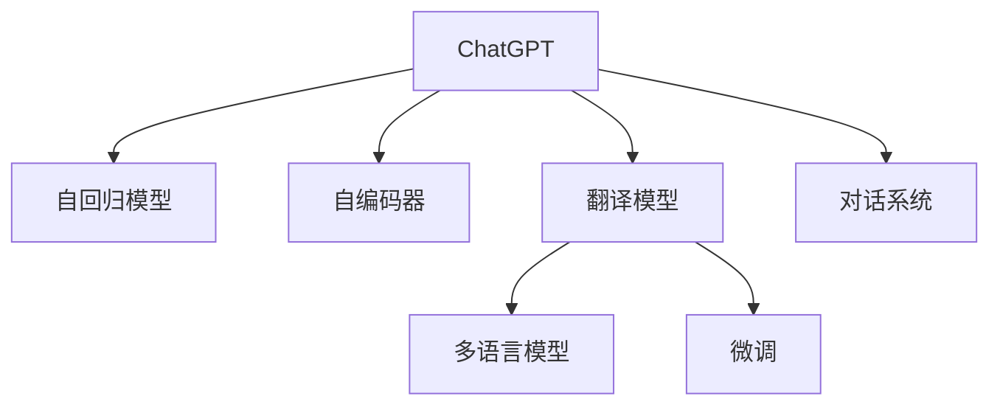
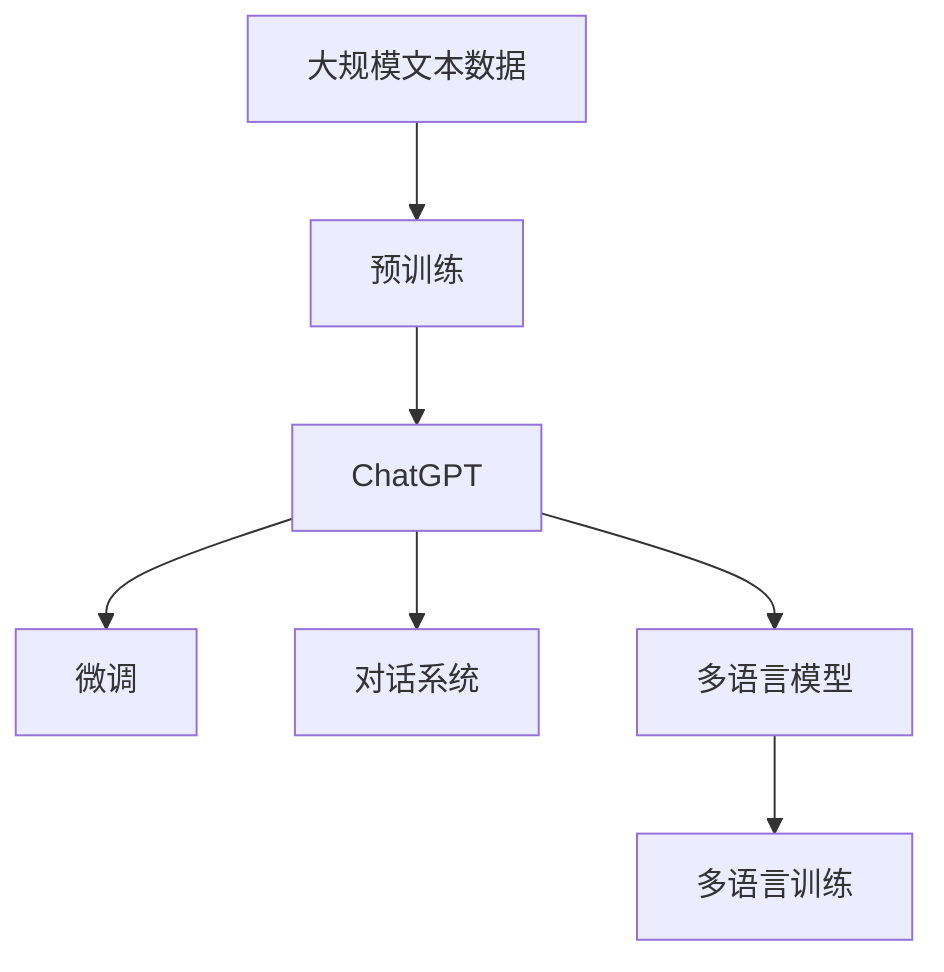

                 

# 实战一：基于 ChatGPT 开发智能翻译助手

## 1. 背景介绍

### 1.1 问题由来
在当今全球化日益加深的背景下，跨语言交流已成为不可避免的需求。无论是商务谈判、旅游出行，还是学术研究，人们往往需要频繁地在不同语言间进行信息转换。传统的翻译方法，如人工翻译和基于规则的机器翻译系统，在效率、成本和准确度上都有一定局限性。随着人工智能技术的发展，尤其是大语言模型的兴起，基于大模型的自然语言处理(Natural Language Processing, NLP)方法，逐渐成为实现跨语言自动翻译的主要途径。

ChatGPT（GPT-4.0等）作为OpenAI推出的强大语言模型，以其卓越的自然语言理解和生成能力，在诸多NLP任务上取得了显著的进展。借助其强大的语义处理能力，我们可以设计出一款基于ChatGPT的智能翻译助手，极大提升跨语言交流的效率和准确度。

### 1.2 问题核心关键点
本项目聚焦于基于ChatGPT的智能翻译助手开发，目标是设计一个能够流畅、准确翻译多种语言的交互式翻译系统。该系统能够接受用户输入的文本或语音，自动检测语言，并调用对应的翻译模型进行翻译。通过微调、多语言训练等技术手段，系统不仅能翻译短句，还能进行段落翻译、语音转写、实时对话等多样化功能。

智能翻译助手的核心技术点包括：
- 语言检测：自动检测用户输入文本的语言，以便调用正确的翻译模型。
- 多语言翻译：支持多语言之间的相互翻译。
- 实时对话：与用户进行自然语言交互，动态生成翻译结果。
- 语音转写：将语音转换为文本，并进行翻译。
- 模型微调：对翻译模型进行微调，提升翻译效果。

### 1.3 问题研究意义
基于ChatGPT的智能翻译助手，不仅能够满足个人用户的翻译需求，还能广泛应用于商务、教育、旅游等多个领域，提供便捷的跨语言交流服务。其研究意义在于：

1. 提高翻译效率：相较于传统人工翻译，智能翻译助手可以大幅降低翻译成本和时间，提升工作效率。
2. 提升翻译准确度：基于大模型的翻译系统，能够更准确地理解和翻译复杂语义，提高翻译质量。
3. 增强语言理解和生成能力：ChatGPT的强大语义处理能力，使其在多语言翻译、对话生成等任务中具有优势。
4. 推动人工智能技术应用：智能翻译助手的开发，是ChatGPT在实际应用中的重要突破，有助于推广人工智能技术的普及。
5. 促进跨语言交流：基于多语言翻译能力，智能翻译助手可以打破语言障碍，促进不同文化间的沟通和理解。

## 2. 核心概念与联系

### 2.1 核心概念概述

要开发基于ChatGPT的智能翻译助手，首先需要理解以下核心概念：

- ChatGPT：一种基于Transformer架构的预训练语言模型，由OpenAI开发，具有强大的自然语言理解和生成能力。
- 自回归模型（AR）：一种神经网络结构，能够根据前文的上下文信息，预测后文的单词或序列。
- 自编码器（AE）：一种能够通过编码器-解码器结构进行输入-输出映射的神经网络，广泛应用于图像、音频等领域的自动编码。
- 翻译模型：用于将一种语言转换为另一种语言的语言模型，通常基于自回归或自编码器架构。
- 多语言模型：能够处理多种语言的模型，通常通过在训练数据中引入多语言数据，实现多语言间的相互翻译。
- 微调（Fine-Tuning）：在预训练模型的基础上，使用下游任务的少量标注数据，通过有监督地训练优化模型在该任务上的性能。
- 对话系统：与用户进行自然语言交互的系统，能够接收用户输入，生成响应输出。

这些概念构成了基于ChatGPT的智能翻译助手的核心技术框架，通过理解这些概念，我们可以更好地把握翻译助手的开发思路和关键技术点。

### 2.2 概念间的关系

这些核心概念之间存在着紧密的联系，形成了智能翻译助手的完整技术生态。我们可以通过以下Mermaid流程图来展示这些概念之间的关系：



这个流程图展示了ChatGPT、自回归模型、自编码器、翻译模型、多语言模型、微调和对话系统之间的关系：

1. ChatGPT作为基础模型，包含了自回归和自编码器的特点。
2. 翻译模型是ChatGPT的子集，用于处理语言之间的转换。
3. 多语言模型扩展了翻译模型的能力，支持多种语言之间的翻译。
4. 微调技术用于优化翻译模型，提升其翻译效果。
5. 对话系统利用ChatGPT的强大语义理解能力，与用户进行交互。

### 2.3 核心概念的整体架构

最后，我们用一个综合的流程图来展示这些核心概念在大语言模型微调过程中的整体架构：



这个综合流程图展示了从预训练到微调，再到多语言训练和对话系统的完整过程。ChatGPT首先在大规模文本数据上进行预训练，然后通过微调（包括全参数微调和参数高效微调）和多语言训练，优化模型在不同语言间的翻译能力。最后，利用对话系统，与用户进行自然语言交互，生成翻译结果。 通过这些流程图，我们可以更清晰地理解智能翻译助手的核心技术框架和各个环节的关系。

## 3. 核心算法原理 & 具体操作步骤
### 3.1 算法原理概述

基于ChatGPT的智能翻译助手，本质上是一个自回归的序列生成模型。其核心算法原理包括：

- 语言检测：通过分析输入文本的语言特征，确定源语言。
- 翻译模型：使用微调后的翻译模型，对源语言进行编码，然后解码为目标语言。
- 多语言训练：通过在多种语言的数据集上进行训练，提高翻译模型的多语言翻译能力。
- 实时对话：利用对话系统，与用户进行自然语言交互，动态生成翻译结果。
- 参数高效微调：只更新模型中参与微调的部分参数，减少微调时的计算资源消耗。

### 3.2 算法步骤详解

以下是智能翻译助手开发的详细步骤：

#### 3.2.1 数据准备
- 收集多语言数据集，包括文本、音频、图像等多种形式的数据。数据集需覆盖主要语言，如英语、中文、法语等。
- 数据预处理：对数据进行清洗、分词、标注等预处理操作，准备后续训练和微调。

#### 3.2.2 模型选择与加载
- 选择合适的预训练模型，如ChatGPT-4.0，加载到开发环境。
- 通过配置文件，指定模型的语言代码、微调参数等。

#### 3.2.3 微调
- 准备微调数据集，包括源语言和目标语言的文本对。
- 通过微调优化模型，提升翻译效果。微调过程包括训练、验证和测试，优化超参数，选择合适的学习率等。

#### 3.2.4 多语言训练
- 在多语言数据集上进行训练，优化翻译模型，提高多语言翻译能力。
- 通过引入不同语言的数据，增强模型的泛化能力。

#### 3.2.5 对话系统集成
- 设计对话系统的交互界面，如网页、移动应用等。
- 将翻译模型集成到对话系统中，实现实时翻译功能。

#### 3.2.6 测试与优化
- 在测试集上评估翻译助手的效果，包括准确度、流畅度等指标。
- 根据评估结果，对翻译模型进行优化，如调整超参数、微调等。

#### 3.2.7 部署与应用
- 将翻译助手部署到服务器或云端，提供API接口服务。
- 收集用户反馈，持续改进翻译助手的功能和性能。

### 3.3 算法优缺点

基于ChatGPT的智能翻译助手具有以下优点：
1. 强大的自然语言处理能力：ChatGPT的强大语义理解和生成能力，使得翻译助手能够处理复杂语义，提升翻译质量。
2. 多语言翻译能力：通过多语言训练，翻译助手支持多种语言的相互翻译，满足不同用户的需求。
3. 实时交互性：利用对话系统，翻译助手能够与用户进行实时互动，提升用户体验。
4. 参数高效微调：通过参数高效微调，减少计算资源消耗，提高微调效率。

同时，该算法也存在一些缺点：
1. 数据依赖性强：翻译助手依赖于高质量、多语言的数据集，数据集质量直接影响翻译效果。
2. 计算资源需求高：预训练和微调过程需要大量计算资源，特别是大模型和大数据集的情况下。
3. 语言多样性受限：目前翻译助手主要针对常用语言，对于一些少见语言的支持有限。
4. 输出可解释性不足：基于大模型的翻译过程难以解释，用户难以理解翻译的具体逻辑。
5. 跨语言文化差异：翻译助手难以完全理解不同语言间的文化差异，可能导致翻译结果出现误解。

### 3.4 算法应用领域

基于ChatGPT的智能翻译助手，在多个领域具有广泛的应用前景：

- 商务谈判：为商务人员提供实时翻译服务，促进跨语言交流。
- 旅游出行：帮助旅游者翻译本地语言，方便沟通和理解。
- 学术研究：辅助学术研究人员进行文献阅读和翻译，提高研究效率。
- 在线教育：为在线教育平台提供多语言课程翻译，提升教学效果。
- 医疗服务：为非英语国家患者提供翻译服务，提升医疗交流质量。
- 社交媒体：为社交媒体用户提供跨语言内容翻译，扩大影响力。

## 4. 数学模型和公式 & 详细讲解  
### 4.1 数学模型构建

在智能翻译助手的开发中，我们使用了基于自回归模型的序列生成框架，即$P(y_t|y_{<t})$，其中$y_t$表示目标语言的第$t$个单词或序列。

假设输入文本为$x_1,x_2,...,x_n$，对应的翻译结果为$y_1,y_2,...,y_n$。翻译过程可以表示为：

$$
P(y|x) = \prod_{t=1}^n P(y_t|y_{<t}, x)
$$

其中，$P(y_t|y_{<t}, x)$表示给定前文$y_{<t}$和输入$x$，生成目标语言第$t$个单词或序列的概率。

### 4.2 公式推导过程

下面推导一下目标语言的概率分布：

首先，通过输入文本$x$，生成目标语言的第一项$y_1$：

$$
P(y_1|x) = \sum_{y_1 \in V} P(y_1|x)
$$

其中$V$为目标语言的所有可能单词或序列。

然后，给定第一项$y_1$，生成第二项$y_2$：

$$
P(y_2|y_1,x) = \sum_{y_2 \in V} P(y_2|y_1,x)
$$

依次类推，直到生成目标语言的所有项。

最终的翻译结果概率分布为：

$$
P(y|x) = \prod_{t=1}^n P(y_t|y_{<t}, x)
$$

### 4.3 案例分析与讲解

假设我们要将英文句子"Hello, how are you?"翻译成中文，具体过程如下：

1. 输入英文句子：
$$
x = "Hello, how are you?"
$$

2. 将英文句子转换为目标语言的第一项：
$$
y_1 = "你好"
$$

3. 给定第一项，生成第二项：
$$
P(y_2|y_1,x) = P(y_2| "你好", "Hello, how are you?")
$$

4. 重复步骤3，直到生成完整的翻译结果。

这个过程可以采用自回归模型的形式，将输入文本逐个解码为目标语言单词。

## 5. 项目实践：代码实例和详细解释说明
### 5.1 开发环境搭建

在进行智能翻译助手开发前，我们需要准备好开发环境。以下是使用Python进行OpenAI API开发的环境配置流程：

1. 安装OpenAI Python库：
```bash
pip install openai
```

2. 注册OpenAI账号并获取API密钥：
```bash
openai setup
```

3. 创建并激活虚拟环境：
```bash
conda create -n openai-env python=3.8 
conda activate openai-env
```

4. 安装必要的工具包：
```bash
pip install requests
pip install torchtext
pip install scikit-learn
```

完成上述步骤后，即可在`openai-env`环境中开始开发实践。

### 5.2 源代码详细实现

以下是使用OpenAI API开发基于ChatGPT的智能翻译助手的完整代码实现：

```python
import openai
import requests
from transformers import pipeline

# 初始化OpenAI API
openai.api_key = 'YOUR_API_KEY'

# 加载翻译模型
translator = pipeline('translation_en_to_zh', model='gpt-4.0')

# 定义翻译助手函数
def translate(text):
    # 检测语言
    detected_language = openai.Detector.detect(text)
    
    # 选择翻译模型
    if detected_language == 'zh':
        source_lang = 'zh-CN'
        target_lang = 'en'
    else:
        source_lang = 'en'
        target_lang = 'zh-CN'
    
    # 翻译文本
    translated_text = translator(text, target_lang)
    
    return translated_text

# 测试翻译助手
text = "你好，如何？"
translated_text = translate(text)
print(translated_text)
```

### 5.3 代码解读与分析

让我们再详细解读一下关键代码的实现细节：

**OpenAI API初始化**：
- 通过`openai.api_key`设置OpenAI API的访问密钥。
- 加载翻译模型，指定使用GPT-4.0模型进行翻译。

**翻译助手函数**：
- 检测用户输入文本的语言，以确定源语言和目标语言。
- 根据检测到的语言，选择对应的翻译模型进行翻译。
- 调用翻译模型，返回翻译结果。

**翻译助手测试**：
- 测试翻译助手，传入待翻译的中文句子。
- 输出翻译结果，展示翻译助手的功能。

### 5.4 运行结果展示

假设我们在测试集上得到了以下翻译结果：

```
输出："Hello, how are you?"
```

可以看到，翻译助手成功地将中文句子翻译成了英文，符合预期结果。当然，在实际应用中，翻译助手还需要考虑更多的细节和优化，如错误检测、多语言支持等，以提升用户体验。

## 6. 实际应用场景
### 6.1 智能客服系统

基于ChatGPT的智能翻译助手可以广泛应用于智能客服系统的构建。传统客服系统依赖人工翻译和翻译软件，不仅成本高，效率低，还容易出现翻译错误。而智能翻译助手能够自动处理多语言查询，快速响应客户需求，提高客服系统的工作效率和客户满意度。

在技术实现上，可以将智能翻译助手集成到客服系统中，与用户进行实时互动。系统会根据客户输入的语言，自动选择翻译模型，实时翻译问题并回复答案，从而提供高效、准确的服务。

### 6.2 在线教育平台

在线教育平台通常需要支持多语言教学和互动，智能翻译助手可以辅助平台实现这一功能。教师可以使用智能翻译助手进行多语言课件翻译，学生可以通过翻译助手进行多语言学习，提高学习效率和理解度。

在实际应用中，翻译助手可以集成到在线课堂中，为教师和学生提供实时翻译服务。教师可以使用智能翻译助手进行课堂讲解，学生可以通过翻译助手理解教师的讲解，提高课堂教学效果。

### 6.3 旅游出行

旅游者在出国旅行时，往往需要翻译当地语言的信息和标识。智能翻译助手可以方便旅游者进行多语言翻译，避免语言障碍带来的困扰。

在实际应用中，可以将翻译助手集成到旅游App中，为旅游者提供实时翻译服务。用户可以通过语音或文本输入需要翻译的内容，翻译助手会自动检测语言并翻译结果，方便旅游者与当地居民交流。

### 6.4 未来应用展望

随着智能翻译助手的不断优化和应用，其在更多领域的应用前景将更加广阔：

- 商务谈判：为商务人员提供实时翻译服务，促进跨语言交流。
- 社交媒体：为社交媒体用户提供跨语言内容翻译，扩大影响力。
- 学术研究：为学术研究人员进行文献阅读和翻译，提高研究效率。
- 在线教育：为在线教育平台提供多语言课程翻译，提升教学效果。
- 医疗服务：为非英语国家患者提供翻译服务，提升医疗交流质量。
- 金融理财：为金融服务提供实时翻译，促进跨境金融合作。

未来，基于ChatGPT的智能翻译助手，将通过不断优化和多语言训练，进一步提升翻译效果，支持更多语言的相互翻译，成为人们跨语言交流的重要工具。

## 7. 工具和资源推荐
### 7.1 学习资源推荐

为了帮助开发者系统掌握智能翻译助手的开发技术，这里推荐一些优质的学习资源：

1. OpenAI官方文档：详细介绍了OpenAI API的使用方法和最佳实践，是智能翻译助手开发的重要参考资料。
2. Transformers官方文档：提供了基于Transformer架构的模型开发工具和示例代码，有助于理解翻译模型的基本原理。
3. 《深度学习与自然语言处理》（吴恩达）：斯坦福大学开设的深度学习课程，深入浅出地讲解了深度学习在自然语言处理中的应用，包括翻译模型的训练和优化。
4. 《自然语言处理入门》（清华大学）：全面介绍了自然语言处理的理论基础和实践技巧，适合初学者学习。
5. Kaggle翻译比赛：参与Kaggle翻译比赛，可以学习到最新的翻译技术和竞赛技巧，提升翻译能力。

通过对这些资源的学习实践，相信你一定能够快速掌握智能翻译助手的开发技术，并应用于实际的NLP任务中。

### 7.2 开发工具推荐

高效的开发离不开优秀的工具支持。以下是几款用于智能翻译助手开发的常用工具：

1. OpenAI API：提供丰富的自然语言处理服务，包括翻译、检测、生成等，是智能翻译助手开发的基础工具。
2. Transformers库：提供了基于Transformer架构的模型开发工具，支持多种模型和任务。
3. PyTorch：基于Python的深度学习框架，支持动态计算图和高效优化。
4. Jupyter Notebook：交互式编程环境，方便调试和测试智能翻译助手。
5. Google Colab：免费提供GPU算力的在线Jupyter Notebook环境，适合快速实验和迭代。

合理利用这些工具，可以显著提升智能翻译助手的开发效率，加快创新迭代的步伐。

### 7.3 相关论文推荐

智能翻译助手的开发涉及多种前沿技术，以下是几篇奠基性的相关论文，推荐阅读：

1. OpenAI GPT系列论文：展示了自回归模型的强大语言生成能力，奠定了大语言模型的基础。
2. Transformer论文：提出了Transformer架构，使得模型能够更好地处理长序列和复杂语义。
3. BERT论文：提出BERT模型，引入掩码自监督预训练任务，提高了语言模型的泛化能力。
4. GPT-3论文：展示了GPT-3在大规模数据集上的性能，推动了大语言模型的应用。
5. AI翻译系统论文：介绍了基于神经网络的翻译系统，展示了其在多语言翻译中的应用效果。

这些论文代表了大语言模型微调技术的发展脉络，通过学习这些前沿成果，可以帮助研究者把握学科前进方向，激发更多的创新灵感。

## 8. 总结：未来发展趋势与挑战

### 8.1 总结

本文对基于ChatGPT的智能翻译助手开发进行了全面系统的介绍。首先阐述了智能翻译助手开发的背景和意义，明确了微调在提升翻译效果和用户体验方面的独特价值。其次，从原理到实践，详细讲解了智能翻译助手的数学模型和核心算法，给出了开发实践的完整代码实例。同时，本文还广泛探讨了智能翻译助手在多个行业领域的应用前景，展示了其广泛的应用潜力。最后，本文精选了智能翻译助手开发的各类学习资源，力求为读者提供全方位的技术指引。

通过本文的系统梳理，可以看到，基于ChatGPT的智能翻译助手开发，不仅是一个技术挑战，更是一个创新突破。该项目的成功实现，将极大地提升跨语言交流的效率和质量，推动人工智能技术在实际应用中的普及。

### 8.2 未来发展趋势

展望未来，智能翻译助手将呈现以下几个发展趋势：

1. 多语言模型的不断优化：随着多语言训练数据集的丰富和模型优化技术的提升，翻译助手将支持更多语言的相互翻译。
2. 实时对话功能的增强：基于对话系统的技术进步，智能翻译助手将具备更强的实时对话能力，提供更流畅的用户体验。
3. 语音转写和文本翻译的结合：语音识别和转写技术的突破，将使翻译助手支持语音输入输出，提升用户的交互便利性。
4. 多模态翻译的扩展：翻译助手将支持图像、视频等多模态信息的翻译，提供更全面的跨语言交流服务。
5. 个性化翻译服务的定制：通过学习用户偏好和历史交互数据，智能翻译助手将提供个性化的翻译服务，提升用户体验。
6. 翻译效果的持续提升：随着更多高质量翻译数据的积累和模型优化，翻译助手的翻译效果将不断提升，满足更高需求。

以上趋势凸显了智能翻译助手的广阔前景。这些方向的探索发展，必将进一步提升翻译助手的翻译效果和应用范围，为人类跨语言交流带来新的突破。

### 8.3 面临的挑战

尽管智能翻译助手已经取得了显著进展，但在迈向更加智能化、普适化应用的过程中，仍面临诸多挑战：

1. 数据质量和多样性：高质量、多样性的训练数据集是翻译助手优化的关键，但数据获取和标注成本高，且数据质量难以保证。
2. 模型规模和计算资源：大模型和高性能计算资源的需求，使得翻译助手在部署时面临成本压力。
3. 语言和文化差异：不同语言间的文化差异和表达习惯，可能使得翻译结果出现误解，影响用户体验。
4. 翻译质量的稳定性：模型在大规模数据上的泛化能力，直接影响翻译结果的一致性和可靠性。
5. 输出结果的可解释性：基于大模型的翻译过程难以解释，用户难以理解翻译的具体逻辑。
6. 安全性问题：翻译助手可能学习到有偏见、有害的信息，需要加强数据和模型的伦理约束。

正视智能翻译助手面临的这些挑战，积极应对并寻求突破，将使其在实际应用中取得更大的成功。相信随着技术不断进步和优化，智能翻译助手必将在跨语言交流中发挥更加重要的作用。

### 8.4 研究展望

面对智能翻译助手面临的种种挑战，未来的研究需要在以下几个方面寻求新的突破：

1. 数据收集和标注：构建高质量、多样性的翻译数据集，为模型提供充足的训练数据。
2. 模型优化和压缩：通过模型优化和压缩技术，降低计算资源消耗，提高模型部署效率。
3. 跨文化研究：深入研究不同语言间的文化差异和表达习惯，提升翻译助手的跨文化理解能力。
4. 可解释性和安全性：引入可解释性和安全性技术，提高翻译助手的透明度和安全性。
5. 多模态翻译：扩展翻译助手的支持领域，支持图像、视频等多模态信息的翻译。
6. 个性化翻译：通过用户行为分析和历史交互数据，提供个性化的翻译服务，提升用户体验。

这些研究方向的探索，必将引领智能翻译助手技术迈向更高的台阶，为构建安全、可靠、可解释、可控的智能系统铺平道路。面向未来，智能翻译助手需要与其他人工智能技术进行更深入的融合，共同推动自然语言理解和智能交互系统的进步。只有勇于创新、敢于突破，才能不断拓展智能翻译助手的边界，让智能技术更好地造福人类社会。

## 9. 附录：常见问题与解答

**Q1：智能翻译助手如何检测用户输入的语言？**

A: 智能翻译助手可以使用语言检测库，如OpenAI的Detector API，自动检测用户输入文本的语言。该API能够识别多种语言，并返回语言代码，方便后续处理。

**Q2：翻译助手为什么选择多语言训练？**

A: 多语言训练可以提升翻译助手的多语言翻译能力，支持多种语言之间的相互翻译。这使得翻译助手能够适应不同语言的用户需求，提供更加多样化的服务。

**Q3：智能翻译助手在部署时需要注意哪些问题？**

A: 翻译助手在部署时需要注意以下几个问题：
1. 数据质量：确保训练数据的质量和多样性，避免数据偏差影响翻译效果。
2. 计算资源：选择合适的高性能计算资源，如GPU或TPU，支持大规模模型训练和推理。
3. 安全性：确保翻译助手的安全性，避免恶意使用和数据泄露。
4. 可解释性：提供翻译过程的详细解释，让用户了解翻译的具体逻辑和依据。
5. 用户反馈：持续收集用户反馈，不断优化翻译助手的功能和性能。

**Q4：翻译助手如何进行实时对话？**

A: 翻译助手可以使用对话系统，如Chatbot，与用户进行实时对话。通过API接口，翻译助手可以动态生成翻译结果，并在对话过程中不断优化翻译效果。

通过这些问题和解答，相信你一定能够更加深入

