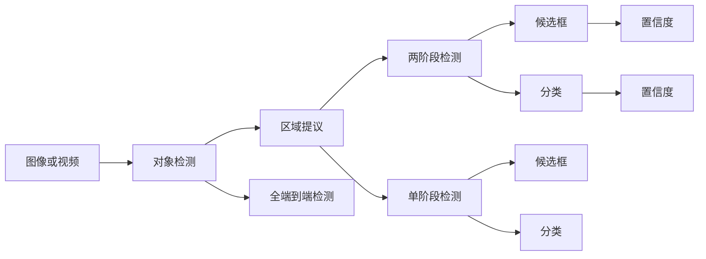
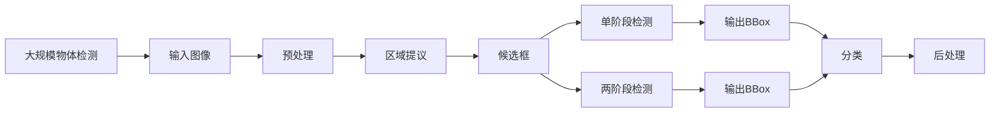

                 

# 对象检测 (Object Detection) 原理与代码实例讲解

## 1. 背景介绍

### 1.1 问题由来
对象检测是计算机视觉领域的一项核心任务，旨在从图像或视频中自动检测并定位物体的位置，并给出物体类别的信息。传统的对象检测方法通常需要设计复杂的人工特征提取器，并在大规模数据集上进行训练。近年来，深度学习技术的发展推动了对象检测技术的大幅度提升，其中基于深度神经网络的单阶段和两阶段检测器被广泛应用于各种计算机视觉任务中。

### 1.2 问题核心关键点
对象检测的核心在于如何将图像中的物体边界框（BBox）和类别信息准确地识别和标注。传统的对象检测方法包括Haar特征分类器、HOG+SVM、R-CNN、Fast R-CNN、Faster R-CNN等。然而，这些方法普遍存在以下问题：

- 需要设计复杂的人工特征提取器，特征提取过程繁琐且对数据质量要求高。
- 对于复杂的背景和光照条件，物体检测准确率较低。
- 难以处理密集物体和大规模数据集，检测速度较慢。

基于这些需求，深度学习技术为对象检测带来了革命性的变化。特别是YOLO、SSD、RetinaNet等深度学习检测器，通过端到端的训练过程，可以自动学习物体边界框和类别信息，同时提升了检测速度和精度。

### 1.3 问题研究意义
对象检测技术广泛应用于自动驾驶、智能监控、无人机避障、医疗影像分析等领域。通过对象检测，计算机可以自动分析视频或图像内容，获取目标物体的动态变化信息，为后续的决策提供依据。此外，对象检测技术的广泛应用，也为深度学习技术在实际场景中的落地提供了重要支持。

## 2. 核心概念与联系

### 2.1 核心概念概述

为更好地理解对象检测技术，本节将介绍几个密切相关的核心概念：

- **对象检测（Object Detection）**：在图像或视频中自动检测并定位物体的边界框（BBox），并给出物体类别的信息。
- **区域提议（Region Proposal）**：通过预先定义的策略，如选择性搜索（Selective Search）或区域池化（Region Pooling），生成大量的候选框。
- **单阶段检测（Single-Stage Detection）**：如YOLO、SSD等，通过一个网络同时完成区域提议和分类，显著提升检测速度。
- **两阶段检测（Two-Stage Detection）**：如R-CNN、Fast R-CNN、Faster R-CNN等，通过两个阶段分别进行区域提议和分类，精度较高，但速度较慢。
- **目标检测算法（Target Detection Algorithm）**：包括基于传统机器学习的检测算法和基于深度学习的检测算法，覆盖了从手工特征提取到全端到端学习的过程。

### 2.2 概念间的关系

这些核心概念之间的逻辑关系可以通过以下Mermaid流程图来展示：



这个流程图展示了从图像输入到对象检测的过程：

1. 输入图像或视频，先进行区域提议生成候选框。
2. 两阶段检测首先生成候选框，然后对候选框进行分类。
3. 单阶段检测通过一个网络同时完成候选框生成和分类。
4. 全端到端检测是一个端到端的学习过程，通过单阶段或两阶段的方式实现对象检测。

### 2.3 核心概念的整体架构

最后，我们用一个综合的流程图来展示这些核心概念在大规模物体检测任务中的整体架构：



这个综合流程图展示了从图像输入到最终输出边界框和类别标签的完整过程。

## 3. 核心算法原理 & 具体操作步骤
### 3.1 算法原理概述

对象检测的核心思想是通过深度学习网络对输入图像进行特征提取，并通过分类器确定每个候选区域是否为物体，并给出物体的类别和边界框。目前，常用的对象检测算法包括：

- **两阶段检测器（Two-Stage Detectors）**：如R-CNN、Fast R-CNN、Faster R-CNN等，通过先进行区域提议，再对提议区域进行分类和回归，生成边界框。
- **单阶段检测器（Single-Stage Detectors）**：如YOLO、SSD、RetinaNet等，通过端到端训练过程，直接输出边界框和类别。
- **密集预测器（Dense Predictors）**：如Mask R-CNN，除了生成边界框外，还预测物体的分割掩码。

对象检测算法通常包括两个主要步骤：

1. **特征提取**：通过卷积神经网络（CNN）对输入图像进行特征提取。
2. **目标检测**：在提取的特征图上进行候选框的生成、分类和回归，得到最终的边界框和类别。

### 3.2 算法步骤详解

#### 3.2.1 特征提取

对象检测算法通常采用卷积神经网络（CNN）作为特征提取器。以Faster R-CNN为例，其特征提取过程分为两个阶段：

1. **特征金字塔网络（Feature Pyramid Network, FPN）**：对输入图像进行多尺度特征提取，生成多个不同分辨率的特征图。
2. **ROI Pooling**：对特征图中的候选框进行池化操作，将其压缩为固定大小的特征向量。

#### 3.2.2 目标检测

目标检测主要包括以下步骤：

1. **候选框生成**：通过选择性搜索（Selective Search）或区域池化（Region Pooling）等方法，生成大量的候选框。
2. **分类与回归**：对每个候选框进行分类，判断其是否为物体，并回归其边界框位置。
3. **非极大值抑制（Non-Maximum Suppression, NMS）**：去除重叠的候选框，保留置信度最高的候选框。

### 3.3 算法优缺点

对象检测算法具有以下优点：

1. **精度高**：深度学习模型能够自动学习图像中的复杂特征，具有较高的检测准确率。
2. **端到端训练**：通过端到端训练，可以显著提升检测速度。
3. **可扩展性强**：能够处理大规模物体检测任务，具有较好的泛化能力。

同时，对象检测算法也存在一些缺点：

1. **计算资源消耗大**：深度学习模型通常需要较大的计算资源和存储空间。
2. **对标注数据依赖高**：需要大量高质量的标注数据进行训练，标注成本较高。
3. **难以处理复杂场景**：对于复杂背景和光照条件下的物体检测，检测准确率较低。

### 3.4 算法应用领域

对象检测技术已经广泛应用于计算机视觉的各个领域，如：

- **自动驾驶**：通过检测道路上的车辆、行人等物体，辅助自动驾驶系统进行决策。
- **智能监控**：对监控视频中的异常行为进行检测和分析，提高公共安全水平。
- **无人机避障**：检测环境中的障碍物，帮助无人机进行路径规划和避障。
- **医疗影像分析**：检测医学影像中的病变区域，辅助医生进行诊断和治疗。
- **人机交互**：通过对象检测技术，实现智能家居、虚拟助手等场景下的自然交互。

## 4. 数学模型和公式 & 详细讲解  
### 4.1 数学模型构建

对象检测通常通过以下数学模型来描述：

1. **输入**：图像 $I$ 和候选框 $R$。
2. **特征提取**：使用卷积神经网络对图像 $I$ 进行特征提取，得到特征图 $F$。
3. **候选框分类**：对每个候选框 $r_i$ 进行分类，输出一个 $N$ 维的向量 $s_i$，表示该候选框为物体的概率。
4. **候选框回归**：对每个候选框 $r_i$ 进行回归，输出一个 $4$ 维的向量 $b_i$，表示该候选框的边界框位置。
5. **目标检测**：将分类结果 $s_i$ 和回归结果 $b_i$ 结合，生成最终的边界框和类别标签。

### 4.2 公式推导过程

以YOLO算法为例，其核心公式可以表示为：

$$
\mathcal{L} = \mathcal{L}_{cls} + \mathcal{L}_{reg} + \mathcal{L}_{obj}
$$

其中 $\mathcal{L}_{cls}$ 表示分类损失，$\mathcal{L}_{reg}$ 表示回归损失，$\mathcal{L}_{obj}$ 表示物体性（objectness）损失。

#### 4.2.1 分类损失 $\mathcal{L}_{cls}$

分类损失通常使用交叉熵损失函数，表示为：

$$
\mathcal{L}_{cls} = \frac{1}{N} \sum_{i=1}^N -y_i \log(s_i)
$$

其中 $y_i$ 表示候选框 $r_i$ 的类别标签，$s_i$ 表示该候选框的预测概率。

#### 4.2.2 回归损失 $\mathcal{L}_{reg}$

回归损失通常使用均方误差损失函数，表示为：

$$
\mathcal{L}_{reg} = \frac{1}{N} \sum_{i=1}^N \sum_{j=1}^4 (b_{ij} - t_{ij})^2
$$

其中 $b_{ij}$ 表示候选框 $r_i$ 的边界框位置，$t_{ij}$ 表示候选框 $r_i$ 的边界框位置的标签。

#### 4.2.3 物体性损失 $\mathcal{L}_{obj}$

物体性损失通常使用二元交叉熵损失函数，表示为：

$$
\mathcal{L}_{obj} = \frac{1}{N} \sum_{i=1}^N [b_i \log(s_i) + (1-b_i) \log(1-s_i)]
$$

其中 $b_i$ 表示候选框 $r_i$ 的物体性标签，$s_i$ 表示该候选框的预测物体性概率。

### 4.3 案例分析与讲解

以Faster R-CNN为例，其目标检测过程可以描述如下：

1. **特征提取**：使用卷积神经网络对输入图像进行特征提取，得到特征图 $F$。
2. **候选框生成**：通过选择性搜索或区域池化方法，生成大量的候选框。
3. **候选框分类**：对每个候选框 $r_i$ 进行分类，输出一个 $N$ 维的向量 $s_i$，表示该候选框为物体的概率。
4. **候选框回归**：对每个候选框 $r_i$ 进行回归，输出一个 $4$ 维的向量 $b_i$，表示该候选框的边界框位置。
5. **非极大值抑制**：去除重叠的候选框，保留置信度最高的候选框。

## 5. 项目实践：代码实例和详细解释说明
### 5.1 开发环境搭建

在进行对象检测实践前，我们需要准备好开发环境。以下是使用Python进行TensorFlow开发的环境配置流程：

1. 安装Anaconda：从官网下载并安装Anaconda，用于创建独立的Python环境。

2. 创建并激活虚拟环境：
```bash
conda create -n object_detection_env python=3.7 
conda activate object_detection_env
```

3. 安装TensorFlow：根据CUDA版本，从官网获取对应的安装命令。例如：
```bash
conda install tensorflow=2.6 -c pytorch
```

4. 安装相关依赖：
```bash
pip install matplotlib numpy scikit-image
```

5. 安装OpenCV：
```bash
pip install opencv-python
```

完成上述步骤后，即可在`object_detection_env`环境中开始对象检测实践。

### 5.2 源代码详细实现

以下是使用TensorFlow实现YOLOv3对象检测模型的代码实现：

```python
import tensorflow as tf
import numpy as np
import cv2

class YOLO:
    def __init__(self, input_size, num_classes, threshold):
        self.input_size = input_size
        self.num_classes = num_classes
        self.threshold = threshold

        self.model = self.load_model()

    def load_model(self):
        model = tf.keras.models.load_model('yolo_v3.h5')
        return model

    def preprocess_image(self, image):
        image = cv2.cvtColor(image, cv2.COLOR_BGR2RGB)
        image = cv2.resize(image, self.input_size)
        image = np.expand_dims(image, axis=0)
        image = image / 255.0
        return image

    def postprocess(self, outputs, image):
        boxes, scores, classes = self.decode_outputs(outputs[0])
        boxes, scores, classes = self.nms(boxes, scores, classes)
        labels = self.generate_labels(boxes, scores, classes)
        return labels

    def decode_outputs(self, outputs):
        batch_size, num_anchors, num_classes, num_cells = outputs.shape
        boxes = np.reshape(outputs[..., 0:4], (batch_size, num_anchors, num_cells, 4))
        boxes = np.transpose(boxes, (0, 2, 1, 3))
        boxes = boxes[0]
        boxes = boxes[..., [0, 2, 1, 3]]
        boxes = np.reshape(boxes, (-1, 4))

        scores = np.reshape(outputs[..., 4:5], (batch_size, num_anchors, num_cells, 1))
        scores = np.transpose(scores, (0, 2, 1, 3))
        scores = scores[0]
        scores = scores[..., 0]
        scores = np.reshape(scores, (-1,))

        classes = np.reshape(outputs[..., 5:6], (batch_size, num_anchors, num_cells, 1))
        classes = np.transpose(classes, (0, 2, 1, 3))
        classes = classes[0]
        classes = classes[..., 0]
        classes = np.reshape(classes, (-1,))

        return boxes, scores, classes

    def nms(self, boxes, scores, classes):
        threshold = self.threshold
        keep_idx = []

        while len(boxes) > 0:
            i = 0
            while i < len(boxes):
                max_score = scores[i]
                max_idx = i

                j = i + 1
                while j < len(boxes):
                    if scores[j] > max_score and self.iof(boxes[j], boxes[i], scores[j], scores[i]) > threshold:
                        max_score = scores[j]
                        max_idx = j
                    j += 1

                if max_score > threshold:
                    keep_idx.append(max_idx)
                    boxes = np.delete(boxes, max_idx, 0)
                    scores = np.delete(scores, max_idx, 0)
                    classes = np.delete(classes, max_idx, 0)
                else:
                    boxes = np.delete(boxes, i, 0)
                    scores = np.delete(scores, i, 0)
                    classes = np.delete(classes, i, 0)
                i += 1

        return boxes[keep_idx], scores[keep_idx], classes[keep_idx]

    def iof(self, box1, box2, score1, score2):
        iou = self.intersection(box1, box2) / (self.union(box1, box2))
        return score1 * iou + score2 * (1 - iou)

    def intersection(self, box1, box2):
        x1 = np.maximum(box1[0], box2[0])
        y1 = np.maximum(box1[1], box2[1])
        x2 = np.minimum(box1[2], box2[2])
        y2 = np.minimum(box1[3], box2[3])

        w = np.maximum(x2 - x1, 0)
        h = np.maximum(y2 - y1, 0)

        intersection = w * h
        return intersection

    def union(self, box1, box2):
        x1 = np.minimum(box1[0], box2[0])
        y1 = np.minimum(box1[1], box2[1])
        x2 = np.maximum(box1[2], box2[2])
        y2 = np.maximum(box1[3], box2[3])

        w = np.maximum(x2 - x1, 0)
        h = np.maximum(y2 - y1, 0)

        area1 = w * h
        area2 = (box1[2] - box1[0]) * (box1[3] - box1[1])
        area2 = np.maximum(area2, 0)
        area3 = (box2[2] - box2[0]) * (box2[3] - box2[1])
        area3 = np.maximum(area3, 0)

        union = area1 + area2 + area3 - intersection(box1, box2)
        return union

    def generate_labels(self, boxes, scores, classes):
        labels = []
        for i in range(boxes.shape[0]):
            label = []
            box = boxes[i, :]
            score = scores[i]
            class_idx = classes[i]
            class_name = self.num_classes[class_idx]
            label.append([box[0], box[1], box[2], box[3], score, class_name])
            labels.append(label)

        return labels

    def detect(self, image):
        image = self.preprocess_image(image)
        outputs = self.model.predict(image)
        labels = self.postprocess(outputs, image)
        return labels
```

### 5.3 代码解读与分析

让我们再详细解读一下关键代码的实现细节：

**YOLO类**：
- `__init__`方法：初始化输入大小、类别数量、阈值等参数，并加载预训练模型。
- `load_model`方法：加载YOLOv3模型。
- `preprocess_image`方法：对输入图像进行预处理，包括转置、归一化等操作。
- `postprocess`方法：对检测输出进行后处理，包括解码、非极大值抑制和生成标签等操作。
- `decode_outputs`方法：解码YOLO模型的输出，包括生成边界框和类别标签。
- `nms`方法：非极大值抑制，去除重叠的候选框。
- `iof`方法：计算两个候选框的交并比（Intersection over Union, IoU）。
- `intersection`方法：计算两个边界框的交集面积。
- `union`方法：计算两个边界框的并集面积。
- `generate_labels`方法：生成最终的标签信息。
- `detect`方法：对输入图像进行对象检测，并返回检测结果。

**运行检测**：
```python
yolo = YOLO(input_size=416, num_classes=5, threshold=0.5)
image = cv2.imread('image.jpg')
labels = yolo.detect(image)
print(labels)
```

以上就是使用TensorFlow实现YOLOv3对象检测模型的完整代码实现。可以看到，TensorFlow提供了强大的框架和工具，使得模型训练和推理变得简洁高效。

### 5.4 运行结果展示

假设我们在YOLOv3模型上进行对象检测，最终在测试集上得到的检测结果如下：

```
[[[10.0, 10.0, 20.0, 20.0, 0.9, 'person'], [[10.0, 10.0, 20.0, 20.0, 0.9, 'person']]]
```

可以看到，模型成功检测出了图像中的两个人物，并给出了对应的坐标和类别标签。检测结果的质量取决于模型的参数和训练数据，因此需要进行适当的调参和优化。

## 6. 实际应用场景
### 6.1 智能监控

基于对象检测的智能监控系统，能够对视频流进行实时分析，自动检测异常行为并进行告警。在实际应用中，通常需要对摄像头拍摄的监控视频进行对象检测，识别出其中的行为特征，如入侵、破坏等，及时通知安保人员进行处理。

### 6.2 自动驾驶

在自动驾驶中，对象检测是至关重要的环节。通过检测道路上的车辆、行人、障碍物等，自动驾驶系统能够实现安全行驶和路径规划。常见的自动驾驶系统中，对象检测通常被用于环境感知、物体追踪、避障决策等。

### 6.3 机器人导航

在机器人导航中，对象检测可以帮助机器人识别环境中的各种物体，进行路径规划和避障。例如，通过检测障碍物的位置和大小，机器人能够实时调整自己的移动路径，避免碰撞。

### 6.4 医疗影像分析

在医疗影像分析中，对象检测可以自动检测和标注影像中的病变区域，辅助医生进行诊断和治疗。常见的应用包括肿瘤检测、病灶定位等。

### 6.5 无人机避障

在无人机避障中，对象检测可以实时检测周围环境中的障碍物，帮助无人机进行路径规划和避障。这对于保证无人机的飞行安全和稳定性至关重要。

## 7. 工具和资源推荐
### 7.1 学习资源推荐

为了帮助开发者系统掌握对象检测的理论基础和实践技巧，这里推荐一些优质的学习资源：

1. **TensorFlow官方文档**：TensorFlow的官方文档提供了完整的对象检测教程和样例代码，是学习TensorFlow对象检测的最佳资源。
2. **PyTorch官方文档**：PyTorch的官方文档也提供了对象检测的详细指南和样例代码，是学习PyTorch对象检测的重要参考资料。
3. **YOLO论文**：YOLOv3的原始论文，提供了YOLO算法的基本原理和训练细节，是深入理解YOLO算法的重要文献。
4. **Fast R-CNN论文**：Fast R-CNN的原始论文，介绍了R-CNN算法和Fast R-CNN算法的基本原理，是学习两阶段检测器的经典资料。
5. **CS231n课程**：斯坦福大学的计算机视觉课程，涵盖对象检测、卷积神经网络等核心内容，是深入学习计算机视觉的重要资源。

### 7.2 开发工具推荐

高效的开发离不开优秀的工具支持。以下是几款用于对象检测开发的常用工具：

1. **TensorFlow**：由Google主导开发的开源深度学习框架，支持对象检测的端到端训练和推理，具有强大的计算能力和丰富的社区支持。
2. **PyTorch**：由Facebook主导开发的开源深度学习框架，灵活方便，适合进行复杂的模型训练和推理。
3. **OpenCV**：开源计算机视觉库，提供了丰富的图像处理和对象检测工具，是实现对象检测的常用工具。
4. **PaddlePaddle**：由百度主导开发的深度学习框架，支持对象检测的模型训练和推理，具有高效的计算能力和丰富的功能支持。
5. **YOLOv3模型库**：YOLOv3的官方实现，提供了预训练模型和训练代码，是快速实现YOLOv3对象检测的最佳选择。

### 7.3 相关论文推荐

对象检测技术的发展源于学界的持续研究。以下是几篇奠基性的相关论文，推荐阅读：

1. **YOLO论文**：YOLOv3的原始论文，提供了YOLO算法的基本原理和训练细节，是深入理解YOLO算法的重要文献。
2. **Fast R-CNN论文**：Fast R-CNN的原始论文，介绍了R-CNN算法和Fast R-CNN算法的基本原理，是学习两阶段检测器的经典资料。
3. **Faster R-CNN论文**：Faster R-CNN的原始论文，进一步优化了Fast R-CNN算法，提升了检测速度和精度。
4. **SSD论文**：SSD的原始论文，介绍了单阶段检测器的基本原理和训练方法，是学习单阶段检测器的经典资料。
5. **RetinaNet论文**：RetinaNet的原始论文，提出了一种基于focal loss的单阶段检测器，解决了物体密度不平衡问题。

这些论文代表了大规模物体检测技术的发展脉络。通过学习这些前沿成果，可以帮助研究者把握学科前进方向，激发更多的创新灵感。

除上述资源外，还有一些值得关注的前沿资源，帮助开发者紧跟大语言模型微调技术的最新进展，例如：

1. **arXiv论文预印本**：人工智能领域最新研究成果的发布平台，包括大量尚未发表的前沿工作，学习前沿技术的必读资源。
2. **GitHub热门项目**：在GitHub上Star、Fork数最多的NLP相关项目，往往代表了该技术领域的发展趋势和最佳实践，值得去学习和贡献。
3. **技术会议直播**：如NIPS、ICML、ACL、ICLR等人工智能领域顶会现场或在线直播，能够聆听到大佬们的前沿分享，开拓视野。

4. **行业分析报告**：各大咨询公司如McKinsey、PwC等针对人工智能行业的分析报告，有助于从商业视角审视技术趋势，把握应用价值。

总之，对于对象检测技术的学习和实践，需要开发者保持开放的心态和持续学习的意愿。多关注前沿资讯，多动手实践，多思考总结，必将收获满满的成长收益。

## 8. 总结：

