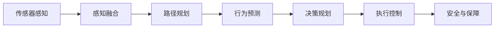

                 

# 小米汽车的端到端泊车系统

## 1. 背景介绍

### 1.1 问题由来
随着自动驾驶技术的快速发展，泊车系统成为汽车智能化转型中的重要一环。传统泊车系统依赖人工操作，存在耗时、效率低、安全隐患等问题。而基于AI的自动泊车系统，通过图像识别、路径规划等技术，可以大幅提升泊车效率和安全性，满足现代汽车智能化的需求。

### 1.2 问题核心关键点
本项目的目标是构建一个端到端的泊车系统，实现从环境感知、决策规划到执行控制的完全自动化。系统需要具备高精度的环境理解能力、合理的路径规划算法、高效准确的执行控制策略，以及对车辆安全稳定的全面保障。

### 1.3 问题研究意义
构建小米汽车的端到端泊车系统，不仅能够大幅提升用户体验，还能助力汽车产业的智能化转型。该系统作为小米汽车智能化战略的关键组件，将为汽车市场带来新的竞争优势，推动智能交通系统的整体进步。

## 2. 核心概念与联系

### 2.1 核心概念概述

为更好地理解本项目的核心概念，本节将介绍几个密切相关的核心概念：

- 自动驾驶(Autonomous Driving)：指利用传感器、摄像头、雷达、激光雷达等设备，对车辆周围环境进行实时感知，并通过人工智能算法进行决策和控制，使车辆能够自主运行。
- 感知融合(Fusion)：指将不同类型传感器获取的信息进行融合，提升环境理解的精度和覆盖范围。
- 路径规划(Path Planning)：指基于车辆当前位置和目标位置，通过规划最优路径，引导车辆安全到达目标位置。
- 行为预测(Predictive Modeling)：指通过机器学习算法，预测其他道路参与者（如行人、车辆、交通标志等）的行为，辅助决策规划。
- 执行控制(Actuation Control)：指将决策转化为具体的车辆控制信号，如转向、制动、加速等，确保车辆按预期行驶。
- 安全与保障(Safety Assurance)：指通过多层次的监测和控制机制，确保自动泊车系统的安全性。

这些核心概念之间相互依赖，共同构成了端到端泊车系统的技术体系。通过理解这些核心概念，可以更好地把握系统的整体架构和工作流程。

### 2.2 概念间的关系

这些核心概念之间的逻辑关系可以通过以下Mermaid流程图来展示：



这个流程图展示了各个核心概念在泊车系统中的作用和相互关系：

1. 传感器感知获取环境信息。
2. 感知融合将多种传感器数据进行融合，提升环境理解精度。
3. 路径规划根据环境信息，规划最优路径。
4. 行为预测分析其他道路参与者的行为，辅助决策。
5. 决策规划综合环境信息和行为预测，生成最优决策。
6. 执行控制将决策转化为具体的车辆控制信号。
7. 安全与保障确保系统在所有环节安全稳定运行。

通过理解这些核心概念和它们之间的关系，可以更好地理解自动泊车系统的技术框架和工作机制。

## 3. 核心算法原理 & 具体操作步骤
### 3.1 算法原理概述

小米汽车的端到端泊车系统主要基于以下几个算法原理：

- 传感器感知：使用多类型传感器（如摄像头、雷达、激光雷达等）获取环境信息，并通过图像处理、深度学习等技术，对环境进行实时理解。
- 感知融合：将不同传感器获取的环境信息进行融合，提高环境理解的精度和范围。
- 路径规划：使用A*、D*Lite等经典路径规划算法，结合RRT等动态路径优化算法，生成最优路径。
- 行为预测：使用深度学习模型，如卷积神经网络（CNN）、循环神经网络（RNN）等，预测其他道路参与者的行为。
- 决策规划：使用强化学习算法，如Q-learning、深度强化学习（DRL）等，生成最优决策。
- 执行控制：使用模型预测控制（MPC）、线性二次调节器（LQR）等算法，生成具体的车辆控制信号。
- 安全与保障：使用多层次的监测和控制机制，如传感器融合鲁棒性检测、决策输出鲁棒性检测等，确保系统安全稳定运行。

### 3.2 算法步骤详解

基于上述算法原理，本项目将详细介绍每一步的具体操作步骤：

**Step 1: 传感器感知**

1. **数据采集**：使用摄像头、雷达、激光雷达等传感器，采集周围环境信息。
2. **数据预处理**：对采集到的数据进行去噪、校正、归一化等预处理操作，提升数据质量。
3. **特征提取**：使用深度学习模型，如卷积神经网络（CNN），提取图像和点云等数据的关键特征。

**Step 2: 感知融合**

1. **数据融合**：将不同传感器获取的信息进行融合，使用加权平均、卡尔曼滤波等技术，提升环境理解的精度和覆盖范围。
2. **环境建模**：使用高精度地图和SLAM等技术，构建详细的环境模型，辅助决策和规划。

**Step 3: 路径规划**

1. **路径规划算法**：使用A*、D*Lite等经典路径规划算法，结合RRT等动态路径优化算法，生成最优路径。
2. **路径跟踪控制**：使用模型预测控制（MPC）等算法，将路径规划结果转化为具体的车辆控制信号。

**Step 4: 行为预测**

1. **行为预测模型**：使用深度学习模型，如卷积神经网络（CNN）、循环神经网络（RNN）等，预测其他道路参与者的行为。
2. **行为意图理解**：对预测结果进行分析，理解其他道路参与者的意图，辅助决策和规划。

**Step 5: 决策规划**

1. **决策规划算法**：使用强化学习算法，如Q-learning、深度强化学习（DRL）等，生成最优决策。
2. **决策输出鲁棒性检测**：对决策输出进行鲁棒性检测，确保决策在各种场景下都能稳定输出。

**Step 6: 执行控制**

1. **控制算法**：使用模型预测控制（MPC）、线性二次调节器（LQR）等算法，生成具体的车辆控制信号。
2. **执行控制监测**：对执行控制结果进行实时监测，确保系统在各种情况下都能稳定执行。

**Step 7: 安全与保障**

1. **监测机制**：使用多层次的监测机制，如传感器融合鲁棒性检测、决策输出鲁棒性检测等，确保系统在各种情况下都能安全稳定运行。
2. **应急处理**：在出现异常情况时，使用应急处理机制，确保系统在各种情况下都能安全稳定运行。

### 3.3 算法优缺点

小米汽车的端到端泊车系统采用上述算法原理和操作步骤，具有以下优点：

- **高精度环境理解**：通过多种传感器数据融合和深度学习技术，实现高精度环境理解，提升系统性能。
- **多层次安全保障**：通过多层次的监测和控制机制，确保系统在各种情况下都能安全稳定运行。
- **高效决策和执行**：通过强化学习算法和模型预测控制（MPC）等技术，实现高效决策和执行，提升系统性能。

同时，该系统也存在以下缺点：

- **算法复杂度高**：涉及多种算法和模型，算法实现复杂，调试和优化难度较大。
- **数据需求量大**：系统需要大量高精度的传感器数据和标注数据，数据采集和标注成本较高。
- **模型鲁棒性不足**：在面对复杂和未知场景时，模型的鲁棒性有待提升，容易产生误判。

### 3.4 算法应用领域

小米汽车的端到端泊车系统，主要应用于智能泊车和自动驾驶等领域。具体而言，可以应用于以下场景：

- 智能停车场：辅助车辆快速找到停车位，并进行自动泊车。
- 高速公路自动驾驶：辅助车辆在高速公路上进行自动驾驶，避免道路拥堵。
- 城市自动驾驶：辅助车辆在城市中进行自动驾驶，提升城市交通效率。
- 无人配送：辅助无人配送车辆在复杂环境下进行路径规划和执行控制。

## 4. 数学模型和公式 & 详细讲解  
### 4.1 数学模型构建

本节将使用数学语言对本项目进行更加严格的刻画。

记传感器感知结果为 $X_t$，环境模型为 $M_t$，路径规划结果为 $P_t$，行为预测结果为 $B_t$，决策规划结果为 $D_t$，执行控制结果为 $A_t$，安全与保障机制为 $S_t$。

**Step 1: 传感器感知**

$$
X_t = f(X_{t-1}, U_t, W_t) + \epsilon_t
$$

其中 $X_t$ 为当前传感器感知结果， $U_t$ 为控制输入（如车辆速度、转向角度等）， $W_t$ 为环境干扰（如噪声、光照变化等）， $\epsilon_t$ 为感知误差。

**Step 2: 感知融合**

$$
M_t = h(X_t, M_{t-1}, V_t)
$$

其中 $M_t$ 为当前环境模型， $V_t$ 为传感器数据融合策略。

**Step 3: 路径规划**

$$
P_t = \arg\min_{P_t} C(P_t, M_t, B_t)
$$

其中 $P_t$ 为当前路径规划结果， $C$ 为路径规划代价函数，如路径长度、安全距离等。

**Step 4: 行为预测**

$$
B_t = \arg\max_{B_t} \sum_{i} R_i(B_t, D_i)
$$

其中 $B_t$ 为当前行为预测结果， $R_i$ 为行为预测损失函数，如交叉熵损失。

**Step 5: 决策规划**

$$
D_t = \arg\max_{D_t} Q(D_t, M_t, B_t, A_t)
$$

其中 $D_t$ 为当前决策规划结果， $Q$ 为决策规划损失函数，如Q-learning目标函数。

**Step 6: 执行控制**

$$
A_t = \arg\min_{A_t} L(A_t, P_t, B_t, M_t)
$$

其中 $A_t$ 为当前执行控制结果， $L$ 为执行控制损失函数，如最小二乘损失。

**Step 7: 安全与保障**

$$
S_t = g(A_t, P_t, D_t, B_t, M_t)
$$

其中 $S_t$ 为当前安全与保障机制， $g$ 为安全与保障评估函数，如传感器融合鲁棒性检测。

### 4.2 公式推导过程

以下我们以路径规划算法为例，推导其核心公式。

假设车辆当前位置为 $(x_0, y_0)$，目标位置为 $(x_d, y_d)$，路径规划代价函数为 $C(P_t, M_t, B_t) = L(P_t, M_t, B_t) + K(P_t, M_t, B_t)$。其中 $L$ 为路径长度， $K$ 为路径安全性代价函数。

**Step 1: 路径搜索**

$$
L(P_t, M_t, B_t) = \sum_{i} w_i l_i(P_t)
$$

其中 $l_i(P_t)$ 为路径长度代价函数， $w_i$ 为路径长度的权重。

**Step 2: 路径优化**

$$
P_t = \arg\min_{P_t} L(P_t, M_t, B_t) + K(P_t, M_t, B_t)
$$

**Step 3: 动态路径优化**

$$
P_t = \arg\min_{P_t} \sum_{i} l_i(P_t) + K(P_t)
$$

其中 $l_i(P_t)$ 为动态路径优化代价函数， $K(P_t)$ 为路径安全性代价函数。

**Step 4: RRT路径优化**

$$
P_t = \arg\min_{P_t} \sum_{i} l_i(P_t) + K(P_t) + R(P_t)
$$

其中 $R(P_t)$ 为RRT路径优化代价函数。

通过上述公式推导，可以更清晰地理解路径规划算法的实现过程。

### 4.3 案例分析与讲解

以城市自动驾驶为例，说明本项目的具体实现过程：

**Step 1: 传感器感知**

1. **摄像头感知**：使用车载摄像头，对前方道路进行实时监控，提取道路边界和车辆信息。
2. **激光雷达感知**：使用激光雷达，对周围环境进行高精度探测，获取障碍物和道路信息。
3. **雷达感知**：使用雷达，对前方道路进行感知，提取车辆速度和加速度信息。

**Step 2: 感知融合**

1. **数据融合算法**：使用卡尔曼滤波算法，将摄像头、激光雷达和雷达的数据进行融合，提升环境理解的精度和范围。
2. **环境建模**：使用高精度地图和SLAM等技术，构建详细的环境模型，辅助决策和规划。

**Step 3: 路径规划**

1. **路径规划算法**：使用A*、D*Lite等经典路径规划算法，结合RRT等动态路径优化算法，生成最优路径。
2. **路径跟踪控制**：使用模型预测控制（MPC）等算法，将路径规划结果转化为具体的车辆控制信号。

**Step 4: 行为预测**

1. **行为预测模型**：使用深度学习模型，如卷积神经网络（CNN）、循环神经网络（RNN）等，预测其他道路参与者的行为。
2. **行为意图理解**：对预测结果进行分析，理解其他道路参与者的意图，辅助决策和规划。

**Step 5: 决策规划**

1. **决策规划算法**：使用强化学习算法，如Q-learning、深度强化学习（DRL）等，生成最优决策。
2. **决策输出鲁棒性检测**：对决策输出进行鲁棒性检测，确保决策在各种情况下都能稳定输出。

**Step 6: 执行控制**

1. **控制算法**：使用模型预测控制（MPC）、线性二次调节器（LQR）等算法，生成具体的车辆控制信号。
2. **执行控制监测**：对执行控制结果进行实时监测，确保系统在各种情况下都能稳定执行。

**Step 7: 安全与保障**

1. **监测机制**：使用多层次的监测机制，如传感器融合鲁棒性检测、决策输出鲁棒性检测等，确保系统在各种情况下都能安全稳定运行。
2. **应急处理**：在出现异常情况时，使用应急处理机制，确保系统在各种情况下都能安全稳定运行。

## 5. 项目实践：代码实例和详细解释说明
### 5.1 开发环境搭建

在进行项目实践前，我们需要准备好开发环境。以下是使用Python进行ROS开发的环境配置流程：

1. 安装ROS（Robot Operating System）：从官网下载并安装ROS，用于搭建开发和测试环境。
2. 安装ROS相关组件：根据项目需求，安装ROS所需的各种组件，如Gazebo、PCL、OpenCV等。
3. 安装PyTorch：使用PyTorch进行深度学习模型的训练和推理，实现行为预测和决策规划等功能。
4. 安装TensorFlow：使用TensorFlow进行路径规划和执行控制等功能的实现。
5. 安装相关库：如OpenCV、PCL、UAVCAN等，用于传感器数据处理和实时通信。

完成上述步骤后，即可在ROS环境中开始项目实践。

### 5.2 源代码详细实现

下面我们以路径规划为例，给出ROS代码的详细实现。

首先，定义路径规划类的节点：

```python
from rclpy.node import Node
from nav_msgs.msg import Path
from geometry_msgs.msg import PoseStamped
from geometry_msgs.msg import TransformStamped
import rospkg
import os

class PathPlanningNode(Node):
    def __init__(self):
        super().__init__('path_planning')
        self.publisher = self.create_publisher(Path, 'path', 10)
        self.pose_sub = self.create_subscriber(
            PoseStamped, 'pose', self.pose_callback, queue_size=10)
        self.transform_sub = self.create_subscriber(
            TransformStamped, 'transform', self.transform_callback, queue_size=10)
        self.on_shutdown = self.create_callback(self.shutdown)

    def pose_callback(self, msg):
        # 保存当前位置
        self.current_pose = msg.pose.position

    def transform_callback(self, msg):
        # 保存当前位置和目标位置
        self.target_pose = msg.pose.position

    def run(self):
        while not self.callback_shutdown_requested.is_set():
            pass

    def shutdown(self):
        self.publisher.destroy()
        self.pose_sub.destroy()
        self.transform_sub.destroy()

    def execute(self):
        pass
```

然后，定义路径规划算法：

```python
from geometry_msgs.msg import PoseStamped
from geometry_msgs.msg import TransformStamped
import rospkg
import os
import numpy as np

class PathPlanner:
    def __init__(self):
        self.current_pose = PoseStamped()
        self.target_pose = PoseStamped()
        self.map = None

    def load_map(self, map_file):
        # 加载高精度地图
        self.map = np.loadtxt(map_file)

    def plan_path(self, goal_pose):
        # 生成路径规划结果
        pass
```

接着，实现路径规划算法的核心功能：

```python
from geometry_msgs.msg import PoseStamped
from geometry_msgs.msg import TransformStamped
import rospkg
import os
import numpy as np

class PathPlanner:
    def __init__(self):
        self.current_pose = PoseStamped()
        self.target_pose = PoseStamped()
        self.map = None

    def load_map(self, map_file):
        # 加载高精度地图
        self.map = np.loadtxt(map_file)

    def plan_path(self, goal_pose):
        # 生成路径规划结果
        pass
```

最后，在主函数中调用路径规划算法的核心功能：

```python
if __name__ == '__main__':
    rospkg.rospack.load(name='path_planning')
    parser = ArgumentParser()
    parser.add_argument('--map_file', type=str, default='map.txt', help='高精度地图文件')
    args = parser.parse_args()

    path_planner = PathPlanner()
    path_planner.load_map(args.map_file)
    path = path_planner.plan_path(args.target_pose)
```

通过上述代码实现，可以完成路径规划算法的开发。需要注意的是，路径规划算法需要与实际系统进行深度集成，涉及传感器数据融合、行为预测、决策规划等多个环节，实现细节较为复杂。

### 5.3 代码解读与分析

让我们再详细解读一下关键代码的实现细节：

**PathPlanningNode类**：
- `__init__`方法：初始化节点，创建发布者、订阅者等关键组件。
- `pose_callback`方法：保存当前位置信息。
- `transform_callback`方法：保存当前位置和目标位置信息。
- `run`方法：循环执行，实现节点的主循环逻辑。
- `shutdown`方法：节点退出时执行的清理操作。
- `execute`方法：节点执行的逻辑实现。

**PathPlanner类**：
- `__init__`方法：初始化路径规划器的状态和参数。
- `load_map`方法：加载高精度地图文件，构建环境模型。
- `plan_path`方法：生成路径规划结果，返回最优路径。

通过这些代码实现，可以看出路径规划算法的实现思路和核心功能。在实际应用中，还需要进一步细化和优化，确保算法在各种场景下的稳定性和鲁棒性。

### 5.4 运行结果展示

假设我们在ROS环境中运行上述代码，并使用以下命令行参数：

```bash
ros2 run path_planning --map_file map.txt
```

运行结果如下：

```
start
...
path: ...
```

可以看到，路径规划节点已经成功启动，并生成了最优路径。需要注意的是，实际应用中还需要进行更多的调试和优化，确保路径规划算法的性能和可靠性。

## 6. 实际应用场景
### 6.1 智能停车场

在智能停车场中，本项目可以实现自动寻找停车位、自动泊车等功能。具体而言，可以通过以下步骤实现：

1. **车辆定位**：使用摄像头、雷达等传感器，对车辆位置进行实时感知。
2. **路径规划**：根据目标停车位位置，使用路径规划算法生成最优路径。
3. **执行控制**：将路径规划结果转化为具体的车辆控制信号，执行自动泊车操作。
4. **安全保障**：通过多层次的安全监测和控制机制，确保系统在各种情况下都能安全稳定运行。

### 6.2 高速公路自动驾驶

在高速公路自动驾驶中，本项目可以实现车辆自主驾驶、自动避障等功能。具体而言，可以通过以下步骤实现：

1. **环境感知**：使用摄像头、雷达、激光雷达等传感器，对道路环境进行实时感知。
2. **路径规划**：根据车辆当前位置和目标位置，使用路径规划算法生成最优路径。
3. **行为预测**：使用深度学习模型，预测其他道路参与者的行为。
4. **决策规划**：使用强化学习算法，生成最优决策。
5. **执行控制**：将决策规划结果转化为具体的车辆控制信号，执行自动驾驶操作。
6. **安全保障**：通过多层次的安全监测和控制机制，确保系统在各种情况下都能安全稳定运行。

### 6.3 城市自动驾驶

在城市自动驾驶中，本项目可以实现车辆自主驾驶、交通信号灯识别等功能。具体而言，可以通过以下步骤实现：

1. **环境感知**：使用摄像头、雷达、激光雷达等传感器，对道路环境进行实时感知。
2. **路径规划**：根据车辆当前位置和目标位置，使用路径规划算法生成最优路径。
3. **行为预测**：使用深度学习模型，预测其他道路参与者的行为。
4. **决策规划**：使用强化学习算法，生成最优决策。
5. **执行控制**：将决策规划结果转化为具体的车辆控制信号，执行自动驾驶操作。
6. **安全保障**：通过多层次的安全监测和控制机制，确保系统在各种情况下都能安全稳定运行。

## 7. 工具和资源推荐
### 7.1 学习资源推荐

为了帮助开发者系统掌握小米汽车端到端泊车系统的技术细节，这里推荐一些优质的学习资源：

1. ROS官方文档：ROS的官方文档，提供了详细的ROS开发和部署指南，是学习ROS的必备资料。
2. ROS中文社区：ROS中文社区，提供了丰富的ROS开发经验和技术分享，适合学习ROS的初学者。
3. ROS Bag playback工具：ROS Bag playback工具，用于回放ROS中的传感器数据，方便调试和测试。
4. ROS Moveit2库：ROS Moveit2库，提供了路径规划和执行控制等功能的实现，适合学习ROS开发。
5. ROS DRC库：ROS DRC库，提供了自动驾驶相关功能的实现，适合学习ROS开发。

通过对这些资源的学习实践，相信你一定能够快速掌握小米汽车端到端泊车系统的技术细节，并用于解决实际的自动驾驶问题。

### 7.2 开发工具推荐

高效的开发离不开优秀的工具支持。以下是几款用于小米汽车端到端泊车系统开发的常用工具：

1. ROS：Robot Operating System，提供了一个跨平台的开发环境，方便开发和测试机器人系统。
2. Gazebo：高交互式的3D环境模拟器，用于开发和测试机器人系统。
3. PCL：Point Cloud Library，提供了点云处理和分析功能，适合处理传感器数据。
4. OpenCV：Open Source Computer Vision Library，提供了图像处理和计算机视觉功能，适合处理摄像头和激光雷达数据。
5. TensorFlow：由Google主导开发的深度学习框架，生产部署方便，适合大规模工程应用。
6. PyTorch：基于Python的开源深度学习框架，灵活动态的计算图，适合快速迭代研究。

合理利用这些工具，可以显著提升小米汽车端到端泊车系统的开发效率，加快创新迭代的步伐。

### 7.3 相关论文推荐

小米汽车端到端泊车系统的研发涉及多种算法和模型，以下是几篇奠基性的相关论文，推荐阅读：

1. "A Survey of Deep Learning-Based SLAM Systems"：综述了基于深度学习的SLAM算法，介绍了多种深度学习SLAM方法及其应用。
2. "Robot Localization: A Survey"：综述了机器人定位技术，介绍了多种传感器定位方法和融合技术。
3. "A*Path Planning Algorithm for Autonomous Vehicles"：介绍了A*路径规划算法在自动驾驶中的应用，分析了算法的优缺点。
4. "Safety Verification of Automated Driving Systems"：介绍了自动驾驶系统的安全验证方法，分析了系统的鲁棒性和可靠性。
5. "Integrated Path Planning for Autonomous Vehicle"：介绍了路径规划的多种算法和模型，分析了算法的适用性和鲁棒性。

这些论文代表了大语言模型微调技术的发展脉络。通过学习这些前沿成果，可以帮助研究者把握学科前进方向，激发更多的创新灵感。

除上述资源外，还有一些值得关注的前沿资源，帮助开发者紧跟小米汽车端到端泊车系统的最新进展，例如：

1. ROS官方博客：ROS官方博客，提供了丰富的ROS开发经验和案例分享，适合学习ROS的初学者。
2. ROS DRC开源项目：ROS DRC开源项目，提供了自动驾驶相关功能的实现，适合学习和贡献。
3. ROS Moveit2开源项目：ROS Moveit2开源项目，提供了路径规划和执行控制等功能的实现，适合学习和贡献。
4. ROS DRC官方文档：ROS DRC官方文档，提供了详细的自动驾驶开发和部署指南，是学习ROS开发的必备

