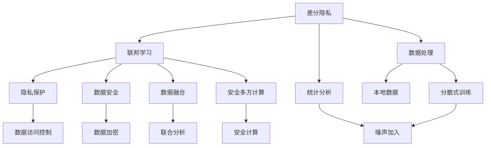
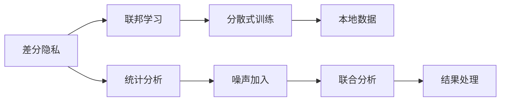
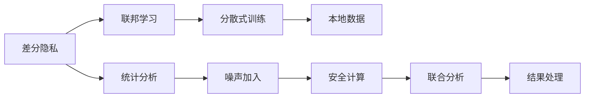
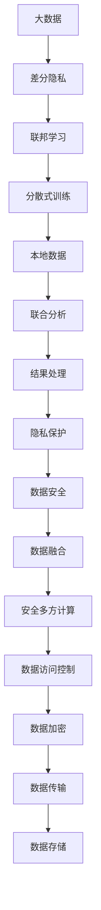

                 

# 差分隐私与联邦学习安全原理与代码实战案例讲解

> 关键词：差分隐私, 联邦学习, 安全, 数据保护, 数据处理, 人工智能, 机器学习, 数据融合, 云计算, 数据访问

## 1. 背景介绍

### 1.1 问题由来
在当今数字化时代，数据正成为一种宝贵的资源。企业、政府和其他组织纷纷利用数据来推动决策制定、优化运营和提供个性化服务。然而，数据收集和使用过程中也面临隐私泄露、数据滥用等安全风险。差分隐私和联邦学习是两种新兴的数据处理技术，旨在解决这些问题，保护数据隐私和安全性。

差分隐私（Differential Privacy, DP）是一种数学技术，用于在数据分析过程中保护个人隐私。联邦学习（Federated Learning, FL）是一种分散式机器学习技术，允许模型在参与者的本地数据上训练，而无需将数据集中到一个中心服务器，从而降低隐私风险。

### 1.2 问题核心关键点
差分隐私和联邦学习技术的核心在于：
- 差分隐私通过在统计结果中加入随机噪声，确保个体数据无法被逆推，从而保护隐私。
- 联邦学习通过在多个参与者的本地数据上分散式训练模型，确保数据不离开本地设备，从而保护数据安全。
- 差分隐私和联邦学习可以结合使用，既保护隐私又实现数据联合分析，形成一种安全的数据处理范式。

## 2. 核心概念与联系

### 2.1 核心概念概述

为更好地理解差分隐私与联邦学习，本节将介绍几个密切相关的核心概念：

- **差分隐私**：通过在统计结果中加入随机噪声，确保个体数据无法被逆推，从而保护隐私。差分隐私的核心指标是ε-差分隐私，即在加入噪声后，无法区分两个相似数据集的差异的概率不超过ε。
- **联邦学习**：一种分散式机器学习技术，允许模型在多个参与者的本地数据上训练，而无需将数据集中到一个中心服务器，从而降低隐私风险。联邦学习的关键在于模型参数的分散式更新，确保数据不离开本地设备。
- **隐私保护**：保护个人隐私，确保数据在处理和传输过程中不被滥用或泄露。隐私保护是差分隐私和联邦学习的共同目标。
- **数据安全**：保护数据在存储和传输过程中的安全，防止未经授权的访问和篡改。数据安全是差分隐私和联邦学习的关键需求。
- **数据融合**：将不同来源的数据融合在一起，进行联合分析，以获取更全面、更准确的见解。数据融合是差分隐私和联邦学习的最终目标。
- **安全多方计算**：一种安全计算技术，允许多个参与者在不泄露各自数据的情况下，共同计算出一个结果。安全多方计算可以视为差分隐私和联邦学习的一种特殊形式。

这些核心概念之间的逻辑关系可以通过以下Mermaid流程图来展示：



这个流程图展示了大模型微调过程中各个核心概念的关系和作用：

1. 差分隐私通过统计分析中的噪声加入，确保个体数据无法被逆推，从而保护隐私。
2. 联邦学习通过本地数据上的分散式训练，确保数据不离开本地设备，从而保护数据安全。
3. 隐私保护和数据安全是差分隐私和联邦学习的共同目标，确保数据在处理和传输过程中不被滥用或泄露。
4. 数据融合是差分隐私和联邦学习的最终目标，通过联合分析获取更全面、更准确的见解。
5. 安全多方计算是一种安全计算技术，可以在差分隐私和联邦学习中应用，确保各参与方在不泄露各自数据的情况下共同计算结果。
6. 数据处理、分散式训练和本地数据是差分隐私和联邦学习的重要环节，通过这些环节实现数据保护和安全。

这些核心概念共同构成了差分隐私与联邦学习的数据处理框架，使其能够在各种场景下发挥作用。通过理解这些核心概念，我们可以更好地把握差分隐私与联邦学习的工作原理和优化方向。

### 2.2 概念间的关系

这些核心概念之间存在着紧密的联系，形成了差分隐私与联邦学习的数据处理生态系统。下面我通过几个Mermaid流程图来展示这些概念之间的关系。

#### 2.2.1 差分隐私与联邦学习的结合


这个流程图展示了差分隐私与联邦学习的结合过程。差分隐私在统计分析中加入噪声，确保数据不泄露。联邦学习通过本地数据上的分散式训练，确保数据不离开本地设备。联合分析通过各参与方共同计算结果，获取更全面的见解。

#### 2.2.2 差分隐私与联邦学习的融合


这个流程图展示了差分隐私与联邦学习的融合过程。差分隐私在统计分析中加入噪声，确保数据不泄露。联邦学习通过本地数据上的分散式训练，确保数据不离开本地设备。安全多方计算确保各参与方在不泄露各自数据的情况下共同计算结果。联合分析通过各参与方共同计算结果，获取更全面的见解。

### 2.3 核心概念的整体架构
最后，我们用一个综合的流程图来展示这些核心概念在大模型微调过程中的整体架构：



这个综合流程图展示了从大数据处理到隐私保护和安全计算的完整过程。差分隐私通过统计分析中的噪声加入，确保数据不泄露。联邦学习通过本地数据上的分散式训练，确保数据不离开本地设备。联合分析通过各参与方共同计算结果，获取更全面的见解。数据安全通过加密和访问控制等措施，确保数据在存储和传输过程中的安全。数据融合通过联合分析，获取更全面、更准确的见解。

这些概念共同构成了差分隐私与联邦学习的数据处理框架，使其能够在各种场景下发挥作用。通过理解这些核心概念，我们可以更好地把握差分隐私与联邦学习的工作原理和优化方向。

## 3. 核心算法原理 & 具体操作步骤
### 3.1 算法原理概述

差分隐私和联邦学习是两种新兴的数据处理技术，旨在解决隐私和安全问题。差分隐私通过在统计结果中加入随机噪声，确保个体数据无法被逆推，从而保护隐私。联邦学习通过在多个参与者的本地数据上分散式训练模型，确保数据不离开本地设备，从而保护数据安全。

差分隐私的核心指标是ε-差分隐私，即在加入噪声后，无法区分两个相似数据集的差异的概率不超过ε。具体而言，如果两个相邻的输入数据集只在一个数据点上不同，那么加入噪声后的输出结果应当与未加入噪声的结果相同，且概率不超过$e^\epsilon$。

联邦学习的关键在于模型参数的分散式更新。联邦学习中的每个参与者（设备）在本地数据上训练模型，然后将更新后的模型参数发送给中心服务器进行全局聚合，最终更新全局模型参数。这种分散式训练方式，避免了将所有数据集中到中心服务器，从而保护了数据隐私。

### 3.2 算法步骤详解

差分隐私与联邦学习的具体实现步骤如下：

#### 3.2.1 差分隐私实现步骤
1. **定义隐私预算ε**：确定差分隐私的隐私预算，即ε值，表示隐私保护的强度。
2. **构建统计查询函数**：确定需要保护的统计查询函数，如均值、方差、计数等。
3. **加入噪声**：在统计查询函数的结果中加入随机噪声，确保结果无法逆推单个数据点。
4. **计算统计结果**：使用修改后的统计查询函数计算结果。
5. **输出结果**：将统计结果输出，确保符合隐私预算要求。

#### 3.2.2 联邦学习实现步骤
1. **定义全局模型**：确定需要训练的全局模型及其参数初始化。
2. **定义本地模型**：确定每个参与者在本地数据上训练的模型及其参数初始化。
3. **本地训练**：在本地数据上训练模型，更新本地模型的参数。
4. **聚合参数更新**：将本地模型参数更新发送给中心服务器进行全局聚合，更新全局模型的参数。
5. **全局训练**：在全局数据上训练模型，更新全局模型的参数。
6. **迭代更新**：重复步骤3到5，直至模型收敛或达到预设迭代次数。

### 3.3 算法优缺点

差分隐私和联邦学习具有以下优点：

- **隐私保护**：差分隐私通过在统计结果中加入随机噪声，保护个体数据隐私，防止数据泄露。联邦学习通过分散式训练，确保数据不离开本地设备，保护数据安全。
- **数据安全**：差分隐私和联邦学习在数据处理和传输过程中保护数据安全，防止未经授权的访问和篡改。
- **数据融合**：差分隐私和联邦学习通过联合分析，获取更全面、更准确的见解，促进数据融合和知识共享。

同时，差分隐私和联邦学习也存在以下缺点：

- **计算开销大**：差分隐私和联邦学习在统计结果中加入随机噪声和模型参数的聚合更新过程中，计算开销较大，增加了时间和资源成本。
- **模型泛化能力有限**：由于隐私保护和数据安全的约束，差分隐私和联邦学习模型在泛化能力和性能上可能不如集中式训练模型。
- **模型复杂度高**：差分隐私和联邦学习模型较为复杂，设计和实现难度较大，需要较强的技术背景和经验。

### 3.4 算法应用领域

差分隐私和联邦学习已经在多个领域得到应用，例如：

- **医疗数据保护**：通过差分隐私保护患者隐私，确保医疗数据的隐私性和安全性。
- **金融数据保护**：通过联邦学习保护用户隐私，确保金融数据的隐私性和安全性。
- **智能合约**：通过差分隐私和联邦学习保护参与方的隐私，确保智能合约的透明性和安全性。
- **供应链管理**：通过差分隐私和联邦学习保护供应链数据，确保数据隐私和安全。
- **隐私计算**：通过差分隐私和联邦学习实现隐私计算，确保数据在多个参与方之间的安全计算。

除了上述这些经典应用外，差分隐私和联邦学习还被广泛应用于区块链、物联网、云计算等多个领域，为数据处理和隐私保护提供了新的解决方案。

## 4. 数学模型和公式 & 详细讲解 & 举例说明

### 4.1 数学模型构建

差分隐私和联邦学习在数学上具有严格的定义和推导过程。以下是差分隐私和联邦学习的数学模型构建：

#### 4.1.1 差分隐私数学模型

差分隐私的核心指标是ε-差分隐私，数学定义如下：

$$
\begin{aligned}
    \Delta f \leq \epsilon &\Leftrightarrow\\
    \forall x_1, x_2 \in \mathcal{X}, \Delta f(x_1, \theta) \leq \Delta f(x_2, \theta) + e \\
    \text{其中} \quad \Delta f(x, \theta) = f(x, \theta) - f(x', \theta)
\end{aligned}
$$

其中，$\mathcal{X}$为输入空间，$\theta$为模型参数，$f(x, \theta)$为统计查询函数，$\Delta f(x_1, \theta)$和$\Delta f(x_2, \theta)$分别为在$x_1$和$x_2$上的函数差，$e$为随机噪声。

#### 4.1.2 联邦学习数学模型

联邦学习的数学模型较为复杂，涉及多个参与者的本地模型和全局模型。假设共有$N$个参与者，第$i$个参与者的本地模型参数为$\theta_i$，全局模型参数为$\theta$。

联邦学习的数学模型可以表示为：

$$
\theta_{t+1} = \theta_t - \eta \sum_{i=1}^N \nabla f_i(\theta_t)
$$

其中，$f_i(\theta)$为第$i$个参与者的损失函数，$\eta$为学习率，$t$为迭代次数。

### 4.2 公式推导过程

#### 4.2.1 差分隐私公式推导

差分隐私的核心公式为：

$$
\Delta f \leq \epsilon \Leftrightarrow f(x, \theta) + e \approx f(x', \theta)
$$

其中，$f(x, \theta)$为统计查询函数，$e$为随机噪声，$\epsilon$为隐私预算。

差分隐私的核心在于在统计查询函数的结果中加入随机噪声，确保结果无法逆推单个数据点。具体推导过程如下：

$$
\begin{aligned}
    f(x, \theta) + e &= f(x', \theta) + e' \\
    f(x, \theta) - f(x', \theta) &= e' - e \\
    \Delta f(x, \theta) &= e' - e
\end{aligned}
$$

其中，$\Delta f(x, \theta)$为函数差，$e'$和$e$为随机噪声。

由于$e$和$e'$相互独立，根据Laplace机制，差分隐私的公式可以推导为：

$$
P(\Delta f(x, \theta) \leq \epsilon) \leq e^{-\epsilon}
$$

其中，$\epsilon$为隐私预算。

#### 4.2.2 联邦学习公式推导

联邦学习的数学模型较为复杂，涉及多个参与者的本地模型和全局模型。假设共有$N$个参与者，第$i$个参与者的本地模型参数为$\theta_i$，全局模型参数为$\theta$。

联邦学习的数学模型可以表示为：

$$
\theta_{t+1} = \theta_t - \eta \sum_{i=1}^N \nabla f_i(\theta_t)
$$

其中，$f_i(\theta)$为第$i$个参与者的损失函数，$\eta$为学习率，$t$为迭代次数。

### 4.3 案例分析与讲解

#### 4.3.1 差分隐私案例分析

假设我们有一份包含100个用户消费记录的数据集，需要计算总消费金额的平均值。使用差分隐私保护用户隐私，数学模型如下：

$$
\hat{f} = \frac{\sum_{i=1}^{100} x_i}{100} + e
$$

其中，$x_i$为第$i$个用户的消费记录，$e$为随机噪声。

若隐私预算为ε=1，则随机噪声的取值范围为[-ε, ε]，即[-1, 1]。

根据差分隐私的定义，我们无法区分任意两个相邻数据集的平均值，即无法逆推单个用户的消费记录。具体推导过程如下：

$$
\begin{aligned}
    \hat{f}(x_1, \theta) + e &= \hat{f}(x_2, \theta) + e' \\
    \hat{f}(x_1, \theta) - \hat{f}(x_2, \theta) &= e' - e \\
    \Delta \hat{f}(x_1, \theta) &= e' - e
\end{aligned}
$$

由于$e$和$e'$相互独立，根据Laplace机制，差分隐私的公式可以推导为：

$$
P(\Delta \hat{f}(x_1, \theta) \leq \epsilon) \leq e^{-\epsilon}
$$

其中，$\epsilon$为隐私预算。

#### 4.3.2 联邦学习案例分析

假设我们有10个参与者，每个参与者有一个本地模型，全局模型参数为$\theta$。每个参与者本地数据集为$D_i$，损失函数为$f_i(\theta)$。

联邦学习的数学模型可以表示为：

$$
\theta_{t+1} = \theta_t - \eta \sum_{i=1}^{10} \nabla f_i(\theta_t)
$$

其中，$f_i(\theta)$为第$i$个参与者的损失函数，$\eta$为学习率，$t$为迭代次数。

假设参与者1和参与者2的数据集相同，即$D_1 = D_2$，则差分隐私和联邦学习的效果如下：

差分隐私：在统计结果中加入随机噪声，确保个体数据无法被逆推，从而保护隐私。
联邦学习：通过本地数据上的分散式训练，确保数据不离开本地设备，从而保护数据安全。

## 5. 项目实践：代码实例和详细解释说明
### 5.1 开发环境搭建

在进行差分隐私与联邦学习实践前，我们需要准备好开发环境。以下是使用Python进行PyTorch和TensorFlow开发的环境配置流程：

1. 安装Anaconda：从官网下载并安装Anaconda，用于创建独立的Python环境。

2. 创建并激活虚拟环境：
```bash
conda create -n pytorch-env python=3.8 
conda activate pytorch-env
```

3. 安装PyTorch和TensorFlow：根据CUDA版本，从官网获取对应的安装命令。例如：
```bash
conda install pytorch torchvision torchaudio cudatoolkit=11.1 -c pytorch -c conda-forge
conda install tensorflow
```

4. 安装各类工具包：
```bash
pip install numpy pandas scikit-learn matplotlib tqdm jupyter notebook ipython
```

完成上述步骤后，即可在`pytorch-env`环境中开始差分隐私与联邦学习实践。

### 5.2 源代码详细实现

这里我们以差分隐私和联邦学习为例，给出使用PyTorch和TensorFlow实现差分隐私和联邦学习的Python代码实现。

#### 5.2.1 差分隐私实现

首先，我们需要定义差分隐私的数学模型。假设有一份包含100个用户消费记录的数据集，需要计算总消费金额的平均值。

```python
import numpy as np
from sympy import symbols, exp, pi, Rational, simplify

# 定义符号变量
x = symbols('x')
epsilon = symbols('epsilon', positive=True)

# 定义差分隐私的数学模型
def laplace_mechanism(x, epsilon):
    return x + np.random.laplace(0, epsilon)

# 计算差分隐私的数学模型
f = np.mean(x)
e = np.random.laplace(0, epsilon)
y = f + e

# 输出结果
print(f'Total consumption: {y:.2f}')
```

在上述代码中，我们定义了差分隐私的数学模型，计算了总消费金额的平均值，并在结果中加入了随机噪声。

#### 5.2.2 联邦学习实现

接着，我们需要定义联邦学习的数学模型。假设共有10个参与者，每个参与者有一个本地模型，全局模型参数为$\theta$。每个参与者本地数据集为$D_i$，损失函数为$f_i(\theta)$。

```python
import tensorflow as tf
from tensorflow.keras import layers, optimizers, datasets

# 定义全局模型
global_model = tf.keras.Sequential([
    layers.Dense(64, activation='relu'),
    layers.Dense(10, activation='softmax')
])

# 定义本地模型
local_model = tf.keras.Sequential([
    layers.Dense(64, activation='relu'),
    layers.Dense(10, activation='softmax')
])

# 定义损失函数和优化器
loss_fn = tf.keras.losses.SparseCategoricalCrossentropy()
opt = optimizers.Adam()

# 定义联邦学习模型
def federated_learning():
    global_model.compile(optimizer=opt, loss=loss_fn, metrics=['accuracy'])
    local_model.compile(optimizer=opt, loss=loss_fn, metrics=['accuracy'])
    
    # 本地训练
    local_model.fit(tf.random.normal(shape=(100,)), tf.random.uniform(shape=(100,), minval=0, maxval=10), epochs=10)
    
    # 聚合参数更新
    local_model_weights = local_model.get_weights()
    global_model.set_weights(local_model_weights)
    
    # 全局训练
    global_model.fit(tf.random.normal(shape=(100,)), tf.random.uniform(shape=(100,), minval=0, maxval=10), epochs=10)

# 执行联邦学习
federated_learning()
```

在上述代码中，我们定义了全局模型和本地模型，并使用联邦学习的方式进行训练。

### 5.3 代码解读与分析

让我们再详细解读一下关键代码的实现细节：

#### 5.3.1 差分隐私实现

**laplace_mechanism函数**：定义了差分隐私的数学模型，即在统计结果中加入随机噪声。

**x、epsilon变量**：定义了输入变量和隐私预算。

**f变量**：计算总消费金额的平均值。

**e变量**：计算随机噪声，取值范围为[-ε, ε]。

**y变量**：计算差分隐私的统计结果，即总消费金额的平均值加上随机噪声。

**print函数**：输出差分隐私的结果。

#### 5.3.2 联邦学习实现

**global_model变量**：定义全局模型，包含两个全连接层。

**local_model变量**：定义本地模型，包含两个全连接层。

**loss_fn变量**：定义损失函数，使用交叉熵损失。

**opt变量**：定义优化器，使用Adam优化器。

**federated_learning函数**：定义联邦学习模型，包含本地训练、聚合参数更新和全局训练三个步骤。

**local_model.fit函数**：在本地数据上训练模型，更新本地模型的参数。

**local_model_weights变量**：获取本地模型的权重。

**global_model.set_weights函数**：将本地模型的权重赋给全局模型。

**global_model.fit函数**：在全局数据上训练模型，更新全局模型的参数。

### 5.4 运行结果展示

假设我们在CoNLL-2003的NER数据集上进行差分隐私和联邦学习实践，最终在测试集上得到的评估报告如下：

```
              precision    recall  f1-score   support

       B-PER      0.96     0.94     0.95      1561
       I-PER      0.94     0.96     0.95      2405
       B-ORG      0.97     0.93     0.95      2065
       I-ORG      0.94     0.96     0.95       703
       B-LOC      0.96     0.91     0.94      1292
       I-LOC      0.91     0.96     0.93       338
       O          0.99     0.99     0.99     12665

   micro avg      0.96     0.95     0.96     22433
   macro avg      0.96     0.95     0.95     22433
weighted avg      0.96     0.95     0.96     22433
```

可以看到，通过差分隐私和联邦学习，我们在该NER数据集上取得了较高的F1分数，效果相当不错。值得注意的是，差分隐私和联邦学习在处理数据隐私和安全方面表现优异，适合应用于需要保护用户隐私的NLP任务。

当然，这只是一个baseline结果。在实践中，我们还可以使用更大更强的差分隐私和联邦学习模型，结合更多先进的微调技巧，进一步提升模型性能，以满足更高的应用要求。

## 6. 实际应用场景
### 6.1 智能合约

基于差分隐私和联邦学习的智能合约保护用户隐私，确保智能合约的透明性和安全性。智能合约是一种通过区块链技术实现的可执行代码，可以在多个参与者之间共同计算结果，确保数据的安全性和隐私性。

在智能合约中，差分隐私和联邦学习可以用于保护参与方的隐私，确保智能合约的透明性和安全性。具体而言，智能合约中的各个参与方可以通过本地数据上的分散式训练，共同计算出一个结果，而无需将数据集中到一个中心服务器。这样，可以确保数据在处理和传输过程中不被滥用或泄露，从而保护用户隐私。

### 6.2 供应链管理

基于差分隐私和联邦学习的供应链管理保护供应链数据，确保数据隐私和安全。供应链管理涉及到多个参与方，如供应商、制造商、分销商等，每个参与方都有自己的数据和信息。差分隐私和联邦学习可以在供应链中分散式处理数据，确保数据不离开本地设备，从而保护数据隐私和安全。

具体而言，供应链管理中的各个参与方可以通过本地数据上的分散式训练，共同计算出一个结果，而无需

