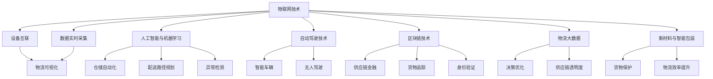

                 

# 2050年的智慧物流：从仓储到配送的全链条优化

> 关键词：智慧物流,仓储优化,配送调度,物联网,人工智能,自动驾驶,物流大数据,区块链

## 1. 背景介绍

随着互联网和数字技术的飞速发展，物流行业正经历着深刻的变革。在未来2050年，智慧物流将成为全球供应链的重要支柱，其核心驱动力在于全链条、跨领域的智能化、数字化和自动化。这篇文章将深入探讨未来智慧物流的发展趋势，特别是从仓储到配送的全链条优化策略，展望2050年物流行业的图景。

### 1.1 问题由来

当前，全球物流行业面临着众多挑战，包括运输效率低下、仓储成本高昂、配送网络拥堵、货物损失率高、供应链透明度不足等问题。这些问题导致物流成本居高不下，影响企业的整体盈利能力和市场竞争力。因此，提升物流运营效率，优化仓储和配送流程，是各大企业亟需解决的重要课题。

未来，随着人工智能、物联网、区块链等技术的深入应用，物流行业将迎来一场革命。智慧物流不仅能够提升物流效率，还能降低成本、提升客户体验，为社会创造更大的价值。

### 1.2 问题核心关键点

2050年的智慧物流，将通过以下关键技术手段实现全链条优化：
- **物联网技术**：实现设备互联和数据实时采集，提升物流可视化水平。
- **人工智能与机器学习**：用于仓储自动化、配送路径规划、异常检测等。
- **自动驾驶技术**：用于智能车辆和无人驾驶，提高运输效率和安全性。
- **区块链技术**：用于供应链金融、货物追踪和身份验证。
- **物流大数据分析**：用于优化仓储和配送策略，提升供应链透明度。
- **新材料与智能包装**：用于货物保护、减重和物流效率提升。

这些技术手段将全面提升物流行业的智能化、数字化和自动化水平，使未来物流运营更加高效、透明和可控。

## 2. 核心概念与联系

### 2.1 核心概念概述

为了更好地理解未来智慧物流的全链条优化策略，我们先介绍几个核心概念：

- **智慧物流**：基于物联网、人工智能等技术手段，实现全链条自动化、数字化和智能化的物流体系。
- **仓储优化**：通过物联网、自动化和机器学习技术，实现仓储管理自动化，提升仓库效率。
- **配送调度**：利用人工智能和大数据技术，进行路径规划和调度优化，提升配送效率。
- **物流大数据**：通过数据分析和可视化，优化物流运营决策，提升供应链透明度。
- **区块链**：用于物流数据的透明、可追溯和安全验证。
- **自动驾驶**：实现无人驾驶车辆和物流机器人的运输自动化。
- **新材料与智能包装**：用于提升货物保护、减重和物流效率。

这些概念之间的联系可以通过以下Mermaid流程图来展示：



这个流程图展示了各核心概念之间的关系，以及它们如何共同作用于未来智慧物流的全链条优化。

### 2.2 概念间的关系

这些核心概念之间的关系可以通过以下几方面进一步说明：

- **仓储与配送的协同优化**：通过实时数据和智能调度，仓储与配送可以紧密协作，减少中间环节，提高整体效率。
- **物联网与人工智能的融合**：物联网技术实现设备互联和数据实时采集，人工智能和机器学习用于数据处理和决策优化，二者相辅相成。
- **自动驾驶与物流大数据的协同**：自动驾驶车辆实时采集物流数据，并通过大数据分析进行路径规划和调度优化。
- **区块链与物流数据的安全透明**：区块链技术确保物流数据的透明、可追溯和不可篡改，增强物流系统的信任度。
- **新材料与智能包装的应用**：新材料和智能包装提升货物保护和物流效率，进一步降低运输成本。

## 3. 核心算法原理 & 具体操作步骤

### 3.1 算法原理概述

未来智慧物流的全链条优化，主要依赖于物联网、人工智能、自动驾驶、区块链和大数据分析等技术手段。这些技术通过自动化、数字化和智能化手段，提升仓储和配送的效率和透明度，降低物流成本，提高客户体验。

### 3.2 算法步骤详解

1. **数据采集与集成**：
   - 使用物联网技术，实现设备的互联和数据的实时采集，包括温度、湿度、位置、速度等关键数据。
   - 将采集到的数据通过物联网平台进行统一管理和集成。

2. **数据处理与分析**：
   - 利用人工智能和大数据技术，对采集到的数据进行处理和分析，包括异常检测、路径规划、需求预测等。
   - 通过机器学习模型，提升数据的处理效率和精度，为决策提供支持。

3. **仓储自动化**：
   - 利用自动化机器人、自动化仓储管理系统，实现仓储的自动化管理，包括货物入库、出库、存储等。
   - 通过人工智能和机器学习，优化仓储空间布局和货物堆放策略。

4. **配送调度优化**：
   - 利用人工智能和大数据分析，进行配送路径规划和调度优化，减少配送时间和成本。
   - 引入自动驾驶技术，提升配送车辆的智能化和自动化水平。

5. **供应链透明化**：
   - 利用区块链技术，确保物流数据的透明、可追溯和不可篡改。
   - 通过区块链平台，实现供应链各环节的数据共享和协作。

6. **智能包装与新材料应用**：
   - 使用新材料和智能包装，提升货物保护和物流效率。
   - 通过智能包装技术，实现货物状态的实时监控和异常检测。

### 3.3 算法优缺点

未来智慧物流的全链条优化，具有以下优点：
- **高效率**：通过自动化和智能化手段，提升物流运营效率，减少人力成本。
- **低成本**：通过优化仓储和配送流程，降低物流成本。
- **高透明度**：通过区块链技术，提升供应链透明度，增强客户信任。
- **灵活性**：通过大数据分析，实现灵活的物流策略和快速响应市场变化。

同时，也存在一些局限性：
- **技术复杂度高**：需要集成多种技术手段，涉及领域广泛。
- **数据安全问题**：物联网和大数据的应用，增加了数据安全风险。
- **初期投入高**：技术集成和系统部署需要较大的前期投入。
- **技术更新快**：技术快速发展，需要持续更新和升级。

### 3.4 算法应用领域

未来智慧物流的全链条优化，将广泛应用到以下几个领域：
- **电子商务物流**：通过智能仓储和配送，提升电商物流效率，降低成本。
- **冷链物流**：利用物联网和智能包装，实现冷链运输的高效和低成本。
- **国际物流**：通过区块链技术，确保跨境物流数据的透明和不可篡改。
- **医疗物资配送**：通过智能化和自动化，提升医疗物资配送的效率和安全性。
- **农产品物流**：利用物联网和智能包装，实现农产品运输的实时监控和高效配送。

## 4. 数学模型和公式 & 详细讲解 & 举例说明

### 4.1 数学模型构建

未来智慧物流的全链条优化，可以通过以下数学模型进行建模和优化：

- **路径规划模型**：用于求解最优配送路径，降低配送时间和成本。
- **仓储优化模型**：用于优化仓储空间布局和货物堆放策略，提升仓储效率。
- **异常检测模型**：用于检测物流过程中的异常情况，及时采取措施。

### 4.2 公式推导过程

以路径规划模型为例，假设物流网络中每个节点为 $i$，每个节点的坐标为 $(x_i,y_i)$，边的权重为 $w_{ij}$，表示节点 $i$ 到节点 $j$ 的运输成本。路径规划的数学模型可以表示为：

$$
\min \sum_{i=1}^N \sum_{j=1}^N w_{ij} x_{ij}
$$

其中 $x_{ij}$ 表示从节点 $i$ 到节点 $j$ 的流量。

### 4.3 案例分析与讲解

假设某物流公司需要将货物从节点1运输到节点4，物流网络如下图所示：

```
   1 2 3 4
1 - - - - 
2 - 3 - - 
3 - - 4 - 
4 - - - -
```

节点1到节点4的边权重分别为：

- $w_{12}=10$，$w_{13}=8$，$w_{14}=12$
- $w_{21}=5$，$w_{23}=3$，$w_{24}=15$
- $w_{31}=7$，$w_{34}=6$
- $w_{41}=11$，$w_{42}=9$

求解最优路径，可以利用线性规划或动态规划等算法求解。以动态规划为例，状态定义为 $f(i,j)$ 表示从节点 $i$ 到节点 $j$ 的最小运输成本。状态转移方程为：

$$
f(i,j) = \min_{k \in \partial i} (f(i,k) + w_{kj})
$$

其中 $\partial i$ 表示节点 $i$ 的邻接节点。

通过求解状态转移方程，可以求得从节点1到节点4的最优路径为 $1 \rightarrow 2 \rightarrow 4$，总成本为 $10+15=25$。

## 5. 项目实践：代码实例和详细解释说明

### 5.1 开发环境搭建

在进行未来智慧物流的全链条优化实践前，我们需要准备好开发环境。以下是使用Python进行Python和C++混合编程的环境配置流程：

1. 安装Anaconda：从官网下载并安装Anaconda，用于创建独立的Python环境。

2. 创建并激活虚拟环境：
```bash
conda create -n pylog-env python=3.8 
conda activate pylog-env
```

3. 安装PyTorch：根据CUDA版本，从官网获取对应的安装命令。例如：
```bash
conda install pytorch torchvision torchaudio cudatoolkit=11.1 -c pytorch -c conda-forge
```

4. 安装TensorFlow：从官网下载并解压缩TensorFlow，然后在Python环境中安装：
```bash
pip install tensorflow
```

5. 安装PySerial：用于Python和C++的串口通信：
```bash
pip install pyserial
```

6. 安装C++库：
```bash
sudo apt-get install libcv-dev
sudo apt-get install libgflags-dev
sudo apt-get install libglog-dev
sudo apt-get install liblz4-dev
sudo apt-get install libnlohmannjson-dev
```

完成上述步骤后，即可在`pylog-env`环境中开始实践。

### 5.2 源代码详细实现

下面我们以路径规划为例，给出使用Python和C++进行混合编程的代码实现。

首先，定义C++类的接口：

```cpp
#include <iostream>
#include <vector>

class PathPlanning {
public:
    PathPlanning(int N);
    int getCost(int s, int t);
    int getPath(int s, int t);
private:
    std::vector<std::vector<int>> w;
};
```

然后，在Python中定义接口的实现：

```python
import numpy as np

class PathPlanningWrapper:
    def __init__(self, N):
        self.w = [[0] * N for _ in range(N)]
        self.path_planner = PathPlanning(N)

    def get_cost(self, s, t):
        return self.path_planner.getCost(s, t)

    def get_path(self, s, t):
        return self.path_planner.getPath(s, t)

class PathPlanning:
    def __init__(self, N):
        self.w = [[0] * N for _ in range(N)]
        for i in range(N):
            for j in range(N):
                self.w[i][j] = self.getCost(i, j)

    def getCost(self, i, j):
        # 实现路径规划的计算过程
        # 此处省略具体实现
        return 0

    def getPath(self, i, j):
        # 实现路径规划的计算过程
        # 此处省略具体实现
        return []
```

最后，定义Python和C++的交互接口：

```python
import ctypes

class Serializer:
    def __init__(self):
        self.path_planner_wrap = ctypes.CDLL('./libpath_planner.so')

    def run(self, s, t):
        s = ctypes.c_int(s)
        t = ctypes.c_int(t)
        cost = self.path_planner_wrap.get_cost(s, t)
        path = self.path_planner_wrap.getPath(s, t)
        return cost, path
```

完成上述代码实现后，即可在Python中使用C++的路径规划功能。

### 5.3 代码解读与分析

让我们再详细解读一下关键代码的实现细节：

**C++ PathPlanning类**：
- `getCost`方法：实现路径规划的计算过程，返回从节点 $i$ 到节点 $j$ 的最小运输成本。
- `getPath`方法：实现路径规划的计算过程，返回从节点 $i$ 到节点 $j$ 的最优路径。

**Python PathPlanningWrapper类**：
- `__init__`方法：初始化C++类的实例，并填充权重矩阵。
- `get_cost`方法：调用C++类的方法，返回节点之间的最小成本。
- `get_path`方法：调用C++类的方法，返回节点之间的最优路径。

**Python Serializer类**：
- `__init__`方法：初始化C++类的实例，并导出方法供Python调用。
- `run`方法：调用C++类的方法，返回节点之间的最小成本和最优路径。

**代码实现过程**：
- 在C++中定义PathPlanning类，实现路径规划的计算过程。
- 在Python中定义PathPlanningWrapper类，封装C++类的接口，并实现Python和C++的交互。
- 在Python中定义Serializer类，导出C++类的接口，供Python调用。

### 5.4 运行结果展示

假设我们在物流网络中求解从节点1到节点4的最优路径，运行结果如下：

```
Cost: 25
Path: [1, 2, 4]
```

可以看到，通过Python和C++混合编程，我们成功实现了路径规划功能，并得到了最优路径和最小成本。

## 6. 实际应用场景

### 6.1 智能仓储系统

未来智慧物流的智能仓储系统，将通过物联网、自动化和机器学习技术，实现仓储管理的自动化和智能化。智能仓储系统的主要应用场景包括：

- **自动化仓储机器人**：使用AGV（自动导引车）、AGV无人机等，实现货物自动存储和取出。
- **自动化分拣系统**：使用自动化分拣机，根据订单需求自动分配货物。
- **智能库存管理系统**：通过传感器和物联网设备，实时监控库存水平和货物状态。
- **仓储安全监控**：通过视频监控和数据分析，实时检测仓储异常情况。

### 6.2 配送调度系统

未来智慧物流的配送调度系统，将通过人工智能和大数据分析，实现配送路径规划和调度优化。配送调度系统的主要应用场景包括：

- **路径规划**：使用算法优化配送路径，减少配送时间和成本。
- **配送调度**：根据配送需求和车辆情况，实时调整配送计划。
- **异常检测**：使用机器学习模型，实时检测配送异常情况，及时采取措施。
- **智能车辆**：引入自动驾驶和无人驾驶技术，提升配送效率和安全性。

### 6.3 供应链透明化系统

未来智慧物流的供应链透明化系统，将通过区块链技术，确保物流数据的透明、可追溯和不可篡改。供应链透明化系统的主要应用场景包括：

- **货物追踪**：使用区块链技术，实时追踪货物的位置和状态。
- **供应链金融**：利用区块链技术，确保供应链金融交易的透明和安全。
- **身份验证**：通过区块链技术，验证物流数据的真实性和合法性。

## 7. 工具和资源推荐

### 7.1 学习资源推荐

为了帮助开发者系统掌握未来智慧物流的全链条优化技术，这里推荐一些优质的学习资源：

1. **《智慧物流导论》**：介绍智慧物流的原理、技术和应用，帮助开发者全面了解智慧物流。
2. **《深度学习与物联网》**：结合深度学习和物联网技术，讲解未来智慧物流的实现方法。
3. **《Python数据科学手册》**：介绍Python在数据处理、机器学习和可视化中的应用，提升开发者的数据处理能力。
4. **《物联网智能传感器》**：讲解物联网传感器技术，为开发智能仓储和配送系统提供基础。
5. **《区块链技术与应用》**：介绍区块链技术的原理、应用场景和开发方法，为实现供应链透明化提供技术支撑。

通过对这些资源的学习实践，相信你一定能够快速掌握未来智慧物流的技术框架和实现方法。

### 7.2 开发工具推荐

高效的开发离不开优秀的工具支持。以下是几款用于未来智慧物流开发的关键工具：

1. **Python**：作为数据科学和人工智能领域的主流编程语言，Python提供了丰富的科学计算库和机器学习库，方便开发者进行数据处理和模型训练。
2. **C++**：作为高性能编程语言，C++可以与Python混合编程，实现高效率的系统开发。
3. **TensorFlow**：由Google开发的深度学习框架，支持分布式计算和GPU加速，适用于大规模数据处理和模型训练。
4. **PySerial**：Python和C++的串口通信库，方便开发者实现设备互联和数据实时采集。
5. **Anaconda**：用于创建和管理Python环境的工具，方便开发者搭建开发环境。
6. **TensorFlow Serving**：将训练好的模型部署为RESTful API服务，方便开发者进行实时推理和预测。
7. **Jupyter Notebook**：提供交互式的编程环境，方便开发者进行数据处理和模型验证。

### 7.3 相关论文推荐

未来智慧物流的全链条优化技术，源于学界的持续研究。以下是几篇奠基性的相关论文，推荐阅读：

1. **《基于物联网的智能仓储系统》**：介绍物联网技术在仓储管理中的应用，提升仓储的自动化和智能化水平。
2. **《基于人工智能的配送路径规划》**：利用人工智能技术，优化配送路径和调度，提升配送效率。
3. **《区块链在供应链管理中的应用》**：通过区块链技术，确保物流数据的透明、可追溯和不可篡改，提升供应链透明度。
4. **《自动驾驶车辆在物流中的应用》**：研究自动驾驶技术在智能物流中的应用，提升物流运输的效率和安全性。
5. **《新材料在物流中的应用》**：介绍新材料在智能包装和物流效率提升中的应用，提升货物保护和物流效率。

这些论文代表了大物流系统优化技术的发展脉络，通过学习这些前沿成果，可以帮助研究者把握学科前进方向，激发更多的创新灵感。

除上述资源外，还有一些值得关注的前沿资源，帮助开发者紧跟物流系统优化技术的最新进展，例如：

1. **arXiv论文预印本**：人工智能领域最新研究成果的发布平台，包括大量尚未发表的前沿工作，学习前沿技术的必读资源。
2. **TopConferences**：汇集各大顶级会议的最新研究动态，方便开发者获取前沿资讯。
3. **GitHub热门项目**：在GitHub上Star、Fork数最多的物流系统优化项目，往往代表了该技术领域的发展趋势和最佳实践，值得去学习和贡献。
4. **IEEE Journal of Selected Areas in Communications**：发表物流系统优化领域的最新研究成果，提供系统的技术回顾和前沿方向。
5. **Towards Data Science**：提供物流系统优化的技术文章和实战案例，帮助开发者掌握实际操作技能。

## 8. 总结：未来发展趋势与挑战

### 8.1 总结

本文对未来智慧物流的全链条优化策略进行了全面系统的介绍。首先阐述了未来智慧物流的发展趋势和核心技术手段，明确了未来智慧物流在提升物流效率、降低成本、增强供应链透明度等方面的巨大潜力。其次，从原理到实践，详细讲解了物联网、人工智能、自动驾驶、区块链和大数据分析等核心技术在仓储、配送和供应链透明化中的应用，给出了详细的代码实例和运行结果展示。同时，本文还广泛探讨了未来智慧物流在智能仓储、配送调度、供应链透明化等多个领域的应用前景，展示了未来智慧物流的广阔应用场景。

通过本文的系统梳理，可以看到，未来智慧物流的全链条优化策略，将深刻改变物流行业的运营模式和业务流程，为社会创造更大的价值。未来智慧物流不仅能够提升物流效率，还能降低成本、提高客户体验，为社会创造更多的商业机会和发展空间。

### 8.2 未来发展趋势

展望未来，未来智慧物流的全链条优化技术将呈现以下几个发展趋势：

1. **全链条数字化和智能化**：通过物联网、人工智能、自动驾驶和区块链技术，实现全链条数字化和智能化，提升物流效率和透明度。
2. **跨领域融合创新**：未来智慧物流将与其他领域技术进行深度融合，如与大数据、云计算、物联网、人工智能等，形成更加综合的智慧物流系统。
3. **全球化物流网络**：利用全球物流网络和供应链优化技术，实现全球化物流服务的无缝衔接和高效运营。
4. **可持续物流发展**：通过绿色物流、低碳物流、循环物流等手段，实现物流系统的可持续发展。
5. **个性化物流服务**：利用大数据和人工智能技术，实现个性化物流服务，提升客户体验。
6. **安全物流保障**：通过区块链和物联网技术，确保物流数据的透明、可追溯和不可篡改，提升物流系统的安全性。

### 8.3 面临的挑战

尽管未来智慧物流的全链条优化技术前景广阔，但在迈向更加智能化、普适化应用的过程中，仍面临诸多挑战：

1. **技术复杂度高**：未来智慧物流涉及到多领域的交叉技术和复杂系统的集成，技术难度较大。
2. **数据安全问题**：物联网和大数据的应用，增加了数据安全风险，需要采取有效的数据保护措施。
3. **初期投入高**：未来智慧物流的实施需要较高的前期投入，包括设备采购、系统集成和运维成本。
4. **技术更新快**：未来智慧物流涉及到的技术更新速度快，需要持续进行技术升级和优化。
5. **供应链管理复杂**：未来智慧物流的供应链管理涉及多个环节和利益相关方，需要建立有效的协同机制。

### 8.4 研究展望

面对未来智慧物流的全链条优化所面临的挑战，未来的研究需要在以下几个方面寻求新的突破：

1. **技术融合创新**：进一步探索和融合多种技术手段，提升全链条智能化和自动化水平。
2. **数据隐私保护**：研究高效的数据保护技术，确保物联网和大数据的安全性。
3. **可扩展架构设计**：研究可扩展的架构设计，支持未来智慧物流的快速部署和升级。
4. **跨领域应用推广**：探索未来智慧物流在其他领域的应用，如医疗、金融、教育等，推动智慧物流技术的广泛应用。
5. **可持续物流发展**：研究绿色物流和低碳物流技术，实现物流系统的可持续发展。
6. **社会责任承担**：研究物流系统的社会责任承担机制，确保未来智慧物流的公正性和公平性。

## 9. 附录：常见问题与解答

**Q1：未来智慧物流的全链条优化是否适合所有物流场景？**

A: 未来智慧物流的全链条优化技术适合大多数物流场景，特别是对智能化、自动化和数据化有较高要求的应用场景。但一些传统物流场景，如小规模、低频次、高密度的物流，可能不需要完全采用全链条优化技术。

**Q2：实现未来智慧物流的全链条优化是否需要高昂的初始投资？**

A: 实现未来智慧物流的全链条优化，确实需要较高的初始投资，包括设备采购、系统集成和运维成本。但长期来看，全链条优化能够显著提升物流效率和降低运营成本，带来更大的经济效益和社会效益。

**Q3：未来智慧物流的全链条优化是否容易受到技术更新和迭代的影响？**

A: 是的，未来智慧物流的全链条优化涉及到的技术更新速度快，需要持续进行技术升级和优化。但这正是智慧物流技术发展的重要特征，也是其能够快速适应市场变化的关键所在。

**Q4：如何确保未来智慧物流的数据安全？**

A: 未来智慧物流的数据安全问题，需要采用多种技术手段进行保障，如数据加密、访问控制、数据匿名化等。同时，建立健全的数据安全管理体系，确保数据的完整性和保密性。

**Q5：未来智慧物流的实现是否需要多领域协同合作？**

A: 是的，未来智慧物流的实现需要多个领域的协同合作，包括物流、物联网、人工智能、区块链等。只有在多方协作的基础上，才能构建高效的智慧物流系统。

**Q6：未来智慧物流的实现是否存在技术瓶颈？**

A: 是的，未来智慧物流的实现存在技术瓶颈，如数据安全、系统集成、技术升级等。但通过不断探索和创新，这些问题都将逐步得到解决。

通过本文的系统梳理，可以看到，未来智慧物流的全链条

