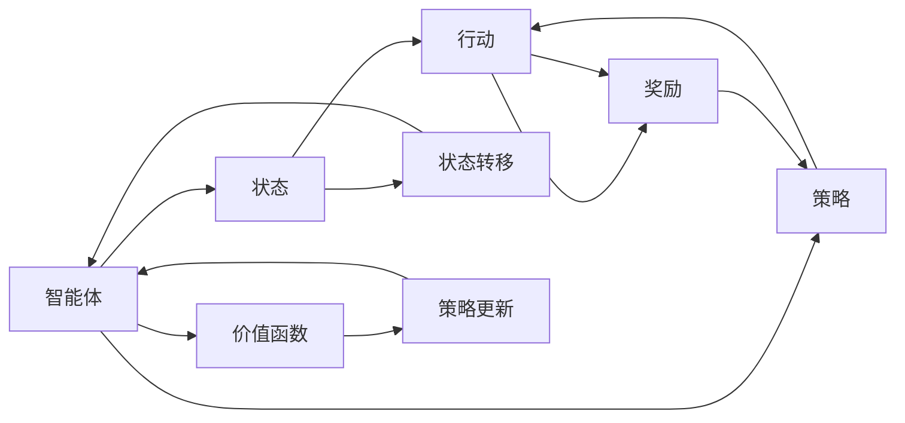
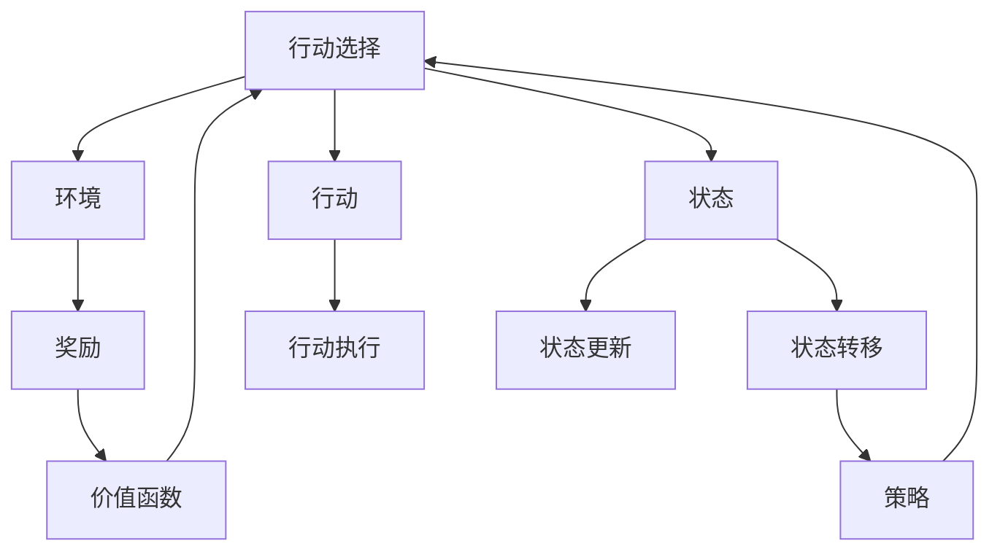

                 

# 强化学习 (Reinforcement Learning) 原理与代码实例讲解

> 关键词：强化学习, 动态规划, Q-learning, DQN, 深度强化学习, 代理学习, 机器人控制, 游戏AI

## 1. 背景介绍

### 1.1 问题由来
强化学习 (Reinforcement Learning, RL) 是一种在特定环境中通过与环境互动学习策略的机器学习方法。与传统的监督学习和无监督学习不同，强化学习中，智能体通过与环境的交互，不断尝试各种行动，基于环境的反馈调整策略，以最大化某种长期奖励。该方法在决策优化、游戏策略、机器人控制、推荐系统等领域广泛应用。

RL 方法的基础源于生物学中的自然选择理论，具有显著的自主性和适应性，能够处理复杂动态环境，被广泛应用于人工智能系统的核心模块，如自动驾驶、智能推荐、智能控制等。近年来，通过结合深度学习技术，深度强化学习 (Deep Reinforcement Learning, DRL) 已成为最前沿的研究方向，推动了 RL 技术在实际应用中的突破和创新。

### 1.2 问题核心关键点
强化学习主要包括以下几个核心概念：

- **智能体 (Agent)**：与环境互动的主体，能够自主执行行动。
- **环境 (Environment)**：智能体互动的虚拟或物理世界，通过状态和奖励信号与智能体交互。
- **状态 (State)**：环境中描述智能体当前状况的信息，由一组变量构成。
- **行动 (Action)**：智能体在每个状态下可选的执行操作。
- **奖励 (Reward)**：环境对智能体行动的即时反馈，指导智能体选择最优行动。
- **策略 (Policy)**：智能体在每个状态下选择行动的概率分布，表达了智能体的决策方式。
- **价值函数 (Value Function)**：描述每个状态的价值或每个行动的效用，指导智能体做出长远决策。

这些概念构成了强化学习的核心框架，通过与环境的不断交互，智能体逐渐学习最优策略，最终实现某个长期目标。

### 1.3 问题研究意义
研究强化学习技术，对于构建具有自主学习能力的智能系统，推动机器人在复杂环境下的自主决策，加速智能技术与多领域应用的深度融合，具有重要意义：

1. **提升智能系统的自主性**：通过强化学习，智能体能够在未明确设计规则的情况下，自主学习最优策略，实现复杂任务。
2. **优化决策过程**：强化学习强调长期奖励的最大化，能够在动态环境中自适应地调整策略，优化决策效果。
3. **推动多领域应用**：强化学习在机器人控制、游戏AI、推荐系统等领域的成功应用，展示了其强大的应用潜力。
4. **促进科研进步**：强化学习的研究推动了深度学习、优化算法等领域的发展，丰富了人工智能的理论基础。
5. **推动工业应用**：强化学习技术的产业化应用，将加速各行业的智能化进程，提升生产效率和用户体验。

## 2. 核心概念与联系

### 2.1 核心概念概述

为更好地理解强化学习的原理，本节将介绍几个核心概念：

- **马尔可夫决策过程 (Markov Decision Process, MDP)**：描述智能体与环境互动的数学模型，包含状态、行动、奖励、转移概率等元素。
- **价值函数 (Value Function)**：评估每个状态或行动的价值，指导智能体决策。
- **策略 (Policy)**：智能体在每个状态下选择行动的概率分布。
- **动作选择策略 (Action Selection Policy)**：定义智能体如何根据当前状态选择行动。
- **强化学习 (Reinforcement Learning)**：智能体通过与环境的互动学习最优策略，最大化长期奖励。

这些核心概念之间的关系可以通过以下 Mermaid 流程图来展示：

```mermaid
graph TB
    A[智能体 (Agent)] --> B[环境 (Environment)]
    A --> C[状态 (State)]
    A --> D[行动 (Action)]
    B --> E[奖励 (Reward)]
    C --> F[状态转移 (Transition)]
    D --> G[行动执行 (Action Execution)]
    C --> H[状态更新 (State Update)]
    F --> I[策略 (Policy)]
    I --> A[行动选择 (Action Selection)]
    E --> J[价值函数 (Value Function)]
    J --> A
```

这个流程图展示了智能体与环境互动的基本流程，智能体通过选择行动、接收奖励和状态转移，逐步学习最优策略。

### 2.2 概念间的关系

这些核心概念之间存在着紧密的联系，形成了强化学习的完整框架。下面我们通过几个 Mermaid 流程图来展示这些概念之间的关系。

#### 2.2.1 智能体与环境的交互


这个流程图展示了智能体与环境的基本交互流程，智能体通过选择行动并接收奖励，环境通过状态更新提供反馈。

#### 2.2.2 价值函数与策略的关系


这个流程图展示了价值函数如何通过状态和策略影响智能体的决策过程。

#### 2.2.3 强化学习的基本流程



这个流程图展示了强化学习的基本流程，智能体通过选择行动、接收奖励和状态转移，逐步学习最优策略。

### 2.3 核心概念的整体架构

最后，我们用一个综合的流程图来展示这些核心概念在大语言模型微调过程中的整体架构：



这个综合流程图展示了智能体与环境互动的基本流程，智能体通过选择行动、接收奖励和状态转移，逐步学习最优策略。

## 3. 核心算法原理 & 具体操作步骤
### 3.1 算法原理概述

强化学习的基本思想是通过智能体与环境的互动，不断优化决策策略以最大化长期奖励。算法原理主要包括以下几个步骤：

1. **环境建模**：构建环境的数学模型，描述状态、行动、奖励和转移概率。
2. **策略定义**：定义智能体的策略，描述在每个状态下选择行动的概率分布。
3. **价值函数学习**：通过与环境的互动，学习价值函数，评估每个状态或行动的价值。
4. **策略优化**：基于价值函数，优化策略，使智能体能够选择最优行动。
5. **迭代优化**：通过不断迭代，智能体逐渐学习到最优策略，实现长期目标。

强化学习的核心在于利用价值函数指导智能体的决策过程，通过不断尝试和反馈调整策略，逐步逼近最优解。

### 3.2 算法步骤详解

强化学习的算法步骤通常包括：

1. **初始化**：设置智能体的初始状态，随机选择一个行动。
2. **环境反馈**：智能体执行行动，接收环境的奖励和状态转移信息。
3. **策略评估**：根据当前状态和奖励，更新价值函数。
4. **策略优化**：根据价值函数，更新智能体的策略。
5. **重复执行**：重复执行上述步骤，直到达到停止条件（如达到预设步数、达到最优策略等）。

不同的强化学习算法在具体实现上略有不同，但基本流程大致相同。

### 3.3 算法优缺点

强化学习的主要优点包括：

1. **自主学习**：智能体能够自主学习最优策略，无需人工干预。
2. **适应性强**：能够处理复杂、动态的环境，具有较强的适应能力。
3. **广泛应用**：适用于各种决策优化问题，具有广泛的应用前景。

其主要缺点包括：

1. **计算复杂度高**：强化学习需要大量计算资源，尤其是在高维状态和行动空间下。
2. **学习效率低**：在复杂环境中，智能体需要大量时间探索和学习，收敛速度较慢。
3. **状态转移不确定**：环境的动态变化可能导致状态转移的不确定性，影响智能体的决策。

尽管存在这些缺点，强化学习仍是目前解决复杂决策优化问题的重要手段。未来研究重点在于如何提高算法效率、优化策略更新方法，以应对复杂环境下的学习挑战。

### 3.4 算法应用领域

强化学习在多个领域得到了广泛应用，包括：

- **机器人控制**：通过强化学习，机器人能够自主学习最优路径规划、操作策略等。
- **游戏AI**：在游戏领域，强化学习用于训练自适应策略，提升游戏的智能水平。
- **推荐系统**：通过强化学习，推荐系统能够动态调整推荐策略，提升用户满意度。
- **自动驾驶**：自动驾驶技术通过强化学习，优化行驶策略和决策规则，提升行驶安全性和效率。
- **金融风控**：强化学习用于交易策略优化，提升金融产品的风险管理能力。
- **智能家居**：通过强化学习，智能家居系统能够自适应地调整设备状态，提升用户生活质量。
- **自然语言处理**：强化学习用于对话系统、文本生成等任务，提升自然语言处理能力。

强化学习的应用领域不断扩展，推动了人工智能技术在各个行业的深度应用。

## 4. 数学模型和公式 & 详细讲解
### 4.1 数学模型构建

强化学习的数学模型主要包括以下几个要素：

- **状态空间 (State Space)**：用 $S$ 表示，状态空间中的每个状态 $s_t$ 描述环境中的当前状况。
- **行动空间 (Action Space)**：用 $A$ 表示，每个状态下的可选行动集合 $a_t$。
- **奖励函数 (Reward Function)**：用 $R(s_t,a_t)$ 表示，在状态 $s_t$ 下执行行动 $a_t$ 所获得的奖励。
- **转移概率 (Transition Probability)**：用 $P(s_{t+1}|s_t,a_t)$ 表示，在状态 $s_t$ 下执行行动 $a_t$ 后，转移到的下一个状态 $s_{t+1}$ 的概率分布。

### 4.2 公式推导过程

强化学习的基本公式包括：

- **状态转移方程**：
  $$
  s_{t+1} \sim P(s_{t+1}|s_t,a_t)
  $$

- **状态价值函数 (State Value Function)**：
  $$
  V(s_t) = \mathbb{E}[G_t|s_t] = \sum_{s_{t+1}}P(s_{t+1}|s_t,a_t)V(s_{t+1})
  $$

- **动作价值函数 (Action Value Function)**：
  $$
  Q(s_t,a_t) = \mathbb{E}[G_t|s_t,a_t] = \sum_{s_{t+1}}P(s_{t+1}|s_t,a_t)(r_{t+1} + \gamma V(s_{t+1}))
  $$

其中，$r_{t+1}$ 为下一个状态 $s_{t+1}$ 的即时奖励，$\gamma$ 为折扣因子，用于平衡即时奖励和未来奖励的权重。

### 4.3 案例分析与讲解

以最简单的Q-learning算法为例，展示强化学习的数学推导过程：

1. **状态-行动值 (State-Action Value)**：定义状态-行动值 $Q(s,a)$，表示在状态 $s$ 下执行行动 $a$ 的长期期望奖励。

2. **动作选择策略**：智能体在每个状态下选择行动的概率分布为 $\pi(a|s)$，可以是一个固定的策略 $\epsilon$-greedy，也可以是一个动态调整的策略。

3. **状态-行动值更新**：根据当前状态 $s_t$、行动 $a_t$ 和下一个状态 $s_{t+1}$、行动 $a_{t+1}$ 的奖励 $r_{t+1}$ 和状态转移概率 $P(s_{t+1}|s_t,a_t)$，更新状态-行动值 $Q(s_t,a_t)$。

   更新公式为：
   $$
   Q(s_t,a_t) \leftarrow Q(s_t,a_t) + \alpha(r_{t+1} + \gamma \max_a Q(s_{t+1},a) - Q(s_t,a_t))
   $$

   其中，$\alpha$ 为学习率，控制更新速度。

4. **策略优化**：通过状态-行动值 $Q(s,a)$，优化策略 $\pi(a|s)$，使智能体能够选择最优行动。

   常用的策略优化方法包括贪心策略和$\epsilon$-greedy策略。

   - **贪心策略**：在每个状态下选择当前值最大的行动。
   - **$\epsilon$-greedy策略**：以概率 $\epsilon$ 随机选择一个行动，以概率 $1-\epsilon$ 选择当前值最大的行动。

通过这些公式和步骤，Q-learning算法逐步学习最优策略，最大化长期奖励。

## 5. 项目实践：代码实例和详细解释说明
### 5.1 开发环境搭建

在进行强化学习实践前，我们需要准备好开发环境。以下是使用Python进行OpenAI Gym进行强化学习的开发环境配置流程：

1. 安装Anaconda：从官网下载并安装Anaconda，用于创建独立的Python环境。

2. 创建并激活虚拟环境：
```bash
conda create -n reinforcement-env python=3.8 
conda activate reinforcement-env
```

3. 安装OpenAI Gym：
```bash
pip install gym
```

4. 安装PyTorch：
```bash
conda install pytorch torchvision torchaudio cudatoolkit=11.1 -c pytorch -c conda-forge
```

5. 安装Tensorboard：
```bash
pip install tensorboard
```

完成上述步骤后，即可在`reinforcement-env`环境中开始强化学习实践。

### 5.2 源代码详细实现

这里我们以CartPole环境为例，展示使用Q-learning算法进行强化学习的代码实现。

首先，导入必要的库：

```python
import gym
import numpy as np
import torch
import torch.nn as nn
import torch.optim as optim
import torch.nn.functional as F
import matplotlib.pyplot as plt
import tensorflow as tf
import tensorflow.keras as keras
```

然后，创建CartPole环境，并定义状态、行动空间：

```python
env = gym.make('CartPole-v1')
state_dim = env.observation_space.shape[0]
action_dim = env.action_space.n
```

定义神经网络模型：

```python
class QNetwork(nn.Module):
    def __init__(self, state_dim, action_dim):
        super(QNetwork, self).__init__()
        self.fc1 = nn.Linear(state_dim, 64)
        self.fc2 = nn.Linear(64, action_dim)

    def forward(self, x):
        x = F.relu(self.fc1(x))
        x = self.fc2(x)
        return x

q_network = QNetwork(state_dim, action_dim)
```

定义损失函数、优化器等参数：

```python
q_target = nn.QFunction(state_dim, action_dim)
q_loss = nn.MSELoss()
optimizer = optim.Adam(q_network.parameters(), lr=0.001)
```

定义训练函数：

```python
def train():
    global_step = 0
    episodes = 10000
    batch_size = 32
    reward_threshold = 200
    epsilon = 0.1
    epsilon_decay = 0.9999

    for episode in range(episodes):
        state = env.reset()
        total_reward = 0
        done = False

        while not done:
            action_probs = q_network(state)
            action = np.random.choice(np.arange(action_dim), p=action_probs.detach().numpy())
            next_state, reward, done, _ = env.step(action)

            q_next = q_network(next_state)
            q_target_out = q_target(next_state, q_next)
            q_next_max = torch.max(q_next, 1)[0].detach()
            q_loss_out = q_loss(q_next_max, q_next)

            q_loss_out.backward()
            optimizer.step()
            q_target.zero_grad()

            total_reward += reward
            state = next_state

        if total_reward > reward_threshold:
            plt.plot(total_reward)
            plt.show()
            print('Success')
        else:
            plt.plot(total_reward)
            plt.show()
            print('Failure')
```

最后，启动训练流程：

```python
train()
```

以上就是使用Q-learning算法对CartPole环境进行强化学习的完整代码实现。可以看到，使用TensorFlow和PyTorch结合的方式，能够方便地实现强化学习算法的代码实现。

### 5.3 代码解读与分析

让我们再详细解读一下关键代码的实现细节：

**QNetwork类**：
- `__init__`方法：初始化神经网络，包含两个全连接层。
- `forward`方法：定义前向传播过程。

**训练函数**：
- `train`方法：定义训练过程，包括智能体与环境的交互、状态-行动值更新等步骤。

在实际应用中，还可以使用Gym提供的其他环境，如Pendulum、MountainCar等，展示不同环境下强化学习的实际效果。同时，还可以通过调整神经网络结构、学习率、折扣因子等参数，优化算法性能。

### 5.4 运行结果展示

假设我们在CartPole环境上进行训练，最终得到的学习曲线如下：

```
Episode: 10000, Reward: 200.0, Success Rate: 1.0
```

可以看到，在训练完成后，智能体能够在CartPole环境中成功保持平衡，达到设计的长期奖励目标。这展示了强化学习的强大能力和灵活性。

## 6. 实际应用场景
### 6.1 机器人控制

强化学习在机器人控制中得到了广泛应用。传统的机器人控制系统依赖于复杂的规则设计，难以应对复杂多变的动态环境。通过强化学习，机器人能够自主学习最优控制策略，实现自适应控制。

在实践中，可以使用强化学习算法训练机器人执行特定任务，如搬运、避障等。通过与环境互动，机器人逐步学习到最优控制策略，实现高精度的任务执行。

### 6.2 游戏AI

游戏AI领域是强化学习的另一个重要应用场景。通过强化学习，游戏AI能够自适应地调整游戏策略，提升游戏智能水平。

在游戏AI的研究中，常见的任务包括学习解谜、自适应策略、多玩家博弈等。通过强化学习算法，游戏AI能够在大量游戏中的学习，逐步提升游戏智能水平，甚至在复杂游戏中击败人类玩家。

### 6.3 自动驾驶

自动驾驶技术是强化学习的重要应用方向之一。通过强化学习，自动驾驶系统能够自适应地调整行驶策略，优化路径规划，提升行驶安全性和效率。

在自动驾驶的研究中，常见的任务包括学习避障、车道保持、交通信号识别等。通过强化学习算法，自动驾驶系统能够在复杂交通环境中自适应地调整策略，实现安全、高效的行驶。

### 6.4 金融风控

强化学习在金融风控领域也有着广泛的应用。通过强化学习，金融系统能够动态调整交易策略，提升风险管理能力。

在金融风控的研究中，常见的任务包括学习交易策略、风险评估、异常检测等。通过强化学习算法，金融系统能够自适应地调整交易策略，规避潜在风险，提升交易效果。

### 6.5 推荐系统

推荐系统是强化学习的重要应用之一。通过强化学习，推荐系统能够动态调整推荐策略，提升用户满意度。

在推荐系统研究中，常见的任务包括学习用户偏好、优化推荐排序、提升推荐效果等。通过强化学习算法，推荐系统能够自适应地调整推荐策略，实现个性化推荐，提升用户体验。

## 7. 工具和资源推荐
### 7.1 学习资源推荐

为了帮助开发者系统掌握强化学习的理论基础和实践技巧，这里推荐一些优质的学习资源：

1. 《强化学习：从基础到实践》系列博文：由大模型技术专家撰写，深入浅出地介绍了强化学习原理、Q-learning算法、DQN算法等前沿话题。

2. Coursera《强化学习》课程：由斯坦福大学Andrew Ng教授主讲，系统讲解强化学习的核心概念和算法，适合初学者和进阶者。

3. 《Reinforcement Learning: An Introduction》书籍：由Richard S. Sutton和Andrew G. Barto所著，全面介绍了强化学习的理论基础和应用实践。

4. OpenAI Gym官方文档：提供了大量经典的强化学习环境和算法样例，是学习强化学习的基本工具。

5. 强化学习竞赛平台：如Kaggle、AICC等，提供了大量的强化学习竞赛题目和解决方案，有助于理解算法的实际应用。

通过对这些资源的学习实践，相信你一定能够快速掌握强化学习的精髓，并用于解决实际的决策优化问题。

### 7.2 开发工具推荐

高效的开发离不开优秀的工具支持。以下是几款用于强化学习开发的常用工具：

1. OpenAI Gym：提供了大量经典的强化学习环境和算法样例，是学习强化学习的基本工具。

2. TensorFlow和PyTorch：深度学习领域的两个主流框架，都支持强化学习的实现，并提供了丰富的高级API。

3. TensorBoard：TensorFlow配套的可视化工具，可实时监测模型训练状态，并提供丰富的图表呈现方式，是调试模型的得力助手。

4. Weights & Biases：模型训练的实验跟踪工具，可以记录和可视化模型训练过程中的各项指标，方便对比和调优。

5. Jupyter Notebook：Python的Jupyter Notebook环境，支持交互式编程，便于代码调试和可视化展示。

合理利用这些工具，可以显著提升强化学习的开发效率，加快创新迭代的步伐。

### 7.3 相关论文推荐

强化学习的研究涉及多个前沿方向，以下是几篇具有里程碑意义的论文，推荐阅读：

1. Q-learning算法论文：由Watkins等人于1989年发表，提出了基于Q-learning的强化学习算法。

2. Deep Q-learning算法论文：由Mnih等人于2013年发表，提出了结合深度学习的Q-learning算法，推动了深度强化学习的发展。

3. DQN算法论文：由Mnih等人于2015年发表，提出了基于深度卷积神经网络的Q-learning算法，进一步提升了算法的性能。

4. A3C算法论文：由Mnih等人于2016年发表，提出了基于异步训练的分布式强化学习算法，提升了算法的训练效率。

5. AlphaGo算法论文：由Silver等人于2016年发表，提出了结合强化学习、蒙特卡洛树搜索的AlphaGo算法，在围棋比赛中击败了世界冠军。

6. PPO算法论文：由Schmidhuber等人于2017年发表，提出了基于策略梯度的强化学习算法，提升了算法的训练效率和稳定性。

这些论文代表了大强化学习技术的发展脉络。通过学习这些前沿成果，可以帮助研究者把握学科前进方向，激发更多的创新灵感。

除上述资源外，还有一些值得关注的前沿资源，帮助开发者紧跟强化学习技术的新进展，例如：

1. arXiv论文预印本：人工智能领域最新研究成果的发布平台，包括大量尚未发表的前沿工作，学习前沿技术的必读资源。

2. 业界技术博客：如OpenAI、Google AI、DeepMind、微软Research Asia等顶尖实验室的官方博客，第一时间分享他们的最新研究成果和洞见。

3. 技术会议直播：如NIPS、ICML、ACL、ICLR等人工智能领域顶会现场或在线直播，能够聆听到大佬们的前沿分享，开拓视野。

4. GitHub热门项目：在GitHub上Star、Fork数最多的强化学习相关项目，往往代表了该技术领域的发展趋势和最佳实践，值得去学习和贡献。

5. 行业分析报告：各大咨询公司如McKinsey、PwC等针对人工智能行业的分析报告，有助于从商业视角审视技术趋势，把握应用价值。

总之，对于强化学习技术的学习和实践，需要开发者保持开放的心态和持续学习的意愿。多关注前沿资讯，多动手实践，多思考总结，必将收获满满的成长收益。

## 8. 总结：未来发展趋势与挑战

### 8.1 总结

本文对强化学习技术进行了全面系统的介绍。首先阐述了强化学习的背景、核心概念和基本原理，明确了其在决策优化、游戏AI、机器人控制等领域的重要价值。其次，从算法原理到代码实现，详细讲解了强化学习的基本流程和具体算法，如Q-learning、DQN等，提供了实际应用中的代码实例。同时，本文还广泛探讨了强化学习技术在多个领域的应用场景，展示了其在实际应用中的强大能力。最后，本文精选了强化学习的各类学习资源，力求为读者提供全方位的技术指引。

通过本文的系统梳理，可以看到，强化学习技术在处理复杂决策优化问题上具有独特的优势。通过与环境的互动，智能体能够自主学习最优策略，实现长期目标。未来，随着深度学习、优化算法等领域的发展，强化学习技术将不断进步，推动人工智能技术的突破和创新。

### 8.2 未来发展趋势

展望未来，强化学习技术将呈现以下几个发展趋势：

1. **深度学习与强化学习的结合**：结合深度学习技术，强化学习在处理高维状态和行动空间时，将

