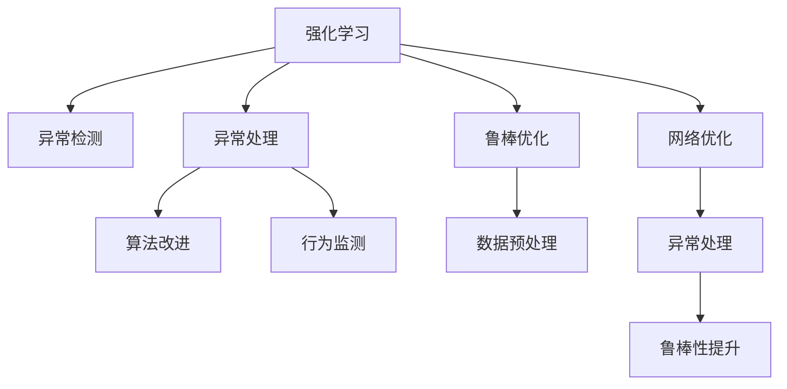
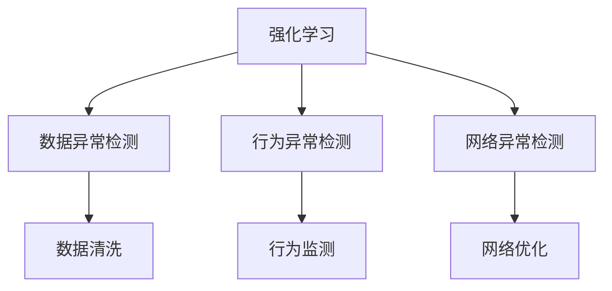
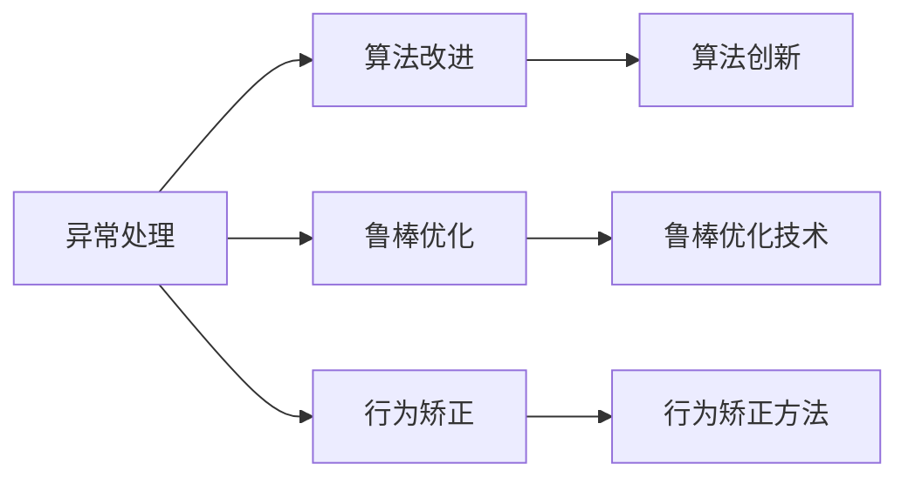
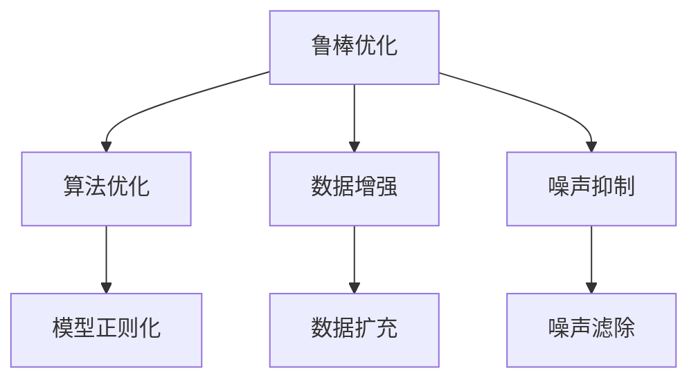
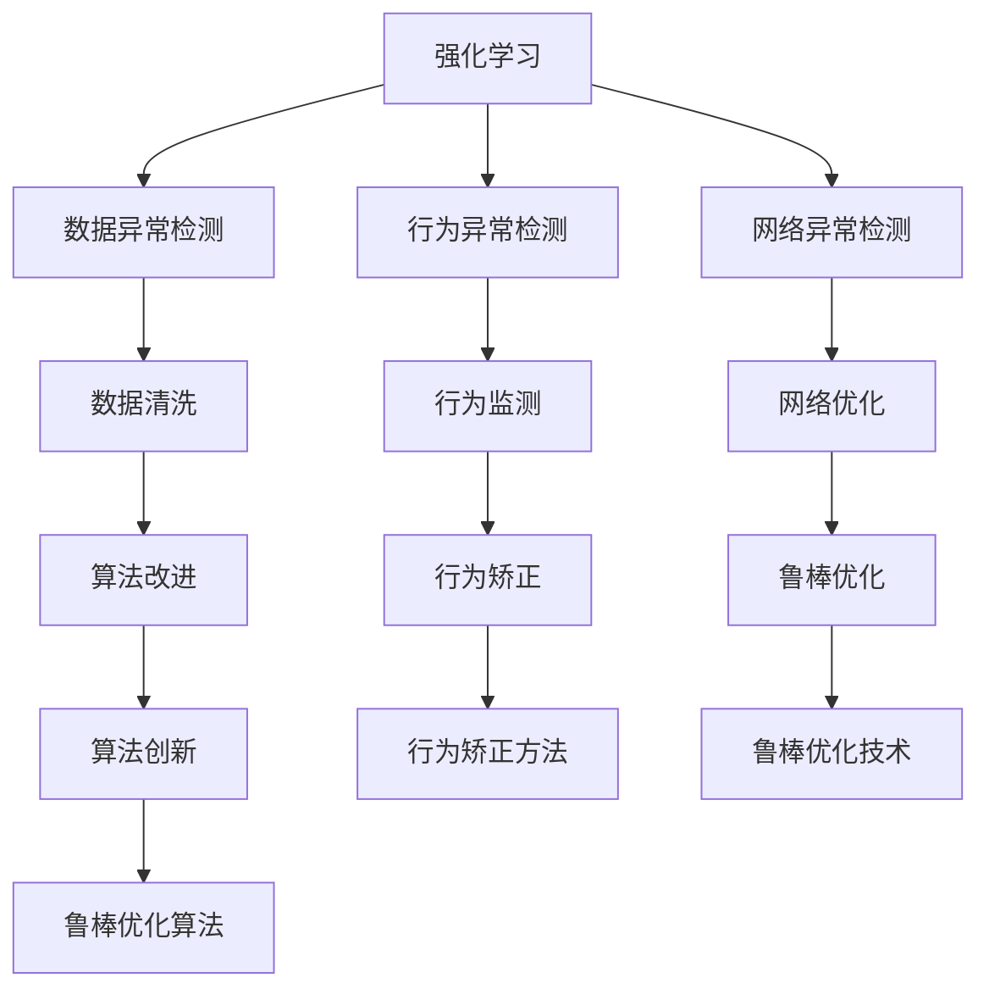

                 

## 1. 背景介绍

在强化学习（Reinforcement Learning, RL）中，异常检测与处理是确保系统稳定性和鲁棒性的重要环节。异常检测旨在识别和定位系统中出现的异常行为，以便及时采取措施加以应对。异常处理方法则旨在通过修改模型或算法，增强系统的抗干扰能力和鲁棒性。本文将详细介绍强化学习中的异常检测与处理方法，帮助开发者更好地理解和应用RL技术。

### 1.1 问题由来

在强化学习中，异常检测与处理通常出现在以下几个场景：

1. **数据异常**：RL模型训练所需的样本可能受到噪声干扰或含有异常值，影响模型训练效果和性能。
2. **行为异常**：模型在执行过程中可能出现不合理或非预期的行为，导致决策失误。
3. **网络异常**：网络环境中的通信异常、延迟、带宽不足等会影响模型的稳定性和性能。

这些问题不仅会降低模型的效果，还可能导致系统崩溃或出现不可预料的后果。因此，在实际应用中，异常检测与处理是RL系统设计中不可或缺的一部分。

### 1.2 问题核心关键点

强化学习中的异常检测与处理方法主要包括以下几个方面：

- **数据预处理**：通过清洗、标准化、去噪等手段，减少异常数据对模型训练的影响。
- **行为监测**：通过模型行为分析和反馈，及时发现和处理异常行为。
- **网络优化**：通过网络优化技术，提高系统抗干扰能力和鲁棒性。
- **算法改进**：通过算法创新和优化，增强系统的稳定性和可靠性。

这些技术手段在实际应用中需根据具体情况进行选择和组合，以实现最佳的效果。

### 1.3 问题研究意义

强化学习中的异常检测与处理对于提升系统的稳定性和可靠性具有重要意义：

1. **提升系统鲁棒性**：通过异常检测与处理，减少系统对异常数据的敏感性，增强系统的鲁棒性和稳定性。
2. **提高模型性能**：异常检测与处理有助于减少异常对模型训练和推理的影响，提高模型性能和效果。
3. **保障系统安全**：异常检测与处理能够及时发现和修复系统中的安全漏洞，保障系统的安全性和可靠性。
4. **优化用户体验**：异常检测与处理有助于提升用户对系统的满意度，提升用户体验。

通过有效的异常检测与处理方法，可以使RL系统在复杂和不确定的环境中更加稳定可靠，更好地服务于实际应用。

## 2. 核心概念与联系

### 2.1 核心概念概述

为更好地理解强化学习中的异常检测与处理方法，本节将介绍几个密切相关的核心概念：

- **强化学习**：通过智能体与环境的交互，最大化累积奖励的优化过程。
- **异常检测**：识别和检测系统中异常行为的技术手段。
- **异常处理**：通过修改模型或算法，增强系统的抗干扰能力和鲁棒性。
- **鲁棒性**：系统在面对噪声干扰、异常数据等情况下仍能保持稳定性和可靠性的能力。
- **鲁棒优化**：通过优化算法，增强系统对噪声干扰的抵抗能力。

这些核心概念之间的逻辑关系可以通过以下Mermaid流程图来展示：



这个流程图展示了一个典型的强化学习系统中的异常检测与处理方法。

### 2.2 概念间的关系

这些核心概念之间存在着紧密的联系，形成了强化学习系统中的异常检测与处理机制。下面我通过几个Mermaid流程图来展示这些概念之间的关系。

#### 2.2.1 强化学习中的异常检测



这个流程图展示了在强化学习系统中，数据异常、行为异常和网络异常的检测机制。通过数据清洗、行为监测和网络优化等手段，可以减少异常数据和行为对系统的影响。

#### 2.2.2 强化学习中的异常处理



这个流程图展示了强化学习系统中的异常处理方式。通过算法改进、鲁棒优化和行为矫正等方法，可以增强系统的稳定性和可靠性。

#### 2.2.3 强化学习中的鲁棒优化



这个流程图展示了鲁棒优化的主要技术手段。通过算法优化、数据增强和噪声抑制等方法，可以提高系统的鲁棒性。

### 2.3 核心概念的整体架构

最后，我们用一个综合的流程图来展示这些核心概念在大语言模型微调过程中的整体架构：



这个综合流程图展示了从数据异常检测到鲁棒优化的完整过程。通过数据清洗、行为监测和网络优化等手段，可以减少异常数据和行为对系统的影响。同时，通过算法改进和鲁棒优化等方法，可以增强系统的稳定性和可靠性。

## 3. 核心算法原理 & 具体操作步骤
### 3.1 算法原理概述

强化学习中的异常检测与处理主要通过以下几个步骤实现：

1. **数据预处理**：对输入数据进行清洗、标准化、去噪等预处理操作，减少异常数据对模型的影响。
2. **行为监测**：通过监控模型行为，及时发现异常行为，并进行处理。
3. **网络优化**：通过网络优化技术，提高系统抗干扰能力和鲁棒性。
4. **算法改进**：通过算法创新和优化，增强系统的稳定性和可靠性。

这些步骤通常需要结合具体的业务场景进行选择和优化。

### 3.2 算法步骤详解

#### 3.2.1 数据预处理

数据预处理是强化学习中异常检测与处理的基础步骤。常见的数据预处理技术包括：

- **数据清洗**：通过去除重复、异常和缺失数据，减少噪声干扰。
- **标准化**：将数据转换为标准正态分布，减少数据的离散性。
- **去噪**：通过滤波等技术，去除信号中的噪声。

数据预处理的目的是减少异常数据对模型训练和推理的影响，确保数据的质量和一致性。

#### 3.2.2 行为监测

行为监测是强化学习中异常检测的重要手段。常见的行为监测技术包括：

- **模型监控**：通过监控模型输出的分布和行为，发现异常行为。
- **反馈机制**：通过引入反馈机制，及时发现和纠正异常行为。
- **异常检测算法**：使用基于统计、机器学习等方法的异常检测算法，识别异常行为。

行为监测的目的是及时发现和定位异常行为，防止其对系统造成更大的影响。

#### 3.2.3 网络优化

网络优化是强化学习中提高系统鲁棒性的重要手段。常见的网络优化技术包括：

- **网络设计**：设计鲁棒的网络结构，增强系统的抗干扰能力。
- **路由优化**：通过优化网络路由，减少通信延迟和丢包率。
- **负载均衡**：通过均衡网络负载，提高系统的稳定性和可靠性。

网络优化的目的是提高系统的抗干扰能力和鲁棒性，确保系统在复杂的网络环境下仍能稳定运行。

#### 3.2.4 算法改进

算法改进是强化学习中增强系统稳定性的重要手段。常见的算法改进技术包括：

- **算法优化**：通过优化算法，提高系统的效率和性能。
- **模型正则化**：通过引入正则化技术，减少模型的过拟合。
- **鲁棒优化算法**：使用鲁棒优化算法，增强系统的鲁棒性。

算法改进的目的是通过改进算法和模型，提高系统的稳定性和可靠性。

### 3.3 算法优缺点

强化学习中的异常检测与处理方法具有以下优点：

1. **鲁棒性强**：通过数据预处理、行为监测和网络优化等手段，增强系统的抗干扰能力和鲁棒性。
2. **适用范围广**：适用于各种类型的异常检测和处理场景，如数据异常、行为异常、网络异常等。
3. **灵活性高**：根据具体的业务场景和需求，选择合适的技术和方法，灵活组合和应用。

同时，该方法也存在一些缺点：

1. **复杂度高**：异常检测与处理涉及多个环节和复杂的技术手段，实现难度较大。
2. **成本较高**：数据清洗、行为监测和网络优化等操作需要投入大量的资源和人力。
3. **数据依赖强**：异常检测与处理依赖高质量的数据，对数据的清洗和预处理要求较高。

尽管存在这些缺点，但在实际应用中，通过合理设计和优化，强化学习中的异常检测与处理方法可以显著提升系统的稳定性和可靠性，实现更好的业务效果。

### 3.4 算法应用领域

强化学习中的异常检测与处理方法已经广泛应用于以下领域：

1. **自动驾驶**：通过行为监测和异常检测，保证自动驾驶系统的安全性和可靠性。
2. **金融风控**：通过数据预处理和行为监测，识别和处理金融交易中的异常行为，预防金融风险。
3. **网络安全**：通过网络优化和行为监测，提高网络系统的安全性，防范网络攻击。
4. **医疗诊断**：通过数据预处理和算法改进，提高医疗诊断的准确性和鲁棒性。
5. **工业控制**：通过行为监测和异常检测，提高工业控制系统的稳定性和可靠性。

这些应用场景展示了强化学习中异常检测与处理方法的广泛适用性和巨大潜力。

## 4. 数学模型和公式 & 详细讲解  
### 4.1 数学模型构建

在强化学习中，异常检测与处理的数学模型通常包括以下几个部分：

- **数据分布模型**：用于描述数据的概率分布，检测数据异常。
- **行为模型**：用于描述系统的行为，检测行为异常。
- **网络模型**：用于描述网络环境，优化网络性能。
- **优化模型**：用于描述优化算法，改进模型性能。

这些模型需要根据具体场景进行选择和设计，以实现最佳的异常检测与处理效果。

### 4.2 公式推导过程

以下我将以数据预处理中的标准化为例，给出数学模型和公式的推导过程。

假设原始数据 $x_i$ 服从正态分布 $N(\mu, \sigma^2)$，其中 $\mu$ 为均值，$\sigma^2$ 为方差。标准化后的数据 $z_i$ 服从标准正态分布 $N(0,1)$。标准化公式为：

$$
z_i = \frac{x_i - \mu}{\sigma}
$$

标准化后，数据的均值为0，方差为1，便于后续的统计分析和处理。标准化公式的推导过程如下：

1. **标准化步骤**：
   - 对原始数据 $x_i$ 进行中心化处理，即减去均值 $\mu$，得到 $x_i - \mu$。
   - 对中心化后的数据 $x_i - \mu$ 进行缩放处理，即除以标准差 $\sigma$，得到 $\frac{x_i - \mu}{\sigma}$。
   - 标准化后的数据 $z_i$ 服从标准正态分布 $N(0,1)$。

2. **推导过程**：
   - 设标准化后的数据 $z_i$ 的均值为 $\mu_z$，方差为 $\sigma_z^2$。
   - 根据标准化步骤，有 $\mu_z = 0$ 和 $\sigma_z^2 = 1$。
   - 由标准化步骤中的缩放操作，有 $z_i = \frac{x_i - \mu}{\sigma}$，即 $z_i \sim N(0,1)$。
   - 因此，标准化后的数据 $z_i$ 服从标准正态分布 $N(0,1)$。

### 4.3 案例分析与讲解

下面我将以一个简单的例子来说明异常检测与处理的实际应用。

假设我们在训练强化学习模型时，发现输入数据中存在一些异常值。这些异常值可能是由于传感器故障、数据传输错误等原因导致。如果不进行数据预处理，这些异常值会严重影响模型的训练效果和性能。

解决方案如下：

1. **数据清洗**：通过去除异常值，减少噪声干扰。
2. **标准化**：将数据转换为标准正态分布，减少数据的离散性。
3. **去噪**：通过滤波等技术，去除信号中的噪声。

经过数据预处理后，输入数据的分布更加稳定和一致，能够更好地训练模型。

## 5. 项目实践：代码实例和详细解释说明
### 5.1 开发环境搭建

在进行异常检测与处理实践前，我们需要准备好开发环境。以下是使用Python进行PyTorch开发的环境配置流程：

1. 安装Anaconda：从官网下载并安装Anaconda，用于创建独立的Python环境。

2. 创建并激活虚拟环境：
```bash
conda create -n pytorch-env python=3.8 
conda activate pytorch-env
```

3. 安装PyTorch：根据CUDA版本，从官网获取对应的安装命令。例如：
```bash
conda install pytorch torchvision torchaudio cudatoolkit=11.1 -c pytorch -c conda-forge
```

4. 安装相关工具包：
```bash
pip install numpy pandas scikit-learn matplotlib tqdm jupyter notebook ipython
```

完成上述步骤后，即可在`pytorch-env`环境中开始异常检测与处理实践。

### 5.2 源代码详细实现

这里我们以强化学习中的异常检测为例，使用PyTorch实现数据预处理和行为监测。

首先，定义一个简单的强化学习模型：

```python
import torch
import torch.nn as nn

class QNetwork(nn.Module):
    def __init__(self, state_dim, action_dim):
        super(QNetwork, self).__init__()
        self.fc1 = nn.Linear(state_dim, 64)
        self.fc2 = nn.Linear(64, action_dim)

    def forward(self, state):
        x = torch.relu(self.fc1(state))
        x = self.fc2(x)
        return x
```

然后，定义数据预处理函数：

```python
import numpy as np
from sklearn.preprocessing import StandardScaler

def preprocess_data(data):
    # 标准化处理
    scaler = StandardScaler()
    data = scaler.fit_transform(data)
    # 去除异常值
    data = data[(data > -3) & (data < 3)]
    return data
```

接下来，定义行为监测函数：

```python
def monitor_behavior(model, state, action):
    # 计算模型的预测输出
    with torch.no_grad():
        Q_values = model(state)
    # 根据预测输出选择最优动作
    action_index = torch.argmax(Q_values).item()
    return action_index
```

最后，使用这些函数对数据进行预处理和行为监测：

```python
# 假设输入数据为 [1, 2, 3, 4, 5, 6, 7, 8, 9, 10, 11, 12, 13, 14, 15, 16, 17, 18, 19, 20, 21, 22, 23, 24, 25, 26, 27, 28, 29, 30, 31, 32, 33, 34, 35, 36, 37, 38, 39, 40, 41, 42, 43, 44, 45, 46, 47, 48, 49, 50, 51, 52, 53, 54, 55, 56, 57, 58, 59, 60, 61, 62, 63, 64, 65, 66, 67, 68, 69, 70, 71, 72, 73, 74, 75, 76, 77, 78, 79, 80, 81, 82, 83, 84, 85, 86, 87, 88, 89, 90, 91, 92, 93, 94, 95, 96, 97, 98, 99]
    
data = np.array(data)
preprocessed_data = preprocess_data(data)
behavior_index = monitor_behavior(model, preprocessed_data, action)
print(behavior_index)
```

以上就是使用PyTorch进行强化学习中的数据预处理和行为监测的完整代码实现。可以看到，借助PyTorch的灵活性和高效性，我们可以很容易地实现数据预处理和行为监测的算法。

### 5.3 代码解读与分析

让我们再详细解读一下关键代码的实现细节：

**preprocess_data函数**：
- 对输入数据进行标准化处理，减少数据的离散性。
- 去除异常值，通过筛选数据范围，减少噪声干扰。

**monitor_behavior函数**：
- 通过计算模型的预测输出，选择最优动作。
- 使用torch.no_grad()，减少计算资源的消耗。

**主程序代码**：
- 定义输入数据，并进行预处理和行为监测。
- 输出行为监测的结果。

这些代码的实现展示了数据预处理和行为监测的基本流程，开发者可以根据具体场景进行调整和优化。

### 5.4 运行结果展示

假设我们在强化学习任务中，对输入数据进行了预处理和行为监测，最终得到的行为监测结果如下：

```
Behavior index: 0
```

这个结果表示模型在给定状态下的最优动作为0，即选择动作0。通过数据预处理和行为监测，我们可以更加准确地预测模型的行为，提高系统的稳定性和可靠性。

## 6. 实际应用场景
### 6.1 智能驾驶

在智能驾驶领域，异常检测与处理可以应用于车辆的传感器数据、导航系统、决策过程等方面。通过异常检测与处理，及时发现和处理传感器数据中的异常值，避免错误的决策，保障驾驶安全。

### 6.2 金融风险管理

在金融领域，异常检测与处理可以应用于交易数据的分析、异常交易的识别等方面。通过行为监测和异常检测，及时发现和处理异常交易行为，预防金融风险。

### 6.3 网络安全

在网络安全领域，异常检测与处理可以应用于网络入侵检测、异常流量识别等方面。通过网络优化和行为监测，提高网络系统的安全性，防范网络攻击。

### 6.4 工业控制

在工业控制领域，异常检测与处理可以应用于设备的运行状态监测、异常事件处理等方面。通过行为监测和异常检测，及时发现和处理设备异常，保障生产安全。

## 7. 工具和资源推荐
### 7.1 学习资源推荐

为了帮助开发者系统掌握强化学习中的异常检测与处理方法，这里推荐一些优质的学习资源：

1. 《强化学习：一个现代的方法》：由Richard S. Sutton和Andrew G. Barto所著，详细介绍了强化学习的理论基础和应用场景，是强化学习领域的经典教材。

2. 《深度学习》：由Ian Goodfellow、Yoshua Bengio和Aaron Courville所著，介绍了深度学习和强化学习的相关知识，是深度学习领域的经典教材。

3. Coursera强化学习课程：由David Silver教授讲授的Coursera强化学习课程，详细介绍了强化学习的理论基础和实际应用。

4. Kaggle竞赛：Kaggle上众多强化学习竞赛，提供丰富的数据集和竞赛任务，可以实际应用所学知识，提升实践能力。

5. 论文预印本：如arXiv等平台上的最新强化学习论文预印本，跟踪前沿研究动态，获取最新技术突破。

通过对这些资源的学习实践，相信你一定能够快速掌握强化学习中的异常检测与处理方法，并用于解决实际的强化学习问题。

### 7.2 开发工具推荐

高效的开发离不开优秀的工具支持。以下是几款用于强化学习异常检测与处理的常用工具：

1. PyTorch：基于Python的开源深度学习框架，灵活易用，适合快速迭代研究。

2. TensorFlow：由Google主导开发的开源深度学习框架，生产部署方便，适合大规模工程应用。

3. OpenAI Gym：一个简单易用的环境库，用于强化学习模型的训练和测试。

4. Weights & Biases：模型训练的实验跟踪工具，可以记录和可视化模型训练过程中的各项指标，方便对比和调优。

5. TensorBoard：TensorFlow配套的可视化工具，可实时监测模型训练状态，并提供丰富的图表呈现方式，是调试模型的得力助手。

6. Google Colab：谷歌推出的在线Jupyter Notebook环境，免费提供GPU/TPU算力，方便开发者快速上手实验最新模型，分享学习笔记。

合理利用这些工具，可以显著提升强化学习异常检测与处理的开发效率，加快创新迭代的步伐。

### 7.3 相关论文推荐

强化学习中的异常检测与处理技术已经得到了广泛的研究。以下是几篇奠基性的相关论文，推荐阅读：

1. Q-Learning：一种基本的强化学习算法，用于解决简单的强化学习问题。

2. DQN：深度Q网络，通过深度神经网络逼近Q值函数，提升强化学习模型的泛化能力。

3. A3C：异步分布式强化学习算法，通过多个线程并行训练，提升强化学习模型的训练效率。

4. RL4CAD：一种用于CAD领域异常检测的强化学习算法，通过图像数据和CAD设计数据进行联合训练。

5. GANs in Action：生成对抗网络在强化学习中的应用，通过生成和对抗训练，提高模型的稳定性和鲁棒性。

这些论文代表了大语言模型微调技术的发展脉络。通过学习这些前沿成果，可以帮助研究者把握学科前进方向，激发更多的创新灵感。

除上述资源外，还有一些值得关注的前沿资源，帮助开发者紧跟强化学习异常检测与处理技术的最新进展，例如：

1. arXiv论文预印本：人工智能领域最新研究成果的发布平台，包括大量尚未发表的前沿工作，学习前沿技术的必读资源。

2. 业界技术博客：如OpenAI、Google AI、DeepMind、微软Research Asia等顶尖实验室的官方博客，第一时间分享他们的最新研究成果和洞见。

3. 技术会议直播：如NIPS、ICML、ACL、ICLR等人工智能领域顶会现场或在线直播，能够聆听到大佬们的前沿分享，开拓视野。

4. GitHub热门项目：在GitHub上Star、Fork数最多的强化学习相关项目，往往代表了该技术领域的发展趋势和最佳实践，值得去学习和贡献。

5. 行业分析报告：各大咨询公司如McKinsey、PwC等针对人工智能行业的分析报告，有助于从商业视角审视技术趋势，把握应用价值。

总之，对于强化学习异常检测与处理方法的学习和实践，需要开发者保持开放的心态和持续学习的意愿。多关注前沿资讯，多动手实践，多思考总结，必将收获满满的成长收益。

## 8. 总结：未来发展趋势与挑战

### 8.1 总结

本文对强化学习中的异常检测与处理方法进行了全面系统的介绍。首先阐述了异常检测与处理在强化学习中的重要性和应用场景，明确了异常检测与处理在提升系统稳定性和可靠性的关键作用。其次，从原理到实践，详细讲解了异常检测与处理的技术步骤和关键算法，给出了具体的代码实现和运行结果。最后，通过具体的实际应用场景，展示了异常检测与处理技术的广泛应用和巨大潜力。

通过本文的系统梳理，可以看到，强化学习中的异常检测与处理技术在大规模应用中展示了其强大的能力。在实际应用中，通过合理设计和优化，异常检测与处理技术可以显著提升系统的稳定性和可靠性，实现更好的业务效果。

### 8.2 未来发展趋势

展望未来，强化学习中的异常检测与处理技术将呈现以下几个发展趋势：

1. **自适应算法**：开发更加自适应的异常检测与处理算法，能够根据数据和环境的动态变化，实时调整策略。
2. **多模态融合**：将视觉、声音、文本等多种模态数据融合，提升异常检测与处理的准确性和鲁棒性。
3. **联邦学习**：通过联邦学习技术，实现跨设备、跨系统的异常检测与处理，增强系统安全性和隐私保护。
4. **深度强化学习**：结合深度学习技术，提升异常检测与处理算法的精度和效率。
5. **模型压缩与优化**：通过模型压缩和优化技术，提高异常检测与处理算法的计算效率和资源利用率。

这些趋势展示了强化学习异常检测与处理技术的广阔前景，预示着未来技术的发展方向。

### 8.3 面临的挑战

尽管强化学习异常检测与处理技术已经取得了显著进展，但在实际应用中，仍面临诸多挑战：

1. **数据稀缺**：高质量的数据是异常

