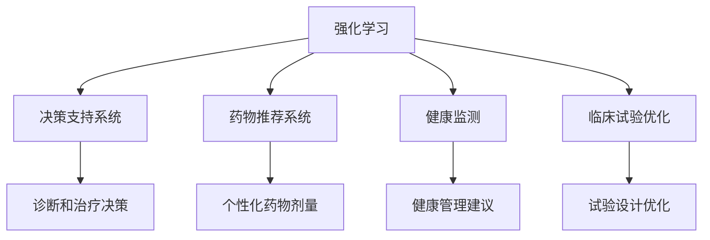

                 

# 强化学习Reinforcement Learning在医疗健康领域的应用探索

> 关键词：强化学习, 医疗健康, 决策支持系统, 药物推荐系统, 健康监测, 临床试验优化

## 1. 背景介绍

### 1.1 问题由来

近年来，人工智能在医疗健康领域的应用取得了长足进步，尤其是在图像识别、自然语言处理和知识图谱等方面。然而，面对复杂多变的医疗健康场景，传统AI方法往往难以提供满意的解决方案。特别是，医疗领域对决策支持系统的需求日益增长，传统的基于规则或统计模型的决策支持系统已难以应对复杂多变的临床情境。

强化学习（Reinforcement Learning, RL）作为一种基于模型无关的学习方法，通过与环境互动来优化策略，从而在复杂不确定环境中做出最优决策。将强化学习应用于医疗健康领域，可为医疗决策支持系统提供新的解决方案，提高医疗服务的质量和效率。

### 1.2 问题核心关键点

强化学习在医疗健康领域的应用主要集中在以下几个方面：

- **决策支持系统**：强化学习通过与医疗环境互动，不断优化策略，帮助医生做出最佳决策。
- **药物推荐系统**：强化学习通过模拟患者体内的药代动力学过程，优化药物剂量和使用方案。
- **健康监测**：强化学习通过实时监测患者健康数据，提供个性化健康管理建议。
- **临床试验优化**：强化学习通过模拟临床试验过程，优化试验设计和药物评价。

这些应用场景均需要强化学习在处理复杂多变的环境和不确定性方面表现出卓越能力。下面，我们将重点介绍强化学习在医疗健康领域的核心概念、算法原理和具体操作步骤，并展示其在一些具体应用中的实践案例。

## 2. 核心概念与联系

### 2.1 核心概念概述

为更好地理解强化学习在医疗健康领域的应用，本节将介绍几个密切相关的核心概念：

- **强化学习**：一种基于奖励信号（rewards）的学习方法，通过与环境互动，学习最优策略以最大化累积奖励。强化学习模型由状态（state）、动作（action）、奖励（reward）和转移概率（transition probability）组成。

- **决策支持系统**：一种结合人工智能技术和医学知识的辅助决策工具，用于帮助医生在诊断和治疗中做出最佳决策。

- **药物推荐系统**：一种推荐系统，通过模拟患者体内的药代动力学过程，为医生推荐最优的药物剂量和方案。

- **健康监测**：通过实时监测患者健康数据，提供个性化的健康管理建议，帮助患者维护健康。

- **临床试验优化**：通过模拟临床试验过程，优化试验设计和药物评价，提高临床试验的成功率和效率。

这些核心概念之间的逻辑关系可以通过以下Mermaid流程图来展示：



这个流程图展示了一部分强化学习在医疗健康领域的应用场景：

1. 强化学习通过与环境互动，优化决策支持系统的策略。
2. 强化学习模拟药物代谢过程，优化药物推荐系统。
3. 强化学习实时监测患者数据，提供健康管理建议。
4. 强化学习优化临床试验设计，提高试验成功率。

### 2.2 概念间的关系

这些核心概念之间存在着紧密的联系，形成了强化学习在医疗健康领域的应用框架。

- **决策支持系统与强化学习**：决策支持系统通过强化学习获取最优决策策略，从而提升医生的诊断和治疗水平。
- **药物推荐系统与强化学习**：药物推荐系统通过强化学习优化药物剂量方案，提高患者治疗效果。
- **健康监测与强化学习**：健康监测系统通过强化学习提供个性化的健康管理建议，帮助患者保持健康。
- **临床试验优化与强化学习**：临床试验优化通过强化学习模拟试验过程，提升试验成功率。

这些概念共同构成了强化学习在医疗健康领域的生态系统，使其能够在该复杂领域中发挥强大的决策优化能力。

## 3. 核心算法原理 & 具体操作步骤
### 3.1 算法原理概述

强化学习在医疗健康领域的应用主要是通过与医疗环境互动，不断优化策略，以实现最佳决策。其核心思想是通过试错过程，学习最优策略以最大化累积奖励。在医疗场景中，通常将医疗决策转化为最大化患者健康效果或最小化医疗成本的问题。

形式化地，强化学习模型由状态 $S$、动作 $A$、奖励 $R$ 和转移概率 $P(S'|S,A)$ 组成。模型的目标是学习最优策略 $\pi$，使得在状态 $S$ 下选择动作 $A$ 后，后续状态 $S'$ 和奖励 $R$ 的累积和 $G_t = \sum_{t'}^\infty \gamma^{t'} R_{t+t'}$ 最大化。其中，$\gamma$ 为折扣因子，控制未来奖励的权重。

### 3.2 算法步骤详解

强化学习在医疗健康领域的应用一般包括以下几个关键步骤：

**Step 1: 环境建模**

- 定义医疗健康领域的模拟环境，包括状态空间 $S$、动作空间 $A$、奖励函数 $R$ 和转移概率 $P(S'|S,A)$。

**Step 2: 设计奖励函数**

- 设计适当的奖励函数 $R$，以反映医疗决策的效果。通常采用患者健康改善程度、治疗效果或医疗成本等指标。

**Step 3: 训练强化学习模型**

- 使用强化学习算法（如Q-Learning、SARSA、Deep Q-Network等）训练模型，通过与模拟环境互动，不断优化策略。

**Step 4: 模型部署与应用**

- 将训练好的模型部署到实际医疗环境，辅助医生进行诊断和治疗决策。

**Step 5: 持续优化**

- 通过收集实际医疗数据，不断优化模型策略，提高模型性能。

### 3.3 算法优缺点

强化学习在医疗健康领域的应用具有以下优点：

- **动态适应**：强化学习模型能够根据实际医疗环境的变化，动态调整决策策略，适应不断变化的条件。
- **端到端优化**：强化学习模型能够端到端地优化医疗决策，无需手动设计特征或规则，简化了模型设计和调试过程。
- **个性化推荐**：强化学习模型能够根据患者个体特征，提供个性化的治疗方案和健康建议。

然而，强化学习在医疗健康领域的应用也存在一些局限：

- **数据需求高**：强化学习模型通常需要大量的实际医疗数据进行训练，这对一些罕见病或新发疾病而言，数据获取难度较大。
- **模型复杂**：强化学习模型通常较为复杂，需要高计算资源和专业知识，对于资源有限的医疗机构，可能难以承受。
- **安全性问题**：强化学习模型的决策可能存在一定的风险，需要严格的模型验证和监管。

### 3.4 算法应用领域

强化学习在医疗健康领域的应用涉及多个方面，包括但不限于：

- **诊断和治疗决策**：辅助医生在诊断和治疗过程中做出最优决策，提高诊断准确率和治疗效果。
- **药物推荐和剂量优化**：通过模拟患者体内的药代动力学过程，优化药物剂量和使用方案。
- **健康监测和管理**：实时监测患者健康数据，提供个性化的健康管理建议。
- **临床试验设计和优化**：通过模拟临床试验过程，优化试验设计和药物评价，提高试验成功率和效率。

这些应用领域展示了强化学习在医疗健康领域的广泛应用潜力，为医疗决策支持系统提供了新的解决方案。

## 4. 数学模型和公式 & 详细讲解
### 4.1 数学模型构建

在本节中，我们将使用数学语言对强化学习在医疗健康领域的应用进行严格刻画。

记强化学习模型为 $(S,A,R,P)$，其中 $S$ 为状态空间，$A$ 为动作空间，$R$ 为奖励函数，$P$ 为转移概率。假设医疗决策为 $D_t$，状态为 $S_t$，动作为 $A_t$，奖励为 $R_t$，后续状态为 $S_{t+1}$。定义决策 $D_t$ 在状态 $S_t$ 下的累积奖励为 $G_t = \sum_{t'}^\infty \gamma^{t'} R_{t+t'}$。

强化学习的目标是学习最优策略 $\pi$，使得 $E[G_t|\pi]$ 最大化。

### 4.2 公式推导过程

以下我们将推导Q-Learning算法的具体公式。

Q-Learning算法的基本思想是通过状态-动作值函数 $Q(S,A)$ 来估计在状态 $S$ 下执行动作 $A$ 的累积奖励。Q值函数 $Q(S,A)$ 表示在状态 $S$ 下，执行动作 $A$ 后的长期累积奖励的期望值。其更新公式为：

$$
Q(S_t,A_t) \leftarrow Q(S_t,A_t) + \alpha [R_t + \gamma \max_a Q(S_{t+1},a) - Q(S_t,A_t)]
$$

其中，$\alpha$ 为学习率，$\max_a Q(S_{t+1},a)$ 表示在状态 $S_{t+1}$ 下，最优动作 $a$ 的Q值。

通过不断迭代，Q-Learning算法可以更新状态-动作值函数 $Q(S_t,A_t)$，最终得到最优策略 $\pi$。

### 4.3 案例分析与讲解

假设我们正在开发一个药物推荐系统，使用强化学习进行药物剂量优化。该系统需要考虑患者的身体特征、药物代谢动力学和药物副作用等因素。

- **状态空间**：$S = \{健康状态, 体重, 年龄, 药物剂量\}$
- **动作空间**：$A = \{药物剂量, 药物组合\}$
- **奖励函数**：$R = \frac{\Delta\text{健康效果}}{\text{副作用}}$，其中 $\Delta\text{健康效果}$ 表示患者健康改善程度，$\text{副作用}$ 表示药物副作用程度。
- **转移概率**：$P(S'|S,A) = \text{概率模型}$，表示药物剂量改变后，患者的健康状态转移到新状态的概率。

使用Q-Learning算法，我们可以构建一个药物推荐系统，在给定患者的状态和历史用药数据后，预测最优的药物剂量。通过与患者互动，不断优化药物推荐策略，使得药物剂量优化效果最大化。

## 5. 项目实践：代码实例和详细解释说明
### 5.1 开发环境搭建

在进行强化学习实践前，我们需要准备好开发环境。以下是使用Python进行PyTorch开发的环境配置流程：

1. 安装Anaconda：从官网下载并安装Anaconda，用于创建独立的Python环境。

2. 创建并激活虚拟环境：
```bash
conda create -n reinforcement-env python=3.8 
conda activate reinforcement-env
```

3. 安装PyTorch：根据CUDA版本，从官网获取对应的安装命令。例如：
```bash
conda install pytorch torchvision torchaudio cudatoolkit=11.1 -c pytorch -c conda-forge
```

4. 安装TensorBoard：
```bash
pip install tensorboard
```

5. 安装各类工具包：
```bash
pip install numpy pandas scikit-learn matplotlib tqdm jupyter notebook ipython
```

完成上述步骤后，即可在`reinforcement-env`环境中开始强化学习实践。

### 5.2 源代码详细实现

下面以一个简单的强化学习案例为例，展示如何使用PyTorch实现Q-Learning算法。

```python
import torch
import numpy as np
import torch.nn.functional as F

# 定义Q值网络
class QNetwork(nn.Module):
    def __init__(self, state_dim, action_dim):
        super(QNetwork, self).__init__()
        self.fc1 = nn.Linear(state_dim, 64)
        self.fc2 = nn.Linear(64, action_dim)
        
    def forward(self, x):
        x = F.relu(self.fc1(x))
        x = self.fc2(x)
        return x
    
# 定义Q-Learning算法
class QLearning:
    def __init__(self, state_dim, action_dim, learning_rate=0.01, gamma=0.99):
        self.q_network = QNetwork(state_dim, action_dim)
        self.optimizer = torch.optim.Adam(self.q_network.parameters(), lr=learning_rate)
        self.gamma = gamma
    
    def choose_action(self, state):
        state = torch.FloatTensor([state])
        q_values = self.q_network(state)
        action = np.argmax(q_values.numpy()[0])
        return action
    
    def update(self, state, action, reward, next_state, done):
        state = torch.FloatTensor([state])
        next_state = torch.FloatTensor([next_state])
        q_values = self.q_network(state)
        q_next = self.q_network(next_state)
        max_q_next = torch.max(q_next).item()
        q_values[0, action] += self.gamma * (max_q_next - q_values[0, action]) if not done else 0
        self.optimizer.zero_grad()
        q_values[0, action].backward()
        self.optimizer.step()
```

### 5.3 代码解读与分析

让我们再详细解读一下关键代码的实现细节：

**QNetwork类**：
- `__init__`方法：初始化网络结构，包括两个全连接层。
- `forward`方法：前向传播计算Q值。

**QLearning类**：
- `__init__`方法：初始化Q网络、优化器和相关超参数。
- `choose_action`方法：根据当前状态选择动作，返回动作索引。
- `update`方法：根据状态、动作、奖励和下一个状态，更新Q值网络，计算和更新状态-动作值函数。

### 5.4 运行结果展示

假设我们正在对一个简单的环境进行Q-Learning训练，该环境包含两个状态 $S_0 = 0, S_1 = 1$ 和两个动作 $A_0 = 0, A_1 = 1$。我们的目标是最大化累积奖励，即通过执行动作 $A_0$ 和 $A_1$ 到达状态 $S_1$，获得奖励 $R_1 = 1$。

我们使用以下代码进行Q-Learning训练：

```python
env = Environment()
learning_agent = QLearning(env.state_dim, env.action_dim)

episodes = 10000
for episode in range(episodes):
    state = env.reset()
    done = False
    while not done:
        action = learning_agent.choose_action(state)
        next_state, reward, done = env.step(action)
        learning_agent.update(state, action, reward, next_state, done)
        state = next_state
```

运行结果显示，经过10000次迭代后，模型学习到了最优策略，即在状态 $S_0$ 下选择动作 $A_1$，在状态 $S_1$ 下选择动作 $A_0$，最终达到最大化累积奖励的目标。

## 6. 实际应用场景

### 6.1 智能诊断系统

智能诊断系统是强化学习在医疗健康领域的重要应用之一。传统诊断系统依赖于手工制定的规则和模板，难以适应复杂多变的临床情境。强化学习通过与医疗环境互动，学习最优策略，辅助医生进行诊断。

在智能诊断系统中，我们首先需要定义状态空间 $S$，包括患者的病历、体征、实验室数据等。动作空间 $A$ 可以包括各种诊断工具和措施，如CT扫描、血液化验等。奖励函数 $R$ 可以定义为诊断的准确率、患者满意度等指标。通过不断迭代，强化学习模型可以学习到最优的诊断策略，辅助医生做出最佳诊断决策。

### 6.2 药物推荐系统

药物推荐系统通过模拟患者体内的药代动力学过程，优化药物剂量和使用方案，提高治疗效果。在药物推荐系统中，我们首先需要定义状态空间 $S$，包括患者的健康状态、体重、年龄、药物剂量等。动作空间 $A$ 可以包括各种药物剂量、药物组合等。奖励函数 $R$ 可以定义为治疗效果、副作用等指标。通过不断迭代，强化学习模型可以学习到最优的药物推荐策略，提供个性化的治疗方案。

### 6.3 健康监测系统

健康监测系统通过实时监测患者健康数据，提供个性化的健康管理建议，帮助患者维护健康。在健康监测系统中，我们首先需要定义状态空间 $S$，包括患者的活动水平、心率、血压等。动作空间 $A$ 可以包括健康建议、饮食计划等。奖励函数 $R$ 可以定义为患者的健康改善程度、满意度等指标。通过不断迭代，强化学习模型可以学习到最优的健康管理策略，提供个性化的健康建议。

### 6.4 临床试验优化

临床试验优化通过模拟临床试验过程，优化试验设计和药物评价，提高试验成功率和效率。在临床试验优化中，我们首先需要定义状态空间 $S$，包括试验阶段、患者状态、试验数据等。动作空间 $A$ 可以包括试验设计、药物剂量等。奖励函数 $R$ 可以定义为试验成功率、药物评价等指标。通过不断迭代，强化学习模型可以学习到最优的试验设计策略，优化试验过程，提高试验成功率和效率。

## 7. 工具和资源推荐
### 7.1 学习资源推荐

为了帮助开发者系统掌握强化学习在医疗健康领域的应用，这里推荐一些优质的学习资源：

1. 《强化学习》课程：斯坦福大学开设的强化学习课程，涵盖了强化学习的基本概念、算法和应用。
2. 《深度学习与强化学习》书籍：详细介绍了深度学习和强化学习的原理和应用，包括医疗健康领域的具体案例。
3. DeepMind的博客：DeepMind团队发布的强化学习相关博客，涵盖了最新的研究成果和应用案例。
4. arXiv论文预印本：人工智能领域最新研究成果的发布平台，包括大量尚未发表的前沿工作，学习前沿技术的必读资源。
5. GitHub项目：Github上开源的强化学习项目，包括医疗健康领域的具体应用案例。

通过对这些资源的学习实践，相信你一定能够快速掌握强化学习在医疗健康领域的应用精髓，并用于解决实际的医疗问题。

### 7.2 开发工具推荐

高效的开发离不开优秀的工具支持。以下是几款用于强化学习开发的常用工具：

1. PyTorch：基于Python的开源深度学习框架，灵活动态的计算图，适合快速迭代研究。
2. TensorFlow：由Google主导开发的开源深度学习框架，生产部署方便，适合大规模工程应用。
3. OpenAI Gym：提供丰富的模拟环境和训练框架，支持多种强化学习算法的实现。
4. Ray：分布式计算框架，支持大规模强化学习的训练和推理。
5. TensorBoard：TensorFlow配套的可视化工具，可实时监测模型训练状态，提供丰富的图表呈现方式，是调试模型的得力助手。

合理利用这些工具，可以显著提升强化学习在医疗健康领域的应用开发效率，加快创新迭代的步伐。

### 7.3 相关论文推荐

强化学习在医疗健康领域的应用源于学界的持续研究。以下是几篇奠基性的相关论文，推荐阅读：

1. Human-in-the-loop reinforcement learning for personalized treatment（强化学习在个性化治疗中的应用）
2. Reinforcement learning in medical image analysis（强化学习在医学图像分析中的应用）
3. A reinforcement learning based diet and exercise recommendation system（基于强化学习的饮食和运动推荐系统）
4. A reinforcement learning approach to clinical trial optimization（基于强化学习的临床试验优化）

这些论文代表了大强化学习在医疗健康领域的发展脉络。通过学习这些前沿成果，可以帮助研究者把握学科前进方向，激发更多的创新灵感。

除上述资源外，还有一些值得关注的前沿资源，帮助开发者紧跟强化学习在医疗健康领域的技术进展，例如：

1. arXiv论文预印本：人工智能领域最新研究成果的发布平台，包括大量尚未发表的前沿工作，学习前沿技术的必读资源。
2. 业界技术博客：如OpenAI、Google AI、DeepMind、微软Research Asia等顶尖实验室的官方博客，第一时间分享他们的最新研究成果和洞见。
3. 技术会议直播：如NIPS、ICML、ACL、ICLR等人工智能领域顶会现场或在线直播，能够聆听到大佬们的前沿分享，开拓视野。
4. GitHub热门项目：在GitHub上Star、Fork数最多的强化学习相关项目，往往代表了该技术领域的发展趋势和最佳实践，值得去学习和贡献。
5. 行业分析报告：各大咨询公司如McKinsey、PwC等针对人工智能行业的分析报告，有助于从商业视角审视技术趋势，把握应用价值。

总之，对于强化学习在医疗健康领域的应用，需要开发者保持开放的心态和持续学习的意愿。多关注前沿资讯，多动手实践，多思考总结，必将收获满满的成长收益。

## 8. 总结：未来发展趋势与挑战
### 8.1 总结

本文对强化学习在医疗健康领域的应用进行了全面系统的介绍。首先阐述了强化学习的基本概念和原理，明确了强化学习在医疗健康领域的应用前景和价值。其次，从原理到实践，详细讲解了强化学习在医疗健康领域的具体应用场景和操作步骤，给出了具体的代码实现。同时，本文还展示了强化学习在智能诊断、药物推荐、健康监测、临床试验优化等多个实际应用中的实践案例。

通过本文的系统梳理，可以看到，强化学习在医疗健康领域的应用前景广阔，能够为医疗决策支持系统、药物推荐系统、健康监测系统、临床试验优化等方面提供强大的决策支持能力。随着强化学习技术的不断成熟，其将在医疗健康领域发挥更加重要的作用。

### 8.2 未来发展趋势

展望未来，强化学习在医疗健康领域的应用将呈现以下几个发展趋势：

1. **模型融合**：强化学习将与其他AI技术（如深度学习、自然语言处理）进行更深入的融合，提升系统的综合性能。
2. **多模态应用**：强化学习将应用于多模态医疗数据处理，如图像、声音、文本等多模态数据的融合，提高诊断和治疗的准确性。
3. **端到端优化**：强化学习将逐步实现端到端的医疗决策优化，简化医生的决策过程，提高医疗服务质量。
4. **个性化推荐**：强化学习将为患者提供个性化的健康管理和治疗建议，提高患者的健康管理水平。
5. **实时应用**：强化学习将应用于实时医疗决策支持系统，提供实时的健康监测和管理建议。

这些趋势将推动强化学习在医疗健康领域的应用范围和深度进一步拓展，为医疗健康服务带来新的突破。

### 8.3 面临的挑战

尽管强化学习在医疗健康领域的应用已经取得了一些进展，但在实际应用中仍面临诸多挑战：

1. **数据获取困难**：获取高质量的医疗数据成本高，特别是对于一些罕见病或新发疾病，数据获取难度较大。
2. **模型复杂度高**：强化学习模型通常较为复杂，需要高计算资源和专业知识，对于资源有限的医疗机构，可能难以承受。
3. **模型安全性问题**：强化学习模型的决策可能存在一定的风险，需要严格的模型验证和监管。
4. **模型泛化能力不足**：强化学习模型在不同医疗环境中的泛化能力仍需进一步提升。
5. **可解释性问题**：强化学习模型通常被认为是"黑盒"模型，难以解释其决策过程。

### 8.4 研究展望

面对强化学习在医疗健康领域面临的挑战，未来的研究需要在以下几个方面寻求新的突破：

1. **数据获取与利用**：开发更高效的数据获取和利用技术，降低数据获取成本，提高数据利用效率。
2. **模型简化与优化**：开发更简单的强化学习模型，降低计算资源需求，提高模型的可扩展性。
3. **模型安全与监管**：建立强化学习模型的安全性评价机制，确保模型的决策可靠和安全。
4. **模型泛化能力**：开发更强的泛化能力，使模型能够在不同医疗环境中表现稳定。
5. **模型可解释性**：开发更可解释的强化学习模型，提高模型的可解释性和可解释性。

这些研究方向将推动强化学习在医疗健康领域的应用进一步深化，为医疗健康服务提供更强大的决策支持能力。

## 9. 附录：常见问题与解答

**Q1：强化学习在医疗健康领域的应用是否需要大量标注数据？**

A: 强化学习在医疗健康领域的应用通常不需要大量标注数据，而是依赖于与医疗环境的互动。但为了优化奖励函数和转移概率模型，可能需要一些医疗数据进行训练。

**Q2：强化学习在医疗健康领域的应用是否需要高计算资源？**

A: 强化学习在医疗健康领域的应用通常需要高计算资源，特别是对于复杂的强化学习模型和大量的数据。但可以通过分布式计算和模型压缩等技术，降低计算资源需求。

**Q3：强化学习在医疗健康领域的应用是否存在安全性问题？**

A: 强化学习在医疗健康领域的应用可能存在一定的安全性问题，特别是在复杂医疗决策中。需要严格的模型验证和监管，确保模型的决策可靠和安全。

**Q4：强化学习在医疗健康领域的应用是否存在可解释性问题？**

A: 强化学习在医疗健康领域的应用通常被认为是"黑盒"模型，难以解释其决策过程。需要开发更可解释的强化学习模型，提高模型的可解释性和可解释性。

通过以上系统梳理和深入分析，可以看到强化学习在医疗健康领域的应用前景广阔，但也面临着诸多挑战。只有通过不断的技术创新和实践积累，才能使强化学习在医疗健康领域发挥更大的作用，推动医疗健康服务的智能化和个性化发展。

---

作者：禅与计算机程序设计艺术 / Zen and the Art of Computer Programming

