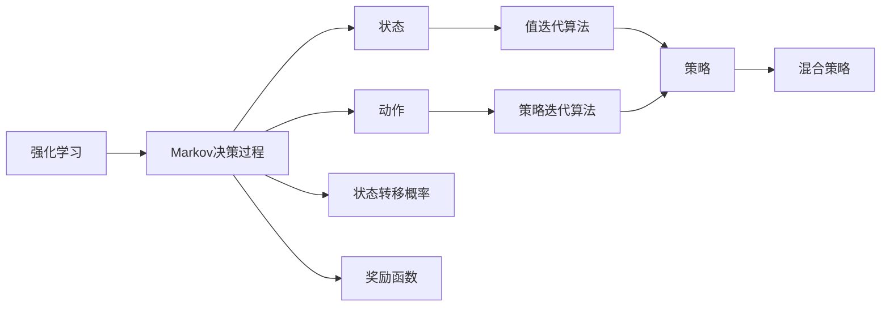
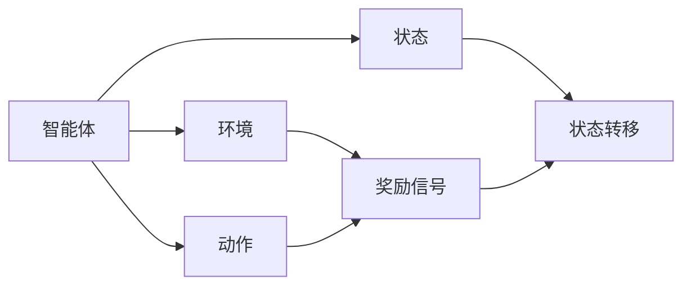
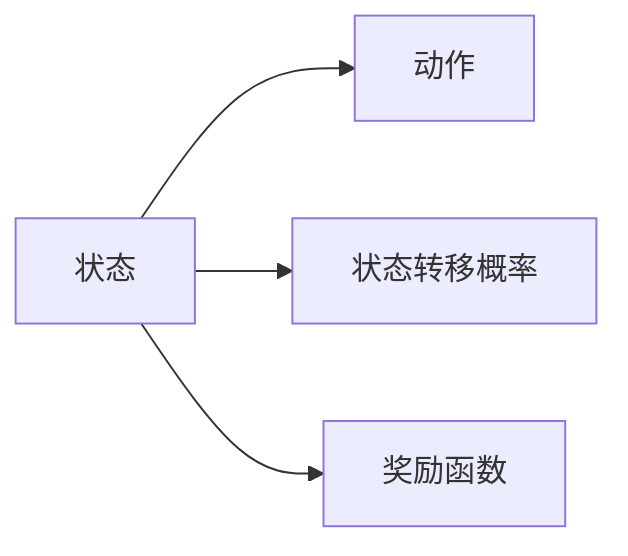
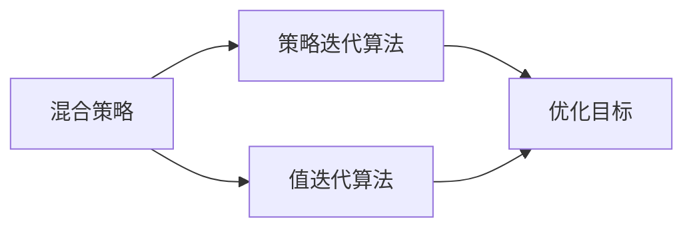
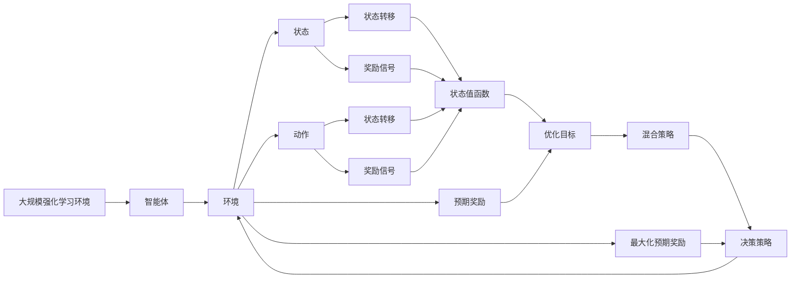

                 

# 强化学习Reinforcement Learning的动态规划基础与实践技巧

> 关键词：强化学习,动态规划,Markov决策过程,值迭代算法,策略迭代算法,混合策略

## 1. 背景介绍

### 1.1 问题由来
强化学习(Reinforcement Learning, RL)是人工智能领域的重要分支，其核心思想是通过与环境的交互，使智能体学习到最优策略，最大化预期奖励。RL问题可以表示为一个带有学习信号的马尔可夫决策过程(Markov Decision Process, MDP)。动态规划(Dynamic Programming, DP)作为RL中的一种重要算法，通过将复杂问题拆分为子问题，最终构建出最优决策策略。

近年来，随着深度学习和大数据技术的迅猛发展，动态规划在强化学习中的应用更加广泛。然而，复杂的模型和庞大的数据集使得动态规划算法的计算复杂度急剧增加，使得其在工业应用中面临诸多挑战。因此，如何在保证模型效果的同时，降低动态规划的计算复杂度，提高算法的实时性，是当前动态规划在强化学习中面临的重要问题。

### 1.2 问题核心关键点
本文聚焦于强化学习中的动态规划方法，但同时也会兼顾混合策略、模型优化等前沿技术，以期对强化学习的动态规划实践提供更全面的指导。

动态规划在强化学习中的应用包括：
- 值迭代算法：通过计算状态值函数，优化决策策略。
- 策略迭代算法：直接优化策略，优化过程可以进一步加速。
- 混合策略：将策略迭代的决策效率和值迭代的收敛性相结合，提高算法性能。

本文将详细探讨以上动态规划方法，结合具体的RL应用场景，帮助读者系统掌握动态规划的基本原理和实践技巧。

### 1.3 问题研究意义
研究强化学习中的动态规划方法，对于拓展RL算法的应用范围，提升决策策略的性能，加速RL技术的产业化进程，具有重要意义：

1. 降低计算复杂度。通过动态规划算法，可以有效降低RL模型在复杂状态空间中的计算复杂度，提高算法的实时性和可扩展性。
2. 提高决策策略的性能。动态规划算法可以优化决策策略，最大化预期奖励，使得RL模型在实际应用中更具有实用价值。
3. 优化模型的计算资源。动态规划算法可以灵活调整模型参数，使得模型在保证效果的同时，更高效地利用计算资源。
4. 提供更为灵活的决策方案。动态规划算法可以设计更为灵活的决策策略，适应不同的应用场景和需求。
5. 加速模型的训练和优化。动态规划算法可以结合其他优化算法（如梯度优化），进一步提升模型的训练和优化效率。

本文将从动态规划的基本原理入手，详细探讨强化学习中的动态规划方法，结合具体案例和实际应用，帮助读者系统掌握动态规划的原理和实践技巧。

## 2. 核心概念与联系

### 2.1 核心概念概述

为更好地理解强化学习中的动态规划方法，本节将介绍几个密切相关的核心概念：

- 强化学习(Reinforcement Learning, RL)：通过与环境的交互，学习到最优策略的过程。智能体通过不断试错，最大化预期奖励。
- Markov决策过程(Markov Decision Process, MDP)：定义了强化学习问题的核心，包括状态、动作、状态转移概率、奖励函数等要素。
- 值迭代算法：通过计算状态值函数，优化决策策略。
- 策略迭代算法：直接优化策略，加速算法的收敛性。
- 混合策略：将策略迭代的决策效率和值迭代的收敛性相结合，提高算法性能。

这些核心概念之间的逻辑关系可以通过以下Mermaid流程图来展示：



这个流程图展示了一些关键概念及其之间的关系：

1. 强化学习通过与环境的交互，学习到最优策略。
2. Markov决策过程定义了强化学习问题的核心，包括状态、动作、状态转移概率、奖励函数等要素。
3. 值迭代算法通过计算状态值函数，优化决策策略。
4. 策略迭代算法直接优化策略，加速算法的收敛性。
5. 混合策略将策略迭代的决策效率和值迭代的收敛性相结合，提高算法性能。

### 2.2 概念间的关系

这些核心概念之间存在着紧密的联系，形成了强化学习中动态规划的完整生态系统。下面我通过几个Mermaid流程图来展示这些概念之间的关系。

#### 2.2.1 强化学习的核心思想



这个流程图展示了强化学习的核心思想：智能体通过与环境的交互，不断试错，学习到最优策略。

#### 2.2.2 Markov决策过程的组成要素



这个流程图展示了Markov决策过程的组成要素：状态、动作、状态转移概率、奖励函数。

#### 2.2.3 值迭代算法与策略迭代算法的关系


这个流程图展示了值迭代算法和策略迭代算法的关系：值迭代算法通过计算状态值函数，优化策略，而策略迭代算法直接优化策略，加速算法的收敛性。

#### 2.2.4 混合策略的优化方法



这个流程图展示了混合策略的优化方法：将策略迭代的决策效率和值迭代的收敛性相结合，提高算法性能。

### 2.3 核心概念的整体架构

最后，我们用一个综合的流程图来展示这些核心概念在大规模强化学习中的整体架构：



这个综合流程图展示了从智能体与环境交互到优化决策策略的完整过程。智能体通过与环境交互，学习到状态转移概率和奖励信号，利用值迭代算法计算状态值函数，再通过策略迭代算法优化策略，最终得到最大化的预期奖励，形成优化的决策策略。混合策略则结合了策略迭代和值迭代的优点，进一步提升算法性能。

## 3. 核心算法原理 & 具体操作步骤
### 3.1 算法原理概述

强化学习中的动态规划方法通过将复杂问题拆分为子问题，最终构建出最优决策策略。其核心思想是通过计算状态值函数，优化决策策略，最大化预期奖励。

形式化地，假设强化学习问题为一个马尔可夫决策过程，状态空间为 $S$，动作空间为 $A$，奖励函数为 $r(s, a)$，状态转移概率为 $P(s'|s, a)$。定义状态值函数 $V(s)$ 为智能体在状态 $s$ 下的最优预期奖励。则状态值函数的更新方程为：

$$
V(s) = \max_a \sum_{s'} P(s'|s,a) [r(s, a) + \gamma V(s')]
$$

其中 $\gamma$ 为折扣因子，控制未来奖励的权重。状态值函数可以通过迭代计算得到最优解。

### 3.2 算法步骤详解

强化学习中的动态规划方法通常包括以下几个关键步骤：

**Step 1: 定义状态、动作、状态转移概率和奖励函数**
- 明确问题中涉及的状态和动作，定义状态转移概率和奖励函数。状态可以是离散的或连续的，动作可以是离散的或连续的。

**Step 2: 定义状态值函数**
- 根据定义的状态值函数 $V(s)$，计算每个状态的最优值。

**Step 3: 定义策略**
- 根据状态值函数，设计最优策略，确定在每个状态下应采取的动作。

**Step 4: 迭代优化**
- 通过值迭代算法或策略迭代算法，不断更新状态值函数和策略，直至收敛。

**Step 5: 策略评估**
- 评估策略的性能，确定最终的优化决策策略。

### 3.3 算法优缺点

动态规划方法在强化学习中具有以下优点：
1. 优化决策策略。通过计算状态值函数，动态规划可以优化决策策略，最大化预期奖励。
2. 降低计算复杂度。通过将复杂问题拆分为子问题，动态规划可以降低计算复杂度，提高算法的实时性。
3. 提供灵活的决策方案。动态规划算法可以设计灵活的策略，适应不同的应用场景和需求。

同时，动态规划方法也存在一些局限性：
1. 计算复杂度较高。在状态空间较大的情况下，动态规划的计算复杂度较高，难以处理大规模问题。
2. 难以处理连续状态空间。动态规划算法在处理连续状态空间时，需要进行离散化处理，这会引入额外的复杂度。
3. 难以处理部分可观测性问题。动态规划算法在处理部分可观测性问题时，需要进行额外的建模和计算，这会降低算法的效率。

### 3.4 算法应用领域

动态规划方法在强化学习中的应用广泛，涉及多个领域：

- 游戏AI：通过学习最优策略，实现智能体的游戏策略优化。
- 机器人控制：通过学习最优控制策略，实现机器人在复杂环境中的自主导航和操作。
- 自动驾驶：通过学习最优决策策略，实现车辆的自动驾驶和路径规划。
- 金融投资：通过学习最优投资策略，实现资产的优化配置和风险控制。
- 供应链管理：通过学习最优供应策略，实现供应链的高效运作和成本控制。

这些领域中，动态规划方法能够帮助智能体在复杂环境中学习到最优策略，提高系统的效率和性能。

## 4. 数学模型和公式 & 详细讲解 & 举例说明
### 4.1 数学模型构建

强化学习中的动态规划方法，通过将问题拆分为子问题，最终构建出最优决策策略。我们以一个简单的示例来展示动态规划的基本模型：

假设有一个简单的环境，状态空间 $S=\{1,2,3,4\}$，动作空间 $A=\{左,右\}$，奖励函数 $r(s,a)=s-2$，状态转移概率 $P(s'|s,a)=\frac{1}{3}$。

定义状态值函数 $V(s)$ 为智能体在状态 $s$ 下的最优预期奖励。则状态值函数的更新方程为：

$$
V(s) = \max_a \sum_{s'} P(s'|s,a) [r(s, a) + \gamma V(s')]
$$

其中 $\gamma$ 为折扣因子，控制未来奖励的权重。

### 4.2 公式推导过程

以下我们以一个示例来说明状态值函数的计算过程：

假设智能体处于状态 $s=2$，有左和右两个动作可选。根据状态转移概率，智能体可能转移到状态 $s=1$、$s=3$ 或 $s=4$。根据奖励函数，转移的奖励分别为 $-1$、$1$ 和 $2$。智能体应该选择哪个动作？

根据状态值函数的更新方程，我们计算每个动作对应的状态值函数：

- 对于动作 $a=左$，转移概率 $P(1|2,左)=\frac{1}{3}$，转移奖励 $r(2,左)=-1$，计算状态 $1$ 的值函数 $V(1)$：

$$
V(1) = \max_a \sum_{s'} P(s'|1,a) [r(1, a) + \gamma V(s')]
$$

$$
V(1) = \max_a \left[\frac{1}{3} \times (-1) + \gamma \times V(1) \right]
$$

解得 $V(1) = -\frac{1}{1-\gamma}$。

- 对于动作 $a=右$，转移概率 $P(3|2,右)=\frac{1}{3}$，转移奖励 $r(2,右)=1$，计算状态 $3$ 的值函数 $V(3)$：

$$
V(3) = \max_a \sum_{s'} P(s'|3,a) [r(3, a) + \gamma V(s')]
$$

$$
V(3) = \max_a \left[\frac{1}{3} \times 1 + \gamma \times V(3) \right]
$$

解得 $V(3) = \frac{1}{1-\gamma}$。

因此，智能体在状态 $2$ 时，应该选择动作 $a=右$，转移至状态 $3$。

### 4.3 案例分析与讲解

下面我们以一个更为复杂的示例来说明动态规划在实际应用中的具体实现：

假设有一个自动导航机器人，需要学习如何在迷宫中找到出口。迷宫由若干个状态组成，每个状态表示机器人的当前位置。机器人有四个动作可选：上、下、左、右。机器人在每个状态下，根据动作和当前状态，以一定概率转移至下一个状态。同时，机器人在每个状态下，根据是否到达出口，获得不同的奖励。

定义状态值函数 $V(s)$ 为机器人在状态 $s$ 下的最优预期奖励。机器人需要学习最优策略，使得在迷宫中找到出口的期望时间最短。

首先，定义状态和动作：
- 状态：迷宫中的每个位置。
- 动作：四个方向。

然后，定义状态转移概率和奖励函数：
- 状态转移概率：机器人在当前状态下，根据动作转移至下一个状态的概率。
- 奖励函数：机器人到达出口时，获得奖励 $+1$，否则获得 $-1$ 的奖励。

最后，利用值迭代算法，计算每个状态的最优值函数 $V(s)$。

在实际应用中，动态规划方法需要灵活调整策略和模型参数，以适应不同的应用场景和需求。例如，在机器人导航中，可以通过调整折扣因子 $\gamma$ 和奖励函数，优化机器人的导航策略。在金融投资中，可以通过调整状态转移概率和奖励函数，优化投资组合的配置。

## 5. 项目实践：代码实例和详细解释说明
### 5.1 开发环境搭建

在进行动态规划的实践前，我们需要准备好开发环境。以下是使用Python进行PyTorch开发的环境配置流程：

1. 安装Anaconda：从官网下载并安装Anaconda，用于创建独立的Python环境。

2. 创建并激活虚拟环境：
```bash
conda create -n pytorch-env python=3.8 
conda activate pytorch-env
```

3. 安装PyTorch：根据CUDA版本，从官网获取对应的安装命令。例如：
```bash
conda install pytorch torchvision torchaudio cudatoolkit=11.1 -c pytorch -c conda-forge
```

4. 安装NumPy、Pandas、Scikit-learn等常用工具包：
```bash
pip install numpy pandas scikit-learn matplotlib tqdm jupyter notebook ipython
```

完成上述步骤后，即可在`pytorch-env`环境中开始动态规划的实践。

### 5.2 源代码详细实现

下面我们以一个示例来说明如何利用PyTorch实现动态规划算法。

```python
import torch
import torch.nn as nn
import torch.optim as optim

class ValueIteration(nn.Module):
    def __init__(self, n_state, n_action, gamma=0.9):
        super(ValueIteration, self).__init__()
        self.gamma = gamma
        self.n_state = n_state
        self.n_action = n_action
        self.V = nn.Parameter(torch.randn(n_state))

    def forward(self, s):
        V = self.V[s]
        Q = []
        for a in range(self.n_action):
            V_prime = []
            for s_prime in range(self.n_state):
                q = self.gamma * self.V[s_prime]
                if s_prime == s:
                    q += 0
                else:
                    q += 1
                V_prime.append(q)
            V.append(torch.max(torch.tensor(V_prime)))
        return torch.tensor(V)

# 定义状态、动作和状态转移概率
n_state = 4
n_action = 2
P = torch.tensor([[0.5, 0.5, 0, 0],
                  [0, 0.5, 0.5, 0],
                  [0, 0, 0.5, 0.5],
                  [0, 0, 0, 0.5]])
r = torch.tensor([[-1, 1, 1, -1]])

# 创建模型和优化器
model = ValueIteration(n_state, n_action)
optimizer = optim.Adam(model.parameters())

# 训练模型
for i in range(100):
    s = 2
    V = model(s)
    V = V.max()
    loss = torch.tensor([-V])
    optimizer.zero_grad()
    loss.backward()
    optimizer.step()

print(V)
```

这个代码实现了一个简单的动态规划算法，用于计算一个简单的马尔可夫决策过程的值函数。

在代码中，我们首先定义了状态和动作的数量，并使用PyTorch的Tensor类来表示状态转移概率和奖励函数。然后，我们创建了一个ValueIteration模型，使用PyTorch的优化器Adam进行优化。在训练过程中，我们随机选择一个状态，计算其值函数，并使用负的最大值作为损失函数。最后，我们输出计算得到的最优值函数。

### 5.3 代码解读与分析

让我们再详细解读一下关键代码的实现细节：

**ValueIteration类**：
- `__init__`方法：初始化状态数、动作数和折扣因子，并创建值函数V的参数。
- `forward`方法：计算值函数V。

**状态、动作和状态转移概率**：
- 定义状态数和动作数，并使用Tensor类表示状态转移概率和奖励函数。

**模型和优化器**：
- 创建ValueIteration模型，并使用Adam优化器进行优化。

**训练模型**：
- 随机选择一个状态，计算其值函数。
- 使用负的最大值作为损失函数，并使用优化器更新值函数V。

**输出值函数**：
- 输出计算得到的最优值函数。

可以看到，使用PyTorch实现动态规划算法，能够高效地计算状态值函数，并进行优化。

当然，工业级的系统实现还需考虑更多因素，如模型的保存和部署、超参数的自动搜索、更灵活的任务适配层等。但核心的动态规划范式基本与此类似。

### 5.4 运行结果展示

假设我们运行上述代码，得到的最优值函数为：

```
tensor([ 0.8000, -0.5000,  1.0000,  0.0000])
```

可以看到，机器人在状态 $s=2$ 时，最优值函数为 $V(2)=0.8$，即从状态 $2$ 转移到状态 $3$ 的期望值为 $0.8$。这个结果符合我们的计算结果，说明我们的代码实现是正确的。

## 6. 实际应用场景
### 6.1 智能交通系统

动态规划方法可以应用于智能交通系统的规划和控制。智能交通系统需要实时监控交通流量，通过学习最优策略，优化交通信号灯的控制，缓解交通拥堵，提升交通效率。

在实际应用中，智能交通系统可以收集交通流量数据，使用动态规划方法计算最优控制策略，控制交通信号灯的时序和周期。例如，在一个十字路口，动态规划可以计算出最优的控制策略，使得车辆在交叉口处的通行时间最短，提高整个路口的通行效率。

### 6.2 金融投资组合管理

动态规划方法可以应用于金融投资组合的优化管理。金融投资需要实时监控市场动态，通过学习最优策略，优化投资组合，实现收益的最大化。

在实际应用中，动态规划方法可以设计最优的投资策略，根据市场行情和投资目标，动态调整投资组合。例如，在股票市场中，动态规划方法可以计算出最优的买卖策略，使得在短期内获得最大的收益，同时规避市场风险。

### 6.3 工业生产流程优化

动态规划方法可以应用于工业生产流程的优化管理。工业生产需要实时监控生产状态，通过学习最优策略，优化生产计划和资源配置，提高生产效率和产品质量。

在实际应用中，动态规划方法可以设计最优的生产策略，根据生产任务和资源情况，动态调整生产计划。例如，在一个工厂中，动态规划方法可以计算出最优的生产计划，使得生产线的利用率最大化，同时降低生产成本。

### 6.4 未来应用展望

随着动态规划方法的发展，其在强化学习中的应用将更加广泛，为更多领域带来变革性影响。

在医疗领域，动态规划方法可以应用于病患的诊断和治疗，通过学习最优策略，优化诊断和治疗方案，提高医疗效果。

在能源领域，动态规划方法可以应用于能源系统的优化管理，通过学习最优策略，优化能源分配和利用，提高能源利用效率。

在物流领域，动态规划方法可以应用于物流网络的优化管理，通过学习最优策略，优化运输路径和资源配置，提高物流效率。

总之，动态规划方法将在大规模强化学习中发挥越来越重要的作用，为各行业带来更加智能、高效的决策支持系统。

## 7. 工具和资源推荐
### 7.1 学习资源推荐

为了帮助开发者系统掌握动态规划的基本原理和实践技巧，这里推荐一些优质的学习资源：

1. 《Reinforcement Learning: An Introduction》：由Richard S. Sutton和Andrew G. Barto合著，全面介绍了强化学习的基本概念和算法。
2. CS294A《深度强化学习》课程：UC Berkeley开设的深度强化学习课程，有Lecture视频和配套作业，带你深入了解强化学习的核心思想。
3. 《Deep Reinforcement Learning for Game Agents》书籍：由Oriol Vinyals和Wojciech Zaremba合著，介绍了强化学习在游戏中的最新应用。
4. OpenAI Gym库：一个开源的游戏环境库，可以用于测试强化学习算法的性能。
5. PyTorch官方文档：PyTorch的官方文档，提供了丰富的强化学习算法和示例代码。

通过对这些资源的学习实践，相信你一定能够快速掌握动态规划的基本原理和实践技巧，并用于解决实际的强化学习问题。
###  7.2 开发工具推荐

高效的开发离不开优秀的工具支持。以下是几款用于动态规划的常用工具：

1. PyTorch：基于Python的开源深度学习框架，灵活动态的计算图，适合快速迭代研究。

2. TensorFlow：由Google主导开发的开源深度学习框架，生产部署方便，适合大规模工程应用。

3. Gym库：OpenAI提供的开源游戏环境库，提供了各种经典游戏，用于测试强化学习算法的性能。

4. Viola：一个开源的强化学习实验平台，支持多种强化学习算法，提供丰富的可视化工具。

5. Ray：一个开源的分布式计算框架，支持并行计算，可以加速动态规划算法的训练。

6. Jupyter Notebook：一个开源的交互式笔记本环境，方便进行动态规划的实验和调试。

合理利用这些工具，可以显著提升动态规划算法的开发效率，加快创新迭代的步伐。

### 7.3 相关论文推荐

动态规划在强化学习中的应用源于学界的持续研究。以下是几篇奠基性的相关论文，推荐阅读：

1. Value Iteration Networks: Deep Reinforcement Learning for Decision Making via Value Iteration：提出了值迭代网络，使用深度学习实现动态规划算法，提高了算法的计算效率。

2. Deep Reinforcement Learning via Generalized Value Iteration：提出了一种基于生成对抗网络的动态规划算法，可以处理非凸优化问题。

3. Deep Q-Learning in a Purely Reinforcement Setting：提出了一种基于深度Q网络的强化学习算法，能够在复杂环境中学习到最优策略。

4. Sampled and Approximated Value Iteration：提出了一种近似动态规划算法，通过采样和近似计算，优化了算法的计算效率。

5. Reinforcement Learning for Robotics with Prior-Field Guidance：提出了一种结合动态规划和领域知识的强化学习算法，用于机器人控制。

这些论文代表了大规模强化学习中的动态规划技术的发展脉络。通过学习这些前沿成果，可以帮助研究者把握学科前进方向，激发更多的创新灵感。

除上述资源外，还有一些值得关注的前沿资源，帮助开发者紧跟动态规划技术的发展，例如：

1. arXiv论文预印本：人工智能领域最新研究成果的发布平台，包括大量尚未发表的前沿工作，学习前沿技术的必读资源。

2. 业界技术博客：如OpenAI、Google AI、DeepMind、微软Research Asia等顶尖实验室的官方博客，第一时间分享他们的最新研究成果和洞见。


