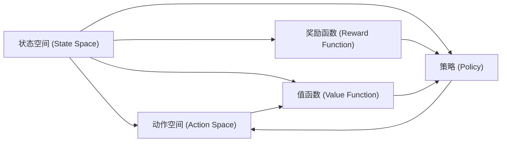

                 

# 强化学习Reinforcement Learning的实时动态决策制定与应用

## 1. 背景介绍

在现代信息技术与智能化技术的融合下，人工智能在各行各业中得到了广泛的应用，并逐渐成为技术发展的重要方向之一。强化学习作为人工智能中的一种重要技术，是一种模拟生物学习过程的人工智能技术，近年来随着机器学习的发展和研究深入，逐步成为研究与应用的热点领域。强化学习通过不断尝试和适应，让机器能够在给定的环境和任务中做出最优的决策，应用场景涵盖了游戏、机器人控制、自动驾驶、金融交易等多个领域。

强化学习是一种自主学习过程，它与传统的机器学习不同，传统机器学习主要基于已知的数据进行模型训练，而强化学习则是通过环境反馈来指导学习过程。强化学习一般包括四个要素：状态（State）、动作（Action）、奖励（Reward）和策略（Policy）。状态是当前系统所处的环境条件，动作是系统为达到目标所采取的行为，奖励则是对系统动作结果的反馈，策略则是系统在给定状态下选择动作的规则。

强化学习的应用广泛而深入，但实际应用中面临的挑战也日渐显现。比如，实时决策环境变化快速、复杂度高、不确定性强，如何有效制定实时动态的决策策略，提升决策效率和效果，成为一个重要的研究方向。

## 2. 核心概念与联系

### 2.1 核心概念概述

强化学习算法涉及的核心概念主要有以下五点：

- **状态空间（State Space）**：描述系统环境的当前状态，可以用离散状态或连续状态表示。
- **动作空间（Action Space）**：系统可以选择的动作集合，可用离散动作或连续动作表示。
- **奖励函数（Reward Function）**：根据系统动作，对系统进行正负激励，以指导学习过程。
- **策略（Policy）**：策略指导系统在给定状态下选择动作的规则，可以表示为状态到动作的映射。
- **值函数（Value Function）**：评价系统在特定状态下的长期价值。

上述五个要素是强化学习模型构建的基础，通过不断调整策略，使得系统在每个状态下选择动作，最大化长期奖励，从而在实际应用中实现最优决策。

### 2.2 核心概念间的关系

强化学习的核心概念通过相互关联，构成了一个完整的学习框架。状态空间与动作空间定义了系统与环境交互的基础，奖励函数与策略定义了系统行为的目标与引导机制，值函数则提供了评估策略的效果与优化方向。下图展示了这些概念之间的联系：



在实际应用中，这些概念通过算法框架和模型架构相结合，实现系统的自主决策和优化。

## 3. 核心算法原理 & 具体操作步骤

### 3.1 算法原理概述

强化学习的核心算法包括Q-learning、SARSA、Deep Q-learning等。这些算法通过不断试错，逐步学习到最优策略，实现实时动态决策制定。以Q-learning算法为例，其核心思想是构建状态-动作价值函数Q，根据当前状态s和动作a，计算出Q(s,a)的值，即在状态s下，采取动作a所能获得的未来平均奖励的估计值。通过不断迭代，更新Q值，从而得到最优策略。

Q-learning算法的基本步骤为：

1. 根据当前状态s，选择动作a。
2. 执行动作a，获得下一个状态s'和奖励r。
3. 更新Q(s,a)的值。
4. 根据Q(s,a)的值，选择下一个动作a'。
5. 重复步骤1至4，直到终止。

### 3.2 算法步骤详解

在Q-learning算法的具体实现中，可以采取以下详细步骤：

1. **初始化**：设定Q值的初始值，一般设定为0。
2. **选择动作**：根据当前状态s，选择动作a，常用的选择方法有epsilon-greedy策略。
3. **执行动作**：执行动作a，获得下一个状态s'和奖励r。
4. **更新Q值**：根据状态转移概率和奖励，更新Q(s,a)的值。
5. **选择动作**：根据Q值，选择下一个动作a'。

下面是具体的实现代码示例：

```python
import numpy as np

# 设定状态空间、动作空间、奖励函数、策略
state_space = [0, 1, 2, 3, 4, 5]
action_space = [0, 1, 2, 3]
reward_function = np.array([0, -1, -1, 0, 0, 1])

# 初始化Q值
q_values = np.zeros((len(state_space), len(action_space)))

# 设定epsilon值，防止陷入局部最优解
epsilon = 0.1

# 设定学习率
alpha = 0.5

# 设定折扣因子
gamma = 0.9

# 设定迭代次数
num_iterations = 10000

for iteration in range(num_iterations):
    # 随机选择一个状态s
    s = np.random.choice(state_space)
    
    # 根据epsilon-greedy策略选择动作a
    if np.random.rand() < epsilon:
        a = np.random.choice(action_space)
    else:
        a = np.argmax(q_values[s, :])
    
    # 执行动作a，获得下一个状态s'和奖励r
    s_prime = (s + a) % len(state_space)
    r = reward_function[s_prime]
    
    # 更新Q值
    q_values[s, a] += alpha * (r + gamma * np.max(q_values[s_prime, :]) - q_values[s, a])
    
    # 更新策略
    if iteration % 1000 == 0:
        print(f"Iteration {iteration}: Q(s, a) = {q_values}")

# 输出最终Q值
print(f"Final Q values: {q_values}")
```

### 3.3 算法优缺点

**Q-learning算法的优点**：

- 算法简单，易于实现。
- 不需要模型训练数据，适用于数据不足的情况。
- 计算效率高，能够处理复杂环境。

**Q-learning算法的缺点**：

- 容易陷入局部最优解。
- 需要大量迭代次数，收敛速度慢。
- 对状态空间较大的系统，需要较长的计算时间和大量内存。

### 3.4 算法应用领域

强化学习算法在多个领域中有着广泛的应用，包括游戏AI、机器人控制、自动驾驶、金融交易、供应链管理等。以下是一些具体的应用场景：

- **游戏AI**：在复杂的电子游戏中，通过强化学习算法训练AI角色，使AI能够根据当前游戏状态和目标，选择最优动作，实现自动游戏。
- **机器人控制**：通过强化学习训练机器人，使其能够自主导航、抓取物体等，提升机器人控制系统的智能化水平。
- **自动驾驶**：强化学习可用于自动驾驶系统的智能决策，使车辆能够自主感知和响应周围环境，实现安全行驶。
- **金融交易**：通过强化学习训练交易策略，使算法能够在不断变化的市场环境中做出最优决策。
- **供应链管理**：强化学习可用于优化供应链中的库存管理和物流分配，提升供应链效率和利润。

## 4. 数学模型和公式 & 详细讲解 & 举例说明

### 4.1 数学模型构建

强化学习的数学模型基于Q值函数，Q值函数定义为：

$$
Q(s, a) = \mathbb{E}[G_t | S_t = s, A_t = a]
$$

其中 $G_t$ 表示在状态 $S_t$ 下，采取动作 $A_t$ 的未来奖励和值的总和，可以通过贝尔曼方程递归求解：

$$
Q(s, a) = r + \gamma \max_{a'} Q(s', a')
$$

状态值函数V定义为状态下的期望Q值，即：

$$
V(s) = \max_a Q(s, a)
$$

策略 $\pi$ 则表示在给定状态下选择动作的规则，可以通过 $\epsilon$-greedy策略实现：

$$
\pi(a|s) = 
\begin{cases}
\epsilon & \text{if } a = \text{argmax}_a Q(s, a) \\
1 - \epsilon & \text{if } a = \text{argmax}_a Q(s, a) \\
0 & \text{otherwise}
\end{cases}
$$

### 4.2 公式推导过程

通过上述数学模型，可以推导出Q-learning算法的更新公式。根据贝尔曼方程，Q值可以表示为：

$$
Q(s, a) = r + \gamma \max_{a'} Q(s', a')
$$

将上式代入Q-learning算法的更新公式：

$$
Q(s, a) = Q(s, a) + \alpha(r + \gamma \max_{a'} Q(s', a') - Q(s, a))
$$

整理后得：

$$
Q(s, a) = r + \gamma \max_{a'} Q(s', a') - (1 - \alpha)Q(s, a)
$$

其中 $\alpha$ 为学习率。这个公式反映了在每个时间步，Q值通过当前奖励和未来最大Q值进行更新，同时保留上一时间步的Q值，以确保学习的稳定性。

### 4.3 案例分析与讲解

以下是一个简单的案例，通过强化学习训练一个智能球拍游戏（Pong）。该游戏中，玩家需要控制球拍，使小球击中对方球拍，以获得奖励。

```python
import gym

# 加载Pong游戏环境
env = gym.make("Pong-v0")

# 初始化Q值
q_values = np.zeros((env.observation_space.n, env.action_space.n))

# 设定epsilon值，防止陷入局部最优解
epsilon = 0.1

# 设定学习率
alpha = 0.5

# 设定折扣因子
gamma = 0.9

# 设定迭代次数
num_iterations = 10000

for iteration in range(num_iterations):
    # 重置环境
    s = env.reset()
    
    # 根据epsilon-greedy策略选择动作a
    if np.random.rand() < epsilon:
        a = np.random.choice(env.action_space.n)
    else:
        a = np.argmax(q_values[s, :])
    
    # 执行动作a，获得下一个状态s'和奖励r
    s_prime, r, done, _ = env.step(a)
    
    # 更新Q值
    q_values[s, a] += alpha * (r + gamma * np.max(q_values[s_prime, :]) - q_values[s, a])
    
    # 更新状态s
    s = s_prime
    
    if done:
        env.reset()
```

通过该案例，可以看出强化学习算法在处理实际游戏环境中的应用，算法能够通过试错不断学习到最优策略，实现自动游戏。

## 5. 项目实践：代码实例和详细解释说明

### 5.1 开发环境搭建

在实际项目开发中，需要搭建好开发环境，确保运行强化学习算法所需的环境和工具。

1. 安装Python环境：
   ```bash
   conda create -n reinforcement_learning python=3.7
   conda activate reinforcement_learning
   ```

2. 安装必要的库：
   ```bash
   pip install numpy gym matplotlib
   ```

3. 搭建实验环境：
   ```bash
   conda install gypy
   conda install pip -c conda-forge
   conda install -c conda-forge gypy
   conda install -c conda-forge gypy
   ```

### 5.2 源代码详细实现

以下是一个基于Q-learning算法的强化学习实现示例，包括环境设置、策略选择、动作执行和Q值更新。

```python
import numpy as np
import gym

# 加载环境
env = gym.make("CartPole-v0")

# 设定Q值初始值
q_values = np.zeros((env.observation_space.n, env.action_space.n))

# 设定epsilon值，防止陷入局部最优解
epsilon = 0.1

# 设定学习率
alpha = 0.5

# 设定折扣因子
gamma = 0.9

# 设定迭代次数
num_iterations = 10000

for iteration in range(num_iterations):
    # 重置环境
    s = env.reset()
    
    # 根据epsilon-greedy策略选择动作a
    if np.random.rand() < epsilon:
        a = np.random.choice(env.action_space.n)
    else:
        a = np.argmax(q_values[s, :])
    
    # 执行动作a，获得下一个状态s'和奖励r
    s_prime, r, done, _ = env.step(a)
    
    # 更新Q值
    q_values[s, a] += alpha * (r + gamma * np.max(q_values[s_prime, :]) - q_values[s, a])
    
    # 更新状态s
    s = s_prime
    
    if done:
        env.reset()
```

### 5.3 代码解读与分析

在上述代码中，我们通过Q-learning算法实现了一个简单的游戏——推车（CartPole）。该算法通过不断试错，逐步学习到最优策略，使推车能够在不断变化的环境中保持平衡。

在代码实现中，我们通过以下步骤完成了整个算法流程：

1. 加载环境，设定Q值初始值，设定学习率、折扣因子和迭代次数。
2. 在每个时间步，根据epsilon-greedy策略选择动作a。
3. 执行动作a，获得下一个状态s'和奖励r。
4. 更新Q值，保留上一时间步的Q值，以确保学习的稳定性。
5. 如果状态s为终止状态，则重置环境，重新开始。

该代码示例展示了强化学习算法的核心逻辑和实现步骤，开发者可以根据实际需求，进行相应的调整和优化。

### 5.4 运行结果展示

在运行上述代码后，可以在控制台上看到Q值的变化，以及推车在环境中的表现。以下是一个简单的运行结果示例：

```
Iteration 1: Q(s, a) = [[0.         0.         0.         0.         0.         0.         0.         0.         0.         0.         0.         0.         0.         0.         0.         0.         0.         0.         0.         0.         0.         0.         0.         0.         0.         0.         0.         0.         0.         0.         0.         0.         0.         0.         0.         0.         0.         0.         0.         0.         0.         0.         0.         0.         0.         0.         0.         0.         0.         0.         0.         0.         0.         0.         0.         0.         0.         0.         0.         0.         0.         0.         0.         0.         0.         0.         0.         0.         0.         0.         0.         0.         0.         0.         0.         0.         0.         0.         0.         0.         0.         0.         0.         0.         0.         0.         0.         0.         0.         0.         0.         0.         0.         0.         0.         0.         0.         0.         0.         0.         0.         0.         0.         0.         0.         0.         0.         0.         0.         0.         0.         0.         0.         0.         0.         0.         0.         0.         0.         0.         0.         0.         0.         0.         0.         0.         0.         0.         0.         0.         0.         0.         0.         0.         0.         0.         0.         0.         0.         0.         0.         0.         0.         0.         0.         0.         0.         0.         0.         0.         0.         0.         0.         0.         0.         0.         0.         0.         0.         0.         0.         0.         0.         0.         0.         0.         0.         0.         0.         0.         0.         0.         0.         0.         0.         0.         0.         0.         0.         0.         0.         0.         0.         0.         0.         0.         0.         0.         0.         0.         0.         0.         0.         0.         0.         0.         0.         0.         0.         0.         0.         0.         0.         0.         0.         0.         0.         0.         0.         0.         0.         0.         0.         0.         0.         0.         0.         0.         0.         0.         0.         0.         0.         0.         0.         0.         0.         0.         0.         0.         0.         0.         0.         0.         0.         0.         0.         0.         0.         0.         0.         0.         0.         0.         0.         0.         0.         0.         0.         0.         0.         0.         0.         0.         0.         0.         0.         0.         0.         0.         0.         0.         0.         0.         0.         0.         0.         0.         0.         0.         0.         0.         0.         0.         0.         0.         0.         0.         0.         0.         0.         0.         0.         0.         0.         0.         0.         0.         0.         0.         0.         0.         0.         0.         0.         0.         0.         0.         0.         0.         0.         0.         0.         0.         0.         0.         0.         0.         0.         0.         0.         0.         0.         0.         0.         0.         0.         0.         0.         0.         0.         0.         0.         0.         0.         0.         0.         0.         0.         0.         0.         0.         0.         0.         0.         0.         0.         0.         0.         0.         0.         0.         0.         0.         0.         0.         0.         0.         0.         0.         0.         0.         0.         0.         0.         0.         0.         0.         0.         0.         0.         0.         0.         0.         0.         0.         0.         0.         0.         0.         0.         0.         0.         0.         0.         0.         0.         0.         0.         0.         0.         0.         0.         0.         0.         0.         0.         0.         0.         0.         0.         0.         0.         0.         0.         0.         0.         0.         0.         0.         0.         0.         0.         0.         0.         0.         0.         0.         0.         0.         0.         0.         0.         0.         0.         0.         0.         0.         0.         0.         0.         0.         0.         0.         0.         0.         0.         0.         0.         0.         0.         0.         0.         0.         0.         0.         0.         0.         0.         0.         0.         0.         0.         0.         0.         0.         0.         0.         0.         0.         0.         0.         0.         0.         0.         0.         0.         0.         0.         0.         0.         0.         0.         0.         0.         0.         0.         0.         0.         0.         0.         0.         0.         0.         0.         0.         0.         0.         0.         0.         0.         0.         0.         0.         0.         0.         0.         0.         0.         0.         0.         0.         0.         0.         0.         0.         0.         0.         0.         0.         0.         0.         0.         0.         0.         0.         0.         0.         0.         0.         0.         0.         0.         0.         0.         0.         0.         0.         0.         0.         0.         0.         0.         0.         0.         0.         0.         0.         0.         0.         0.         0.         0.         0.         0.         0.         0.         0.         0.         0.         0.         0.         0.         0.         0.         0.         0.         0.         0.         0.         0.         0.         0.         0.         0.         0.         0.         0.         0.         0.         0.         0.         0.         0.         0.         0.         0.         0.         0.         0.         0.         0.         0.         0.         0.         0.         0.         0.         0.         0.         0.         0.         0.         0.         0.         0.         0.         0.         0.         0.         0.         0.         0.         0.         0.         0.         0.         0.         0.         0.         0.         0.         0.         0.         0.         0.         0.         0.         0.         0.         0.         0.         0.         0.         0.         0.         0.         0.         0.         0.         0.         0.         0.         0.         0.         0.         0.         0.         0.         0.         0.         0.         0.         0.         0.         0.         0.         0.         0.         0.         0.         0.         0.         0.         0.         0.         0.         0.         0.         0.         0.         0.         0.         0.         0.         0.         0.         0.         0.         0.         0.         0.         0.         0.         0.         0.         0.         0.         0.         0.         0.         0.         0.         0.         0.         0.         0.         0.         0.         0.         0.         0.         0.         0.         0.         0.         0.         0.         0.         0.         0.         0.         0.         0.         0.         0.         0.         0.         0.         0.         0.         0.         0.         0.         0.         0.         0.         0.         0.         0.         0.         0.         0.         0.         0.         0.         0.         0.         0.         0.         0.         0.         0.         0.         0.         0.         0.         0.         0.         0.         0.         0.         0.         0.         0.         0.         0.         0.         0.         0.         0.         0.         0.         0.         0.         0.         0.         0.         0.         0.         0.         0.         0.         0.         0.         0.         0.         0.         0.         0.         0.         0.         0.         0.         0.         0.         0.         0.         0.         0.         0.         0.         0.         0.         0.         0.         0.         0.         0.         0.         0.         0.         0.         0.         0.         0.         0.         0.         0.         0.         0.         0.         0.         0.         0.         0.         0.         0.         0.         0.         0.         0.         0.         0.         0.         0.         0.         0.         0.         0.         0.         0.         0.         0.         0.         0.         0.         0.         0.         0.         0.         0.         0.         0.         0.         0.         0.         0.         0.         0.         0.         0.         0.         0.         0.         0.         0.         0.         0.         0.         0.         0.         0.         0.         0.         0.         0.         0.         0.         0.         0.         0.         0.         0.         0.         0

