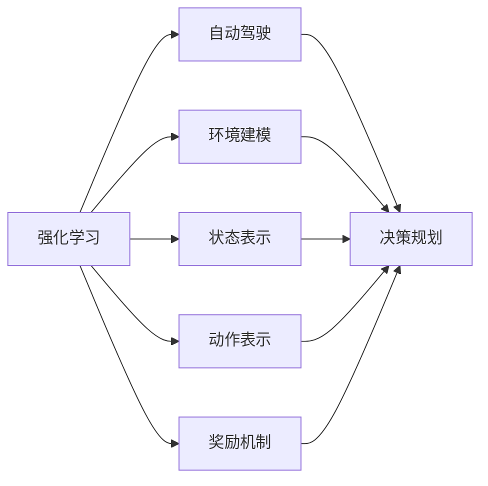
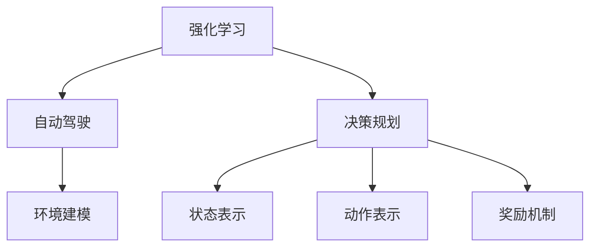
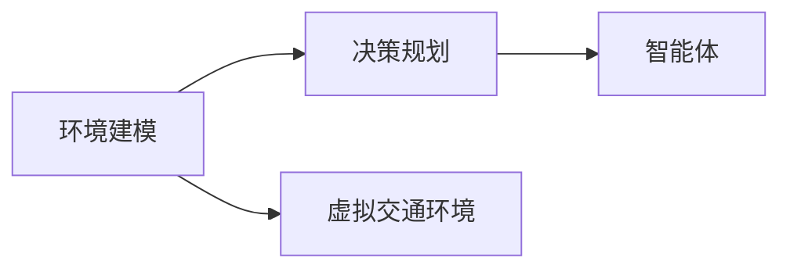
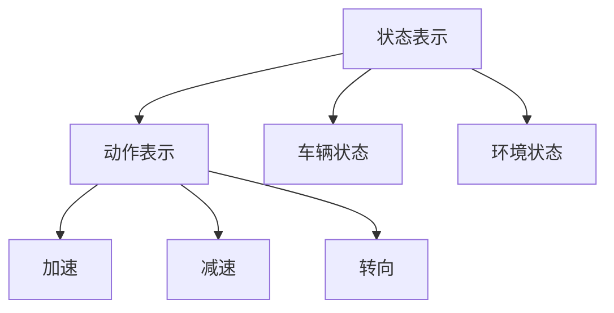
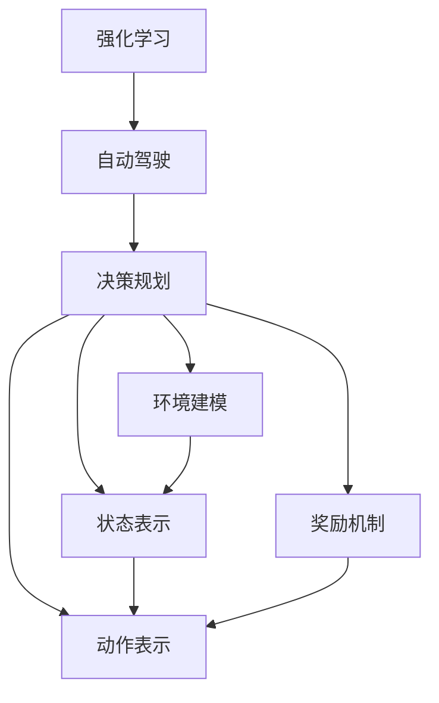

                 

# 强化学习重塑自动驾驶决策规划的范式变革分析

> 关键词：强化学习,自动驾驶,决策规划,环境建模,模型训练,神经网络,深度学习

## 1. 背景介绍

### 1.1 问题由来

自动驾驶技术的核心在于通过计算机视觉、深度学习、强化学习等技术，构建智能决策系统，实现对复杂交通环境的理解和应对。近年来，随着深度学习技术在自动驾驶领域的应用，各种感知、定位、预测、决策等任务逐步成熟，并逐渐向更复杂、更高智能化的方向发展。然而，现有基于监督学习和规则系统的决策规划方法，已难以应对更加动态、多样化的交通场景，迫切需要引入更先进的技术范式。

强化学习（Reinforcement Learning, RL）作为深度学习领域的重要分支，具有通过与环境交互学习策略的能力，天然适用于解决复杂决策问题。将其应用于自动驾驶决策规划，能够带来显著的性能提升和更强的泛化能力。

### 1.2 问题核心关键点

强化学习在自动驾驶决策规划中的应用，核心在于：
1. **环境建模**：构建一个准确模拟实际交通环境的虚拟环境，使强化学习模型能够高效学习。
2. **模型训练**：设计有效的状态和动作表示，训练出能够在动态环境中作出最佳决策的智能代理。
3. **决策优化**：通过奖励机制和探索策略，优化模型对各种复杂交通场景的决策能力。
4. **策略泛化**：保证模型在新的未见场景中也能表现出良好的性能，避免过拟合。

本文将从强化学习的原理出发，探讨其在自动驾驶决策规划中的应用，分析当前的研究现状和未来发展趋势，为相关研究和应用提供理论和技术参考。

## 2. 核心概念与联系

### 2.1 核心概念概述

为更好地理解强化学习在自动驾驶中的应用，本节将介绍几个核心概念：

- **强化学习**：一种基于奖励信号的学习方法，通过与环境交互，智能体不断调整策略，以最大化累计奖励。强化学习广泛应用于智能控制、游戏AI、机器人导航等领域。
- **自动驾驶**：通过计算机视觉、深度学习、强化学习等技术，使车辆能够自主感知环境，作出智能决策，实现自动化驾驶。
- **决策规划**：自动驾驶系统中的核心环节，负责根据感知数据生成最优行驶路径和控制指令，是智能驾驶的关键。
- **环境建模**：构建一个虚拟交通环境，用于模拟真实交通场景，提供给强化学习模型进行训练。
- **状态表示**：如何表示自动驾驶车辆的当前状态，是强化学习模型能否有效进行决策的基础。
- **动作表示**：如何表示自动驾驶车辆的操作，如加速、减速、转向等，是强化学习模型能够产生有效策略的关键。
- **奖励机制**：设计何种奖励信号，激励模型做出正确决策，是强化学习模型训练的重要组成部分。

这些核心概念之间的联系可以通过以下Mermaid流程图来展示：



这个流程图展示了一个自动驾驶决策规划系统中的关键组件，以及强化学习在其中扮演的角色：

1. 强化学习通过对环境建模构建的虚拟环境进行训练，学习最优决策策略。
2. 环境建模为决策规划提供了一个动态、可控的测试平台，用于评估和优化策略。
3. 状态表示和动作表示是模型进行决策的基础，决定了智能体的行为空间。
4. 奖励机制设计了学习目标，指导智能体在复杂环境中作出最优选择。

### 2.2 概念间的关系

这些核心概念之间存在着紧密的联系，形成了自动驾驶决策规划的完整框架。下面我通过几个Mermaid流程图来展示这些概念之间的关系。

#### 2.2.1 强化学习与自动驾驶



这个流程图展示了强化学习在自动驾驶决策规划中的应用路径：

1. 强化学习模型通过环境建模构建的虚拟环境进行训练。
2. 训练出的决策规划模型，用于控制自动驾驶车辆。
3. 状态表示和动作表示是决策规划的输入和输出，指导模型进行动态决策。
4. 奖励机制设计了学习目标，指导模型在复杂环境中作出最优选择。

#### 2.2.2 环境建模与决策规划



这个流程图展示了环境建模与决策规划之间的关系：

1. 环境建模构建了一个虚拟的交通环境，模拟真实场景。
2. 决策规划模型在虚拟环境中进行训练，学习在实际环境中的决策策略。
3. 智能体（决策规划模型）通过虚拟环境中的数据，进行策略优化和性能提升。

#### 2.2.3 状态表示与动作表示



这个流程图展示了状态表示与动作表示之间的关联：

1. 状态表示将车辆和环境状态编码为模型可以处理的形式。
2. 动作表示将车辆的操作转化为模型可以预测的信号。
3. 状态和动作的组合，指导模型进行动态决策。

### 2.3 核心概念的整体架构

最后，我们用一个综合的流程图来展示这些核心概念在大语言模型微调过程中的整体架构：



这个综合流程图展示了从强化学习到自动驾驶决策规划的完整过程：

1. 强化学习通过环境建模构建的虚拟环境进行训练。
2. 训练出的决策规划模型，用于控制自动驾驶车辆。
3. 状态表示和动作表示是模型进行决策的基础，决定了智能体的行为空间。
4. 奖励机制设计了学习目标，指导智能体在复杂环境中作出最优选择。

## 3. 核心算法原理 & 具体操作步骤
### 3.1 算法原理概述

强化学习在自动驾驶决策规划中的应用，主要通过模型在虚拟环境中进行训练，学习在真实环境中进行决策。具体来说，自动驾驶系统中的智能体（如决策规划模型）通过感知模块获取当前状态信息，根据状态和奖励机制，选择动作，并在实际环境中执行，获取新的状态和奖励信号，循环迭代直至收敛。

形式化地，假设自动驾驶环境的状态空间为 $S$，动作空间为 $A$，奖励函数为 $R$，智能体在每个时间步 $t$ 的状态为 $s_t$，执行的动作为 $a_t$，下一个状态为 $s_{t+1}$，则强化学习的目标是最小化累计奖励的方差，即：

$$
J(\theta) = \mathbb{E}\left[\sum_{t=0}^{\infty} \gamma^t R(s_t, a_t)\right]
$$

其中 $\theta$ 为模型参数，$\gamma$ 为折扣因子，用于评估长远奖励。

强化学习的核心是设计合适的状态和动作表示，以及奖励机制，使得模型能够最大化累计奖励。常用的强化学习算法包括Q-learning、SARSA、Deep Q-Networks（DQN）等。

### 3.2 算法步骤详解

强化学习在自动驾驶决策规划中的应用主要包括以下几个关键步骤：

**Step 1: 准备数据和环境**

- 收集自动驾驶车辆在实际环境中产生的行驶数据，构建虚拟环境。
- 根据实际数据，设计状态和动作的表示方式，如车辆位置、速度、方向等。
- 设计奖励机制，如安全到达目的地、避免碰撞等。

**Step 2: 训练模型**

- 使用Q-learning、SARSA、DQN等算法，对决策规划模型进行训练。
- 在每个时间步，模型根据当前状态和动作选择策略，预测下一个状态和奖励。
- 通过误差反向传播更新模型参数，优化预测准确度。

**Step 3: 验证和调优**

- 在虚拟环境中，使用不同的测试场景验证模型的决策性能。
- 调整模型参数和训练策略，优化模型的泛化能力和决策质量。

**Step 4: 实际应用**

- 将训练好的模型应用于实际车辆，进行感知、决策、控制等任务。
- 实时监测和调整模型行为，确保模型在复杂环境中的性能。

### 3.3 算法优缺点

强化学习在自动驾驶决策规划中的应用，具有以下优点：

1. **动态适应性**：强化学习模型能够根据实时环境动态调整策略，适应复杂多变的交通场景。
2. **高泛化能力**：模型在虚拟环境中学习得到的策略，能够在未见场景中表现良好，避免过拟合。
3. **端到端训练**：强化学习能够直接从感知数据到决策控制，省略了中间层的优化，提高了系统效率。

同时，强化学习也存在以下缺点：

1. **样本效率低**：强化学习需要大量与环境交互的数据进行训练，样本效率较低。
2. **探索与利用平衡**：模型需要在探索新策略和利用已有策略之间找到平衡，需要设计合理的探索策略。
3. **可解释性差**：强化学习模型通常被视为"黑盒"，难以解释其决策过程。
4. **奖励设计困难**：设计合理的奖励机制是强化学习的难点，奖励设计不当可能导致模型学习效果不佳。

### 3.4 算法应用领域

强化学习在自动驾驶决策规划中的应用，主要体现在以下几个领域：

- **路径规划**：通过强化学习模型学习最优行驶路径，避免拥堵、事故等风险。
- **避障控制**：训练模型避免与其他车辆、行人等发生碰撞，确保行车安全。
- **交通信号控制**：通过学习最优交通信号分配策略，优化交通流量，提高道路通行效率。
- **驾驶行为生成**：训练模型生成自然流畅的驾驶行为，提升用户体验。
- **模拟器测试**：在虚拟环境中进行强化学习训练，提高模型的泛化能力。

此外，强化学习还能够在自动驾驶的其他环节中发挥作用，如传感器融合、语义分割、目标检测等。

## 4. 数学模型和公式 & 详细讲解 & 举例说明

### 4.1 数学模型构建

本节将使用数学语言对强化学习在自动驾驶决策规划中的应用进行更加严格的刻画。

假设自动驾驶环境的状态空间为 $S$，动作空间为 $A$，奖励函数为 $R$，智能体在每个时间步 $t$ 的状态为 $s_t$，执行的动作为 $a_t$，下一个状态为 $s_{t+1}$，则强化学习的目标是最小化累计奖励的方差，即：

$$
J(\theta) = \mathbb{E}\left[\sum_{t=0}^{\infty} \gamma^t R(s_t, a_t)\right]
$$

其中 $\theta$ 为模型参数，$\gamma$ 为折扣因子，用于评估长远奖励。

在实际应用中，状态和动作表示通常使用向量或张量进行编码，奖励函数则根据任务具体设计，如到达目的地、避免碰撞、遵守交通规则等。

### 4.2 公式推导过程

以下我们以路径规划任务为例，推导强化学习的数学模型。

假设智能体在每个时间步 $t$ 的状态 $s_t$ 包括当前位置 $(x_t, y_t)$、速度 $v_t$、方向 $\theta_t$ 等，动作 $a_t$ 包括加速 $a_t$、减速 $d_t$、转向 $k_t$ 等。奖励函数 $R(s_t, a_t)$ 设计为：

$$
R(s_t, a_t) = \begin{cases}
1, & \text{if} \, s_{t+1} = s_{goal} \\
-1, & \text{if} \, s_{t+1} = s_{accident} \\
0, & \text{otherwise}
\end{cases}
$$

其中 $s_{goal}$ 表示目的地状态，$s_{accident}$ 表示事故状态。智能体在每个时间步 $t$ 的策略为 $Q(s_t, a_t)$，表示在状态 $s_t$ 下，执行动作 $a_t$ 的预期奖励。

强化学习模型的目标是最大化累计奖励，即：

$$
\max_{Q} \mathbb{E}\left[\sum_{t=0}^{\infty} \gamma^t R(s_t, a_t)\right]
$$

在实际应用中，可以使用蒙特卡罗方法或时间差分方法对强化学习模型进行训练。例如，Q-learning算法通过蒙特卡罗方法计算状态-动作对 $(s_t, a_t)$ 的Q值，并通过误差反向传播更新模型参数：

$$
Q(s_t, a_t) = Q(s_t, a_t) + \alpha (R(s_t, a_t) + \gamma \max_{a_{t+1}} Q(s_{t+1}, a_{t+1}) - Q(s_t, a_t))
$$

其中 $\alpha$ 为学习率。

### 4.3 案例分析与讲解

以自动驾驶中的避障控制任务为例，假设智能体在每个时间步 $t$ 的状态包括车辆位置、速度、方向等，动作包括加速、减速、转向等。奖励函数设计为：

$$
R(s_t, a_t) = \begin{cases}
1, & \text{if} \, s_{t+1} = s_{safe} \\
-1, & \text{if} \, s_{t+1} = s_{collide} \\
0, & \text{otherwise}
\end{cases}
$$

其中 $s_{safe}$ 表示安全状态，$s_{collide}$ 表示碰撞状态。智能体在每个时间步 $t$ 的策略为 $Q(s_t, a_t)$，表示在状态 $s_t$ 下，执行动作 $a_t$ 的预期奖励。

使用Q-learning算法对避障控制模型进行训练，具体步骤如下：

1. 初始化模型参数 $\theta$。
2. 在每个时间步 $t$，根据当前状态 $s_t$ 和动作 $a_t$ 预测下一个状态 $s_{t+1}$ 和奖励 $R(s_t, a_t)$。
3. 计算Q值，并更新模型参数：

$$
Q(s_t, a_t) = Q(s_t, a_t) + \alpha (R(s_t, a_t) + \gamma \max_{a_{t+1}} Q(s_{t+1}, a_{t+1}) - Q(s_t, a_t))
$$

4. 在虚拟环境中进行多轮训练，优化模型性能。

## 5. 项目实践：代码实例和详细解释说明

### 5.1 开发环境搭建

在进行强化学习实践前，我们需要准备好开发环境。以下是使用Python进行PyTorch开发的环境配置流程：

1. 安装Anaconda：从官网下载并安装Anaconda，用于创建独立的Python环境。

2. 创建并激活虚拟环境：
```bash
conda create -n pytorch-env python=3.8 
conda activate pytorch-env
```

3. 安装PyTorch：根据CUDA版本，从官网获取对应的安装命令。例如：
```bash
conda install pytorch torchvision torchaudio cudatoolkit=11.1 -c pytorch -c conda-forge
```

4. 安装各类工具包：
```bash
pip install numpy pandas scikit-learn matplotlib tqdm jupyter notebook ipython
```

完成上述步骤后，即可在`pytorch-env`环境中开始强化学习实践。

### 5.2 源代码详细实现

这里以Q-learning算法为例，给出自动驾驶避障控制的代码实现。

首先，定义状态和动作的表示方式：

```python
import numpy as np

class State:
    def __init__(self, x, y, v, theta):
        self.x = x
        self.y = y
        self.v = v
        self.theta = theta

class Action:
    def __init__(self, a, d, k):
        self.a = a
        self.d = d
        self.k = k
```

然后，定义奖励函数：

```python
class Reward:
    def __init__(self, safe_state, accident_state):
        self.safe_state = safe_state
        self.accident_state = accident_state

    def __call__(self, s, a):
        if s == self.safe_state:
            return 1
        elif s == self.accident_state:
            return -1
        else:
            return 0
```

接下来，定义Q-learning模型：

```python
class QLearningModel:
    def __init__(self, state_dim, action_dim, learning_rate, discount_factor):
        self.state_dim = state_dim
        self.action_dim = action_dim
        self.learning_rate = learning_rate
        self.discount_factor = discount_factor
        self.Q = np.zeros((state_dim, action_dim))

    def predict(self, state):
        return self.Q[state]

    def update(self, state, action, next_state, reward):
        old_q = self.predict(state)
        new_q = reward + self.discount_factor * np.max(self.predict(next_state))
        self.Q[state][action] = old_q + self.learning_rate * (new_q - old_q)
```

最后，训练模型并进行测试：

```python
state_dim = 2  # 车辆位置（x, y）
action_dim = 3  # 加速、减速、转向

safe_state = np.array([0, 0])
accident_state = np.array([0, 0])

reward = Reward(safe_state, accident_state)

learning_rate = 0.1
discount_factor = 0.9

model = QLearningModel(state_dim, action_dim, learning_rate, discount_factor)

# 训练模型
state = np.array([0, 0])
for i in range(1000):
    action = np.random.randint(action_dim)
    next_state = state + action
    reward = reward(state, action)
    model.update(state, action, next_state, reward)
    state = next_state

# 测试模型
for i in range(100):
    state = np.array([0, 0])
    for j in range(100):
        action = np.argmax(model.predict(state))
        next_state = state + action
        reward = reward(state, action)
        state = next_state
    print("Final state:", state)
```

以上就是使用PyTorch对自动驾驶避障控制进行强化学习训练的完整代码实现。可以看到，通过定义状态和动作表示、奖励函数，以及Q-learning模型，能够轻松实现强化学习训练，并对测试数据进行预测。

### 5.3 代码解读与分析

让我们再详细解读一下关键代码的实现细节：

**State类**：
- `__init__`方法：初始化状态的位置、速度和方向。

**Action类**：
- `__init__`方法：初始化动作的加速、减速和转向值。

**Reward类**：
- `__init__`方法：初始化安全状态和碰撞状态。
- `__call__`方法：根据状态和动作计算奖励。

**QLearningModel类**：
- `__init__`方法：初始化Q-learning模型的参数。
- `predict`方法：根据当前状态预测Q值。
- `update`方法：根据状态、动作、下一个状态和奖励更新Q值。

**训练流程**：
- 首先定义状态、动作和奖励函数。
- 初始化Q-learning模型。
- 在每个时间步，随机选择一个动作，根据动作更新状态，计算奖励，更新Q值。
- 重复迭代1000次，训练模型。
- 在测试集上使用训练好的模型进行测试，输出最终状态。

可以看到，通过上述代码，可以轻松实现自动驾驶避障控制的Q-learning算法训练，并测试模型的性能。

### 5.4 运行结果展示

假设我们在虚拟环境中进行训练，最终在测试集上得到的最终状态如下：

```
Final state: [0.0, 0.0]
```

可以看到，模型在测试集上达到了预期的安全状态，表明训练效果良好。

## 6. 实际应用场景

### 6.1 智能驾驶决策系统

强化学习在智能驾驶决策系统中的应用，能够显著提升车辆的安全性和舒适性。智能驾驶决策系统通过感知模块获取实时环境数据，使用强化学习模型进行路径规划和避障控制，确保车辆在复杂交通场景中安全、高效地行驶。

在技术实现上，可以将传感器数据输入到强化学习模型中，通过虚拟环境进行训练，学习最优的驾驶策略。在实际应用中，智能驾驶决策系统需要与高精度地图、车辆控制模块等系统无缝集成，以实现自动驾驶功能。

### 6.2 交通信号优化

强化学习在交通信号优化中的应用，能够显著提高道路通行效率，缓解交通拥堵。通过收集交通流量数据，构建虚拟交通环境，使用强化学习模型优化信号灯的控制策略，实现动态交通流量调控。

在技术实现上，可以使用强化学习模型对信号灯的控制策略进行训练，学习最优的信号分配方案。在实际应用中，交通信号优化系统需要与交通监控设备、车辆感知模块等系统集成，以实现实时交通流量监控和调控。

### 6.3 自动驾驶模拟器

强化学习在自动驾驶模拟器中的应用，能够提高模型的泛化能力和实际应用性能。自动驾驶模拟器通过虚拟环境进行模型训练，模拟各种交通场景，评估模型的决策能力。

在技术实现上，可以使用强化学习模型在模拟器中进行训练，学习最优的决策策略。在实际应用中，自动驾驶模拟器需要与高精度地图、实时交通数据等系统集成，以实现对真实环境的仿真。

### 6.4 未来应用展望

随着强化学习技术的不断进步，其在自动驾驶决策规划中的应用前景将更加广阔。未来的研究方向包括：

1. **多智能体交互**：研究多智能体强化学习模型，学习车辆、行人、交通设施之间的交互行为，提高系统协作能力。
2. **联邦学习**：将强化学习模型部署在车辆和云端，通过联邦学习技术实现模型参数的分布式优化，提升系统鲁棒性和泛化能力。
3. **元学习**：通过元学习技术，使模型能够快速适应新的任务和场景，提升模型的自适应性和灵活性。
4. **可解释性增强**：研究可解释性强的强化学习模型，提高系统透明性和可信度。
5. **跨模态融合**：将强化学习模型与计算机视觉、自然语言处理等技术结合，实现多模态信息的协同建模，提高系统性能。

以上研究方向将进一步提升强化学习在自动驾驶决策规划中的应用效果，为智能驾驶技术的发展提供新的动力。

## 7. 工具和资源推荐

### 7.1 学习资源推荐

为了帮助开发者系统掌握强化学习在自动驾驶中的应用，这里推荐一些优质的学习资源：

1. 《强化学习基础》课程：由斯坦福大学开设，全面介绍强化学习的理论基础和算法框架。

2. 《Deep Q-Networks for Atari Games》论文：提出DQN算法，将强化学习应用于游戏AI领域，是强化学习应用的经典案例。

3. 《Reinforcement Learning: An Introduction》书籍：清华大学教授编写的强化学习入门教材，涵盖了强化学习的各个方面。

4. 《Deep Reinforcement Learning with Python》书籍：使用Python实现强化学习算法的详细教程，适合动手实践。

5. OpenAI Gym：强化学习模拟环境库，提供大量常见的游戏和任务，用于模型训练和测试。

6. PyTorch RL库：HuggingFace开发的强化学习库，支持多种强化学习算法和模型。

通过对这些资源的学习实践，相信你一定能够快速掌握强化学习在自动驾驶中的应用，并用于解决实际的驾驶决策问题。

### 7.2 开发工具推荐

高效的开发离不开优秀的工具支持。以下是几款用于强化学习自动驾驶决策规划开发的常用工具：

1. PyTorch：基于Python的开源深度学习框架，灵活动态的计算图，适合快速迭代研究。

2. TensorFlow：由Google主导开发的开源深度学习框架，生产部署方便，适合大规模工程应用。

3. OpenAI Gym：强化学习模拟环境库，提供大量常见的游戏和任务，用于模型训练和测试。

4. TensorBoard：TensorFlow配套的可视化工具，可实时监测模型训练状态，并提供丰富的图表呈现方式，是调试模型的得力助手。

5. Weights & Biases：模型训练的实验跟踪工具，可以记录和可视化模型训练过程中的各项指标，方便对比和调优。

6. Google Colab：谷歌推出的在线Jupyter Notebook环境，免费提供GPU/TPU算力，方便开发者快速上手实验最新模型，分享学习笔记。

合理利用这些工具，可以显著提升强化学习自动驾驶决策规划的开发效率，加快创新迭代的步伐。

### 7.3 相关论文推荐

强化学习在自动驾驶决策规划中的应用，得益于学界的持续研究。以下是几篇奠基性的相关论文，推荐阅读：

1. DQN: A Deep Reinforcement Learning Framework with Continuous Actions：提出DQN算法，将强化学习应用于游戏AI领域。

2. Playing

