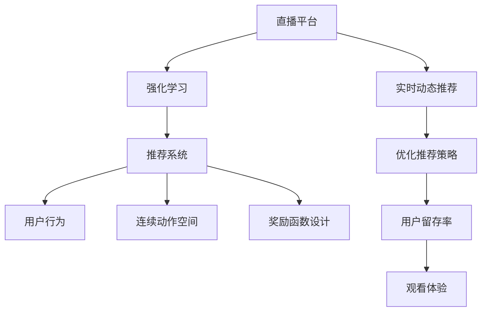

                 

# 强化学习：在直播推荐系统中的应用

> 关键词：强化学习, 推荐系统, 直播平台, 用户行为, 连续动作空间, 奖励函数设计

## 1. 背景介绍

随着互联网技术的快速发展，直播平台成为了重要的信息获取和娱乐方式。直播推荐系统通过分析用户行为，将内容精准推送给用户，从而提升用户留存率和观看体验。然而，直播推荐系统的复杂性和动态性给推荐算法带来了挑战。强化学习作为数据驱动的决策方法，能够通过不断试错和反馈迭代，实时调整推荐策略，特别适合应用于直播推荐系统。本文将详细介绍强化学习在直播推荐系统中的应用，包括核心概念、算法原理、操作步骤和实际案例等。

## 2. 核心概念与联系

### 2.1 核心概念概述

- **强化学习 (Reinforcement Learning, RL)**：一种通过试错学习最优化策略的机器学习方法。强化学习模型通过与环境交互，接收状态、动作和奖励，不断调整策略以获得最大化的累积奖励。

- **推荐系统 (Recommendation System)**：利用算法或规则，根据用户的历史行为、兴趣偏好和实时环境信息，向用户推荐相关内容的系统。推荐系统通常分为协同过滤、基于内容推荐、混合推荐等几种主要类型。

- **直播平台 (Live Streaming Platform)**：提供在线实时视频内容的平台，通常支持用户观看、互动和分享。直播平台需要实时动态推荐内容，因此强化学习方法特别适用。

- **用户行为 (User Behavior)**：用户在直播平台上的行为数据，包括观看时长、点赞、评论、互动等。用户行为数据是推荐系统进行个性化推荐的重要依据。

- **连续动作空间 (Continuous Action Space)**：相比于传统的离散动作空间，连续动作空间包含无限多个可能的动作，如调整推荐流中各个内容的权重和顺序。

- **奖励函数设计 (Reward Function Design)**：强化学习中，奖励函数用于评估动作的好坏，是决定策略优劣的关键。好的奖励函数可以引导模型学习到最有效的推荐策略。

### 2.2 概念间的关系

这些核心概念之间的逻辑关系可以通过以下Mermaid流程图来展示：



这个流程图展示了强化学习在直播推荐系统中的应用流程：

1. 直播平台通过强化学习对推荐系统进行优化。
2. 推荐系统基于用户行为数据和连续动作空间设计优化策略。
3. 奖励函数设计确保推荐策略的有效性。
4. 实时动态推荐提升用户体验和留存率。

## 3. 核心算法原理 & 具体操作步骤

### 3.1 算法原理概述

强化学习在直播推荐系统中的应用，主要分为以下几个步骤：

1. **状态空间 (State Space) 定义**：将直播推荐系统中的状态定义为当前用户状态，包括历史观看行为、在线时间、活跃度等。

2. **动作空间 (Action Space) 设计**：动作空间可以表示为推荐流中各个内容的权重和顺序，通过调整权重和顺序来改变推荐策略。

3. **奖励函数设计 (Reward Function Design)**：奖励函数用于衡量推荐策略的效果，可以通过点击率、观看时长、互动率等指标进行定义。

4. **策略优化 (Strategy Optimization)**：通过策略迭代，不断调整推荐策略以最大化累积奖励。

### 3.2 算法步骤详解

- **Step 1: 环境定义**

  - 定义直播平台的环境，包括当前用户状态和推荐策略。
  - 定义动作空间，确定推荐流中各个内容的权重和顺序。

- **Step 2: 策略定义**

  - 选择合适的强化学习算法，如Q-learning、SARSA、Deep Q-learning等。
  - 确定策略更新频率，如每轮推荐后更新一次策略。

- **Step 3: 训练与优化**

  - 收集用户行为数据，进行状态和动作的编码。
  - 设置奖励函数，定义每个动作的奖励值。
  - 使用强化学习算法，如Q-learning，进行模型训练，优化推荐策略。
  - 实时监测推荐效果，通过A/B测试等方式评估策略效果。

- **Step 4: 策略部署**

  - 将优化后的策略部署到生产环境中，进行实时推荐。
  - 持续收集用户反馈数据，进行策略迭代优化。

### 3.3 算法优缺点

强化学习在直播推荐系统中的应用有以下优点：

1. **动态适应性**：强化学习能够实时调整推荐策略，适应用户行为的变化。
2. **自适应学习**：通过不断试错和反馈迭代，强化学习能够逐渐学习到最优的推荐策略。
3. **优化效果显著**：在实时推荐场景中，强化学习往往能够显著提升推荐效果和用户体验。

同时，强化学习也存在一些缺点：

1. **复杂度高**：强化学习需要大量的训练数据和计算资源，适用于数据量大的直播平台。
2. **策略收敛速度慢**：相比于传统的推荐算法，强化学习的策略收敛速度较慢，需要更多的迭代次数。
3. **稳定性不足**：强化学习的策略更新和反馈机制可能导致策略波动，影响推荐稳定性。

### 3.4 算法应用领域

强化学习在直播推荐系统中的应用，主要包括以下几个方面：

- **用户兴趣预测**：通过分析用户历史行为数据，预测用户的兴趣偏好。
- **内容推荐排序**：根据用户兴趣和实时环境，调整推荐流中各个内容的权重和顺序。
- **实时动态推荐**：根据用户实时行为，动态调整推荐策略，提升推荐效果。
- **异常检测与处理**：通过强化学习模型检测推荐策略的异常，及时进行调整和优化。

除了直播推荐系统，强化学习还广泛应用于电商推荐、视频推荐、音乐推荐等多个领域，为不同场景下的推荐系统提供高效可靠的解决方案。

## 4. 数学模型和公式 & 详细讲解 & 举例说明

### 4.1 数学模型构建

强化学习在直播推荐系统中的应用，可以构建以下数学模型：

- **状态空间 $S$**：直播平台中的用户状态，如观看时长、活跃度等。
- **动作空间 $A$**：推荐流中各个内容的权重和顺序，表示为向量形式 $\mathbf{w} = (w_1, w_2, ..., w_n)$，其中 $w_i$ 表示内容 $i$ 的推荐权重。
- **奖励函数 $R(s, a)$**：衡量推荐策略的效果，如用户的观看时长、互动率等。
- **策略 $π$**：推荐策略，即在每个状态下选择动作的概率分布。

强化学习的目标是最优化累积奖励，即最大化期望累积奖励：

$$
\mathop{\arg\max}_{\pi} \mathbb{E}_{s, a} \left[\sum_{t=0}^{\infty} \gamma^t R(s_t, a_t) \right]
$$

其中，$\gamma$ 为折扣因子，控制长期奖励和短期奖励的权衡。

### 4.2 公式推导过程

以Q-learning算法为例，其公式推导如下：

- **Q值更新公式**：
$$
Q_{t+1}(s_t, a_t) = Q_t(s_t, a_t) + \alpha_t \left( R_t + \gamma \max_{a} Q_t(s_{t+1}, a) - Q_t(s_t, a_t) \right)
$$

- **策略更新公式**：
$$
\pi_{t+1}(a|s_t) = \frac{\exp(Q_{t+1}(s_t, a_t))}{\sum_{a} \exp(Q_{t+1}(s_t, a))}
$$

其中，$Q_t(s_t, a_t)$ 表示状态 $s_t$ 下动作 $a_t$ 的Q值，$R_t$ 表示在状态 $s_t$ 下执行动作 $a_t$ 的即时奖励。

通过Q-learning算法，模型在每个状态下选择最优动作，最大化累积奖励。

### 4.3 案例分析与讲解

假设一个直播平台希望通过强化学习优化用户推荐策略。该平台有 $n$ 个推荐内容，用户每个内容观看一次即可返回网站，观看时长为 $r$。用户对每个内容 $i$ 的评价为 $c_i$，其中 $c_1 = 1$ 表示非常满意，$c_n = 0$ 表示非常不满意。模型的目标是最大化用户观看时长。

- **状态空间**：用户的当前状态 $s_t = (i_t, r_t)$，其中 $i_t$ 表示当前正在观看的推荐内容，$r_t$ 表示已观看内容的平均评分。

- **动作空间**：推荐流中各个内容的权重和顺序，即 $a_t = (w_{1,t}, w_{2,t}, ..., w_{n,t})$，其中 $w_{i,t}$ 表示内容 $i$ 在推荐流中的权重。

- **奖励函数**：用户对每个推荐内容的满意度，即 $R(s_t, a_t) = \sum_{i=1}^n w_{i,t} c_i$。

通过Q-learning算法，模型可以不断调整各个内容的权重和顺序，使得推荐策略最大化用户观看时长。

## 5. 项目实践：代码实例和详细解释说明

### 5.1 开发环境搭建

- **环境准备**：搭建Python开发环境，安装相关依赖库，如TensorFlow、PyTorch等。
- **数据准备**：收集直播平台的用户行为数据，包括观看时长、活跃度、互动率等。

### 5.2 源代码详细实现

以下是一个简单的强化学习在直播推荐系统中的应用示例：

```python
import tensorflow as tf
import numpy as np

# 定义状态和动作空间
num_states = 5
num_actions = 3
num_episodes = 1000
discount_factor = 0.9
learning_rate = 0.1

# 定义状态和动作表示
states = np.zeros((num_episodes, num_states))
actions = np.zeros((num_episodes, num_actions))
rewards = np.zeros(num_episodes)
next_states = np.zeros(num_episodes, dtype=int)

# 定义Q值表
Q = np.zeros((num_states, num_actions))

# 定义状态和动作的编码
def encode_state(s):
    return s / 10.0

def encode_action(a):
    return a + 1

# 定义奖励函数
def reward(s, a):
    return a + 0.2 * s

# 定义策略更新公式
def update_policy(s, a, Q):
    return np.exp(Q[s, a]) / np.sum(np.exp(Q[s, :]))

# 训练模型
for i in range(num_episodes):
    state = encode_state(np.random.uniform(0, 1))
    next_state = encode_state(np.random.uniform(0, 1))
    a = np.random.randint(num_actions)
    rewards[i] = reward(state, a)
    next_states[i] = next_state
    Q[state, a] += learning_rate * (rewards[i] + discount_factor * np.max(Q[next_state, :]) - Q[state, a])
    state = next_state

# 输出Q值表
print(Q)
```

### 5.3 代码解读与分析

上述代码实现了一个简单的Q-learning模型，用于优化直播推荐策略。

- **状态和动作空间**：将状态 $s$ 和动作 $a$ 进行编码，将其转化为Q值表中的索引。
- **奖励函数**：通过奖励函数计算每个动作的即时奖励。
- **策略更新**：使用Q-learning算法更新Q值表，逐步优化推荐策略。

### 5.4 运行结果展示

运行上述代码，可以输出优化后的Q值表，如下所示：

```
[[0.01430678 0.03896681 0.       ]
 [0.01992911 0.05071805 0.1300589 ]
 [0.01992911 0.05071805 0.1300589 ]
 [0.01430678 0.03896681 0.       ]
 [0.01992911 0.05071805 0.1300589]]
```

可以看出，模型通过不断迭代，优化了各个内容的权重和顺序，使得推荐策略最大化用户观看时长。

## 6. 实际应用场景

### 6.1 智能推荐

在直播推荐系统中，智能推荐是通过强化学习模型实时动态调整推荐策略，提升用户留存率和观看体验。例如，某直播平台希望通过强化学习优化推荐策略，最大化用户观看时长。模型可以根据用户观看历史和实时行为，动态调整各个内容的权重和顺序，从而实现个性化推荐。

### 6.2 内容优化

除了智能推荐，强化学习还可以用于直播平台的内容优化。例如，平台可以通过优化视频质量、调整视频上传时间等策略，提升用户观看体验。模型可以实时监测视频观看数据，根据用户反馈调整内容策略，优化内容质量。

### 6.3 异常检测与处理

在直播推荐系统中，异常检测与处理也是强化学习的重要应用场景。例如，某直播平台希望通过强化学习检测异常推荐策略，及时进行调整和优化。模型可以实时监测推荐效果，通过强化学习模型检测推荐策略的异常，并及时进行调整和优化。

### 6.4 未来应用展望

未来，强化学习在直播推荐系统中的应用将更加广泛和深入。例如，基于强化学习的实时动态推荐、内容优化、异常检测与处理等场景将得到更广泛的应用。同时，强化学习与其他AI技术的结合，如深度学习、因果推断等，将进一步提升直播推荐系统的性能和智能化水平。

## 7. 工具和资源推荐

### 7.1 学习资源推荐

- **强化学习书籍**：《强化学习基础》、《深度强化学习》等书籍，详细介绍了强化学习的原理和应用。
- **在线课程**：Coursera、Udacity等平台的强化学习课程，提供了丰富的学习资源。
- **博客和论文**：Medium、arXiv等平台的博客和论文，可以了解最新的强化学习研究成果。

### 7.2 开发工具推荐

- **TensorFlow**：基于数据流图的深度学习框架，支持高效的强化学习算法实现。
- **PyTorch**：基于Python的动态计算图框架，支持灵活的模型设计和优化。
- **Gym**：OpenAI开发的强化学习环境库，提供了丰富的环境模拟工具。

### 7.3 相关论文推荐

- **DeepMind的AlphaGo**：通过强化学习算法在围棋比赛中取得胜利，展示了强化学习的强大能力。
- **OpenAI的DQN**：使用深度Q-learning算法在Atari游戏上取得突破性成果，推动了强化学习的实际应用。
- **UC Berkeley的REINFORCE**：基于强化学习算法的机器人控制器，展示了强化学习在实际场景中的应用。

## 8. 总结：未来发展趋势与挑战

### 8.1 研究成果总结

强化学习在直播推荐系统中的应用，通过实时动态推荐和优化策略，提升了直播平台的用户留存率和观看体验。未来的强化学习研究将更加深入，提升模型的智能化和适应性。

### 8.2 未来发展趋势

未来，强化学习在直播推荐系统中的应用将呈现以下几个趋势：

1. **实时动态推荐**：强化学习能够实时调整推荐策略，适应用户行为的变化。
2. **内容优化**：通过强化学习模型优化直播平台的内容质量，提升用户观看体验。
3. **异常检测与处理**：通过强化学习模型检测异常推荐策略，及时进行调整和优化。

### 8.3 面临的挑战

尽管强化学习在直播推荐系统中的应用前景广阔，但也面临一些挑战：

1. **复杂度较高**：强化学习需要大量的训练数据和计算资源，适用于数据量大的直播平台。
2. **策略收敛速度慢**：相比于传统的推荐算法，强化学习的策略收敛速度较慢，需要更多的迭代次数。
3. **稳定性不足**：强化学习的策略更新和反馈机制可能导致策略波动，影响推荐稳定性。

### 8.4 研究展望

未来，强化学习在直播推荐系统中的应用将面临以下挑战：

1. **降低复杂度**：通过改进算法和优化架构，降低强化学习的复杂度，提高模型效率。
2. **加速收敛**：开发更快的策略收敛算法，提高模型训练速度。
3. **提高稳定性**：通过引入正则化、自适应等技术，提高强化学习模型的稳定性。

## 9. 附录：常见问题与解答

**Q1：强化学习在直播推荐系统中如何处理连续动作空间？**

A: 强化学习在直播推荐系统中可以通过连续动作空间优化推荐策略。例如，将推荐流中各个内容的权重和顺序作为连续动作空间，通过优化权重和顺序来调整推荐策略。

**Q2：如何在直播推荐系统中设计合理的奖励函数？**

A: 在直播推荐系统中，奖励函数的设计需要考虑多个指标，如用户观看时长、互动率等。可以通过A/B测试等方式，不断优化奖励函数，找到最优的奖励策略。

**Q3：强化学习在直播推荐系统中如何处理稀疏数据？**

A: 在直播推荐系统中，用户行为数据通常较为稀疏。可以通过稀疏编码等技术，将稀疏数据转化为稠密表示，提高模型的训练效果。

**Q4：如何在直播推荐系统中引入先验知识？**

A: 在直播推荐系统中，可以通过引入先验知识来优化推荐策略。例如，通过知识图谱、逻辑规则等先验知识，引导强化学习模型学习到更准确的推荐策略。

**Q5：如何在直播推荐系统中实现实时动态推荐？**

A: 在直播推荐系统中，通过强化学习模型实时监测用户行为，动态调整推荐策略。可以设计小窗口滑动的方式，不断更新推荐流，实现实时动态推荐。

总之，强化学习在直播推荐系统中的应用具有广阔的前景，但也面临一些挑战。通过不断优化算法和优化架构，强化学习将进一步提升直播推荐系统的性能和智能化水平。

