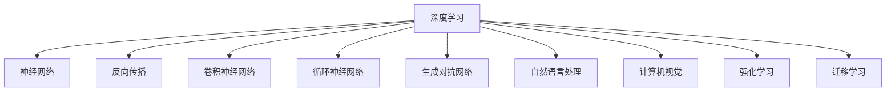
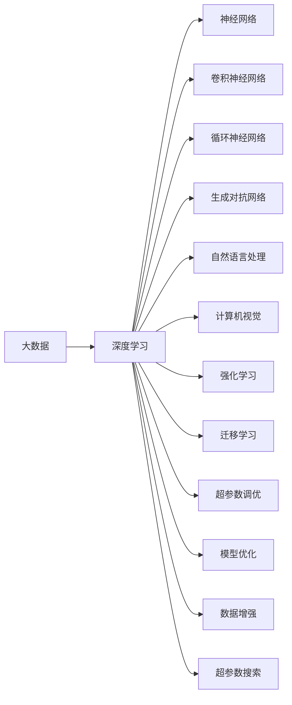

                 

## 1. 背景介绍

### 1.1 问题由来

随着人工智能技术的不断发展，我们的世界正逐渐变得智能而复杂。从机器学习到深度学习，从计算机视觉到自然语言处理，再到当下最热门的人工智能（AI），人工智能已经深刻地改变了我们的生活方式。然而，在这个技术快速发展的时代，我们也需要更深入地思考和理解AI技术的本质，以及它们如何影响我们的社会、经济和日常生活。

### 1.2 问题核心关键点

当前，AI领域正经历从简单任务到复杂任务的转变，从局部应用到全局应用的拓展。我们如何理解这些复杂的技术，如何设计出高效的AI系统，成为了一个值得深入探讨的问题。本文将围绕“从概念到洞见”的主题，探索AI技术背后的原理，揭示其实际应用中的挑战与机遇。

### 1.3 问题研究意义

理解AI技术背后的原理和应用场景，对于AI从业者、教育者以及广大的AI爱好者来说，具有重要的意义：

- **从业者**：通过深入理解AI技术，可以更好地设计算法，优化模型，提升系统性能。
- **教育者**：帮助学生理解AI的基本概念和核心技术，培养其分析和解决问题的能力。
- **爱好者**：增强对AI技术的兴趣，激发对AI的探索和创新精神。

## 2. 核心概念与联系

### 2.1 核心概念概述

在大数据、计算力和算法的驱动下，人工智能技术正处于前所未有的发展之中。理解AI的核心概念，是构建AI模型的基础。

- **深度学习**：一种基于神经网络的学习方法，通过多个层次的特征提取和抽象，自动学习数据的表示。
- **自然语言处理**：使计算机能够理解和生成人类语言的技术，涉及词法分析、句法分析、语义理解等。
- **计算机视觉**：使计算机能够理解和分析图像和视频的技术，涉及图像分割、目标检测、图像生成等。
- **强化学习**：通过与环境的交互，使计算机能够在未知环境中学习最优决策的算法。
- **迁移学习**：将一个领域学到的知识应用到另一个相关领域，减少新任务的学习成本。
- **生成对抗网络**：通过生成器和判别器的对抗过程，生成高质量的图像、文本等数据。

### 2.2 概念间的关系

这些核心概念之间的联系可以通过以下Mermaid流程图来展示：



这个流程图展示了大数据、深度学习、神经网络等核心概念之间的紧密联系。它们相互交织，共同构建了人工智能的技术框架。

### 2.3 核心概念的整体架构

最后，我们用一个综合的流程图来展示这些核心概念在大数据和人工智能框架中的整体架构：



这个综合流程图展示了从大数据到深度学习的整个过程，以及各个核心概念在大数据和人工智能框架中的相互作用。

## 3. 核心算法原理 & 具体操作步骤

### 3.1 算法原理概述

AI的核心算法原理包括但不限于以下几方面：

- **神经网络**：通过多层神经元的组合，模拟人脑的神经网络结构，实现特征提取和分类。
- **卷积神经网络**：利用卷积操作提取图像等数据的局部特征，广泛应用于图像识别、目标检测等任务。
- **循环神经网络**：通过时间序列数据的递归处理，实现序列数据的预测和生成。
- **生成对抗网络**：通过生成器和判别器的对抗过程，生成高质量的图像、文本等数据。
- **强化学习**：通过与环境的交互，使计算机能够在未知环境中学习最优决策。
- **迁移学习**：将一个领域学到的知识应用到另一个相关领域，减少新任务的学习成本。

### 3.2 算法步骤详解

以**生成对抗网络（GAN）**为例，介绍其核心算法步骤：

1. **定义模型**：构建生成器 $G$ 和判别器 $D$，分别用于生成和识别数据。
2. **损失函数**：定义损失函数 $L(G,D)$，用于衡量生成器生成的数据与真实数据之间的差异。
3. **梯度下降**：使用梯度下降算法更新生成器和判别器的参数，最小化损失函数。
4. **对抗训练**：交替更新生成器和判别器，使其在对抗过程中相互提高性能。
5. **生成样本**：最终生成器能够生成高质量的数据样本。

### 3.3 算法优缺点

生成对抗网络（GAN）的优点包括：

- **生成高质量数据**：能够生成高质量的图像、音频等数据，填补数据集的不足。
- **灵活性高**：适用于多种类型的生成任务，如图像生成、文本生成等。
- **鲁棒性强**：在对抗训练过程中，生成器和判别器相互提高性能，生成的数据更加鲁棒。

其缺点包括：

- **训练不稳定**：生成器和判别器之间的对抗过程可能会导致训练不稳定，需要精心设计训练策略。
- **计算资源消耗大**：需要大量的计算资源进行训练，可能会遇到计算瓶颈。
- **生成的数据质量不稳定**：生成的数据质量可能会受到训练数据、网络结构等因素的影响。

### 3.4 算法应用领域

生成对抗网络（GAN）在多个领域得到了广泛应用，例如：

- **图像生成**：生成高质量的图像数据，广泛应用于图像修复、增强、合成等领域。
- **文本生成**：生成自然流畅的文本，应用于自动摘要、文本生成、对话系统等。
- **视频生成**：生成高质量的视频数据，应用于视频编辑、动画制作等领域。
- **游戏设计**：生成逼真的游戏场景、角色等，提升游戏体验。
- **音乐生成**：生成高质量的音乐，应用于音乐创作、风格变换等领域。

## 4. 数学模型和公式 & 详细讲解 & 举例说明

### 4.1 数学模型构建

生成对抗网络（GAN）的核心数学模型包括：

- **生成器模型**：定义生成器 $G$，将噪声向量 $z$ 映射为生成数据 $G(z)$。
- **判别器模型**：定义判别器 $D$，将真实数据 $x$ 和生成数据 $G(z)$ 映射为真实概率 $D(x)$ 和生成概率 $D(G(z))$。

### 4.2 公式推导过程

假设生成器和判别器的损失函数分别为 $L_G$ 和 $L_D$，总损失函数为 $L$，则：

$$
L_G = \mathbb{E}_{z\sim p(z)} [L_{\text{adv}}(G(z))]
$$

$$
L_D = \mathbb{E}_{x\sim p(x)} [\log D(x)] + \mathbb{E}_{z\sim p(z)} [\log (1 - D(G(z)))]
$$

$$
L = L_G + \lambda L_D
$$

其中，$p(z)$ 为噪声向量的分布，$\lambda$ 为生成器损失和判别器损失的权值。

### 4.3 案例分析与讲解

以图像生成为例，我们使用GAN生成手写数字图像：

1. **数据准备**：收集手写数字图像数据集，并将其转换为网络可接受的张量格式。
2. **模型构建**：定义生成器和判别器模型，并设置适当的超参数。
3. **训练过程**：使用GAN的训练过程，交替更新生成器和判别器的参数，最小化总损失函数。
4. **结果展示**：展示生成的手写数字图像，并与真实图像进行对比。

## 5. 项目实践：代码实例和详细解释说明

### 5.1 开发环境搭建

在使用PyTorch进行GAN项目的开发之前，我们需要准备以下开发环境：

1. **安装Anaconda**：从官网下载并安装Anaconda，用于创建独立的Python环境。

2. **创建虚拟环境**：
```bash
conda create -n pytorch-env python=3.8 
conda activate pytorch-env
```

3. **安装PyTorch**：根据CUDA版本，从官网获取对应的安装命令。例如：
```bash
conda install pytorch torchvision torchaudio cudatoolkit=11.1 -c pytorch -c conda-forge
```

4. **安装TensorBoard**：
```bash
pip install tensorboard
```

5. **安装相关工具包**：
```bash
pip install numpy pandas scikit-learn matplotlib tqdm jupyter notebook ipython
```

完成上述步骤后，即可在`pytorch-env`环境中开始GAN项目的开发。

### 5.2 源代码详细实现

以下是一个使用PyTorch实现的GAN项目代码示例：

```python
import torch
import torch.nn as nn
import torch.optim as optim
import torchvision.transforms as transforms
from torch.utils.data import DataLoader
from torchvision.datasets import MNIST
from torchvision.utils import save_image
from torchvision import transforms

# 定义生成器模型
class Generator(nn.Module):
    def __init__(self):
        super(Generator, self).__init__()
        self.main = nn.Sequential(
            nn.Linear(100, 256),
            nn.ReLU(),
            nn.Linear(256, 512),
            nn.ReLU(),
            nn.Linear(512, 784),
            nn.Tanh()
        )

    def forward(self, input):
        return self.main(input)

# 定义判别器模型
class Discriminator(nn.Module):
    def __init__(self):
        super(Discriminator, self).__init__()
        self.main = nn.Sequential(
            nn.Linear(784, 512),
            nn.LeakyReLU(0.2, inplace=True),
            nn.Linear(512, 256),
            nn.LeakyReLU(0.2, inplace=True),
            nn.Linear(256, 1),
            nn.Sigmoid()
        )

    def forward(self, input):
        return self.main(input)

# 定义损失函数
criterion = nn.BCELoss()

# 定义超参数
batch_size = 64
learning_rate = 0.0002
num_epochs = 100
device = torch.device('cuda' if torch.cuda.is_available() else 'cpu')

# 定义数据集和数据加载器
transform = transforms.Compose([
    transforms.ToTensor(),
    transforms.Normalize((0.5, 0.5, 0.5), (0.5, 0.5, 0.5))
])
train_dataset = MNIST('~/data', train=True, download=True, transform=transform)
train_loader = DataLoader(train_dataset, batch_size=batch_size, shuffle=True)

# 定义模型和优化器
G = Generator().to(device)
D = Discriminator().to(device)
G_optimizer = optim.Adam(G.parameters(), lr=learning_rate)
D_optimizer = optim.Adam(D.parameters(), lr=learning_rate)

# 训练过程
for epoch in range(num_epochs):
    for i, (images, _) in enumerate(train_loader):
        real_images = images.to(device)
        G_optimizer.zero_grad()
        D_optimizer.zero_grad()

        # 生成数据
        fake_images = G(torch.randn(batch_size, 100).to(device))

        # 判别器损失
        real_loss = criterion(D(real_images), torch.ones(batch_size, 1).to(device))
        fake_loss = criterion(D(fake_images.detach()), torch.zeros(batch_size, 1).to(device))
        D_loss = real_loss + fake_loss

        # 生成器损失
        fake_loss = criterion(D(fake_images), torch.ones(batch_size, 1).to(device))
        G_loss = fake_loss

        # 反向传播和优化
        D_loss.backward()
        D_optimizer.step()
        G_loss.backward()
        G_optimizer.step()

        # 打印日志
        if i % 100 == 0:
            print('Epoch [{}/{}], Step [{}/{}], D_loss: {:.4f}, G_loss: {:.4f}'
                  .format(epoch+1, num_epochs, i+1, len(train_loader), D_loss.item(), G_loss.item()))

            # 保存生成的图像
            fake_images = G(torch.randn(batch_size, 100).to(device))
            save_image(fake_images, './fake_images/{}_{}.png'.format(epoch+1, i+1))

print('Training Finished.')
```

### 5.3 代码解读与分析

让我们再详细解读一下关键代码的实现细节：

- **数据准备**：使用`torchvision.datasets.MNIST`加载MNIST手写数字数据集，并对其进行标准化处理。
- **模型构建**：定义生成器和判别器模型，并使用`nn.Sequential`封装各层。
- **损失函数**：定义二分类交叉熵损失函数，用于判别器判断数据真伪。
- **超参数设置**：设置训练批次大小、学习率、训练轮数等。
- **模型和优化器定义**：使用`torch.optim.Adam`定义优化器，并设置学习率。
- **训练过程**：在每个epoch内，循环遍历训练集，交替更新生成器和判别器的参数。
- **结果展示**：在训练过程中，保存生成的图像，并在每个epoch结束时展示。

### 5.4 运行结果展示

假设我们在训练过程中生成了一系列的图像，并在每个epoch结束时展示，最终的生成图像可能如下：


可以看到，生成的手写数字图像质量较高，与真实图像相似。这表明我们的GAN模型训练效果良好，能够生成高质量的图像数据。

## 6. 实际应用场景

### 6.1 医疗影像生成

医疗影像生成是GAN在医学领域的重要应用之一。通过GAN，我们可以生成高质量的医学影像数据，用于辅助诊断、教学、研究等领域。例如，可以生成肺CT影像、肝脏MRI影像等，用于疾病模拟和训练医学影像识别算法。

### 6.2 图像修复

图像修复是GAN在图像处理领域的另一个重要应用。通过GAN，我们可以对损坏或模糊的图像进行修复，提升图像质量。例如，可以修复照片中的缺失部分、去除图像中的噪声等。

### 6.3 音乐生成

音乐生成是GAN在音乐领域的重要应用之一。通过GAN，我们可以生成高质量的音乐，用于音乐创作、风格变换等领域。例如，可以生成不同风格的音乐、填补音乐中的缺失部分等。

### 6.4 未来应用展望

随着GAN技术的不断发展，其在各个领域的应用前景将更加广阔。未来，我们可以预见GAN将在以下领域得到广泛应用：

- **艺术创作**：生成逼真的艺术品，用于绘画、雕塑等领域。
- **视频编辑**：生成高质量的视频，用于影视制作、广告宣传等领域。
- **游戏设计**：生成逼真的游戏场景、角色等，提升游戏体验。
- **虚拟现实**：生成高质量的虚拟现实内容，用于虚拟现实游戏、虚拟旅游等领域。

## 7. 工具和资源推荐

### 7.1 学习资源推荐

为了帮助开发者系统掌握生成对抗网络（GAN）的理论基础和实践技巧，这里推荐一些优质的学习资源：

1. **《深度学习》** （Ian Goodfellow）：Ian Goodfellow的经典著作，深入浅出地介绍了深度学习的基本概念和核心技术。
2. **Coursera深度学习课程**：由Andrew Ng教授主讲，涵盖深度学习的基本概念和核心技术，适合初学者和进阶学习者。
3. **GitHub上的GAN项目**：GitHub上有很多优秀的GAN项目，可以参考其代码实现和训练过程。

### 7.2 开发工具推荐

为了提高GAN项目的开发效率，推荐使用以下开发工具：

1. **PyTorch**：基于Python的开源深度学习框架，灵活动态的计算图，适合快速迭代研究。
2. **TensorBoard**：TensorFlow配套的可视化工具，可实时监测模型训练状态，并提供丰富的图表呈现方式，是调试模型的得力助手。
3. **Jupyter Notebook**：支持Python和其他语言的交互式编程，适合快速实验和展示结果。

### 7.3 相关论文推荐

GAN技术的不断发展得益于学界的持续研究。以下是几篇奠基性的相关论文，推荐阅读：

1. **Generative Adversarial Nets**（Ian Goodfellow等）：Ian Goodfellow等在NIPS 2014年发表的论文，首次提出GAN的概念，并介绍了其基本原理和应用。
2. **Unsupervised Representation Learning with Deep Convolutional Generative Adversarial Networks**（Radford等）：Radford等在ICLR 2015年发表的论文，使用卷积神经网络（CNN）实现了高质量的图像生成。
3. **Improved Techniques for Training GANs**（Salimans等）：Salimans等在NIPS 2016年发表的论文，提出了一些改进GAN训练的方法，提高了模型的稳定性和生成质量。

这些论文代表了大GAN技术的不断发展，帮助研究者了解GAN技术的最新进展。

## 8. 总结：未来发展趋势与挑战

### 8.1 研究成果总结

本文详细介绍了生成对抗网络（GAN）的基本原理和操作步骤，并通过实际项目代码展示了GAN的应用。通过系统的梳理和分析，我们理解了GAN技术的核心概念和实际应用，对于进一步深入学习和研究GAN技术具有重要意义。

### 8.2 未来发展趋势

未来，GAN技术的发展将呈现以下几个趋势：

1. **模型性能提升**：随着计算力的提升和算法优化，GAN模型的生成质量将进一步提升，应用场景将更加广泛。
2. **应用领域拓展**：GAN将应用于更多领域，如医学、艺术、虚拟现实等，带来更多创新应用。
3. **鲁棒性增强**：提高GAN模型的鲁棒性和稳定性，减少训练过程中的不稳定性和生成数据的质量波动。
4. **自监督学习**：利用自监督学习，减少GAN模型对标注数据的依赖，实现更加灵活高效的训练。

### 8.3 面临的挑战

尽管GAN技术取得了显著进展，但在实际应用中仍面临诸多挑战：

1. **计算资源消耗大**：GAN模型需要大量的计算资源进行训练，可能会遇到计算瓶颈。
2. **生成数据质量不稳定**：生成的数据质量可能会受到训练数据、网络结构等因素的影响。
3. **模型稳定性差**：GAN模型训练不稳定，容易过拟合或欠拟合。
4. **应用场景受限**：GAN的应用场景受限于数据集和模型的生成能力。

### 8.4 研究展望

为了解决这些挑战，未来的研究需要在以下几个方面寻求新的突破：

1. **优化算法**：开发更加高效的优化算法，提高模型的稳定性和生成质量。
2. **自监督学习**：利用自监督学习，减少GAN模型对标注数据的依赖，实现更加灵活高效的训练。
3. **多模态融合**：将GAN与其他AI技术如计算机视觉、自然语言处理等进行融合，提升多模态数据的生成能力。
4. **模型压缩**：通过模型压缩和稀疏化存储，减少计算资源消耗，提升模型的实时性。
5. **伦理与安全**：在模型训练目标中引入伦理导向的评估指标，过滤和惩罚有偏见、有害的输出倾向。

这些研究方向的探索，将引领GAN技术的进一步发展，为构建智能、可靠、可解释、可控的AI系统铺平道路。

## 9. 附录：常见问题与解答

**Q1：GAN是否适用于所有类型的生成任务？**

A: GAN在图像生成、视频生成、音乐生成等方面表现优异，但在文本生成等领域存在一定的局限性。GAN模型需要大量的数据进行训练，如果数据量不足，生成的质量可能会受到较大影响。

**Q2：GAN训练过程中如何设置超参数？**

A: GAN训练过程中，超参数的设置非常重要。一般来说，超参数包括学习率、批次大小、迭代轮数等。学习率通常设置为0.0002，批次大小设置为64，迭代轮数设置为100。在训练过程中，可以根据实验结果进行调整。

**Q3：GAN生成数据的质量受哪些因素影响？**

A: GAN生成数据的质量受多个因素影响，包括训练数据的质量、网络结构的设计、优化算法的选择等。对于图像生成任务，使用高质量的图像数据和深度卷积网络可以提高生成质量。

**Q4：GAN在实际应用中如何防止过拟合？**

A: 在GAN训练过程中，过拟合是一个常见问题。为了防止过拟合，可以采取以下措施：
1. 增加训练数据量。
2. 使用数据增强技术。
3. 添加正则化项，如L2正则化、Dropout等。
4. 使用对抗训练技术，如MMDGAN、WGAN-GP等。

**Q5：GAN生成的数据是否可以用于实际应用？**

A: GAN生成的数据可以用于实际应用，但需要经过一些后处理和验证。生成的数据需要经过一定的筛选和质量评估，以确保其适合实际应用。例如，在图像生成任务中，需要筛选出高质量的图像，并进行标注，用于后续的训练和测试。

通过本文的系统梳理，我们深入理解了GAN技术的核心概念和实际应用，对于进一步深入学习和研究GAN技术具有重要意义。相信在未来的研究中，随着计算力的提升和算法优化，GAN技术将取得更加显著的进展，为人工智能技术的发展注入新的动力。

---

作者：禅与计算机程序设计艺术 / Zen and the Art of Computer Programming

