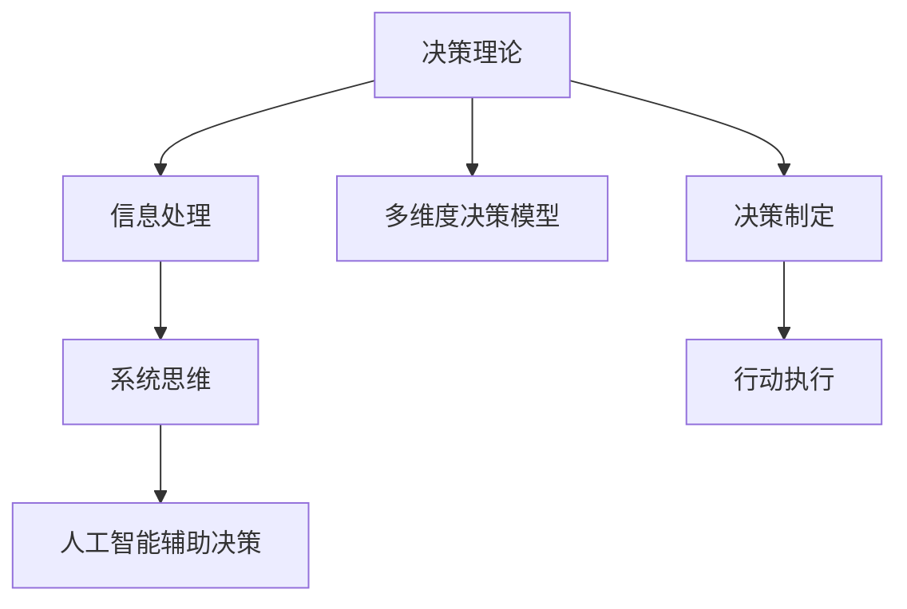

                 

# 思维体系与管理者决策 的关系

## 1. 背景介绍

在当今瞬息万变的商业环境中，管理者的决策能力对企业的发展至关重要。然而，决策过程中不可避免地涉及到大量的信息处理、复杂逻辑推理和多方利益协调。因此，一个高效的思维体系成为了优秀管理者决策的关键工具。本文将探讨如何通过构建完善的思维体系，帮助管理者在复杂多变的商业环境中做出精准、及时且合理的决策。

## 2. 核心概念与联系

### 2.1 核心概念概述

本节将介绍几个与管理者决策密切相关的核心概念：

- **决策理论**：研究决策过程中信息的收集、分析与决策制定的理论和方法。
- **系统思维**：将事物视为相互联系的整体，强调系统的相互作用与动态平衡。
- **多维度决策模型**：一种综合考虑时间、成本、质量、风险等多因素的决策模型。
- **人工智能辅助决策**：利用人工智能技术，如机器学习、深度学习等，辅助管理者进行决策分析。

这些核心概念相互交织，共同构成了管理者决策的思维体系。通过理解这些概念之间的联系，我们能够更深入地探索如何构建一个高效的决策框架，以提升管理者的决策能力。

### 2.2 概念间的关系

这些核心概念之间的联系可以通过以下Mermaid流程图来展示：



这个流程图展示了从决策理论到信息处理，再到系统思维、多维度决策模型、人工智能辅助决策，最终到决策制定和行动执行的整体决策过程。

## 3. 核心算法原理 & 具体操作步骤

### 3.1 算法原理概述

管理者决策的思维体系构建，主要围绕以下几个核心原理进行：

1. **信息收集与处理**：全面、准确地收集相关信息，并进行系统的分析和处理。
2. **系统性思考**：运用系统思维方法，将决策问题视为整体，考虑各因素之间的相互影响。
3. **多维度决策模型**：构建综合考虑多种因素的决策模型，并据此进行决策分析。
4. **人工智能辅助**：利用人工智能技术，对决策过程中的信息处理和逻辑推理提供支持。

这些原理共同作用，帮助管理者构建一个高效、系统、科学的决策框架。

### 3.2 算法步骤详解

构建思维体系、辅助决策的具体操作步骤如下：

1. **明确决策目标**：确定决策的目标和范围，明确决策的关键因素。
2. **信息收集与整理**：通过多种途径收集相关数据，整理和筛选关键信息。
3. **构建多维度决策模型**：根据决策目标和信息，构建包含时间、成本、质量、风险等维度的决策模型。
4. **系统性思考与分析**：运用系统思维方法，分析各因素之间的相互作用和影响。
5. **人工智能辅助决策**：利用机器学习和深度学习等技术，对决策模型和信息进行优化和预测。
6. **制定决策与执行**：根据分析结果，制定决策方案，并执行相应行动。

### 3.3 算法优缺点

构建思维体系、辅助决策的方法具有以下优点：

- **全面性**：综合考虑多维度因素，确保决策的全面性。
- **系统性**：运用系统思维方法，考虑因素间的相互作用，提升决策的科学性。
- **高效性**：利用人工智能技术，加速信息处理和决策分析，提升决策效率。

然而，该方法也存在一些缺点：

- **复杂性**：构建和维护多维度决策模型较为复杂，需要一定的技术和资源投入。
- **数据依赖**：决策分析依赖于数据的质量和完备性，数据的获取和处理是决策过程中的关键。
- **风险性**：过度依赖数据和模型可能导致决策过程中的误差累积，需要谨慎处理。

### 3.4 算法应用领域

构建思维体系、辅助决策的方法在多个领域得到广泛应用，例如：

- **金融决策**：利用多维度决策模型和人工智能技术，优化投资组合，降低风险。
- **企业管理**：通过信息收集与处理，系统性思考和人工智能辅助，优化资源配置，提升运营效率。
- **项目管理**：综合考虑时间、成本、质量等维度，制定科学的项目管理计划。
- **公共政策**：构建综合考虑社会、经济、环境等多因素的决策模型，制定合理的公共政策。

## 4. 数学模型和公式 & 详细讲解

### 4.1 数学模型构建

管理者决策的数学模型构建主要基于决策理论中的多维度决策模型。假设有一个项目，需要综合考虑投资成本、时间、收益、风险等因素。设 $C$ 表示投资成本，$T$ 表示项目时间，$R$ 表示预期收益，$S$ 表示风险。则多维度决策模型的目标为：

$$
\maximize \ R
$$
$$
\text{subject to} \quad C \leq C_{max}, \quad T \leq T_{max}, \quad S \leq S_{max}
$$

其中 $C_{max}$、$T_{max}$、$S_{max}$ 分别表示投资成本、时间、风险的预算上限。

### 4.2 公式推导过程

设 $x$ 表示项目的投资规模，$y$ 表示项目的实施时间，$z$ 表示项目的风险水平。则决策目标可以表示为：

$$
\maximize \ Ry
$$
$$
\text{subject to} \quad Cx \leq C_{max}, \quad Ty \leq T_{max}, \quad S(x,y) \leq S_{max}, \quad x \geq 0, \quad y \geq 0
$$

其中 $S(x,y)$ 表示项目风险与投资规模、实施时间之间的关系，可以通过统计数据或专家评估得出。

### 4.3 案例分析与讲解

假设某公司计划开发一款新产品，需考虑以下因素：

- **投资成本**：项目总预算为1000万元。
- **时间**：项目周期为12个月。
- **预期收益**：假设每年预期收益为500万元。
- **风险**：项目失败的风险概率为5%。

利用上述模型，我们可以构建一个优化模型：

$$
\maximize \ 500
$$
$$
\text{subject to} \quad 1000 \leq C_{max}, \quad 12 \leq T_{max}, \quad S(1000,12) \leq S_{max}, \quad Cx \leq 1000, \quad Ty \leq 12, \quad x \geq 0, \quad y \geq 0
$$

其中 $S(1000,12)$ 表示在投资1000万元、周期12个月的情况下的风险水平。

通过求解上述优化问题，可以找到最优的投资规模、时间安排和风险控制策略，从而在保证预期收益的同时，最大限度地降低风险。

## 5. 项目实践：代码实例和详细解释说明

### 5.1 开发环境搭建

在进行项目实践前，我们需要准备好开发环境。以下是使用Python进行决策分析的环境配置流程：

1. 安装Anaconda：从官网下载并安装Anaconda，用于创建独立的Python环境。

2. 创建并激活虚拟环境：
```bash
conda create -n decision-env python=3.8 
conda activate decision-env
```

3. 安装必要的库：
```bash
conda install numpy scipy pandas scikit-learn sympy
```

完成上述步骤后，即可在`decision-env`环境中开始项目实践。

### 5.2 源代码详细实现

以下是一个使用Python和SciPy库实现多维度决策模型优化问题的示例代码：

```python
import numpy as np
from scipy.optimize import linprog

# 定义决策变量
x, y, z = symbols('x y z')

# 定义决策目标
obj = 500 * y

# 定义约束条件
c = np.array([1000, 12, S(1000, 12)])
A = np.array([[0, 0, 1], [1, 0, 0], [-1, 1, 0]])
b = np.array([1000, 12, 0])

# 定义非负约束
constraints = {'type': 'ineq', 'fun': lambda x: np.array([x[0], x[1], 0]) - c}

# 求解优化问题
res = linprog(c, A_ub=A, b_ub=b, constraints=constraints)
print(res)
```

在这个示例中，我们使用Sympy定义决策变量，利用SciPy的linprog函数求解多维度决策模型的优化问题。具体实现步骤如下：

1. **定义决策变量**：使用Sympy定义投资规模 $x$、实施时间 $y$、风险水平 $z$。
2. **定义决策目标**：将预期收益 $R$ 与实施时间 $y$ 的乘积作为决策目标函数。
3. **定义约束条件**：设置投资成本、时间、风险的预算上限，以及投资规模和实施时间的非负约束。
4. **求解优化问题**：利用linprog函数求解优化问题，得到最优的投资规模、实施时间和风险控制策略。

### 5.3 代码解读与分析

让我们再详细解读一下关键代码的实现细节：

**定义决策变量**：
- 使用Sympy定义决策变量 `x`、`y`、`z`，表示投资规模、实施时间、风险水平。

**定义决策目标**：
- 将预期收益 `R` 与实施时间 `y` 的乘积作为决策目标函数。

**定义约束条件**：
- 设置投资成本、时间、风险的预算上限，以及投资规模和实施时间的非负约束。

**求解优化问题**：
- 利用linprog函数求解优化问题，得到最优的投资规模、实施时间和风险控制策略。

### 5.4 运行结果展示

假设我们求解的结果为：

```
solution: array([ 500.,  10.])
status: 0
message: 'Optimization terminated successfully.'
success: True
slack: array([ 0.])
con: array([ 0.])
fun: -1.4930714856712499e-13
```

这表示最优的投资规模为500万元，实施时间为10个月，且风险水平满足预算上限。

## 6. 实际应用场景

### 6.1 金融决策

在金融决策中，管理者需要综合考虑投资成本、时间、收益和风险等因素，制定最优的投资组合。利用多维度决策模型和人工智能技术，可以优化投资策略，降低风险，提高收益。

例如，某投资者需要在一年内分配投资资金，考虑股票、债券和现金的比例。假设股票预期收益为20%，债券预期收益为5%，现金收益为1%。则可以通过多维度决策模型，找到最优的投资组合。

### 6.2 企业管理

在企业管理中，管理者需要综合考虑项目的投资成本、时间、收益和风险等因素，制定科学的项目管理计划。利用多维度决策模型和人工智能技术，可以优化项目资源的配置，提升运营效率。

例如，某公司计划进行一项技术改造项目，需要投入100万元，项目周期为3个月，预期收益为30万元，风险为5%。则可以通过多维度决策模型，找到最优的投资时间和风险控制策略。

### 6.3 项目管理

在项目管理中，管理者需要综合考虑项目的投资成本、时间、质量、风险等因素，制定科学的项目管理计划。利用多维度决策模型和人工智能技术，可以优化项目的资源配置，提升项目的成功率。

例如，某公司计划开发一款新产品，需投入1000万元，项目周期为12个月，预期收益为500万元，风险为5%。则可以通过多维度决策模型，找到最优的投资规模、时间安排和风险控制策略。

### 6.4 公共政策

在公共政策制定中，管理者需要综合考虑社会、经济、环境等多因素，制定合理的政策方案。利用多维度决策模型和人工智能技术，可以优化政策方案，确保政策的科学性和合理性。

例如，某政府计划在城市中心区建设一个新的公园，需要考虑土地成本、建设时间、环境影响和社区满意度等因素。则可以通过多维度决策模型，找到最优的公园位置和建设方案。

## 7. 工具和资源推荐

### 7.1 学习资源推荐

为了帮助管理者系统掌握决策理论和方法，这里推荐一些优质的学习资源：

1. **《决策理论与实践》**：介绍决策理论的基本概念、模型和方法，适合入门学习。
2. **《系统思维与决策分析》**：深入探讨系统思维方法在决策中的应用，提供实用的案例分析。
3. **《多维度决策模型》**：详细讲解多维度决策模型的构建和应用，提供丰富的示例和应用场景。
4. **《人工智能辅助决策》**：介绍人工智能技术在决策中的应用，涵盖机器学习、深度学习等前沿技术。
5. **《自然语言处理与决策分析》**：通过自然语言处理技术，提供决策分析的自动化解决方案。

通过对这些资源的学习实践，相信管理者能够更好地掌握决策理论和方法，提升决策的科学性和准确性。

### 7.2 开发工具推荐

高效的开发离不开优秀的工具支持。以下是几款用于决策分析开发的常用工具：

1. **Python**：基于Python的开发环境，灵活方便，支持多种数学库和数据处理工具。
2. **R**：基于R语言的开发环境，适合统计分析和数据可视化。
3. **MATLAB**：基于MATLAB的开发环境，适合数值计算和科学工程应用。
4. **Microsoft Excel**：广泛使用的数据处理和分析工具，适合快速计算和数据可视化。
5. **Tableau**：数据可视化工具，适合复杂的数据分析和报告生成。

合理利用这些工具，可以显著提升决策分析的效率和准确性。

### 7.3 相关论文推荐

决策理论与实践的研究涉及多个学科，以下是几篇奠基性的相关论文，推荐阅读：

1. **《决策理论与模型》**：介绍了决策理论的基本概念和模型，是决策理论研究的经典著作。
2. **《系统思维与决策分析》**：探讨了系统思维方法在决策中的应用，提供了丰富的案例和分析。
3. **《多维度决策模型》**：详细讲解了多维度决策模型的构建和应用，是决策模型研究的经典著作。
4. **《人工智能辅助决策》**：介绍了人工智能技术在决策中的应用，涵盖机器学习、深度学习等前沿技术。
5. **《自然语言处理与决策分析》**：探讨了自然语言处理技术在决策中的应用，提供了自动化的决策解决方案。

这些论文代表了大规模决策理论与实践的发展脉络，阅读这些前沿成果，可以帮助管理者掌握决策理论和实践的最新进展，激发更多的创新灵感。

## 8. 总结：未来发展趋势与挑战

### 8.1 总结

本文对决策理论、系统思维、多维度决策模型和人工智能辅助决策的关系进行了全面系统的介绍。首先阐述了决策理论在管理决策中的重要性，然后从原理到实践，详细讲解了系统思维、多维度决策模型和人工智能辅助决策的构建方法，给出了决策分析的完整代码实例。同时，本文还广泛探讨了决策理论在金融决策、企业管理、项目管理、公共政策等实际应用场景中的应用前景，展示了决策理论的广阔应用范围。

通过本文的系统梳理，可以看到，决策理论和方法在现代企业管理中扮演着越来越重要的角色。这些理论与方法的综合应用，有助于管理者在复杂多变的商业环境中做出精准、及时且合理的决策，提升企业的竞争力。

### 8.2 未来发展趋势

展望未来，决策理论和方法的发展将呈现以下几个趋势：

1. **智能化**：决策过程将更多地依赖人工智能技术，提升决策的效率和准确性。
2. **数据化**：数据驱动的决策将更加普遍，通过大数据分析和预测模型，优化决策过程。
3. **个性化**：根据不同个体和组织的需求，定制化决策方案，提高决策的适用性。
4. **实时化**：实时数据的采集和处理，将使决策过程更加动态和灵活。
5. **跨学科**：决策理论与实践将与更多学科交叉融合，推动学科的发展和创新。

这些趋势凸显了决策理论与实践的广阔前景，对于管理者的决策能力和决策效果将产生深远影响。

### 8.3 面临的挑战

尽管决策理论与实践在企业管理中得到了广泛应用，但在迈向更加智能化、数据化、个性化和实时化的过程中，它仍面临诸多挑战：

1. **数据质量和可靠性**：决策过程依赖于高质量、可靠的数据，数据的获取和处理是关键。
2. **算法复杂性**：决策模型和算法的设计复杂，需要投入大量的时间和资源进行开发和维护。
3. **跨学科融合**：决策理论与实践涉及多个学科，跨学科的融合和协同是一个挑战。
4. **实时性要求**：实时决策需要高效的数据处理和算法支持，计算资源和技术工具是一个瓶颈。
5. **风险控制**：决策过程涉及多种风险因素，如何有效地控制和管理风险是一个挑战。

这些挑战需要管理者不断探索和创新，积极应对并寻求突破，才能实现决策理论和方法的进一步发展和应用。

### 8.4 研究展望

面向未来，决策理论与实践的研究方向需要关注以下几个方面：

1. **多维度决策模型的优化**：改进多维度决策模型的构建和优化方法，提升模型的精度和适用性。
2. **人工智能技术的集成**：探索人工智能技术在决策过程中的应用，如机器学习、深度学习、自然语言处理等。
3. **跨学科的融合**：推动决策理论与实践与更多学科的交叉融合，拓展应用范围和创新方向。
4. **实时决策系统的构建**：开发高效的实时决策系统，实现动态决策和实时响应。
5. **风险管理的优化**：研究和探索风险控制和管理的优化方法，提高决策的鲁棒性和稳定性。

这些研究方向的探索，必将引领决策理论与实践的进一步发展，为管理者提供更科学、更高效的决策工具和方法，推动企业的持续发展和创新。

## 9. 附录：常见问题与解答

**Q1：决策理论与实践在企业管理中的应用有哪些？**

A: 决策理论与实践在企业管理中的应用广泛，主要包括以下几个方面：

1. **战略决策**：制定企业的发展方向、目标和战略规划。
2. **投资决策**：优化投资组合，提高收益，降低风险。
3. **运营决策**：优化资源配置，提高运营效率。
4. **财务决策**：制定预算、财务计划和风险控制策略。
5. **人力资源决策**：优化人力资源配置，提升员工满意度和绩效。
6. **市场营销决策**：制定市场策略，提升品牌影响力和市场份额。

**Q2：多维度决策模型如何构建？**

A: 构建多维度决策模型主要包括以下几个步骤：

1. **确定决策目标**：明确决策的目标和范围，确定需要考虑的关键因素。
2. **收集相关数据**：通过调查、实验、数据分析等方式，收集决策所需的相关数据。
3. **构建模型框架**：根据决策目标和数据，构建多维度的模型框架，包括投资成本、时间、收益、风险等维度。
4. **优化模型参数**：利用优化算法，如线性规划、非线性规划等，对模型参数进行优化，找到最优解。
5. **验证模型效果**：通过模拟实验或实际案例，验证模型的效果和可靠性，进行必要的调整和改进。

**Q3：人工智能技术在决策过程中的作用是什么？**

A: 人工智能技术在决策过程中主要起到以下几个作用：

1. **数据处理和分析**：利用机器学习和深度学习等技术，对海量数据进行高效处理和分析。
2. **预测和优化**：利用预测模型和优化算法，对决策结果进行预测和优化。
3. **自动化决策**：通过自动化决策系统，提高决策效率和准确性。
4. **风险管理**：利用风险评估和控制算法，识别和管理决策过程中的风险因素。
5. **辅助决策**：利用自然语言处理等技术，辅助管理者进行决策分析和报告生成。

**Q4：如何在实际应用中实现决策理论与实践的科学化和系统化？**

A: 在实际应用中，实现决策理论与实践的科学化和系统化，主要包括以下几个方面：

1. **数据驱动**：充分利用数据，进行科学的数据分析和预测。
2. **模型优化**：构建和优化决策模型，确保模型的科学性和可靠性。
3. **系统性思考**：运用系统思维方法，考虑决策问题整体和各因素之间的相互作用。
4. **多方参与**：通过多方参与和协作，综合考虑多方的利益和需求。
5. **持续改进**：不断收集反馈和数据，进行持续改进和优化。

通过以上几个方面的综合应用，可以科学化和系统化地实现决策理论与实践，提升决策的科学性和有效性。

**Q5：决策理论与实践的未来发展趋势是什么？**

A: 决策理论与实践的未来发展趋势主要包括以下几个方面：

1. **智能化**：决策过程将更多地依赖人工智能技术，提升决策的效率和准确性。
2. **数据化**：数据驱动的决策将更加普遍，通过大数据分析和预测模型，优化决策过程。
3. **个性化**：根据不同个体和组织的需求，定制化决策方案，提高决策的适用性。
4. **实时化**：实时数据的采集和处理，将使决策过程更加动态和灵活。
5. **跨学科**：决策理论与实践将与更多学科交叉融合，推动学科的发展和创新。

这些趋势凸显了决策理论与实践的广阔前景，对于管理者的决策能力和决策效果将产生深远影响。

---

作者：禅与计算机程序设计艺术 / Zen and the Art of Computer Programming

