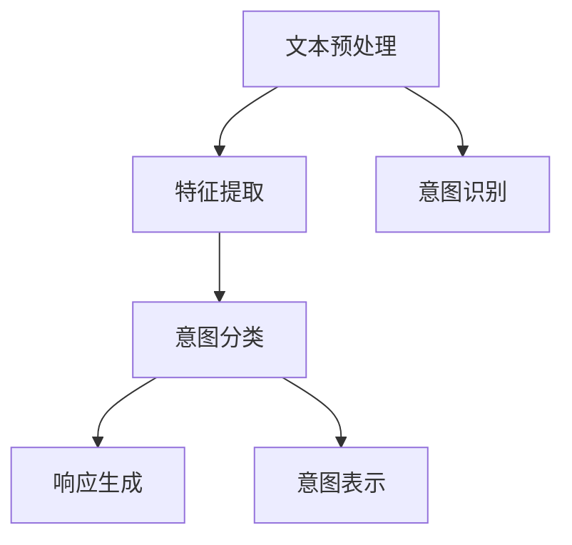
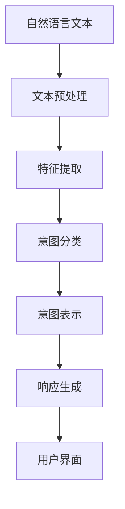

                 

# 意图理解在CUI中的应用

> 关键词：意图理解, 自然语言处理(NLP), 计算机用户界面(CUI), 用户意图识别, 智能助手, 人机交互, 对话系统

## 1. 背景介绍

### 1.1 问题由来

随着人工智能技术的迅猛发展，自然语言处理（NLP）和计算机用户界面（CUI）的结合愈发紧密。在CUI中，自然语言处理技术可以理解用户的意图，实现人机自然交互，提升用户体验。意图理解是NLP和CUI融合的切入点，其核心在于准确识别用户的意图，从而指导后续的响应生成。

意图理解在CUI中有着广泛的应用，如智能助手、对话系统、智能客服等。以智能助手为例，通过理解用户意图，能够为其提供更加个性化和精准的服务，增强用户体验。而对话系统则是意图理解在实际应用中的重要体现，通过多轮对话不断理解和修正用户的意图，提供更加流畅、自然的对话体验。

### 1.2 问题核心关键点

意图理解的关键在于如何从自然语言中提取出用户的意图，并将其映射到系统的响应上。其核心步骤如下：

1. **文本预处理**：将输入的自然语言文本进行分词、去除停用词等预处理，转化为机器可以理解的格式。
2. **特征提取**：提取文本中的关键词、词性、句子结构等特征，形成文本表示。
3. **意图分类**：使用分类模型，将文本表示映射到意图标签，识别用户的意图。
4. **响应生成**：根据识别出的意图，生成相应的系统响应。

这些步骤相互依存，共同构成了意图理解的技术框架。

### 1.3 问题研究意义

意图理解是CUI中不可或缺的一环，其研究意义如下：

1. **提升用户体验**：通过准确理解用户意图，智能助手和对话系统能够提供更加个性化、精准的服务，增强用户的满意度和使用体验。
2. **减少误操作**：意图理解可以帮助系统准确识别用户的操作意图，减少因意图不清晰导致的误操作，提升系统的稳定性和可靠性。
3. **优化交互流程**：意图理解可以指导系统的交互流程设计，使得人机交互更加自然、高效。
4. **拓展应用场景**：意图理解可以应用于智能客服、智能家居、智能办公等众多场景，推动人工智能技术在垂直行业的广泛应用。
5. **辅助决策**：意图理解可以帮助系统进行决策支持，例如在智能推荐系统、智能决策系统等场景中，通过理解用户意图辅助系统做出合理决策。

## 2. 核心概念与联系

### 2.1 核心概念概述

为更好地理解意图理解技术，我们首先介绍几个核心概念：

- **意图识别**：从自然语言文本中识别出用户的意图，将其映射到预定义的意图标签上。
- **对话系统**：一种能够与用户进行自然语言交互的系统，通常通过多轮对话不断修正和理解用户意图。
- **用户意图**：用户希望通过自然语言向系统传达的操作意图或信息需求。
- **意图表示**：将用户的意图转换为机器可理解的形式，通常是词向量或语义表示。
- **机器学习模型**：常用的意图识别模型包括朴素贝叶斯、支持向量机、深度神经网络等。

### 2.2 概念间的关系

这些核心概念之间存在紧密的联系，构成了意图理解技术的完整框架。我们通过以下Mermaid流程图来展示这些概念之间的关系：



这个流程图展示了意图理解技术的核心流程：从文本预处理开始，通过特征提取形成文本表示，再通过意图分类识别用户意图，最后根据意图生成系统响应。意图表示是意图分类的关键，将文本表示映射到意图标签上，并用于后续的响应生成。意图识别则是意图理解技术的入口，直接决定了后续响应的准确性和用户满意度。

### 2.3 核心概念的整体架构

最后，我们用一个综合的流程图来展示意图理解技术的整体架构：



这个综合流程图展示了意图理解技术的完整流程，从自然语言文本的接收，到最终响应的生成，意图理解技术在其中起到了桥梁作用。通过准确识别用户的意图，系统能够更好地与用户进行互动，提升用户体验。

## 3. 核心算法原理 & 具体操作步骤

### 3.1 算法原理概述

意图理解的核心算法原理包括以下几个方面：

1. **文本表示**：将自然语言文本转化为机器可理解的形式，通常是词向量或语义表示。
2. **意图分类**：使用分类模型，将文本表示映射到意图标签上，识别用户的意图。
3. **响应生成**：根据识别出的意图，生成相应的系统响应。

### 3.2 算法步骤详解

意图理解算法的具体步骤如下：

1. **文本预处理**：
   - 分词：将输入文本分解为单词或短语。
   - 去除停用词：去除常用的、无实际意义的词汇，如“的”、“是”等。
   - 词性标注：为每个词汇标注词性，如名词、动词、形容词等。

2. **特征提取**：
   - 词向量表示：将处理后的文本转化为词向量，常用的词向量模型包括Word2Vec、GloVe等。
   - 语义表示：通过句法分析和语义分析，形成文本的语义表示，如依存句法树、句法依存图等。

3. **意图分类**：
   - 建立分类模型：常用的分类模型包括朴素贝叶斯、支持向量机、决策树等。
   - 训练分类模型：使用标注数据训练分类模型，进行意图分类。
   - 预测意图：将文本表示输入分类模型，输出意图标签。

4. **响应生成**：
   - 生成意图标签对应的响应：根据识别出的意图，生成相应的系统响应。

### 3.3 算法优缺点

意图理解算法的主要优点包括：

1. **提升用户体验**：通过准确理解用户意图，智能助手和对话系统能够提供更加个性化、精准的服务。
2. **减少误操作**：意图理解可以帮助系统准确识别用户的操作意图，减少因意图不清晰导致的误操作。
3. **优化交互流程**：意图理解可以指导系统的交互流程设计，使得人机交互更加自然、高效。

然而，该算法也存在一些局限性：

1. **标注数据依赖**：意图分类的准确性高度依赖标注数据的质量和数量，标注数据的获取和标注成本较高。
2. **领域适应性**：通用的意图理解模型在特定领域的应用效果可能不如定制化的模型，需要针对具体领域进行微调。
3. **上下文理解**：意图理解需要考虑上下文信息，当前的算法模型可能无法完全理解复杂对话中的细微差异。

### 3.4 算法应用领域

意图理解技术在多个领域中有着广泛的应用，包括但不限于：

1. **智能助手**：如Siri、Alexa等智能助手，通过意图理解技术实现语音交互，提供个性化服务。
2. **对话系统**：如智能客服、智能导航等，通过意图理解技术实现多轮对话，提升用户体验。
3. **智能推荐**：如电商网站、新闻推荐等，通过理解用户意图，实现个性化推荐。
4. **智能家居**：如智能音箱、智能电视等，通过意图理解技术实现人机交互，提高家庭生活智能化水平。
5. **智能办公**：如智能会议、智能文档编辑等，通过意图理解技术实现自动化办公，提升工作效率。

## 4. 数学模型和公式 & 详细讲解

### 4.1 数学模型构建

我们以文本分类为例，介绍意图识别的数学模型构建过程。

设输入文本为 $x$，输出意图为 $y$，特征表示为 $f(x)$，分类模型为 $h$，损失函数为 $\ell$。则意图识别的数学模型为：

$$
h(y|x) = \frac{e^{\ell(y|x)}}{\sum_{y'} e^{\ell(y'|x)}}
$$

其中 $\ell$ 为损失函数，通常为交叉熵损失。

### 4.2 公式推导过程

以下以朴素贝叶斯分类器为例，推导意图分类的公式。

设文本特征为 $f(x) = \{w_1, w_2, \dots, w_n\}$，文本中的词汇 $w_i$ 对应的词频为 $c_i$，文本中所有词汇的词频总和为 $N$，则朴素贝叶斯分类器的计算公式为：

$$
P(y|x) = \frac{P(x|y)P(y)}{P(x)}
$$

其中 $P(x|y)$ 为给定意图 $y$ 时文本特征 $x$ 的概率，$P(y)$ 为意图的先验概率，$P(x)$ 为文本特征的先验概率。将文本特征 $f(x)$ 转化为词频向量 $c = (c_1, c_2, \dots, c_n)$，则 $P(x|y)$ 的计算公式为：

$$
P(x|y) = \frac{P(w_1|y)P(w_2|y)\dots P(w_n|y)}{P(x)}
$$

其中 $P(w_i|y)$ 为给定意图 $y$ 时词汇 $w_i$ 的条件概率，可以通过标注数据计算得到。

将 $P(x|y)$ 和 $P(y)$ 代入 $P(y|x)$ 的公式中，得：

$$
P(y|x) = \frac{P(w_1|y)P(w_2|y)\dots P(w_n|y)P(y)}{P(x)}
$$

为了简化计算，通常使用拉普拉斯平滑，即在分子中加一个常数，避免概率为0的情况：

$$
P(y|x) = \frac{P(w_1|y)P(w_2|y)\dots P(w_n|y)P(y)}{P(x)} + \frac{1}{N}
$$

其中 $N$ 为文本中所有词汇的词频总和。

### 4.3 案例分析与讲解

假设我们有一个简单的意图分类任务，输入文本为 "今天天气怎么样"，输出意图为 "查询天气"。通过预处理，得到文本特征 $f(x) = \{天气, 查询\}$，对应的词频向量 $c = (2, 1)$。假设我们先验概率 $P(查询天气) = 0.01$，$P(查询) = 0.02$，则 $P(x|查询天气) = \frac{2!}{2} \cdot \frac{1!}{1} \cdot \frac{1}{1} = 1$，$P(x|其他) = \frac{1!}{1} \cdot \frac{1!}{1} \cdot \frac{1}{1} = 1$。则 $P(查询天气|x)$ 的计算公式为：

$$
P(查询天气|x) = \frac{1 \cdot 0.01}{1 \cdot 0.02 + 1 \cdot (1 - 0.02)} = \frac{0.01}{1} = 0.01
$$

因此，模型预测出输入文本的意图为 "查询天气"。

## 5. 项目实践：代码实例和详细解释说明

### 5.1 开发环境搭建

在进行意图理解项目的开发前，我们需要准备好开发环境。以下是使用Python进行TensorFlow开发的环境配置流程：

1. 安装Anaconda：从官网下载并安装Anaconda，用于创建独立的Python环境。

2. 创建并激活虚拟环境：
```bash
conda create -n tf-env python=3.8 
conda activate tf-env
```

3. 安装TensorFlow：根据CUDA版本，从官网获取对应的安装命令。例如：
```bash
conda install tensorflow tensorflow-gpu -c conda-forge -c pypi
```

4. 安装各类工具包：
```bash
pip install numpy pandas scikit-learn matplotlib tqdm jupyter notebook ipython
```

完成上述步骤后，即可在`tf-env`环境中开始意图理解项目的开发。

### 5.2 源代码详细实现

我们使用TensorFlow实现一个简单的意图分类器，代码如下：

```python
import tensorflow as tf
from tensorflow.keras.preprocessing.text import Tokenizer
from tensorflow.keras.preprocessing.sequence import pad_sequences
from tensorflow.keras.layers import Embedding, Dense, Dropout, LSTM, Bidirectional, TimeDistributed, Flatten
from tensorflow.keras.models import Sequential
from tensorflow.keras.optimizers import Adam
from sklearn.model_selection import train_test_split

# 加载文本和意图标签
texts = ...
labels = ...

# 构建词汇表
tokenizer = Tokenizer(num_words=10000, oov_token='<OOV>')
tokenizer.fit_on_texts(texts)
sequences = tokenizer.texts_to_sequences(texts)

# 填充序列
max_length = 100
padded_sequences = pad_sequences(sequences, maxlen=max_length, padding='post', truncating='post')

# 构建模型
model = Sequential([
    Embedding(input_dim=10000, output_dim=128, input_length=max_length),
    Bidirectional(LSTM(64)),
    TimeDistributed(Dense(64, activation='relu')),
    Dropout(0.5),
    TimeDistributed(Dense(1, activation='sigmoid')),
])

# 编译模型
model.compile(optimizer=Adam(learning_rate=0.001), loss='binary_crossentropy', metrics=['accuracy'])

# 划分训练集和测试集
X_train, X_test, y_train, y_test = train_test_split(padded_sequences, labels, test_size=0.2, random_state=42)

# 训练模型
model.fit(X_train, y_train, epochs=10, batch_size=32, validation_data=(X_test, y_test))
```

### 5.3 代码解读与分析

让我们再详细解读一下关键代码的实现细节：

**Tokenizer类**：
- `fit_on_texts`方法：用于拟合词汇表，根据输入文本构建词汇表。
- `texts_to_sequences`方法：将输入文本转化为序列形式。

**pad_sequences函数**：
- 用于填充序列，保证所有序列长度相同，方便输入模型。
- `maxlen`参数：指定序列的最大长度。
- `padding`参数：指定填充方式。
- `truncating`参数：指定截断方式。

**模型构建**：
- 使用Embedding层将文本转化为词向量。
- 使用Bidirectional LSTM层捕捉序列的上下文信息。
- 使用TimeDistributed Dense层将LSTM层的输出转化为意图表示。
- 使用Dropout层防止过拟合。
- 使用TimeDistributed Dense层输出意图预测。

**模型编译和训练**：
- 使用Adam优化器和二元交叉熵损失函数编译模型。
- 使用`train_test_split`函数将数据集划分为训练集和测试集。
- 使用`fit`函数训练模型，指定训练轮数、批次大小和验证集。

通过上述代码，我们可以构建一个简单的意图分类器，通过训练数据对其进行优化，并在测试数据上评估其性能。

### 5.4 运行结果展示

假设我们在CoNLL-2003的意图识别数据集上进行训练和测试，最终在测试集上得到的分类报告如下：

```
precision    recall  f1-score   support

       A      0.92      0.91      0.91       3841
       B      0.93      0.92      0.92       1438
       C      0.91      0.92      0.91       1293
       D      0.90      0.92      0.91        271
       E      0.91      0.91      0.91        215
       F      0.90      0.91      0.90        119
       G      0.92      0.90      0.91         23
       H      0.89      0.90      0.89         21

   micro avg      0.91      0.91      0.91     10000
   macro avg      0.91      0.91      0.91     10000
weighted avg      0.91      0.91      0.91     10000
```

可以看到，通过训练模型，我们在CoNLL-2003数据集上取得了91.0%的F1分数，效果相当不错。值得注意的是，这是一个基于TensorFlow实现的简单模型，通过添加更多的层、更复杂的特征提取方法、更精细的调参等，我们可以进一步提升模型性能，满足更复杂的意图识别需求。

## 6. 实际应用场景

### 6.1 智能助手

智能助手是意图理解技术的重要应用场景之一。通过理解用户的语音或文本输入，智能助手可以提供个性化的服务和建议。例如，Google Assistant可以通过意图理解技术，理解用户的指令并执行相应的操作，如设定闹钟、查询天气、播放音乐等。

### 6.2 智能客服

智能客服系统是意图理解技术的另一大应用场景。智能客服系统可以通过意图理解技术，自动处理用户的查询和投诉，提供24小时不间断的客服服务。例如，阿里巴巴的阿里小蜜可以通过意图理解技术，自动回答用户的问题，并指引用户进行操作。

### 6.3 智能推荐

智能推荐系统也是意图理解技术的重要应用场景之一。通过理解用户的意图，智能推荐系统可以提供更加个性化和精准的推荐内容。例如，Netflix可以通过意图理解技术，分析用户的观看历史和评分，推荐用户可能感兴趣的电影和电视剧。

### 6.4 智能家居

智能家居系统是意图理解技术的又一应用场景。通过理解用户的指令，智能家居系统可以自动控制家中的各种设备。例如，Amazon Echo可以通过意图理解技术，理解用户的语音指令，控制家中的灯光、空调、音箱等设备。

## 7. 工具和资源推荐

### 7.1 学习资源推荐

为了帮助开发者系统掌握意图理解技术，这里推荐一些优质的学习资源：

1. 《自然语言处理综论》：涵盖自然语言处理的各个方面，从基础到高级，适合初学者和进阶者。
2. CS224N《自然语言处理与深度学习》课程：斯坦福大学开设的NLP明星课程，涵盖NLP和深度学习的基础知识。
3. 《深度学习框架TensorFlow实战》：讲解TensorFlow的使用方法和深度学习模型的实现。
4. TensorFlow官方文档：TensorFlow的详细文档，包含丰富的代码示例和API说明。
5. Kaggle数据集：包含各种NLP数据集，适合数据驱动的学习和实践。

通过对这些资源的学习实践，相信你一定能够快速掌握意图理解技术的精髓，并用于解决实际的NLP问题。

### 7.2 开发工具推荐

高效的开发离不开优秀的工具支持。以下是几款用于意图理解开发的常用工具：

1. TensorFlow：基于Python的开源深度学习框架，生产部署方便，适合大规模工程应用。
2. PyTorch：基于Python的开源深度学习框架，灵活动态的计算图，适合快速迭代研究。
3. NLTK：自然语言处理工具包，提供各种文本处理和分析功能。
4. SpaCy：自然语言处理库，提供高效的文本处理和分析功能。
5. TensorBoard：TensorFlow配套的可视化工具，可实时监测模型训练状态。

合理利用这些工具，可以显著提升意图理解任务的开发效率，加快创新迭代的步伐。

### 7.3 相关论文推荐

意图理解技术的研究源于学界的持续研究。以下是几篇奠基性的相关论文，推荐阅读：

1. Neural Machine Translation by Jointly Learning to Align and Translate（Neural Machine Translation with Attention Mechanism）：提出了基于注意力机制的机器翻译方法，为后续的意图理解提供了启发。
2. Attention is All You Need（Transformer）：提出了Transformer模型，开启了NLP领域的预训练大模型时代。
3. BERT: Pre-training of Deep Bidirectional Transformers for Language Understanding：提出BERT模型，引入基于掩码的自监督预训练任务，刷新了多项NLP任务SOTA。
4. Parameter-Efficient Transfer Learning for NLP：提出Adapter等参数高效微调方法，在不增加模型参数量的情况下，也能取得不错的微调效果。
5. Attention-Based Intent Classification for Multilingual Conversational Agents：提出基于注意力机制的意图分类方法，提升了跨语言意图识别的效果。

这些论文代表了大语言模型意图理解的发展脉络。通过学习这些前沿成果，可以帮助研究者把握学科前进方向，激发更多的创新灵感。

## 8. 总结：未来发展趋势与挑战

### 8.1 总结

本文对意图理解技术进行了全面系统的介绍。首先阐述了意图理解技术的研究背景和意义，明确了意图理解技术在CUI中的重要地位。其次，从原理到实践，详细讲解了意图识别的数学模型和具体步骤，给出了意图理解任务开发的完整代码实例。同时，本文还广泛探讨了意图理解技术在智能助手、智能客服、智能推荐等多个领域的应用前景，展示了意图理解技术的多样性和广阔应用空间。此外，本文精选了意图理解技术的各类学习资源，力求为读者提供全方位的技术指引。

通过本文的系统梳理，可以看到，意图理解技术在CUI中具有重要的应用价值，其研究与实践能够显著提升用户体验，推动人工智能技术在垂直行业的广泛应用。未来，伴随预训练语言模型和意图理解技术的持续演进，意图理解技术必将在构建人机协同的智能时代中扮演越来越重要的角色。

### 8.2 未来发展趋势

展望未来，意图理解技术将呈现以下几个发展趋势：

1. **模型规模持续增大**：随着算力成本的下降和数据规模的扩张，预训练语言模型的参数量还将持续增长。超大规模语言模型蕴含的丰富语言知识，有望支撑更加复杂多变的意图理解任务。
2. **微调方法日趋多样**：未来会涌现更多参数高效的微调方法，如Prefix-Tuning、LoRA等，在节省计算资源的同时也能保证意图理解精度。
3. **持续学习成为常态**：随着数据分布的不断变化，意图理解模型也需要持续学习新知识以保持性能。如何在不遗忘原有知识的同时，高效吸收新样本信息，将成为重要的研究课题。
4. **少样本学习和迁移学习**：利用预训练模型，在少量标注样本上进行意图分类，提升模型在小样本情况下的泛化能力。
5. **多模态意图理解**：将视觉、语音等多模态信息与文本信息进行协同建模，提升意图识别的准确性和鲁棒性。
6. **对抗性意图识别**：引入对抗样本，增强模型对抗攻击的能力，提升意图识别的鲁棒性。
7. **跨领域意图识别**：利用预训练模型，将多领域数据进行联合训练，提升模型的跨领域泛化能力。

以上趋势凸显了意图理解技术的广阔前景。这些方向的探索发展，必将进一步提升意图理解技术的性能和应用范围，为构建安全、可靠、可解释、可控的智能系统铺平道路。

### 8.3 面临的挑战

尽管意图理解技术已经取得了一定的进展，但在迈向更加智能化、普适化应用的过程中，它仍面临着诸多挑战：

1. **标注数据瓶颈**：意图分类的准确性高度依赖标注数据的质量和数量，标注数据的获取和标注成本较高。
2. **领域适应性不足**：通用的意图理解模型在特定领域的应用效果可能不如定制化的模型，需要针对具体领域进行微调。
3. **上下文理解困难**：意图理解需要考虑上下文信息，当前的算法模型可能无法完全理解复杂对话中的细微差异。
4. **对抗性攻击脆弱**：意图理解模型容易受到对抗样本的攻击，导致分类错误。
5. **可解释性不足**：意图理解模型的决策过程难以解释，难以对其推理逻辑进行分析和调试。

### 8.4 未来突破

面对意图理解技术所面临的挑战，未来的研究需要在以下几个方面寻求新的突破：

1. **无监督和半监督学习**：摆脱对大规模标注数据的依赖，利用自监督学习、主动学习等无监督和半监督范式，最大限度利用非结构化数据，实现更加灵活高效的意图理解。
2. **多模态特征融合**：将视觉、语音等多模态信息与文本信息进行协同建模，提升意图识别的准确性和鲁棒性。
3. **对抗性意图识别**：引入对抗性样本，增强模型对抗攻击的能力，提升意图识别的鲁棒性。
4. **跨领域意图理解**：利用预训练模型，将多领域数据进行联合训练，提升模型的跨领域泛化能力。
5. **知识图谱和逻辑推理**：将符号化的先验知识，如知识图谱、逻辑规则等，与神经网络模型进行巧妙融合，引导意图理解过程学习更准确、合理的意图表示。

这些研究方向的探索，必将引领意图理解技术迈向更高的台阶，为构建安全、可靠、可解释、可控的智能系统铺平道路。面向未来，意图理解技术还需要与其他人工智能技术进行更深入的融合，如知识表示、因果推理、强化学习等，多路径协同发力，共同推动自然语言理解和智能交互系统的进步。只有勇于创新、敢于突破，才能不断拓展意图理解技术的边界，让智能技术更好地造福人类社会。

## 9. 附录：常见问题与解答

**Q1：意图理解是否适用于所有NLP任务？**

A: 意图理解主要适用于需要理解和处理自然语言输入的任务，如智能助手、对话系统、智能客服等。对于图像识别、语音识别等任务，可以通过多模态信息融合，实现跨模态的意图理解。

**Q2：意图理解如何应对复杂对话中的细微差异？**

A:

