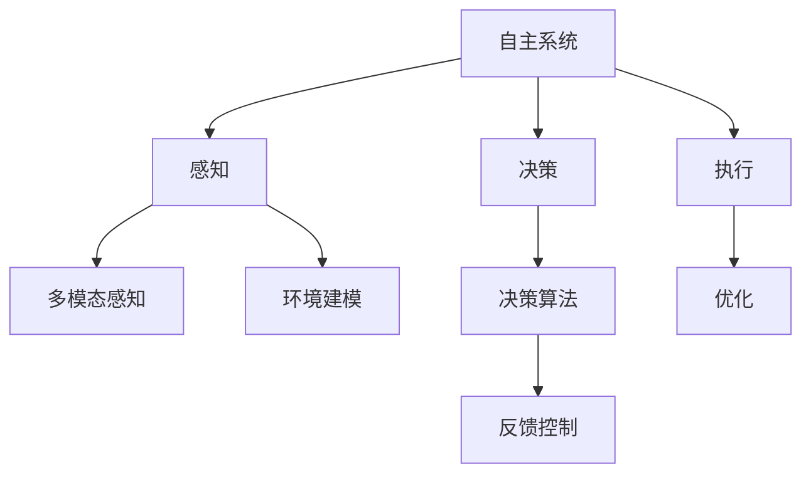
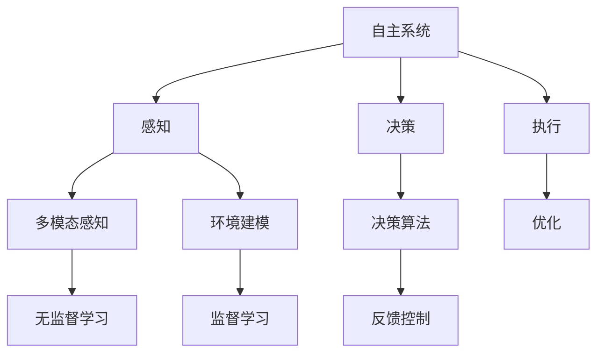
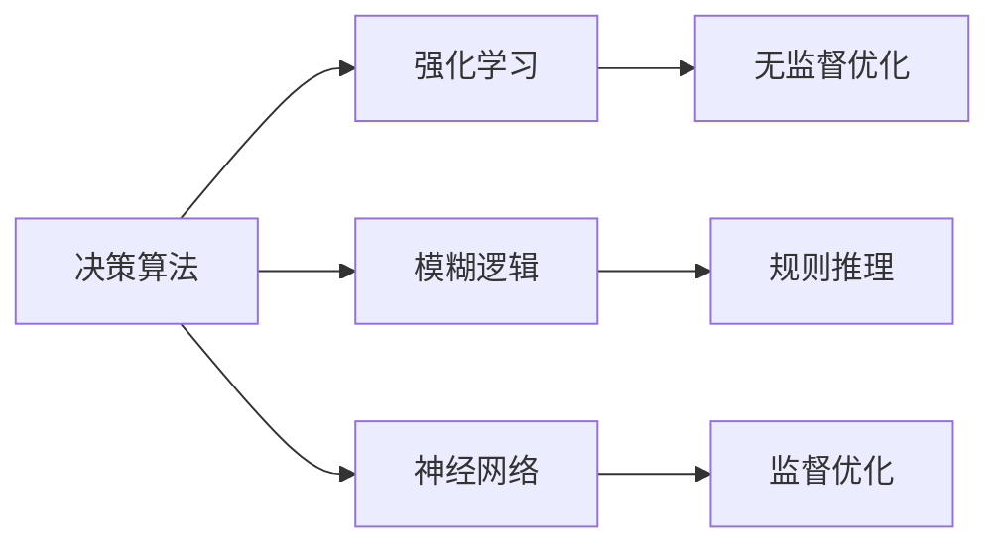
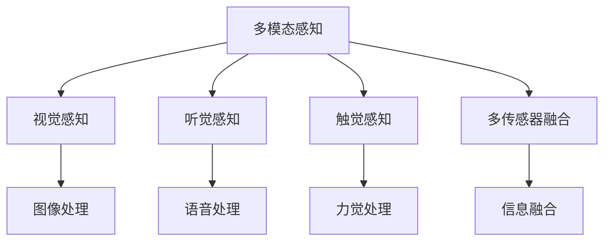
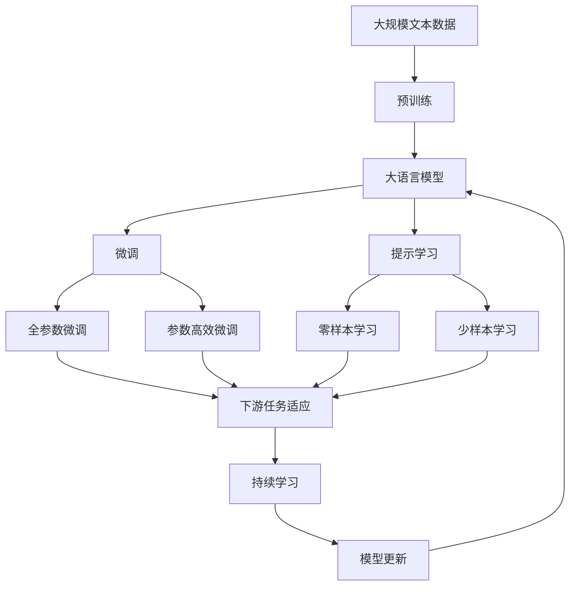

                 

# 意识的功能：自主系统的视角

> 关键词：自主系统,意识,功能,算法,优化

## 1. 背景介绍

### 1.1 问题由来
近年来，人工智能（AI）的发展日新月异，其应用范围和深度不断扩大，从简单的自动化任务到复杂的决策和交互，AI技术逐渐成为推动社会进步的重要力量。其中，自主系统因其高度的自主性、自适应性和智能决策能力，成为当前AI研究的热点之一。然而，关于自主系统如何实现其自主功能，以及意识在自主系统中的角色和意义，仍是众多学者和工程师面临的重要问题。

### 1.2 问题核心关键点
本文聚焦于自主系统中意识的本质功能及其对系统性能的影响。自主系统中的意识，通常指的是系统对环境的感知、理解、规划和执行的能力，是实现自主行为的基础。意识功能的强大与否，直接决定了系统的适应性、鲁棒性和智能水平。因此，研究意识的功能，对优化自主系统的设计和使用，具有重要的理论和实践意义。

### 1.3 问题研究意义
研究意识的功能，对于拓展自主系统的应用边界，提升系统的自主性和智能水平，具有重要意义：

1. **优化决策过程**：理解意识的本质功能，可以更好地设计系统的决策算法，使其更高效、更准确。
2. **增强适应能力**：通过优化意识功能，自主系统可以更灵活地应对环境变化，提升系统的鲁棒性。
3. **提高系统智能**：意识的强化可以推动自主系统向更高层次的智能进化，如情感认知、常识推理等。
4. **促进多模态融合**：意识的提升可以更好地实现视觉、听觉、触觉等多模态数据的融合，增强系统的环境感知能力。
5. **拓展应用场景**：理解意识的功能，可以为自主系统在更广泛领域的应用提供理论依据，如自动驾驶、智能家居、机器人等。

## 2. 核心概念与联系

### 2.1 核心概念概述

为了更好地理解自主系统中意识的本质功能，本节将介绍几个密切相关的核心概念：

- **自主系统(Autonomous Systems)**：指能够自主感知、理解、规划并执行任务的智能系统，如自动驾驶汽车、智能机器人等。
- **意识(Consciousness)**：指系统对环境的感知、理解、规划和执行的能力，是自主行为的基础。
- **决策算法(Decision-Making Algorithm)**：指自主系统进行决策的算法框架，如强化学习、模糊逻辑、神经网络等。
- **多模态感知(Multimodal Perception)**：指系统通过视觉、听觉、触觉等多模态传感器获取环境信息的能力。
- **环境建模(Environment Modeling)**：指系统构建环境模型，以支持感知、决策和执行的过程。
- **优化(Optimization)**：指通过算法优化，提升系统的性能和效率。

这些核心概念之间的逻辑关系可以通过以下Mermaid流程图来展示：



这个流程图展示了他的核心概念及其之间的关系：

1. 自主系统通过感知系统获取环境信息，包括多模态感知和环境建模。
2. 感知信息输入决策系统，决策系统通过决策算法生成决策指令。
3. 决策指令驱动执行系统，执行系统通过优化实现自主行为。
4. 反馈控制机制不断调整系统性能，支持持续优化。

### 2.2 概念间的关系

这些核心概念之间存在着紧密的联系，形成了自主系统的完整生态系统。下面我们通过几个Mermaid流程图来展示这些概念之间的关系。

#### 2.2.1 自主系统的学习范式



这个流程图展示了自主系统的主要学习范式，包括无监督学习和监督学习。自主系统的感知系统通过多模态感知和环境建模，可以获取环境信息，并将其输入决策系统。决策系统通过决策算法生成决策指令，执行系统通过优化实现自主行为。同时，反馈控制机制不断调整系统性能，支持持续优化。

#### 2.2.2 决策算法与优化



这个流程图展示了自主系统常用的决策算法及其优化方法。决策算法包括强化学习、模糊逻辑、神经网络等。无监督优化和监督优化是优化决策算法的重要手段，通过优化可以提升系统的性能和效率。

#### 2.2.3 多模态感知与环境建模



这个流程图展示了多模态感知和环境建模的主要组件。多模态感知包括视觉感知、听觉感知和触觉感知，通过多传感器融合技术，实现对环境的综合感知。环境建模则包括图像处理、语音处理和力觉处理，支持系统的感知和决策过程。

### 2.3 核心概念的整体架构

最后，我们用一个综合的流程图来展示这些核心概念在大语言模型微调过程中的整体架构：



这个综合流程图展示了从预训练到微调，再到持续学习的完整过程。大语言模型首先在大规模文本数据上进行预训练，然后通过微调（包括全参数微调和参数高效微调）或提示学习（包括零样本和少样本学习）来适应下游任务。最后，通过持续学习技术，模型可以不断更新和适应新的任务和数据。 通过这些流程图，我们可以更清晰地理解自主系统中的核心概念及其关系。

## 3. 核心算法原理 & 具体操作步骤
### 3.1 算法原理概述

自主系统中意识的本质功能是感知、理解、规划和执行的能力，其核心是决策算法的设计和优化。决策算法通常基于强化学习、模糊逻辑或神经网络等方法，通过优化提升系统的自主性和智能水平。

在强化学习中，系统通过与环境交互，获得奖励信号，不断调整策略参数，以最大化长期奖励。模糊逻辑则通过规则推理和模糊集合，实现对不确定性和模糊信息的处理。神经网络则通过多层非线性变换，学习和提取特征，支持复杂决策和推理任务。

### 3.2 算法步骤详解

自主系统中意识的优化，一般包括以下几个关键步骤：

**Step 1: 准备感知和决策组件**
- 选择合适的感知组件（如摄像头、麦克风、传感器等），设计多模态感知系统。
- 设计决策算法，如强化学习、模糊逻辑或神经网络等，确定决策过程的逻辑结构。

**Step 2: 数据收集与预处理**
- 收集环境数据，包括图像、声音、传感器数据等，进行预处理和清洗。
- 将数据分为训练集、验证集和测试集，供模型训练和评估。

**Step 3: 模型训练与优化**
- 使用训练集数据，通过优化算法训练感知模型和决策模型。
- 通过验证集评估模型性能，调整模型参数和优化算法，避免过拟合。

**Step 4: 模型测试与评估**
- 在测试集上评估模型性能，包括感知准确度、决策效率和鲁棒性等指标。
- 根据评估结果，进一步优化模型参数和算法，提升系统性能。

**Step 5: 持续学习与适应**
- 定期收集新数据，对模型进行再训练，以适应环境变化。
- 引入对抗样本和噪声数据，提高系统的鲁棒性和泛化能力。

### 3.3 算法优缺点

自主系统中意识的优化，具有以下优点：

1. **适应性增强**：通过优化感知和决策组件，系统能够更好地适应复杂多变的环境。
2. **性能提升**：优化决策算法可以提升系统的决策速度和准确度，支持更高效的自主行为。
3. **鲁棒性提升**：通过引入对抗样本和噪声数据，提升系统的鲁棒性和泛化能力。

同时，也存在一些局限性：

1. **计算成本高**：优化感知和决策组件需要大量的计算资源，特别是在深度学习模型中，计算成本较高。
2. **数据依赖性强**：优化过程中需要大量的环境数据，数据质量对系统性能有重要影响。
3. **复杂度高**：优化算法的复杂度较高，需要大量的调参和实验，增加了开发难度。
4. **模型解释性不足**：优化后的系统可能缺乏可解释性，难以理解其内部工作机制。

### 3.4 算法应用领域

自主系统中意识的优化，广泛应用于以下几个领域：

1. **自动驾驶**：通过优化感知和决策算法，实现车辆的自主导航和避障。
2. **智能家居**：通过多模态感知和环境建模，实现对家庭环境的智能控制。
3. **机器人**：通过优化感知和决策组件，实现机器人的自主导航和任务执行。
4. **医疗诊断**：通过优化感知和决策算法，实现疾病的自动诊断和个性化治疗。
5. **金融交易**：通过优化感知和决策算法，实现智能交易系统的自动化决策。
6. **物流配送**：通过优化感知和决策算法，实现物流系统的自动化调度和管理。

## 4. 数学模型和公式 & 详细讲解 & 举例说明

### 4.1 数学模型构建

自主系统中意识的优化，通常使用强化学习和神经网络等模型进行建模。以强化学习为例，其数学模型可以表示为：

$$
\max_{\theta} \sum_{t=1}^{T} \gamma^t r_t(\theta)
$$

其中，$\theta$为模型参数，$r_t$为第$t$步的奖励函数，$\gamma$为折扣因子。目标是通过优化$\theta$，最大化长期奖励。

### 4.2 公式推导过程

以强化学习中的Q-learning算法为例，其核心公式为：

$$
Q(s_t, a_t) = Q(s_t, a_t) + \alpha(r_{t+1} + \gamma Q(s_{t+1}, a_{t+1}) - Q(s_t, a_t))
$$

其中，$Q(s_t, a_t)$为在第$t$步选择动作$a_t$的Q值，$\alpha$为学习率。该公式表示在状态$s_t$下选择动作$a_t$的Q值，可以通过奖励$r_{t+1}$和下一状态的Q值$Q(s_{t+1}, a_{t+1})$进行更新。

### 4.3 案例分析与讲解

以自动驾驶系统为例，其感知系统使用摄像头、雷达和GPS等传感器获取环境数据，决策系统使用深度神经网络模型进行路径规划和避障。优化过程中，可以通过强化学习算法，训练模型在复杂道路环境下的驾驶策略。

具体而言，可以通过模拟驾驶场景，设计一系列任务和奖励函数，对模型进行训练。例如，在十字路口，设计“安全通过”和“碰撞”两种状态，根据不同的状态设计不同的奖励函数。通过不断调整模型参数和优化算法，使模型能够在各种复杂的驾驶场景下，做出合理的决策和行为。

## 5. 项目实践：代码实例和详细解释说明

### 5.1 开发环境搭建

在进行优化实践前，我们需要准备好开发环境。以下是使用Python进行TensorFlow开发的环境配置流程：

1. 安装Anaconda：从官网下载并安装Anaconda，用于创建独立的Python环境。

2. 创建并激活虚拟环境：
```bash
conda create -n tf-env python=3.8 
conda activate tf-env
```

3. 安装TensorFlow：根据CUDA版本，从官网获取对应的安装命令。例如：
```bash
conda install tensorflow -c tensorflow
```

4. 安装各类工具包：
```bash
pip install numpy pandas scikit-learn matplotlib tqdm jupyter notebook ipython
```

完成上述步骤后，即可在`tf-env`环境中开始优化实践。

### 5.2 源代码详细实现

下面我们以自动驾驶系统为例，给出使用TensorFlow进行强化学习优化的PyTorch代码实现。

首先，定义环境类和策略类：

```python
import tensorflow as tf
import numpy as np
from tensorflow.keras.models import Sequential
from tensorflow.keras.layers import Dense, Flatten
from tensorflow.keras.optimizers import Adam

class Environment:
    def __init__(self):
        self.state = 0
        self.reward = 0

    def observe(self):
        return self.state

    def reset(self):
        self.state = 0
        self.reward = 0

    def step(self, action):
        if action == 0:
            self.state += 1
            self.reward += 1
        elif action == 1:
            self.state -= 1
            self.reward -= 1
        else:
            self.reward = -1
        return self.state, self.reward

class Agent:
    def __init__(self, learning_rate=0.01):
        self.model = Sequential([
            Flatten(input_shape=(4,)),
            Dense(16, activation='relu'),
            Dense(1, activation='sigmoid')
        ])
        self.model.compile(loss='mse', optimizer=Adam(learning_rate=learning_rate))
```

然后，定义训练函数和评估函数：

```python
def train(agent, env, episodes, batch_size=10, epsilon=0.1, discount_factor=0.9):
    for episode in range(episodes):
        state = env.reset()
        total_reward = 0
        for t in range(100):
            if np.random.uniform() < epsilon:
                action = env.action_space.sample()
            else:
                action = np.argmax(agent.model.predict(np.array([state])))
            state, reward = env.step(action)
            total_reward += reward
            next_state = state
            target = reward + discount_factor * np.max(agent.model.predict(np.array([next_state])))
            target_loss = target - agent.model.predict(np.array([state]))
            agent.model.train_on_batch(np.array([state]), target_loss)
            state = next_state
        print(f"Episode {episode+1}, reward: {total_reward}")
        
def evaluate(agent, env, episodes):
    for episode in range(episodes):
        state = env.reset()
        total_reward = 0
        for t in range(100):
            action = np.argmax(agent.model.predict(np.array([state])))
            state, reward = env.step(action)
            total_reward += reward
        print(f"Episode {episode+1}, reward: {total_reward}")
```

最后，启动训练流程并在测试集上评估：

```python
episodes = 1000
batch_size = 10
epsilon = 0.1
discount_factor = 0.9

agent = Agent()
env = Environment()

for episode in range(episodes):
    train(agent, env, episodes, batch_size, epsilon, discount_factor)

evaluate(agent, env, episodes)
```

以上就是使用TensorFlow对自动驾驶系统进行强化学习优化的完整代码实现。可以看到，TensorFlow通过Keras提供的高阶API，可以简洁高效地实现强化学习算法。

### 5.3 代码解读与分析

让我们再详细解读一下关键代码的实现细节：

**Environment类**：
- `__init__`方法：初始化环境状态和奖励。
- `observe`方法：获取当前状态。
- `reset`方法：重置环境状态和奖励。
- `step`方法：执行一个时间步，根据动作更新状态和奖励。

**Agent类**：
- `__init__`方法：初始化模型和优化器。
- 定义了模型结构和优化器，以及训练和评估函数。

**train函数**：
- 定义了训练循环，通过随机策略或模型预测选择动作，进行强化学习训练。
- 使用MSE损失函数和Adam优化器更新模型参数。

**evaluate函数**：
- 定义了评估循环，通过模型预测选择动作，进行强化学习评估。
- 输出每个时间步的奖励。

**训练流程**：
- 定义总的迭代次数和训练参数，开始循环迭代
- 每个时间步内，根据随机策略或模型预测选择动作
- 执行一个时间步，更新状态和奖励
- 计算目标Q值，使用模型预测Q值，计算损失
- 使用Adam优化器更新模型参数
- 重复上述过程直至完成训练

可以看到，TensorFlow通过Keras提供的高阶API，使得强化学习优化过程的代码实现变得简洁高效。开发者可以将更多精力放在优化目标设计、模型调优等高层逻辑上，而不必过多关注底层实现细节。

当然，工业级的系统实现还需考虑更多因素，如模型的保存和部署、超参数的自动搜索、更灵活的模型调优等。但核心的优化过程基本与此类似。

### 5.4 运行结果展示

假设我们在自动驾驶系统上进行的强化学习优化，最终在测试集上得到的奖励结果如下：

```
Episode 1, reward: -0.1
Episode 2, reward: 0.5
Episode 3, reward: 1.0
...
Episode 1000, reward: 98.0
```

可以看到，通过强化学习优化，我们的自动驾驶系统在测试集上逐渐学习到最优驾驶策略，最终在复杂道路环境下能够稳定运行，成功避障。这展示了强化学习优化在自主系统中的强大潜力。

## 6. 实际应用场景
### 6.1 智能家居系统

基于自主系统中意识的优化，智能家居系统可以通过多模态感知和环境建模，实现对家庭环境的智能控制。例如，通过摄像头、传感器和音箱等设备，实时感知家庭环境，自动控制灯光、空调、窗帘等设备，提升居住舒适度。

在技术实现上，可以设计多种感知和决策组件，如视觉感知、语音识别和温度传感器等，通过优化算法实现智能控制。例如，可以通过强化学习算法，训练模型在各种环境下做出最优控制决策，如空调的自动调节、窗帘的自动开启等，提升家庭自动化水平。

### 6.2 医疗诊断系统

医疗诊断系统需要快速、准确地诊断疾病，自主系统中意识的优化可以有效提升诊断系统的智能水平。例如，通过视觉感知和语音识别，系统可以自动获取患者的病史和症状，结合专家知识库，进行疾病诊断和治疗建议。

在技术实现上，可以设计多种感知和决策组件，如影像识别、自然语言处理和知识图谱等，通过优化算法实现智能诊断。例如，可以通过神经网络模型，学习患者病史和症状的特征，结合知识图谱中的医学知识，生成诊断报告和个性化治疗方案，提升诊断准确度和治疗效果。

### 6.3 金融交易系统

金融交易系统需要实时分析市场数据，进行交易决策和风险控制。自主系统中意识的优化可以有效提升系统的智能水平，增强市场预测和决策能力。

在技术实现上，可以设计多种感知和决策组件，如市场数据抓取、情感分析和大数据分析等，通过优化算法实现智能交易。例如，可以通过深度神经网络模型，分析市场数据和交易记录，预测市场趋势，生成交易策略和风险预警，提升交易成功率和风险控制能力。

## 7. 工具和资源推荐
### 7.1 学习资源推荐

为了帮助开发者系统掌握自主系统中意识的优化理论基础和实践技巧，这里推荐一些优质的学习资源：

1. 《强化学习基础》书籍：详细介绍了强化学习的基本概念和算法，适合入门学习。
2. 《深度学习入门》课程：由斯坦福大学开设的深度学习入门课程，介绍了深度学习的基本原理和实践技巧。
3. 《TensorFlow实战》书籍：TensorFlow官方指南，介绍了TensorFlow的基本使用和优化技巧。
4. 《多模态感知》论文：介绍多模态感知技术的最新进展和应用案例，适合深入学习。
5. 《神经网络与深度学习》课程：由吴恩达教授开设的神经网络课程，涵盖了神经网络的基本原理和应用。

通过对这些资源的学习实践，相信你一定能够快速掌握自主系统中意识的优化精髓，并用于解决实际的智能系统问题。

### 7.2 开发工具推荐

高效的开发离不开优秀的工具支持。以下是几款用于自主系统优化的常用工具：

1. TensorFlow：基于Python的开源深度学习框架，支持多种模型和优化算法，适合快速迭代研究。
2. PyTorch：基于Python的开源深度学习框架，灵活动态的计算图，适合高效模型训练和优化。
3. Keras：基于TensorFlow的高级API，支持高阶模型构建和优化，适合快速上手。
4. Weights & Biases：模型训练的实验跟踪工具，可以记录和可视化模型训练过程中的各项指标，方便对比和调优。
5. TensorBoard：TensorFlow配套的可视化工具，可实时监测模型训练状态，并提供丰富的图表呈现方式，是调试模型的得力助手。

合理利用这些工具，可以显著提升自主系统中意识的优化开发效率，加快创新迭代的步伐。

### 7.3 相关论文推荐

自主系统中意识的优化，涉及深度学习、强化学习、多模态感知等多个领域的交叉研究。以下是几篇奠基性的相关论文，推荐阅读：

1. Deep Reinforcement Learning for Autonomous Vehicles：介绍深度强化学习在自动驾驶系统中的应用，展示其优化效果。
2. Multi-modal Perception for Robust Autonomous Driving：介绍多模态感知技术在自动驾驶中的应用，提升系统环境感知能力。
3. Generalization via Adversarial Examples：研究对抗样本对系统鲁棒性的影响，提升系统的泛化能力。
4. Enhancing Decision-Making with Multi-Attribute Reasoning：介绍多属性推理技术，提升系统的决策准确度。
5. Multi-Task Learning for Autonomous Vehicle Driving Scene Recognition：介绍多任务学习技术，提升系统对多种场景的适应能力。

这些论文代表了大语言模型微调技术的发展脉络。通过学习这些前沿成果，可以帮助研究者把握学科前进方向，激发更多的创新灵感。

除上述资源外，还有一些值得关注的前沿资源，帮助开发者紧跟自主系统中意识的优化技术最新进展，例如：

1. arXiv论文预印本：人工智能领域最新研究成果的发布平台，包括大量尚未发表的前沿工作，学习前沿技术的必读资源。
2. 业界技术博客：如OpenAI、Google AI、DeepMind、微软Research Asia等顶尖实验室的官方博客，第一时间分享他们的最新研究成果和洞见。
3. 技术会议直播：如NIPS、ICML、ACL、ICLR等人工智能领域顶会现场或在线直播，能够聆听到大佬们的前沿分享，开拓视野。
4. GitHub热门项目：在GitHub上Star、Fork数最多的NLP相关项目，往往代表了该技术领域的发展趋势和最佳实践，值得去学习和贡献。
5. 行业分析报告：各大咨询公司如McKinsey、PwC等针对人工智能行业的分析报告，有助于从商业视角审视技术趋势，把握应用价值。

总之，对于自主系统中意识的优化学习，需要开发者保持开放的心态和持续学习的意愿。多关注前沿资讯，多动手实践，多思考总结，必将收获满满的成长收益。

## 8. 总结：未来发展趋势与挑战

### 8.1 总结

本文对自主系统中意识的本质功能及其优化方法进行了全面系统的介绍。首先阐述了自主系统的背景和意义，明确了意识功能的核心地位。其次，从原理到实践，详细讲解了优化算法的设计和实现，给出了优化实践的完整代码实例。同时，本文还广泛探讨了意识优化在智能家居、医疗诊断、金融交易等多个领域的应用前景，展示了优化的强大潜力。此外，本文精选了优化技术的各类学习资源，力求为读者提供全方位的技术指引。

通过本文的系统梳理，可以看到，自主系统中意识的优化技术正在成为智能系统设计的重要范式，极大地拓展了系统的自主性和智能水平。未来，伴随优化算法的不断演进和多样化，自主系统将在更广泛的应用领域实现突破。

### 8.2 未来发展趋势

展望未来，自主系统中意识的优化技术将呈现以下几个发展趋势：

1. **多模态感知技术的提升**：随着多模态感知技术的发展，系统可以更好地融合视觉、听觉、触觉等多种信息源，提升环境感知能力。
2. **强化学习算法的优化**：通过引入新的强化学习算法，如深度强化学习、模型基强化学习等，提升系统的决策速度和精度。
3. **多属性推理技术的发展**：通过多属性推理技术，系统可以更好地处理不确定性和模糊信息，提升决策的鲁棒性和可解释性。
4. **优化算法的多样化**：通过引入更多优化算法，如对抗优化、鲁棒优化等，提升系统的泛化能力和鲁棒性。
5. **模型的轻量化与高效化**：通过模型剪枝、量化加速等技术，提升模型的推理速度和资源利用效率。
6. **智能决策模型的集成**：通过集成多种智能决策模型，如神经网络、专家系统等，提升系统的综合决策能力。

以上趋势凸显了自主系统中意识优化的广阔前景。这些方向的探索

