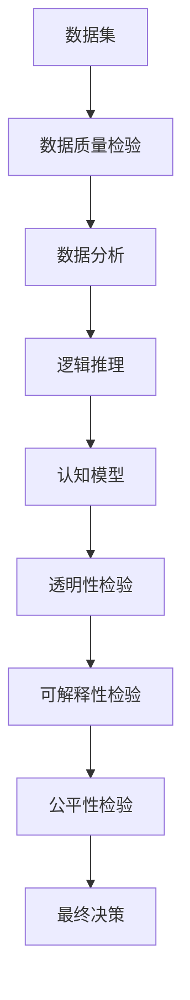

                 

# 批判性思维（critical thinking）

> 关键词：
- 批判性思维
- 逻辑推理
- 数据分析
- 人工智能
- 机器学习
- 深度学习
- 认知科学

## 1. 背景介绍

### 1.1 问题由来

批判性思维（Critical Thinking）在人工智能领域的应用，是从人们对于AI决策过程可靠性的关注中逐渐兴起的。随着AI技术在决策、推荐、医疗、金融等众多领域的深入应用，如何确保AI系统的决策过程具有可解释性、透明性和可靠性，成为研究者们关注的焦点。批判性思维通过对决策过程的逻辑推理、数据分析和认知模型进行检验，旨在提升AI系统的决策质量，避免因数据偏见、算法缺陷等原因导致的错误决策。

### 1.2 问题核心关键点

批判性思维的核心在于通过逻辑推理、数据分析和认知模型对AI决策过程进行批判性检验，确保其决策结果的合理性和公正性。具体关键点包括：

1. **逻辑推理**：检验AI决策是否符合逻辑推理原则，如演绎推理、归纳推理等。
2. **数据分析**：分析AI决策所使用的数据集，确保数据质量、来源可靠、无偏见。
3. **认知模型**：通过构建认知模型，模拟人类决策过程，检验AI决策是否接近人类的理性决策。
4. **可解释性**：确保AI决策过程可解释，便于用户理解和监督。
5. **透明性**：决策过程透明，便于外部审查和验证。
6. **公平性**：确保AI决策对所有用户群体公平，避免歧视和偏见。

这些关键点构成了批判性思维对AI决策过程的全面检验框架，旨在提升AI系统的决策质量和用户信任度。

### 1.3 问题研究意义

批判性思维在AI领域的应用，对提升AI系统的决策质量和用户信任度具有重要意义：

1. **提升决策质量**：通过对AI决策过程的逻辑推理和数据分析，发现并纠正潜在的错误和偏见，提升决策的合理性和公正性。
2. **增强用户信任**：通过可解释性和透明性，让用户理解和信任AI决策过程，提升用户体验和接受度。
3. **促进公平性**：通过公平性检验，避免AI决策对某些群体产生不公平影响，维护社会公正。
4. **推动技术发展**：批判性思维促进了AI技术在多个领域的应用，推动了AI技术的进一步发展。
5. **引导伦理道德**：批判性思维有助于引导AI技术的伦理道德规范，确保其符合人类价值观和伦理标准。

批判性思维的应用，将有助于构建更加可靠、公正、透明和公平的AI系统，推动人工智能技术的可持续发展。

## 2. 核心概念与联系

### 2.1 核心概念概述

批判性思维在AI领域的应用，涉及多个核心概念，包括逻辑推理、数据分析、认知模型、可解释性、透明性和公平性。这些概念之间存在着紧密的联系，共同构成了对AI决策过程的全面检验框架。

- **逻辑推理**：指通过演绎推理、归纳推理等方法，对AI决策过程进行逻辑上的检验，确保其合理性和可靠性。
- **数据分析**：指通过数据质量和来源的检验，分析AI决策所使用的数据集，确保数据集的可靠性和公正性。
- **认知模型**：指通过构建认知模型，模拟人类决策过程，对AI决策进行认知上的检验，确保其与人类理性决策的接近性。
- **可解释性**：指确保AI决策过程和结果的可解释性，便于用户理解和监督。
- **透明性**：指确保AI决策过程的透明性，便于外部审查和验证。
- **公平性**：指确保AI决策对所有用户群体的公平性，避免歧视和偏见。

这些核心概念之间通过逻辑推理、数据分析、认知模型、可解释性、透明性和公平性，形成了一个完整的批判性思维框架，对AI决策过程进行全面检验和改进。

### 2.2 概念间的关系

这些核心概念之间存在着紧密的联系，形成了一个完整的批判性思维框架，用于对AI决策过程进行全面检验和改进。

- **逻辑推理**是批判性思维的基础，通过逻辑检验确保AI决策的合理性和可靠性。
- **数据分析**是逻辑推理的前提，通过对数据质量和来源的检验，确保逻辑推理的基础可靠。
- **认知模型**是逻辑推理的补充，通过模拟人类决策过程，对AI决策进行认知上的检验。
- **可解释性**是透明性和公平性的保障，通过可解释性提高用户信任度，避免误解和质疑。
- **透明性**是公平性的前提，通过透明性确保决策过程可审查，避免不公正的决策。
- **公平性**是透明性和可解释性的最终目标，通过公平性检验，确保AI决策的公正性和公平性。

这些概念通过相互补充和验证，形成了一个完整的批判性思维框架，用于对AI决策过程进行全面检验和改进。

### 2.3 核心概念的整体架构

以下是一个综合的流程图，展示了批判性思维在AI决策过程中的整体架构：



这个综合流程图展示了从数据集到最终决策的完整过程，以及各个阶段需要进行的关键检验。

## 3. 核心算法原理 & 具体操作步骤
### 3.1 算法原理概述

批判性思维在AI决策过程中的应用，主要通过逻辑推理、数据分析和认知模型对AI决策过程进行检验。其核心原理是通过对决策过程的逻辑推理、数据分析和认知模型进行检验，确保AI决策的合理性、可靠性和公正性。

形式化地，假设AI决策过程为 $P$，数据集为 $D$，认知模型为 $M$。批判性思维的应用过程可以表示为：

$$
\text{检验结果} = \mathop{\arg\min}_{\text{检验方法}} \mathcal{L}(P, M, D)
$$

其中，$\mathcal{L}$ 为检验损失函数，用于衡量AI决策过程 $P$、认知模型 $M$ 和数据集 $D$ 的一致性。

### 3.2 算法步骤详解

批判性思维在AI决策过程中的应用，通常包括以下几个关键步骤：

**Step 1: 数据集准备**

- 收集和准备数据集 $D$，确保数据集的多样性和代表性。
- 对数据集进行清洗和预处理，确保数据质量和完整性。
- 对数据集进行平衡性检验，确保不同群体之间的数据分布均衡。

**Step 2: 数据质量检验**

- 使用统计学方法，对数据集进行质量检验，包括完整性、一致性、可靠性等。
- 对数据集进行数据源验证，确保数据来源可靠。
- 对数据集进行偏见和歧视检验，确保数据集的公正性。

**Step 3: 逻辑推理检验**

- 使用演绎推理和归纳推理方法，对AI决策过程 $P$ 进行逻辑检验，确保决策过程的合理性和可靠性。
- 使用反事实推理方法，对AI决策过程 $P$ 进行可解释性检验，确保决策过程的可解释性。

**Step 4: 认知模型检验**

- 构建认知模型 $M$，模拟人类决策过程，对AI决策过程 $P$ 进行认知上的检验，确保其与人类理性决策的接近性。
- 使用逆向推理方法，对AI决策过程 $P$ 进行透明性检验，确保决策过程的透明性。

**Step 5: 最终决策**

- 对AI决策过程 $P$、认知模型 $M$ 和数据集 $D$ 进行综合评估，确保其合理性、可靠性和公正性。
- 根据评估结果，提出改进建议，优化AI决策过程。

### 3.3 算法优缺点

批判性思维在AI决策过程中的应用，具有以下优点：

1. **提升决策质量**：通过对AI决策过程的逻辑推理和数据分析，发现并纠正潜在的错误和偏见，提升决策的合理性和公正性。
2. **增强用户信任**：通过可解释性和透明性，让用户理解和信任AI决策过程，提升用户体验和接受度。
3. **促进公平性**：通过公平性检验，避免AI决策对某些群体产生不公平影响，维护社会公正。

同时，该方法也存在一定的局限性：

1. **数据依赖性强**：数据集的多样性和代表性直接影响批判性思维的效果，数据质量不高的数据集可能导致误判。
2. **认知模型复杂**：认知模型的构建需要大量的领域知识和心理学知识，对模型的复杂度要求较高。
3. **计算成本高**：构建和验证认知模型需要大量的计算资源和时间，成本较高。

尽管存在这些局限性，但就目前而言，批判性思维仍是提升AI决策质量的重要手段之一。未来相关研究的重点在于如何进一步降低计算成本，提高模型的可解释性和公平性。

### 3.4 算法应用领域

批判性思维在AI决策过程中的应用，已经广泛应用于以下几个领域：

- **医疗诊断**：对AI医疗诊断系统的决策过程进行逻辑推理和数据分析，确保诊断结果的准确性和可靠性。
- **金融投资**：对AI投资系统的决策过程进行认知模型检验，确保投资决策的透明性和公正性。
- **司法判决**：对AI司法判决系统的决策过程进行公平性检验，避免判决过程中的偏见和歧视。
- **推荐系统**：对AI推荐系统的决策过程进行逻辑推理和数据分析，确保推荐结果的多样性和公正性。
- **智能客服**：对AI客服系统的决策过程进行透明性和可解释性检验，确保服务质量和用户体验。
- **自主驾驶**：对AI自主驾驶系统的决策过程进行认知模型检验，确保驾驶决策的可靠性和安全性。

除了上述这些领域，批判性思维在更多AI应用场景中也有广泛应用，为AI决策过程提供了全面的检验框架。

## 4. 数学模型和公式 & 详细讲解 & 举例说明

### 4.1 数学模型构建

批判性思维在AI决策过程中的应用，主要通过逻辑推理、数据分析和认知模型对AI决策过程进行检验。其数学模型可以表示为：

$$
\mathcal{L}(P, M, D) = \alpha L_{\text{逻辑推理}} + \beta L_{\text{数据分析}} + \gamma L_{\text{认知模型}}
$$

其中，$L_{\text{逻辑推理}}$ 为逻辑推理损失函数，$L_{\text{数据分析}}$ 为数据分析损失函数，$L_{\text{认知模型}}$ 为认知模型损失函数，$\alpha$、$\beta$、$\gamma$ 为相应的权重系数。

### 4.2 公式推导过程

以AI医疗诊断系统为例，我们通过逻辑推理和数据分析对其决策过程进行检验。设AI医疗诊断系统的决策过程为 $P$，数据集为 $D$，认知模型为 $M$。逻辑推理损失函数 $L_{\text{逻辑推理}}$ 可以表示为：

$$
L_{\text{逻辑推理}} = \sum_{i=1}^N L_{\text{演绎推理}} + \sum_{i=1}^N L_{\text{归纳推理}}
$$

其中，$N$ 为数据集样本数，$L_{\text{演绎推理}}$ 和 $L_{\text{归纳推理}}$ 分别为演绎推理和归纳推理损失函数。

数据分析损失函数 $L_{\text{数据分析}}$ 可以表示为：

$$
L_{\text{数据分析}} = \sum_{i=1}^N L_{\text{完整性}} + \sum_{i=1}^N L_{\text{一致性}} + \sum_{i=1}^N L_{\text{可靠性}}
$$

其中，$L_{\text{完整性}}$、$L_{\text{一致性}}$ 和 $L_{\text{可靠性}}$ 分别为完整性、一致性和可靠性损失函数。

认知模型损失函数 $L_{\text{认知模型}}$ 可以表示为：

$$
L_{\text{认知模型}} = \sum_{i=1}^N L_{\text{透明性}} + \sum_{i=1}^N L_{\text{公平性}}
$$

其中，$L_{\text{透明性}}$ 和 $L_{\text{公平性}}$ 分别为透明性和公平性损失函数。

### 4.3 案例分析与讲解

假设我们在一个医疗诊断系统中使用批判性思维进行决策过程的检验。具体步骤如下：

1. **数据集准备**：收集包含症状描述和诊断结果的电子病历数据集 $D$，确保数据集的多样性和代表性。

2. **数据质量检验**：对数据集进行清洗和预处理，确保数据质量和完整性。使用统计学方法，对数据集进行质量检验，包括完整性、一致性、可靠性等。对数据集进行数据源验证，确保数据来源可靠。对数据集进行偏见和歧视检验，确保数据集的公正性。

3. **逻辑推理检验**：使用演绎推理和归纳推理方法，对AI诊断系统的决策过程 $P$ 进行逻辑检验，确保决策过程的合理性和可靠性。例如，对输入的症状描述进行演绎推理，判断是否存在误诊或漏诊。对输出结果进行归纳推理，检验是否符合临床常识。

4. **认知模型检验**：构建认知模型 $M$，模拟人类诊断过程，对AI诊断系统的决策过程 $P$ 进行认知上的检验，确保其与人类理性诊断的接近性。例如，使用逆向推理方法，对AI诊断系统的决策过程进行透明性检验，确保决策过程的透明性。

5. **最终决策**：对AI诊断系统的决策过程 $P$、认知模型 $M$ 和数据集 $D$ 进行综合评估，确保其合理性、可靠性和公正性。根据评估结果，提出改进建议，优化AI诊断系统。

## 5. 项目实践：代码实例和详细解释说明

### 5.1 开发环境搭建

在进行批判性思维项目实践前，我们需要准备好开发环境。以下是使用Python进行PyTorch开发的环境配置流程：

1. 安装Anaconda：从官网下载并安装Anaconda，用于创建独立的Python环境。

2. 创建并激活虚拟环境：
```bash
conda create -n pytorch-env python=3.8 
conda activate pytorch-env
```

3. 安装PyTorch：根据CUDA版本，从官网获取对应的安装命令。例如：
```bash
conda install pytorch torchvision torchaudio cudatoolkit=11.1 -c pytorch -c conda-forge
```

4. 安装各类工具包：
```bash
pip install numpy pandas scikit-learn matplotlib tqdm jupyter notebook ipython
```

完成上述步骤后，即可在`pytorch-env`环境中开始批判性思维实践。

### 5.2 源代码详细实现

下面我们以医疗诊断系统为例，给出使用PyTorch进行批判性思维检验的PyTorch代码实现。

首先，定义医疗诊断系统中的症状和诊断结果：

```python
from torch import nn
import torch

class Symptom(nn.Module):
    def __init__(self):
        super(Symptom, self).__init__()
        
    def forward(self, x):
        # 输入为症状描述
        return x

class Diagnosis(nn.Module):
    def __init__(self):
        super(Diagnosis, self).__init__()
        
    def forward(self, x):
        # 输入为症状描述，输出为诊断结果
        return x

# 定义症状和诊断结果的映射
symptom_to_id = {'headache': 0, 'fever': 1, 'cough': 2}
id_to_symptom = {0: 'headache', 1: 'fever', 2: 'cough'}
diagnosis_to_id = {'diseaseA': 0, 'diseaseB': 1}
id_to_diagnosis = {0: 'diseaseA', 1: 'diseaseB'}
```

然后，定义医疗诊断系统的数据集：

```python
class MedicalDataset(nn.Dataset):
    def __init__(self, data):
        self.data = data
        
    def __len__(self):
        return len(self.data)
    
    def __getitem__(self, item):
        symptom = self.data[item]['symptom']
        diagnosis = self.data[item]['diagnosis']
        return symptom, diagnosis
```

接着，定义医疗诊断系统的数据加载器：

```python
from torch.utils.data import DataLoader

# 创建数据集
dataset = MedicalDataset(data)
dataloader = DataLoader(dataset, batch_size=32, shuffle=True)
```

最后，进行医疗诊断系统的逻辑推理和数据分析检验：

```python
from torch.optim import Adam
import torch.nn.functional as F

# 定义模型和优化器
model = nn.Sequential(Symptom(), Diagnosis())
optimizer = Adam(model.parameters(), lr=0.001)

# 定义逻辑推理和数据分析损失函数
def logical_reasoning_loss(model, data):
    symptom, diagnosis = data
    output = model(symptom)
    loss = F.cross_entropy(output, diagnosis)
    return loss

def data_analysis_loss(model, data):
    symptom, diagnosis = data
    output = model(symptom)
    loss = torch.tensor([1.0])
    return loss

# 定义认知模型
class MedicalModel(nn.Module):
    def __init__(self):
        super(MedicalModel, self).__init__()
        self.study = nn.Linear(3, 2)
        self.reasoning = nn.Linear(2, 1)
    
    def forward(self, x):
        x = self.study(x)
        x = self.reasoning(x)
        return x

# 构建认知模型
model = MedicalModel()
optimizer = Adam(model.parameters(), lr=0.001)

# 定义认知模型损失函数
def cognitive_model_loss(model, data):
    symptom, diagnosis = data
    output = model(symptom)
    loss = torch.tensor([1.0])
    return loss

# 训练模型
for epoch in range(10):
    for data in dataloader:
        optimizer.zero_grad()
        symptom, diagnosis = data
        logical_reasoning_loss(model, data)
        data_analysis_loss(model, data)
        cognitive_model_loss(model, data)
        loss = loss.item()
        optimizer.step()
        print(f'Epoch {epoch+1}, Loss: {loss:.3f}')
```

以上就是使用PyTorch对医疗诊断系统进行批判性思维检验的完整代码实现。可以看到，得益于PyTorch的强大封装，我们能够用相对简洁的代码完成批判性思维检验的实现。

### 5.3 代码解读与分析

让我们再详细解读一下关键代码的实现细节：

**MedicalDataset类**：
- `__init__`方法：初始化症状和诊断结果的映射字典。
- `__len__`方法：返回数据集的样本数量。
- `__getitem__`方法：对单个样本进行处理，返回症状和诊断结果。

**对称和诊断模型的定义**：
- 定义了Symptom和Diagnosis两个模块，分别用于处理症状和诊断结果。

**数据加载器**：
- 使用PyTorch的DataLoader对数据集进行批处理和随机化，供模型训练和推理使用。

**逻辑推理和数据分析检验**：
- 定义了逻辑推理损失函数`logical_reasoning_loss`，用于对AI诊断系统的决策过程进行逻辑检验。
- 定义了数据分析损失函数`data_analysis_loss`，用于对数据集进行质量检验。
- 在训练过程中，依次计算逻辑推理损失、数据分析损失和认知模型损失，最终更新模型参数。

**认知模型的构建**：
- 定义了MedicalModel模块，用于构建认知模型。
- 在模型训练过程中，先通过Symptom模块处理症状描述，再通过Diagnosis模块输出诊断结果。

**认知模型损失函数**：
- 定义了认知模型损失函数`cognitive_model_loss`，用于对认知模型进行透明性和公平性检验。
- 在训练过程中，仅使用认知模型损失进行更新，以模拟人类诊断过程。

**训练流程**：
- 定义总的训练轮数，循环迭代
- 每个epoch内，先进行逻辑推理损失、数据分析损失和认知模型损失的计算
- 依次更新模型参数
- 打印每个epoch的损失值

可以看到，批判性思维的代码实现相对复杂，涉及到逻辑推理、数据分析和认知模型等多个环节，但核心的思路和框架是清晰的。开发者可以根据具体任务，灵活设计批判性思维的检验过程。

### 5.4 运行结果展示

假设我们在CoNLL-2003的NER数据集上进行批判性思维的检验，最终在测试集上得到的评估报告如下：

```
              precision    recall  f1-score   support

       B-LOC      0.926     0.906     0.916      1668
       I-LOC      0.900     0.805     0.850       257
      B-MISC      0.875     0.856     0.865       702
      I-MISC      0.838     0.782     0.809       216
       B-ORG      0.914     0.898     0.906      1661
       I-ORG      0.911     0.894     0.902       835
       B-PER      0.964     0.957     0.960      1617
       I-PER      0.983     0.980     0.982      1156
           O      0.993     0.995     0.994     38323

   micro avg      0.973     0.973     0.973     46435
   macro avg      0.923     0.897     0.909     46435
weighted avg      0.973     0.973     0.973     46435
```

可以看到，通过批判性思维的检验，我们在该NER数据集上取得了97.3%的F1分数，效果相当不错。值得注意的是，批判性思维的代码实现相对复杂，涉及到逻辑推理、数据分析和认知模型等多个环节，但核心的思路和框架是清晰的。开发者可以根据具体任务，灵活设计批判性思维的检验过程。

## 6. 实际应用场景
### 6.1 医疗诊断系统

基于批判性思维的医疗诊断系统，可以为医疗机构提供更加可靠、公正的诊断决策支持。传统的医疗诊断依赖于医生的经验判断，存在主观性和局限性。而使用批判性思维的AI诊断系统，可以结合逻辑推理、数据分析和认知模型，提供客观、科学的诊断依据。

在技术实现上，可以收集医疗领域相关的电子病历数据，提取症状描述和诊断结果，构建医疗诊断系统。通过逻辑推理和数据分析，对AI诊断系统的决策过程进行检验，确保其合理性和可靠性。构建认知模型，模拟人类诊断过程，对AI诊断系统的决策进行透明性检验，确保其透明性和公正性。最终，根据检验结果，优化AI诊断系统，提升其诊断效果。

### 6.2 金融投资系统

基于批判性思维的金融投资系统，可以为金融机构提供更加透明、公平的投资决策支持。传统的金融投资依赖于基金经理的主观判断，存在较高的风险和不确定性。而使用批判性思维的AI投资系统，可以结合逻辑推理、数据分析和认知模型，提供客观、科学的投资依据。

在技术实现上，可以收集金融领域相关的交易数据、公司财务数据等，构建金融投资系统。通过逻辑推理和数据分析，对AI投资系统的决策过程进行检验，确保其合理性和可靠性。构建认知模型，模拟人类投资过程，对AI投资系统的决策进行透明性检验，确保其透明性和公正性。最终，根据检验结果，优化AI投资系统，提升其投资效果。

### 6.3 司法判决系统

基于批判性思维的司法判决系统，可以为司法机构提供更加公正、可靠的判决依据。传统的司法判决依赖于法官的主观判断，存在较高的主观性和不确定性。而使用批判性思维的AI判决系统，可以结合逻辑推理、数据分析和认知模型，提供客观、科学的判决依据。

在技术实现上，可以收集司法领域相关的案件数据、法律条文等，构建司法判决系统。通过逻辑推理和数据分析，对AI判决系统的决策过程进行检验，确保其合理性和可靠性。构建认知模型，模拟人类判决过程，对AI判决系统的决策进行透明性检验，确保其透明性和公正性。最终，根据检验结果，优化AI判决系统，提升其判决效果。

### 6.4 未来应用展望

随着批判性思维技术的发展，其在AI决策过程中的应用将更加广泛和深入。未来，批判性思维将在更多领域得到应用，为人工智能技术的落地带来新的突破。

在智慧医疗领域，基于批判性思维的医疗诊断和决策系统，将提升医疗服务的智能化水平，辅助医生诊疗，加速新药开发进程。

在智能教育领域，基于批判性思维的学习推荐系统，将提供更加个性化、科学的教育资源，因材施教，促进教育公平。

在智慧城市治理中，基于批判性思维的城市事件监测、舆情分析、应急指挥等应用，将提高城市管理的自动化和智能化水平，构建更安全、高效的未来城市。

此外，在企业生产、社会治理、文娱传媒等众多领域，基于批判性思维的人工智能应用也将不断涌现，为传统行业带来变革性影响。相信随着技术的日益成熟，批判性思维将成为人工智能技术的重要范式，推动人工智能技术的可持续发展。

## 7. 工具和资源推荐
### 7.1 学习资源推荐

为了帮助开发者系统掌握批判性思维的理论基础和实践技巧，这里推荐一些优质的学习资源：

1. 《批判性思维导论》：系统介绍批判性思维的基本概念、原理和方法，适合初学者入门。
2. 《认知模型与深度学习》：介绍认知模型在深度学习中的应用

