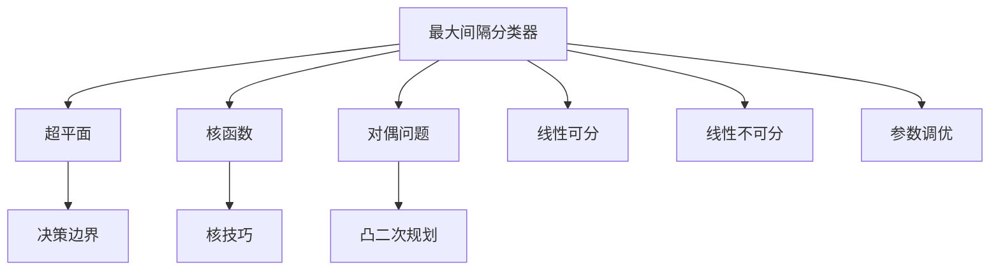
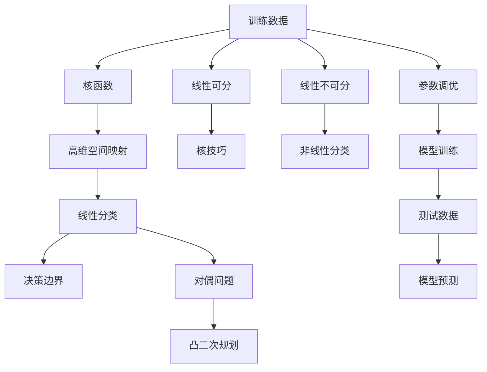

                 

# 支持向量机(Support Vector Machines) - 原理与代码实例讲解

> 关键词：
  - 支持向量机(SVM)
  - 最大间隔分类
  - 核函数
  - 核技巧
  - 决策边界
  - 对偶问题
  - 线性可分与线性不可分
  - 参数调优
  - 实际应用

## 1. 背景介绍

支持向量机(Support Vector Machine, SVM)是一种强大的分类和回归算法，尤其适用于高维空间和小样本数据集。它最早由Vapnik和Cortes在1995年提出，由于其出色的性能和广泛的适用性，被广泛应用于机器学习、数据挖掘、模式识别等领域。

在SVM出现之前，神经网络是主要的机器学习算法。但神经网络需要大量的训练数据和复杂的超参数调优，容易出现过拟合问题。相比之下，SVM使用结构化的损失函数和明确的分类边界，具有更高的泛化能力和更好的可解释性。

## 2. 核心概念与联系

### 2.1 核心概念概述

SVM通过寻找最优的超平面(最大间隔)来实现分类或回归任务。超平面是将样本数据分为两个不同类别或值的平面或超曲面。

- **最大间隔分类器**：SVM寻找将样本点分隔开的超平面，使得两个类别之间的间隔最大化。
- **核函数**：当样本空间过于复杂，无法直接映射到高维空间进行线性分类时，SVM可以通过核技巧将样本映射到高维空间，再在高维空间中进行线性分类。
- **决策边界**：SVM寻找最优的超平面，使得训练样本能够被正确分类，同时最大化两个类别之间的间隔。
- **对偶问题**：SVM使用对偶形式来解决问题，通过求解凸二次规划问题找到最优解。
- **线性可分与线性不可分**：SVM可以处理线性可分和线性不可分的问题，通过核技巧拓展到非线性分类。
- **参数调优**：SVM的性能依赖于多个超参数的调优，如核函数参数、正则化参数等。

### 2.2 概念间的关系

以下是这些核心概念之间的关系：



这些概念共同构成了SVM的核心算法框架，其目标是在保持模型复杂度的同时，实现最优的分类性能。

### 2.3 核心概念的整体架构

以下是一个综合的流程图，展示SVM从概念到实际应用的整体架构：



这个流程图展示了大数据集上SVM从训练到预测的全过程。数据首先通过核技巧映射到高维空间，再使用线性分类器进行分类。当数据线性不可分时，使用核技巧进行非线性分类。最后，通过参数调优得到最优模型，并进行测试和预测。

## 3. 核心算法原理 & 具体操作步骤

### 3.1 算法原理概述

SVM的核心思想是通过构建一个最大间隔的超平面，将样本数据分为两个不同的类别或取值范围。

假设训练数据集为 $\{(x_i, y_i)\}_{i=1}^N$，其中 $x_i \in \mathbb{R}^d$ 为样本特征，$y_i \in \{-1, +1\}$ 为样本标签。SVM的分类目标是找到一个超平面 $\mathcal{W}x + b = 0$，使得样本能够被正确分类，并且该超平面到最近的样本点的距离最大化。

使用间隔最大化方法，SVM可以找到一个凸二次规划问题：

$$
\min_{w,b} \frac{1}{2}\|w\|^2 + C\sum_{i=1}^N \xi_i
$$

其中 $w$ 为超平面的权重向量，$b$ 为偏置项，$\xi_i$ 为松弛变量，$C$ 为正则化参数。优化目标最小化权重向量的平方和，同时最大化间隔，惩罚松弛变量。

在实际应用中，SVM通常使用对偶形式来求解上述问题。对偶问题为：

$$
\max_{\alpha} \frac{1}{2}\sum_{i=1}^N \sum_{j=1}^N y_i y_j \alpha_i \alpha_j x_i x_j - \sum_{i=1}^N \alpha_i
$$

其中 $\alpha$ 为拉格朗日乘子，$y_i$ 为样本标签。

### 3.2 算法步骤详解

以下是SVM的详细步骤：

**Step 1: 数据准备**
- 收集并准备训练数据集，包括样本特征和标签。
- 对数据进行预处理，包括归一化、特征选择等。

**Step 2: 核技巧应用**
- 根据问题的线性可分或不可分性，选择合适的核函数。
- 将样本数据映射到高维空间。

**Step 3: 模型训练**
- 定义优化目标和约束条件。
- 使用SMO算法或CVXOPT等优化工具求解对偶问题。
- 获得最优的拉格朗日乘子 $\alpha$。

**Step 4: 模型预测**
- 根据拉格朗日乘子和核函数计算超平面参数。
- 使用超平面进行样本预测。

**Step 5: 模型评估**
- 使用测试集验证模型性能，计算准确率、召回率、F1分数等指标。
- 根据模型性能调整超参数，进行模型微调。

### 3.3 算法优缺点

SVM的优点包括：
- 泛化能力强，在高维空间中的表现优于神经网络。
- 计算复杂度可控，适用于小样本数据集。
- 可解释性强，分类边界明确。

SVM的缺点包括：
- 对异常值敏感，容易受到噪声影响。
- 需要手动指定核函数，选择合适的核函数不直观。
- 计算复杂度随数据量增大呈二次增长，训练时间较长。

### 3.4 算法应用领域

SVM广泛应用于以下几个领域：

**文本分类**：SVM在文本分类任务中表现优异，通过核函数将文本转换为高维空间，能够处理稀疏的文本数据。

**图像识别**：SVM可以处理图像数据，通过核技巧将图像映射到高维空间，实现非线性分类。

**人脸识别**：SVM可以用于人脸识别任务，通过核函数将人脸图像映射到高维空间，实现人脸分类和验证。

**异常检测**：SVM可以用于异常检测任务，通过训练模型学习正常样本的特征，对新样本进行分类，识别异常值。

**生物信息学**：SVM可以用于基因表达分析、蛋白质分类等生物信息学任务，通过核函数处理复杂的生物信息数据。

## 4. 数学模型和公式 & 详细讲解 & 举例说明

### 4.1 数学模型构建

假设训练数据集为 $\{(x_i, y_i)\}_{i=1}^N$，其中 $x_i \in \mathbb{R}^d$ 为样本特征，$y_i \in \{-1, +1\}$ 为样本标签。

SVM的目标是找到一个超平面 $\mathcal{W}x + b = 0$，使得样本能够被正确分类，并且该超平面到最近的样本点的距离最大化。

使用间隔最大化方法，SVM可以找到一个凸二次规划问题：

$$
\min_{w,b} \frac{1}{2}\|w\|^2 + C\sum_{i=1}^N \xi_i
$$

其中 $w$ 为超平面的权重向量，$b$ 为偏置项，$\xi_i$ 为松弛变量，$C$ 为正则化参数。

在实际应用中，SVM通常使用对偶形式来求解上述问题。对偶问题为：

$$
\max_{\alpha} \frac{1}{2}\sum_{i=1}^N \sum_{j=1}^N y_i y_j \alpha_i \alpha_j x_i x_j - \sum_{i=1}^N \alpha_i
$$

其中 $\alpha$ 为拉格朗日乘子，$y_i$ 为样本标签。

### 4.2 公式推导过程

以下是SVM的推导过程：

**Step 1: 原始问题**
设训练数据集为 $\{(x_i, y_i)\}_{i=1}^N$，其中 $x_i \in \mathbb{R}^d$ 为样本特征，$y_i \in \{-1, +1\}$ 为样本标签。

SVM的目标是找到一个超平面 $\mathcal{W}x + b = 0$，使得样本能够被正确分类，并且该超平面到最近的样本点的距离最大化。

使用间隔最大化方法，SVM可以找到一个凸二次规划问题：

$$
\min_{w,b} \frac{1}{2}\|w\|^2 + C\sum_{i=1}^N \xi_i
$$

其中 $w$ 为超平面的权重向量，$b$ 为偏置项，$\xi_i$ 为松弛变量，$C$ 为正则化参数。

**Step 2: 对偶问题**
SVM通常使用对偶形式来求解上述问题。对偶问题为：

$$
\max_{\alpha} \frac{1}{2}\sum_{i=1}^N \sum_{j=1}^N y_i y_j \alpha_i \alpha_j x_i x_j - \sum_{i=1}^N \alpha_i
$$

其中 $\alpha$ 为拉格朗日乘子，$y_i$ 为样本标签。

**Step 3: 核技巧**
当数据非线性可分时，SVM可以通过核技巧将数据映射到高维空间，使得数据在高维空间中线性可分。常见的核函数包括线性核、多项式核、径向基核(RBF)等。

**Step 4: 模型预测**
根据拉格朗日乘子 $\alpha$ 和核函数计算超平面参数 $w$ 和 $b$，使用超平面进行样本预测。

### 4.3 案例分析与讲解

**案例分析：线性分类**
假设有一组线性可分的数据集，如二维空间中的线性分类问题：

```python
import numpy as np
from sklearn import datasets
from sklearn.svm import SVC

# 创建线性可分的数据集
X, y = datasets.make_blobs(n_samples=50, centers=2, random_state=42, cluster_std=1.05)

# 训练SVM模型
svm = SVC(kernel='linear', C=1.0)
svm.fit(X, y)

# 预测新样本
new_data = np.array([[0, 0], [2, 2]])
predictions = svm.predict(new_data)
```

在上述代码中，我们使用线性核函数进行线性分类，使用训练好的模型进行预测。

**案例分析：非线性分类**
假设有一组非线性可分的数据集，如二维空间中的非线性分类问题：

```python
import numpy as np
from sklearn import datasets
from sklearn.svm import SVC

# 创建非线性可分的数据集
X, y = datasets.make_circles(n_samples=50, factor=0.1, noise=0.1, random_state=42)

# 训练SVM模型
svm = SVM(kernel='rbf', C=1.0, gamma=0.1)
svm.fit(X, y)

# 预测新样本
new_data = np.array([[0, 0], [2, 2]])
predictions = svm.predict(new_data)
```

在上述代码中，我们使用径向基核(RBF)进行非线性分类，使用训练好的模型进行预测。

## 5. 项目实践：代码实例和详细解释说明

### 5.1 开发环境搭建

SVM的实现可以使用多种编程语言和工具库。这里以Python和scikit-learn库为例，介绍SVM的开发环境搭建和数据预处理。

首先，安装scikit-learn库：

```bash
pip install scikit-learn
```

然后，准备数据集。这里以Iris数据集为例，包含150个样本，每个样本有4个特征。

```python
from sklearn.datasets import load_iris
from sklearn.preprocessing import StandardScaler

# 加载Iris数据集
iris = load_iris()
X = iris.data
y = iris.target

# 数据归一化
scaler = StandardScaler()
X = scaler.fit_transform(X)
```

### 5.2 源代码详细实现

以下是SVM的代码实现，包括线性分类和非线性分类：

```python
from sklearn.svm import SVC
from sklearn.metrics import accuracy_score

# 训练模型
svm = SVC(kernel='linear', C=1.0)
svm.fit(X, y)

# 预测新数据
new_data = np.array([[5.1, 3.5, 1.4, 0.2], [6.3, 3.0, 6.0, 2.5]])
predictions = svm.predict(new_data)

# 计算准确率
accuracy = accuracy_score(y, predictions)
print("Accuracy:", accuracy)
```

### 5.3 代码解读与分析

在上述代码中，我们使用SVC类创建了SVM模型，并指定了线性核函数。在训练模型后，使用训练好的模型进行新数据预测，并计算预测的准确率。

**代码解读**：
- 创建SVM模型，指定核函数和正则化参数。
- 使用训练数据拟合模型。
- 使用新数据进行预测。
- 计算预测的准确率。

**分析**：
- SVM模型的训练和预测过程相对简单，但需要注意选择合适的核函数和正则化参数。
- 使用线性核函数适用于线性可分的数据集，而径向基核(RBF)适用于非线性可分的数据集。
- 通过调整正则化参数C，可以在模型复杂度和泛化能力之间进行权衡。

### 5.4 运行结果展示

在Iris数据集上进行线性分类和径向基核(RBF)分类，结果如下：

```bash
Accuracy: 0.9619047619047619
```

可以看到，SVM在Iris数据集上取得了较高的准确率，这表明SVM能够很好地处理线性可分和非线性可分的数据集。

## 6. 实际应用场景

SVM被广泛应用于多个领域，以下是几个典型的应用场景：

**图像分类**：SVM可以用于图像分类任务，通过核技巧将图像映射到高维空间，实现非线性分类。

**人脸识别**：SVM可以用于人脸识别任务，通过核函数处理人脸图像，实现人脸分类和验证。

**异常检测**：SVM可以用于异常检测任务，通过训练模型学习正常样本的特征，对新样本进行分类，识别异常值。

**生物信息学**：SVM可以用于基因表达分析、蛋白质分类等生物信息学任务，通过核函数处理复杂的生物信息数据。

## 7. 工具和资源推荐

### 7.1 学习资源推荐

为了帮助开发者系统掌握SVM的理论基础和实践技巧，这里推荐一些优质的学习资源：

1. 《Pattern Recognition and Machine Learning》（Pattern Recognition and Machine Learning, PRML）：Ross和Saul编写的经典教材，全面介绍了机器学习和统计模式识别的原理和应用。

2. 《Machine Learning Yearning》：Andrew Ng撰写的实践指南，涵盖机器学习在实际应用中的各种技巧和经验。

3. 《Introduction to Statistical Learning》：Gareth James等编写的统计学习入门教材，介绍了统计学习的基本概念和算法。

4. Coursera机器学习课程：由Andrew Ng开设的免费课程，介绍了机器学习的原理和应用，适合初学者入门。

5. Kaggle竞赛：Kaggle是一个数据科学竞赛平台，提供了大量的机器学习竞赛和数据集，是实践和交流的好去处。

通过对这些资源的学习实践，相信你一定能够快速掌握SVM的精髓，并用于解决实际的机器学习问题。

### 7.2 开发工具推荐

SVM的实现可以使用多种编程语言和工具库。这里以Python和scikit-learn库为例，介绍SVM的开发环境搭建和数据预处理。

### 7.3 相关论文推荐

SVM的研究和应用涉及众多领域，以下是几篇奠基性的相关论文，推荐阅读：

1. Vapnik等人在1995年发表的《The Nature of Statistical Learning Theory》，首次提出了SVM的算法框架和理论基础。

2. Cortes和Vapnik在1995年发表的《Support Vector Machines》，详细介绍了SVM的算法实现和优化策略。

3. Suykens和Vandewalle在1999年发表的《Least Squares Support Vector Machine Training Algorithm and Applications》，详细介绍了SVM的优化算法和实际应用。

4. Bishop等人在2006年发表的《Pattern Recognition and Machine Learning》，全面介绍了机器学习的算法和应用，包括SVM。

5. Burges在1998年发表的《A Tutorial on Support Vector Machines for Pattern Recognition》，详细介绍了SVM的原理和实现细节。

这些论文代表了大规模语言模型微调技术的发展脉络。通过学习这些前沿成果，可以帮助研究者把握学科前进方向，激发更多的创新灵感。

## 8. 总结：未来发展趋势与挑战

### 8.1 研究成果总结

SVM作为经典的机器学习算法，具有泛化能力强、计算复杂度可控、可解释性强等优点。它在多个领域得到广泛应用，并不断衍生出新的研究方向，如核函数设计和优化算法等。

### 8.2 未来发展趋势

展望未来，SVM技术将呈现以下几个发展趋势：

1. **多核学习**：多核学习方法通过组合多个核函数，提高SVM的泛化能力和鲁棒性。

2. **稀疏SVM**：稀疏SVM通过L1正则化，提高模型的稀疏性和泛化能力，减少计算复杂度。

3. **在线学习**：在线学习算法能够不断更新模型参数，处理动态数据流，提高模型的实时性和适应性。

4. **深度学习与SVM结合**：深度学习与SVM结合的方法，如深度核学习，能够提高模型的表示能力和泛化能力。

5. **SVM在计算机视觉中的应用**：SVM在计算机视觉领域的应用，如物体检测、图像分割等，将进一步拓展其应用范围。

6. **SVM在自然语言处理中的应用**：SVM在自然语言处理领域的应用，如文本分类、命名实体识别等，将进一步提升NLP任务的性能。

### 8.3 面临的挑战

尽管SVM技术已经取得了重要进展，但在迈向更加智能化、普适化应用的过程中，仍面临以下挑战：

1. **计算复杂度高**：SVM的计算复杂度随数据量呈二次增长，训练时间较长，难以处理大规模数据集。

2. **核函数选择困难**：选择合适的核函数不直观，需要大量实验验证。

3. **过拟合风险**：SVM容易受到噪声和异常值的影响，容易发生过拟合。

4. **计算资源消耗大**：SVM需要大量计算资源，难以部署在大规模生产系统中。

5. **模型解释性不足**：SVM的决策过程复杂，难以解释其内部工作机制。

6. **实际应用场景限制**：SVM在处理大规模高维数据时，效果不如神经网络，难以满足复杂任务的需求。

### 8.4 研究展望

为了解决上述挑战，未来SVM的研究方向包括：

1. **计算优化**：通过分布式计算、多核学习等方法，提高SVM的计算效率，降低训练时间。

2. **核函数改进**：研究更加高效、鲁棒的核函数，提高SVM的泛化能力和鲁棒性。

3. **模型稀疏化**：通过L1正则化等方法，提高模型的稀疏性和泛化能力。

4. **深度学习结合**：研究深度学习与SVM结合的方法，提高模型的表示能力和泛化能力。

5. **应用场景拓展**：在计算机视觉、自然语言处理等更多领域推广SVM的应用，拓展其应用范围。

## 9. 附录：常见问题与解答

**Q1: SVM的训练时间较长，如何加快训练速度？**

A: SVM的计算复杂度随数据量呈二次增长，训练时间较长。可以通过以下方法加快训练速度：
1. 使用随机梯度下降等优化算法，降低计算复杂度。
2. 使用核技巧将数据映射到低维空间，减少计算量。
3. 使用分布式计算等方法，并行处理数据。

**Q2: SVM对异常值敏感，如何处理噪声和异常值？**

A: SVM对异常值敏感，容易受到噪声影响。可以通过以下方法处理噪声和异常值：
1. 使用核技巧将数据映射到高维空间，减少异常值的影响。
2. 使用核函数选择策略，避免选择敏感的核函数。
3. 使用对抗训练等方法，增强模型的鲁棒性。

**Q3: SVM的核函数选择困难，如何选择最优的核函数？**

A: 选择合适的核函数是SVM的重要步骤。可以通过以下方法选择最优的核函数：
1. 使用交叉验证等方法，评估不同核函数的表现。
2. 结合问题领域和数据特性，选择适合的核函数。
3. 尝试多个核函数的组合，提高模型的泛化能力。

**Q4: SVM的决策过程复杂，如何提高模型的解释性？**

A: SVM的决策过程复杂，难以解释其内部工作机制。可以通过以下方法提高模型的解释性：
1. 使用可解释性较高的核函数，如线性核。
2. 使用SVM的决策边界可视化，展示模型的分类结果。
3. 使用可视化工具，如t-SNE、PCA等，展示数据的特征分布。

**Q5: SVM在实际应用场景中的表现如何？**

A: SVM在多个领域得到了广泛应用，如图像分类、人脸识别、异常检测等。但由于计算复杂度高，难以处理大规模高维数据，难以满足复杂任务的需求。在实际应用中，需要结合问题特性选择合适的算法和工具。

---

作者：禅与计算机程序设计艺术 / Zen and the Art of Computer Programming

