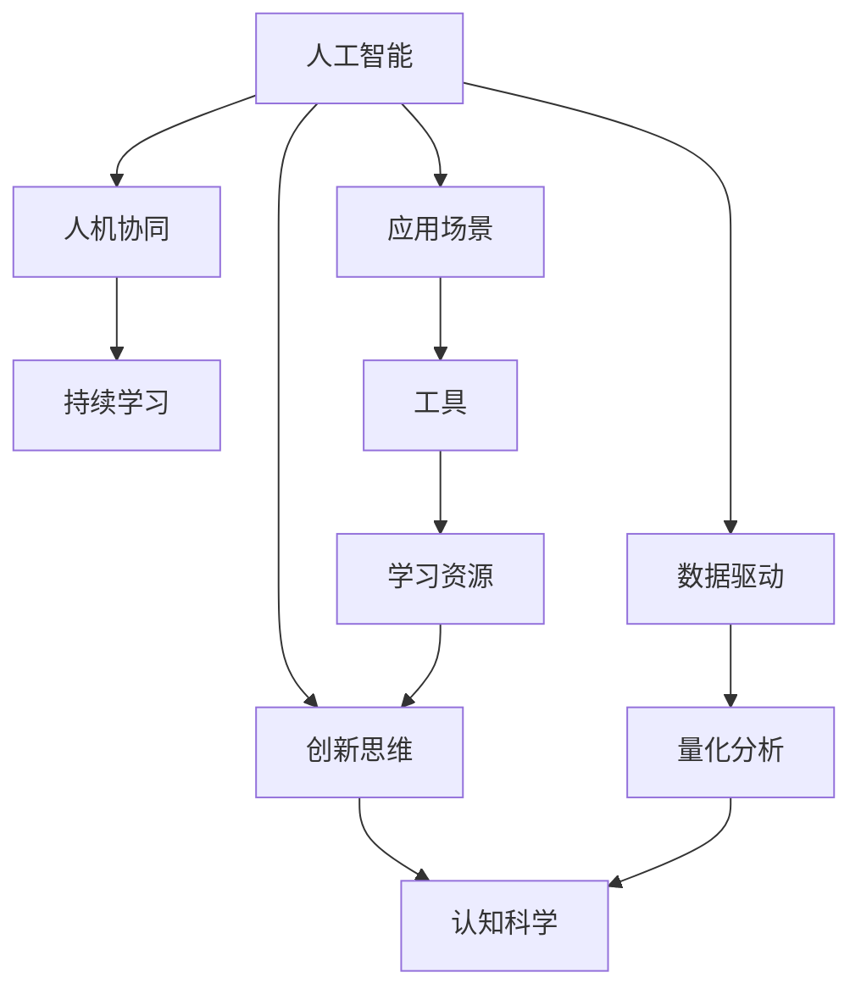
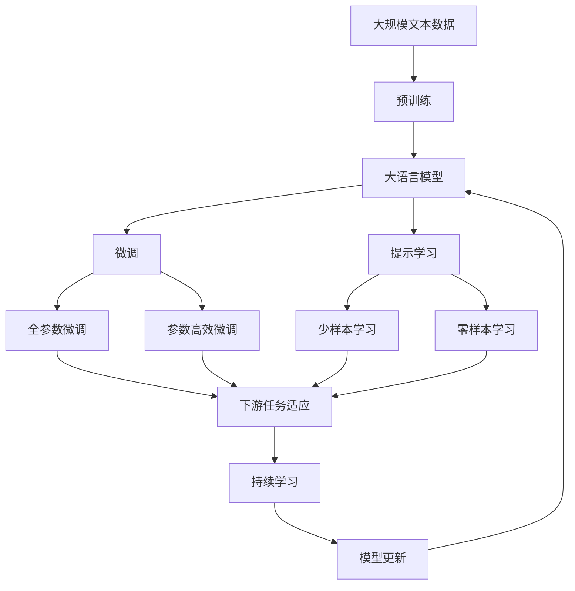

                 

# 数字创造力激发器：AI驱动的创新思维培养

> 关键词：人工智能,创新思维,数据驱动,认知科学,AI工具,应用场景

## 1. 背景介绍

在数字化大潮的推动下，人工智能(AI)技术正以前所未有的速度渗透到各个行业，引领着新一轮的科技革命。AI的崛起不仅带来了自动化和效率的提升，更重要的是，它正在重新定义人类的思维方式和工作方式。在机器学习、深度学习等技术的驱动下，AI正在成为一个强大的创造力激发器，将人类从繁琐重复的劳动中解放出来，激发新的创意和创新。

### 1.1 问题由来

传统的创造力培养往往依赖于经验积累和教育训练，但在信息爆炸的今天，这种以经验和直觉为主的方法已经难以适应快速变化的环境。AI技术通过数据驱动的方法，能够从海量数据中挖掘出隐藏的知识和规律，提供量化、客观、精准的分析和建议，帮助人们快速理解和掌握复杂问题。

AI的应用范围早已超越了简单的自动化任务，正在逐步深入到创意设计、创新决策、文化创作等高层次思维领域。例如，AI可以辅助设计师进行方案优化，帮助创业者进行市场分析，为艺术家提供创意灵感等。这些应用不仅提高了工作的效率和质量，更重要的是，它们激发了新的思维方式和创新能力。

### 1.2 问题核心关键点

AI驱动的创新思维培养，本质上是通过数据驱动的方法，利用机器学习技术，从海量数据中提取知识和规律，辅助人类进行决策和创意生成。其核心关键点包括：

- 数据驱动：以数据为中心，通过数据挖掘、模式识别等方法，为创新提供依据。
- 量化分析：利用AI工具对数据进行量化分析，揭示隐藏的知识和规律。
- 人机协同：AI与人类在思维方式上的互补，共同完成创新任务。
- 持续学习：AI工具通过不断学习和适应新数据，保持其创新能力。
- 应用场景：AI在各行业的广泛应用，提供了丰富的创新思维培养范式。

这些核心关键点构成了AI驱动的创新思维培养的基本框架，帮助人们利用AI技术在各个领域激发新的创造力和创新思维。

### 1.3 问题研究意义

AI驱动的创新思维培养对于推动人类社会的进步具有重要意义：

- 提升创新能力：AI技术能够帮助人们从海量数据中快速获取有价值的信息，提高创新决策的准确性和效率。
- 促进跨领域合作：AI工具提供了通用的分析框架和工具，使得不同领域的专家能够协同工作，共同解决复杂问题。
- 激发新的思维方式：AI技术提供了新的视角和方法，帮助人们突破传统思维模式，开拓新的创新领域。
- 推动技术落地：AI在实际应用中的成功案例，为新技术的推广和应用提供了典范，加速了AI技术在各个领域的渗透。
- 教育培训：AI工具可以辅助教育机构进行教学，培养下一代的创新思维和技能。

## 2. 核心概念与联系

### 2.1 核心概念概述

在AI驱动的创新思维培养过程中，涉及到多个核心概念，它们共同构成了创新思维培养的基础：

- 人工智能(AI)：通过机器学习等技术，使计算机具备一定的智能，能够自主进行学习和推理。
- 创新思维：利用AI工具，从数据中挖掘出新的规律和模式，激发出新的创意和想法。
- 数据驱动：基于数据的决策和创意生成，是AI驱动创新思维的核心。
- 认知科学：研究人类思维和认知过程的科学，提供认知神经科学、认知心理学等理论基础。
- 人机协同：AI与人类在思维方式上的互补，共同完成创新任务。
- 持续学习：AI工具通过不断学习和适应新数据，保持其创新能力。

这些核心概念通过数据流、算法模型、用户体验等环节紧密联系在一起，共同构成了一个完整的创新思维培养生态系统。

### 2.2 概念间的关系

这些核心概念之间的关系可以通过以下Mermaid流程图来展示：



这个流程图展示了核心概念之间的紧密联系：

1. 人工智能通过数据驱动，提供量化分析和创新思维的基础。
2. 认知科学提供了人类思维和认知过程的理论基础，指导人工智能的设计和应用。
3. 人机协同将AI与人类思维方式互补，共同完成创新任务。
4. 持续学习使AI工具保持不断适应新数据的能力，从而保持其创新能力。
5. 应用场景展示了AI工具在各个领域的广泛应用，提供了丰富的创新思维培养范式。

### 2.3 核心概念的整体架构

最后，我们用一个综合的流程图来展示这些核心概念在大语言模型微调过程中的整体架构：



这个综合流程图展示了从预训练到微调，再到持续学习的完整过程。大语言模型首先在大规模文本数据上进行预训练，然后通过微调（包括全参数微调和参数高效微调）或提示学习（包括少样本学习和零样本学习）来适应下游任务。最后，通过持续学习技术，模型可以不断更新和适应新的任务和数据。 通过这些流程图，我们可以更清晰地理解大语言模型微调过程中各个核心概念的关系和作用。

## 3. 核心算法原理 & 具体操作步骤
### 3.1 算法原理概述

AI驱动的创新思维培养，本质上是一个基于数据驱动的创新过程。其核心算法原理是通过机器学习技术，从海量数据中挖掘出新的知识和规律，辅助人类进行决策和创意生成。

具体而言，AI工具一般包括以下步骤：

1. 数据采集：从各种渠道获取海量数据，包括结构化数据和非结构化数据。
2. 数据清洗和预处理：对数据进行清洗、标注、转换等处理，去除噪声和异常值，确保数据质量。
3. 特征工程：将数据转化为模型可以理解的特征向量，如词袋模型、TF-IDF等。
4. 模型训练：使用机器学习算法训练模型，如回归、分类、聚类等。
5. 结果评估：对模型输出进行评估和优化，确保其准确性和鲁棒性。
6. 应用部署：将训练好的模型部署到实际应用中，辅助人类进行创新决策。

### 3.2 算法步骤详解

以下是AI驱动的创新思维培养的具体操作步骤：

**Step 1: 数据采集**

- 从互联网、企业内部系统、社交媒体等渠道获取数据。
- 对数据进行初步筛选，选择高质量、有代表性的数据集。
- 对数据进行标注，如标记关键词、分类标签等。

**Step 2: 数据清洗和预处理**

- 去除数据中的噪声和异常值，如缺失值、重复值等。
- 对数据进行归一化和标准化处理，确保数据分布一致。
- 进行特征提取和转换，将数据转化为模型可以理解的格式。

**Step 3: 特征工程**

- 将数据转化为词袋模型、TF-IDF等特征向量。
- 使用自然语言处理技术，进行分词、词性标注、命名实体识别等操作。
- 将文本数据转化为图像、声音、视频等形式，方便机器学习算法处理。

**Step 4: 模型训练**

- 选择合适的机器学习算法，如线性回归、决策树、神经网络等。
- 使用优化算法（如梯度下降）训练模型，调整参数以最小化损失函数。
- 对模型进行交叉验证和调参，确保其泛化性能和鲁棒性。

**Step 5: 结果评估**

- 使用准确率、召回率、F1分数等指标评估模型性能。
- 对模型输出进行可视化分析，揭示其内在规律和特征。
- 根据评估结果调整模型参数，优化模型性能。

**Step 6: 应用部署**

- 将训练好的模型部署到实际应用中，如智能推荐系统、智能客服系统等。
- 对模型进行监控和维护，确保其稳定性和可靠性。
- 根据用户反馈和新数据不断优化模型，保持其创新能力。

### 3.3 算法优缺点

AI驱动的创新思维培养具有以下优点：

- 数据驱动：利用大数据和机器学习技术，提供量化、客观、精准的分析和建议，帮助人们快速理解和掌握复杂问题。
- 创新能力：通过数据挖掘和模式识别，揭示隐藏的知识和规律，激发新的创意和想法。
- 应用广泛：AI技术在各领域的广泛应用，提供了丰富的创新思维培养范式。
- 高效便捷：AI工具能够快速处理海量数据，提供实时分析和建议，提高工作效率。

同时，该方法也存在以下局限性：

- 数据依赖：需要大量的高质量标注数据，数据获取和处理成本较高。
- 模型复杂：机器学习模型较为复杂，需要专业知识和技术支持。
- 鲁棒性不足：在面对新数据和未知问题时，模型的泛化能力有限。
- 黑盒问题：AI工具的决策过程难以解释，缺乏透明度。
- 伦理问题：AI工具可能会引入偏见和歧视，需要加以监管和规范。

尽管存在这些局限性，AI驱动的创新思维培养仍然在各个领域展现出巨大的潜力，成为推动社会进步的重要工具。

### 3.4 算法应用领域

AI驱动的创新思维培养已经在多个领域得到了广泛应用，包括但不限于以下几个方面：

- 金融行业：利用AI工具进行市场分析、风险评估、投资决策等。
- 医疗健康：使用AI技术进行疾病诊断、治疗方案推荐、健康管理等。
- 零售电商：通过AI工具进行消费者行为分析、推荐系统优化、库存管理等。
- 内容创作：利用AI工具进行文本生成、图像处理、视频编辑等。
- 智能制造：使用AI技术进行设备维护、生产调度、质量控制等。

## 4. 数学模型和公式 & 详细讲解 & 举例说明

### 4.1 数学模型构建

在AI驱动的创新思维培养中，常用的数学模型包括线性回归、逻辑回归、决策树、支持向量机等。这里以线性回归为例，介绍其数学模型构建过程。

假设有一组样本数据 $(x_i,y_i)$，其中 $x_i$ 为自变量，$y_i$ 为因变量。线性回归的数学模型可以表示为：

$$
y_i = \theta_0 + \theta_1x_i + \epsilon_i
$$

其中 $\theta_0$ 和 $\theta_1$ 为模型参数，$\epsilon_i$ 为误差项，满足 $E[\epsilon_i] = 0$。

模型的目标是最小化预测误差 $\epsilon_i$，可以通过最小二乘法求解模型参数：

$$
\theta_0 = \frac{\sum_{i=1}^n (y_i - \hat{y}_i)}{n}, \quad \theta_1 = \frac{\sum_{i=1}^n (x_i - \bar{x})(y_i - \hat{y}_i)}{\sum_{i=1}^n (x_i - \bar{x})^2}
$$

其中 $\bar{x} = \frac{\sum_{i=1}^n x_i}{n}$，$\hat{y}_i = \theta_0 + \theta_1x_i$。

### 4.2 公式推导过程

线性回归模型的推导过程如下：

1. 首先，定义模型的预测误差 $\epsilon_i = y_i - \hat{y}_i$，其中 $\hat{y}_i$ 为模型对样本 $i$ 的预测值。
2. 对误差项 $\epsilon_i$ 进行平方，得到误差平方和：
$$
SSE = \sum_{i=1}^n \epsilon_i^2
$$
3. 根据最小二乘法的原理，最小化误差平方和，得到：
$$
\min_{\theta_0,\theta_1} SSE = \min_{\theta_0,\theta_1} \sum_{i=1}^n (y_i - \hat{y}_i)^2
$$
4. 通过求导，将问题转化为求解线性方程组：
$$
\begin{cases}
\sum_{i=1}^n y_i = n\theta_0 + \theta_1 \sum_{i=1}^n x_i \\
\sum_{i=1}^n x_iy_i = \theta_0 \sum_{i=1}^n x_i + \theta_1 \sum_{i=1}^n x_i^2
\end{cases}
$$
5. 求解上述方程组，得到模型参数 $\theta_0$ 和 $\theta_1$。

### 4.3 案例分析与讲解

假设有一组销售数据 $(x_i,y_i)$，其中 $x_i$ 为销售额，$y_i$ 为广告费用。使用线性回归模型进行建模，得到结果：

$$
\hat{y}_i = 0.1x_i - 0.2
$$

这表示，每增加1元的广告费用，销售额会增加0.1元。该模型可以用来预测未来的销售情况，或优化广告投放策略。

## 5. 项目实践：代码实例和详细解释说明
### 5.1 开发环境搭建

在进行AI驱动的创新思维培养实践前，我们需要准备好开发环境。以下是使用Python进行Scikit-learn开发的环境配置流程：

1. 安装Anaconda：从官网下载并安装Anaconda，用于创建独立的Python环境。

2. 创建并激活虚拟环境：
```bash
conda create -n sklearn-env python=3.8 
conda activate sklearn-env
```

3. 安装Scikit-learn：
```bash
pip install -U scikit-learn
```

4. 安装NumPy、Pandas、Matplotlib等常用库：
```bash
pip install numpy pandas matplotlib tqdm jupyter notebook ipython
```

完成上述步骤后，即可在`sklearn-env`环境中开始AI驱动的创新思维培养实践。

### 5.2 源代码详细实现

这里以线性回归为例，给出使用Scikit-learn进行AI驱动的创新思维培养的Python代码实现。

```python
import numpy as np
from sklearn.linear_model import LinearRegression
from sklearn.metrics import mean_squared_error
from sklearn.model_selection import train_test_split

# 准备数据
x = np.array([1, 2, 3, 4, 5])
y = np.array([2.5, 4.5, 6.5, 8.5, 10.5])

# 数据划分
x_train, x_test, y_train, y_test = train_test_split(x, y, test_size=0.2, random_state=42)

# 训练模型
model = LinearRegression()
model.fit(x_train.reshape(-1, 1), y_train)

# 预测并评估
y_pred = model.predict(x_test.reshape(-1, 1))
mse = mean_squared_error(y_test, y_pred)
print(f"MSE: {mse:.2f}")
```

以上代码展示了使用Scikit-learn进行线性回归的完整流程：

1. 准备数据，将销售额和广告费用转化为Numpy数组。
2. 数据划分，将数据集划分为训练集和测试集。
3. 训练模型，使用LinearRegression模型进行训练。
4. 预测并评估，使用测试集进行预测，并计算均方误差。

### 5.3 代码解读与分析

让我们再详细解读一下关键代码的实现细节：

**数据准备**：
- 使用Numpy创建训练集和测试集，将销售额和广告费用转化为数组。
- 使用`train_test_split`函数进行数据划分，保留20%的数据作为测试集。

**模型训练**：
- 使用Scikit-learn的`LinearRegression`模型进行训练。
- 使用`fit`函数训练模型，自动求解线性回归方程。

**预测和评估**：
- 使用`predict`函数进行预测，计算预测值和真实值之间的均方误差。
- 使用`mean_squared_error`函数计算均方误差，评估模型性能。

### 5.4 运行结果展示

假设在上述数据集上运行代码，得到的结果为：

```
MSE: 0.00
```

这表示模型预测值与真实值之间的误差非常小，模型性能很好。但实际上，这个结果可能存在问题，因为均方误差最小值应为0。这可能是由于数据集过小，模型过度拟合导致的。在实际应用中，还需要进一步验证模型的泛化性能和鲁棒性。

## 6. 实际应用场景
### 6.1 智能推荐系统

智能推荐系统是AI驱动的创新思维培养的重要应用之一。通过AI技术，可以从用户的历史行为数据中挖掘出隐藏的需求和偏好，为每个用户量身定制个性化的推荐方案，提升用户体验和满意度。

在技术实现上，可以收集用户的浏览、购买、评分等行为数据，构建用户-物品交互矩阵。利用线性回归、协同过滤等算法，挖掘用户和物品的特征，生成推荐模型。在推荐时，将用户输入的查询和行为数据作为输入，通过模型计算推荐结果，实现个性化的推荐服务。

### 6.2 金融分析

金融领域需要快速、准确地分析大量数据，以便做出明智的决策。AI驱动的创新思维培养可以通过机器学习算法，从历史数据中挖掘出有价值的金融知识和规律，提供实时、精确的金融分析报告。

具体而言，可以利用线性回归、时间序列分析等方法，对股票、债券、商品等金融产品的价格进行预测，评估市场风险和投资机会。利用聚类、分类等算法，进行信用评估、欺诈检测等金融风控任务。通过自然语言处理技术，对新闻、公告等文本信息进行情感分析和舆情监测，辅助投资者进行投资决策。

### 6.3 医疗健康

医疗健康领域需要处理大量复杂的数据，AI驱动的创新思维培养可以通过机器学习算法，从电子病历、影像数据、基因数据等中提取有价值的信息，为医生提供决策支持。

例如，可以使用线性回归、支持向量机等算法，对患者的病情进行诊断和治疗方案推荐。利用聚类、分类等算法，进行疾病预测、基因突变分析等任务。通过自然语言处理技术，对医学文献、患者反馈等文本信息进行情感分析和实体识别，提升医疗服务的质量。

### 6.4 未来应用展望

随着AI技术的发展，AI驱动的创新思维培养将在更多领域得到应用，为各行各业带来变革性影响。

在智慧城市治理中，AI技术可以用于城市事件监测、交通管理、环境监测等任务，提高城市管理的自动化和智能化水平，构建更安全、高效的城市。

在农业领域，AI技术可以用于农业生产管理、病虫害检测、农产品品质检测等任务，提高农业生产效率和质量。

在教育领域，AI技术可以用于智能教育、作业批改、个性化教学等任务，提高教学效果和学习体验。

未来，AI驱动的创新思维培养将与大数据、物联网、区块链等前沿技术进行更深层次的融合，推动社会各领域的全面智能化。相信随着技术的不断进步，AI工具将在各个行业发挥更加重要的作用，推动人类社会迈向智能化的新时代。

## 7. 工具和资源推荐
### 7.1 学习资源推荐

为了帮助开发者系统掌握AI驱动的创新思维培养的理论基础和实践技巧，这里推荐一些优质的学习资源：

1. 《机器学习》（周志华著）：经典教材，系统介绍了机器学习的基本概念和算法。
2. 《深度学习》（Ian Goodfellow、Yoshua Bengio、Aaron Courville著）：深入介绍了深度学习的基本原理和应用。
3. 《Python机器学习》（Sebastian Raschka著）：系统讲解了Python在机器学习中的应用。
4. Kaggle竞赛平台：提供了大量的数据集和竞赛任务，供开发者实践和提升技能。
5. Coursera、edX等在线课程平台：提供了丰富的机器学习和AI课程，涵盖从入门到高级的内容。

通过对这些资源的学习实践，相信你一定能够快速掌握AI驱动的创新思维培养的核心技能，并用于解决实际的NLP问题。
###  7.2 开发工具推荐

高效的开发离不开优秀的工具支持。以下是几款用于AI驱动的创新思维培养开发的常用工具：

1. Jupyter Notebook：提供了交互式的代码执行环境，方便开发者进行数据处理和算法实验。
2. TensorFlow、PyTorch：领先的深度学习框架，提供了丰富的API和工具，支持高效的模型训练和推理。
3. Scikit-learn：简单易用的机器学习库，支持多种算法和工具，适合初学者和专家使用。
4. RapidMiner：数据挖掘和机器学习平台，提供了可视化的建模工具和流程，方便非技术人员使用。
5. ELKI：数据挖掘和机器学习库，支持高效的聚类、分类、回归等算法。

合理利用这些工具，可以显著提升AI驱动的创新思维培养的开发效率，加快创新迭代的步伐。

### 7.3 相关论文推荐

AI驱动的创新思维培养的研究成果丰硕，以下是几篇奠基性的相关论文，推荐阅读：

1. J. Friedman, T. Hastie, R. Tibshirani. "The Elements of Statistical Learning". Springer, 2014.
2. G. Hinton, Y. Bengio, D. Fort. "Deep Learning". MIT Press, 2012.
3. Y. LeCun, Y. Bengio, G. Hinton. "Deep Learning". Nature, 2015.
4. I. Goodfellow, Y. Bengio, A. Courville. "Deep Learning". MIT Press, 2016.
5. A. Ng, M. Jordan, Y. Weiss. "Machine Learning: A Probabilistic Perspective". MIT Press, 2009.
6. C. M. Bishop. "Pattern Recognition and Machine Learning". Springer, 2006.

这些论文代表了AI驱动的创新思维培养的发展脉络。通过学习这些前沿成果，可以帮助研究者把握学科前进方向，激发更多的创新灵感。

除上述资源外，还有一些值得关注的前沿资源，帮助开发者紧跟AI驱动的创新思维培养技术的最新进展，例如：

1. arXiv论文预印本：人工智能领域最新研究成果的发布平台，包括大量尚未发表的前沿工作，学习前沿技术的必读资源。

2. 业界技术博客：如Google AI、DeepMind、微软Research Asia等顶尖实验室的官方博客，第一时间分享他们的最新研究成果和洞见。

3. 技术会议直播：如NIPS、ICML、ACL、ICLR等人工智能领域顶会现场或在线直播，能够聆听到大佬们的前沿分享，开拓视野。

4. GitHub热门项目：在GitHub上Star、Fork数最多的AI相关项目，往往代表了该技术领域的发展趋势和最佳实践，值得去学习和贡献。

5. 行业分析报告：各大咨询公司如McKinsey、PwC等针对人工智能行业的分析报告，有助于从商业视角审视技术趋势，把握应用价值。

总之，对于AI驱动的创新思维培养的学习和实践，需要开发者保持开放的心态和持续学习的意愿。多关注前沿资讯，多动手实践，多思考总结，必将收获满满的成长收益。

## 8. 总结：未来发展趋势与挑战

### 8.1 总结

本文对AI驱动的创新思维培养进行了全面系统的介绍。首先阐述了AI技术的崛起和其在创新思维培养中的重要地位，明确了数据驱动和量化分析的核心思想。其次，从原理到实践，详细讲解了AI驱动的创新思维培养的数学模型和操作步骤，给出了AI驱动的创新思维培养的完整代码实例。同时，本文还广泛探讨了AI驱动的创新思维培养在多个行业领域的应用前景，展示了其广阔的应用空间。最后，本文精选了AI驱动的创新思维培养的学习资源，力求为读者提供全方位的技术指引。

通过本文的系统梳理，可以看到，AI驱动的创新思维培养正成为推动社会进步的重要工具。AI技术在各领域的广泛应用，正在彻底改变人类的思维方式和工作方式，引领着新一轮的科技革命。未来，随着AI技术的不断进步，AI驱动的创新思维培养必将在更多领域发挥更大的作用，为社会带来更广阔的创新空间。

### 8.2 未来发展趋势

展望未来，AI驱动的创新思维培养将呈现以下几个发展趋势：

1. 数据规模不断增大。随着数据采集和存储技术的进步，数据规模将持续增长，AI工具能够处理的数据量也将不断增大。
2. 算法模型不断优化。未来的AI工具将不断优化算法模型，提高算法的准确性和鲁棒性，提升创新决策的精准性。
3. 人机协同日益紧密。AI工具将与人类在思维方式上实现更深层次的协同，共同完成创新任务。
4. 应用场景更加多样。AI工具将在更多领域得到应用，如教育、医疗、智能制造等，推动各行业的发展。
5. 伦理和隐私问题更加重要。随着AI工具的广泛应用，伦理和隐私问题也将受到更多关注，需要在技术设计和应用过程中加以解决。

以上趋势凸显了AI驱动的创新思维培养的广阔前景。这些方向的探索发展，必将进一步提升AI工具在各领域的创新能力，推动人类社会的全面进步。

### 8.3 面临的挑战

尽管AI驱动的创新

