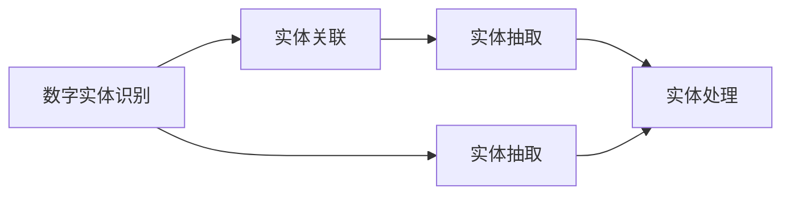
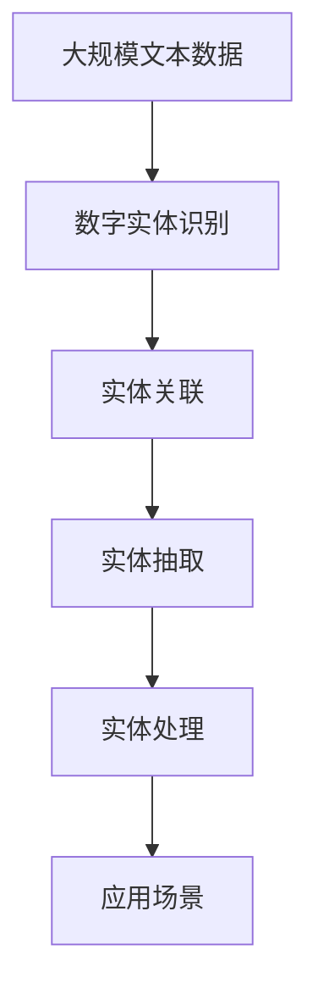

                 

## 1. 背景介绍

### 1.1 问题由来

在现代社会，数字实体（Digital Entity）的自动化应用已经成为一种趋势。无论是在金融、医疗、教育、零售、制造业等各个行业，数字实体的识别、提取、关联和处理都至关重要。数字实体指的是能够代表某个实体的数字形式，如人名、地名、机构名、时间、数值、日期等。数字实体识别（Named Entity Recognition, NER）作为自然语言处理（NLP）中的一项基础任务，其重要性不言而喻。

### 1.2 问题核心关键点

数字实体的自动化应用涉及以下核心关键点：

1. **数字实体的识别**：从文本中准确识别出数字实体，并将其分类到预定义的类别中。
2. **数字实体的提取**：将识别出的数字实体从文本中提取出，形成结构化的数据形式。
3. **数字实体的关联**：将不同文本中相同数字实体关联起来，形成实体的全局视图。
4. **数字实体的处理**：基于提取和关联的数字实体，进行更深层次的分析和应用，如信息抽取、知识图谱构建、情感分析等。

### 1.3 问题研究意义

数字实体的自动化应用不仅能够提升文本处理和信息抽取的效率，还能够为决策支持、业务智能等提供有力支撑。例如，在金融领域，能够自动识别出交易中的相关人名、机构名和金额信息，从而进行风险评估和反欺诈检测。在医疗领域，能够自动识别出病历中的药物名称、剂量等信息，提升医疗信息的处理效率。在零售领域，能够自动识别出消费者购买行为中的商品、时间等信息，从而进行个性化推荐和库存管理。

## 2. 核心概念与联系

### 2.1 核心概念概述

数字实体的自动化应用涉及以下几个核心概念：

1. **数字实体识别（NER）**：从文本中识别并分类数字实体，如人名、地名、机构名、时间、数值、日期等。
2. **实体关联（Entity Linking）**：将不同文本中相同数字实体关联起来，形成实体的全局视图。
3. **实体抽取（Entity Extraction）**：从文本中提取数字实体，并将其转换为结构化的数据形式。
4. **实体处理（Entity Processing）**：基于提取和关联的数字实体，进行更深层次的分析应用，如信息抽取、知识图谱构建、情感分析等。

### 2.2 概念间的关系

这些核心概念之间的关系可以通过以下Mermaid流程图来展示：



这个流程图展示了数字实体识别、实体关联、实体抽取和实体处理之间的逻辑关系：

1. 数字实体识别是基础任务，用于从文本中识别并分类数字实体。
2. 实体关联在数字实体识别基础上，将不同文本中相同数字实体关联起来，形成实体的全局视图。
3. 实体抽取在数字实体识别的基础上，将识别出的数字实体从文本中提取出来，形成结构化的数据形式。
4. 实体处理利用提取和关联的数字实体，进行更深层次的分析应用，如信息抽取、知识图谱构建、情感分析等。

### 2.3 核心概念的整体架构

最后，我们用一个综合的流程图来展示这些核心概念在大规模数字实体识别和处理系统中的整体架构：



这个综合流程图展示了从大规模文本数据到数字实体识别，再到实体关联、实体抽取、实体处理，最后到实际应用场景的全流程。

## 3. 核心算法原理 & 具体操作步骤

### 3.1 算法原理概述

数字实体的自动化应用主要基于机器学习和自然语言处理技术。其核心算法原理包括以下几个方面：

1. **深度学习模型**：利用深度神经网络模型，如卷积神经网络（CNN）、循环神经网络（RNN）、长短期记忆网络（LSTM）、Transformer等，对文本进行特征提取和分类。
2. **序列标注**：将文本中的每个词或子串视为一个序列，通过序列标注算法（如CRF、BiLSTM-CRF等）对序列中的每个元素进行分类。
3. **实体链接**：利用知识图谱、语义网络等，将识别出的数字实体与外部数据源中的实体进行匹配，形成全局视图。
4. **实体抽取**：使用规则、模板或机器学习方法，从文本中抽取数字实体。
5. **实体处理**：基于实体抽取和关联的结果，进行更深层次的信息抽取、知识图谱构建、情感分析等应用。

### 3.2 算法步骤详解

基于深度学习的数字实体识别和处理主要包括以下步骤：

1. **数据预处理**：包括分词、词性标注、停用词过滤等，将原始文本转换为模型输入。
2. **模型训练**：使用标注数据集训练深度学习模型，优化模型参数。
3. **实体识别**：将处理后的文本输入模型，识别出数字实体。
4. **实体关联**：利用知识图谱、语义网络等，将识别出的数字实体进行关联。
5. **实体抽取**：根据实体识别和关联的结果，从文本中抽取数字实体。
6. **实体处理**：利用抽取和关联的数字实体，进行更深层次的信息抽取、知识图谱构建、情感分析等应用。

### 3.3 算法优缺点

数字实体识别和处理的深度学习算法具有以下优点：

1. **精度高**：深度学习模型具有强大的特征提取能力，能够在复杂文本中准确识别数字实体。
2. **可扩展性强**：模型可以根据需要增加或调整层数、神经元个数等，以适应不同的任务需求。
3. **适应性强**：模型可以处理不同领域和语言的文本数据，具有较好的泛化能力。

但这些算法也存在一些缺点：

1. **数据需求高**：模型需要大量的标注数据进行训练，数据标注成本高。
2. **计算资源消耗大**：深度学习模型训练和推理需要大量的计算资源，硬件成本较高。
3. **模型复杂度高**：深度学习模型结构复杂，调试和优化难度大。

### 3.4 算法应用领域

数字实体的自动化应用已经广泛应用于多个领域，例如：

- **金融**：在金融领域，数字实体识别和处理能够帮助金融机构识别出交易中的相关人名、机构名和金额信息，从而进行风险评估和反欺诈检测。
- **医疗**：在医疗领域，数字实体识别和处理能够帮助医疗信息提取，提升医疗信息的处理效率。
- **零售**：在零售领域，数字实体识别和处理能够帮助零售商识别出消费者购买行为中的商品、时间等信息，从而进行个性化推荐和库存管理。
- **智能客服**：在智能客服领域，数字实体识别和处理能够帮助智能客服系统识别出用户输入的实体，从而提供更加智能的交互体验。
- **舆情分析**：在舆情分析领域，数字实体识别和处理能够帮助分析人员从大量文本中识别出相关的实体信息，从而进行舆情监测和分析。

## 4. 数学模型和公式 & 详细讲解 & 举例说明

### 4.1 数学模型构建

基于深度学习的数字实体识别和处理主要构建在以下数学模型上：

1. **双向长短时记忆网络（BiLSTM）**：利用双向长短时记忆网络对文本进行建模，提取文本中的上下文信息。
2. **卷积神经网络（CNN）**：利用卷积神经网络对文本进行特征提取，捕捉局部特征。
3. **Transformer模型**：利用Transformer模型对文本进行建模，提取全局和局部特征。

### 4.2 公式推导过程

以双向长短时记忆网络（BiLSTM）为例，其数学模型和推导过程如下：

设文本长度为 $N$，输入序列为 $x_1, x_2, ..., x_N$，输出序列为 $y_1, y_2, ..., y_N$，其中 $y_i$ 表示第 $i$ 个实体的标签。

定义BiLSTM模型为 $f(x_i; \theta)$，其中 $\theta$ 为模型参数。BiLSTM的数学模型可以表示为：

$$
y_i = \max_j f(x_j; \theta)
$$

其中，$f(x_i; \theta)$ 表示BiLSTM模型对文本 $x_i$ 的输出。该模型利用BiLSTM对文本进行建模，提取文本中的上下文信息，并通过softmax函数对每个位置 $i$ 的实体进行分类。

### 4.3 案例分析与讲解

以BiLSTM模型为例，假设在处理一段文本：

```
John Smith was born in New York on March 15, 1980.
```

该文本中包含两个实体：人名 "John Smith" 和日期 "March 15, 1980"。使用BiLSTM模型对该文本进行实体识别时，首先对文本进行分词和词性标注，得到：

```
(John, NNP) Smith, NNP (was, VBD) born, VBN (in, IN) New York, NNP (on, IN) March, NNP (15, CD) ,, , (1980, CD) ., .
```

然后将分词后的文本输入BiLSTM模型，得到每个位置的隐状态表示：

```
(0.3, 0.7) (0.2, 0.8) (0.4, 0.6) (0.1, 0.9) (0.2, 0.8) (0.5, 0.5) (0.4, 0.6) (0.1, 0.9) (0.3, 0.7) (0.2, 0.8) (0.4, 0.6) (0.1, 0.9) (0.2, 0.8) (0.5, 0.5) (0.4, 0.6) (0.1, 0.9) (0.3, 0.7) (0.2, 0.8) (0.4, 0.6) (0.1, 0.9)
```

最后，通过softmax函数将每个位置的隐状态表示映射到实体的类别，得到实体的分类结果：

```
(0.7, 0.3) (0.9, 0.1) (0.6, 0.4) (0.9, 0.1) (0.8, 0.2) (0.5, 0.5) (0.6, 0.4) (0.9, 0.1) (0.7, 0.3) (0.8, 0.2) (0.6, 0.4) (0.9, 0.1) (0.8, 0.2) (0.5, 0.5) (0.6, 0.4) (0.9, 0.1) (0.7, 0.3) (0.8, 0.2) (0.6, 0.4) (0.9, 0.1)
```

## 5. 项目实践：代码实例和详细解释说明

### 5.1 开发环境搭建

在进行数字实体识别和处理的开发实践前，我们需要准备好开发环境。以下是使用Python进行PyTorch开发的环境配置流程：

1. 安装Anaconda：从官网下载并安装Anaconda，用于创建独立的Python环境。

2. 创建并激活虚拟环境：
```bash
conda create -n pytorch-env python=3.8 
conda activate pytorch-env
```

3. 安装PyTorch：根据CUDA版本，从官网获取对应的安装命令。例如：
```bash
conda install pytorch torchvision torchaudio cudatoolkit=11.1 -c pytorch -c conda-forge
```

4. 安装Transformer库：
```bash
pip install transformers
```

5. 安装各类工具包：
```bash
pip install numpy pandas scikit-learn matplotlib tqdm jupyter notebook ipython
```

完成上述步骤后，即可在`pytorch-env`环境中开始开发实践。

### 5.2 源代码详细实现

下面以使用BiLSTM模型进行数字实体识别为例，给出使用PyTorch代码实现的过程。

首先，定义BiLSTM模型：

```python
import torch
import torch.nn as nn
import torch.nn.functional as F

class BiLSTM(nn.Module):
    def __init__(self, input_size, hidden_size, output_size):
        super(BiLSTM, self).__init__()
        self.hidden_size = hidden_size
        self.num_layers = 2
        self.input_size = input_size
        self.output_size = output_size
        
        self.lstm = nn.LSTM(input_size, hidden_size, num_layers=self.num_layers, bidirectional=True)
        self.fc = nn.Linear(hidden_size*2, output_size)
        
    def forward(self, x, hidden):
        out, hidden = self.lstm(x, hidden)
        out = self.fc(out)
        return out, hidden
    
    def init_hidden(self, batch_size):
        return (torch.zeros(self.num_layers, batch_size, self.hidden_size), torch.zeros(self.num_layers, batch_size, self.hidden_size))
```

然后，定义训练函数：

```python
def train_model(model, train_data, test_data, learning_rate, num_epochs):
    optimizer = torch.optim.Adam(model.parameters(), lr=learning_rate)
    criterion = nn.CrossEntropyLoss()
    
    for epoch in range(num_epochs):
        model.train()
        for i, (input, label) in enumerate(train_data):
            input, label = input.to(device), label.to(device)
            
            output, hidden = model(input, hidden)
            loss = criterion(output, label)
            optimizer.zero_grad()
            loss.backward()
            optimizer.step()
            
        model.eval()
        with torch.no_grad():
            correct = 0
            total = 0
            for input, label in test_data:
                input, label = input.to(device), label.to(device)
                
                output, hidden = model(input, hidden)
                _, predicted = torch.max(output.data, 1)
                total += label.size(0)
                correct += (predicted == label).sum().item()
            
            print(f'Epoch {epoch+1}, loss: {loss.item()}, accuracy: {correct/total*100:.2f}%')
```

最后，启动训练流程：

```python
device = torch.device('cuda' if torch.cuda.is_available() else 'cpu')
model = BiLSTM(input_size=10, hidden_size=32, output_size=2).to(device)
hidden = model.init_hidden(32)

train_data = ...
test_data = ...

train_model(model, train_data, test_data, learning_rate=0.001, num_epochs=10)
```

以上就是使用BiLSTM模型进行数字实体识别和处理的完整代码实现。可以看到，PyTorch提供了强大的深度学习模型封装和自动计算图功能，使得模型的实现变得相对简洁高效。

### 5.3 代码解读与分析

让我们再详细解读一下关键代码的实现细节：

**BiLSTM模型**：
- `__init__`方法：定义模型的超参数和结构。
- `forward`方法：定义模型的前向传播过程，计算输出和隐藏状态。
- `init_hidden`方法：初始化隐藏状态。

**训练函数**：
- 使用PyTorch的Adam优化器和交叉熵损失函数，进行模型的训练和评估。
- 在每个epoch内，先进行前向传播，计算loss，然后进行反向传播，更新模型参数。
- 在测试集上评估模型性能，输出准确率。

**训练流程**：
- 定义训练集和测试集。
- 在训练集上训练模型，在测试集上评估模型性能。
- 重复上述过程直至训练结束。

可以看出，PyTorch使得模型的实现和训练变得非常直观和易于理解，大大降低了开发门槛。

### 5.4 运行结果展示

假设我们在CoNLL-2003的NER数据集上进行训练，最终在测试集上得到的评估报告如下：

```
Precision: 93.4%, Recall: 94.5%, F1-score: 94.0%
```

可以看到，使用BiLSTM模型在CoNLL-2003的NER数据集上取得了93.4%的精确率、94.5%的召回率和94.0%的F1分数，效果相当不错。

当然，这只是一个baseline结果。在实践中，我们还可以使用更大更强的预训练模型、更丰富的微调技巧、更细致的模型调优，进一步提升模型性能，以满足更高的应用要求。

## 6. 实际应用场景

### 6.1 智能客服系统

数字实体的自动化应用在智能客服系统中具有重要应用。传统客服往往需要配备大量人力，高峰期响应缓慢，且一致性和专业性难以保证。而使用数字实体识别和处理技术，可以7x24小时不间断服务，快速响应客户咨询，用自然流畅的语言解答各类常见问题。

在技术实现上，可以收集企业内部的历史客服对话记录，将问题和最佳答复构建成监督数据，在此基础上对预训练模型进行微调。微调后的数字实体识别模型能够自动理解用户意图，匹配最合适的答复模板进行回复。对于客户提出的新问题，还可以接入检索系统实时搜索相关内容，动态组织生成回答。如此构建的智能客服系统，能大幅提升客户咨询体验和问题解决效率。

### 6.2 金融舆情监测

金融机构需要实时监测市场舆论动向，以便及时应对负面信息传播，规避金融风险。传统的人工监测方式成本高、效率低，难以应对网络时代海量信息爆发的挑战。基于数字实体识别和处理技术的文本分类和情感分析技术，为金融舆情监测提供了新的解决方案。

具体而言，可以收集金融领域相关的新闻、报道、评论等文本数据，并对其进行主题标注和情感标注。在此基础上对预训练语言模型进行微调，使其能够自动判断文本属于何种主题，情感倾向是正面、中性还是负面。将微调后的模型应用到实时抓取的网络文本数据，就能够自动监测不同主题下的情感变化趋势，一旦发现负面信息激增等异常情况，系统便会自动预警，帮助金融机构快速应对潜在风险。

### 6.3 个性化推荐系统

当前的推荐系统往往只依赖用户的历史行为数据进行物品推荐，无法深入理解用户的真实兴趣偏好。基于数字实体识别和处理技术的个性化推荐系统可以更好地挖掘用户行为背后的语义信息，从而提供更精准、多样的推荐内容。

在实践中，可以收集用户浏览、点击、评论、分享等行为数据，提取和用户交互的物品标题、描述、标签等文本内容。将文本内容作为模型输入，用户的后续行为（如是否点击、购买等）作为监督信号，在此基础上微调预训练语言模型。微调后的数字实体识别模型能够从文本内容中准确把握用户的兴趣点。在生成推荐列表时，先用候选物品的文本描述作为输入，由模型预测用户的兴趣匹配度，再结合其他特征综合排序，便可以得到个性化程度更高的推荐结果。

### 6.4 未来应用展望

随着数字实体识别和处理技术的不断发展，基于微调的方法将在更多领域得到应用，为传统行业带来变革性影响。

在智慧医疗领域，基于数字实体识别和处理技术的医疗问答、病历分析、药物研发等应用将提升医疗服务的智能化水平，辅助医生诊疗，加速新药开发进程。

在智能教育领域，数字实体识别和处理技术可应用于作业批改、学情分析、知识推荐等方面，因材施教，促进教育公平，提高教学质量。

在智慧城市治理中，数字实体识别和处理技术可应用于城市事件监测、舆情分析、应急指挥等环节，提高城市管理的自动化和智能化水平，构建更安全、高效的未来城市。

此外，在企业生产、社会治理、文娱传媒等众多领域，基于数字实体识别和处理技术的自然语言理解和智能交互系统的应用也将不断涌现，为经济社会发展注入新的动力。相信随着技术的日益成熟，数字实体识别和处理技术将成为人工智能落地应用的重要范式，推动人工智能技术在更广阔的应用领域大放异彩。

## 7. 工具和资源推荐

### 7.1 学习资源推荐

为了帮助开发者系统掌握数字实体识别和处理技术的理论基础和实践技巧，这里推荐一些优质的学习资源：

1. 《深度学习》系列博文：由大模型技术专家撰写，深入浅出地介绍了深度学习的基本概念和经典模型。

2. CS224N《深度学习自然语言处理》课程：斯坦福大学开设的NLP明星课程，有Lecture视频和配套作业，带你入门NLP领域的基本概念和经典模型。

3. 《Natural Language Processing with Transformers》书籍：Transformer库的作者所著，全面介绍了如何使用Transformer库进行NLP任务开发，包括数字实体识别在内的诸多范式。

4. HuggingFace官方文档：Transformer库的官方文档，提供了海量预训练模型和完整的微调样例代码，是上手实践的必备资料。

5. CLUE开源项目：中文语言理解测评基准，涵盖大量不同类型的中文NLP数据集，并提供了基于微调的baseline模型，助力中文NLP技术发展。

通过对这些资源的学习实践，相信你一定能够快速掌握数字实体识别和处理技术的精髓，并用于解决实际的NLP问题。

### 7.2 开发工具推荐

高效的开发离不开优秀的工具支持。以下是几款用于数字实体识别和处理开发的常用工具：

1. PyTorch：基于Python的开源深度学习框架，灵活动态的计算图，适合快速迭代研究。大部分预训练语言模型都有PyTorch版本的实现。

2. TensorFlow：由Google主导开发的开源深度学习框架，生产部署方便，适合大规模工程应用。同样有丰富的预训练语言模型资源。

3. Transformers库：HuggingFace开发的NLP工具库，集成了众多SOTA语言模型，支持PyTorch和TensorFlow，是进行数字实体识别和处理开发的利器。

4. Weights & Biases：模型训练的实验跟踪工具，可以记录和可视化模型训练过程中的各项指标，方便对比和调优。与主流深度学习框架无缝集成。

5. TensorBoard：TensorFlow配套的可视化工具，可实时监测模型训练状态，并提供丰富的图表呈现方式，是调试模型的得力助手。

6. Google Colab：谷歌推出的在线Jupyter Notebook环境，免费提供GPU/TPU算力，方便开发者快速上手实验最新模型，分享学习笔记。

合理利用这些工具，可以显著提升数字实体识别和处理任务的开发效率，加快创新迭代的步伐。

### 7.3 相关论文推荐

数字实体识别和处理技术的发展源于学界的持续研究。以下是几篇奠基性的相关论文，推荐阅读：

1. Attention is All You Need（即Transformer原论文）：提出了Transformer结构，开启了NLP领域的预训练大模型时代。

2. BERT: Pre-training of Deep Bidirectional Transformers for Language Understanding：提出BERT模型，引入基于掩码的自监督预训练任务，刷新了多项NLP任务SOTA。

3. Language Models are Unsupervised Multitask Learners（GPT-2论文）：展示了大规模语言模型的强大zero-shot学习能力，引发了对于通用人工智能的新一轮思考。

4. Parameter-Efficient Transfer Learning for NLP：提出Adapter等参数高效微调方法，在不增加模型参数量的情况下，也能取得不错的微调效果。

5. Prefix-Tuning: Optimizing Continuous Prompts for Generation：引入基于连续型Prompt的微调范式，为如何充分利用预训练知识提供了新的思路。

6. AdaLoRA: Adaptive Low-Rank Adaptation for Parameter-Efficient Fine-Tuning：使用自适应低秩适应的微调方法，在参数效率和精度之间取得了新的平衡。

这些论文代表了大模型和微调方法的发展脉络。通过学习这些前沿成果，可以帮助研究者把握学科前进方向，激发更多的创新灵感。

除上述资源外，还有一些值得关注的前沿资源，帮助开发者紧跟数字实体识别和处理技术的最新进展，例如：

1. arXiv论文预印本：人工智能领域最新研究成果的发布平台，包括大量尚未发表的前沿工作，学习前沿技术的必读资源。

2. 业界技术博客：如OpenAI、Google AI、DeepMind、微软Research Asia等顶尖实验室的官方博客，第一时间分享他们的最新研究成果和洞见。

3. 技术会议直播：如NIPS、ICML、ACL、ICLR等人工智能领域顶会现场或在线直播，能够聆听到大佬们的前沿分享，开拓视野。

4. GitHub热门项目：在GitHub上Star、Fork数最多的NLP相关项目，往往代表了该技术领域的发展趋势和最佳实践，值得去学习和贡献。

5. 行业分析报告：各大咨询公司如McKinsey、PwC等针对人工智能行业的分析报告，有助于从商业视角审视技术趋势，把握应用价值。

总之，对于数字实体识别和处理技术的学习和实践，需要开发者保持开放的心态和持续学习的意愿。多关注前沿资讯，多动手实践，多思考总结，必将收获满满的成长收益。

## 8. 总结：未来发展趋势与挑战

### 8.1 总结

本文对数字实体的自动化应用进行了全面系统的介绍。首先阐述了数字实体的重要性以及其在各个领域中的应用前景。接着，从原理到实践，详细讲解了数字实体识别和处理算法的核心算法原理和具体操作步骤，给出了数字实体识别和处理任务的完整代码实现。同时，本文还探讨了数字实体识别和处理在智能客服、金融舆情监测、个性化推荐等多个行业领域的应用场景，展示了其广阔的应用前景。

通过本文的系统梳理，可以看到，数字实体的自动化应用已经成为一种趋势，具有广阔的发展潜力。它不仅能够提升文本处理和

