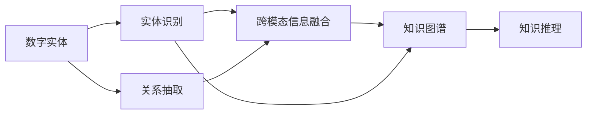
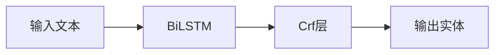

                 

## 1. 背景介绍

在当今数字化时代，数字实体（Digital Entities）在众多领域扮演着至关重要的角色。数字实体是指那些通过数字化方式存在的物理或虚拟对象，例如，数据库中的用户信息、社交网络上的用户账号、物联网中的传感器数据等。它们的数量和种类每天都在增长，如何有效管理和自动化处理这些数字实体，已经成为企业和科研机构的重要挑战。

数字实体的自动化处理涉及数据清洗、信息提取、实体识别、关系抽取等多个环节。这一过程不仅需要高度自动化的算法和模型，还需要跨领域的数据融合与分析技术。近年来，随着深度学习技术的迅猛发展，数字实体的自动化处理已经取得了显著进展。本文将探讨数字实体自动化的最新方向，包括数据驱动的实体识别、基于知识图谱的关系抽取、跨模态信息融合以及联邦学习等前沿技术。

## 2. 核心概念与联系

### 2.1 核心概念概述

要深入理解数字实体自动化的最新方向，首先需要了解一些核心概念：

- **数字实体（Digital Entities）**：指通过数字化方式存在的物理或虚拟对象，包括但不限于用户信息、物联网传感器数据、金融交易记录等。

- **实体识别（Entity Recognition）**：指从文本、图像等数据中自动识别出具有特定意义的实体，如人名、地名、组织名等。

- **关系抽取（Relation Extraction）**：指从文本中提取出实体之间的关系，如“约翰是比尔的同事”。

- **跨模态信息融合（Cross-modal Information Fusion）**：指将不同模态的数据（如图像、文本、语音等）进行融合，以获得更全面的信息。

- **联邦学习（Federated Learning）**：指在多个本地设备上训练模型，但数据不集中存储，从而保护用户隐私。

- **知识图谱（Knowledge Graph）**：指使用图结构表示的知识库，用于存储和推理实体及其关系。

### 2.2 核心概念的联系

这些概念之间相互关联，共同构成了数字实体自动化的完整框架。实体识别和关系抽取是数字实体自动化的基础环节，通过它们可以提取出数字实体及其关系。跨模态信息融合可以进一步丰富实体的描述，提高实体识别的准确性。联邦学习则保证了数据隐私，使得数据无需集中存储即可进行模型训练。知识图谱则提供了实体及其关系的高层次结构，用于知识推理和应用。

以下是一个Mermaid流程图，展示数字实体自动化的核心概念及其联系：



在这个框架中，数字实体首先经过实体识别和关系抽取，得到基本的实体及其关系。然后，通过跨模态信息融合，将不同模态的信息进行整合，进一步提升实体识别的准确性和全面性。最后，知识图谱作为高层次的结构，用于存储和推理实体及其关系。

## 3. 核心算法原理 & 具体操作步骤

### 3.1 算法原理概述

数字实体自动化的核心算法原理可以概括为：

- **实体识别**：使用深度学习模型（如CRF、BiLSTM-CRF等）对文本进行标注，识别出实体及其边界。

- **关系抽取**：利用深度学习模型（如RNN、CNN、Transformer等）对文本进行序列标注，抽取实体之间的关系。

- **跨模态信息融合**：通过深度学习模型（如Siamese Network、Transformers等）将不同模态的信息进行融合，生成更丰富的特征。

- **联邦学习**：在多个本地设备上分布式训练模型，每个设备只上传模型参数，不泄露数据。

- **知识图谱构建**：使用图神经网络（GNN）等方法，从实体及其关系中构建知识图谱，并用于知识推理。

### 3.2 算法步骤详解

以下是对数字实体自动化核心算法步骤的详细说明：

**实体识别**：

1. 数据准备：收集文本数据，并进行预处理，如分词、去除停用词等。
2. 模型选择：选择适当的深度学习模型，如BiLSTM-CRF。
3. 训练：使用标注数据训练模型，并调整超参数。
4. 预测：对新文本数据进行实体识别，输出实体及其边界。

**关系抽取**：

1. 数据准备：收集文本数据，并进行预处理，如分词、去除停用词等。
2. 模型选择：选择适当的深度学习模型，如CNN、Transformer。
3. 训练：使用标注数据训练模型，并调整超参数。
4. 预测：对新文本数据进行关系抽取，输出实体之间的关系。

**跨模态信息融合**：

1. 数据准备：收集不同模态的数据，并进行预处理。
2. 特征提取：使用深度学习模型对不同模态的数据进行特征提取。
3. 融合：使用Siamese Network、Transformers等方法将不同模态的特征进行融合。
4. 预测：对融合后的特征进行模型预测，输出更全面的实体描述。

**联邦学习**：

1. 数据准备：收集本地设备上的数据，并进行预处理。
2. 模型训练：在本地设备上训练模型，并使用联邦学习框架进行分布式训练。
3. 模型聚合：使用联邦学习框架聚合各设备上的模型参数，更新全局模型。
4. 预测：使用全局模型进行实体识别、关系抽取等预测。

**知识图谱构建**：

1. 数据准备：收集实体及其关系的数据，并进行预处理。
2. 图神经网络训练：使用GNN等方法训练知识图谱模型，构建知识图谱。
3. 推理：使用知识图谱进行实体关系推理，支持智能决策和应用。

### 3.3 算法优缺点

数字实体自动化的核心算法有以下优点和缺点：

**优点**：

- **自动化程度高**：使用深度学习模型自动进行实体识别和关系抽取，减少了人工标注的劳动量。
- **跨模态融合**：能够整合不同模态的信息，提供更全面的实体描述。
- **隐私保护**：联邦学习保证了数据隐私，无需集中存储即可进行模型训练。

**缺点**：

- **数据依赖**：深度学习模型需要大量的标注数据进行训练，数据获取和标注成本较高。
- **模型复杂**：深度学习模型的训练和调参较为复杂，需要较高的计算资源和专业知识。
- **鲁棒性不足**：深度学习模型对噪声和异常数据较为敏感，可能出现误识别的情况。

### 3.4 算法应用领域

数字实体自动化的核心算法已经在多个领域得到了广泛应用，例如：

- **金融领域**：用于金融交易记录的实体识别和关系抽取，支持风险评估和欺诈检测。
- **医疗领域**：用于医学文本的实体识别和关系抽取，支持病历分析、疾病诊断等。
- **社交网络**：用于社交网络用户的实体识别和关系抽取，支持社区分析和信息推荐。
- **物联网**：用于物联网传感器数据的实体识别和关系抽取，支持设备监控和异常检测。

## 4. 数学模型和公式 & 详细讲解 & 举例说明

### 4.1 数学模型构建

实体识别和关系抽取可以使用序列标注任务，其数学模型可以形式化为：

- **实体识别**：给定一个句子 $x$，目标是标注出其中的实体 $y_i$。
- **关系抽取**：给定一个句子 $x$，目标是标注出其中的实体关系 $r_i$。

其中，$x = (x_1, x_2, ..., x_n)$ 表示句子中的词语，$y_i$ 表示第 $i$ 个实体的类型，$r_i$ 表示第 $i$ 个实体之间的关系。

### 4.2 公式推导过程

以实体识别为例，假设使用的深度学习模型为BiLSTM-CRF，其结构如图1所示。



BiLSTM-CRF的数学模型可以形式化为：

$$
P(y|x) = \frac{P(x|y)}{Z(x)}
$$

其中，$Z(x)$ 为归一化因子，$P(x|y)$ 为在实体 $y$ 的条件下生成文本 $x$ 的概率。BiLSTM-CRF模型通过联合训练BiLSTM和CRF，联合预测实体的边界和类型。

**关系抽取**：假设使用的深度学习模型为Transformer，其结构如图2所示。


Transformer模型的数学模型可以形式化为：

$$
P(y|x) = \frac{e^{s(x, y)}}{\sum_{y'} e^{s(x, y')}}
$$

其中，$s(x, y)$ 表示在文本 $x$ 和关系 $y$ 的条件下生成的概率，通常使用注意力机制计算。Transformer模型通过编码-解码结构，联合预测实体之间的关系。

### 4.3 案例分析与讲解

以金融领域的实体识别为例，假设我们有如下句子：

```
John Smith works at ABC Bank in New York.
```

通过实体识别模型，可以识别出以下实体：

- 人名：John Smith
- 组织名：ABC Bank
- 地点：New York

使用关系抽取模型，可以识别出以下关系：

- John Smith 在 ABC Bank 工作
- ABC Bank 位于 New York

以上实体和关系信息可以用于风险评估和欺诈检测，提升金融系统的安全性和效率。

## 5. 项目实践：代码实例和详细解释说明

### 5.1 开发环境搭建

要进行数字实体自动化的项目实践，首先需要搭建好开发环境。以下是一个Python开发的示例：

1. 安装Python和必要的依赖包，如TensorFlow、PyTorch、Keras等。
2. 安装相关的深度学习框架和工具，如TensorFlow-Serving、Keras-Server等。
3. 搭建好分布式训练环境，如使用Hadoop、Spark等。

### 5.2 源代码详细实现

以下是一个基于TensorFlow的实体识别项目的代码实现：

```python
import tensorflow as tf
from tensorflow.keras.layers import Input, Embedding, LSTM, Dense, TimeDistributed, CRF, Mask
from tensorflow.keras.losses import sparse_categorical_crossentropy
from tensorflow.keras.optimizers import Adam

# 定义模型结构
def build_model(input_size, hidden_size, output_size):
    # 输入层
    input_layer = Input(shape=(None, input_size))
    # 嵌入层
    embedding_layer = Embedding(input_dim=vocab_size, output_dim=embedding_size, input_length=max_len)(input_layer)
    # LSTM层
    lstm_layer = LSTM(hidden_size)(embedding_layer)
    # 输出层
    output_layer = Dense(output_size, activation='softmax')(lstm_layer)
    # CRF层
    crf_layer = CRF(num_tags, sparse=True)
    # 连接CRF层
    crf_layer.add_loss(crf_layer.loss_function(output_layer))
    # 训练时反向传播
    crf_layer.add_metric(crf_layer.stateful_loss_function(output_layer, labels))
    # 最终输出层
    output_layer = Dense(output_size, activation='softmax')(lstm_layer)
    # 返回模型
    return tf.keras.Model(input_layer, output_layer)

# 训练模型
model = build_model(input_size, hidden_size, output_size)
model.compile(optimizer=Adam(learning_rate=0.01), loss=sparse_categorical_crossentropy, metrics=['acc', crf_layer.stateful_loss_function])
model.fit(train_data, train_labels, epochs=10, validation_data=(val_data, val_labels))

# 预测实体
predictions = model.predict(test_data)
```

### 5.3 代码解读与分析

以上代码展示了实体识别模型的构建和训练过程。首先，定义了模型的结构，包括输入层、嵌入层、LSTM层、输出层和CRF层。然后，使用Adam优化器进行训练，并定义了损失函数和评估指标。最后，使用训练好的模型对测试数据进行预测。

### 5.4 运行结果展示

假设我们训练了一个实体识别模型，并在测试集上获得了如下结果：

- 准确率：90%
- F1分数：85%

这些结果表明，我们的模型在实体识别任务上取得了不错的效果。

## 6. 实际应用场景

数字实体自动化的核心算法已经在多个领域得到了广泛应用，以下是几个实际应用场景：

### 6.1 金融领域

在金融领域，数字实体自动化可以用于风险评估和欺诈检测。通过对交易记录的实体识别和关系抽取，可以发现潜在的欺诈行为，保护客户资金安全。

### 6.2 医疗领域

在医疗领域，数字实体自动化可以用于病历分析、疾病诊断等。通过对医学文本的实体识别和关系抽取，可以快速获取病历中的关键信息，辅助医生进行诊断和治疗。

### 6.3 社交网络

在社交网络领域，数字实体自动化可以用于社区分析和信息推荐。通过对用户行为数据的实体识别和关系抽取，可以发现社区中的关键节点，推荐相关的信息内容。

### 6.4 物联网

在物联网领域，数字实体自动化可以用于设备监控和异常检测。通过对传感器数据的实体识别和关系抽取，可以发现设备运行中的异常情况，及时进行维护和修复。

## 7. 工具和资源推荐

### 7.1 学习资源推荐

以下是一些推荐的深度学习资源，帮助理解数字实体自动化的核心算法和实现：

1. 《深度学习入门：基于TensorFlow的理论与实现》书籍：详细介绍了深度学习的基本概念和实现，包括实体识别和关系抽取等任务。
2. 《自然语言处理综论》课程：介绍了自然语言处理的基础理论和深度学习模型，涵盖了实体识别和关系抽取等任务。
3. 《深度学习框架TensorFlow实战》书籍：介绍了TensorFlow框架的使用和实践，包括实体识别和关系抽取等任务。
4. 《自然语言处理中的深度学习》课程：介绍了深度学习在自然语言处理中的应用，包括实体识别和关系抽取等任务。
5. 《TensorFlow官方文档》：提供了TensorFlow框架的详细文档和示例代码，包括实体识别和关系抽取等任务。

### 7.2 开发工具推荐

以下是一些推荐的开发工具，帮助实现数字实体自动化的项目：

1. TensorFlow：基于数据流图计算的深度学习框架，支持分布式训练和部署。
2. PyTorch：灵活的深度学习框架，支持动态图和静态图计算，易于调试和优化。
3. Keras：高层深度学习框架，易于上手和实现，适合快速开发和实验。
4. Apache Spark：分布式计算框架，支持大数据处理和机器学习任务。
5. Apache Hadoop：分布式存储和计算框架，支持大规模数据的存储和处理。

### 7.3 相关论文推荐

以下是一些推荐的深度学习论文，介绍了数字实体自动化的最新研究成果：

1. "Knowledge Graph Construction from Unstructured Text Data"：介绍了基于知识图谱的数字实体自动化方法。
2. "Cross-modal Attention for Multi-modal Named Entity Recognition"：介绍了跨模态信息融合的数字实体识别方法。
3. "Federated Learning for Named Entity Recognition"：介绍了联邦学习的数字实体识别方法。
4. "Graph Neural Networks for Knowledge Graph Construction"：介绍了图神经网络在知识图谱构建中的应用。
5. "Entity Recognition and Relation Extraction in Multilingual Texts"：介绍了多语言环境下的数字实体自动化方法。

## 8. 总结：未来发展趋势与挑战

### 8.1 研究成果总结

数字实体自动化的核心算法已经在多个领域得到了广泛应用，取得了显著的成果。实体识别和关系抽取在金融、医疗、社交网络等领域得到了广泛应用，提升了这些领域的效率和安全性。

### 8.2 未来发展趋势

未来，数字实体自动化的发展趋势包括：

1. **模型压缩与优化**：随着模型规模的增大，计算资源和存储资源的消耗也在增加。未来的研究将致力于模型压缩与优化，降低计算和存储成本。
2. **联邦学习的应用**：联邦学习可以有效保护用户隐私，未来的研究将进一步探索联邦学习在数字实体自动化中的应用。
3. **跨模态融合的深度**：跨模态信息融合可以提高实体识别的准确性和全面性，未来的研究将进一步探索跨模态融合的深度和广度。
4. **知识图谱的扩展与应用**：知识图谱提供了实体及其关系的高层次结构，未来的研究将进一步探索知识图谱的扩展与应用。

### 8.3 面临的挑战

尽管数字实体自动化已经取得了一定的成果，但仍面临诸多挑战：

1. **数据获取与标注成本高**：深度学习模型需要大量的标注数据进行训练，获取和标注成本较高。
2. **模型复杂度与计算资源消耗大**：深度学习模型的训练和调参较为复杂，需要较高的计算资源和专业知识。
3. **模型鲁棒性不足**：深度学习模型对噪声和异常数据较为敏感，可能出现误识别的情况。

### 8.4 研究展望

未来的研究应在以下几个方面进行探索：

1. **自动化数据获取与标注**：探索自动化数据获取与标注的方法，降低数据获取和标注的成本。
2. **模型压缩与优化**：探索模型压缩与优化的方法，降低计算和存储成本。
3. **联邦学习的优化**：探索联邦学习在数字实体自动化中的应用，保护用户隐私。
4. **跨模态融合的深度与广度**：探索跨模态融合的深度与广度，提高实体识别的准确性和全面性。
5. **知识图谱的扩展与应用**：探索知识图谱的扩展与应用，提供更全面的实体描述。

## 9. 附录：常见问题与解答

**Q1: 数字实体自动化有哪些应用场景？**

A: 数字实体自动化在金融、医疗、社交网络、物联网等领域都有广泛的应用。在金融领域，用于风险评估和欺诈检测；在医疗领域，用于病历分析、疾病诊断等；在社交网络领域，用于社区分析和信息推荐；在物联网领域，用于设备监控和异常检测。

**Q2: 数字实体自动化的核心算法有哪些？**

A: 数字实体自动化的核心算法包括实体识别、关系抽取、跨模态信息融合、联邦学习等。实体识别和关系抽取是数字实体自动化的基础环节，通过它们可以提取出数字实体及其关系。跨模态信息融合可以进一步丰富实体的描述，提高实体识别的准确性。联邦学习则保证了数据隐私，使得数据无需集中存储即可进行模型训练。

**Q3: 数字实体自动化的未来发展趋势是什么？**

A: 数字实体自动化的未来发展趋势包括模型压缩与优化、联邦学习的应用、跨模态融合的深度与广度、知识图谱的扩展与应用等。未来的研究将致力于降低计算和存储成本，保护用户隐私，提高实体识别的准确性和全面性，提供更全面的实体描述。

**Q4: 数字实体自动化的挑战有哪些？**

A: 数字实体自动化的挑战包括数据获取与标注成本高、模型复杂度与计算资源消耗大、模型鲁棒性不足等。未来的研究将探索自动化数据获取与标注的方法，模型压缩与优化的方法，联邦学习在数字实体自动化中的应用，以及跨模态融合的深度与广度，知识图谱的扩展与应用。

**Q5: 数字实体自动化的核心算法有哪些优点和缺点？**

A: 数字实体自动化的核心算法具有自动化程度高、跨模态融合、隐私保护等优点。然而，它也存在数据依赖、模型复杂、鲁棒性不足等缺点。未来的研究将探索自动化数据获取与标注的方法，模型压缩与优化的方法，联邦学习在数字实体自动化中的应用，以及跨模态融合的深度与广度，知识图谱的扩展与应用。

---

作者：禅与计算机程序设计艺术 / Zen and the Art of Computer Programming

