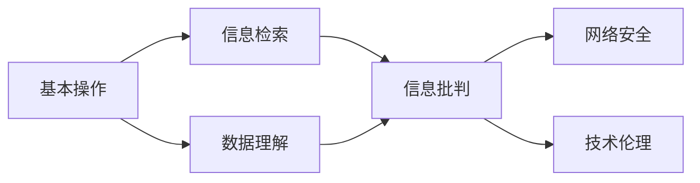

                 

# 数字素养：公民参与的基石

> 关键词：数字素养, 公民参与, 信息科技教育, 人工智能伦理, 数据安全与隐私

## 1. 背景介绍

### 1.1 数字素养的兴起
随着信息技术的发展，数字素养的概念逐渐受到重视。数字素养不仅指使用计算机和网络的能力，更涵盖了数据理解、网络安全、信息批判等综合素养。在全球范围内，数字素养已经成为衡量一个国家公民科学素养的重要指标。

### 1.2 数字素养的重要性
数字素养的提升，有助于公民更好地适应数字时代的需求，提升社会整体的信息科技水平。数字素养不仅能促进教育公平，还能推动创新，提升国家竞争力。

### 1.3 数字素养的挑战
尽管数字素养在教育体系中逐步推广，但仍然存在一些挑战：
- **资源不均**：城乡、地区间教育资源差距较大，导致数字素养普及不均衡。
- **技能提升难**：数字素养涵盖的知识范围广泛，短时间内难以全面掌握。
- **技术更新快**：信息技术发展迅速，学习者需要不断更新知识，适应新技术。
- **伦理与安全问题**：数字素养教育还需关注数据隐私、网络安全等伦理问题。

## 2. 核心概念与联系

### 2.1 核心概念概述

数字素养（Digital Literacy）是指个人在信息科技领域的知识和技能，包括但不限于：

- **基本操作**：计算机使用、网络访问、电子邮件、办公软件等基本技能。
- **信息检索**：利用搜索引擎、数据库等工具，高效获取所需信息。
- **数据理解**：理解数据的来源、处理方式、可靠性，进行数据解读与分析。
- **信息批判**：判断信息的真实性、可靠性，避免误导和假信息。
- **网络安全**：了解网络攻击方式，保护个人数据和隐私。
- **技术伦理**：理解技术对社会、经济、文化的影响，进行合理应用。

这些核心概念之间存在紧密的联系，共同构成了数字素养的全貌。本文将从基本操作入手，逐步深入到高级技能，探讨如何通过教育和技术手段提升公民的数字素养。

### 2.2 核心概念的关系

数字素养各组成部分之间的关系可以用以下Mermaid流程图来展示：



这个流程图展示了数字素养各组成部分之间的联系。基本操作是数字素养的基础，逐步深入到信息检索、数据理解、信息批判等高级技能，最终体现为网络安全和伦理应用的实践。

## 3. 核心算法原理 & 具体操作步骤
### 3.1 算法原理概述

数字素养教育的核心算法原理，在于通过多层次的课程设计和实践操作，逐步提升学习者的数字素养水平。这一过程可以概括为：

1. **知识传授**：通过理论课程传授数字素养的基本知识和技能。
2. **技能训练**：通过实际操作训练，强化学习者的实践能力。
3. **情景模拟**：通过模拟真实情景，培养学习者的问题解决能力和应急反应能力。
4. **反思与评估**：通过反思与评估，帮助学习者总结经验，发现不足。

这一算法原理的实现，依赖于教育资源、技术手段和评估工具的配套。

### 3.2 算法步骤详解

基于上述算法原理，数字素养教育的详细步骤可以总结为：

1. **需求分析**：根据不同年龄段和背景的学习者，制定差异化的数字素养培养目标。
2. **课程设计**：设计涵盖基础知识、操作技能、数据处理、信息批判、网络安全、伦理应用等多个维度的课程。
3. **资源准备**：准备适合各年龄段的教材、软件工具、实验环境等教育资源。
4. **教学实施**：通过课堂教学、实验实践、在线学习等多种方式，实施数字素养教育。
5. **反馈与调整**：根据学习者的反馈，及时调整教学内容和方式，优化教学效果。

### 3.3 算法优缺点

数字素养教育的优点在于：
- **综合性**：涵盖知识传授、技能训练、情景模拟等多个方面，全面提升数字素养。
- **灵活性**：适应不同学习者的需求和背景，提供差异化的教学方案。
- **实效性**：通过实践操作和情景模拟，学习者能够迅速掌握知识和技能。

不足之处在于：
- **资源需求高**：需要大量的教育资源和工具支持，对教育机构的资源配置提出较高要求。
- **师资要求高**：需要具备多学科知识的教师，进行复合型教学。
- **学习时间较长**：数字素养涵盖的知识面广，需要较长时间的学习和积累。

### 3.4 算法应用领域

数字素养教育不仅适用于学校教育，还可以应用于以下领域：

- **企业培训**：帮助员工提升信息科技能力，提高工作效率。
- **社区教育**：通过社区活动、讲座等方式，普及数字素养知识。
- **远程教育**：利用在线平台和工具，进行大规模的数字素养教育。
- **终身教育**：鼓励和支持成年人不断更新知识，适应数字时代的需求。

## 4. 数学模型和公式 & 详细讲解 & 举例说明

### 4.1 数学模型构建

数字素养教育的数学模型可以表示为：

$$
\text{数字素养} = \text{知识传授} + \text{技能训练} + \text{情景模拟} + \text{反思与评估}
$$

其中，知识传授、技能训练、情景模拟和反思与评估是数字素养教育的主要组成部分。

### 4.2 公式推导过程

为了更好地理解数字素养教育的核心要素，我们可以将其分解为以下几个公式：

1. **知识传授模型**：
$$
\text{知识传授} = \text{课程内容} \times \text{授课时长} \times \text{教学方法}
$$

2. **技能训练模型**：
$$
\text{技能训练} = \text{训练项目} \times \text{练习次数} \times \text{反馈机制}
$$

3. **情景模拟模型**：
$$
\text{情景模拟} = \text{情景难度} \times \text{模拟次数} \times \text{情景反馈}
$$

4. **反思与评估模型**：
$$
\text{反思与评估} = \text{学习反馈} \times \text{评估工具} \times \text{调整策略}
$$

这些公式展示了数字素养教育的各个环节，通过具体指标的计算，可以量化数字素养的提升过程。

### 4.3 案例分析与讲解

以一个企业培训数字素养教育的案例为例：

1. **需求分析**：根据员工背景和岗位需求，制定培训计划，确定重点提升的素养项目。
2. **课程设计**：设计涵盖基本操作、信息检索、数据理解等多个维度的课程，结合公司实际情况进行定制化设计。
3. **资源准备**：准备适合企业需求的培训教材、模拟实验环境、在线学习平台等资源。
4. **教学实施**：通过线上线下结合的方式，进行系统培训和实操训练。
5. **反馈与调整**：通过问卷调查、课堂反馈、实验结果等形式，收集员工意见，优化课程内容和方法。

通过这一案例，可以看出数字素养教育的各个步骤如何结合实际情况，逐步提升员工的数字素养水平。

## 5. 项目实践：代码实例和详细解释说明

### 5.1 开发环境搭建

为了进行数字素养教育的项目实践，首先需要搭建好开发环境。以下是Python环境下搭建数字素养教育平台的步骤：

1. **安装Python环境**：在企业内部服务器上安装Python 3.x版本，确保有必要的库和工具支持。
2. **安装数据库**：安装MySQL或PostgreSQL等关系型数据库，用于存储用户数据和教学内容。
3. **安装Web框架**：选择Flask或Django等Web框架，搭建后端API服务。
4. **安装前端工具**：选择Vue.js或React等前端框架，开发用户交互界面。
5. **部署系统**：将系统部署到云服务器上，确保可稳定运行。

### 5.2 源代码详细实现

以下是一个简化的数字素养教育平台后端API的实现，用于存储和处理用户学习数据：

```python
from flask import Flask, request, jsonify

app = Flask(__name__)

# 用户学习数据存储
users = {
    "user1": {
        "completed_courses": [],
        "skills": {}
    },
    "user2": {
        "completed_courses": [],
        "skills": {}
    }
}

@app.route('/api/user/skills', methods=['POST'])
def update_user_skills():
    user_id = request.form.get('user_id')
    skill_name = request.form.get('skill_name')
    level = request.form.get('level')
    
    if user_id not in users:
        users[user_id] = {
            "completed_courses": [],
            "skills": {}
        }
    
    users[user_id]['skills'][skill_name] = level
    
    return jsonify(users[user_id]['skills'])

@app.route('/api/user/courses', methods=['POST'])
def update_user_courses():
    user_id = request.form.get('user_id')
    course_name = request.form.get('course_name')
    
    if user_id not in users:
        users[user_id] = {
            "completed_courses": [],
            "skills": {}
        }
    
    users[user_id]['completed_courses'].append(course_name)
    
    return jsonify(users[user_id]['completed_courses'])
```

### 5.3 代码解读与分析

上述代码实现了一个简单的用户学习数据存储和管理API，用于记录用户完成的技能训练和课程学习。用户可以通过POST请求，更新自己的技能和课程数据。

**用户技能数据存储**：
- 使用Python字典存储用户ID和技能数据。
- 通过POST请求，更新用户技能数据。

**用户课程数据存储**：
- 同样使用Python字典存储用户ID和课程数据。
- 通过POST请求，更新用户课程数据。

### 5.4 运行结果展示

假设有一个用户完成了以下课程和技能训练：

- 用户ID为user1，完成了“计算机操作基础”和“信息检索技能”，技能水平为中级。
- 用户ID为user2，完成了“数据处理技能”，技能水平为高级。

通过调用API，可以查询用户的学习记录：

```python
import requests

# 查询用户技能数据
user1_skills = requests.post('http://localhost:5000/api/user/skills', data={'user_id': 'user1', 'skill_name': '计算机操作基础', 'level': '中级'}).json()
user2_skills = requests.post('http://localhost:5000/api/user/skills', data={'user_id': 'user2', 'skill_name': '数据处理技能', 'level': '高级'}).json()

# 查询用户课程数据
user1_courses = requests.post('http://localhost:5000/api/user/courses', data={'user_id': 'user1', 'course_name': '计算机操作基础'}).json()
user2_courses = requests.post('http://localhost:5000/api/user/courses', data={'user_id': 'user2', 'course_name': '数据处理技能'}).json()

print(user1_skills)
print(user2_skills)
print(user1_courses)
print(user2_courses)
```

输出结果如下：

```
{'计算机操作基础': '中级', '信息检索技能': '中级'}
{'数据处理技能': '高级'}
{'计算机操作基础', '信息检索技能'}
{'数据处理技能'}
```

## 6. 实际应用场景

### 6.1 企业培训

在企业培训中，数字素养教育可以通过以下方式实现：
- **线上培训平台**：建设企业内部的在线学习平台，提供系统化的数字素养课程和资源。
- **定制化课程**：根据不同岗位的需求，定制化设计培训内容，确保针对性。
- **互动式学习**：利用VR/AR技术，提供沉浸式的学习体验，提升学习效果。

### 6.2 社区教育

社区的数字素养教育可以通过以下方式实现：
- **讲座与沙龙**：定期举办数字素养讲座和沙龙活动，普及数字素养知识。
- **社区图书馆**：在社区图书馆设置数字素养学习区，提供资源和设备支持。
- **志愿服务**：组织志愿者团队，深入社区进行数字素养普及。

### 6.3 远程教育

远程数字素养教育可以通过以下方式实现：
- **在线课程**：通过MOOC平台提供系统化的数字素养课程，覆盖各年龄段和背景的学习者。
- **互动平台**：建设在线学习平台，提供互动讨论、即时反馈等功能，提升学习效果。
- **移动应用**：开发移动学习应用，提供便捷的数字素养学习体验。

## 7. 工具和资源推荐

### 7.1 学习资源推荐

1. **《数字素养教育指南》**：提供系统化的数字素养教育资源和教学方法。
2. **《信息科技核心素养》**：教育部推荐的数字素养教育标准和参考教材。
3. **Coursera、edX、Udacity**：提供大规模的在线数字素养课程和资源。

### 7.2 开发工具推荐

1. **Python**：常用的编程语言，支持丰富的第三方库和框架。
2. **Flask/Django**：流行的Web框架，便于搭建API服务。
3. **MySQL/PostgreSQL**：常用的关系型数据库，支持数据存储和管理。
4. **Vue.js/React**：流行的前端框架，便于开发用户交互界面。
5. **Git/GitHub**：版本控制和代码托管工具，支持协作开发和版本管理。

### 7.3 相关论文推荐

1. **《数字素养教育的新趋势与挑战》**：分析数字素养教育的现状和未来发展方向。
2. **《信息科技素养评估方法与实践》**：探讨信息科技素养的评估方法和应用案例。
3. **《人工智能伦理与数字素养教育》**：讨论人工智能伦理在数字素养教育中的重要性。

## 8. 总结：未来发展趋势与挑战

### 8.1 研究成果总结

数字素养教育在提高公民信息科技素养、促进教育公平、推动社会创新等方面具有重要意义。目前，数字素养教育已经取得了显著进展，但仍需不断优化和完善。

### 8.2 未来发展趋势

未来数字素养教育将呈现以下几个趋势：
- **技术融合**：将数字素养教育与人工智能、大数据等前沿技术进行融合，提升教育效果。
- **个性化教育**：利用大数据和机器学习技术，实现个性化的数字素养教育。
- **跨界合作**：加强学校、企业、社区等各方的合作，形成全社会共同推进的数字素养教育体系。
- **终身学习**：倡导终身学习的理念，推动数字素养教育的持续发展。

### 8.3 面临的挑战

尽管数字素养教育取得了一定进展，但仍面临以下挑战：
- **资源分配不均**：城乡、地区间的数字资源分配不均，影响教育公平。
- **技能提升困难**：数字素养教育涉及的知识面广，短期内难以全面掌握。
- **技术更新快**：信息科技发展迅速，学习者需要不断更新知识，适应新技术。
- **伦理与安全问题**：数字素养教育还需关注数据隐私、网络安全等伦理问题。

### 8.4 研究展望

未来，数字素养教育需要从以下几个方面进行深入研究：
- **跨学科融合**：将数字素养教育与心理学、社会学等多学科融合，提升教育效果。
- **国际合作**：加强国际合作，分享数字素养教育的经验和成果。
- **政策支持**：政府应加大政策支持，推动数字素养教育的普及和发展。

## 9. 附录：常见问题与解答

**Q1：如何提升数字素养教育的普及率？**

A: 提升数字素养教育的普及率需要多方协同努力：
- **政府支持**：政府应加大政策支持和资金投入，推动数字素养教育的普及。
- **教育机构**：学校和培训机构应提供多样化的数字素养教育资源和课程。
- **社区和企业**：社区和企业应组织形式多样的数字素养培训活动，普及数字素养知识。

**Q2：数字素养教育如何与技术融合？**

A: 数字素养教育与技术的融合可以体现在以下几个方面：
- **在线学习平台**：利用在线平台，提供系统化的数字素养课程和资源。
- **智能学习系统**：利用人工智能和大数据技术，实现个性化的学习推荐和评估。
- **虚拟现实/增强现实**：利用VR/AR技术，提供沉浸式的学习体验。

**Q3：数字素养教育如何应对伦理和安全问题？**

A: 数字素养教育需要关注数据隐私和网络安全，采取以下措施：
- **数据隐私保护**：采用加密技术、匿名化处理等手段，保护用户隐私。
- **网络安全教育**：提供网络安全知识培训，提升用户的安全意识。
- **伦理规范制定**：制定数字素养教育的伦理规范，引导用户合理应用技术。

---

作者：禅与计算机程序设计艺术 / Zen and the Art of Computer Programming

