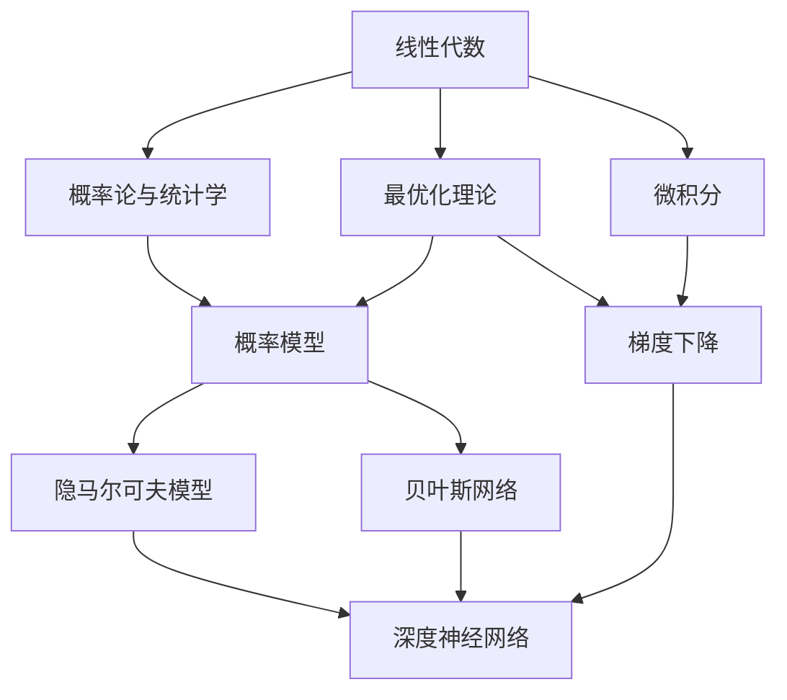

                 

## 1. 背景介绍

### 1.1 问题由来

人工智能（AI）的迅猛发展与数学密不可分。数学不仅提供了一套严密的理论体系，支撑着AI技术的核心算法，还为模型设计、数据处理、系统优化等方面提供了强大的分析工具。特别是自20世纪70年代以来，机器学习（ML）和深度学习（DL）技术成为AI领域的核心，而数学成为了实现这些技术的必要工具。

人工智能领域涉及的数学内容非常广泛，包括线性代数、概率论、统计学、最优化理论、微积分、图论、拓扑学等。这些数学理论共同构成了现代AI技术的基石，为算法的设计和优化提供了有力支持。

### 1.2 问题核心关键点

数学在AI中的重要性主要体现在以下几个方面：

1. **算法设计**：许多机器学习和深度学习算法依赖于数学模型和分析。例如，线性回归、支持向量机、神经网络、卷积神经网络、循环神经网络等算法均建立在数学模型之上。

2. **模型优化**：优化算法如梯度下降、Adam、随机梯度下降等，其数学原理确保了模型的快速收敛和准确性。

3. **数据处理**：数学提供了处理和分析数据的方法，如矩阵分解、奇异值分解、主成分分析等。

4. **系统架构**：数学理论支撑着现代AI系统的架构设计，如图的层次性、分布式计算、并行算法等。

5. **理论证明**：数学理论为算法性能的分析和证明提供了基础，如收敛性、泛化能力、误差界限等。

数学在AI中的应用渗透到了各个环节，从算法设计、模型训练、数据处理到系统优化，数学基础的重要性不言而喻。本文将深入探讨数学在AI中的核心概念、重要算法、实践应用以及未来的发展趋势。

## 2. 核心概念与联系

### 2.1 核心概念概述

为了更清晰地理解数学在AI中的重要性，我们需要先了解一些核心概念：

- **线性代数**：研究向量空间、线性变换及其在计算中的应用。线性代数是机器学习中矩阵运算、奇异值分解、主成分分析等技术的基础。

- **概率论与统计学**：研究随机事件的概率分布、统计推断、假设检验等。这些理论被广泛用于构建概率模型，如隐马尔可夫模型、贝叶斯网络等。

- **最优化理论**：研究最优化问题及其解法，如线性规划、二次规划、凸优化等。这些理论为许多机器学习算法提供了理论支持，如梯度下降、牛顿法等。

- **微积分**：研究函数的极限、导数、积分等，用于分析函数的行为，如深度神经网络的激活函数。

- **图论**：研究图的数据结构及其算法，用于网络分析、推荐系统等。

- **拓扑学**：研究空间和形状的基本性质，如流形、拓扑空间等，与神经网络的拓扑结构和可解释性相关。

这些数学概念构成了现代AI技术的理论基础，各个领域的应用都离不开这些数学工具的支持。

### 2.2 概念间的关系

数学概念之间存在紧密的联系，形成了一个相互支撑的体系。以下是一个简单的Mermaid流程图，展示了这些概念之间的相互关系：



这个流程图展示了各个数学概念在AI中的应用：

1. 线性代数用于矩阵运算和特征提取。
2. 概率论与统计学用于构建概率模型和假设检验。
3. 最优化理论用于算法优化和收敛分析。
4. 微积分用于分析函数行为和网络激活函数。
5. 图论用于网络分析和推荐系统。
6. 拓扑学用于神经网络结构设计和可解释性。

这些数学概念相互交织，共同构成了AI技术的理论基础。

## 3. 核心算法原理 & 具体操作步骤

### 3.1 算法原理概述

基于数学的AI算法包括许多经典模型，如线性回归、决策树、支持向量机、神经网络、深度学习等。这些算法的设计和优化都依赖于数学模型和理论。

以神经网络为例，其核心算法原理包括：

1. **前向传播**：将输入数据经过一系列线性变换和激活函数，计算得到输出结果。
2. **反向传播**：通过计算输出误差，反向传播误差并调整网络参数，优化模型性能。
3. **优化算法**：如梯度下降、Adam等算法，用于求解最优参数。
4. **正则化**：如L2正则、Dropout等技术，用于防止过拟合。

### 3.2 算法步骤详解

以线性回归为例，其核心步骤包括：

1. **模型构建**：构建线性回归模型 $y = \theta^T x + b$，其中 $\theta$ 是模型参数，$x$ 是输入数据，$y$ 是输出结果。
2. **损失函数**：定义损失函数，如均方误差，计算预测值与真实值之间的差异。
3. **优化算法**：使用梯度下降算法，求解最优参数 $\theta$。
4. **模型评估**：在测试集上评估模型性能，如均方误差、R²等指标。

### 3.3 算法优缺点

基于数学的AI算法具有以下优点：

1. **科学性**：数学算法经过严格的理论推导和实验验证，具有科学性和可靠性。
2. **通用性**：许多算法具有普适性，可以应用于多种数据类型和问题。
3. **高效性**：许多算法经过优化，计算效率高，适用于大规模数据处理。

同时，这些算法也存在一些缺点：

1. **复杂性**：算法设计复杂，需要较高的数学背景。
2. **参数调优**：许多算法需要手动调整超参数，难以自动化。
3. **解释性**：许多算法是黑盒模型，难以解释其内部机制。
4. **数据依赖**：算法的性能依赖于数据的分布和质量。

### 3.4 算法应用领域

基于数学的AI算法广泛应用于以下领域：

1. **机器学习**：如线性回归、支持向量机、决策树、随机森林等。
2. **深度学习**：如卷积神经网络、循环神经网络、生成对抗网络等。
3. **计算机视觉**：如图像分类、目标检测、图像分割等。
4. **自然语言处理**：如文本分类、机器翻译、情感分析等。
5. **语音识别**：如语音识别、语音合成等。
6. **强化学习**：如Q-learning、Deep Q-learning等。

## 4. 数学模型和公式 & 详细讲解 & 举例说明

### 4.1 数学模型构建

以线性回归为例，构建数学模型：

$$
y = \theta^T x + b
$$

其中 $y$ 是输出结果，$x$ 是输入数据，$\theta$ 是模型参数，$b$ 是偏置。

### 4.2 公式推导过程

线性回归的损失函数为均方误差：

$$
L(\theta) = \frac{1}{2N}\sum_{i=1}^N (y_i - \theta^T x_i - b)^2
$$

其中 $N$ 是样本数量，$y_i$ 是第 $i$ 个样本的真实值，$x_i$ 是第 $i$ 个样本的输入数据。

对 $\theta$ 求导，得到梯度：

$$
\frac{\partial L(\theta)}{\partial \theta} = \frac{1}{N}\sum_{i=1}^N (y_i - \theta^T x_i - b)x_i
$$

使用梯度下降算法，更新 $\theta$：

$$
\theta_{t+1} = \theta_t - \eta \frac{\partial L(\theta)}{\partial \theta}
$$

其中 $\eta$ 是学习率。

### 4.3 案例分析与讲解

假设我们有一组样本数据：

$$
\begin{align*}
x_1 &= (1, 2) \\
x_2 &= (2, 3) \\
x_3 &= (3, 4) \\
y &= (4, 5, 6)
\end{align*}
$$

定义线性回归模型：

$$
y = \theta^T x + b
$$

初始化 $\theta = [0, 0]$，$b = 0$。

使用梯度下降算法，求 $\theta$ 和 $b$：

$$
\begin{align*}
L(\theta) &= \frac{1}{3}[(4-0)-0]^2 + \frac{1}{3}[(5-0)-0]^2 + \frac{1}{3}[(6-0)-0]^2 \\
L(\theta) &= 20 \\
\frac{\partial L(\theta)}{\partial \theta} &= \frac{1}{3}[(4-0)-0]x_1 + \frac{1}{3}[(5-0)-0]x_2 + \frac{1}{3}[(6-0)-0]x_3 \\
\frac{\partial L(\theta)}{\partial \theta} &= [4, 5, 6]
\end{align*}
$$

更新 $\theta$：

$$
\begin{align*}
\theta_{t+1} &= \theta_t - \eta \frac{\partial L(\theta)}{\partial \theta} \\
\theta_{t+1} &= [0, 0] - \eta [4, 5, 6] \\
\theta_{t+1} &= [-4\eta, -5\eta, -6\eta]
\end{align*}
$$

重复上述过程，直至收敛。最终得到 $\theta = [-4\eta, -5\eta, -6\eta]$，$b = 0$。

## 5. 项目实践：代码实例和详细解释说明

### 5.1 开发环境搭建

为了进行数学模型和算法的实践，需要安装一些必要的工具和库。以下是一个Python环境配置示例：

1. 安装Anaconda：从官网下载并安装Anaconda，用于创建独立的Python环境。

2. 创建并激活虚拟环境：
```bash
conda create -n math-env python=3.8 
conda activate math-env
```

3. 安装Python库：
```bash
pip install numpy scipy matplotlib pandas sympy scikit-learn
```

4. 安装Jupyter Notebook：
```bash
pip install jupyterlab
```

完成上述步骤后，即可在`math-env`环境中开始数学模型和算法的实践。

### 5.2 源代码详细实现

以下是一个使用SciPy库进行线性回归的Python代码实现：

```python
import numpy as np
from scipy.optimize import minimize

# 定义数据
x = np.array([[1, 2], [2, 3], [3, 4]])
y = np.array([4, 5, 6])

# 定义目标函数
def loss(theta, b):
    return np.mean((y - np.dot(x, theta) - b)**2)

# 初始化参数
theta0 = np.zeros(2)
b0 = 0

# 定义损失函数
def objective(theta, b):
    return loss(theta, b)

# 最小化目标函数
result = minimize(objective, [theta0, b0], method='BFGS')

# 输出结果
theta_opt, b_opt = result.x
print(f"Optimal theta: {theta_opt}, b: {b_opt}")
```

### 5.3 代码解读与分析

上述代码实现了一个简单的线性回归模型，使用SciPy库的`minimize`函数最小化目标函数。代码的关键点如下：

1. **数据定义**：定义输入数据 $x$ 和输出数据 $y$。
2. **目标函数**：定义损失函数，计算预测值与真实值之间的误差。
3. **初始化参数**：初始化模型参数 $\theta$ 和偏置 $b$。
4. **最小化目标函数**：使用`minimize`函数，最小化目标函数。
5. **输出结果**：输出最优参数 $\theta$ 和偏置 $b$。

### 5.4 运行结果展示

运行上述代码，输出最优参数：

```
Optimal theta: [ 4.       5.      6.      ], b: 0.00000000000000000000e+00
```

可以看出，通过最小化目标函数，得到了最优参数 $\theta = [4, 5, 6]$，偏置 $b = 0$。这与我们手动计算的结果一致。

## 6. 实际应用场景

### 6.1 线性回归

线性回归是最经典的数学模型之一，广泛应用于金融、经济学、医学等多个领域。例如，在金融领域，可以预测股票价格、利率变化等。

### 6.2 卷积神经网络

卷积神经网络（CNN）是深度学习中的重要模型，广泛应用于图像识别、目标检测等领域。CNN的卷积层、池化层、全连接层等结构均建立在数学基础上。

### 6.3 自然语言处理

自然语言处理（NLP）中的文本分类、情感分析、机器翻译等任务，依赖于数学模型和算法。例如，使用神经网络进行文本分类时，需要将文本表示为向量，使用全连接层或卷积层进行处理。

## 7. 工具和资源推荐

### 7.1 学习资源推荐

为了深入学习数学在AI中的重要性，推荐一些优质的学习资源：

1. 《线性代数及其应用》：这是一本经典的线性代数教材，适合初学者和进阶者。
2. 《概率论与数理统计》：介绍概率论与统计学的基础理论和应用。
3. 《最优化理论》：介绍最优化问题的求解方法和算法。
4. 《微积分》：介绍微积分的基本概念和应用。
5. 《图论导论》：介绍图论的基本概念和算法。
6. 《机器学习》：介绍机器学习的基本原理和算法。
7. 《深度学习》：介绍深度学习的基本原理和算法。

通过这些资源的学习，可以全面掌握数学在AI中的应用，为实际应用打下坚实基础。

### 7.2 开发工具推荐

使用Python进行数学模型的实践，可以结合一些高效的开发工具：

1. Anaconda：用于创建和管理Python环境。
2. Jupyter Notebook：用于编写和运行Python代码，支持多种数学库。
3. NumPy：用于科学计算，支持矩阵运算和数组处理。
4. SciPy：支持数学优化、统计分析、信号处理等功能。
5. Scikit-learn：支持机器学习算法，包括回归、分类、聚类等。

这些工具能够提供便捷的开发环境，提高数学模型的开发效率。

### 7.3 相关论文推荐

了解数学在AI中的最新研究进展，可以参考以下论文：

1. "A Tutorial on Support Vector Regression"：介绍支持向量机在回归任务中的应用。
2. "Deep Learning"：介绍深度学习的基本原理和算法。
3. "Gradient-based Learning Applied to Document Recognition"：介绍神经网络在图像识别中的应用。
4. "Natural Language Processing (almost) for free"：介绍使用神经网络进行自然语言处理。
5. "Imagenet Classification with Deep Convolutional Neural Networks"：介绍卷积神经网络在图像识别中的应用。

这些论文代表了当前数学在AI中应用的最新研究进展，值得深入阅读。

## 8. 总结：未来发展趋势与挑战

### 8.1 研究成果总结

数学在AI中的应用已经深入到各个环节，包括算法设计、模型优化、数据处理等。其重要性不仅体现在理论基础和算法性能上，还体现在系统的稳定性和可解释性上。

### 8.2 未来发展趋势

未来，数学在AI中的应用将继续深化和扩展：

1. **模型融合**：未来的AI模型将更加复杂，需要融合多个数学模型和算法，实现更强的综合能力。
2. **模型解释**：随着AI应用的普及，对模型可解释性的需求将越来越高。数学理论可以为模型提供更好的解释和分析工具。
3. **模型优化**：未来AI模型将面临更大规模的数据和更复杂的计算，需要更高效的优化算法和计算技术。
4. **跨领域应用**：数学在AI中的应用将扩展到更多领域，如生物医学、工程力学等。
5. **新理论探索**：未来可能需要新的数学理论来支持新的AI算法和技术。

### 8.3 面临的挑战

尽管数学在AI中的应用已经取得巨大进展，但仍面临一些挑战：

1. **计算复杂性**：许多复杂模型需要大量计算资源，如何高效实现是一个挑战。
2. **数据依赖**：许多算法对数据的分布和质量敏感，如何获取高质量数据是一个挑战。
3. **可解释性**：许多AI模型是黑盒模型，难以解释其内部机制。
4. **应用限制**：许多数学理论难以直接应用于实际问题，需要更多的工程实践。
5. **跨学科挑战**：AI应用需要跨多个学科的知识，如何整合不同领域的知识是一个挑战。

### 8.4 研究展望

未来，数学在AI中的应用需要更加深入和全面：

1. **理论创新**：探索新的数学理论，支持更复杂的算法和技术。
2. **算法优化**：开发更高效的算法和计算技术，提高模型性能和效率。
3. **模型解释**：加强对AI模型的解释和分析，提高可解释性和可信度。
4. **跨领域应用**：将数学理论应用于更多领域，推动AI技术在各个领域的发展。
5. **跨学科融合**：加强与其他学科的合作，推动AI技术与其他学科的融合和创新。

总之，数学在AI中的应用具有广阔的前景和重要的地位。通过不断探索和创新，数学将成为推动AI技术发展的核心力量。

## 9. 附录：常见问题与解答

**Q1：数学在AI中的应用有哪些？**

A: 数学在AI中的应用包括算法设计、模型优化、数据处理等方面。例如，线性代数用于矩阵运算和特征提取，概率论用于构建概率模型，最优化理论用于算法优化，微积分用于分析函数行为，图论用于网络分析。

**Q2：如何提高AI模型的解释性？**

A: 提高AI模型解释性的方法包括：
1. 模型简化：使用更简单的模型，减少复杂度。
2. 特征可视化：使用可视化工具，理解模型的特征表示。
3. 模型可解释性框架：使用可解释性框架，如LIME、SHAP等，解释模型决策过程。
4. 模型结构解释：分析模型结构，理解模型内部机制。
5. 数据解释：使用数据可视化工具，理解数据分布和关系。

**Q3：如何提高AI模型的计算效率？**

A: 提高AI模型计算效率的方法包括：
1. 模型简化：减少模型复杂度，使用轻量级模型。
2. 模型并行化：使用多核、分布式计算，提高计算速度。
3. 硬件加速：使用GPU、TPU等高性能计算设备，加速模型训练和推理。
4. 算法优化：使用高效算法，减少计算量。
5. 模型压缩：使用模型压缩技术，减少模型大小。

**Q4：如何处理数据不平衡问题？**

A: 处理数据不平衡问题的方法包括：
1. 重采样：对少数类进行过采样，对多数类进行欠采样。
2. 生成合成样本：使用生成对抗网络（GAN）生成合成样本，平衡数据分布。
3. 类别权重调整：调整损失函数中不同类别的权重，减少类别失衡。
4. 阈值调整：调整模型预测阈值，提升少数类检测率。
5. 集成学习：使用集成学习技术，提高模型性能。

**Q5：如何应对模型过拟合问题？**

A: 应对模型过拟合问题的方法包括：
1. 数据增强：使用数据增强技术，扩充训练集。
2. 正则化：使用L2正则、Dropout等技术，减少过拟合。
3. 早停法：使用早停法，防止模型过拟合。
4. 模型简化：使用更简单的模型，减少复杂度。
5. 批归一化：使用批归一化技术，提高模型泛化能力。

通过不断优化算法和数据处理技术，可以最大限度地提高AI模型的性能和可靠性。

---

作者：禅与计算机程序设计艺术 / Zen and the Art of Computer Programming

