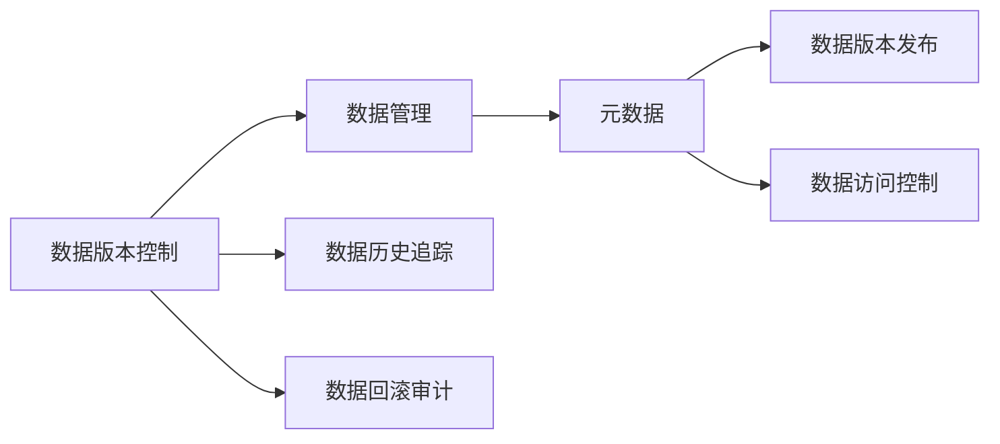
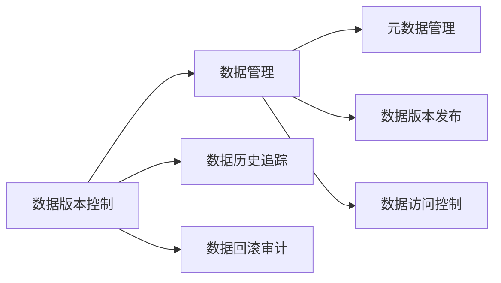
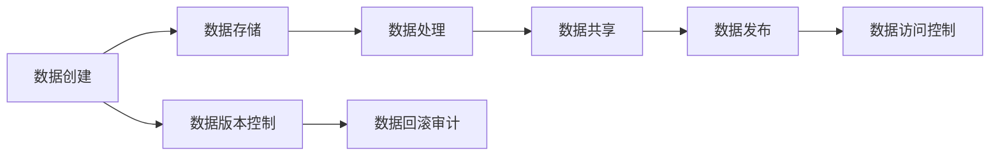
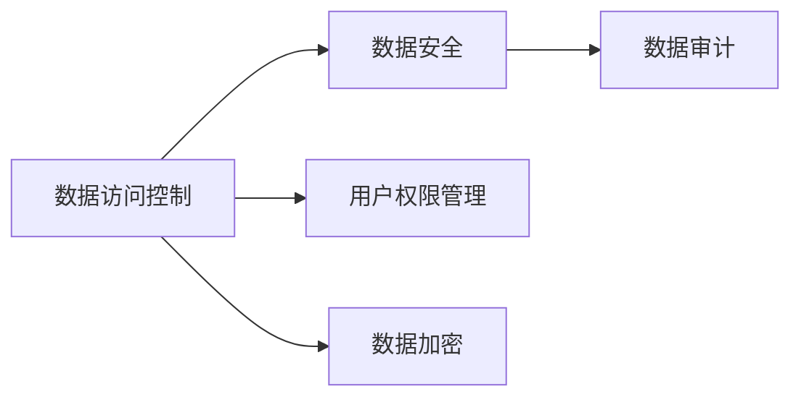

                 

# 数据版本控制与数据管理原理与代码实战案例讲解

## 1. 背景介绍

### 1.1 问题由来

在软件开发领域，版本控制系统（Version Control System, VCS）已经成为了软件开发不可或缺的工具。版本控制通过记录代码的历史变化，帮助开发者追踪版本，回滚错误，以及协作开发。随着数据规模的爆炸性增长和复杂性提高，数据版本控制（Data Version Control, DVC）的需求愈发迫切。DVC不仅仅是代码的版本控制，更是对数据、模型和实验等整个软件生命周期进行管理和协作的工具。

### 1.2 问题核心关键点

数据版本控制和数据管理技术的研究核心在于以下几点：
- **数据追踪与历史记录**：记录数据的变化历史，支持数据回滚和审计。
- **数据协作与共享**：支持多用户协作，提供数据共享与访问权限控制。
- **数据版本控制与发布**：支持数据版本发布与版本切换，确保数据的一致性与稳定性。
- **元数据管理与注释**：管理数据的元数据（如数据来源、处理步骤、特征信息等），提供清晰的注释和说明。

### 1.3 问题研究意义

研究数据版本控制与数据管理技术，对于提升数据处理效率、保障数据安全、促进数据共享与合作，具有重要意义：
- 提升数据处理效率：通过DVC，可以自动化记录数据处理步骤，减少手动操作的成本和时间。
- 保障数据安全：通过版本控制，可以记录和审计数据的使用和修改历史，确保数据的安全性和合规性。
- 促进数据共享与合作：通过DVC，可以提供数据版本控制和访问权限控制，支持数据共享和合作开发。
- 加速数据科学应用：通过元数据管理，可以提升数据科学家的工作效率，加速数据科学应用的研究与部署。

## 2. 核心概念与联系

### 2.1 核心概念概述

- **数据版本控制（DVC）**：记录和管理数据的历史版本，支持数据的回滚和审计。
- **数据管理**：管理数据的创建、存储、处理、分享和发布等生命周期过程，确保数据的质量、安全性和可靠性。
- **元数据**：描述数据的基本信息，如数据来源、处理步骤、特征信息等，帮助理解数据的背景和使用场景。
- **数据版本发布**：通过版本发布，实现数据的稳定性和一致性，确保数据在使用中的可靠性和可复现性。
- **数据访问控制**：通过权限管理，确保数据的安全性，控制不同用户对数据的访问权限。

这些核心概念之间的逻辑关系可以通过以下Mermaid流程图来展示：



这个流程图展示了大数据版本控制与数据管理中的核心概念及其之间的关系：

1. 数据版本控制记录和管理数据的历史版本。
2. 数据管理管理数据的生命周期过程，包括元数据管理、版本发布和访问控制。
3. 元数据描述数据的背景和使用场景。
4. 版本发布确保数据的稳定性和一致性。
5. 访问控制保障数据的安全性。

### 2.2 概念间的关系

这些核心概念之间存在着紧密的联系，形成了数据版本控制与数据管理的完整生态系统。下面我们通过几个Mermaid流程图来展示这些概念之间的关系。

#### 2.2.1 数据版本控制与数据管理的关系



这个流程图展示了数据版本控制和数据管理的基本关系，以及各自包含的具体功能。

#### 2.2.2 数据版本控制与数据生命周期的关系



这个流程图展示了数据生命周期中的各个阶段，以及数据版本控制和数据管理在这些阶段中的作用。

#### 2.2.3 数据访问控制与数据安全的关系



这个流程图展示了数据访问控制与数据安全之间的关系，以及访问控制的具体措施。

## 3. 核心算法原理 & 具体操作步骤
### 3.1 算法原理概述

数据版本控制和数据管理的核心算法原理主要包括以下几个方面：

- **版本追踪算法**：记录和管理数据的历史版本，支持数据回滚和审计。
- **数据版本发布算法**：确保数据在不同版本之间的稳定性，支持版本切换和合并。
- **数据访问控制算法**：通过权限管理，确保数据的安全性。

### 3.2 算法步骤详解

#### 3.2.1 数据版本追踪算法

数据版本追踪算法主要通过记录和审计数据的历史版本来实现。常见的版本追踪算法包括：

1. **版本索引**：为每个数据版本分配一个唯一的版本号，记录在版本控制系统中。
2. **增量更新**：新版本的生成基于对已有版本的修改，记录增量更新内容。
3. **回滚审计**：支持对数据版本进行回滚，并记录回滚操作和审计日志。

#### 3.2.2 数据版本发布算法

数据版本发布算法主要通过发布和切换不同数据版本来实现。常见的版本发布算法包括：

1. **发布版本**：将某个数据版本发布为正式版本，并记录发布日志。
2. **版本切换**：将系统默认使用版本切换到目标版本，记录切换日志。
3. **版本合并**：合并不同版本的差异，生成新的数据版本。

#### 3.2.3 数据访问控制算法

数据访问控制算法主要通过权限管理来实现。常见的访问控制算法包括：

1. **用户角色管理**：定义用户的角色和权限，分配访问权限。
2. **数据加密**：对敏感数据进行加密处理，保护数据隐私。
3. **访问审计**：记录和审计用户对数据的访问操作，确保数据的安全性。

### 3.3 算法优缺点

数据版本控制与数据管理技术的优点包括：
1. 支持数据的历史版本追踪和回滚审计，增强数据的可追溯性和可靠性。
2. 提供数据的权限管理功能，确保数据的安全性和合规性。
3. 支持数据的版本发布和版本切换，确保数据的一致性和稳定性。
4. 管理数据的元数据和注释，提升数据的可理解和可维护性。

缺点包括：
1. 系统复杂度高，需要维护多个版本和权限控制机制。
2. 存储和处理大量元数据可能带来额外的开销。
3. 数据访问控制可能影响数据的使用效率和灵活性。

### 3.4 算法应用领域

数据版本控制与数据管理技术广泛应用于以下领域：

- **数据科学和机器学习**：管理数据集的版本和元数据，支持数据的共享和合作开发。
- **金融和保险**：记录和审计交易数据的历史版本，确保数据的合规性和安全。
- **医疗和健康**：记录和审计医疗数据的历史版本，确保数据的隐私和合规。
- **企业和政府**：管理企业内部和政府机构的数据，支持数据共享和协作。

## 4. 数学模型和公式 & 详细讲解 & 举例说明

### 4.1 数学模型构建

假设我们有一个数据集 $D = \{d_1, d_2, ..., d_n\}$，其中每个数据 $d_i$ 都有一个历史版本序列 $\{d_i^1, d_i^2, ..., d_i^m\}$。数据版本控制的主要数学模型包括：

- **版本追踪模型**：
  $$
  V(d_i, m) = \{d_i^1, d_i^2, ..., d_i^m\}
  $$
  记录数据 $d_i$ 的 $m$ 个历史版本。
- **版本发布模型**：
  $$
  P(v_j) = \{d^1_j, d^2_j, ..., d^n_j\}
  $$
  记录某个数据版本 $v_j$ 的 $n_j$ 个发布版本。
- **访问控制模型**：
  $$
  A(u, p) = \{d_i^j | u \in R_j\}
  $$
  记录用户 $u$ 对数据版本 $v_j$ 的访问权限 $R_j$。

### 4.2 公式推导过程

以数据版本发布为例，假设当前系统使用数据版本 $v_1$，要发布新数据版本 $v_2$，其版本发布公式为：

$$
P(v_2) = \{d^1_1, d^2_1, ..., d^n_1\} \cup \{d^1_2, d^2_2, ..., d^m_2\}
$$

其中 $\{d^1_1, d^2_1, ..., d^n_1\}$ 为当前系统使用的 $v_1$ 版本的 $n_1$ 个数据记录，$\{d^1_2, d^2_2, ..., d^m_2\}$ 为要发布的新版本 $v_2$ 的 $m_2$ 个数据记录。

### 4.3 案例分析与讲解

以数据科学和机器学习为例，假设我们有一个数据集 $D$，记录了用户的历史行为数据。数据版本控制和数据管理的主要步骤包括：

1. **数据版本追踪**：记录数据集 $D$ 的每个历史版本，如 $D^1$、$D^2$、$D^3$。
2. **数据版本发布**：将 $D^2$ 发布为正式版本，记为 $D^2$。
3. **数据版本切换**：将系统默认使用版本从 $D^1$ 切换到 $D^2$。
4. **数据访问控制**：定义不同用户对数据的访问权限，如数据科学家 $Alice$ 可以访问 $D^2$，而普通用户只能访问 $D^1$。

## 5. 项目实践：代码实例和详细解释说明

### 5.1 开发环境搭建

在进行数据版本控制和数据管理实践前，我们需要准备好开发环境。以下是使用Python进行DVC开发的简单配置流程：

1. 安装Anaconda：从官网下载并安装Anaconda，用于创建独立的Python环境。

2. 创建并激活虚拟环境：
```bash
conda create -n dvc-env python=3.8 
conda activate dvc-env
```

3. 安装DVC：
```bash
pip install dvc
```

4. 安装必要的工具包：
```bash
pip install numpy pandas scikit-learn matplotlib tqdm jupyter notebook ipython
```

完成上述步骤后，即可在`dvc-env`环境中开始DVC实践。

### 5.2 源代码详细实现

下面以一个简单的数据版本控制项目为例，展示如何使用DVC进行数据版本控制和数据管理。

首先，创建一个DVC项目目录，并初始化DVC：

```bash
mkdir my_dvc_project
cd my_dvc_project
dvc init
```

然后，创建一个数据文件并标注数据版本：

```python
import dvc.api

dvc.api.add(
    source='my_data.csv',
    target='my_data/v1.csv',
    rev='master'
)

dvc.api.add(
    source='my_data.csv',
    target='my_data/v2.csv',
    rev='v2'
)

dvc.api.add(
    source='my_data.csv',
    target='my_data/v3.csv',
    rev='v3'
)
```

接着，定义数据发布和版本切换的Python脚本：

```python
import dvc.api

def publish_version(target, rev):
    dvc.api.add(target=target, source='my_data.csv', rev=rev)
    dvc.api.commit()

def switch_to_version(target, rev):
    dvc.api.add(target=target, source='my_data.csv', rev=rev)
    dvc.api.commit()
```

最后，测试数据版本控制和版本发布功能：

```python
# 发布新数据版本
publish_version('my_data/v4.csv', 'v4')
print('Data version v4 published.')

# 切换默认数据版本
switch_to_version('my_data/v4.csv', 'v4')
print('Default data version switched to v4.')
```

### 5.3 代码解读与分析

让我们再详细解读一下关键代码的实现细节：

**dvc.api.add方法**：
- 该方法用于将数据文件添加到DVC系统中，并指定目标文件名和版本信息。

**dvc.api.commit方法**：
- 该方法用于提交对DVC系统的修改，记录版本信息并创建新的版本。

**发布数据版本**：
- 调用`publish_version`函数，将新数据文件添加到DVC系统中，并提交新的版本信息。

**切换默认数据版本**：
- 调用`switch_to_version`函数，将系统默认使用的数据版本切换为新版本，并提交新的版本信息。

通过这些简单的代码实现，我们可以快速构建一个基本的数据版本控制项目，并测试数据版本发布和切换的功能。

### 5.4 运行结果展示

运行上述代码后，DVC系统会自动记录数据的历史版本信息，并在系统中生成相应的版本列表。例如，在DVC系统的UI界面，可以查看数据版本列表和版本详情：

```
v1.csv   -   master
v2.csv   -   v2
v3.csv   -   v3
v4.csv   -   v4
```

通过DVC系统的界面，可以方便地查看和操作数据版本，支持数据的历史回滚和审计。

## 6. 实际应用场景

### 6.1 智能推荐系统

在智能推荐系统中，数据版本控制和数据管理技术可以用于管理用户行为数据和推荐模型。具体而言，可以记录用户的浏览、购买等行为数据，并对不同版本的用户数据进行分析和推荐模型训练。在推荐模型发布后，可以对不同版本的模型进行切换和回滚，以支持新模型的迭代优化。

### 6.2 金融数据分析

在金融数据分析中，数据版本控制和数据管理技术可以用于管理金融交易数据、市场数据和财务报表等。通过记录和审计数据的每个版本，确保数据的完整性和可追溯性，支持数据的审计和合规性检查。同时，通过对不同版本的模型进行切换和回滚，确保数据分析结果的稳定性和可靠性。

### 6.3 医疗健康数据管理

在医疗健康数据管理中，数据版本控制和数据管理技术可以用于管理电子病历、医疗影像、基因数据等敏感数据。通过记录和审计数据的每个版本，确保数据的隐私和合规性，支持数据的审计和合规性检查。同时，通过对不同版本的模型进行切换和回滚，确保数据分析结果的稳定性和可靠性。

### 6.4 未来应用展望

随着数据版本控制和数据管理技术的发展，未来的应用场景将更加广泛，涵盖更多的行业和领域。

- **智慧城市**：记录和管理城市运行数据，支持智慧城市的数据分析和决策支持。
- **工业制造**：记录和管理工业生产数据，支持工业智能的数据分析和预测。
- **农业领域**：记录和管理农业生产数据，支持农业智能的数据分析和决策支持。
- **能源领域**：记录和管理能源数据，支持能源智能的数据分析和预测。

## 7. 工具和资源推荐

### 7.1 学习资源推荐

为了帮助开发者系统掌握数据版本控制和数据管理的技术，这里推荐一些优质的学习资源：

1. 《Data Version Control with DVC》书籍：DVC作者撰写，全面介绍了DVC的原理和实践，是学习DVC的必备书籍。
2. CS224D《数据管理》课程：斯坦福大学开设的数据管理课程，涵盖数据版本控制、数据存储、数据共享等内容，帮助你深入理解数据管理的基础知识。
3. 《Data Version Control》论文：综述了数据版本控制技术的发展历程和未来方向，适合深入学习。
4. HuggingFace官方文档：DVC的官方文档，提供了丰富的使用示例和最佳实践。
5. DVC官方博客：DVC团队发布的博客，分享最新的DVC发展和应用案例，适合关注最新的技术动态。

通过这些资源的学习，相信你一定能够快速掌握数据版本控制和数据管理的精髓，并用于解决实际的数据管理问题。

### 7.2 开发工具推荐

高效的开发离不开优秀的工具支持。以下是几款用于数据版本控制和数据管理开发的常用工具：

1. DVC：开源的数据版本控制工具，支持数据的历史追踪和版本控制。
2. Dagit：DVC的可视化工具，用于可视化DVC的工作流和数据管理情况。
3. Grafana：监控工具，用于实时监控DVC系统的指标和运行状态。
4. GitLab：持续集成和持续部署平台，支持DVC的工作流管理和自动化部署。
5. Jupyter Notebook：数据科学和机器学习开发常用的笔记本环境，支持数据版本控制的集成和开发。

合理利用这些工具，可以显著提升数据版本控制和数据管理的开发效率，加快创新迭代的步伐。

### 7.3 相关论文推荐

数据版本控制和数据管理技术的发展源于学界的持续研究。以下是几篇奠基性的相关论文，推荐阅读：

1. 《Data Version Control: A Survey》：综述了数据版本控制技术的发展历程和未来方向，适合深入学习。
2. 《Data Management for Data Scientists》：介绍了数据管理的核心概念和最佳实践，帮助你深入理解数据管理的核心思想。
3. 《Version Control System: A Survey》：综述了版本控制系统的技术进展和未来趋势，适合深入学习。
4. 《Data Version Control and Collaboration》：介绍了数据版本控制和协作的技术细节，适合深入理解。
5. 《Data Version Control and Data Governance》：介绍了数据版本控制和数据治理的技术细节，适合深入理解。

这些论文代表了大数据版本控制和数据管理技术的发展脉络。通过学习这些前沿成果，可以帮助研究者把握学科前进方向，激发更多的创新灵感。

除上述资源外，还有一些值得关注的前沿资源，帮助开发者紧跟数据版本控制和数据管理技术的最新进展，例如：

1. arXiv论文预印本：人工智能领域最新研究成果的发布平台，包括大量尚未发表的前沿工作，学习前沿技术的必读资源。
2. 业界技术博客：如DVC、Dagit、Grafana等官方博客，第一时间分享他们的最新研究成果和洞见。
3. 技术会议直播：如IEEE、ACM等顶级会议的现场或在线直播，能够聆听到顶尖专家的分享，开阔视野。
4. GitHub热门项目：在GitHub上Star、Fork数最多的DVC相关项目，往往代表了该技术领域的发展趋势和最佳实践，值得去学习和贡献。
5. 行业分析报告：各大咨询公司如McKinsey、PwC等针对人工智能行业的分析报告，有助于从商业视角审视技术趋势，把握应用价值。

总之，对于数据版本控制和数据管理技术的学习和实践，需要开发者保持开放的心态和持续学习的意愿。多关注前沿资讯，多动手实践，多思考总结，必将收获满满的成长收益。

## 8. 总结：未来发展趋势与挑战

### 8.1 总结

本文对数据版本控制与数据管理技术进行了全面系统的介绍。首先阐述了数据版本控制与数据管理技术的研究背景和意义，明确了数据版本控制与数据管理在提升数据处理效率、保障数据安全、促进数据共享与合作等方面的独特价值。其次，从原理到实践，详细讲解了数据版本控制和数据管理的技术实现，给出了数据版本控制和数据管理的完整代码实例。同时，本文还广泛探讨了数据版本控制和数据管理技术在多个行业领域的应用前景，展示了数据版本控制和数据管理技术的广阔前景。

通过本文的系统梳理，可以看到，数据版本控制和数据管理技术在提升数据处理效率、保障数据安全、促进数据共享与合作等方面具有重要意义。这些技术的持续演进，将推动数据科学的进一步发展，为各行各业的数据管理和应用提供坚实的基础。

### 8.2 未来发展趋势

展望未来，数据版本控制与数据管理技术将呈现以下几个发展趋势：

1. **自动化和智能化**：未来的数据版本控制和数据管理将更加自动化和智能化，通过机器学习等技术，自动记录和处理数据变化，提升数据管理效率。
2. **多云集成和边缘计算**：未来的数据版本控制和数据管理将支持多云集成和边缘计算，支持数据在不同云平台和边缘设备之间的无缝迁移和处理。
3. **数据共享和协作**：未来的数据版本控制和数据管理将更加支持数据共享和协作，提供更加灵活的数据访问控制和权限管理机制。
4. **数据隐私和合规性**：未来的数据版本控制和数据管理将更加注重数据隐私和合规性，通过数据脱敏、加密等技术，确保数据的安全性和合规性。
5. **数据治理和治理框架**：未来的数据版本控制和数据管理将引入数据治理和治理框架，确保数据的质量、一致性和可追溯性。

以上趋势凸显了数据版本控制和数据管理技术的广阔前景。这些方向的探索发展，必将进一步提升数据处理效率、保障数据安全、促进数据共享与合作，推动数据科学的进一步发展。

### 8.3 面临的挑战

尽管数据版本控制和数据管理技术已经取得了显著进展，但在迈向更加智能化、自动化、安全化应用的过程中，仍面临诸多挑战：

1. **系统复杂性**：随着数据量的增加和复杂性的提高，数据版本控制和数据管理系统的复杂性也随之增加，需要更强大的系统架构和技术支持。
2. **数据隐私和安全**：数据隐私和安全问题是数据版本控制和数据管理的重要挑战，需要更完善的数据加密、脱敏和访问控制机制。
3. **数据一致性和可追溯性**：数据版本控制和数据管理需要确保数据在不同版本之间的稳定性和一致性，以及数据的可追溯性和审计性。
4. **数据版本切换和合并**：数据版本切换和合并是数据版本控制的关键操作，需要更高效的算法和更灵活的实现机制。

正视数据版本控制和数据管理面临的这些挑战，积极应对并寻求突破，将是大数据版本控制和数据管理技术走向成熟的必由之路。相信随着学界和产业界的共同努力，这些挑战终将一一被克服，数据版本控制和数据管理必将在构建人机协同的智能时代中扮演越来越重要的角色。

### 8.4 研究展望

面对数据版本控制和数据管理所面临的种种挑战，未来的研究需要在以下几个方面寻求新的突破：

1. **自动化和智能化**：开发更高效的自动化和智能化算法，提升数据版本控制和数据管理的效率和灵活性。
2. **多云集成和边缘计算**：研究数据在不同云平台和边缘设备之间的无缝迁移和处理技术，支持多云集成和边缘计算。
3. **数据隐私和合规性**：开发更完善的数据加密、脱敏和访问控制技术，确保数据隐私和安全。
4. **数据一致性和可追溯性**：研究更高效的数据版本切换和合并算法，确保数据在不同版本之间的稳定性和一致性。
5. **数据治理和治理框架**：引入数据治理和治理框架，确保数据的质量、一致性和可追溯性。

这些研究方向的探索，必将引领数据版本控制和数据管理技术迈向更高的台阶，为构建安全、可靠、可解释、可控的智能系统铺平道路。面向未来，数据版本控制和数据管理技术还需要与其他人工智能技术进行更深入的融合，如知识表示、因果推理、强化学习等，多路径协同发力，共同推动数据科学的进步。

## 9. 附录：常见问题与解答

**Q1：数据版本控制和数据管理是否适用于所有数据类型？**

A: 数据版本控制和数据管理技术适用于大多数数据类型，包括结构化数据、非结构化数据和混合数据。但对于某些特定类型的数据，如视频、音频等，需要结合具体的存储和处理技术，进行针对性的优化。

**Q2：数据版本控制和数据管理需要哪些系统架构和技术支持？**

A: 数据版本控制和数据管理需要构建一个完整的数据管理生态系统，包括数据存储、数据处理、数据共享和数据治理等各个环节。需要引入分布式数据库、数据湖、大数据平台等技术，支持数据的高效存储、处理和分析。

**Q3：数据版本控制和数据管理如何处理数据隐私和安全问题？**

A: 数据版本控制和数据管理可以通过数据加密、脱敏、访问控制等技术，确保数据隐私和安全。对于敏感数据，可以采用数据去标识化技术，确保数据的匿名性。

**Q4：数据版本控制和数据管理如何确保数据的一致性和可追溯性？**

A: 数据版本控制和数据管理通过记录和审计数据的每个版本，确保数据的一致性和可追溯性。在数据发布和切换时，需要确保新数据版本和旧数据版本之间的兼容性，避免数据不一致问题。

**Q5：数据版本控制和数据管理如何支持多云集成和边缘计算？**

A: 数据版本控制和数据管理可以通过数据标准化和元数据管理，支持多云集成和边缘计算。在多云环境下，需要统一数据格式和元数据标准，确保数据在不同云平台之间的互操作性。在边缘计算环境下，需要考虑数据隐私和安全，进行数据去标识化处理。

通过对这些资源的学习和实践，相信你一定能够快速掌握数据版本控制和数据管理的精髓，并用于解决实际的数据管理问题。

---

作者：禅与计算机程序设计艺术 / Zen and the Art of Computer Programming

