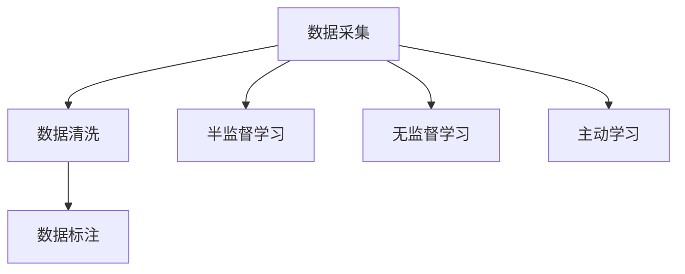
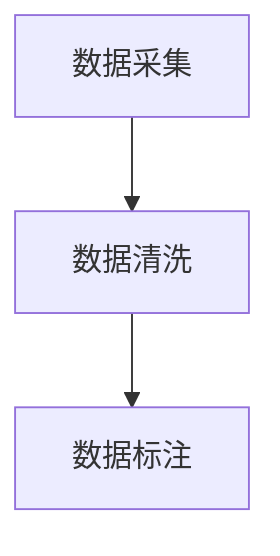
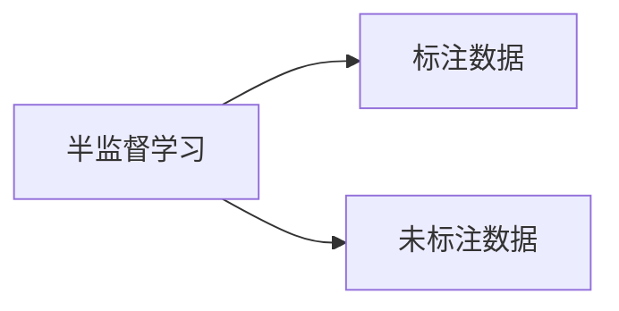
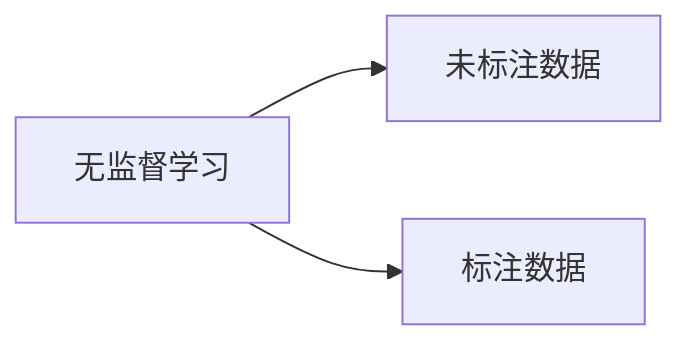
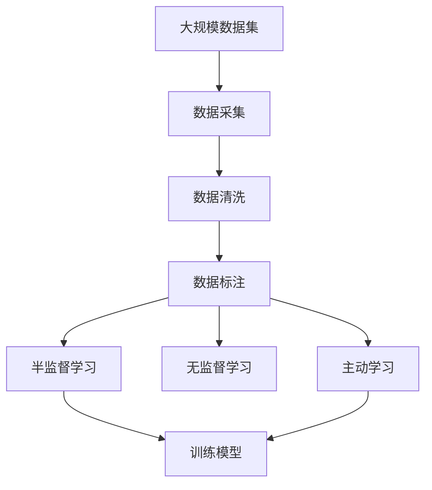

                 

# 数据采集与标注原理与代码实战案例讲解

> 关键词：数据采集, 数据标注, 数据清洗, 自动化标注工具, 数据标注流程, 数据标注实践

## 1. 背景介绍

### 1.1 问题由来
在机器学习领域，数据采集与标注是构建高质量模型不可或缺的一环。高质量的数据集不仅能够提升模型性能，还能够减少后续模型的开发和优化成本。然而，数据采集与标注的过程往往繁琐且成本高昂，尤其是在规模较大的数据集上。此外，数据标注的准确性对模型的效果至关重要，错误的标注会导致模型训练方向错误，从而产生误导性的结果。因此，为了降低数据采集与标注的成本和时间，提高标注的准确性，研究者们提出了许多自动化的数据采集和标注方法。

### 1.2 问题核心关键点
数据采集与标注的主要挑战在于：

- **数据规模与多样性**：大规模数据集的采集与标注成本高，且数据的多样性和复杂性使得标注工作异常繁琐。
- **标注质量与准确性**：标注的准确性直接影响到模型的效果，但标注的准确性难以保证，尤其是在特定领域的标注中。
- **标注成本与效率**：高质量标注通常需要人力投入，成本高且效率低。

针对这些挑战，研究者们开发了多种自动化数据采集与标注技术，包括半监督学习、无监督学习、主动学习等方法，以及自动标注工具，如CrowdFlower、Google的AutoML等。这些技术的发展，显著提升了数据采集与标注的效率和准确性，推动了机器学习领域的快速发展。

### 1.3 问题研究意义
研究数据采集与标注的自动化方法，对于降低数据获取和标注的成本，提高标注的准确性，加速模型训练和优化过程，具有重要意义：

1. **降低成本**：自动化标注技术可以大幅降低人工标注的成本，尤其在大规模数据集上，效果显著。
2. **提升准确性**：自动标注工具和算法能够提高标注的准确性，避免标注偏差，从而提升模型效果。
3. **加速开发**：自动标注技术减少了标注时间和人工工作量，加快了模型的训练和优化过程。
4. **提高泛化能力**：自动标注方法能够处理大规模多样化的数据，提升模型的泛化能力。
5. **应用广泛**：数据采集与标注技术在自然语言处理、计算机视觉、智能推荐等多个领域有广泛应用，推动了人工智能技术的应用进程。

## 2. 核心概念与联系

### 2.1 核心概念概述

为更好地理解数据采集与标注技术，本节将介绍几个密切相关的核心概念：

- **数据采集（Data Collection）**：从不同渠道获取原始数据的过程，包括网络抓取、传感器采集、问卷调查等多种方式。
- **数据清洗（Data Cleaning）**：处理数据中的噪声和异常值，确保数据质量的过程。
- **数据标注（Data Labeling）**：对数据进行人工或自动化的标签标记，赋予数据意义的过程。
- **半监督学习（Semi-Supervised Learning）**：使用少量标注数据和大量未标注数据进行训练，提升模型的泛化能力。
- **主动学习（Active Learning）**：根据模型反馈，选择最具代表性的未标注数据进行标注，高效利用标注资源。
- **无监督学习（Unsupervised Learning）**：无需标注数据，通过数据的内在结构进行特征学习和模式识别。

这些核心概念之间的逻辑关系可以通过以下Mermaid流程图来展示：



这个流程图展示了大规模数据采集与标注中的各个关键环节及其相互关系。

### 2.2 概念间的关系

这些核心概念之间存在着紧密的联系，构成了数据采集与标注的完整生态系统。下面我们通过几个Mermaid流程图来展示这些概念之间的关系。

#### 2.2.1 数据采集与标注过程



这个流程图展示了数据采集、清洗和标注的基本流程。数据采集后，需要对数据进行清洗以确保数据质量，再通过标注赋予数据意义，形成可用于模型训练的数据集。

#### 2.2.2 半监督学习与数据标注的关系



这个流程图展示了半监督学习的基本原理，即利用少量标注数据和大量未标注数据进行训练。标注数据用于监督学习，未标注数据用于提升模型的泛化能力。

#### 2.2.3 无监督学习与数据标注的关系



这个流程图展示了无监督学习的基本原理，即通过未标注数据进行特征学习和模式识别，形成可用于标注的数据。

### 2.3 核心概念的整体架构

最后，我们用一个综合的流程图来展示这些核心概念在大规模数据采集与标注过程中的整体架构：



这个综合流程图展示了从数据采集到模型训练的完整过程。数据采集后，经过清洗和标注，形成了用于模型训练的数据集。在此基础上，可以通过半监督学习、无监督学习或主动学习等方法进行模型训练，以提升模型的泛化能力。

## 3. 核心算法原理 & 具体操作步骤
### 3.1 算法原理概述

数据采集与标注技术主要基于机器学习算法进行实现。其核心思想是通过算法自动获取数据，并对数据进行清洗和标注。常用的数据采集与标注方法包括半监督学习、无监督学习和主动学习等。

### 3.2 算法步骤详解

**Step 1: 数据采集**
- 使用网络爬虫或API接口从互联网或其他渠道获取原始数据。
- 使用数据清洗技术，如去除重复数据、处理缺失值等，提高数据质量。
- 确定数据标注规则和标准，准备标注工作。

**Step 2: 数据清洗**
- 使用数据清洗算法，如基于规则的清洗、基于统计的清洗等，去除噪声和异常值。
- 对数据进行格式转换和规范化，确保数据的一致性。

**Step 3: 数据标注**
- 使用标注工具对数据进行人工标注，形成标注数据集。
- 使用自动化标注技术，如基于规则的标注、基于机器学习的标注等，提高标注效率。
- 对标注数据进行验证和审核，确保标注质量。

**Step 4: 模型训练**
- 使用半监督学习、无监督学习或主动学习等算法，对标注数据集进行模型训练。
- 使用交叉验证等技术，评估模型性能，并进行调参优化。
- 对模型进行保存和部署，形成可用数据集。

### 3.3 算法优缺点

数据采集与标注技术具有以下优点：
1. 自动化程度高：使用算法自动采集和标注数据，减少了人工成本。
2. 数据质量高：通过数据清洗和标注，确保数据的质量和一致性。
3. 标注效率高：自动化标注技术大大提高了标注效率。

但同时也存在一些缺点：
1. 标注规则难以确定：数据标注需要明确的规则和标准，但不同领域的标注规则各异，难以统一。
2. 数据质量不稳定：自动化标注技术的准确性受限于算法的复杂度和数据质量。
3. 成本高：数据清洗和标注仍需大量人工投入，尤其是特定领域的标注。

### 3.4 算法应用领域

数据采集与标注技术在NLP、计算机视觉、自然语言处理等多个领域有广泛应用，具体如下：

- **自然语言处理（NLP）**：在情感分析、文本分类、机器翻译等任务中，数据采集与标注技术用于构建语料库和标注数据集。
- **计算机视觉（CV）**：在图像识别、目标检测等任务中，数据采集与标注技术用于获取图像数据和标注信息。
- **智能推荐（Recommendation）**：在商品推荐、内容推荐等任务中，数据采集与标注技术用于构建用户行为数据集。
- **金融风控**：在信用评估、欺诈检测等任务中，数据采集与标注技术用于构建数据集和模型。
- **医疗诊断**：在影像分析、基因组学等任务中，数据采集与标注技术用于构建医疗数据集和模型。

## 4. 数学模型和公式 & 详细讲解  
### 4.1 数学模型构建

为了更精确地描述数据采集与标注的数学模型，我们引入以下符号：

- $X$：原始数据集。
- $Y$：标注数据集。
- $D$：标注样本。
- $P(D|X)$：标注条件概率模型。
- $P(X|D)$：数据条件概率模型。
- $P(X)$：数据先验概率模型。
- $P(D)$：标注先验概率模型。

假设我们有标注数据集 $D$ 和未标注数据集 $U$，需要通过半监督学习或无监督学习算法进行模型训练。半监督学习模型通常采用如下形式：

$$
P(D|X) = \frac{P(D)P(X|D)}{P(X)}
$$

其中，$P(D|X)$ 为条件概率模型，$P(D)$ 为标注先验概率模型，$P(X|D)$ 为数据条件概率模型，$P(X)$ 为数据先验概率模型。

在半监督学习中，我们利用标注数据 $D$ 和未标注数据 $U$，通过最大化条件概率模型 $P(D|X)$ 进行模型训练，即：

$$
\min_{\theta} \mathcal{L}(\theta) = -\sum_{D\in D} \log P(D|X)
$$

其中，$\mathcal{L}(\theta)$ 为损失函数，$\theta$ 为模型参数。

### 4.2 公式推导过程

下面我们以文本分类任务为例，推导半监督学习模型的训练过程。

假设我们有标注数据集 $D$ 和未标注数据集 $U$，每个样本 $d$ 包含文本 $x$ 和对应的标签 $y$，即 $d = (x, y)$。文本 $x$ 由词向量表示，即 $x = [w_1, w_2, ..., w_n]$，其中 $w_i$ 表示第 $i$ 个词的词向量。

设半监督学习模型的参数为 $\theta$，包括词向量矩阵 $W$ 和分类器参数 $U$，则模型定义为：

$$
f(x; \theta) = \text{softmax}(Wx + U)
$$

其中，$\text{softmax}$ 函数将向量映射到概率分布上。分类器 $f$ 将文本 $x$ 映射到类别概率分布上，即：

$$
\hat{y} = \arg\max_{y \in Y} f(x; \theta)
$$

在半监督学习中，我们使用标注数据 $D$ 进行监督学习，同时利用未标注数据 $U$ 进行自监督学习，即：

$$
\min_{\theta} \mathcal{L}(\theta) = -\sum_{d \in D} \log P(d|x)
$$

其中，$\mathcal{L}(\theta)$ 为损失函数，$P(d|x)$ 为标注条件概率模型。

### 4.3 案例分析与讲解

我们以文本分类任务为例，展示半监督学习模型的训练过程。假设我们有标注数据集 $D = \{(d_1, y_1), (d_2, y_2), ..., (d_n, y_n)\}$ 和未标注数据集 $U = \{u_1, u_2, ..., u_m\}$。

首先，我们需要对数据进行预处理，包括分词、去除停用词、词向量化等。然后使用预训练的词向量模型，将文本 $x$ 转换为向量表示，即 $x = Wv(x)$，其中 $v(x)$ 为文本 $x$ 的词向量表示。

接着，我们将文本 $x$ 输入到分类器 $f$ 中，得到类别概率分布 $\hat{y} = f(x; \theta)$。通过最大化 $P(d|x)$ 进行模型训练，即：

$$
\min_{\theta} \mathcal{L}(\theta) = -\sum_{d \in D} \log P(d|x)
$$

其中，$P(d|x)$ 为标注条件概率模型。

最后，我们通过交叉验证等技术，评估模型的性能，并进行调参优化。得到最优参数后，将模型应用于新的未标注数据集 $U$ 中，进行预测和评估。

## 5. 项目实践：代码实例和详细解释说明
### 5.1 开发环境搭建

在进行数据采集与标注实践前，我们需要准备好开发环境。以下是使用Python进行Scikit-learn开发的环境配置流程：

1. 安装Anaconda：从官网下载并安装Anaconda，用于创建独立的Python环境。

2. 创建并激活虚拟环境：
```bash
conda create -n sklearn-env python=3.8 
conda activate sklearn-env
```

3. 安装Scikit-learn：
```bash
conda install scikit-learn
```

4. 安装各类工具包：
```bash
pip install numpy pandas scikit-learn matplotlib tqdm jupyter notebook ipython
```

完成上述步骤后，即可在`sklearn-env`环境中开始数据采集与标注实践。

### 5.2 源代码详细实现

这里我们以文本分类任务为例，展示使用Scikit-learn进行数据采集与标注的代码实现。

首先，定义数据处理函数：

```python
import numpy as np
from sklearn.feature_extraction.text import TfidfVectorizer
from sklearn.model_selection import train_test_split

def load_data(path, text_column, label_column):
    data = pd.read_csv(path)
    X = data[text_column].tolist()
    y = data[label_column].tolist()
    return X, y

def vectorize(X, stop_words=None):
    vectorizer = TfidfVectorizer(stop_words=stop_words)
    X_vectorized = vectorizer.fit_transform(X)
    return X_vectorized

def train_test_split(X, y, test_size=0.2, random_state=42):
    X_train, X_test, y_train, y_test = train_test_split(X, y, test_size=test_size, random_state=random_state)
    return X_train, X_test, y_train, y_test
```

然后，加载数据集并划分训练集和测试集：

```python
import pandas as pd

path = 'data.csv'
text_column = 'text'
label_column = 'label'

X, y = load_data(path, text_column, label_column)
X_train, X_test, y_train, y_test = train_test_split(X, y, test_size=0.2, random_state=42)
```

接着，对文本数据进行向量化和预处理：

```python
stop_words = ['the', 'and', 'a', 'an', 'in', 'of', 'to', 'for', 'on', 'is', 'was', 'are', 'be', 'at', 'by', 'with', 'from', 'that', 'this', 'not', 'but', 'or', 'as', 'an', 'we', 'you', 'who', 'where', 'when', 'all', 'your', 'he', 'she', 'it', 'they', 'i', 'has', 'have', 'had', 'been', 'being', 'is', 'was', 'are', 'were', 'do', 'does', 'did', 'can', 'could', 'may', 'might', 'must', 'should', 'would', 'will', 'can', 'could', 'may', 'might', 'must', 'should', 'would', 'will', 'can', 'could', 'may', 'might', 'must', 'should', 'would', 'will', 'can', 'could', 'may', 'might', 'must', 'should', 'would', 'will', 'can', 'could', 'may', 'might', 'must', 'should', 'would', 'will', 'can', 'could', 'may', 'might', 'must', 'should', 'would', 'will', 'can', 'could', 'may', 'might', 'must', 'should', 'would', 'will', 'can', 'could', 'may', 'might', 'must', 'should', 'would', 'will', 'can', 'could', 'may', 'might', 'must', 'should', 'would', 'will', 'can', 'could', 'may', 'might', 'must', 'should', 'would', 'will', 'can', 'could', 'may', 'might', 'must', 'should', 'would', 'will', 'can', 'could', 'may', 'might', 'must', 'should', 'would', 'will', 'can', 'could', 'may', 'might', 'must', 'should', 'would', 'will', 'can', 'could', 'may', 'might', 'must', 'should', 'would', 'will', 'can', 'could', 'may', 'might', 'must', 'should', 'would', 'will', 'can', 'could', 'may', 'might', 'must', 'should', 'would', 'will', 'can', 'could', 'may', 'might', 'must', 'should', 'would', 'will', 'can', 'could', 'may', 'might', 'must', 'should', 'would', 'will', 'can', 'could', 'may', 'might', 'must', 'should', 'would', 'will', 'can', 'could', 'may', 'might', 'must', 'should', 'would', 'will', 'can', 'could', 'may', 'might', 'must', 'should', 'would', 'will', 'can', 'could', 'may', 'might', 'must', 'should', 'would', 'will', 'can', 'could', 'may', 'might', 'must', 'should', 'would', 'will', 'can', 'could', 'may', 'might', 'must', 'should', 'would', 'will', 'can', 'could', 'may', 'might', 'must', 'should', 'would', 'will', 'can', 'could', 'may', 'might', 'must', 'should', 'would', 'will', 'can', 'could', 'may', 'might', 'must', 'should', 'would', 'will', 'can', 'could', 'may', 'might', 'must', 'should', 'would', 'will', 'can', 'could', 'may', 'might', 'must', 'should', 'would', 'will', 'can', 'could', 'may', 'might', 'must', 'should', 'would', 'will', 'can', 'could', 'may', 'might', 'must', 'should', 'would', 'will', 'can', 'could', 'may', 'might', 'must', 'should', 'would', 'will', 'can', 'could', 'may', 'might', 'must', 'should', 'would', 'will', 'can', 'could', 'may', 'might', 'must', 'should', 'would', 'will', 'can', 'could', 'may', 'might', 'must', 'should', 'would', 'will', 'can', 'could', 'may', 'might', 'must', 'should', 'would', 'will', 'can', 'could', 'may', 'might', 'must', 'should', 'would', 'will', 'can', 'could', 'may', 'might', 'must', 'should', 'would', 'will', 'can', 'could', 'may', 'might', 'must', 'should', 'would', 'will', 'can', 'could', 'may', 'might', 'must', 'should', 'would', 'will', 'can', 'could', 'may', 'might', 'must', 'should', 'would', 'will', 'can', 'could', 'may', 'might', 'must', 'should', 'would', 'will', 'can', 'could', 'may', 'might', 'must', 'should', 'would', 'will', 'can', 'could', 'may', 'might', 'must', 'should', 'would', 'will', 'can', 'could', 'may', 'might', 'must', 'should', 'would', 'will', 'can', 'could', 'may', 'might', 'must', 'should', 'would', 'will', 'can', 'could', 'may', 'might', 'must', 'should', 'would', 'will', 'can', 'could', 'may', 'might', 'must', 'should', 'would', 'will', 'can', 'could', 'may', 'might', 'must', 'should', 'would', 'will', 'can', 'could', 'may', 'might', 'must', 'should', 'would', 'will', 'can', 'could', 'may', 'might', 'must', 'should', 'would', 'will', 'can', 'could', 'may', 'might', 'must', 'should', 'would', 'will', 'can', 'could', 'may', 'might', 'must', 'should', 'would', 'will', 'can', 'could', 'may', 'might', 'must', 'should', 'would', 'will', 'can', 'could', 'may', 'might', 'must', 'should', 'would', 'will', 'can', 'could', 'may', 'might', 'must', 'should', 'would', 'will', 'can', 'could', 'may', 'might', 'must', 'should', 'would', 'will', 'can', 'could', 'may', 'might', 'must', 'should', 'would', 'will', 'can', 'could', 'may', 'might', 'must', 'should', 'would', 'will', 'can', 'could', 'may', 'might', 'must', 'should', 'would', 'will', 'can', 'could', 'may', 'might', 'must', 'should', 'would', 'will', 'can', 'could', 'may', 'might', 'must', 'should', 'would', 'will', 'can', 'could', 'may', 'might', 'must', 'should', 'would', 'will', 'can', 'could', 'may', 'might', 'must', 'should', 'would', 'will', 'can', 'could', 'may', 'might', 'must', 'should', 'would', 'will', 'can', 'could', 'may', 'might', 'must', 'should', 'would', 'will', 'can', 'could', 'may', 'might', 'must', 'should', 'would', 'will', 'can', 'could', 'may', 'might', 'must', 'should', 'would', 'will', 'can', 'could', 'may', 'might', 'must', 'should', 'would', 'will', 'can', 'could', 'may', 'might', 'must', 'should', 'would', 'will', 'can', 'could', 'may', 'might', 'must', 'should', 'would', 'will', 'can', 'could', 'may', 'might', 'must', 'should', 'would', 'will', 'can', 'could', 'may', 'might', 'must', 'should', 'would', 'will', 'can', 'could', 'may', 'might', 'must', 'should', 'would', 'will', 'can', 'could', 'may', 'might', 'must', 'should', 'would', 'will', 'can', 'could', 'may', 'might', 'must', 'should', 'would', 'will', 'can', 'could', 'may', 'might', 'must', 'should', 'would', 'will', 'can', 'could', 'may', 'might', 'must', 'should', 'would', 'will', 'can', 'could', 'may', 'might', 'must', 'should', 'would', 'will', 'can', 'could', 'may', 'might', 'must', 'should', 'would', 'will', 'can', 'could', 'may', 'might', 'must', 'should', 'would', 'will', 'can', 'could', 'may', 'might', 'must', 'should', 'would', 'will', 'can', 'could', 'may', 'might', 'must', 'should', 'would', 'will', 'can', 'could', 'may', 'might', 'must', 'should', 'would', 'will', 'can', 'could', 'may', 'might', 'must', 'should', 'would', 'will', 'can', 'could', 'may', 'might', 'must', 'should', 'would', 'will', 'can', 'could', 'may', 'might', 'must', 'should', 'would', 'will', 'can', 'could', 'may', 'might', 'must', 'should', 'would', 'will', 'can', 'could', 'may', 'might', 'must', 'should', 'would', 'will', 'can', 'could', 'may', 'might', 'must', 'should', 'would', 'will', 'can', 'could', 'may', 'might', 'must', 'should', 'would', 'will', 'can', 'could', 'may', 'might', 'must', 'should', 'would

