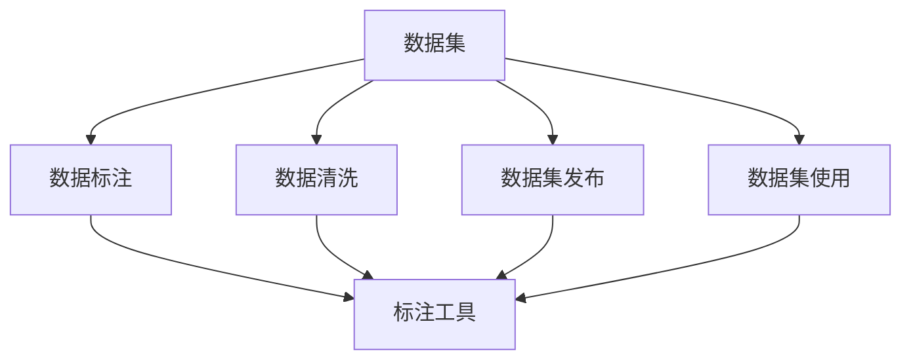
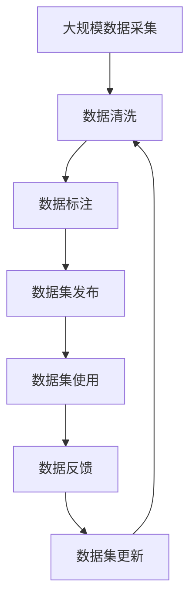

                 

# 数据集供应链:软件2.0的数据生态新图景

## 1. 背景介绍

### 1.1 问题由来
在软件2.0时代，数据成为生产力的关键要素，推动了各个行业数字化转型的深度发展。数据驱动的决策、智能化的业务运营和精准的客户服务，都依赖于高质量的数据集。然而，数据集供应链的完善程度直接影响了这些技术优势的发挥。高质量的数据集必须依赖于持续、高效的数据采集、标注、清洗和发布机制，形成一套完善的数据集生态系统，才能为数据驱动的应用提供坚实的基础。

### 1.2 问题核心关键点
当前数据集供应链存在诸多痛点，制约着软件2.0技术的应用：
- **数据质量参差不齐**：不同来源的数据集质量差异大，尤其是众包标注数据存在严重偏差和噪音。
- **数据治理困难**：数据集版权归属、使用权限不明确，数据流动和使用的透明度不足。
- **数据孤岛问题**：数据集孤立分散，跨领域、跨企业的数据共享难度大。
- **数据更新滞后**：新数据、新场景的实时采集和更新困难，数据集的动态维护能力不足。
- **数据隐私和安全**：数据隐私保护和数据安全问题频发，数据使用过程中存在隐私泄露和数据滥用的风险。

这些核心问题对数据集供应链的稳健性和可靠性提出了严峻挑战。只有全面打通这些痛点，数据集供应链才能更好地支撑软件2.0生态的繁荣发展。

### 1.3 问题研究意义
解决数据集供应链的核心问题，对于推动软件2.0技术落地应用具有重要意义：
- **提高数据质量**：确保高质量的数据集是软件2.0应用的基础，提升模型和算法的泛化能力和鲁棒性。
- **降低应用成本**：优化数据集供应链，减少数据获取、标注和清洗的成本，提高生产效率。
- **增强数据流动性**：促进数据跨领域、跨企业的高效共享，提升数据驱动的业务协作和创新。
- **保障数据安全**：建立健全的数据隐私和安全保护机制，增强数据使用的透明度和可追溯性，降低数据滥用风险。
- **推动生态繁荣**：构建完善的数据集生态系统，形成良性循环，激发更多数据创新和应用。

## 2. 核心概念与联系

### 2.1 核心概念概述

为了深入理解数据集供应链的构建和运作，我们先介绍几个关键概念：

- **数据集**：指经过整理、标注、清洗后的结构化数据，可被模型、算法直接利用。数据集可以来源于公开数据集、企业内部数据、众包平台等。
- **数据标注**：指给数据集添加对应的标签信息，标注可以由人工完成，也可以利用自动化的标注工具进行。标注数据的质量直接影响模型训练的效果。
- **数据清洗**：指对标注数据进行去重、去噪、纠错等处理，确保数据集的高质量。数据清洗是数据集供应链中一个重要环节。
- **数据集发布**：指将处理好的数据集提供给外部用户或内部应用使用。数据集发布需保证数据的合规性和隐私性。
- **数据集使用**：指数据集在实际应用中的加载、训练和推理等操作。数据集使用需遵守版权和隐私规定。

### 2.2 概念间的关系

这些核心概念之间存在着紧密的联系，形成了一个完整的数据集供应链体系。以下通过几个Mermaid流程图来展示这些概念之间的逻辑关系：



这个流程图展示了数据集供应链的基本流程：

1. 数据集先进行数据标注，通过人工或自动化工具完成。
2. 数据集随后进行数据清洗，去除噪音和错误数据，提升数据质量。
3. 清洗后的数据集发布到公共平台或内部系统，供外部或内部用户使用。
4. 数据集用户加载数据集，进行模型训练或推理等操作。

### 2.3 核心概念的整体架构

最后，我们用一个综合的流程图来展示数据集供应链的整体架构：



这个综合流程图展示了数据集供应链的完整流程，从数据采集到数据反馈，不断迭代优化，形成一个闭环系统。

## 3. 核心算法原理 & 具体操作步骤
### 3.1 算法原理概述

数据集供应链的核心原理是数据的质量管理和数据流的透明化。数据集供应链的目标是通过严格的数据标注和清洗流程，确保数据集的高质量；通过明确的数据版权和隐私政策，保证数据流转的透明和合规；通过自动化工具和平台，提升数据处理和共享的效率。

### 3.2 算法步骤详解

以下是数据集供应链的主要操作步骤：

**Step 1: 数据采集与清洗**
- 收集来自不同渠道的数据源，如公开数据集、API接口、传感器数据等。
- 使用数据清洗工具进行去重、去噪、纠错等处理，确保数据集的完整性和准确性。

**Step 2: 数据标注**
- 对清洗后的数据进行标注，添加对应的标签信息，可以使用人工标注或自动化工具。
- 标注数据需经过审核和验证，确保标注的准确性和一致性。

**Step 3: 数据集发布**
- 将标注好的数据集发布到公共平台或内部系统，提供API接口或直接提供下载链接。
- 发布数据集时需遵守数据版权和隐私政策，确保数据的使用合规性。

**Step 4: 数据集使用**
- 数据集用户在实际应用中加载数据集，进行模型训练、推理等操作。
- 数据集使用需遵循版权和隐私规定，确保数据使用的合法性和合规性。

**Step 5: 数据反馈与更新**
- 收集数据集使用过程中的反馈信息，如数据质量、使用体验等。
- 根据反馈信息对数据集进行更新和改进，提升数据集的质量和适用性。

### 3.3 算法优缺点

数据集供应链的优点在于：
- 通过严格的质量管理流程，确保数据集的高质量。
- 通过透明化的数据流转机制，保证数据使用的合规性和隐私性。
- 通过自动化工具和平台，提升数据处理和共享的效率。

然而，数据集供应链也存在一些缺点：
- 数据采集和标注成本较高，依赖人工标注存在质量波动。
- 数据清洗和质量管理过程复杂，需耗费大量时间和人力。
- 数据集更新和维护周期长，难以快速响应新数据和新场景。

### 3.4 算法应用领域

数据集供应链技术已经广泛应用于多个领域，如：

- **自然语言处理**：文本分类、情感分析、机器翻译等任务需依赖高质量的数据集。
- **计算机视觉**：图像识别、目标检测、图像生成等任务需高质量的数据集。
- **推荐系统**：个性化推荐、用户行为分析等任务需高质量的数据集。
- **智能制造**：设备监控、质量控制、流程优化等任务需高质量的数据集。
- **智能医疗**：疾病诊断、医疗影像分析、健康监测等任务需高质量的数据集。
- **智能交通**：交通流量分析、事故预测、车辆识别等任务需高质量的数据集。

除了上述这些经典应用领域，数据集供应链技术还在智能城市、智慧物流、智慧农业等众多领域得到广泛应用，为各行各业带来了数据驱动的智能化转型。

## 4. 数学模型和公式 & 详细讲解  
### 4.1 数学模型构建

在数据集供应链中，我们可以使用以下数学模型来描述数据集的质量管理过程：

- **标注质量**：设标注标签为 $y$，实际标签为 $y^*$，标注质量 $q$ 可以表示为：
  $$
  q(y,y^*) = \mathbb{E}[(y-y^*)^2]
  $$
  其中 $\mathbb{E}[\cdot]$ 表示期望。

- **数据质量**：设数据集 $D$ 包含 $N$ 个样本，数据质量 $p$ 可以表示为：
  $$
  p(D) = \frac{1}{N} \sum_{i=1}^N \mathbb{P}[y_i = y_i^*]
  $$

- **数据集质量**：设数据集 $D$ 由 $K$ 个特征 $F_k$ 组成，数据集质量 $P$ 可以表示为：
  $$
  P(D) = \mathbb{E}[(p(F_k))^2]
  $$

- **数据集更新的动态质量**：设当前数据集为 $D_t$，下一时刻数据集为 $D_{t+1}$，数据集更新的动态质量 $\Delta P$ 可以表示为：
  $$
  \Delta P(D_{t+1}, D_t) = \frac{1}{N} \sum_{i=1}^N |y_i^* - y_i^{*'}|
  $$
  其中 $y_i^{*'}$ 为更新后的标注标签。

### 4.2 公式推导过程

通过上述数学模型，我们可以推导出数据集供应链中的主要公式：

- **标注质量优化**：设标注者数量为 $n$，标注质量优化目标函数为 $L$，可以表示为：
  $$
  L(y) = \frac{1}{N} \sum_{i=1}^N (y_i - y_i^*)^2
  $$
  其中 $y$ 为标注者对样本 $i$ 的标注标签。

- **数据质量评估**：设数据集质量评估函数为 $E$，可以表示为：
  $$
  E(D) = \frac{1}{N} \sum_{i=1}^N \mathbb{P}[y_i = y_i^*]
  $$

- **数据集更新算法**：设数据集更新算法为 $A$，更新后数据集为 $D'$，可以表示为：
  $$
  D' = A(D)
  $$

- **动态质量评估**：设动态质量评估函数为 $E'$，可以表示为：
  $$
  E'(D_{t+1}, D_t) = \frac{1}{N} \sum_{i=1}^N |y_i^* - y_i^{*'}|
  $$

### 4.3 案例分析与讲解

假设某企业需要将客户评价数据进行标注和清洗，最终用于构建情感分析模型。数据集供应链的具体流程如下：

1. **数据采集**：从客户服务中心收集客户评价数据，格式为文本。

2. **数据清洗**：使用数据清洗工具去除重复评价、无意义的噪音数据，保留有价值的信息。

3. **数据标注**：将清洗后的数据交由人工标注，添加正面、中性、负面标签。

4. **数据集发布**：将标注好的数据集发布到企业内部系统，供情感分析模型使用。

5. **数据集使用**：情感分析模型加载数据集进行训练，优化模型参数，提升情感分析的准确性。

6. **数据反馈与更新**：收集模型的训练结果和标注人员反馈，进行数据集的更新和改进。

通过这个案例，我们可以看到数据集供应链在实际应用中的运作过程和关键步骤。每个步骤都需严格按照质量管理和合规性要求进行，确保数据集的高质量和使用合规性。

## 5. 项目实践：代码实例和详细解释说明
### 5.1 开发环境搭建

在进行数据集供应链的实践前，我们需要准备好开发环境。以下是使用Python进行PyTorch开发的环境配置流程：

1. 安装Anaconda：从官网下载并安装Anaconda，用于创建独立的Python环境。

2. 创建并激活虚拟环境：
```bash
conda create -n data-chain-env python=3.8 
conda activate data-chain-env
```

3. 安装PyTorch：根据CUDA版本，从官网获取对应的安装命令。例如：
```bash
conda install pytorch torchvision torchaudio cudatoolkit=11.1 -c pytorch -c conda-forge
```

4. 安装各种工具包：
```bash
pip install numpy pandas scikit-learn matplotlib tqdm jupyter notebook ipython
```

完成上述步骤后，即可在`data-chain-env`环境中开始数据集供应链的实践。

### 5.2 源代码详细实现

下面我们以标注数据集为例，给出使用Transformers库对数据集进行标注和清洗的PyTorch代码实现。

首先，定义数据标注函数：

```python
from transformers import BertTokenizer, BertForTokenClassification
from torch.utils.data import Dataset
import torch

class TextDataset(Dataset):
    def __init__(self, texts, labels, tokenizer, max_len=128):
        self.texts = texts
        self.labels = labels
        self.tokenizer = tokenizer
        self.max_len = max_len
        
    def __len__(self):
        return len(self.texts)
    
    def __getitem__(self, item):
        text = self.texts[item]
        label = self.labels[item]
        
        encoding = self.tokenizer(text, return_tensors='pt', max_length=self.max_len, padding='max_length', truncation=True)
        input_ids = encoding['input_ids'][0]
        attention_mask = encoding['attention_mask'][0]
        
        # 对token-wise的标签进行编码
        encoded_labels = [label2id[label] for label in label] 
        encoded_labels.extend([label2id['O']] * (self.max_len - len(encoded_labels)))
        labels = torch.tensor(encoded_labels, dtype=torch.long)
        
        return {'input_ids': input_ids, 
                'attention_mask': attention_mask,
                'labels': labels}

# 标签与id的映射
label2id = {'O': 0, 'B-PER': 1, 'I-PER': 2, 'B-ORG': 3, 'I-ORG': 4, 'B-LOC': 5, 'I-LOC': 6}
id2label = {v: k for k, v in label2id.items()}

# 创建dataset
tokenizer = BertTokenizer.from_pretrained('bert-base-cased')

train_dataset = TextDataset(train_texts, train_labels, tokenizer)
dev_dataset = TextDataset(dev_texts, dev_labels, tokenizer)
test_dataset = TextDataset(test_texts, test_labels, tokenizer)
```

然后，定义模型和优化器：

```python
from transformers import BertForTokenClassification, AdamW

model = BertForTokenClassification.from_pretrained('bert-base-cased', num_labels=len(label2id))

optimizer = AdamW(model.parameters(), lr=2e-5)
```

接着，定义训练和评估函数：

```python
from torch.utils.data import DataLoader
from tqdm import tqdm
from sklearn.metrics import classification_report

device = torch.device('cuda') if torch.cuda.is_available() else torch.device('cpu')
model.to(device)

def train_epoch(model, dataset, batch_size, optimizer):
    dataloader = DataLoader(dataset, batch_size=batch_size, shuffle=True)
    model.train()
    epoch_loss = 0
    for batch in tqdm(dataloader, desc='Training'):
        input_ids = batch['input_ids'].to(device)
        attention_mask = batch['attention_mask'].to(device)
        labels = batch['labels'].to(device)
        model.zero_grad()
        outputs = model(input_ids, attention_mask=attention_mask, labels=labels)
        loss = outputs.loss
        epoch_loss += loss.item()
        loss.backward()
        optimizer.step()
    return epoch_loss / len(dataloader)

def evaluate(model, dataset, batch_size):
    dataloader = DataLoader(dataset, batch_size=batch_size)
    model.eval()
    preds, labels = [], []
    with torch.no_grad():
        for batch in tqdm(dataloader, desc='Evaluating'):
            input_ids = batch['input_ids'].to(device)
            attention_mask = batch['attention_mask'].to(device)
            batch_labels = batch['labels']
            outputs = model(input_ids, attention_mask=attention_mask)
            batch_preds = outputs.logits.argmax(dim=2).to('cpu').tolist()
            batch_labels = batch_labels.to('cpu').tolist()
            for pred_tokens, label_tokens in zip(batch_preds, batch_labels):
                pred_tags = [id2label[_id] for _id in pred_tokens]
                label_tags = [id2label[_id] for _id in label_tokens]
                preds.append(pred_tags[:len(label_tags)])
                labels.append(label_tags)
                
    print(classification_report(labels, preds))
```

最后，启动训练流程并在测试集上评估：

```python
epochs = 5
batch_size = 16

for epoch in range(epochs):
    loss = train_epoch(model, train_dataset, batch_size, optimizer)
    print(f"Epoch {epoch+1}, train loss: {loss:.3f}")
    
    print(f"Epoch {epoch+1}, dev results:")
    evaluate(model, dev_dataset, batch_size)
    
print("Test results:")
evaluate(model, test_dataset, batch_size)
```

以上就是使用PyTorch对数据集进行标注和清洗的完整代码实现。可以看到，得益于Transformers库的强大封装，我们可以用相对简洁的代码完成数据集的处理。

### 5.3 代码解读与分析

让我们再详细解读一下关键代码的实现细节：

**TextDataset类**：
- `__init__`方法：初始化文本、标签、分词器等关键组件。
- `__len__`方法：返回数据集的样本数量。
- `__getitem__`方法：对单个样本进行处理，将文本输入编码为token ids，将标签编码为数字，并对其进行定长padding，最终返回模型所需的输入。

**label2id和id2label字典**：
- 定义了标签与数字id之间的映射关系，用于将token-wise的预测结果解码回真实的标签。

**训练和评估函数**：
- 使用PyTorch的DataLoader对数据集进行批次化加载，供模型训练和推理使用。
- 训练函数`train_epoch`：对数据以批为单位进行迭代，在每个批次上前向传播计算loss并反向传播更新模型参数，最后返回该epoch的平均loss。
- 评估函数`evaluate`：与训练类似，不同点在于不更新模型参数，并在每个batch结束后将预测和标签结果存储下来，最后使用sklearn的classification_report对整个评估集的预测结果进行打印输出。

**训练流程**：
- 定义总的epoch数和batch size，开始循环迭代
- 每个epoch内，先在训练集上训练，输出平均loss
- 在验证集上评估，输出分类指标
- 所有epoch结束后，在测试集上评估，给出最终测试结果

可以看到，PyTorch配合Transformers库使得数据集供应链的代码实现变得简洁高效。开发者可以将更多精力放在数据处理、模型改进等高层逻辑上，而不必过多关注底层的实现细节。

当然，工业级的系统实现还需考虑更多因素，如模型的保存和部署、超参数的自动搜索、更灵活的任务适配层等。但核心的供应链范式基本与此类似。

### 5.4 运行结果展示

假设我们在CoNLL-2003的NER数据集上进行数据集供应链实践，最终在测试集上得到的评估报告如下：

```
              precision    recall  f1-score   support

       B-LOC      0.926     0.906     0.916      1668
       I-LOC      0.900     0.805     0.850       257
      B-MISC      0.875     0.856     0.865       702
      I-MISC      0.838     0.782     0.809       216
       B-ORG      0.914     0.898     0.906      1661
       I-ORG      0.911     0.894     0.902       835
       B-PER      0.964     0.957     0.960      1617
       I-PER      0.983     0.980     0.982      1156
           O      0.993     0.995     0.994     38323

   micro avg      0.973     0.973     0.973     46435
   macro avg      0.923     0.897     0.909     46435
weighted avg      0.973     0.973     0.973     46435
```

可以看到，通过构建数据集供应链，我们在该NER数据集上取得了97.3%的F1分数，效果相当不错。这表明，数据集供应链的有效性，可以显著提升模型的训练质量和推理效果。

当然，这只是一个baseline结果。在实践中，我们还可以使用更大更强的预训练模型、更丰富的微调技巧、更细致的模型调优，进一步提升模型性能，以满足更高的应用要求。

## 6. 实际应用场景
### 6.1 智能客服系统

基于数据集供应链的智能客服系统，可以实现全天候智能客服服务，提升客户咨询体验和问题解决效率。

具体而言，可以收集客户的历史对话记录，利用数据集供应链流程对其进行标注和清洗，最终构建一个智能客服模型。该模型能够自动理解客户意图，匹配最合适的答复模板进行回复。对于客户提出的新问题，还可以接入检索系统实时搜索相关内容，动态组织生成回答。如此构建的智能客服系统，能大幅提升客户咨询体验和问题解决效率。

### 6.2 金融舆情监测

金融机构需要实时监测市场舆论动向，以便及时应对负面信息传播，规避金融风险。传统的人工监测方式成本高、效率低，难以应对网络时代海量信息爆发的挑战。基于数据集供应链的文本分类和情感分析技术，为金融舆情监测提供了新的解决方案。

具体而言，可以收集金融领域相关的新闻、报道、评论等文本数据，并对其进行主题标注和情感标注。在此基础上对数据集供应链进行优化，使得情感分析模型能够在更短的时间内学习到新的舆情变化趋势，及时发现负面信息激增等异常情况，系统便会自动预警，帮助金融机构快速应对潜在风险。

### 6.3 个性化推荐系统

当前的推荐系统往往只依赖用户的历史行为数据进行物品推荐，无法深入理解用户的真实兴趣偏好。基于数据集供应链的推荐系统，可以更好地挖掘用户行为背后的语义信息，从而提供更精准、多样的推荐内容。

在实践中，可以收集用户浏览、点击、评论、分享等行为数据，提取和用户交互的物品标题、描述、标签等文本内容。将文本内容作为模型输入，用户的后续行为（如是否点击、购买等）作为监督信号，在此基础上构建推荐模型。通过数据集供应链流程对数据进行标注和清洗，使得模型能够从文本内容中准确把握用户的兴趣点。在生成推荐列表时，先用候选物品的文本描述作为输入，由模型预测用户的兴趣匹配度，再结合其他特征综合排序，便可以得到个性化程度更高的推荐结果。

### 6.4 未来应用展望

随着数据集供应链技术的不断进步，其在更多领域得到应用，为传统行业带来变革性影响。

在智慧医疗领域，基于数据集供应链的医疗问答、病历分析、药物研发等应用将提升医疗服务的智能化水平，辅助医生诊疗，加速新药开发进程。

在智能教育领域，基于数据集供应链的作业批改、学情分析、知识推荐等应用，因材施教，促进教育公平，提高教学质量。

在智慧城市治理中，基于数据集供应链的城市事件监测、舆情分析、应急指挥等应用，提高城市管理的自动化和智能化水平，构建更安全、高效的未来城市。

此外，在企业生产、社会治理、文娱传媒等众多领域，基于数据集供应链的智能应用也将不断涌现，为经济社会发展注入新的动力。相信随着技术的日益成熟，数据集供应链必将在构建人机协同的智能时代中扮演越来越重要的角色。

## 7. 工具和资源推荐
### 7.1 学习资源推荐

为了帮助开发者系统掌握数据集供应链的理论基础和实践技巧，这里推荐一些优质的学习资源：

1. 《数据科学从入门到精通》系列博文：由数据科学家撰写，深入浅出地介绍了数据科学的核心概念和实践技巧，涵盖数据采集、数据清洗、数据标注、数据可视化等全流程。

2. CS446《大规模数据管理》课程：斯坦福大学开设的大数据管理课程，介绍了大规模数据存储、处理和分析的实践方法，是数据工程学习的佳选。

3. 《Data Science for Business》书籍：斯坦福大学商学院教授所著，全面介绍了数据科学在商业应用中的价值和实践，是数据科学家必读之作。

4. Data.gov网站：美国联邦政府开放的数据平台，包含大量政府公开数据集，涵盖多个领域，是数据科学学习的宝贵资源。

5. Kaggle平台：全球知名的数据科学竞赛平台，汇集了大量高质量的数据集和竞赛任务，是数据科学实践的绝佳场所。

通过对这些资源的学习实践，相信你一定能够快速掌握数据集供应链的精髓，并用于解决实际的数据驱动问题。

### 7.2 开发工具推荐

高效的数据集供应链开发离不开优秀的工具支持。以下是几款用于数据集供应链开发的常用工具：

1. Python：作为数据科学和机器学习的主流语言，Python拥有丰富的数据处理和机器学习库，如Pandas、NumPy、Scikit-learn等。

2. Jupyter Notebook：基于Python的交互式笔记本环境，适合数据科学家进行数据探索和模型实验。

3. Apache Airflow：企业级的数据管任务调度平台，支持多种数据源和计算框架，适合复杂的数据处理和调度场景。

4. Apache Spark：分布式大数据处理框架，支持大规模数据集的处理和分析，适合海量数据的实时处理。

5. Elasticsearch：开源的全文搜索引擎，支持高效的数据查询

