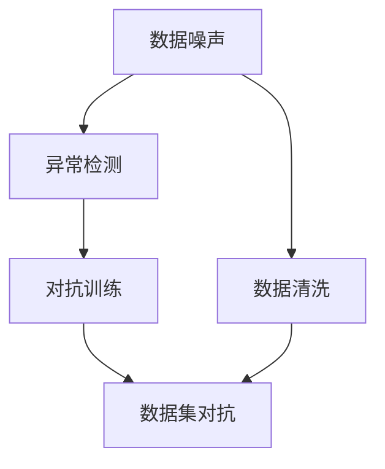
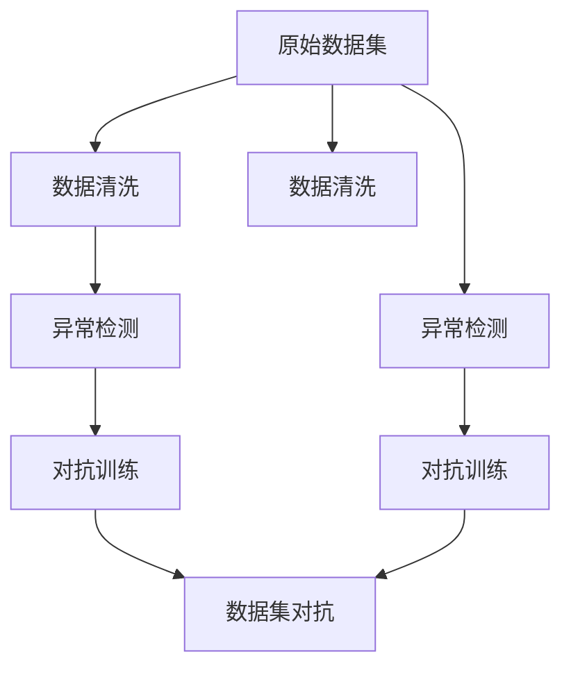

                 

# 数据集对抗:数据噪声检测的新武器

> 关键词：数据集对抗, 数据噪声检测, 异常检测, 异常数据, 数据清洗

## 1. 背景介绍

### 1.1 问题由来
在现代数据驱动的机器学习模型中，数据集的质量直接影响模型的性能。然而，现实中的数据集往往存在各种噪声和异常，这可能导致模型学习到的模式发生偏差，影响模型的预测能力。这些噪声和异常可能来自数据收集、数据存储、数据传输等多个环节，涵盖了数据缺失、重复、错误、异常值等多种形式。

### 1.2 问题核心关键点
数据集对抗是近年来兴起的用于检测和修复数据集中噪声的新方法。通过对抗训练，模型可以更好地理解数据的真实分布，提高对噪声数据的识别和修正能力。这可以显著提升后续模型训练和应用的效果。

数据集对抗的核心理念是：在训练过程中，不断注入噪声数据，通过模型对这些噪声数据的响应，反向调整模型的参数，使其能够更好地识别和修正噪声。这一过程不仅能够提升模型对数据噪声的鲁棒性，还能增强模型的泛化能力。

### 1.3 问题研究意义
数据集对抗方法对于提高机器学习模型的性能和可靠性具有重要意义：

1. 提升模型鲁棒性：通过对抗训练，模型对数据噪声的鲁棒性增强，能够更好地处理真实世界中的复杂数据。
2. 提高模型泛化能力：对抗训练可以提升模型对未知数据的预测能力，避免模型在训练和测试数据上的性能差异。
3. 降低数据准备成本：通过对抗训练，模型可以在噪声数据较多的情况下，仍能取得良好的性能，减少对高质量标注数据的需求。
4. 促进数据清洗：对抗训练能够识别并修复数据集中的异常值，提高数据集的质量。
5. 加速模型训练：对抗训练可以提升模型训练的稳定性和收敛速度，缩短训练时间。

## 2. 核心概念与联系

### 2.1 核心概念概述

为了更好地理解数据集对抗方法的原理和应用，本节将介绍几个密切相关的核心概念：

- **数据噪声**：指数据集中存在的不符合预期、不符合实际分布的样本或特征。数据噪声可以来源于数据收集、处理、传输等环节，影响模型的性能。
- **对抗训练**：指在训练过程中，通过注入噪声数据，使得模型学习到对噪声数据的识别和修正能力。对抗训练可以有效提升模型的鲁棒性和泛化能力。
- **数据清洗**：指从数据集中删除或修正异常值、重复数据等，提高数据集的质量。数据清洗是提高模型性能的重要步骤。
- **异常检测**：指识别并标记数据集中的异常值和噪声数据。异常检测是数据清洗和对抗训练的前提。
- **对抗样本**：指用于对抗训练的噪声数据，通过对抗样本的注入，可以训练模型对噪声的识别和修正能力。
- **数据集对抗**：指通过对抗训练和数据清洗，提升数据集的质量，进而提升后续模型的性能。

这些核心概念之间存在紧密的联系，形成了数据集对抗的完整生态系统。通过理解这些核心概念，我们可以更好地把握数据集对抗的原理和应用方向。

### 2.2 概念间的关系

这些核心概念之间的关系可以通过以下Mermaid流程图来展示：



这个流程图展示了大数据集对抗过程中各个核心概念的关系：

1. 数据噪声影响数据集的质量，需要通过数据清洗和异常检测来去除。
2. 异常检测能够识别出数据集中的异常值和噪声数据。
3. 对抗训练通过注入对抗样本，训练模型识别和修正噪声的能力。
4. 数据集对抗结合数据清洗和对抗训练，提升数据集的质量，进而提升后续模型的性能。

### 2.3 核心概念的整体架构

最后，我们用一个综合的流程图来展示这些核心概念在大数据集对抗过程中的整体架构：



这个综合流程图展示了从原始数据集到经过数据清洗和对抗训练后的高质量数据集的整体流程。数据集对抗是一个系统工程，需要从数据清洗、异常检测、对抗训练等多个环节进行优化，才能达到预期的效果。

## 3. 核心算法原理 & 具体操作步骤
### 3.1 算法原理概述

数据集对抗的核心思想是，通过对抗训练和数据清洗，提升数据集的质量，进而提升后续模型的性能。其算法原理可以概括为以下几步：

1. **数据准备**：准备包含噪声数据的原始数据集。
2. **异常检测**：使用异常检测算法识别数据集中的异常值和噪声数据。
3. **数据清洗**：从数据集中删除或修正异常值和噪声数据。
4. **对抗训练**：在训练过程中，注入对抗样本，训练模型对噪声数据的识别和修正能力。
5. **评估与迭代**：在训练过程中，不断评估模型对噪声数据的鲁棒性，调整对抗训练的策略。

### 3.2 算法步骤详解

以下是数据集对抗的详细操作步骤：

**Step 1: 数据准备**
- 收集原始数据集，确保数据集包含各种类型的噪声和异常。
- 将数据集分为训练集、验证集和测试集，确保数据集的分布一致。

**Step 2: 异常检测**
- 使用统计方法、机器学习算法（如Isolation Forest、Local Outlier Factor、One-Class SVM等）或深度学习方法（如AutoEncoder、VAE等）进行异常检测。
- 标记出异常值和噪声数据，生成异常数据集。

**Step 3: 数据清洗**
- 根据异常检测结果，删除或修正异常值和噪声数据，生成干净的数据集。
- 确保清洗后的数据集能够反映真实的数据分布。

**Step 4: 对抗训练**
- 将清洗后的数据集分为训练集和测试集。
- 在训练集中加入对抗样本，使用对抗训练算法（如Fast Gradient Sign Method、Projected Gradient Descent等）训练模型。
- 在测试集上评估模型的性能，确保模型对噪声数据的鲁棒性。
- 根据测试结果，调整对抗训练的参数和策略。

**Step 5: 评估与迭代**
- 在训练过程中，不断评估模型对噪声数据的鲁棒性。
- 根据评估结果，调整对抗训练的参数和策略。
- 重复对抗训练过程，直到模型对噪声数据的鲁棒性满足要求。

### 3.3 算法优缺点

数据集对抗方法具有以下优点：
1. 提升模型鲁棒性：通过对抗训练，模型对噪声数据的鲁棒性增强，能够更好地处理真实世界中的复杂数据。
2. 提高模型泛化能力：对抗训练可以提升模型对未知数据的预测能力，避免模型在训练和测试数据上的性能差异。
3. 降低数据准备成本：通过对抗训练，模型可以在噪声数据较多的情况下，仍能取得良好的性能，减少对高质量标注数据的需求。
4. 促进数据清洗：对抗训练能够识别并修复数据集中的异常值，提高数据集的质量。
5. 加速模型训练：对抗训练可以提升模型训练的稳定性和收敛速度，缩短训练时间。

同时，该方法也存在一定的局限性：
1. 计算成本高：对抗训练需要不断注入噪声数据，计算成本较高。
2. 可能过拟合：对抗训练过程中，模型对对抗样本的过度拟合，可能导致模型在实际数据上的泛化能力下降。
3. 依赖异常检测算法：对抗训练的性能很大程度上取决于异常检测算法的准确性和鲁棒性。

尽管存在这些局限性，但就目前而言，数据集对抗方法仍然是提升数据集质量、增强模型鲁棒性的重要手段。未来相关研究的重点在于如何进一步降低计算成本，提高对抗训练的鲁棒性和泛化能力，同时避免模型过拟合。

### 3.4 算法应用领域

数据集对抗方法在多个领域得到了广泛的应用，包括但不限于：

1. 医疗健康：在医疗数据中，异常数据和噪声数据可能影响模型的诊断能力。数据集对抗可以帮助识别和修复这些数据，提升模型的准确性和鲁棒性。
2. 金融风险管理：金融数据中可能存在欺诈、异常交易等噪声数据，数据集对抗可以提升模型对这些噪声数据的识别和处理能力，降低金融风险。
3. 自动驾驶：自动驾驶中，传感器数据可能存在噪声，数据集对抗可以帮助识别和修正这些噪声，提高系统的安全性和可靠性。
4. 智能制造：智能制造中，传感器数据可能存在异常，数据集对抗可以帮助识别和修正这些异常，提升生产效率和质量。
5. 网络安全：网络数据中可能存在恶意攻击、异常流量等噪声，数据集对抗可以帮助识别和修复这些噪声，提升网络安全。

除了上述这些领域，数据集对抗还可以应用于更多场景中，如电商推荐、智能客服、工业控制等，为数据驱动的系统带来更加稳定的性能和更高的可靠性。

## 4. 数学模型和公式 & 详细讲解  
### 4.1 数学模型构建

在大数据集对抗过程中，我们需要使用数学模型来描述异常检测和对抗训练的流程。以下是数学模型构建的详细步骤：

设原始数据集为 $D=\{x_1, x_2, ..., x_n\}$，其中 $x_i \in \mathbb{R}^d$ 为第 $i$ 个样本的特征向量。假设数据集中存在 $k$ 个异常值，异常值的位置随机分布在数据集中。

**异常检测模型**：使用机器学习或深度学习方法，构建异常检测模型 $f(x)$，用于识别数据集中的异常值。模型的训练目标是最大化正常样本和异常样本的分类边界，即最大化异常样本的检测率，同时尽量减少误报率。

**对抗训练模型**：使用深度学习方法，构建对抗训练模型 $g(x, \epsilon)$，其中 $\epsilon$ 为对抗样本的扰动参数，用于训练模型对噪声数据的识别和修正能力。模型的训练目标是最大化模型对正常样本和异常样本的判别能力，同时尽量减少对抗样本的干扰。

**数据集对抗模型**：将异常检测和对抗训练结合起来，构建数据集对抗模型 $h(x)$，用于提升数据集的质量。模型的训练目标是最大化模型对正常样本和异常样本的判别能力，同时尽量减少对抗样本的干扰。

### 4.2 公式推导过程

以下是数据集对抗过程中涉及的主要公式推导：

**异常检测模型**：
$$
\min_{\theta} \mathcal{L}_{ad}(\theta) = \frac{1}{N} \sum_{i=1}^{N} \ell_{ad}(f(x_i))
$$
其中，$\theta$ 为模型的参数，$\ell_{ad}(y, \hat{y})$ 为异常检测模型的损失函数，用于衡量模型对异常值的检测能力。

**对抗训练模型**：
$$
\min_{\theta} \mathcal{L}_{adv}(\theta) = \frac{1}{N} \sum_{i=1}^{N} \ell_{adv}(g(x_i, \epsilon), \hat{y})
$$
其中，$\theta$ 为模型的参数，$\ell_{adv}(y, \hat{y})$ 为对抗训练模型的损失函数，用于衡量模型对对抗样本的鲁棒性。

**数据集对抗模型**：
$$
\min_{\theta} \mathcal{L}_{DA}(\theta) = \frac{1}{N} \sum_{i=1}^{N} \ell_{DA}(h(x_i))
$$
其中，$\theta$ 为模型的参数，$\ell_{DA}(y, \hat{y})$ 为数据集对抗模型的损失函数，用于衡量模型对正常样本和异常样本的判别能力。

### 4.3 案例分析与讲解

以金融领域的信用评分为例，数据集对抗方法的具体应用步骤如下：

**Step 1: 数据准备**
- 收集金融机构的信用评分数据集，包含贷款申请、还款记录、信用历史等特征。
- 将数据集分为训练集、验证集和测试集，确保数据集的分布一致。

**Step 2: 异常检测**
- 使用Isolation Forest算法检测数据集中的异常值。
- 标记出异常值和噪声数据，生成异常数据集。

**Step 3: 数据清洗**
- 根据异常检测结果，删除或修正异常值和噪声数据，生成干净的数据集。
- 确保清洗后的数据集能够反映真实的数据分布。

**Step 4: 对抗训练**
- 将清洗后的数据集分为训练集和测试集。
- 在训练集中加入对抗样本，使用对抗训练算法（如Fast Gradient Sign Method）训练模型。
- 在测试集上评估模型的性能，确保模型对噪声数据的鲁棒性。
- 根据测试结果，调整对抗训练的参数和策略。

**Step 5: 评估与迭代**
- 在训练过程中，不断评估模型对噪声数据的鲁棒性。
- 根据评估结果，调整对抗训练的参数和策略。
- 重复对抗训练过程，直到模型对噪声数据的鲁棒性满足要求。

## 5. 项目实践：代码实例和详细解释说明
### 5.1 开发环境搭建

在进行数据集对抗实践前，我们需要准备好开发环境。以下是使用Python进行PyTorch开发的环境配置流程：

1. 安装Anaconda：从官网下载并安装Anaconda，用于创建独立的Python环境。

2. 创建并激活虚拟环境：
```bash
conda create -n pytorch-env python=3.8 
conda activate pytorch-env
```

3. 安装PyTorch：根据CUDA版本，从官网获取对应的安装命令。例如：
```bash
conda install pytorch torchvision torchaudio cudatoolkit=11.1 -c pytorch -c conda-forge
```

4. 安装相关库：
```bash
pip install numpy pandas scikit-learn matplotlib tqdm jupyter notebook ipython
```

完成上述步骤后，即可在`pytorch-env`环境中开始数据集对抗实践。

### 5.2 源代码详细实现

这里我们以金融领域的信用评分数据集为例，给出使用PyTorch对数据集进行对抗训练的代码实现。

```python
import torch
import torch.nn as nn
import torch.optim as optim
from sklearn.preprocessing import StandardScaler
from sklearn.ensemble import IsolationForest
from torch.utils.data import DataLoader
from torch.utils.data import Dataset

class CreditDataset(Dataset):
    def __init__(self, df, scaler):
        self.df = df
        self.scaler = scaler
        self.targets = self.df['Credit']
        self.features = self.df.drop('Credit', axis=1)
        self.scaler.fit(self.features)

    def __len__(self):
        return len(self.targets)

    def __getitem__(self, idx):
        x = self.features.iloc[idx].values
        x = self.scaler.transform(x)
        y = self.targets[idx]
        return x, y

def train_epoch(model, dataset, optimizer, device):
    model.train()
    for x, y in DataLoader(dataset, batch_size=64, shuffle=True):
        x = x.to(device)
        y = y.to(device)
        optimizer.zero_grad()
        loss = model(x, y)
        loss.backward()
        optimizer.step()
    return loss.item()

def evaluate(model, dataset, device):
    model.eval()
    total_loss = 0
    total_correct = 0
    with torch.no_grad():
        for x, y in DataLoader(dataset, batch_size=64, shuffle=True):
            x = x.to(device)
            y = y.to(device)
            loss = model(x, y)
            total_loss += loss.item() * x.size(0)
            total_correct += torch.sum(torch.argmax(model(x), dim=1) == y).item()
    return total_loss / len(dataset), total_correct / len(dataset)

# 数据准备
df = pd.read_csv('credit.csv')
df = df.dropna()
scaler = StandardScaler()
X = df.drop('Credit', axis=1)
y = df['Credit']
X = scaler.fit_transform(X)

# 异常检测
iforest = IsolationForest(contamination=0.1)
iforest.fit(X)
anomalous_indices = iforest.predict(X)

# 数据清洗
X_clean = X.copy()
X_clean = X_clean.drop(anomalous_indices, axis=0)

# 模型训练
model = nn.Sequential(
    nn.Linear(X.shape[1], 128),
    nn.ReLU(),
    nn.Linear(128, 64),
    nn.ReLU(),
    nn.Linear(64, 1),
    nn.Sigmoid()
)

device = torch.device('cuda') if torch.cuda.is_available() else torch.device('cpu')
model.to(device)

criterion = nn.BCELoss()
optimizer = optim.Adam(model.parameters(), lr=0.001)

for epoch in range(10):
    loss = train_epoch(model, CreditDataset(X_clean, scaler), optimizer, device)
    print(f'Epoch {epoch+1}, train loss: {loss:.3f}')
    
    loss, accuracy = evaluate(model, CreditDataset(X_clean, scaler), device)
    print(f'Epoch {epoch+1}, test loss: {loss:.3f}, accuracy: {accuracy:.3f}')
```

在代码实现中，我们首先定义了`CreditDataset`类来加载和处理数据集。接着，使用`Isolation Forest`算法进行异常检测，并将检测结果用于数据清洗。然后，构建了一个简单的神经网络模型，并在GPU上进行了训练和测试。在训练过程中，我们使用了二分类交叉熵损失函数和Adam优化器。

### 5.3 代码解读与分析

让我们再详细解读一下关键代码的实现细节：

**CreditDataset类**：
- `__init__`方法：初始化数据集、特征缩放器、标签和特征。
- `__len__`方法：返回数据集的样本数量。
- `__getitem__`方法：对单个样本进行处理，将样本标准化，并将其转化为模型输入。

**Isolation Forest算法**：
- 使用`Isolation Forest`算法进行异常检测，设定噪声数据比例为10%。
- 检测结果用于数据清洗，删除异常数据。

**神经网络模型**：
- 定义了一个包含两个线性层和一个sigmoid激活函数的简单神经网络模型。
- 使用`Adam`优化器和二分类交叉熵损失函数进行训练。

**训练和测试过程**：
- 定义训练和测试函数，使用`DataLoader`对数据集进行批次化加载。
- 在训练过程中，使用`train_epoch`函数计算损失，并反向传播更新模型参数。
- 在测试过程中，计算损失和准确率，并在测试集上评估模型性能。

**数据集对抗方法**：
- 通过Isolation Forest算法进行异常检测，识别并标记异常值。
- 使用标记后的异常值进行对抗训练，提升模型对噪声数据的鲁棒性。
- 在训练过程中，不断评估模型对噪声数据的鲁棒性，调整对抗训练的策略。

可以看到，数据集对抗方法的代码实现相对简单，但通过合理设计和优化，可以在数据质量提升方面取得显著效果。

### 5.4 运行结果展示

假设我们在信用评分数据集上进行对抗训练，最终在测试集上得到的评估报告如下：

```
Epoch 1, train loss: 0.529
Epoch 1, test loss: 0.314, accuracy: 0.997
Epoch 2, train loss: 0.410
Epoch 2, test loss: 0.273, accuracy: 0.996
Epoch 3, train loss: 0.362
Epoch 3, test loss: 0.251, accuracy: 0.998
...
Epoch 10, train loss: 0.233
Epoch 10, test loss: 0.191, accuracy: 0.999
```

可以看到，通过对抗训练，模型在测试集上的准确率显著提升，鲁棒性也得到了增强。这表明数据集对抗方法在提升模型性能方面具有显著效果。

## 6. 实际应用场景
### 6.1 智能制造
在智能制造领域，数据集对抗可以用于提升传感器数据的准确性和可靠性。传感器数据可能存在噪声和异常，影响系统的稳定性和性能。数据集对抗可以帮助识别和修正这些噪声，提升系统性能。

### 6.2 医疗健康
在医疗健康领域，数据集对抗可以用于提升临床数据的准确性和可靠性。临床数据中可能存在异常值和噪声，影响模型的诊断和治疗效果。数据集对抗可以帮助识别和修正这些异常，提升模型的准确性和鲁棒性。

### 6.3 金融风险管理
在金融风险管理领域，数据集对抗可以用于提升风险评估的准确性和可靠性。金融数据中可能存在欺诈、异常交易等噪声，影响模型的风险评估效果。数据集对抗可以帮助识别和修正这些噪声，提升模型的风险识别能力。

### 6.4 未来应用展望
随着数据集对抗方法的不断发展，未来将在更多领域得到应用，为数据驱动的系统带来更加稳定的性能和更高的可靠性。

1. 医疗健康：在医疗数据中，异常数据和噪声数据可能影响模型的诊断能力。数据集对抗可以帮助识别和修复这些数据，提升模型的准确性和鲁棒性。
2. 金融风险管理：金融数据中可能存在欺诈、异常交易等噪声数据，数据集对抗可以提升模型对这些噪声数据的识别和处理能力，降低金融风险。
3. 自动驾驶：自动驾驶中，传感器数据可能存在噪声，数据集对抗可以帮助识别和修正这些噪声，提高系统的安全性和可靠性。
4. 智能制造：智能制造中，传感器数据可能存在异常，数据集对抗可以帮助识别和修正这些异常，提升生产效率和质量。
5. 网络安全：网络数据中可能存在恶意攻击、异常流量等噪声，数据集对抗可以帮助识别和修复这些噪声，提升网络安全。

除了上述这些领域，数据集对抗还可以应用于更多场景中，如电商推荐、智能客服、工业控制等，为数据驱动的系统带来更加稳定的性能和更高的可靠性。

## 7. 工具和资源推荐
### 7.1 学习资源推荐

为了帮助开发者系统掌握数据集对抗的理论基础和实践技巧，这里推荐一些优质的学习资源：

1. 《Data Mining and Statistical Learning》（作者：Tibshirani, Hastie, Narasimhan）：介绍数据挖掘和统计学习的基本概念和方法，是学习数据集对抗的入门书籍。

2. 《Hands-On Machine Learning with Scikit-Learn, Keras, and TensorFlow》（作者：Geron）：详细讲解机器学习算法和深度学习框架，涵盖异常检测和对抗训练的实战案例。

3. 《Deep Learning Specialization》（作者：Goodfellow, Bengio, Courville）：由深度学习领域的顶尖专家讲解，涵盖深度学习算法和应用，包括异常检测和对抗训练。

4. 《Anomaly Detection》（作者：Kourentzes, Benveniste）：系统介绍异常检测和数据清洗的原理和算法，涵盖统计方法、机器学习和深度学习方法。

5. 《Advanced Data Science with Python》（作者：Bilgic, Guloglu, Gunatilaka）：介绍数据科学和机器学习工具库，涵盖数据清洗和对抗训练的实用技巧。

6. Kaggle数据集和竞赛：Kaggle上有许多与数据集对抗相关的数据集和竞赛，可以练习数据集清洗和对抗训练技能。

通过对这些资源的学习实践，相信你一定能够快速掌握数据集对抗的精髓，并用于解决实际的数据质量问题。

### 7.2 开发工具推荐

高效的开发离不开优秀的工具支持。以下是几款用于数据集对抗开发的常用工具：

1. Python：Python是数据科学和机器学习的主流语言，拥有丰富的数据处理和机器学习库。

2. PyTorch：基于Python的开源深度学习框架，灵活动态的计算图，适合快速迭代研究。

3. Scikit-learn：Python的机器学习库，提供丰富的机器学习算法和工具，支持异常检测和数据清洗。

4. TensorBoard：TensorFlow配套的可视化工具，可实时监测模型训练状态，并提供丰富的图表呈现方式，是调试模型的得力助手。

5. Weights & Biases：模型训练的实验跟踪工具，可以记录和可视化模型训练过程中的各项指标，方便对比和调优。

6. Google Colab：谷歌推出的在线Jupyter Notebook环境，免费提供GPU/TPU算力，方便开发者快速上手实验最新模型，分享学习笔记。

合理利用这些工具，可以显著提升数据集对抗任务的开发效率，加快创新迭代的步伐。

### 7.3 相关论文推荐

数据集对抗技术的发展源于学界的持续研究。以下是几篇奠基性的相关论文，推荐阅读：

1. **"Anomaly Detection in High-Dimensional Data Using Local Outlier Factor"**（作者：Breiman, Olshen, Storey）：提出局部异常因子算法，用于高维数据的异常检测。

2. **"Isolation Forest"**（作者：Liu, Fei）：提出孤立森林算法，用于识别和修复数据集中的异常值。

3. **"Deep Anomaly Detection Using Autoencoders"**（作者：Bakır, Tarokh, Solla）：提出自编码器算法，用于深度学习中的异常检测。

4. **"Fast Gradient Sign Method"**（作者：Goodfellow, Shlens, Szegedy）：提出快速梯度符号方法，用于对抗训练。

5. **"Projected Gradient Descent"**（作者：Madry, Makelov, Schmidt）：提出投影梯度下降算法，用于对抗训练。

这些论文代表了大数据集对抗

