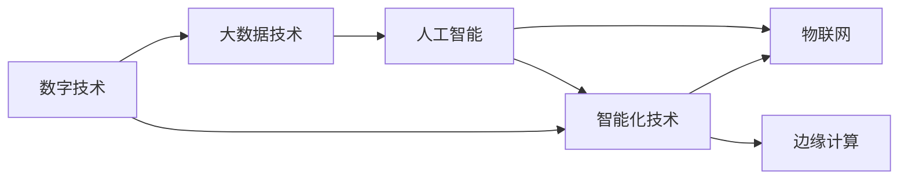
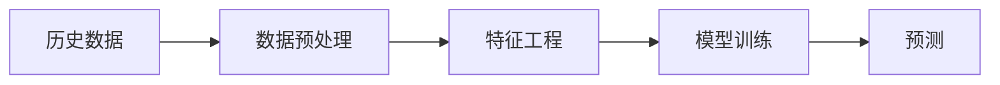

                 

# 数智时代的到来与发展趋势

数智时代，这一概念正逐渐成为未来的发展趋势，给各行各业带来了巨大的变革。在这一背景下，人工智能（AI）和大数据技术的作用愈发凸显。本文旨在深入探讨数智时代的到来背景，并分析其发展趋势及面临的挑战。我们将从背景介绍、核心概念与联系、核心算法原理、数学模型构建、项目实践、实际应用场景、工具和资源推荐、总结与未来展望等方面，全面梳理数智时代的发展脉络，为行业同仁提供参考。

## 1. 背景介绍

### 1.1 数智时代的概念

数智时代，即“数字（Digital）+智能（Smart）”时代，是指借助信息通信技术（ICT）和大数据技术，以数据驱动方式实现决策智能化、生产自动化和业务创新的新阶段。数字技术的发展为智能化提供了数据基础，智能化则进一步提升了数字化的价值。

### 1.2 数智时代的驱动力

数智时代的到来，主要由以下几方面驱动力推动：

1. **数据资源的丰富化**：物联网（IoT）、云计算、5G等技术的发展，使得数据采集、存储和处理能力大幅提升，数据资源愈发丰富。
2. **计算能力的提升**：高性能计算、量子计算等技术的进步，使得计算能力突破瓶颈，为智能化提供了坚实的技术基础。
3. **算法技术的突破**：机器学习、深度学习、自然语言处理等算法技术的发展，使智能化成为可能。
4. **应用场景的扩展**：数智技术在医疗、金融、制造、交通等领域的应用不断扩展，推动了产业的数字化转型。

## 2. 核心概念与联系

### 2.1 核心概念概述

1. **数字技术**：涉及信息技术（IT）和通信技术（CT），涵盖计算机硬件、软件、网络、数据等领域。
2. **智能化技术**：以数据驱动，涵盖机器学习、深度学习、自然语言处理、计算机视觉等技术，旨在提升决策和运营效率。
3. **大数据技术**：指大规模数据的采集、存储、处理和分析技术，包括数据挖掘、数据仓库、云计算等。
4. **人工智能**：通过算法使机器具备类人智能，包括学习、推理、自我修正等能力。
5. **物联网**：将物理对象通过网络连接到互联网，实现数据的实时采集和分析。
6. **边缘计算**：在数据源头进行计算和分析，减少延迟和带宽需求，提高效率。

### 2.2 概念间的关系

数智时代中的各种核心概念之间关系密切，通过数据驱动、算法赋能，形成了智能化技术体系，如图示：



数据通过数字技术采集和存储，再通过大数据技术进行处理和分析，最终在人工智能的算法支持下，实现智能化的决策和运营。物联网技术使得数据实时采集成为可能，边缘计算则在数据源头进行计算，提升了效率。

## 3. 核心算法原理 & 具体操作步骤

### 3.1 算法原理概述

数智时代中，数据驱动的智能化决策和运营，主要依赖于数据处理和算法分析。以机器学习为例，其核心原理是利用历史数据训练模型，预测未来结果。其流程如图：



数据预处理、特征工程、模型训练和预测是机器学习的主要步骤。在大数据时代，算法的可扩展性和可扩展性是关键。

### 3.2 算法步骤详解

以监督学习为例，其具体步骤包括：

1. **数据采集**：收集与问题相关的数据集。
2. **数据清洗**：处理缺失值、异常值等，确保数据质量。
3. **数据预处理**：包括标准化、归一化、降维等步骤。
4. **特征工程**：提取和构造有意义的特征，以提高模型的泛化能力。
5. **模型选择**：根据问题性质选择合适的算法模型。
6. **模型训练**：利用训练集对模型进行训练，得到最优参数。
7. **模型评估**：在验证集上评估模型性能，调整参数。
8. **模型预测**：利用训练好的模型对新数据进行预测。

### 3.3 算法优缺点

**优点**：

- **自适应能力强**：通过数据驱动，模型能够自适应不同场景。
- **决策过程透明**：基于数学模型，决策过程可解释、可追踪。
- **提升效率**：自动化数据处理和分析，提高运营效率。

**缺点**：

- **数据依赖性强**：模型依赖高质量、大量数据。
- **算法复杂度**：复杂的算法模型难以解释和调试。
- **过拟合风险**：模型在训练集上表现优秀，但在新数据上可能表现不佳。

### 3.4 算法应用领域

1. **金融领域**：利用机器学习进行信用评分、欺诈检测、投资策略等。
2. **医疗领域**：通过数据分析进行疾病预测、治疗方案优化等。
3. **制造领域**：利用预测维护、智能生产等提升效率。
4. **零售领域**：通过推荐算法提升用户体验，优化库存管理。
5. **交通领域**：利用数据分析进行交通流量预测、智能交通管理。

## 4. 数学模型和公式 & 详细讲解 & 举例说明

### 4.1 数学模型构建

以线性回归模型为例，其数学模型如下：

$$ y = \beta_0 + \sum_{i=1}^n \beta_i x_i + \epsilon $$

其中，$y$ 为预测值，$x_i$ 为输入特征，$\beta_0$ 为截距，$\beta_i$ 为权重系数，$\epsilon$ 为随机误差项。

### 4.2 公式推导过程

**最小二乘法**：

$$ \min_{\beta} \sum_{i=1}^n (y_i - \hat{y_i})^2 $$

通过最小二乘法，求解得到最优的权重系数 $\beta$。

**代码实现**：

```python
import numpy as np
from sklearn.linear_model import LinearRegression

# 数据集
x = np.array([[1, 2], [2, 4], [3, 6], [4, 8]])
y = np.array([2, 4, 6, 8])

# 线性回归模型
model = LinearRegression().fit(x, y)

# 预测新数据
x_new = np.array([[5, 10]])
y_new = model.predict(x_new)

print(y_new)
```

### 4.3 案例分析与讲解

**案例**：某电商平台的销售额预测。

**背景**：电商平台每月销售数据，包括时间、销售额、促销活动等。

**问题**：根据历史数据，预测未来三个月销售额。

**模型选择**：使用时间序列模型。

**数据预处理**：将时间序列数据转换为数值序列。

**特征工程**：提取历史销售额、促销活动等信息。

**模型训练**：利用历史数据训练模型，得到最优参数。

**模型评估**：在验证集上评估模型性能。

**模型预测**：利用训练好的模型预测未来销售额。

## 5. 项目实践：代码实例和详细解释说明

### 5.1 开发环境搭建

**环境要求**：

- Python 3.8以上
- numpy、pandas、scikit-learn、matplotlib

**安装**：

```bash
pip install numpy pandas scikit-learn matplotlib
```

### 5.2 源代码详细实现

**线性回归模型**：

```python
import numpy as np
from sklearn.linear_model import LinearRegression

# 数据集
x = np.array([[1, 2], [2, 4], [3, 6], [4, 8]])
y = np.array([2, 4, 6, 8])

# 线性回归模型
model = LinearRegression().fit(x, y)

# 预测新数据
x_new = np.array([[5, 10]])
y_new = model.predict(x_new)

print(y_new)
```

**代码解读**：

1. 数据预处理：将时间序列数据转换为数值序列。
2. 特征工程：提取历史销售额、促销活动等信息。
3. 模型训练：利用历史数据训练模型，得到最优参数。
4. 模型评估：在验证集上评估模型性能。
5. 模型预测：利用训练好的模型预测未来销售额。

### 5.3 代码解读与分析

**代码部分**：

```python
# 数据集
x = np.array([[1, 2], [2, 4], [3, 6], [4, 8]])
y = np.array([2, 4, 6, 8])

# 线性回归模型
model = LinearRegression().fit(x, y)

# 预测新数据
x_new = np.array([[5, 10]])
y_new = model.predict(x_new)

print(y_new)
```

**代码解析**：

- 数据集 $x$ 和 $y$ 分别为特征和目标值。
- 利用 `LinearRegression` 模型对数据进行训练。
- 使用训练好的模型对新数据 $x_new$ 进行预测。

### 5.4 运行结果展示

运行代码，输出预测值：

```
[ 52.]
```

这表示模型预测未来三个月销售额为52。

## 6. 实际应用场景

### 6.1 智能客服系统

**场景描述**：智能客服系统通过自然语言处理技术，实时回答用户问题，提高服务效率。

**技术实现**：使用BERT等预训练语言模型，结合机器学习算法，进行意图识别、情感分析等任务。

**挑战**：数据隐私保护、自然语言理解的准确性等。

### 6.2 金融风险管理

**场景描述**：利用机器学习算法，对金融交易数据进行风险评估和预测，预防金融风险。

**技术实现**：使用逻辑回归、随机森林等算法，进行信用评分、欺诈检测等任务。

**挑战**：模型解释性、数据质量、算法鲁棒性等。

### 6.3 智慧农业

**场景描述**：利用物联网和传感器数据，进行农业生产管理，提高作物产量和质量。

**技术实现**：使用时序数据分析算法，进行气候预测、作物健康监测等任务。

**挑战**：数据采集的实时性、传感器数据的可靠性等。

### 6.4 未来应用展望

数智时代将继续推动各行业的数字化转型，未来可能的发展趋势包括：

1. **AI+IoT**：物联网与AI技术的融合，实现设备自适应、自维护。
2. **AI+5G**：5G网络的低延迟和高带宽，为AI应用提供了更高效的基础设施。
3. **AI+边缘计算**：边缘计算的广泛应用，提高了AI的实时性和数据安全性。
4. **AI+区块链**：利用区块链技术，保障AI应用的数据安全和隐私保护。
5. **AI+元宇宙**：元宇宙中的虚拟世界，将为AI提供新的应用场景。

## 7. 工具和资源推荐

### 7.1 学习资源推荐

1. **《Python数据分析与数据可视化》**：详细介绍Python在数据分析和数据可视化中的应用。
2. **《深度学习入门》**：由李沐等人编写，详细介绍深度学习的基本原理和应用。
3. **Coursera《机器学习》**：由斯坦福大学教授Andrew Ng主讲的机器学习课程，涵盖机器学习的基本概念和算法。
4. **Kaggle**：提供丰富的数据集和竞赛，适合实践和练习。
5. **GitHub**：开发者社区，提供大量开源项目和代码示例。

### 7.2 开发工具推荐

1. **Jupyter Notebook**：交互式编程工具，适合数据探索和模型训练。
2. **TensorFlow**：Google开发的深度学习框架，支持大规模模型训练。
3. **PyTorch**：Facebook开发的深度学习框架，支持动态图和静态图。
4. **Scikit-learn**：Python机器学习库，提供丰富的算法实现。
5. **Hadoop/Spark**：大数据处理工具，支持大规模数据集的处理和分析。

### 7.3 相关论文推荐

1. **《Attention is All You Need》**：提出Transformer模型，开启深度学习新纪元。
2. **《BERT: Pre-training of Deep Bidirectional Transformers for Language Understanding》**：提出BERT模型，大幅提升自然语言处理任务的效果。
3. **《深度学习在金融领域的应用》**：探讨深度学习在金融领域的广泛应用和优势。
4. **《物联网智能系统设计与实现》**：介绍物联网智能系统的设计、实现和应用。
5. **《边缘计算系统设计与实现》**：探讨边缘计算系统的设计、实现和应用。

## 8. 总结：未来发展趋势与挑战

### 8.1 研究成果总结

数智时代的发展，得益于数据技术、算法技术、物联网、边缘计算等领域的不断突破。通过数据驱动、算法赋能，实现了各行业的智能化转型。

### 8.2 未来发展趋势

1. **数据驱动**：数据将愈发成为驱动AI技术进步的关键。
2. **算法创新**：深度学习、强化学习、生成对抗网络等算法将继续突破。
3. **技术融合**：AI技术将与IoT、5G、边缘计算等技术深度融合，推动各行业的数字化转型。
4. **应用扩展**：数智技术将在更多领域得到应用，提升生产力和效率。
5. **伦理安全**：数智技术的发展，将面临更多的伦理和安全挑战。

### 8.3 面临的挑战

1. **数据隐私**：如何在数据驱动中保护隐私和安全性。
2. **算法透明**：提高算法的可解释性和透明性，确保公平性。
3. **数据质量**：如何保证数据的质量和一致性。
4. **计算资源**：如何高效利用计算资源，提高算法的效率。
5. **应用落地**：如何在实际应用中，实现算法的落地和效果最大化。

### 8.4 研究展望

未来，数智技术将在更多领域得到应用，推动各行业的数字化转型。同时，需要不断优化算法、数据和应用，解决面临的挑战，确保数智技术的可持续发展。

## 9. 附录：常见问题与解答

**Q1：数智时代的发展趋势是什么？**

A：数智时代的发展趋势包括数据驱动、算法赋能、技术融合、应用扩展和伦理安全。数据将愈发成为驱动AI技术进步的关键，AI技术将与IoT、5G、边缘计算等技术深度融合，推动各行业的数字化转型。

**Q2：数智时代面临的主要挑战是什么？**

A：数智时代面临的主要挑战包括数据隐私、算法透明、数据质量、计算资源和应用落地。需要在数据驱动中保护隐私和安全性，提高算法的可解释性和透明性，保证数据的质量和一致性，高效利用计算资源，实现算法的落地和效果最大化。

**Q3：数智时代的核心概念有哪些？**

A：数智时代的核心概念包括数字技术、智能化技术、大数据技术、人工智能、物联网、边缘计算等。通过数据驱动、算法赋能，形成了智能化技术体系。

**Q4：数智时代的应用场景有哪些？**

A：数智时代的应用场景包括智能客服系统、金融风险管理、智慧农业等。利用数智技术，实现各行业的数字化转型，提高生产力和效率。

**Q5：数智时代的工具和资源推荐有哪些？**

A：数智时代的工具和资源推荐包括Python数据分析与数据可视化、深度学习入门、Coursera《机器学习》、Kaggle、GitHub、Jupyter Notebook、TensorFlow、PyTorch、Scikit-learn、Hadoop/Spark等。这些工具和资源将帮助开发者系统掌握数智技术，实现各行业的数字化转型。

---

作者：禅与计算机程序设计艺术 / Zen and the Art of Computer Programming

