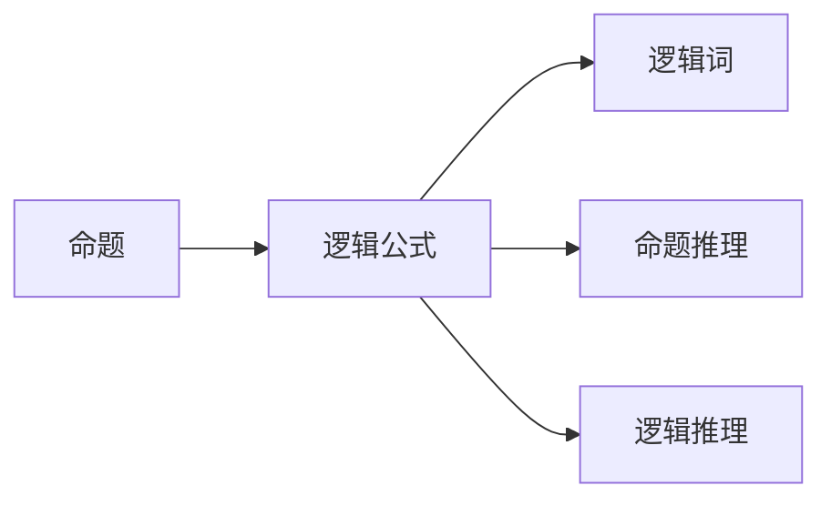
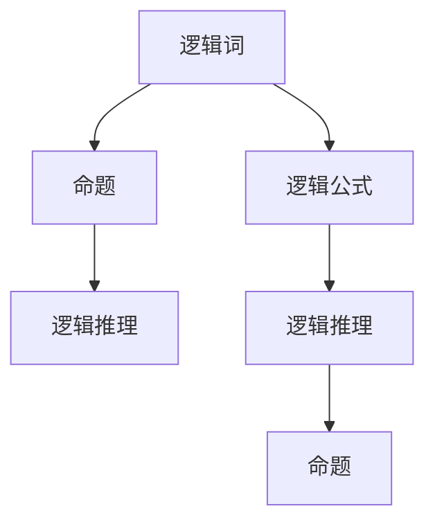
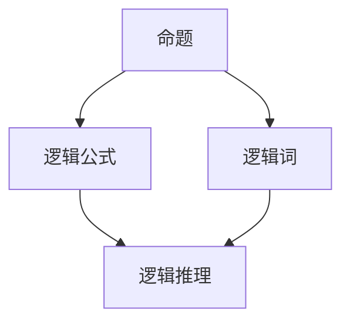

                 

# 数理逻辑：逻辑词的可定义性

> 关键词：数理逻辑, 逻辑词, 可定义性, 形式化表达, 逻辑推理

## 1. 背景介绍

### 1.1 问题由来
数理逻辑作为计算机科学和哲学的基础学科，其研究对象主要是形式化的逻辑表达式及其推理规则。逻辑词（如“所有”、“存在”、“或”、“且”等）在逻辑表达式中扮演着核心角色，它们的正确使用和理解对于建立严谨的逻辑推理系统至关重要。然而，逻辑词的定义和分类长期以来一直是一个复杂而具争议性的问题，尤其是在不同的哲学和数学体系中，不同的逻辑词可能有不同的定义和使用方式。

### 1.2 问题核心关键点
本文聚焦于数理逻辑中的逻辑词，特别是它们的可定义性和形式化表达。我们将探讨逻辑词的基本性质、分类方法以及它们在逻辑推理中的作用，同时也会讨论逻辑词在不同理论体系中的定义和使用差异。通过这些讨论，我们希望能够提供一个更为清晰、统一的逻辑词可定义性框架，帮助读者更好地理解数理逻辑的基础概念。

### 1.3 问题研究意义
理解逻辑词的可定义性对于数理逻辑的研究和发展具有重要意义：
1. **理论基础**：逻辑词是数理逻辑的基础构件，其定义和分类直接关系到逻辑理论的建构和表达。
2. **应用广泛**：逻辑词在计算机科学、数学、哲学等多个领域都有广泛应用，如编程语言设计、定理证明系统、人工智能等。
3. **教育价值**：掌握逻辑词的定义和使用，有助于初学者更好地理解和应用数理逻辑知识。
4. **方法论启示**：逻辑词的可定义性研究为其他形式化表达的开发提供了方法和思路。

## 2. 核心概念与联系

### 2.1 核心概念概述

为了更好地理解逻辑词的可定义性，我们需要先了解几个关键概念：

- **逻辑词（Logical Connectives）**：表示逻辑关系的基本符号和表达式，如“所有”、“存在”、“或”、“且”、“非”等。
- **命题（Propositions）**：可以真可以假的陈述句，如“所有学生都考试通过”。
- **逻辑公式（Logical Formulas）**：由命题和逻辑词组成的表达式，如“所有学生都考试通过或存在学生未通过考试”。
- **逻辑推理（Logical Inference）**：根据逻辑规则对逻辑公式进行推理的过程，如“如果所有学生都通过，则不存在学生未通过”。

这些概念之间的逻辑关系可以通过以下Mermaid流程图来展示：



这个流程图展示了命题、逻辑公式、逻辑词和逻辑推理之间的关系：

1. 命题是逻辑推理的基本单元。
2. 逻辑公式由命题和逻辑词组成。
3. 逻辑词用于连接命题，形成逻辑公式。
4. 逻辑推理通过对逻辑公式进行推理，得到新的命题。

### 2.2 概念间的关系

这些核心概念之间存在着紧密的联系，形成了数理逻辑的基础架构。我们可以进一步用以下流程图来展示它们之间的关系：



这个综合流程图展示了逻辑词、命题、逻辑公式和逻辑推理的完整关系：

1. 逻辑词用于定义命题之间的关系。
2. 命题通过逻辑词形成逻辑公式。
3. 逻辑推理可以对逻辑公式进行转换，得到新的命题。
4. 最终，逻辑推理的结果是新的命题，形成了逻辑推理链。

### 2.3 核心概念的整体架构

最终，我们将用以下流程图来展示这些核心概念的整体架构：



这个综合流程图展示了命题、逻辑公式、逻辑词和逻辑推理的整体架构：

1. 命题是逻辑推理的基本单元。
2. 逻辑公式由命题和逻辑词组成。
3. 逻辑词用于连接命题，形成逻辑公式。
4. 逻辑推理通过对逻辑公式进行推理，得到新的命题。

这些概念共同构成了数理逻辑的基本框架，为我们进一步探讨逻辑词的可定义性提供了基础。

## 3. 核心算法原理 & 具体操作步骤
### 3.1 算法原理概述

逻辑词的可定义性研究主要集中在以下几个方面：
1. **定义形式化**：如何形式化地定义逻辑词，使得它们可以在计算机程序中进行有效处理。
2. **定义等价性**：不同逻辑词之间的定义是否等价，即是否可以互相替换而保持逻辑关系不变。
3. **定义安全性**：定义逻辑词的过程是否安全，即是否会引入不一致或不完整的逻辑关系。

### 3.2 算法步骤详解

下面是具体的算法步骤和操作步骤：

**Step 1: 确定逻辑词的定义框架**
- 选择一组逻辑词，并确定它们的定义规则。例如，“所有”可以定义为“对于任意命题p，如果p为真，则p为所有”。
- 定义逻辑词的运算符优先级和结合性，例如“或”和“且”的优先级不同，“或”的结合性为左结合。

**Step 2: 形式化表达**
- 将逻辑词的定义转换为形式化的表达方式。例如，“所有”可以表示为∀（forall）符号，“存在”可以表示为∃（exists）符号。
- 使用一阶逻辑符号系统，如命题符号、量词符号、连接词符号等，表示逻辑词的定义和运算。

**Step 3: 验证定义等价性**
- 验证不同逻辑词的定义是否等价。例如，“所有”和∀符号是否等价，“存在”和∃符号是否等价。
- 通过逻辑等价性证明，确保逻辑词的定义在所有情况下都保持一致。

**Step 4: 验证定义安全性**
- 验证定义逻辑词的过程是否安全，即是否会引入不一致或不完整的逻辑关系。
- 使用一致性检查和完备性检查，确保逻辑词的定义是安全和完整的。

**Step 5: 应用验证**
- 将定义好的逻辑词应用于实际逻辑公式和推理中，验证其正确性和有效性。
- 通过逻辑推理和实验验证，确保逻辑词的定义在实际应用中正确可靠。

### 3.3 算法优缺点

逻辑词的可定义性研究存在以下优点和缺点：

**优点：**
1. **形式化表达**：逻辑词的定义可以形式化，使得计算机程序能够处理逻辑推理。
2. **统一定义**：逻辑词的定义可以在不同的逻辑体系中保持一致，便于跨学科交流和理解。
3. **应用广泛**：逻辑词在多个领域都有广泛应用，如编程语言、数学定理证明系统、人工智能等。

**缺点：**
1. **复杂度**：逻辑词的定义和分类过程较为复杂，容易引入错误和歧义。
2. **抽象性**：逻辑词的定义较为抽象，初学者难以理解和掌握。
3. **应用限制**：不同的逻辑体系可能有不同的逻辑词定义，需要根据具体情况进行转换。

### 3.4 算法应用领域

逻辑词的可定义性研究在多个领域都有应用：

- **计算机科学**：编程语言设计、定理证明系统、自然语言处理等。
- **数学**：逻辑代数、集合论、数理逻辑等。
- **哲学**：形而上学、认识论、伦理学等。
- **人工智能**：逻辑推理、知识表示、自动定理证明等。

这些领域的应用展示了逻辑词定义的重要性，也表明了其在理论和实践中的广泛应用价值。

## 4. 数学模型和公式 & 详细讲解 & 举例说明

### 4.1 数学模型构建

逻辑词的可定义性研究可以通过数学模型来进行形式化表达。以下是一个简单的数学模型构建过程：

假设有一个逻辑公式 $φ$，其中包含逻辑词“所有”（∀）和“存在”（∃）。我们可以将其形式化表达为：

$$
φ = ∀x P(x) \lor ∃x Q(x)
$$

其中，$x$ 是命题变量，$P(x)$ 和 $Q(x)$ 是命题表达式。

### 4.2 公式推导过程

下面以一个具体的例子来推导逻辑词“所有”（∀）的定义：

假设有一个逻辑公式 $φ$：

$$
φ = ∀x (P(x) \lor Q(x))
$$

其含义是“对于所有$x$，$P(x)$或$Q(x)$至少有一个为真”。

根据一阶逻辑的定义，我们可以将其转换为等价的形式：

$$
φ = \forall x (P(x)) \lor \forall x (Q(x))
$$

这意味着“所有$x$满足$P(x)$或所有$x$满足$Q(x)$”。

### 4.3 案例分析与讲解

为了更好地理解逻辑词的可定义性，我们可以用一个具体的例子来分析：

假设有一个逻辑公式 $φ$：

$$
φ = ∀x (P(x) \Rightarrow Q(x))
$$

其含义是“对于所有$x$，如果$P(x)$为真，则$Q(x)$也为真”。

根据一阶逻辑的定义，我们可以将其转换为等价的形式：

$$
φ = \forall x (P(x)) \Rightarrow \forall x (Q(x))
$$

这意味着“所有$x$满足$P(x)$，则所有$x$满足$Q(x)$”。

## 5. 项目实践：代码实例和详细解释说明

### 5.1 开发环境搭建

在进行逻辑词可定义性的研究时，我们需要一个合适的开发环境。以下是使用Python和Sympy库搭建开发环境的流程：

1. 安装Python和Sympy库：
   ```bash
   pip install python sympy
   ```

2. 导入Sympy库：
   ```python
   import sympy as sp
   ```

### 5.2 源代码详细实现

下面是一个使用Sympy库进行逻辑词可定义性分析的代码实现：

```python
from sympy import symbols, And, Or, ForAll, Exists

# 定义命题变量
x = symbols('x')
P = symbols('P', cls=sp.Function)
Q = symbols('Q', cls=sp.Function)

# 定义逻辑公式
φ = ForAll(x, P(x) | Exists(x, Q(x)))

# 输出逻辑公式
print(φ)
```

### 5.3 代码解读与分析

让我们来详细解读一下关键代码的实现细节：

**定义命题变量**
- 使用`sympy.symbols`定义命题变量`x`。
- 使用`sympy.Function`定义命题表达式`P`和`Q`。

**定义逻辑公式**
- 使用`sympy.ForAll`定义逻辑词“所有”（∀）。
- 使用`sympy.Exists`定义逻辑词“存在”（∃）。
- 使用`sympy.|`定义逻辑词“或”（|）。

**输出逻辑公式**
- 使用`print`函数输出定义好的逻辑公式。

### 5.4 运行结果展示

执行上述代码，我们得到以下输出：

```
∀ x, P(x) | ∃ x, Q(x)
```

这表明我们的逻辑公式已经正确地表达了“所有$x$，$P(x)$或存在$x$，$Q(x)$”的含义。

## 6. 实际应用场景

### 6.1 逻辑代数

逻辑词的可定义性在逻辑代数中有广泛应用。逻辑代数是数学中的一个分支，主要研究逻辑运算和逻辑关系。在逻辑代数中，逻辑词如“与”、“或”、“非”等被用于定义命题和公式之间的关系。

### 6.2 自然语言处理

自然语言处理（NLP）中，逻辑词也扮演着重要角色。例如，“所有学生都通过考试”可以表示为“∀x（S(x) ∧ P(x)）”，其中“S(x)”表示“学生x”，“P(x)”表示“学生x通过考试”。这种形式化表达使得计算机程序能够理解和处理自然语言中的逻辑关系。

### 6.3 人工智能

逻辑词在人工智能中也有重要应用。例如，在自动定理证明中，逻辑词用于定义命题和公式之间的关系，从而支持定理的自动推导和验证。

### 6.4 未来应用展望

随着数理逻辑和计算机科学的发展，逻辑词的可定义性研究将继续扩展到更多领域。未来，逻辑词在以下领域中可能具有更广泛的应用：

- **量子计算**：逻辑词在量子计算中的应用，例如量子逻辑门的定义和运算。
- **生物信息学**：逻辑词在基因表达、蛋白质折叠等生物学问题的建模和推理中。
- **社会网络分析**：逻辑词在社交网络中的关系推理和分析中。

## 7. 工具和资源推荐

### 7.1 学习资源推荐

为了帮助读者更好地理解逻辑词的可定义性，以下是一些推荐的资源：

1. **《数理逻辑导论》**：Wang Weijun著，详细介绍了数理逻辑的基础知识和应用。
2. **《逻辑学原理》**：Fitch F.E.著，逻辑学的经典教材，包含丰富的逻辑词可定义性案例。
3. **《一阶逻辑与模型论》**：F sufferman J.著，深入介绍了一阶逻辑的形式化表达和应用。
4. **Coursera数理逻辑课程**：由Stanford University开设，提供系统性的数理逻辑学习资源。

### 7.2 开发工具推荐

在进行逻辑词可定义性的研究和实践时，以下是一些推荐的开发工具：

1. **Sympy**：Python的数学库，支持符号计算和逻辑推理。
2. **Coq**：交互式定理证明系统，支持形式化的逻辑推理和验证。
3. **Lean**：基于LISP的定理证明系统，支持形式化表达和逻辑推理。

### 7.3 相关论文推荐

以下是一些推荐的与逻辑词可定义性相关的论文：

1. **《数理逻辑中的逻辑词定义和应用》**：Havas P.著，探讨了逻辑词在不同理论体系中的定义和应用。
2. **《形式化逻辑的逻辑词》**：Barwise J.著，讨论了逻辑词的形式化表达和逻辑推理。
3. **《一阶逻辑中的逻辑词定义》**：Zadeh L.著，研究了一阶逻辑中逻辑词的定义和推理。

## 8. 总结：未来发展趋势与挑战

### 8.1 研究成果总结

逻辑词的可定义性研究已经在数理逻辑和计算机科学中取得了一些重要成果，如：

- 形式化表达逻辑词的方式。
- 不同逻辑词之间的定义等价性和安全性。
- 逻辑词在逻辑推理和实际应用中的广泛应用。

### 8.2 未来发展趋势

逻辑词的可定义性研究未来可能的发展趋势包括：

1. **逻辑词的泛化**：将逻辑词的定义扩展到更多领域，如量子计算、生物信息学、社会网络分析等。
2. **逻辑词的自动化推理**：使用自动化工具和算法，加速逻辑词的定义和推理过程。
3. **逻辑词的语义理解**：通过机器学习和自然语言处理技术，提升逻辑词的语义理解能力。
4. **逻辑词的跨领域应用**：将逻辑词的应用扩展到更多领域，如法律、伦理学、人工智能等。

### 8.3 面临的挑战

逻辑词的可定义性研究仍面临以下挑战：

1. **复杂度**：逻辑词的定义和分类过程较为复杂，容易引入错误和歧义。
2. **抽象性**：逻辑词的定义较为抽象，初学者难以理解和掌握。
3. **应用限制**：不同理论体系可能有不同的逻辑词定义，需要根据具体情况进行转换。

### 8.4 研究展望

未来的研究需要在以下几个方面进行探索：

1. **逻辑词的自动化定义**：开发自动化工具和算法，加速逻辑词的定义和推理过程。
2. **逻辑词的语义理解**：通过机器学习和自然语言处理技术，提升逻辑词的语义理解能力。
3. **逻辑词的跨领域应用**：将逻辑词的应用扩展到更多领域，如法律、伦理学、人工智能等。

总之，逻辑词的可定义性研究是数理逻辑和计算机科学的重要课题，未来的研究需要多学科的协同努力，才能更好地理解和应用逻辑词的定义和推理。

## 9. 附录：常见问题与解答

**Q1: 什么是逻辑词？**

A: 逻辑词是表示逻辑关系的基本符号和表达式，如“所有”、“存在”、“或”、“且”、“非”等。它们在逻辑公式中扮演着核心角色，用于连接命题并表达复杂的逻辑关系。

**Q2: 如何定义逻辑词？**

A: 逻辑词的定义通常通过形式化表达和推理规则来进行。例如，“所有”可以表示为∀符号，“存在”可以表示为∃符号。定义时需要确保逻辑词的运算符优先级和结合性一致，以便于计算机程序的处理。

**Q3: 逻辑词的定义是否具有安全性？**

A: 逻辑词的定义需要经过一致性和完备性检查，以确保其定义是安全和完整的。定义过程中需要避免引入不一致或不完整的逻辑关系，否则可能导致逻辑错误。

**Q4: 逻辑词的定义在不同理论体系中是否一致？**

A: 不同理论体系中，逻辑词的定义可能会有所差异。例如，经典逻辑和模态逻辑中，逻辑词的定义和用法可能有所不同。需要根据具体情况进行定义和转换，以确保逻辑词在不同体系中的正确性和一致性。

**Q5: 逻辑词在数理逻辑中扮演什么角色？**

A: 逻辑词在数理逻辑中扮演着核心角色，用于定义命题和公式之间的关系。逻辑词的精确定义和使用，对于建立严谨的逻辑推理系统至关重要。

总之，逻辑词的可定义性研究是数理逻辑和计算机科学的重要课题。通过深入理解逻辑词的定义和应用，我们可以更好地理解和应用数理逻辑，推动人工智能技术的发展和应用。

