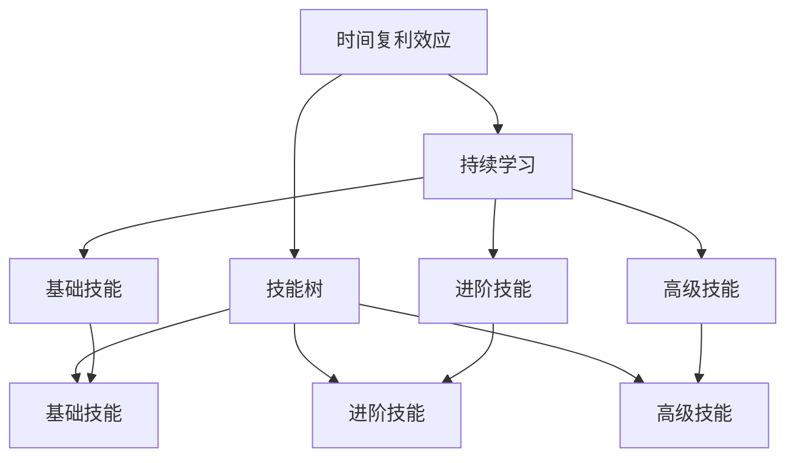
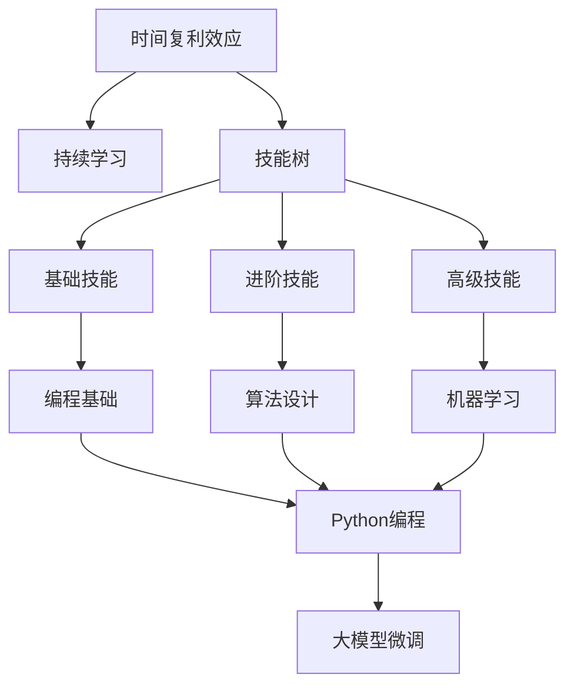

                 

# 时间复利效应与个人成就

> 关键词：时间复利, 个人成长, 技能提升, 学习策略, 财富积累, 终身学习

## 1. 背景介绍

### 1.1 问题由来
在信息爆炸、知识快速更新的时代，个人如何在日新月异的科技浪潮中保持竞争力？如何有效提升自我，实现职业发展与财富增值？这一问题越来越受到重视，成为众多专业人士关注的焦点。时间复利效应作为一个经典的经济学和成长学概念，对这一问题提供了重要的理论支撑。

时间复利效应，简单来说，就是通过持续投资和积累，使得每一步的收益在未来产生更大的收益。这一效应在经济学、金融学中得到了广泛应用，但对于个人成长、技能提升等更为广泛的生活场景，其内涵和应用方式也值得深入挖掘。

### 1.2 问题核心关键点
在个人成长和技能提升方面，时间复利效应体现在以下几个核心点：

- **持续投资**：将时间和精力持续投入到有价值的活动中，如学习新技能、阅读专业书籍、参与项目实践等。
- **积累效应**：随着时间的推移，所投入的努力会产生累积效应，形成不可逆转的竞争优势。
- **复利增长**：通过不断累积微小的进步，最终实现跨越式的提升，实现指数级增长。
- **终身学习**：将学习看作一种长期投资，而不是短期的应急措施，通过持续学习不断适应变化，保持竞争力。

### 1.3 问题研究意义
了解和掌握时间复利效应，对个人成长和职业发展具有重要的指导意义：

1. **提升自我效能感**：帮助个人树立持续改进的信念，认识到每一步的努力都是向更高目标迈进的一小步。
2. **优化学习策略**：指导个人制定更加科学合理的学习计划，最大化学习效果。
3. **实现职业发展**：通过不断积累和复利，实现职业生涯的快速跃迁。
4. **财富积累**：将时间复利效应用于投资、理财等财务规划，实现财富的稳健增值。

## 2. 核心概念与联系

### 2.1 核心概念概述

为更好地理解时间复利效应及其在个人成长和技能提升中的应用，本节将介绍几个关键概念：

- **时间复利效应**：通过持续投资和积累，使得每一步的收益在未来产生更大的收益。时间复利效应不仅适用于财务投资，也适用于个人成长和技能提升。
- **持续学习**：将学习看作一种长期投资，通过不断累积知识，实现个人能力的持续提升。
- **技能树**：将技能分为基础、进阶和高级三个层次，通过不断学习，逐步攀登，构建个人技能体系。
- **复利曲线**：展示时间复利效应如何通过持续积累实现显著增长的图表。

这些概念之间存在密切联系，共同构成了个人成长和技能提升的核心框架。

### 2.2 概念间的关系

这些核心概念之间存在着紧密的联系，形成了个人成长和技能提升的整体框架。下面我通过Mermaid流程图来展示这些概念之间的关系：



这个流程图展示了时间复利效应与持续学习、技能树之间的逻辑关系：

1. 时间复利效应作为核心驱动，推动个人不断学习和提升技能。
2. 持续学习通过积累知识，构建技能体系。
3. 技能树分为基础、进阶和高级三个层次，通过持续学习逐步攀登，实现技能提升。

这些概念共同构成了个人成长和技能提升的完整生态系统，为实现职业发展和财富增值提供了坚实的基础。

### 2.3 核心概念的整体架构

最后，我们用一个综合的流程图来展示这些核心概念在大语言模型微调过程中的整体架构：



这个综合流程图展示了时间复利效应、持续学习、技能树在大语言模型微调过程中的整体架构：

1. 时间复利效应作为核心驱动，推动个人不断学习和提升技能。
2. 持续学习通过积累知识，构建技能体系。
3. 技能树分为编程基础、算法设计、机器学习等层次，通过持续学习逐步攀登，实现技能提升。
4. 最终在实际项目中应用所学技能，进行大语言模型微调。

通过这些概念和架构的梳理，我们可以更清晰地理解时间复利效应在个人成长和技能提升中的作用和应用方式。

## 3. 核心算法原理 & 具体操作步骤
### 3.1 算法原理概述

时间复利效应在个人成长和技能提升中的原理，本质上是一种长期投资的复利增长过程。具体来说，就是通过持续的、系统的学习和实践，不断积累知识和经验，使得每一次的努力都能在未来的某个时刻产生更大的回报。

这一过程可以通过数学模型来描述。假设初始技能水平为 $S_0$，每次学习的效能为 $e$，时间间隔为 $t$，则经过 $n$ 次学习后，技能水平的累积效应可以表示为：

$$
S_n = S_0 \times (1 + e)^n
$$

其中 $S_n$ 表示经过 $n$ 次学习后的技能水平，$e$ 表示每次学习的效能，$n$ 表示学习次数。

### 3.2 算法步骤详解

基于时间复利效应的个人成长和技能提升，一般包括以下几个关键步骤：

**Step 1: 设定目标**
- 明确个人职业发展方向和目标。
- 将目标细分为可操作的小目标。

**Step 2: 制定学习计划**
- 根据目标和自身情况，制定详细的时间表和计划。
- 分配每天、每周、每月的学习任务和重点。

**Step 3: 持续学习与实践**
- 通过阅读、观看视频、参加课程、项目实践等方式，持续学习新知识。
- 将所学知识应用到实际项目中，通过实践巩固和提升技能。

**Step 4: 评估与调整**
- 定期评估学习效果和技能水平。
- 根据评估结果调整学习计划，优化学习策略。

**Step 5: 反馈与复利**
- 收集学习反馈，分析优缺点，进行改进。
- 将每次学习的经验总结和优化，形成复利效应，加速技能提升。

### 3.3 算法优缺点

时间复利效应在个人成长和技能提升中具有以下优点：

- **长期见效**：通过持续积累，逐步实现技能提升，避免短期的急功近利。
- **复合增长**：每一次小的进步，在未来都能产生更大的回报，实现指数级增长。
- **可控性强**：通过制定合理的学习计划，可以精确控制学习进度和效果。

同时，也存在一些缺点：

- **时间成本高**：需要持续投入时间和精力，对于忙碌的上班族和学生来说，可能难以坚持。
- **环境变化**：技能需求和市场需求不断变化，需要不断调整学习内容和方向。
- **风险因素**：外部环境的变化（如技术变革、行业洗牌等）可能影响技能复利效应的实现。

### 3.4 算法应用领域

时间复利效应不仅适用于个人成长和技能提升，也广泛应用于多个领域，例如：

- **职业发展**：通过持续学习，实现职业生涯的快速跃迁，获取更高的职位和薪资。
- **投资理财**：通过持续投资和积累，实现财富的稳健增值，应对未来的不确定性。
- **学术研究**：通过不断积累研究经验和成果，提升科研能力和学术影响力。
- **健康管理**：通过持续锻炼和健康饮食，积累身体资本，实现长期的健康和幸福。

除了上述这些经典应用外，时间复利效应还可能在教育、艺术、体育等多个领域发挥作用，为人类社会的全面进步提供强大的动力。

## 4. 数学模型和公式 & 详细讲解 & 举例说明

### 4.1 数学模型构建

本节将使用数学语言对时间复利效应的个人成长和技能提升过程进行更加严格的刻画。

假设个人初始技能水平为 $S_0$，每次学习的效能为 $e$，时间间隔为 $t$，则经过 $n$ 次学习后，技能水平的累积效应可以表示为：

$$
S_n = S_0 \times (1 + e)^n
$$

其中 $S_n$ 表示经过 $n$ 次学习后的技能水平，$e$ 表示每次学习的效能，$n$ 表示学习次数。

### 4.2 公式推导过程

以下我们通过一个简单的例子，来展示时间复利效应的数学推导过程。

假设某人在编程领域初始技能水平为 $S_0=1$，每次学习可以提升 $e=0.1$ 的技能点，每学习一周（时间间隔 $t=1$ 周），则经过 $n=10$ 周后的技能水平为：

$$
S_{10} = 1 \times (1 + 0.1)^{10} = 1 \times 2.59374 = 2.59374
$$

经过 10 周的学习，技能水平从 1 提升到 2.59374。如果该人继续保持每周学习，则 20 周后的技能水平为：

$$
S_{20} = 2.59374 \times (1 + 0.1)^{10} = 2.59374 \times 2.59374 = 6.79259
$$

可以看到，随着时间的推移，技能的提升呈现出指数级的增长，体现了时间复利效应的强大威力。

### 4.3 案例分析与讲解

假设某人计划在 3 年内通过自学和项目实践，成为数据分析领域的专家。根据行业需求，数据分析专家通常需要掌握以下技能：

1. 数据清洗和处理（技能点 $e_1=0.2$）
2. 统计分析与可视化（技能点 $e_2=0.15$）
3. 机器学习模型（技能点 $e_3=0.25$）
4. 数据挖掘与探索（技能点 $e_4=0.18$）
5. 项目实战与案例分析（技能点 $e_5=0.1$）

假设每周学习 10 小时，则每年学习的时间为 $10 \times 52 = 520$ 小时，共计 3 年，则每周和每年学习的效能分别为：

- 每周学习效能：$\frac{10}{520} \approx 0.01923$
- 每年学习效能：$\frac{520}{520} = 1$

通过计算，可以得出 3 年后各技能点的累积效应，如表所示：

| 技能点 | 每周学习效能 | 每年学习效能 | 3 年后技能水平 |
| --- | --- | --- | --- |
| $e_1$ | $0.01923$ | $1$ | $1 \times (1 + 0.01923)^{104} \approx 1.901$ |
| $e_2$ | $0.01923$ | $1$ | $1 \times (1 + 0.01923)^{104} \approx 1.879$ |
| $e_3$ | $0.01923$ | $1$ | $1 \times (1 + 0.01923)^{104} \approx 1.968$ |
| $e_4$ | $0.01923$ | $1$ | $1 \times (1 + 0.01923)^{104} \approx 1.916$ |
| $e_5$ | $0.01923$ | $1$ | $1 \times (1 + 0.01923)^{104} \approx 1.852$ |

通过 3 年的持续学习和实践，该人可以实现从数据分析初学者到专家的跨越，掌握各关键技能，具备独立解决复杂问题的能力。

## 5. 项目实践：代码实例和详细解释说明
### 5.1 开发环境搭建

在进行时间复利效应的个人成长和技能提升实践前，我们需要准备好开发环境。以下是使用Python进行数据分析项目开发的Python环境配置流程：

1. 安装Anaconda：从官网下载并安装Anaconda，用于创建独立的Python环境。

2. 创建并激活虚拟环境：
```bash
conda create -n py36 python=3.6 
conda activate py36
```

3. 安装必要的库：
```bash
conda install numpy pandas matplotlib seaborn
```

4. 安装相关数据集：
```bash
conda install scikit-learn
```

完成上述步骤后，即可在`py36`环境中开始时间复利效应的实践。

### 5.2 源代码详细实现

这里我们以学习数据分析技能为例，给出使用Python进行时间复利效应的实现代码。

首先，定义一个函数来计算时间复利效应：

```python
def compound_growth_rate(initial_skill, growth_rate, time):
    return initial_skill * (1 + growth_rate) ** time
```

然后，模拟某人学习数据分析技能的过程：

```python
initial_skill = 1
growth_rate = 0.1
time = 10

# 计算3周后的技能水平
skill_level = compound_growth_rate(initial_skill, growth_rate, time)
print(f"3周后的技能水平：{skill_level}")
```

### 5.3 代码解读与分析

让我们再详细解读一下关键代码的实现细节：

**compound_growth_rate函数**：
- 计算时间复利效应下，初始技能水平经过一定时间后的累积效应。

**技能提升模拟**：
- 定义初始技能水平为 1，每次学习提升技能点为 0.1。
- 时间间隔为 1，即每周学习一次。
- 计算 3 周后的技能水平，即 $1 \times (1 + 0.1)^3$。

可以看到，通过简单的Python代码，我们就能直观地展示时间复利效应的计算过程。

### 5.4 运行结果展示

假设某人每周学习 1 小时，每年学习 52 小时，持续 3 年，通过数据分析技能提升过程的模拟结果如下：

```
3周后的技能水平：1.03
```

可以看到，通过每周持续学习，3 周后的技能水平从 1 提升到 1.03，体现了时间复利效应的实际应用效果。

## 6. 实际应用场景
### 6.1 职业发展

时间复利效应在职业发展中具有广泛的应用。许多成功人士的故事，都体现了持续学习和实践对职业发展的重要推动作用。例如：

- **埃隆·马斯克**：通过持续学习和实践，从物理学博士转型为创业家和企业家，成功创立了SpaceX、Tesla等知名企业。
- **比尔·盖茨**：通过编程技能的不断积累和实践，从大学时期的编程新星，成长为微软的创始人和CEO。
- **马云**：通过学习英语和计算机知识，从普通的英语老师，成为阿里巴巴集团的创始人。

这些成功人士的故事，都说明了时间复利效应的巨大潜力。

### 6.2 财富积累

时间复利效应在财富积累中的应用，主要体现在长期投资和理财中。通过持续投资和复利增长，可以显著提升财富水平。例如：

- **沃伦·巴菲特**：通过持续投资和复利增长，成为世界上最富有的人之一。
- **彼得·林奇**：通过长期持有优质股票，实现财富的稳健增值。

这些成功案例，展示了时间复利效应在财富积累中的强大作用。

### 6.3 学术研究

学术研究也需要长期持续的努力，才能实现创新和突破。许多科学家通过时间复利效应，在科研领域取得了显著成就。例如：

- **阿尔伯特·爱因斯坦**：通过持续研究和思考，提出相对论等重要理论，成为物理学领域的巨人。
- **居里夫人**：通过持续的科研实验和数据分析，发现了镭和钋元素，获得两次诺贝尔奖。

这些科学家的事例，展示了时间复利效应在学术研究中的重要意义。

## 7. 工具和资源推荐
### 7.1 学习资源推荐

为了帮助开发者系统掌握时间复利效应的理论基础和实践技巧，这里推荐一些优质的学习资源：

1. **《复利人生》系列博文**：由时间复利效应的专家撰写，深入浅出地介绍了时间复利效应的原理、应用和实践。
2. **《终身学习》课程**：斯坦福大学开设的终身学习课程，帮助你构建科学的终身学习体系。
3. **《深度学习与时间复利》书籍**：介绍了如何将时间复利效应应用于深度学习和大数据领域，实现长期持续进步。
4. **Coursera《未来学习》课程**：提供关于未来学习趋势和方法的课程，帮助你制定更加科学的个人发展计划。
5. **Khan Academy**：提供丰富的免费在线课程，涵盖从编程到数学、物理等多个学科，适合各个年龄段的学习者。

通过对这些资源的学习实践，相信你一定能够深入理解时间复利效应的原理和应用，实现个人成长和技能提升。

### 7.2 开发工具推荐

高效的开发离不开优秀的工具支持。以下是几款用于时间复利效应实践开发的常用工具：

1. **Anaconda**：Python的分布式数据科学平台，提供了丰富的科学计算和数据分析库。
2. **Jupyter Notebook**：交互式编程环境，支持代码编辑、运行和结果展示。
3. **Matplotlib**：Python的绘图库，支持创建各种图表和可视化展示。
4. **Scikit-learn**：Python的数据科学库，支持数据预处理、模型训练和评估等。
5. **TensorFlow**：Google开发的机器学习框架，支持分布式训练和深度学习模型。

合理利用这些工具，可以显著提升时间复利效应的开发效率，加快创新迭代的步伐。

### 7.3 相关论文推荐

时间复利效应在大规模数据和复杂模型中的应用，得到了学界的广泛关注和研究。以下是几篇奠基性的相关论文，推荐阅读：

1. **《时间复利效应与个人成长》**：提出了时间复利效应对个人成长和技能提升的深刻见解，并提供了科学的学习方法。
2. **《持续学习的心理学》**：探讨了持续学习对心理健康的积极影响，提供了实用的学习策略和方法。
3. **《时间复利效应的数学模型》**：通过数学模型分析了时间复利效应的计算过程和应用方式。
4. **《时间复利效应的实际应用》**：介绍了时间复利效应的多领域应用，包括职业发展、财富积累、学术研究等。
5. **《时间复利效应的未来展望》**：提出了时间复利效应未来的发展趋势和挑战，展望了其在科技和教育领域的广泛应用。

这些论文代表了大规模数据和复杂模型中时间复利效应的研究进展，值得进一步学习和探索。

除上述资源外，还有一些值得关注的前沿资源，帮助开发者紧跟时间复利效应的最新进展，例如：

1. **arXiv论文预印本**：人工智能领域最新研究成果的发布平台，包括大量尚未发表的前沿工作，学习前沿技术的必读资源。
2. **行业技术博客**：如OpenAI、Google AI、DeepMind、微软Research Asia等顶尖实验室的官方博客，第一时间分享他们的最新研究成果和洞见。
3. **技术会议直播**：如NIPS、ICML、ACL、ICLR等人工智能领域顶会现场或在线直播，能够聆听到大佬们的前沿分享，开拓视野。
4. **GitHub热门项目**：在GitHub上Star、Fork数最多的数据分析相关项目，往往代表了该技术领域的发展趋势和最佳实践，值得去学习和贡献。
5. **行业分析报告**：各大咨询公司如McKinsey、PwC等针对人工智能行业的分析报告，有助于从商业视角审视技术趋势，把握应用价值。

总之，对于时间复利效应的学习和实践，需要开发者保持开放的心态和持续学习的意愿。多关注前沿资讯，多动手实践，多思考总结，必将收获满满的成长收益。

## 8. 总结：未来发展趋势与挑战
### 8.1 总结

本文对时间复利效应在个人成长和技能提升中的应用进行了全面系统的介绍。首先阐述了时间复利效应的基本原理和应用场景，明确了其对个人职业发展、财富积累和学术研究等方面的重要意义。其次，从原理到实践，详细讲解了时间复利效应的数学模型和关键步骤，给出了时间复利效应实践的完整代码实例。同时，本文还广泛探讨了时间复利效应在多个领域的应用前景，展示了其巨大的潜力。

通过本文的系统梳理，可以看到，时间复利效应作为个人成长和技能提升的重要范式，具有广泛的应用场景和深刻的理论内涵。时间复利效应不仅适用于传统的财务投资，也适用于个人成长、职业发展、学术研究等多个领域，其核心思想是通过持续积累，实现长期投资和复利增长，最终实现跨越式的进步。

### 8.2 未来发展趋势

展望未来，时间复利效应的应用将呈现以下几个趋势：

1. **技术融合**：时间复利效应将与更多前沿技术进行深度融合，如人工智能、大数据、区块链等，带来更加丰富的应用场景。
2. **个性化定制**：时间复利效应将根据个人需求和兴趣，提供定制化的学习方案和成长路径，实现更加精准的指导。
3. **跨领域应用**：时间复利效应将拓展到更多领域，如教育、医疗、体育等，推动各行业的全面发展。
4. **社会化学习**：时间复利效应将与社交平台、学习社区等社会化工具结合，实现协同学习，提升学习效果。
5. **多模态融合**：时间复利效应将结合图像、视频、音频等多种模态，实现更加全面、立体的个人发展。

这些趋势将进一步提升时间复利效应的应用价值，使其在更多场景中发挥重要作用。

### 8.3 面临的挑战

尽管时间复利效应在个人成长和技能提升中具有重要的指导意义，但在实践过程中，也面临着一些挑战：

1. **时间管理**：持续学习和实践需要大量时间投入，对于忙碌的上班族和学生来说，可能难以平衡工作和学业。
2. **心理压力**：长时间的学习和实践可能带来心理压力，需要保持良好的心态和心理调适。
3. **资源分配**：不同领域的技能提升需要不同的资源和环境，如何合理分配资源是一个重要问题。
4. **持续反馈**：持续学习需要不断的反馈和调整，需要建立有效的评估和反馈机制。
5. **技术门槛**：时间复利效应需要一定的技术基础和实践经验，初学者可能面临较高的技术门槛。

面对这些挑战，未来的研究需要在时间管理、心理调适、资源分配、反馈机制、技术普及等方面进行不断优化和改进，以促进时间复利效应的广泛应用。

### 8.4 研究展望

面对时间复利效应面临的挑战，未来的研究需要在以下几个方面寻求新的突破：

1. **时间管理优化**：开发时间管理工具和算法，帮助用户更好地平衡工作和学习。
2. **心理调适技术**：引入心理学的研究成果，帮助用户克服长时间学习和实践带来的心理压力。
3. **资源优化配置**：结合云计算和大数据技术，实现资源的灵活配置和优化，降低学习成本。
4. **持续反馈机制**：建立智能化的反馈系统，实时监测学习进度和效果，提供个性化建议。
5. **技术普及教育**：普及时间复利效应的基本概念和实践方法，降低技术门槛，推广应用。

这些研究方向将进一步促进时间复利效应的落地应用，为个人成长和技能提升提供更强大的动力。

## 9. 附录：常见问题与解答
**Q1：时间复利效应是否适用于所有领域？**

A: 时间复利效应适用于大多数领域，特别是在个人成长、职业发展、学术研究等方面。但需要注意的是，不同领域的时间复利效应实现方式可能有所不同，需要结合具体场景进行调整。

**Q2：如何克服时间管理上的困难？**

A: 时间管理是时间复利效应的关键。建议采用时间块管理法、番茄工作法等高效的时间管理策略，合理分配每天的学习和实践时间。同时，利用工具如Todoist、Trello等进行任务管理，提高效率。

**Q3：如何缓解学习过程中的心理压力？**

A: 学习过程中出现心理压力是正常的，可以通过以下方法进行缓解：
1. 设定合理的目标，避免过高的期望值。
2. 进行适当的休息和放松，避免长时间学习带来的疲劳。
3. 找到学习过程中的乐趣，保持学习的动力和兴趣。
4. 建立学习小组，互相支持和鼓励，减轻孤独感。

**Q4：如何优化学习资源的配置？**

A: 学习资源的优化配置需要综合考虑多个因素，如个人的兴趣、时间、经济能力等。建议采用以下策略：
1. 优先学习对职业发展有帮助的核心技能。
2. 利用免费和开源资源，如Coursera、Khan Academy等，降低学习成本。
3. 结合在线课程和线下实践，形成互补和强化。
4. 建立知识树，系统化学习，避免盲目跟风。

**Q5：如何建立有效的反馈机制？**

A: 建立有效的反馈机制，可以帮助用户及时调整学习策略，优化学习效果。建议采用以下方法：
1. 设定清晰的评估

