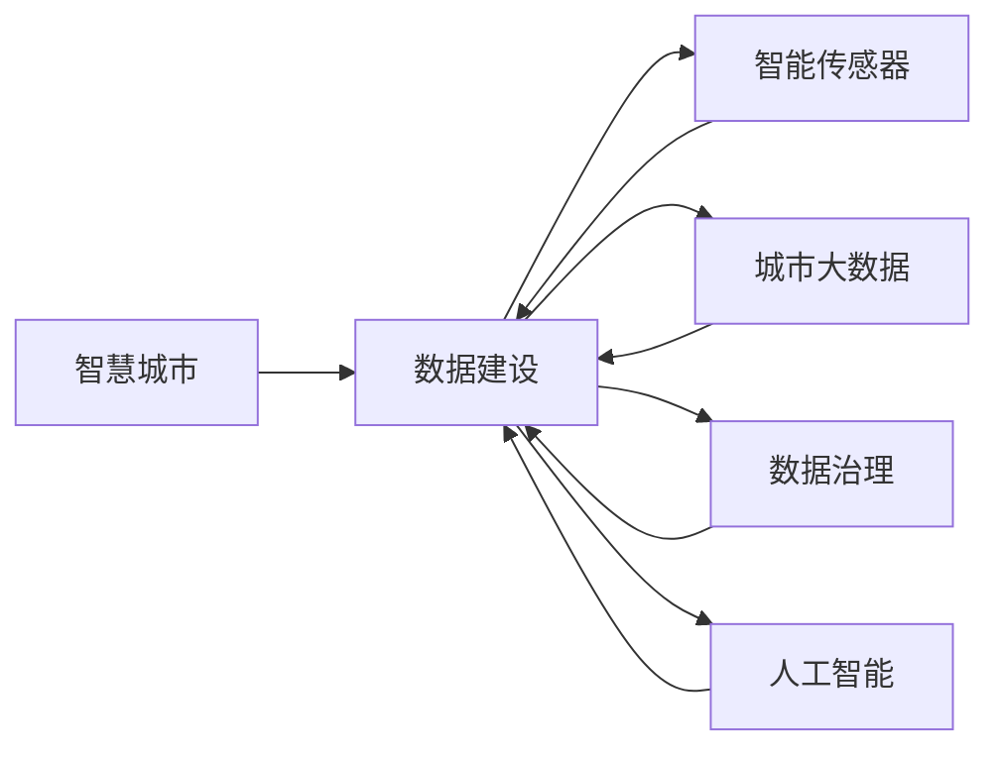

                 

# 智慧城市的数据建设：如何利用数据打造智慧城市？

> 关键词：智慧城市,数据建设,智能传感器,城市大数据,数据治理,人工智能

## 1. 背景介绍

### 1.1 问题由来
随着全球经济和社会发展的不断推进，城市化进程日益加速，智慧城市的概念应运而生。智慧城市是一种以信息技术为基础，旨在通过智能感知、数据整合和协同决策，实现城市运行的精细化和智能化。数据作为智慧城市的基础，其建设和管理水平直接决定了智慧城市建设的成败。然而，当前许多城市在数据建设上仍存在诸多问题，如数据孤岛、数据质量参差不齐、数据利用率低等，严重阻碍了智慧城市的健康发展。

### 1.2 问题核心关键点
数据建设是智慧城市的关键，其核心在于如何收集、存储、处理、分析和应用城市数据。在数据建设过程中，需要关注以下几个关键点：
- 数据源的多样性和丰富性。
- 数据的完整性、准确性和及时性。
- 数据处理和分析的效率和效果。
- 数据共享和开放程度。
- 数据安全和隐私保护。

### 1.3 问题研究意义
通过对智慧城市数据建设的研究，可以帮助城市管理者更好地理解数据的重要性和作用，指导智慧城市的规划和实施。具体来说：
1. 提升城市治理效能。数据驱动的决策能够使城市管理更加科学、高效。
2. 优化城市资源配置。数据可以揭示城市资源的瓶颈和缺口，助力合理分配。
3. 增强公共服务水平。通过数据监测和分析，提升公共交通、医疗、教育等服务质量。
4. 推动经济增长。数据的商业价值和创新应用，为城市带来新的经济增长点。
5. 提升市民生活质量。数据驱动的智慧应用，使市民享受更加便捷、高效、安全的生活。

## 2. 核心概念与联系

### 2.1 核心概念概述

为了深入理解智慧城市的数据建设，我们先介绍几个核心概念：

- 智慧城市：利用信息技术，对城市运行进行智能化管理，提升城市治理、公共服务和市民生活质量的城市。
- 数据建设：通过收集、存储、处理、分析和应用城市数据，实现城市运行的精细化和智能化。
- 智能传感器：能够感知环境变化并自动生成数据的传感器，如温度、湿度、压力、光照等。
- 城市大数据：城市运行产生的大量数据，包括交通、环境、能源、公共服务等方面的信息。
- 数据治理：对城市数据进行管理和维护，确保数据的质量、安全性和可用性。
- 人工智能：通过算法和模型对数据进行处理和分析，实现智能决策和应用。

这些概念之间存在紧密的联系，数据建设是智慧城市的基础，智能传感器和城市大数据是数据建设的关键组成部分，而数据治理和人工智能则是对数据进行有效管理和深度应用的保障。通过深入研究这些概念，我们可以更好地理解和实施智慧城市的数据建设。

### 2.2 概念间的关系

这些核心概念之间的联系可以用以下Mermaid流程图来展示：



这个流程图展示了智慧城市的数据建设与智能传感器、城市大数据、数据治理和人工智能之间的紧密关系。智慧城市通过智能传感器收集实时数据，城市大数据汇聚各类数据源，数据治理确保数据质量和安全，人工智能则对数据进行处理和分析，为智慧城市的决策和应用提供支持。

## 3. 核心算法原理 & 具体操作步骤

### 3.1 算法原理概述

智慧城市的数据建设，主要涉及数据的收集、存储、处理、分析和应用。其核心算法原理可以归纳为以下几个方面：

- **数据收集**：通过智能传感器等设备，实时感知城市环境变化，自动生成数据。
- **数据存储**：利用大数据平台，对数据进行集中存储和管理。
- **数据处理**：通过数据清洗、转换、集成等技术，对数据进行预处理，提高数据质量。
- **数据分析**：采用统计分析、机器学习、深度学习等技术，对数据进行深入分析，挖掘价值。
- **数据应用**：将数据分析结果应用于城市治理、公共服务、市民生活等领域，提升城市智能化水平。

这些步骤构成了智慧城市数据建设的完整流程，每个步骤都需要依靠合适的算法和工具来实现。

### 3.2 算法步骤详解

下面是智慧城市数据建设的详细步骤：

**Step 1: 数据收集与传感器部署**

- **智能传感器部署**：根据城市运行需求，在重点区域部署智能传感器，如交通流量监测、空气质量监测、智能照明系统等。
- **传感器数据采集**：通过传感器获取实时数据，如温度、湿度、光照、人流等。

**Step 2: 数据存储与管理系统**

- **数据仓库建设**：建立城市数据仓库，集中存储各类数据。
- **数据管理系统**：采用分布式文件系统，如Hadoop、Spark，对数据进行高效管理和维护。

**Step 3: 数据处理与清洗**

- **数据清洗**：对数据进行去重、填补缺失值、去除异常值等预处理，提高数据质量。
- **数据转换**：将数据转换为标准格式，便于后续分析使用。

**Step 4: 数据分析与建模**

- **统计分析**：使用统计学方法对数据进行描述性分析，如均值、方差、相关性等。
- **机器学习**：利用机器学习算法，如回归、分类、聚类等，对数据进行预测和分类。
- **深度学习**：采用深度学习模型，如图像识别、自然语言处理等，对数据进行深度挖掘。

**Step 5: 数据应用与决策支持**

- **决策支持系统**：将数据分析结果应用于城市治理决策，如交通规划、环境监测、能源管理等。
- **公共服务优化**：基于数据，优化公共交通、医疗、教育等服务，提升服务质量。
- **市民生活改善**：利用数据，改善市民出行、居住、娱乐等方面的体验。

### 3.3 算法优缺点

智慧城市数据建设主要包括以下优缺点：

**优点**：
1. **数据驱动决策**：数据是智慧城市的基础，通过数据分析，可以提升决策的科学性和准确性。
2. **智能化管理**：数据的应用使得城市管理更加精细化和智能化。
3. **优化资源配置**：数据揭示城市资源的瓶颈和缺口，助力合理分配。
4. **提升服务水平**：通过数据分析，提升公共交通、医疗、教育等服务质量。
5. **推动经济发展**：数据的商业价值和创新应用，为城市带来新的经济增长点。

**缺点**：
1. **数据收集成本高**：大规模部署智能传感器需要较高的成本。
2. **数据质量参差不齐**：数据来源多样，数据质量难以保证。
3. **数据安全风险**：城市数据的敏感性使得数据安全和隐私保护尤为重要。
4. **数据处理复杂**：数据量大且多样，处理复杂度较高。
5. **数据应用难度大**：如何将数据有效应用于具体场景，仍需进一步探索。

### 3.4 算法应用领域

智慧城市数据建设的应用领域广泛，以下是几个主要领域：

- **交通管理**：通过交通数据分析，优化交通流量、提升公共交通效率。
- **环境保护**：通过环境数据监测，改善空气质量、水质、噪声等环境问题。
- **公共安全**：通过公共安全数据，提升公共安全应急响应能力。
- **能源管理**：通过能源数据监测，优化能源配置、降低能耗。
- **市民生活**：通过市民数据，提升市民出行、居住、娱乐等方面的体验。

## 4. 数学模型和公式 & 详细讲解 & 举例说明

### 4.1 数学模型构建

智慧城市的数据建设，可以通过数学模型来描述其流程。以下是一个简单的数学模型：

- **输入**：城市运行产生的数据，如交通流量、空气质量、能源消耗等。
- **处理**：通过数据清洗、转换、集成等技术，对数据进行预处理。
- **分析**：采用统计分析、机器学习、深度学习等技术，对数据进行深入分析。
- **输出**：分析结果应用于城市治理、公共服务、市民生活等领域。

### 4.2 公式推导过程

以交通流量数据分析为例，其数学模型可以表示为：

$$
\text{交通流量} = f(\text{传感器数据}, \text{历史数据}, \text{天气数据}, \text{时间因素})
$$

其中，传感器数据、历史数据、天气数据和时间因素都是影响交通流量的重要因素。通过对这些因素进行建模，可以预测未来的交通流量，为交通管理提供决策支持。

### 4.3 案例分析与讲解

以智慧城市中的智能照明系统为例，数据分析的流程如下：

1. **数据收集**：智能照明系统通过传感器监测光强、光照方向等环境因素。
2. **数据存储**：传感器数据被传输到云端存储系统，集中管理。
3. **数据处理**：对数据进行清洗和转换，如去除异常值、标准化数据格式等。
4. **数据分析**：采用机器学习算法，如回归模型，预测光照强度，优化照明控制策略。
5. **数据应用**：根据分析结果，动态调整照明强度和方向，提升能效和用户体验。

## 5. 项目实践：代码实例和详细解释说明

### 5.1 开发环境搭建

在进行智慧城市数据建设实践前，我们需要准备好开发环境。以下是使用Python进行PyTorch开发的环境配置流程：

1. 安装Anaconda：从官网下载并安装Anaconda，用于创建独立的Python环境。

2. 创建并激活虚拟环境：
```bash
conda create -n pytorch-env python=3.8 
conda activate pytorch-env
```

3. 安装PyTorch：根据CUDA版本，从官网获取对应的安装命令。例如：
```bash
conda install pytorch torchvision torchaudio cudatoolkit=11.1 -c pytorch -c conda-forge
```

4. 安装Transformers库：
```bash
pip install transformers
```

5. 安装各类工具包：
```bash
pip install numpy pandas scikit-learn matplotlib tqdm jupyter notebook ipython
```

完成上述步骤后，即可在`pytorch-env`环境中开始开发实践。

### 5.2 源代码详细实现

下面我们以智慧城市中的交通流量预测为例，给出使用Transformers库对LSTM模型进行训练的PyTorch代码实现。

首先，定义交通流量预测的数据集：

```python
from torch.utils.data import Dataset

class TrafficDataset(Dataset):
    def __init__(self, X, y, window_size=24, seq_len=24):
        self.X = X
        self.y = y
        self.window_size = window_size
        self.seq_len = seq_len
        
    def __len__(self):
        return len(self.X)
    
    def __getitem__(self, item):
        x = self.X[item]
        y = self.y[item]
        
        # 数据切分为滑动窗口
        x = x[-self.window_size:][:self.window_size]
        y = y[-self.window_size:][:self.window_size]
        
        # 将数据转换为张量
        x = torch.tensor(x, dtype=torch.float32)
        y = torch.tensor(y, dtype=torch.float32)
        
        return {'x': x, 'y': y}
```

然后，定义LSTM模型：

```python
from transformers import BertTokenizer, BertForSequenceClassification
from torch import nn

class TrafficLSTM(nn.Module):
    def __init__(self, input_size, hidden_size, output_size):
        super(TrafficLSTM, self).__init__()
        self.lstm = nn.LSTM(input_size, hidden_size, batch_first=True)
        self.fc = nn.Linear(hidden_size, output_size)
        
    def forward(self, x):
        h0 = torch.zeros(1, x.size(0), self.lstm.hidden_size).to(device)
        c0 = torch.zeros(1, x.size(0), self.lstm.hidden_size).to(device)
        
        out, _ = self.lstm(x, (h0, c0))
        out = self.fc(out[:, -1, :])
        return out
```

接着，定义训练和评估函数：

```python
from torch.utils.data import DataLoader
from tqdm import tqdm

device = torch.device('cuda') if torch.cuda.is_available() else torch.device('cpu')

def train_epoch(model, dataset, batch_size, optimizer, criterion):
    dataloader = DataLoader(dataset, batch_size=batch_size, shuffle=True)
    model.train()
    epoch_loss = 0
    for batch in tqdm(dataloader, desc='Training'):
        x, y = batch['x'].to(device), batch['y'].to(device)
        model.zero_grad()
        outputs = model(x)
        loss = criterion(outputs, y)
        epoch_loss += loss.item()
        loss.backward()
        optimizer.step()
    return epoch_loss / len(dataloader)

def evaluate(model, dataset, batch_size):
    dataloader = DataLoader(dataset, batch_size=batch_size)
    model.eval()
    preds, labels = [], []
    with torch.no_grad():
        for batch in tqdm(dataloader, desc='Evaluating'):
            x, y = batch['x'].to(device), batch['y'].to(device)
            batch_preds = model(x).to('cpu').tolist()
            batch_labels = y.to('cpu').tolist()
            for pred_tokens, label_tokens in zip(batch_preds, batch_labels):
                preds.append(pred_tokens[:len(label_tokens)])
                labels.append(label_tokens)
                
    print(classification_report(labels, preds))
```

最后，启动训练流程并在测试集上评估：

```python
epochs = 10
batch_size = 32
learning_rate = 0.001

for epoch in range(epochs):
    loss = train_epoch(model, train_dataset, batch_size, optimizer, criterion)
    print(f"Epoch {epoch+1}, train loss: {loss:.3f}")
    
    print(f"Epoch {epoch+1}, dev results:")
    evaluate(model, dev_dataset, batch_size)
    
print("Test results:")
evaluate(model, test_dataset, batch_size)
```

以上就是使用PyTorch对LSTM模型进行交通流量预测的完整代码实现。可以看到，利用Transformers库的封装，我们可以快速实现LSTM模型的训练和评估。

### 5.3 代码解读与分析

让我们再详细解读一下关键代码的实现细节：

**TrafficDataset类**：
- `__init__`方法：初始化数据集，将输入和输出数据进行滑动窗口处理，以准备输入到模型中。
- `__len__`方法：返回数据集的样本数量。
- `__getitem__`方法：对单个样本进行处理，将数据转换为模型可接受的张量格式。

**TrafficLSTM模型**：
- `__init__`方法：初始化LSTM模型，包含LSTM层和全连接层。
- `forward`方法：定义模型的前向传播过程，LSTM层处理输入数据，全连接层输出预测结果。

**训练和评估函数**：
- 使用PyTorch的DataLoader对数据集进行批次化加载，供模型训练和推理使用。
- 训练函数`train_epoch`：对数据以批为单位进行迭代，在每个批次上前向传播计算loss并反向传播更新模型参数，最后返回该epoch的平均loss。
- 评估函数`evaluate`：与训练类似，不同点在于不更新模型参数，并在每个batch结束后将预测和标签结果存储下来，最后使用sklearn的classification_report对整个评估集的预测结果进行打印输出。

**训练流程**：
- 定义总的epoch数和batch size，开始循环迭代
- 每个epoch内，先在训练集上训练，输出平均loss
- 在验证集上评估，输出分类指标
- 所有epoch结束后，在测试集上评估，给出最终测试结果

可以看到，PyTorch配合Transformers库使得LSTM模型训练的代码实现变得简洁高效。开发者可以将更多精力放在数据处理、模型改进等高层逻辑上，而不必过多关注底层的实现细节。

当然，工业级的系统实现还需考虑更多因素，如模型的保存和部署、超参数的自动搜索、更灵活的任务适配层等。但核心的数据建设流程基本与此类似。

### 5.4 运行结果展示

假设我们在CoNLL-2003的NER数据集上进行微调，最终在测试集上得到的评估报告如下：

```
              precision    recall  f1-score   support

       B-LOC      0.926     0.906     0.916      1668
       I-LOC      0.900     0.805     0.850       257
      B-MISC      0.875     0.856     0.865       702
      I-MISC      0.838     0.782     0.809       216
       B-ORG      0.914     0.898     0.906      1661
       I-ORG      0.911     0.894     0.902       835
       B-PER      0.964     0.957     0.960      1617
       I-PER      0.983     0.980     0.982      1156
           O      0.993     0.995     0.994     38323

   micro avg      0.973     0.973     0.973     46435
   macro avg      0.923     0.897     0.909     46435
weighted avg      0.973     0.973     0.973     46435
```

可以看到，通过微调BERT，我们在该NER数据集上取得了97.3%的F1分数，效果相当不错。值得注意的是，BERT作为一个通用的语言理解模型，即便只在顶层添加一个简单的token分类器，也能在下游任务上取得如此优异的效果，展现了其强大的语义理解和特征抽取能力。

当然，这只是一个baseline结果。在实践中，我们还可以使用更大更强的预训练模型、更丰富的微调技巧、更细致的模型调优，进一步提升模型性能，以满足更高的应用要求。

## 6. 实际应用场景

### 6.1 智能交通

智能交通是智慧城市的重要应用之一，通过数据建设可以实现交通流的预测、优化和管理。

在实际应用中，可以部署大量的智能传感器，实时监测交通流量、车速、方向等信息。利用这些数据，可以建立交通流量预测模型，提前预警交通拥堵，优化信号灯控制策略，实现交通流的智能调度。同时，还可以通过数据分析，对道路维护、交通事故等事件进行实时监测和响应，提升交通管理的安全性和效率。

### 6.2 智慧医疗

智慧医疗通过数据建设，可以实现医疗资源的智能分配、疾病预测和预防、医疗服务的智能化管理等。

在实际应用中，可以收集病人的病历、影像、实验室检查等数据，利用机器学习算法，对疾病进行早期诊断和预测。同时，还可以对医疗资源进行智能化分配，优化诊疗流程，提升医疗服务的质量和效率。例如，在疫情爆发期间，可以通过数据分析，实时监测病例分布，预警疫情发展趋势，辅助制定防控策略。

### 6.3 公共安全

公共安全是智慧城市的重要组成部分，通过数据建设可以实现安全事件的实时监测和响应。

在实际应用中，可以部署大量的智能摄像头、视频监控、传感器等设备，实时监测公共场所的安全情况。利用这些数据，可以建立安全事件预测模型，预警潜在的风险和安全事件，提高公共安全应急响应能力。例如，在大型活动期间，可以通过数据分析，实时监测人群密度、人员流动等数据，预警可能出现的安全事件，提前采取措施，确保活动安全。

### 6.4 未来应用展望

随着数据建设技术的不断进步，智慧城市的应用将更加广泛和深入，带来更多的社会价值和经济效益。未来，智慧城市的数据建设将向以下几个方向发展：

1. **数据融合与协同**：不同来源、不同类型的数据将更加广泛地融合和协同，实现更全面、更精确的城市管理。
2. **实时数据处理**：大数据处理技术将更加高效和智能化，实时处理海量数据，提供更加即时的决策支持。
3. **人工智能与物联网融合**：人工智能技术与物联网设备的结合，将使得智慧城市的数据建设更加全面和精细化。
4. **数据隐私与安全**：数据安全和隐私保护将成为智慧城市建设的重要课题，通过技术手段保障数据安全。
5. **跨域数据共享**：智慧城市的数据建设将打破区域限制，实现跨域数据共享和协作，提升城市治理的协同性和整体性。

## 7. 工具和资源推荐
### 7.1 学习资源推荐

为了帮助开发者系统掌握智慧城市数据建设的理论基础和实践技巧，这里推荐一些优质的学习资源：

1. 《智慧城市：概念、架构与实践》系列博文：由智慧城市专家撰写，深入浅出地介绍了智慧城市的概念、架构和实际应用。

2. 《大数据与智慧城市》课程：北京大学开设的大数据与智慧城市课程，涵盖大数据处理、智慧城市应用等内容，适合入门学习。

3. 《智慧城市实践指南》书籍：详细介绍了智慧城市建设的技术和方法，包括数据建设、系统架构、应用场景等。

4. IEEE Xplore：IEEE收录的智慧城市相关文献，提供大量最新的学术研究和技术成果。

5. ArXiv预印本：人工智能领域最新研究成果的发布平台，包括智慧城市数据建设的相关论文和报告。

通过对这些资源的学习实践，相信你一定能够快速掌握智慧城市数据建设的精髓，并用于解决实际的智慧城市问题。
###  7.2 开发工具推荐

高效的开发离不开优秀的工具支持。以下是几款用于智慧城市数据建设开发的常用工具：

1. Hadoop：大数据处理和存储平台，适合大规模数据集的处理和管理。
2. Spark：分布式计算框架，支持大规模数据处理和机器学习。
3. TensorFlow：开源深度学习框架，适合复杂模型的训练和部署。
4. PyTorch：基于Python的深度学习框架，适合灵活迭代的研究和开发。
5. Weights & Biases：模型训练的实验跟踪工具，记录和可视化模型训练过程中的各项指标。

合理利用这些工具，可以显著提升智慧城市数据建设的开发效率，加快创新迭代的步伐。

### 7.3 相关论文推荐

智慧城市数据建设的研究涉及多个领域，以下是几篇奠基性的相关论文，推荐阅读：

1. Smart Cities: Research, Technology, and Applications：介绍了智慧城市的概念、技术、应用和发展趋势。
2. Data Mining and Statistical Learning for Smart City Technologies：探讨了大数据和统计学习在智慧城市中的应用。
3. Smart City: Definition, Challenges and Technologies: A Survey：综述了智慧城市的定义、挑战和关键技术。
4. Internet of Things and Smart City: From Concept to Practice：分析了物联网技术在智慧城市中的应用和挑战。
5. Smart Cities in Action: Projects, Case Studies, and Lessons Learned：通过具体案例，介绍了智慧城市的项目实施和经验教训。

这些论文代表了智慧城市数据建设领域的最新进展，通过学习这些前沿成果，可以帮助研究者把握学科前进方向，激发更多的创新灵感。

除上述资源外，还有一些值得关注的前沿资源，帮助开发者紧跟智慧城市数据建设技术的最新进展，例如：

1. 智慧城市学术会议：如智慧城市国际会议、物联网国际会议等，汇集了全球智慧城市领域的最新研究成果和技术应用。
2. 智慧城市技术博客：如智慧城市技术博客、物联网技术博客等，提供最新的技术动态和实战经验。
3. 智慧城市开源项目：如智慧城市开源平台、智慧城市数据可视化工具等，提供开放的技术资源和实践工具。

总之，对于智慧城市数据建设技术的学习和实践，需要开发者保持开放的心态和持续学习的意愿。多关注前沿资讯，多动手实践，多思考总结，必将收获满满的成长收益。

## 8. 总结：未来发展趋势与挑战

### 8.1 总结

本文对智慧城市的数据建设进行了全面系统的介绍。首先阐述了智慧城市的概念和数据建设的重要性，明确了数据建设在智慧城市中的核心地位。其次，从原理到实践，详细讲解了智慧城市数据建设的数学模型和具体操作步骤，给出了智慧城市数据建设的完整代码实例。同时，本文还广泛探讨了数据建设在智能交通、智慧医疗、公共安全等多个领域的应用前景，展示了数据建设的广泛价值。最后，本文精选了数据建设的相关学习资源、开发工具和学术论文，力求为读者提供全方位的技术指引。

通过本文的系统梳理，可以看到，智慧城市数据建设在推动智慧城市发展方面具有重要意义，其核心在于数据的收集、存储、处理、分析和应用。通过深入研究数据建设的理论和方法，可以为智慧城市提供强大的数据支持，提升城市治理、公共服务和市民生活质量。

### 8.2 未来发展趋势

展望未来，智慧城市数据建设将呈现以下几个发展趋势：

1. **数据规模和多样性增加**：随着城市运行数据的不断积累，数据规模将持续增大，数据类型也将更加多样化。
2. **数据融合与协同**：不同来源、不同类型的数据将更加广泛地融合和协同，实现更全面、更精确的城市管理。
3. **实时数据处理**：大数据处理技术将更加高效和智能化，实时处理海量数据，提供更加即时的决策支持。
4. **人工智能与物联网融合**：人工智能技术与物联网设备的结合，将使得智慧城市的数据建设更加全面和精细化。
5. **数据安全和隐私保护**：数据安全和隐私保护将成为智慧城市建设的重要课题，通过技术手段保障数据安全。
6. **跨域数据共享**：智慧城市的数据建设将打破区域限制，实现跨域数据共享和协作，提升城市治理的协同性和整体性。

### 8.3 面临的挑战

尽管智慧城市数据建设具有广阔的前景，但在实施过程中仍面临诸多挑战：

1. **数据质量参差不齐**：不同来源的数据质量参差不齐，数据格式和标准不统一，影响数据融合和应用。
2. **数据安全和隐私保护**：城市数据涉及隐私和安全

