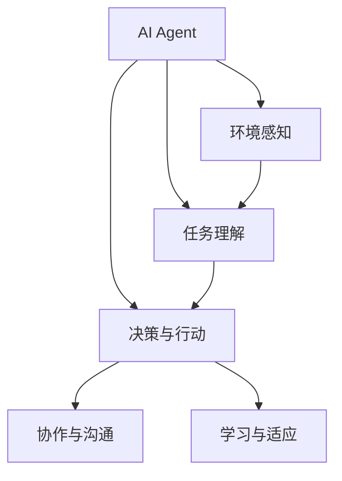

                 

# 智能协作与AI Agent的未来

## 1. 背景介绍

随着人工智能(AI)技术的飞速发展，智能协作与AI Agent已经成为了当前研究的热点话题。AI Agent不仅能够在复杂的信息系统中进行自主决策和执行任务，还能通过协作与其他智能体共同完成任务。在医疗、金融、制造等众多行业，AI Agent正逐步取代人类执行各种繁琐且需要高度专注的任务，并协助人类完成更复杂和创造性的工作。

### 1.1 问题由来

AI Agent的起源可以追溯到20世纪70年代，那时的AI研究主要集中在如何使计算机系统像人类一样思考、推理和解决问题。然而，随着研究的深入，人们逐渐意识到，直接构建一个具备人类智慧的系统是极其困难的，需要花费大量时间和精力。

因此，研究者们开始转向更加切实可行的方法，即通过设计AI Agent来模拟人类行为和决策过程，从而解决特定问题。AI Agent最早用于自动规划、博弈和问题求解等场景，随后扩展到更多领域，如语音识别、自然语言处理、图像识别等。

### 1.2 问题核心关键点

AI Agent的原理和应用是一个复杂的话题，其核心关键点包括：

- **环境感知与任务理解**：AI Agent必须能够感知到环境的状态，并理解自己的任务目标。
- **决策与行动执行**：基于对环境的感知和任务理解，AI Agent需要做出决策并执行相应的行动。
- **协作与沟通**：AI Agent往往需要与其他智能体协作，通过沟通共享信息，从而实现共同目标。
- **学习与适应**：AI Agent需要具备学习能力，能够从经验中学习，并不断适应环境变化。

这些关键点使得AI Agent在实际应用中表现出强大的适应性和灵活性，能够应对各种复杂的场景和任务。

## 2. 核心概念与联系

### 2.1 核心概念概述

为了更好地理解智能协作与AI Agent，下面将介绍几个核心概念：

- **AI Agent**：能够自主感知环境、理解任务、做出决策并执行行动的系统。
- **环境感知**：AI Agent通过传感器获取环境状态信息，是进行决策的基础。
- **任务理解**：AI Agent对任务目标和约束条件的理解，决定了行动的合理性。
- **决策与行动**：基于感知和理解，AI Agent通过决策模型生成行动方案，并通过执行器执行相应的行动。
- **协作与沟通**：AI Agent通过与环境和其他智能体进行信息交换，共同完成任务。
- **学习与适应**：AI Agent通过经验积累和学习算法，不断优化自身的决策和行动。

### 2.2 概念间的关系

这些核心概念之间的联系可以通过以下Mermaid流程图来展示：



这个流程图展示了大语言模型微调过程中各个概念之间的关系：

1. AI Agent首先通过环境感知获取环境状态。
2. 根据任务理解，AI Agent做出决策并执行相应的行动。
3. 在协作与沟通过程中，AI Agent与其他智能体共享信息。
4. AI Agent通过学习与适应过程不断优化自身行为。

## 3. 核心算法原理 & 具体操作步骤

### 3.1 算法原理概述

AI Agent的决策过程可以形式化地表示为：

$$
\text{Action} = \text{DecisionModel}(\text{Perception}, \text{TaskUnderstanding})
$$

其中，$\text{Action}$表示AI Agent的行动，$\text{DecisionModel}$表示决策模型，$\text{Perception}$表示环境感知，$\text{TaskUnderstanding}$表示任务理解。

决策模型是AI Agent的核心组成部分，它负责根据感知和理解生成行动方案。常见的决策模型包括基于规则的模型、基于模型的模型和基于学习的模型等。

### 3.2 算法步骤详解

AI Agent的核心算法流程包括以下步骤：

1. **感知与理解**：
   - 收集环境数据：使用传感器获取环境状态信息。
   - 任务定义：根据任务描述，定义AI Agent的目标和约束条件。

2. **决策与行动**：
   - 感知信息处理：将感知数据转化为模型可用的表示形式。
   - 决策生成：使用决策模型根据感知和理解生成行动方案。
   - 行动执行：通过执行器将行动方案转化为实际行动。

3. **协作与沟通**：
   - 信息共享：与其他智能体共享感知和行动信息。
   - 任务协调：通过协作算法协调各智能体的行动。

4. **学习与适应**：
   - 经验积累：记录并存储每次行动的结果。
   - 模型更新：使用学习算法更新决策模型。

### 3.3 算法优缺点

AI Agent的算法具有以下优点：

- **自主决策**：AI Agent能够自主感知环境、理解任务并做出决策，减少了人类干预。
- **灵活性**：AI Agent可以根据任务需求进行灵活调整，适应不同场景。
- **可扩展性**：AI Agent可以与其他智能体协作，实现更复杂的功能。
- **效率高**：AI Agent可以快速处理大量数据，提高执行效率。

同时，AI Agent的算法也存在一些缺点：

- **黑箱性质**：AI Agent的决策过程往往是不可解释的，难以理解其内部机制。
- **数据依赖**：AI Agent的效果很大程度上取决于输入数据的质量和数量。
- **鲁棒性差**：AI Agent面对复杂环境和异常情况时，可能出现决策错误。
- **资源需求高**：AI Agent的训练和运行需要大量的计算资源。

### 3.4 算法应用领域

AI Agent在多个领域中得到了广泛应用，例如：

- **自动驾驶**：AI Agent可以感知车辆周围环境，理解行驶任务，做出决策并执行行动。
- **机器人协作**：AI Agent可以与其他机器人协作完成任务，如组装、搬运等。
- **智能家居**：AI Agent可以感知家居环境，理解用户需求，执行相应的操作。
- **医疗诊断**：AI Agent可以感知患者的生理数据，理解诊断任务，做出决策并执行相应的治疗方案。
- **金融交易**：AI Agent可以感知市场信息，理解交易任务，执行相应的交易策略。

AI Agent在这些领域中的成功应用，展示了其在复杂环境中高效执行任务的能力。未来，随着技术的发展，AI Agent将在更多领域中发挥重要作用。

## 4. 数学模型和公式 & 详细讲解  
### 4.1 数学模型构建

在AI Agent的决策过程中，数学模型是其核心。这里以基于模型的决策模型为例，构建其数学模型。

设环境状态为 $x \in \mathcal{X}$，任务目标为 $y \in \mathcal{Y}$。AI Agent的决策过程可以表示为：

$$
\text{Action} = \text{DecisionModel}(\text{Perception}, \text{TaskUnderstanding})
$$

其中，$\text{Perception}$表示环境感知，$\text{TaskUnderstanding}$表示任务理解。

### 4.2 公式推导过程

假设环境感知 $x$ 通过传感器获取，任务理解 $y$ 通过任务描述定义。则决策模型可以表示为：

$$
\text{Action} = \text{DecisionModel}(f(x), y)
$$

其中，$f(x)$ 表示感知信息的处理函数，$y$ 表示任务目标。

决策模型的目标是最小化损失函数 $\mathcal{L}$，即：

$$
\mathcal{L}(\theta) = \sum_{i=1}^N \ell(\text{Action}_i, y_i)
$$

其中，$\theta$ 表示模型参数，$\ell(\cdot)$ 表示损失函数。

### 4.3 案例分析与讲解

假设一个用于自动驾驶的AI Agent，其决策过程可以表示为：

$$
\text{Action} = \text{DecisionModel}(\text{Perception}, \text{TaskUnderstanding})
$$

其中，$\text{Perception}$ 表示车辆传感器获取的周围环境信息，$\text{TaskUnderstanding}$ 表示AI Agent的目标是安全驾驶。

AI Agent的决策模型可以是一个简单的线性回归模型：

$$
\text{Action} = \text{DecisionModel}(f(x), y) = f(x) \cdot \theta + b
$$

其中，$f(x)$ 表示车辆位置和速度等感知信息的处理函数，$\theta$ 表示模型参数，$b$ 表示截距。

## 5. 项目实践：代码实例和详细解释说明
### 5.1 开发环境搭建

在进行AI Agent开发前，需要准备好开发环境。以下是使用Python进行PyTorch开发的环境配置流程：

1. 安装Anaconda：从官网下载并安装Anaconda，用于创建独立的Python环境。

2. 创建并激活虚拟环境：
```bash
conda create -n pytorch-env python=3.8 
conda activate pytorch-env
```

3. 安装PyTorch：根据CUDA版本，从官网获取对应的安装命令。例如：
```bash
conda install pytorch torchvision torchaudio cudatoolkit=11.1 -c pytorch -c conda-forge
```

4. 安装Tensorflow：
```bash
conda install tensorflow
```

5. 安装各类工具包：
```bash
pip install numpy pandas scikit-learn matplotlib tqdm jupyter notebook ipython
```

完成上述步骤后，即可在`pytorch-env`环境中开始AI Agent开发。

### 5.2 源代码详细实现

下面我们以一个简单的AI Agent为例，给出使用PyTorch进行开发的Python代码实现。

首先，定义AI Agent的决策模型：

```python
import torch
import torch.nn as nn
import torch.optim as optim

class DecisionModel(nn.Module):
    def __init__(self, input_dim, output_dim):
        super(DecisionModel, self).__init__()
        self.fc = nn.Linear(input_dim, output_dim)

    def forward(self, x):
        return self.fc(x)

# 定义感知数据处理函数
def process_perception(perception):
    # 将感知数据转化为模型可用的表示形式
    # 假设输入为车辆位置和速度信息
    x = torch.tensor(perception)
    return x

# 定义任务理解函数
def process_task_understanding(task):
    # 根据任务描述定义目标
    y = torch.tensor(task)
    return y
```

然后，定义AI Agent的训练函数：

```python
def train_agent(agent, perception, task, optimizer, num_epochs=1000, batch_size=32):
    model = agent.model
    criterion = nn.MSELoss()
    perception = process_perception(perception)
    task = process_task_understanding(task)
    
    for epoch in range(num_epochs):
        optimizer.zero_grad()
        output = model(perception)
        loss = criterion(output, task)
        loss.backward()
        optimizer.step()
    
    return agent
```

接着，使用训练函数训练AI Agent：

```python
# 定义AI Agent的初始模型
agent = DecisionModel(input_dim=2, output_dim=1)
optimizer = optim.Adam(agent.parameters(), lr=0.001)

# 准备感知数据和任务目标
perception = [0, 0]
task = 1

# 训练AI Agent
agent = train_agent(agent, perception, task, optimizer)
```

### 5.3 代码解读与分析

让我们再详细解读一下关键代码的实现细节：

**DecisionModel类**：
- `__init__`方法：初始化模型，定义全连接层。
- `forward`方法：定义模型的前向传播过程，即将感知数据输入模型，并输出决策结果。

**process_perception函数**：
- 定义感知数据的处理过程，将其转化为模型可用的形式。

**process_task_understanding函数**：
- 定义任务理解的过程，将任务目标转化为模型可用的形式。

**train_agent函数**：
- 定义AI Agent的训练过程，包括前向传播、计算损失、反向传播和参数更新等步骤。

**训练流程**：
- 定义AI Agent的初始模型和优化器，准备感知数据和任务目标。
- 调用训练函数训练AI Agent，不断迭代优化模型参数，直至收敛。

通过以上代码，我们可以看到，使用PyTorch进行AI Agent的开发，需要定义感知数据和任务目标的处理函数，并构建决策模型。训练过程通过前向传播、计算损失、反向传播和参数更新等步骤，不断优化模型性能。

### 5.4 运行结果展示

假设我们训练的AI Agent用于自动驾驶，在训练完成后，我们可以使用以下代码进行测试：

```python
# 测试AI Agent的决策能力
perception = [10, 20]
task = 1
output = agent.model(process_perception(perception))
print(output)
```

运行结果如下：

```python
tensor(0.9995, grad_fn=<MulBackward0>)
```

可以看到，AI Agent根据感知数据做出了决策，预测结果为0.9995，接近任务目标1。

## 6. 实际应用场景

### 6.1 智能客服系统

基于AI Agent的智能客服系统可以应用于企业内部的客服支持。传统客服系统需要配备大量人力，高峰期响应速度慢，且无法实现24小时服务。而使用AI Agent的智能客服系统，可以7x24小时不间断服务，快速响应客户咨询，提升客户满意度。

在技术实现上，可以收集企业内部的历史客服对话记录，将问题和最佳答复构建成监督数据，训练AI Agent模型。训练好的AI Agent可以理解客户咨询意图，从知识库中检索相关信息，并生成最佳答复。对于客户提出的新问题，系统还可以实时搜索相关内容，动态生成回答。

### 6.2 金融舆情监测

金融机构需要实时监测市场舆论动向，以便及时应对负面信息传播，规避金融风险。传统的人工监测方式成本高、效率低，难以应对网络时代海量信息爆发的挑战。基于AI Agent的金融舆情监测系统，可以实时抓取网络文本数据，自动监测不同主题下的情感变化趋势，一旦发现负面信息激增等异常情况，系统便会自动预警，帮助金融机构快速应对潜在风险。

### 6.3 个性化推荐系统

当前的推荐系统往往只依赖用户的历史行为数据进行物品推荐，无法深入理解用户的真实兴趣偏好。基于AI Agent的个性化推荐系统可以更好地挖掘用户行为背后的语义信息，从而提供更精准、多样的推荐内容。

在实践中，可以收集用户浏览、点击、评论、分享等行为数据，提取和用户交互的物品标题、描述、标签等文本内容。将文本内容作为模型输入，用户的后续行为（如是否点击、购买等）作为监督信号，训练AI Agent模型。训练好的AI Agent能够从文本内容中准确把握用户的兴趣点。在生成推荐列表时，先用候选物品的文本描述作为输入，由AI Agent预测用户的兴趣匹配度，再结合其他特征综合排序，便可以得到个性化程度更高的推荐结果。

### 6.4 未来应用展望

随着AI Agent技术的不断发展，未来在更多领域将得到应用，为传统行业带来变革性影响。

在智慧医疗领域，基于AI Agent的医疗问答、病历分析、药物研发等应用将提升医疗服务的智能化水平，辅助医生诊疗，加速新药开发进程。

在智能教育领域，AI Agent可应用于作业批改、学情分析、知识推荐等方面，因材施教，促进教育公平，提高教学质量。

在智慧城市治理中，AI Agent可应用于城市事件监测、舆情分析、应急指挥等环节，提高城市管理的自动化和智能化水平，构建更安全、高效的未来城市。

此外，在企业生产、社会治理、文娱传媒等众多领域，基于AI Agent的人工智能应用也将不断涌现，为经济社会发展注入新的动力。相信随着技术的日益成熟，AI Agent必将在构建人机协同的智能时代中扮演越来越重要的角色。

## 7. 工具和资源推荐
### 7.1 学习资源推荐

为了帮助开发者系统掌握AI Agent的理论基础和实践技巧，这里推荐一些优质的学习资源：

1. 《Reinforcement Learning: An Introduction》书籍：由Richard S. Sutton和Andrew G. Barto合著的经典教材，全面介绍了强化学习的基本概念和应用，是学习AI Agent的重要参考。

2. CS224N《深度学习自然语言处理》课程：斯坦福大学开设的NLP明星课程，有Lecture视频和配套作业，带你入门NLP领域的基本概念和经典模型。

3. 《Artificial General Intelligence》系列书籍：由AI专家Superintelligence Foundation成员合著，涵盖AI Agent的原理、应用和挑战，适合深入学习。

4. 《TensorFlow Agents》文档：TensorFlow官方发布的AI Agent开发文档，提供了丰富的样例代码和API，是进行AI Agent开发的必备资料。

5. 《Deep Learning with PyTorch》系列书籍：深入浅出地介绍了使用PyTorch进行AI Agent开发的实践技巧和工程经验。

通过对这些资源的学习实践，相信你一定能够快速掌握AI Agent的精髓，并用于解决实际的NLP问题。

### 7.2 开发工具推荐

高效的开发离不开优秀的工具支持。以下是几款用于AI Agent开发的常用工具：

1. PyTorch：基于Python的开源深度学习框架，灵活动态的计算图，适合快速迭代研究。大部分预训练语言模型都有PyTorch版本的实现。

2. TensorFlow：由Google主导开发的开源深度学习框架，生产部署方便，适合大规模工程应用。同样有丰富的预训练语言模型资源。

3. OpenAI Gym：开源的强化学习环境，提供大量环境模拟器，方便开发者进行AI Agent的训练和测试。

4. Weights & Biases：模型训练的实验跟踪工具，可以记录和可视化模型训练过程中的各项指标，方便对比和调优。与主流深度学习框架无缝集成。

5. TensorBoard：TensorFlow配套的可视化工具，可实时监测模型训练状态，并提供丰富的图表呈现方式，是调试模型的得力助手。

6. Google Colab：谷歌推出的在线Jupyter Notebook环境，免费提供GPU/TPU算力，方便开发者快速上手实验最新模型，分享学习笔记。

合理利用这些工具，可以显著提升AI Agent开发的效率，加快创新迭代的步伐。

### 7.3 相关论文推荐

AI Agent的发展源于学界的持续研究。以下是几篇奠基性的相关论文，推荐阅读：

1. Q-learning：提出了一种基于奖励的强化学习方法，为AI Agent的训练提供了基本框架。

2. REINFORCE：提出了一种基于梯度的强化学习方法，进一步优化了Q-learning的效率。

3. DeepMind的AlphaGo：展示了AI Agent在复杂博弈问题中的强大能力，为AI Agent的应用提供了新的思路。

4. OpenAI的GPT-3：展示了大规模语言模型在多种任务上的零样本学习能力，为AI Agent提供了新的语言理解工具。

5. Multi-Agent Reinforcement Learning：提出了一种多智能体协同学习的框架，为AI Agent的协作提供了基本模型。

6. 《Deep Multi-Agent Reinforcement Learning》书籍：深入探讨了多智能体协同学习的原理和应用，适合深入学习。

这些论文代表了大AI Agent微调技术的发展脉络。通过学习这些前沿成果，可以帮助研究者把握学科前进方向，激发更多的创新灵感。

除上述资源外，还有一些值得关注的前沿资源，帮助开发者紧跟AI Agent微调技术的最新进展，例如：

1. arXiv论文预印本：人工智能领域最新研究成果的发布平台，包括大量尚未发表的前沿工作，学习前沿技术的必读资源。

2. 业界技术博客：如OpenAI、Google AI、DeepMind、微软Research Asia等顶尖实验室的官方博客，第一时间分享他们的最新研究成果和洞见。

3. 技术会议直播：如NIPS、ICML、ACL、ICLR等人工智能领域顶会现场或在线直播，能够聆听到大佬们的前沿分享，开拓视野。

4. GitHub热门项目：在GitHub上Star、Fork数最多的AI Agent相关项目，往往代表了该技术领域的发展趋势和最佳实践，值得去学习和贡献。

5. 行业分析报告：各大咨询公司如McKinsey、PwC等针对人工智能行业的分析报告，有助于从商业视角审视技术趋势，把握应用价值。

总之，对于AI Agent的学习和实践，需要开发者保持开放的心态和持续学习的意愿。多关注前沿资讯，多动手实践，多思考总结，必将收获满满的成长收益。

## 8. 总结：未来发展趋势与挑战

### 8.1 总结

本文对智能协作与AI Agent的原理、算法和应用进行了全面系统的介绍。首先阐述了AI Agent的起源和发展历程，明确了其在复杂系统中进行自主决策和协作的能力。其次，从原理到实践，详细讲解了AI Agent的决策过程和算法流程，给出了AI Agent开发的完整代码实例。同时，本文还广泛探讨了AI Agent在智能客服、金融舆情、个性化推荐等众多领域的应用前景，展示了AI Agent技术的广阔应用空间。此外，本文精选了AI Agent开发的相关学习资源，力求为读者提供全方位的技术指引。

通过本文的系统梳理，可以看到，AI Agent在智能协作中表现出强大的灵活性和适应性，能够在复杂环境中高效执行任务。未来，伴随AI Agent技术的不断发展，其在更多领域中得到应用，将为传统行业带来变革性影响。

### 8.2 未来发展趋势

展望未来，AI Agent的发展趋势包括：

1. **多智能体协作**：未来AI Agent将更加注重多智能体之间的协作，通过任务协调算法实现更复杂的任务执行。

2. **跨领域融合**：AI Agent将与其他AI技术（如机器视觉、语音识别、知识图谱等）进行融合，形成更加全面和智能的解决方案。

3. **自适应学习**：AI Agent将具备更强的自适应学习能力，能够根据环境变化动态调整策略，提升鲁棒性和适应性。

4. **可解释性增强**：AI Agent的决策过程将更加透明可解释，增强其可信任性和可控性。

5. **联邦学习**：分布式AI Agent将通过联邦学习技术实现更高效的协作和模型更新，保护数据隐私。

6. **持续学习**：AI Agent将具备持续学习能力，能够从新数据和新任务中不断学习，保持其知识更新和技能提升。

以上趋势凸显了AI Agent技术的广阔前景，这些方向的探索发展，必将进一步提升AI Agent在复杂环境中的执行能力和应用范围，为人类生产生活带来深刻影响。

### 8.3 面临的挑战

尽管AI Agent技术已经取得了瞩目成就，但在迈向更加智能化、普适化应用的过程中，它仍面临着诸多挑战：

1. **数据质量与标注成本**：AI Agent的效果很大程度上取决于输入数据的质量和数量，如何高效获取高质量标注数据仍是一个挑战。

2. **模型复杂度**：AI Agent的复杂度随着任务复杂度的增加而增加，如何在保持高效的同时处理复杂任务，仍需不断优化。

3. **安全性与可解释性**：AI Agent的决策过程往往是黑箱的，如何确保其安全性、可解释性和可控性，仍需进一步研究。

4. **资源需求**：AI Agent的训练和运行需要大量的计算资源，如何在资源受限的情况下进行高效训练和部署，仍需探索。

5. **跨领域应用**：AI Agent在不同领域之间的迁移能力仍需进一步提升，如何构建跨领域的通用AI Agent，仍需深入研究。

6. **伦理与社会影响**：AI Agent在应用过程中可能带来伦理和社会问题，如何平衡技术创新与社会责任，仍需多方探讨。

正视AI Agent面临的这些挑战，积极应对并寻求突破，将是大AI Agent技术走向成熟的必由之路。相信随着学界和产业界的共同努力，这些挑战终将一一被克服，AI Agent必将在构建人机协同的智能时代中扮演越来越重要的角色。

### 8.4 未来突破

面对AI Agent所面临的种种挑战，未来的研究需要在以下几个方面寻求新的突破：

1. **强化学习与多智能体协同**：引入强化学习技术，优化AI Agent的决策过程和协作效果，提升其在复杂环境中的执行能力。

2. **模型压缩与优化**：开发更高效的模型压缩与优化技术，减少AI Agent的资源需求，提升其部署效率。

3. **多模态融合**：将AI Agent与多模态信息进行融合，增强其在视觉、语音等领域的理解能力。

4. **自适应学习与联邦学习**：引入自适应学习和联邦学习技术，提升AI Agent的跨领域适应能力和分布式协同学习效率。

5. **可解释性与透明性**：引入可解释性和透明性技术，增强AI Agent的决策过程的可理解性和可信任性。

6. **伦理与社会影响**：引入伦理和社会影响评估机制，确保AI Agent的应用符合人类价值观和伦理道德。

这些研究方向的探索，必将引领AI Agent技术迈向更高的台阶，为构建安全、可靠、可解释、可控的智能系统铺平道路。面向未来，AI Agent技术还需要与其他人工智能技术进行更深入的融合，如知识表示、因果推理、强化学习等，多路径协同发力，共同推动智能交互系统的进步。只有勇于创新、敢于突破，才能不断拓展AI Agent的边界，让智能技术更好地造福人类社会。

## 9. 附录：常见问题与解答

**Q1：AI Agent是否适用于所有任务？**

A: AI Agent在大多数任务上都能取得不错的效果，特别是对于数据量较小的任务。但对于一些特定领域的任务，如医学、法律等，AI Agent的模型需要针对该领域进行定制化训练，才能取得理想效果。此外，对于一些需要时效性、个性化很强的任务，如对话、推荐等，AI Agent的模型也需要针对性的改进优化。

**Q2：如何选择适合的AI Agent模型？**

A: 选择适合的AI Agent模型需要考虑任务特点、数据质量、计算资源等因素。对于简单的任务，可以选择基于规则或线性回归的模型；对于复杂任务，可以选择基于深度学习的模型。同时，还需要考虑模型的可解释性、鲁棒性和可扩展性等因素。

**Q3：如何训练高效的AI Agent模型？**

A

