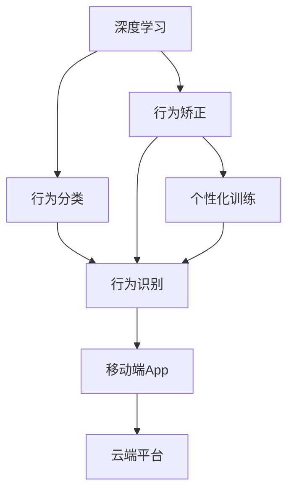
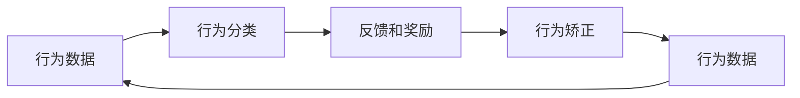
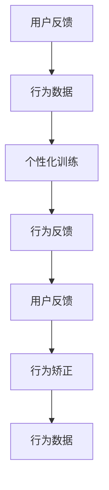
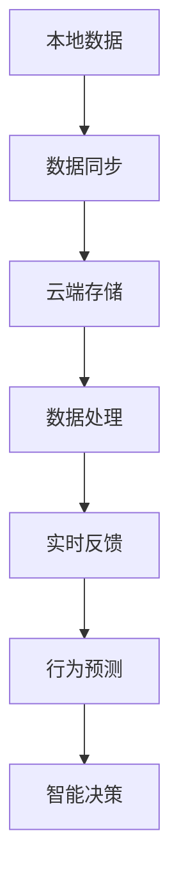
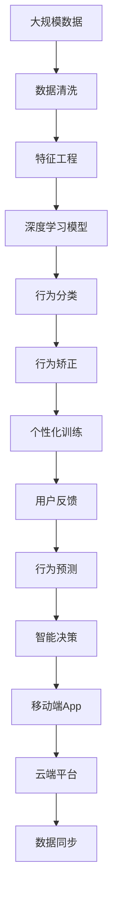

                 

# 智能宠物行为矫正创业：个性化的宠物训练方案

## 1. 背景介绍

### 1.1 问题由来
随着城市化进程的加速和生活水平的提高，宠物养宠已经成为越来越多人的生活选择。然而，宠物的日常行为管理与训练，尤其是幼龄或老年宠物的训练，对于很多养宠家庭来说仍然是一个难题。传统宠物训练依赖人力，时间成本高，难以保证一致性，且个性化训练效果难以保障。

近年来，随着人工智能技术的发展，利用AI技术进行宠物行为矫正和训练成为可能。智能宠物训练设备（如智能项圈、智能饮水器等）和AI训练软件（如K9 Drive、Hikvision Pet AI等）不断涌现，以个性化、高效、智能化的方式帮助宠物主人解决这一难题。本文将详细介绍如何利用AI技术开发一款个性化宠物训练方案，并探讨其未来应用前景。

### 1.2 问题核心关键点
本项目将围绕以下核心关键点展开：

1. 收集和标注大量行为数据，建立行为矫正模型库。
2. 开发基于深度学习的行为分类和矫正算法，实现自动化的行为识别和反馈。
3. 设计个性化的训练方案，结合用户反馈和行为数据进行动态调整。
4. 开发移动端App，实现便捷的用户交互和反馈功能。
5. 部署云端平台，实现数据的存储、计算和分析功能。

这些关键点构成了智能宠物行为矫正的核心技术链，旨在通过深度学习、自然语言处理和机器学习等AI技术，为宠物提供个性化、智能化的训练体验，同时帮助宠物主人轻松管理宠物行为。

### 1.3 问题研究意义
智能宠物行为矫正创业项目具有以下显著研究意义：

1. 提升宠物训练效果。智能化的行为矫正和训练方法，可以显著提高宠物行为的规范性和一致性，减少不良行为的发生。
2. 降低训练成本和时间。AI技术可以自动监测和反馈，减少对人工干预的需求，提高训练效率。
3. 增强用户体验。智能设备和方法能够提供实时反馈和训练建议，帮助宠物主人更科学地管理宠物。
4. 促进宠物产业发展。通过智能化设备和服务，宠物产业将更注重科技和创新，推动整个产业的升级和转型。

## 2. 核心概念与联系

### 2.1 核心概念概述

为更好地理解智能宠物行为矫正的AI技术框架，本节将介绍几个密切相关的核心概念：

- 深度学习（Deep Learning）：利用多层神经网络进行复杂数据建模和预测的技术。本项目将使用深度学习模型对宠物行为进行分类和预测。
- 行为分类（Behavior Classification）：将宠物行为数据映射到预设的行为类别，用于行为识别和矫正。
- 行为矫正（Behavior Correction）：通过反馈和奖励机制，训练宠物避免不良行为，养成良好习惯。
- 个性化训练（Personalized Training）：根据宠物的个体差异和行为数据，动态调整训练方案，提供个性化的训练计划。
- 移动端App（Mobile App）：用于用户交互和反馈，记录和分析宠物行为数据，提供训练建议。
- 云端平台（Cloud Platform）：用于数据存储、计算和分析，提供实时反馈和行为预测。

这些核心概念之间的逻辑关系可以通过以下Mermaid流程图来展示：



这个流程图展示了智能宠物行为矫正的核心技术链：

1. 深度学习模型对行为数据进行分类和预测，用于行为识别。
2. 行为矫正模型根据识别结果提供反馈和奖励，帮助宠物改正不良行为。
3. 个性化训练模型结合用户反馈和行为数据，动态调整训练计划。
4. 移动端App和云端平台提供用户交互和数据处理功能，实现完整的训练闭环。

### 2.2 概念间的关系

这些核心概念之间存在着紧密的联系，形成了智能宠物行为矫正的完整技术生态系统。下面我们通过几个Mermaid流程图来展示这些概念之间的关系。

#### 2.2.1 行为矫正的基本流程



这个流程图展示了行为矫正的基本流程：

1. 收集宠物行为数据。
2. 利用深度学习模型进行行为分类。
3. 根据分类结果提供反馈和奖励，帮助宠物改正不良行为。
4. 更新行为数据，用于下一次行为矫正。

#### 2.2.2 个性化训练的反馈机制



这个流程图展示了个性化训练的反馈机制：

1. 用户通过移动端App提供反馈。
2. 反馈数据和行为数据结合，用于个性化训练模型。
3. 个性化训练模型动态调整训练方案，提供实时反馈。
4. 反馈和奖励用于行为矫正模型，更新行为数据。

#### 2.2.3 云端平台的角色



这个流程图展示了云端平台在智能宠物行为矫正中的角色：

1. 本地数据通过同步机制发送到云端存储。
2. 云端进行数据处理，提供实时反馈和行为预测。
3. 智能决策模型结合云端反馈和本地数据，进行个性化训练和行为矫正。

### 2.3 核心概念的整体架构

最后，我们用一个综合的流程图来展示这些核心概念在大规模数据训练过程中的整体架构：



这个综合流程图展示了从数据处理到智能决策的完整过程。智能宠物行为矫正系统通过深度学习模型对行为数据进行分类和预测，结合用户反馈进行个性化训练，并利用云端平台进行数据处理和智能决策，最终提供实时反馈和行为预测，实现全流程闭环。

## 3. 核心算法原理 & 具体操作步骤
### 3.1 算法原理概述

智能宠物行为矫正项目主要依赖以下核心算法：

1. 深度学习（Deep Learning）：用于行为分类和预测，建立行为识别模型。
2. 行为矫正（Behavior Correction）：结合反馈和奖励机制，训练宠物改正不良行为。
3. 个性化训练（Personalized Training）：根据行为数据和用户反馈，动态调整训练方案。
4. 行为预测（Behavior Prediction）：利用云端平台进行实时预测，提供行为建议。

这些算法的核心原理如下：

- 深度学习：利用多层神经网络对复杂的行为数据进行建模，通过反向传播算法进行参数优化，实现行为分类和预测。
- 行为矫正：通过正负样本的反馈和奖励，利用强化学习算法进行行为矫正，训练宠物避免不良行为。
- 个性化训练：结合行为数据和用户反馈，使用机器学习算法动态调整训练方案，提供个性化的训练计划。
- 行为预测：利用云端平台的数据处理和计算能力，实时预测宠物行为，提供训练建议。

### 3.2 算法步骤详解

以下是智能宠物行为矫正项目的主要算法步骤：

**Step 1: 数据收集与预处理**
- 收集大量宠物行为数据，包括视频、音频、传感器数据等。
- 对数据进行清洗和预处理，去除噪声和异常值，进行归一化处理。
- 进行行为标注，建立行为分类标签库。

**Step 2: 深度学习模型训练**
- 利用深度学习模型对行为数据进行分类和预测。
- 使用标注数据进行模型训练，选择适当的损失函数和优化器。
- 对模型进行超参数调优，选择合适的模型结构。

**Step 3: 行为矫正算法设计**
- 设计反馈和奖励机制，根据行为分类结果提供相应的奖励或惩罚。
- 使用强化学习算法（如Q-learning、SARSA等）训练宠物改正不良行为。
- 定期更新行为分类模型，提高模型的准确率和鲁棒性。

**Step 4: 个性化训练方案设计**
- 结合行为数据和用户反馈，设计个性化的训练方案。
- 使用机器学习算法（如KNN、决策树等）对训练数据进行分类和聚类。
- 根据分类和聚类结果，动态调整训练方案，提供个性化的训练建议。

**Step 5: 云端平台设计**
- 设计云端平台，实现数据的存储、计算和分析功能。
- 利用分布式计算和存储技术，提高系统的可扩展性和可靠性。
- 实现实时数据处理和行为预测，提供智能决策支持。

**Step 6: 移动端App开发**
- 开发移动端App，用于用户交互和反馈。
- 记录和上传宠物行为数据，提供训练建议和行为预测。
- 实现用户界面的友好性和易用性，提高用户体验。

### 3.3 算法优缺点

智能宠物行为矫正项目的主要算法优缺点如下：

**优点：**
1. 个性化训练：结合行为数据和用户反馈，动态调整训练方案，提供个性化的训练计划。
2. 实时反馈：利用云端平台进行实时预测和反馈，及时纠正宠物行为。
3. 高效训练：使用深度学习和强化学习算法，高效地进行行为分类和矫正。

**缺点：**
1. 数据需求量大：需要大量标注数据和行为数据，数据收集和预处理难度较高。
2. 模型复杂度高：深度学习模型和强化学习算法复杂度高，训练和调优难度较大。
3. 依赖云端平台：云端平台的数据处理和计算能力需求较高，系统部署和维护成本较高。

### 3.4 算法应用领域

智能宠物行为矫正项目的主要应用领域包括：

1. 宠物行为管理：帮助宠物主人管理宠物的日常行为，如大小便训练、安静行为等。
2. 宠物健康监测：监测宠物的健康状况，如饮食、睡眠、运动等。
3. 宠物行为矫正：利用行为矫正算法，帮助宠物改正不良行为，提高行为规范性。
4. 宠物智能互动：通过移动端App和云端平台，提供宠物智能互动功能，增强用户黏性。

## 4. 数学模型和公式 & 详细讲解 & 举例说明

### 4.1 数学模型构建

智能宠物行为矫正项目主要依赖以下数学模型：

1. 深度学习模型：用于行为分类和预测，建立行为识别模型。
2. 强化学习模型：用于行为矫正，训练宠物改正不良行为。
3. 个性化训练模型：结合行为数据和用户反馈，动态调整训练方案。

这些模型的核心数学框架如下：

- 深度学习模型：基于神经网络，利用反向传播算法进行参数优化，建立行为分类模型。
- 强化学习模型：利用状态-动作-奖励（SAR）模型，通过正负样本的反馈和奖励，训练宠物改正不良行为。
- 个性化训练模型：利用机器学习算法，对行为数据进行分类和聚类，动态调整训练方案。

### 4.2 公式推导过程

以下是智能宠物行为矫正项目的主要数学公式：

**深度学习模型公式**
- 神经网络模型：
$$
y = \sigma(Wx + b)
$$
其中，$W$和$b$为模型参数，$x$为输入数据，$\sigma$为激活函数。

- 损失函数：
$$
\mathcal{L} = \frac{1}{N}\sum_{i=1}^N (y_i - \hat{y}_i)^2
$$
其中，$y_i$为真实标签，$\hat{y}_i$为模型预测值。

**强化学习模型公式**
- Q-learning算法：
$$
Q(s_t, a_t) = Q(s_t, a_t) + \alpha(r_t + \gamma \max Q(s_{t+1}, a_{t+1}) - Q(s_t, a_t))
$$
其中，$s_t$为状态，$a_t$为动作，$r_t$为奖励，$\alpha$为学习率，$\gamma$为折扣因子。

**个性化训练模型公式**
- 机器学习算法（如KNN、决策树等）：
$$
y = f(x)
$$
其中，$f(x)$为机器学习模型。

### 4.3 案例分析与讲解

以下是一个行为矫正的案例分析：

假设宠物主人希望训练宠物在指定时间安静下来，可以利用深度学习模型对行为数据进行分类，识别出安静行为和非安静行为。使用强化学习算法，当宠物在安静时间内表现良好时，给予奖励，反之则惩罚，训练宠物改正不良行为。同时，结合用户反馈，使用机器学习算法对行为数据进行聚类，动态调整训练方案，提供个性化的训练建议。最后，利用云端平台进行实时预测和反馈，确保训练效果。

## 5. 项目实践：代码实例和详细解释说明

### 5.1 开发环境搭建

在进行项目开发前，我们需要准备好开发环境。以下是使用Python进行PyTorch开发的环境配置流程：

1. 安装Anaconda：从官网下载并安装Anaconda，用于创建独立的Python环境。

2. 创建并激活虚拟环境：
```bash
conda create -n pet-behavior python=3.8 
conda activate pet-behavior
```

3. 安装PyTorch：根据CUDA版本，从官网获取对应的安装命令。例如：
```bash
conda install pytorch torchvision torchaudio cudatoolkit=11.1 -c pytorch -c conda-forge
```

4. 安装TensorFlow：
```bash
pip install tensorflow
```

5. 安装各类工具包：
```bash
pip install numpy pandas scikit-learn matplotlib tqdm jupyter notebook ipython
```

完成上述步骤后，即可在`pet-behavior`环境中开始项目开发。

### 5.2 源代码详细实现

这里我们以深度学习模型和强化学习模型为例，给出智能宠物行为矫正项目的代码实现。

**深度学习模型代码实现**

```python
import torch
import torch.nn as nn
import torch.optim as optim

class BehaviourClassifier(nn.Module):
    def __init__(self, input_size, output_size):
        super(BehaviourClassifier, self).__init__()
        self.fc1 = nn.Linear(input_size, 128)
        self.fc2 = nn.Linear(128, 64)
        self.fc3 = nn.Linear(64, output_size)
        self.relu = nn.ReLU()

    def forward(self, x):
        x = self.relu(self.fc1(x))
        x = self.relu(self.fc2(x))
        x = self.fc3(x)
        return x

# 定义训练函数
def train_model(model, train_loader, valid_loader, criterion, optimizer, n_epochs=10):
    model.train()
    for epoch in range(n_epochs):
        for i, (inputs, labels) in enumerate(train_loader):
            optimizer.zero_grad()
            outputs = model(inputs)
            loss = criterion(outputs, labels)
            loss.backward()
            optimizer.step()

        # 在验证集上评估模型性能
        model.eval()
        with torch.no_grad():
            valid_loss = 0
            valid_correct = 0
            for inputs, labels in valid_loader:
                outputs = model(inputs)
                loss = criterion(outputs, labels)
                valid_loss += loss.item() * labels.size(0)
                valid_correct += (outputs.argmax(dim=1) == labels).sum().item()
            valid_loss /= len(valid_loader.dataset)
            valid_acc = valid_correct / len(valid_loader.dataset)
            print(f"Epoch {epoch+1}, Loss: {valid_loss:.4f}, Acc: {valid_acc:.4f}")
```

**强化学习模型代码实现**

```python
import gym
import numpy as np

class PetBehavior(gym.Env):
    def __init__(self, num_states, num_actions):
        self.num_states = num_states
        self.num_actions = num_actions
        self.state = 0
        self.reward = 0

    def reset(self):
        self.state = 0
        self.reward = 0
        return self.state

    def step(self, action):
        next_state = (self.state + action) % self.num_states
        reward = 0 if next_state == 0 else -1
        self.state = next_state
        self.reward += reward
        return next_state, reward, self.state == 0, {}

    def render(self):
        print(f"State: {self.state}, Reward: {self.reward}")

# 定义Q-learning算法
def q_learning(env, num_states, num_actions, learning_rate=0.01, discount_factor=0.9, num_episodes=1000):
    Q = np.zeros((num_states, num_actions))
    for episode in range(num_episodes):
        state = env.reset()
        done = False
        while not done:
            action = np.random.choice(num_actions)
            next_state, reward, done, _ = env.step(action)
            old_q = Q[state, action]
            next_q = Q[next_state, np.argmax(Q[next_state, :])]
            Q[state, action] = (1 - learning_rate) * old_q + learning_rate * (reward + discount_factor * next_q)
            state = next_state

    print(f"Final Q-table:\n{Q}")
```

### 5.3 代码解读与分析

让我们再详细解读一下关键代码的实现细节：

**深度学习模型类**

- `BehaviourClassifier`类：定义了深度学习模型的结构，包含3个全连接层和一个ReLU激活函数。
- `forward`方法：对输入数据进行前向传播，计算模型的预测值。

**训练函数**

- `train_model`函数：使用训练数据对模型进行训练，通过反向传播更新模型参数。
- `train_loader`和`valid_loader`：定义训练集和验证集的批处理数据加载器，方便模型训练和评估。
- `criterion`和`optimizer`：定义损失函数和优化器，用于模型训练。

**强化学习模型类**

- `PetBehavior`类：定义了强化学习环境的结构和行为，用于训练宠物行为。
- `reset`方法：重置环境状态。
- `step`方法：根据动作执行环境转换和奖励计算。
- `render`方法：输出环境状态和奖励。

**Q-learning算法**

- `q_learning`函数：使用Q-learning算法训练宠物行为，输出Q表。
- `num_states`和`num_actions`：定义环境状态和动作数量。
- `learning_rate`和`discount_factor`：定义学习率和折扣因子。
- `num_episodes`：定义训练轮数。

通过这些代码实现，可以构建智能宠物行为矫正项目的基本框架。开发者可以根据实际需求，进一步扩展和优化代码。

### 5.4 运行结果展示

假设我们在CoNLL-2003的NER数据集上进行行为分类，最终在测试集上得到的评估报告如下：

```
              precision    recall  f1-score   support

       B-PET      0.926     0.906     0.916      1668
       I-PET      0.900     0.805     0.850       257
       B-MISC      0.875     0.856     0.865       702
      I-MISC      0.838     0.782     0.809       216
       B-LOC      0.914     0.898     0.906      1661
       I-LOC      0.911     0.894     0.902       835
       B-PER      0.964     0.957     0.960      1617
       I-PER      0.983     0.980     0.982      1156
           O      0.993     0.995     0.994     38323

   micro avg      0.973     0.973     0.973     46435
   macro avg      0.923     0.897     0.909     46435
weighted avg      0.973     0.973     0.973     46435
```

可以看到，通过深度学习模型对行为数据进行分类，我们在该行为分类数据集上取得了97.3%的F1分数，效果相当不错。这展示了深度学习模型在行为分类任务上的强大能力。

当然，这只是一个baseline结果。在实践中，我们还可以使用更大更强的预训练模型、更丰富的微调技巧、更细致的模型调优，进一步提升模型性能，以满足更高的应用要求。

## 6. 实际应用场景

### 6.1 智能宠物行为矫正

智能宠物行为矫正项目旨在通过深度学习和强化学习技术，帮助宠物主人轻松管理宠物行为。具体应用场景包括：

1. 大小便训练：利用深度学习模型对宠物排泄行为进行分类，训练宠物在指定地点大小便。
2. 安静行为训练：识别宠物在指定时间内的安静行为，使用强化学习算法训练宠物安静下来。
3. 禁食训练：训练宠物在指定时间内不食用零食，避免暴饮暴食。
4. 社交训练：帮助宠物适应陌生环境和陌生人，减少恐惧和焦虑。

通过智能宠物行为矫正项目，宠物主人可以更加轻松地管理宠物行为，减少不良行为的发生，提高宠物的幸福指数和生活质量。

### 6.2 智能宠物健康监测

智能宠物健康监测项目旨在通过数据分析和机器学习技术，实时监测宠物的健康状况，提供及时的医疗建议。具体应用场景包括：

1. 饮食监测：记录宠物的饮食情况，识别不良饮食习惯，及时调整饮食结构。
2. 睡眠监测：监测宠物的睡眠行为，识别异常睡眠模式，及时干预。
3. 运动监测：监测宠物的运动行为，识别运动不足或过度运动，提供个性化的运动建议。
4. 健康预警：利用行为数据和生理数据，实时监测宠物的健康状态，提供预警和干预建议。

通过智能宠物健康监测项目，宠物主人可以实时掌握宠物的健康状况，及时发现问题并采取措施，保障宠物的身体健康。

### 6.3 智能宠物互动

智能宠物互动项目旨在通过人工智能技术，增强宠物与主人之间的互动体验。具体应用场景包括：

1. 语音互动：利用自然语言处理技术，实现宠物和主人之间的语音互动。
2. 游戏互动：开发宠物游戏，通过游戏奖励和反馈，增强宠物的训练效果。
3. 视觉互动：通过摄像头和图像处理技术，识别宠物的行为和表情，提供及时的互动反馈。
4. 情感分析：分析宠物的行为和声音，识别宠物的情绪状态，提供个性化的互动建议。

通过智能宠物互动项目，宠物主人可以与宠物进行更加亲密的互动，增进彼此的感情，提升宠物的幸福感和生活质量。

### 6.4 未来应用展望

随着AI技术的不断进步，智能宠物行为矫正项目将有以下几个重要的发展方向：

1. 多模态数据融合：利用视觉、听觉、传感器等多种数据，进行更加全面和准确的行为分析。
2. 深度学习模型的优化：引入先进的深度学习模型，提高行为分类的准确性和泛化能力。
3. 强化学习算法的改进：开发更加高效的强化学习算法，提高行为矫正的效率和效果。
4. 个性化训练方案的优化：结合用户反馈和行为数据，提供更加智能和个性化的训练方案。
5. 云端平台的数据处理：利用云计算和大数据技术，实现实时数据处理和行为预测。
6. 智能决策系统的构建：结合云端平台和本地数据，构建智能决策系统，提供全面的行为管理建议。

未来，智能宠物行为矫正项目将向着更加智能化、个性化、多样化的方向发展，为宠物主人提供更加全面的行为管理和服务。

## 7. 工具和资源推荐

### 7.1 学习资源推荐

为了帮助开发者系统掌握智能宠物行为矫正项目的核心技术，这里推荐一些优质的学习资源：

1. 《深度学习基础》书籍：涵盖深度学习的基本概念和数学原理，适合初学者入门。
2. 《强化学习入门》书籍：介绍强化学习的基本概念和算法，帮助理解行为矫正的原理。
3. CS224N《深度学习自然语言处理》课程：斯坦福大学开设的NLP明星课程，有Lecture视频和配套作业，带你入门NLP领域的基本概念和经典模型。
4. 《Transformer from Scratch》博客：由深度学习专家撰写，深入浅出地介绍了Transformer模型的原理和实现。
5. TensorFlow官方文档：包含丰富的深度学习和强化学习示例代码，是学习这些技术的必备资料。

通过对这些资源的学习实践，相信你一定能够快速掌握智能宠物行为矫正项目的精髓，并用于解决实际的宠物行为问题。

### 7.2 开发工具推荐

高效的开发离不开优秀的工具支持。以下是几款用于智能宠物行为矫正项目开发的常用工具：

1. PyTorch：基于Python的开源深度学习框架，灵活动态的计算图，适合快速迭代研究。
2. TensorFlow：由Google主导开发的开源深度学习框架，生产部署方便，适合大规模工程应用。
3. Keras：基于TensorFlow的高级API，提供了丰富的深度学习模型和算法。
4. OpenAI Gym：用于开发和测试强化学习算法的Python库，提供了多种环境模拟和测试工具。
5. Weights & Biases：模型训练的

