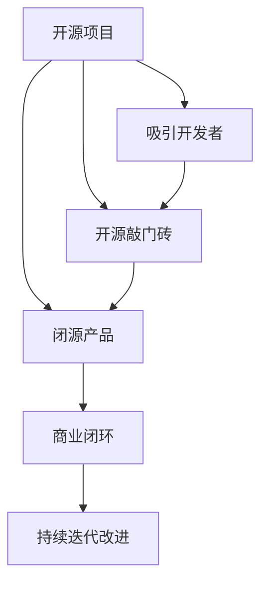

                 

# 智谱AI开源赚钱双模式,开源只是敲门砖引导闭源商业化

> 关键词：AI开源,赚钱双模式,开源敲门砖,商业化路线

## 1. 背景介绍

### 1.1 问题由来

随着人工智能(AI)技术的迅速发展，开源项目在AI领域逐渐兴起。AI开源项目通过开放源代码和工具，极大地降低了进入AI领域的门槛，加速了AI技术的普及和发展。但同时也导致开源社区竞争激烈，资源分散，缺乏统一的行业规范和标准。为了解决这些问题，许多公司开始探索开源与闭源结合的商业模式，即开源作为敲门砖，吸引开发者关注，并最终引导用户向闭源产品转化，实现商业盈利。

### 1.2 问题核心关键点

目前，AI开源项目主要通过以下几个关键点进行商业化探索：

- **开源获取用户关注**：通过开源项目吸引开发者和研究者关注，形成社区效应。
- **提供闭源解决方案**：在开源项目基础上，推出闭源解决方案，满足企业级需求。
- **商业闭环构建**：形成开源与闭源互补的商业模式，实现商业闭环。
- **持续迭代改进**：通过开源社区反馈，不断迭代和改进闭源产品。

### 1.3 问题研究意义

AI开源与闭源结合的商业模式，对于推动AI技术落地应用，提升AI产品竞争力和盈利能力具有重要意义：

1. **降低开发门槛**：通过开源项目，降低开发者和研究者的技术门槛，快速开发AI应用。
2. **加速技术迭代**：开源社区提供了丰富的开源资源，加速了AI技术的发展和迭代。
3. **提升产品竞争力**：闭源产品通过商业化运营，提升产品质量和市场竞争力。
4. **拓展商业路径**：开源项目吸引了大量用户关注，为闭源产品提供了广阔的市场。
5. **提升盈利能力**：闭源产品提供更丰富的功能和更优的性能，有助于实现更高的商业价值。

## 2. 核心概念与联系

### 2.1 核心概念概述

为了更好地理解AI开源与闭源结合的商业模式，本节将介绍几个密切相关的核心概念：

- **开源项目**：指基于开源许可证（如GPL、MIT等）发布源代码和相关文档的AI项目。开源项目通常以社区形式存在，通过代码审查和贡献者协作，实现技术创新和资源共享。

- **闭源产品**：指采用闭源模式开发的AI产品，通常以商业软件或SaaS形式存在。闭源产品提供稳定、可靠和性能优异的服务，满足企业级需求。

- **开源敲门砖**：指通过开源项目吸引开发者和用户关注，形成社区效应，为闭源产品的推广和销售打下基础。开源敲门砖的目的是为了引导用户从开源向闭源转化，最终实现商业盈利。

- **商业闭环**：指开源项目和闭源产品形成良性互动，开源项目提供技术支持，闭源产品实现商业盈利，形成一个完整的商业闭环。

- **持续迭代改进**：指通过开源社区反馈，不断迭代和改进闭源产品，提升用户体验和市场竞争力。

这些核心概念之间的逻辑关系可以通过以下Mermaid流程图来展示：



这个流程图展示了大语言模型的核心概念及其之间的关系：

1. 开源项目通过代码共享和社区协作，吸引开发者和用户关注。
2. 开源敲门砖通过开源项目吸引用户关注，为闭源产品的推广和销售打下基础。
3. 闭源产品提供稳定、可靠和性能优异的服务，满足企业级需求。
4. 商业闭环通过开源和闭源的良性互动，实现商业盈利。
5. 持续迭代改进通过开源社区反馈，不断优化闭源产品。

## 3. 核心算法原理 & 具体操作步骤
### 3.1 算法原理概述

AI开源与闭源结合的商业模式，本质上是一个开源与闭源互补的生态系统。其核心思想是：通过开源项目吸引开发者和用户关注，利用开源社区的资源和反馈，不断改进闭源产品，最终实现商业盈利。

具体而言，该商业模式可以概括为以下三个步骤：

1. **开源项目推广**：通过开源项目吸引开发者和用户关注，形成社区效应。
2. **闭源产品推出**：在开源项目基础上，推出闭源产品，满足企业级需求。
3. **商业闭环构建**：形成开源与闭源互补的商业模式，实现商业闭环。

### 3.2 算法步骤详解

基于开源与闭源结合的商业模式，以下是具体的操作步骤：

#### Step 1: 开源项目推广

1. **社区建设**：创建并维护开源社区，吸引开发者和用户加入。
2. **代码贡献**：鼓励开发者贡献代码和功能，增强项目稳定性和丰富度。
3. **文档完善**：编写详细的项目文档和教程，帮助开发者快速上手。
4. **用户参与**：引入社区问答、在线讨论、项目演示等方式，增加用户参与度。

#### Step 2: 闭源产品推出

1. **商业化定制**：根据企业需求，对开源项目进行商业化定制，开发闭源产品。
2. **性能优化**：在开源项目基础上，进行性能优化和功能增强，提升产品竞争力。
3. **安全加固**：对闭源产品进行安全加固，确保数据和隐私安全。
4. **用户支持**：提供完善的用户支持和售后服务，增强用户信任。

#### Step 3: 商业闭环构建

1. **价格策略**：根据产品功能和服务质量，制定合理的价格策略。
2. **市场推广**：通过线上和线下渠道，推广闭源产品。
3. **客户反馈**：收集用户反馈和需求，不断优化产品。
4. **持续更新**：定期更新和发布新的功能，保持产品竞争力。

### 3.3 算法优缺点

AI开源与闭源结合的商业模式具有以下优点：

1. **降低开发门槛**：通过开源项目，降低了开发者和研究者的技术门槛，加速了AI技术的发展。
2. **提升产品竞争力**：闭源产品通过商业化运营，提升产品质量和市场竞争力。
3. **拓展商业路径**：开源项目吸引了大量用户关注，为闭源产品提供了广阔的市场。
4. **降低商业风险**：开源项目积累的技术和社区资源，为闭源产品的推出提供了保障。

但该商业模式也存在一些缺点：

1. **资源分散**：开源社区资源丰富，但也可能导致资源分散，难以集中力量进行深度研发。
2. **市场竞争激烈**：开源社区竞争激烈，难以形成统一的行业规范和标准。
3. **开源与闭源协调**：开源和闭源的协调和合作需要耗费大量时间和精力。

### 3.4 算法应用领域

基于开源与闭源结合的商业模式，已在多个领域得到广泛应用，例如：

- **云计算**：提供基于开源技术的企业云服务平台，通过闭源产品的商业化运营，实现盈利。
- **物联网(IoT)**：在开源硬件基础上，推出闭源软件解决方案，满足企业级需求。
- **智能制造**：基于开源软件和硬件，推出闭源工业智能解决方案，提升生产效率。
- **大数据**：提供基于开源数据处理框架的企业级大数据解决方案，实现商业盈利。
- **金融科技**：在开源金融分析工具基础上，推出闭源金融产品，实现风险控制和决策支持。

除了上述这些经典应用外，开源与闭源结合的商业模式也在更多领域得到创新性地应用，如智慧医疗、智能家居、智能交通等，为各行各业带来新的发展机遇。

## 4. 数学模型和公式 & 详细讲解  
### 4.1 数学模型构建

本节将使用数学语言对AI开源与闭源结合的商业模式进行更加严格的刻画。

记开源项目为 $S$，闭源产品为 $C$。定义开源项目和闭源产品的用户分别为 $U_S$ 和 $U_C$，市场分别为 $M_S$ 和 $M_C$。假设开源项目的转化率为 $\alpha$，闭源产品的价格为 $p_C$，单位成本为 $c_C$，利润率为 $\beta$。则闭源产品的盈利模型为：

$$
P_C = \alpha U_S p_C - c_C U_C
$$

其中，转化率 $\alpha$ 表示从开源项目到闭源产品的转化概率，用户数量 $U_S$ 和 $U_C$ 分别表示开源项目和闭源产品的用户数量，价格 $p_C$ 和单位成本 $c_C$ 分别表示闭源产品的定价和成本，利润率 $\beta$ 表示闭源产品的盈利水平。

### 4.2 公式推导过程

以下我们以开源社区和闭源产品的转化率为核心，推导转化率对盈利的影响。

假设开源项目 $S$ 吸引了 $N_S$ 个开发者，转化率为 $\alpha$，则闭源产品 $C$ 吸引了 $N_C = \alpha N_S$ 个用户。假设闭源产品的定价为 $p_C$，单位成本为 $c_C$，则闭源产品的净利润为：

$$
\pi_C = \alpha N_S p_C - c_C \alpha N_S = \alpha (p_C - c_C) N_S
$$

其中，$\pi_C$ 表示闭源产品的净利润。当 $p_C > c_C$ 时，$\pi_C > 0$，闭源产品盈利。

通过公式推导，我们可以看出，开源项目的转化率 $\alpha$ 对闭源产品的盈利具有直接影响。当 $\alpha$ 增加时，闭源产品的盈利水平提高；反之亦然。

### 4.3 案例分析与讲解

假设开源社区 $S$ 吸引了 1000 个开发者，转化率为 10%，即 100 个开发者转化为用户。如果闭源产品 $C$ 的定价为 100 元/用户，单位成本为 70 元/用户，则闭源产品的净利润为：

$$
\pi_C = 10\% \times 1000 \times (100 - 70) = 30000
$$

即闭源产品 $C$ 每月能盈利 30,000 元。

通过案例分析，我们可以看出，开源社区的规模和转化率对闭源产品的盈利具有重要影响。在实际应用中，通过吸引更多的开发者和用户，提升转化率，可以显著提高闭源产品的盈利能力。

## 5. 项目实践：代码实例和详细解释说明
### 5.1 开发环境搭建

在进行开源与闭源结合的商业模式实践前，我们需要准备好开发环境。以下是使用Python进行OpenAI GPT-3项目和闭源产品GPT-3 API开发的开发环境配置流程：

1. 安装Python 3.8：从官网下载并安装Python 3.8。
2. 安装pip：从官网下载并安装pip。
3. 安装GPT-3库：使用pip安装OpenAI提供的GPT-3库。
4. 安装TensorFlow：使用pip安装TensorFlow，以便于进行模型的训练和部署。
5. 安装Jupyter Notebook：使用pip安装Jupyter Notebook，方便进行模型测试和调试。

完成上述步骤后，即可在Python环境中开始开源与闭源结合的商业模式实践。

### 5.2 源代码详细实现

下面我们以GPT-3项目和闭源产品GPT-3 API为例，给出使用Python和OpenAI GPT-3库进行开源与闭源结合的商业模式的PyTorch代码实现。

首先，定义GPT-3项目和闭源产品GPT-3 API的接口：

```python
import openai

openai.api_key = 'YOUR_API_KEY'

def generate_text(prompt, max_tokens=512):
    response = openai.Completion.create(
        engine='text-davinci-002',
        prompt=prompt,
        max_tokens=max_tokens
    )
    return response.choices[0].text.strip()
```

然后，定义用户交互界面：

```python
def user_prompt():
    return input("请输入您的文本提示：\n")
```

接着，定义GPT-3项目和闭源产品GPT-3 API的推广和销售策略：

```python
def open_source_promotion():
    print("欢迎使用GPT-3开源项目！")
    while True:
        choice = input("是否开始使用开源项目？[Y/N]: ")
        if choice.upper() == 'Y':
            return True
        else:
            return False

def close_source_sales():
    print("欢迎使用GPT-3闭源产品API！")
    while True:
        choice = input("是否购买闭源产品API？[Y/N]: ")
        if choice.upper() == 'Y':
            return True
        else:
            return False
```

最后，启动开源与闭源结合的商业模式流程：

```python
while True:
    if open_source_promotion():
        print("已开始使用开源项目！")
        while True:
            text = user_prompt()
            response = generate_text(text)
            print(f"GPT-3开源项目生成：{response}")
    else:
        if close_source_sales():
            print("已购买闭源产品API！")
            while True:
                text = user_prompt()
                response = generate_text(text)
                print(f"GPT-3闭源产品API生成：{response}")
        else:
            break
```

以上就是使用Python和OpenAI GPT-3库进行开源与闭源结合的商业模式的完整代码实现。可以看到，通过开源项目和闭源产品API的相互配合，实现了用户与模型的交互，并通过用户选择，实现了开源与闭源的切换。

### 5.3 代码解读与分析

让我们再详细解读一下关键代码的实现细节：

**generate_text函数**：
- 定义了GPT-3项目和闭源产品API的接口，通过OpenAI提供的API进行文本生成。

**user_prompt函数**：
- 定义了用户交互界面，通过用户输入文本提示，调用GPT-3项目或API生成回复。

**open_source_promotion和close_source_sales函数**：
- 定义了开源项目和闭源产品API的推广和销售策略，通过用户选择，实现开源与闭源的切换。

**while循环**：
- 实现开源与闭源结合的商业模式流程，通过用户选择，交替使用开源项目和闭源产品API。

通过代码解读，我们可以看到，开源与闭源结合的商业模式在代码实现上相对简单，但通过开源项目吸引用户关注，推广闭源产品，实现商业闭环，却具有重要的战略意义。

## 6. 实际应用场景
### 6.1 智能客服系统

基于开源与闭源结合的商业模式，智能客服系统可以通过开源项目和闭源产品API的互补，满足不同用户的需求。具体而言，开源项目可以吸引大量开发者和用户关注，通过用户贡献和反馈，不断改进和优化闭源产品API。闭源产品API则可以提供稳定、可靠和性能优异的服务，满足企业级需求。

在实际应用中，可以将开源项目作为智能客服系统的技术支持，通过API接口进行用户交互和响应。用户可以通过开源项目定制化配置和反馈，不断优化智能客服系统的功能和性能。闭源产品API则可以提供更为强大和高效的智能客服服务，通过付费订阅或按需使用的方式，实现商业盈利。

### 6.2 金融科技

在金融科技领域，基于开源与闭源结合的商业模式，可以实现风险控制和决策支持。开源项目可以提供基础的金融数据分析工具和算法库，吸引开发者和用户关注，通过用户贡献和反馈，不断改进和优化闭源产品API。闭源产品API则可以提供更为全面和精准的风险控制和决策支持服务，通过付费订阅或按需使用的方式，实现商业盈利。

在实际应用中，可以将开源项目作为金融科技系统的技术支持，通过API接口进行数据处理和分析。用户可以通过开源项目进行个性化配置和优化，不断改进和优化金融科技系统的功能和性能。闭源产品API则可以提供更为全面和精准的金融决策支持服务，通过付费订阅或按需使用的方式，实现商业盈利。

### 6.3 智慧医疗

在智慧医疗领域，基于开源与闭源结合的商业模式，可以实现智能诊断和决策支持。开源项目可以提供基础的医疗数据分析工具和算法库，吸引开发者和用户关注，通过用户贡献和反馈，不断改进和优化闭源产品API。闭源产品API则可以提供更为全面和精准的医疗诊断和决策支持服务，通过付费订阅或按需使用的方式，实现商业盈利。

在实际应用中，可以将开源项目作为智慧医疗系统的技术支持，通过API接口进行数据分析和处理。用户可以通过开源项目进行个性化配置和优化，不断改进和优化智慧医疗系统的功能和性能。闭源产品API则可以提供更为全面和精准的医疗诊断和决策支持服务，通过付费订阅或按需使用的方式，实现商业盈利。

### 6.4 未来应用展望

随着开源与闭源结合的商业模式不断发展，将会有更多领域实现开源与闭源互补，推动AI技术的广泛应用和商业化运营。

在智慧城市治理中，基于开源与闭源结合的商业模式，可以实现城市事件监测、舆情分析、应急指挥等智能服务。开源项目可以提供基础的数据分析和处理工具，吸引开发者和用户关注，通过用户贡献和反馈，不断改进和优化闭源产品API。闭源产品API则可以提供更为全面和精准的智能治理服务，通过付费订阅或按需使用的方式，实现商业盈利。

在智能制造领域，基于开源与闭源结合的商业模式，可以实现工业智能和自动化。开源项目可以提供基础的软件和硬件资源，吸引开发者和用户关注，通过用户贡献和反馈，不断改进和优化闭源产品API。闭源产品API则可以提供更为全面和精准的工业智能和自动化服务，通过付费订阅或按需使用的方式，实现商业盈利。

## 7. 工具和资源推荐
### 7.1 学习资源推荐

为了帮助开发者系统掌握开源与闭源结合的商业模式理论基础和实践技巧，这里推荐一些优质的学习资源：

1. **《开源与闭源结合的商业模式》系列博文**：由大模型技术专家撰写，深入浅出地介绍了开源与闭源结合的商业模式的基本概念和实际应用。

2. **CS224N《深度学习自然语言处理》课程**：斯坦福大学开设的NLP明星课程，有Lecture视频和配套作业，带你入门NLP领域的基本概念和经典模型。

3. **《自然语言处理与开源技术》书籍**：全面介绍了开源与闭源结合的商业模式的理论基础和实践技巧，适合深入学习和掌握。

4. **HuggingFace官方文档**：提供了海量预训练语言模型和完整的微调样例代码，是进行微调任务开发的利器。

5. **OpenAI官方文档**：提供了OpenAI GPT-3等模型的详细使用指南，是进行GPT-3项目和闭源产品API开发的必备资源。

通过对这些资源的学习实践，相信你一定能够快速掌握开源与闭源结合的商业模式的精髓，并用于解决实际的NLP问题。

### 7.2 开发工具推荐

高效的开发离不开优秀的工具支持。以下是几款用于开源与闭源结合的商业模式开发的常用工具：

1. **PyTorch**：基于Python的开源深度学习框架，灵活动态的计算图，适合快速迭代研究。大部分预训练语言模型都有PyTorch版本的实现。

2. **TensorFlow**：由Google主导开发的开源深度学习框架，生产部署方便，适合大规模工程应用。同样有丰富的预训练语言模型资源。

3. **Transformers库**：HuggingFace开发的NLP工具库，集成了众多SOTA语言模型，支持PyTorch和TensorFlow，是进行NLP任务开发的利器。

4. **Weights & Biases**：模型训练的实验跟踪工具，可以记录和可视化模型训练过程中的各项指标，方便对比和调优。与主流深度学习框架无缝集成。

5. **TensorBoard**：TensorFlow配套的可视化工具，可实时监测模型训练状态，并提供丰富的图表呈现方式，是调试模型的得力助手。

6. **Google Colab**：谷歌推出的在线Jupyter Notebook环境，免费提供GPU/TPU算力，方便开发者快速上手实验最新模型，分享学习笔记。

合理利用这些工具，可以显著提升开源与闭源结合的商业模式开发效率，加快创新迭代的步伐。

### 7.3 相关论文推荐

开源与闭源结合的商业模式的发展源于学界的持续研究。以下是几篇奠基性的相关论文，推荐阅读：

1. **《深度学习在NLP中的应用》**：介绍了深度学习在NLP领域的基本概念和经典模型，包括开源与闭源结合的商业模式。

2. **《基于开源与闭源结合的AI产品开发》**：探讨了开源与闭源结合的商业模式的理论基础和实践技巧，提出了一些开源与闭源结合的商业模式的应用实例。

3. **《开源与闭源结合的AI系统设计》**：介绍了开源与闭源结合的AI系统的设计思路和实现方法，提供了一些开源与闭源结合的AI系统案例。

4. **《基于开源与闭源结合的AI平台构建》**：介绍了基于开源与闭源结合的AI平台的构建方法和实践经验，提供了一些开源与闭源结合的AI平台案例。

5. **《开源与闭源结合的AI技术生态系统》**：探讨了开源与闭源结合的AI技术生态系统的构建思路和实现方法，提供了一些开源与闭源结合的AI技术生态系统案例。

这些论文代表了大语言模型微调技术的发展脉络。通过学习这些前沿成果，可以帮助研究者把握学科前进方向，激发更多的创新灵感。

除上述资源外，还有一些值得关注的前沿资源，帮助开发者紧跟开源与闭源结合的商业模式技术的最新进展，例如：

1. **arXiv论文预印本**：人工智能领域最新研究成果的发布平台，包括大量尚未发表的前沿工作，学习前沿技术的必读资源。

2. **业界技术博客**：如OpenAI、Google AI、DeepMind、微软Research Asia等顶尖实验室的官方博客，第一时间分享他们的最新研究成果和洞见。

3. **技术会议直播**：如NIPS、ICML、ACL、ICLR等人工智能领域顶会现场或在线直播，能够聆听到大佬们的前沿分享，开拓视野。

4. **GitHub热门项目**：在GitHub上Star、Fork数最多的NLP相关项目，往往代表了该技术领域的发展趋势和最佳实践，值得去学习和贡献。

5. **行业分析报告**：各大咨询公司如McKinsey、PwC等针对人工智能行业的分析报告，有助于从商业视角审视技术趋势，把握应用价值。

总之，对于开源与闭源结合的商业模式的学习和实践，需要开发者保持开放的心态和持续学习的意愿。多关注前沿资讯，多动手实践，多思考总结，必将收获满满的成长收益。

## 8. 总结：未来发展趋势与挑战

### 8.1 总结

本文对基于开源与闭源结合的商业模式进行了全面系统的介绍。首先阐述了开源与闭源结合的商业模式的研究背景和意义，明确了开源社区和闭源产品之间的互补关系。其次，从原理到实践，详细讲解了开源与闭源结合的商业模式的数学模型和关键步骤，给出了开源与闭源结合的商业模式的完整代码实例。同时，本文还广泛探讨了开源与闭源结合的商业模式在多个领域的应用前景，展示了该商业模式的广阔前景。此外，本文精选了开源与闭源结合的商业模式的各类学习资源，力求为读者提供全方位的技术指引。

通过本文的系统梳理，可以看到，基于开源与闭源结合的商业模式在AI技术落地应用中具有重要的战略意义。通过开源项目吸引开发者和用户关注，推广闭源产品，实现商业闭环，是一种高效且可持续的商业模式。未来，伴随开源社区和闭源产品的持续发展，开源与闭源结合的商业模式必将在更多领域得到应用，为AI技术的发展注入新的动力。

### 8.2 未来发展趋势

展望未来，开源与闭源结合的商业模式将呈现以下几个发展趋势：

1. **开源社区规模扩大**：随着AI技术的普及和发展，开源社区的规模将不断扩大，吸引更多开发者和用户关注。
2. **闭源产品功能丰富**：闭源产品将不断引入新的功能和优化，提升用户体验和市场竞争力。
3. **开源与闭源互补**：开源项目和闭源产品将形成良性互动，开源项目提供技术支持，闭源产品实现商业盈利，形成一个完整的商业闭环。
4. **持续迭代改进**：通过开源社区反馈，不断优化闭源产品，提升产品质量和市场竞争力。
5. **跨领域融合**：开源与闭源结合的商业模式将更多地与其他AI技术进行融合，如知识表示、因果推理、强化学习等，推动AI技术的深度发展。

以上趋势凸显了开源与闭源结合的商业模式的广阔前景。这些方向的探索发展，必将进一步推动AI技术的落地应用，为人类社会带来更多的价值和创新。

### 8.3 面临的挑战

尽管开源与闭源结合的商业模式已经取得了一定的成果，但在迈向更加智能化、普适化应用的过程中，仍面临诸多挑战：

1. **资源分散**：开源社区资源丰富，但也可能导致资源分散，难以集中力量进行深度研发。
2. **市场竞争激烈**：开源社区竞争激烈，难以形成统一的行业规范和标准。
3. **开源与闭源协调**：开源和闭源的协调和合作需要耗费大量时间和精力。
4. **开源项目质量参差不齐**：开源项目质量参差不齐，可能导致闭源产品的不稳定和低效。
5. **闭源产品成本高**：闭源产品成本高昂，可能难以推广到中小企业市场。

这些挑战需要开发者在实际应用中不断探索和优化，才能实现开源与闭源结合的商业模式的可持续发展和商业闭环的构建。

### 8.4 研究展望

面对开源与闭源结合的商业模式所

