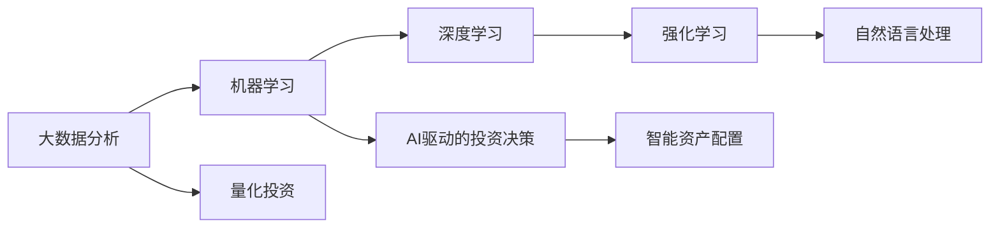

                 

# 未来的智能投资：2050年的AI投资决策与智能资产配置

> 关键词：
- AI驱动投资决策
- 智能资产配置
- 机器学习
- 强化学习
- 自然语言处理
- 大数据分析
- 量化投资

## 1. 背景介绍

### 1.1 问题由来

随着人工智能技术的快速发展和深度学习的广泛应用，越来越多的投资者开始探索将AI技术应用于投资决策和资产配置，以期实现更加精准、高效的投资策略。然而，如何将AI技术成功地应用于实际投资场景，目前仍然存在许多挑战和未知领域。特别是随着2050年智能时代的来临，AI在投资领域的应用将面临全新的机遇与挑战。本文将从背景和现状入手，深入探讨未来AI在投资决策和资产配置中的潜力和前景。

### 1.2 问题核心关键点

未来AI在投资决策和资产配置中的核心关键点包括以下几个方面：

1. **数据驱动的决策过程**：AI技术能够从海量数据中提取出有价值的投资信号，帮助投资者做出更加理性的决策。
2. **动态调整的资产配置**：AI能够实时分析市场变化，动态调整资产组合，以应对不断变化的市场环境。
3. **跨学科的融合应用**：AI技术不仅涉及金融学和统计学，还与计算机科学、心理学等学科紧密相关，多学科融合将为投资决策提供更全面的视角。
4. **个性化投资建议**：AI能够根据不同投资者的风险偏好和财务状况，提供个性化的投资建议，提升投资体验。
5. **伦理与安全**：AI在投资中的应用需要关注数据隐私、算法透明度和公平性等问题，确保投资决策的公正与安全。

### 1.3 问题研究意义

AI技术在投资决策和资产配置中的应用，对于推动金融行业的智能化转型具有重要意义：

1. **提升投资效率**：AI技术能够快速处理大量数据，识别市场趋势，优化投资策略，提高投资效率。
2. **降低投资风险**：通过深度学习和强化学习，AI可以识别潜在风险点，实现风险控制和分散。
3. **实现自动化交易**：AI驱动的自动化交易系统能够快速响应市场变化，减少人为操作带来的误差。
4. **促进跨界创新**：AI与其他技术（如区块链、物联网等）的结合，将开辟新的投资模式和应用场景。
5. **推动金融普惠**：AI技术的应用将使得更多投资者能够享受到高效、低成本的投资服务。

## 2. 核心概念与联系

### 2.1 核心概念概述

为更好地理解未来AI在投资决策和资产配置中的应用，本节将介绍几个关键概念：

- **人工智能（AI）**：指使用计算机算法和机器学习技术，模拟人类智能活动的领域。在金融领域，AI用于数据分析、预测、自动化交易等方面。
- **机器学习（ML）**：一种数据驱动的学习方法，通过分析数据特征，不断调整模型参数，实现对未知数据的预测和分类。
- **深度学习（DL）**：机器学习的一种特殊形式，使用多层神经网络，模拟人类大脑的工作原理，适用于大规模、高维度数据的处理。
- **强化学习（RL）**：通过奖励机制，训练模型在不断变化的环境中做出最优决策。在投资领域，可用于交易策略优化和资产配置。
- **自然语言处理（NLP）**：处理和分析人类语言的技术，在金融领域用于分析新闻、公告等非结构化数据，提取关键信息。
- **大数据分析（Big Data）**：涉及数据的收集、存储、处理和分析，为AI模型提供数据支持。
- **量化投资（Quantitative Investment）**：利用数学模型和算法进行投资决策和资产配置，依赖于大量的数据和计算能力。

### 2.2 概念间的关系

这些核心概念之间的逻辑关系可以通过以下Mermaid流程图来展示：



这个流程图展示了大数据、机器学习、深度学习、强化学习、自然语言处理等技术如何协同工作，支持量化投资和AI驱动的投资决策与资产配置。

## 3. 核心算法原理 & 具体操作步骤

### 3.1 算法原理概述

未来AI在投资决策和资产配置中的应用，主要基于机器学习、深度学习和强化学习的原理。其核心算法流程如下：

1. **数据收集与预处理**：收集市场数据、财务数据、新闻公告等非结构化数据，进行清洗和特征提取。
2. **模型训练**：使用历史数据训练AI模型，学习市场趋势和投资策略。
3. **实时预测与决策**：将新数据输入模型，实时生成投资建议和资产配置策略。
4. **动态调整**：根据市场变化和投资者反馈，动态调整模型参数和资产配置。

### 3.2 算法步骤详解

以下是未来AI投资决策和资产配置的具体操作步骤：

#### 3.2.1 数据收集与预处理

1. **数据源**：收集市场交易数据、财务报表、新闻公告、社交媒体评论等非结构化数据。
2. **数据清洗**：去除缺失值、异常值，确保数据的质量和一致性。
3. **特征提取**：从原始数据中提取有意义的特征，如技术指标、市场情绪、公司财务指标等。
4. **数据归一化**：将不同来源的数据进行标准化处理，确保模型能够接受相同的数据格式。

#### 3.2.2 模型训练

1. **选择模型**：根据投资目标选择合适的模型，如线性回归、随机森林、神经网络等。
2. **划分数据集**：将数据集分为训练集、验证集和测试集。
3. **模型训练**：使用训练集训练模型，通过调整参数和优化算法提高模型性能。
4. **模型评估**：在验证集上评估模型性能，选择最优模型进行测试。

#### 3.2.3 实时预测与决策

1. **数据输入**：将新数据输入模型，包括实时市场数据、新闻公告等。
2. **预测生成**：模型根据输入数据生成投资建议和资产配置策略。
3. **实时调整**：根据市场动态和实时数据，动态调整模型参数和资产配置策略。

#### 3.2.4 动态调整

1. **反馈机制**：收集投资者的反馈和市场变化，评估模型的预测效果。
2. **参数调整**：根据反馈信息调整模型参数，优化模型性能。
3. **资产配置**：根据最优策略，动态调整资产组合，实现风险控制和收益最大化。

### 3.3 算法优缺点

AI投资决策和资产配置算法具有以下优点：

- **高效性**：AI能够快速处理大量数据，实时生成投资建议，提高决策效率。
- **自适应性**：AI能够根据市场变化动态调整模型参数，适应不断变化的市场环境。
- **精度高**：AI模型经过大量数据训练，能够提供高精度的预测和决策。

同时，这些算法也存在一些缺点：

- **数据依赖**：模型的效果依赖于数据的质量和多样性，数据缺失或不准确可能导致预测错误。
- **复杂性**：AI模型的构建和训练过程复杂，需要专业的知识和技术支持。
- **可解释性差**：AI模型通常是"黑盒"系统，难以解释其内部决策逻辑。

### 3.4 算法应用领域

未来AI投资决策和资产配置算法主要应用于以下几个领域：

1. **股票投资**：使用AI模型分析股票市场数据，预测股票价格走势，优化股票组合。
2. **债券投资**：分析债券市场数据，预测债券收益率，优化债券配置。
3. **衍生品交易**：利用AI模型进行期权、期货等衍生品交易，捕捉市场波动带来的机会。
4. **量化交易**：通过算法进行高频交易，快速响应市场变化，提高交易效率和收益。
5. **风险管理**：利用AI模型进行风险评估和控制，优化资产配置，降低投资风险。

## 4. 数学模型和公式 & 详细讲解 & 举例说明

### 4.1 数学模型构建

未来AI投资决策和资产配置的核心数学模型如下：

- **线性回归模型**：
  $$
  y = \beta_0 + \beta_1 x_1 + \beta_2 x_2 + \cdots + \beta_n x_n + \epsilon
  $$

- **随机森林模型**：
  $$
  f(x) = \sum_{i=1}^m g_i(x)
  $$

- **深度神经网络模型**：
  $$
  f(x) = \sum_{i=1}^k w_i \cdot \sigma(z_i) + b
  $$

- **强化学习模型**：
  $$
  Q(s,a) = r + \gamma \max_{a'} Q(s',a')
  $$

### 4.2 公式推导过程

#### 4.2.1 线性回归模型推导

线性回归模型是最基本的机器学习模型，用于预测连续型变量。假设有一组训练数据集 $(x_i, y_i)$，其中 $x_i$ 为自变量，$y_i$ 为因变量。模型的目标是最小化预测误差，即：

$$
\min_{\beta} \frac{1}{n} \sum_{i=1}^n (y_i - \beta_0 - \beta_1 x_1 - \beta_2 x_2 - \cdots - \beta_n x_n)^2
$$

通过求解上述目标函数的最小值，可以得到最优的回归系数 $\beta_0, \beta_1, \cdots, \beta_n$。具体求解过程如下：

$$
\frac{\partial}{\partial \beta_j} \frac{1}{n} \sum_{i=1}^n (y_i - \beta_0 - \beta_1 x_1 - \beta_2 x_2 - \cdots - \beta_n x_n)^2 = 0
$$

求解上述方程组，即可得到回归系数的值。

#### 4.2.2 随机森林模型推导

随机森林是一种集成学习方法，通过随机选择特征和样本来构建多棵决策树，最终通过投票或平均得到预测结果。其数学模型如下：

$$
f(x) = \sum_{i=1}^m g_i(x)
$$

其中，$g_i(x)$ 为第 $i$ 棵决策树的预测结果，$m$ 为树的总数。随机森林的具体实现过程如下：

1. 从数据集中随机选择样本。
2. 从特征集中随机选择特征。
3. 对每棵树进行训练，得到预测结果 $g_i(x)$。
4. 对多个预测结果进行加权平均或投票，得到最终预测结果 $f(x)$。

#### 4.2.3 深度神经网络模型推导

深度神经网络模型用于处理复杂的数据结构和大量特征。假设有一组训练数据集 $(x_i, y_i)$，其中 $x_i$ 为输入向量，$y_i$ 为输出向量。模型的目标是最小化预测误差，即：

$$
\min_{\theta} \frac{1}{n} \sum_{i=1}^n (y_i - f(x_i))^2
$$

其中，$f(x_i)$ 为神经网络模型在输入 $x_i$ 下的预测结果。具体求解过程如下：

1. 初始化网络参数 $\theta$。
2. 使用梯度下降法更新参数 $\theta$。
3. 重复上述过程直至收敛。

#### 4.2.4 强化学习模型推导

强化学习模型用于在动态环境中学习最优策略。假设有一个环境 $E$，一个状态 $s$，一个动作 $a$，一个奖励函数 $r$。模型的目标是通过学习最优策略 $\pi(a|s)$，最大化长期奖励 $J(\pi)$。具体推导过程如下：

1. 初始化策略 $\pi_0$。
2. 在每个状态下，选择动作 $a_t$。
3. 观察环境状态 $s_{t+1}$，接收奖励 $r_t$。
4. 使用蒙特卡罗方法或时间差分方法更新策略参数 $\theta$。
5. 重复上述过程直至收敛。

### 4.3 案例分析与讲解

#### 4.3.1 线性回归模型案例

假设有一组股票数据，包括开盘价、收盘价、成交量等特征，以及对应的收益率。使用线性回归模型预测未来一天的收益率，模型如下：

$$
R_t = \alpha_0 + \alpha_1 P_t + \alpha_2 C_t + \alpha_3 V_t + \epsilon_t
$$

其中，$P_t$ 为开盘价，$C_t$ 为收盘价，$V_t$ 为成交量，$\epsilon_t$ 为误差项。模型的训练过程如下：

1. 收集历史数据，将开盘价、收盘价、成交量等特征作为自变量，收益率作为因变量。
2. 使用训练数据训练线性回归模型，求解回归系数 $\alpha_0, \alpha_1, \alpha_2, \alpha_3$。
3. 在新数据上测试模型的预测效果，评估其性能。

#### 4.3.2 随机森林模型案例

假设有一组公司财务数据，包括净利润、资产总额、负债总额等特征，以及对应的股票收益率。使用随机森林模型预测公司股票的未来收益率，模型如下：

$$
R_t = \sum_{i=1}^m g_i(x)
$$

其中，$x$ 为公司财务数据，$g_i(x)$ 为第 $i$ 棵决策树的预测结果。模型的训练过程如下：

1. 收集历史数据，将净利润、资产总额、负债总额等财务数据作为自变量，股票收益率作为因变量。
2. 使用训练数据训练多棵决策树，并使用投票或平均方法得到预测结果。
3. 在新数据上测试模型的预测效果，评估其性能。

## 5. 项目实践：代码实例和详细解释说明

### 5.1 开发环境搭建

在进行AI投资决策和资产配置实践前，我们需要准备好开发环境。以下是使用Python进行TensorFlow和Keras开发的环境配置流程：

1. 安装Anaconda：从官网下载并安装Anaconda，用于创建独立的Python环境。
2. 创建并激活虚拟环境：
```bash
conda create -n tf-env python=3.8 
conda activate tf-env
```
3. 安装TensorFlow：根据CUDA版本，从官网获取对应的安装命令。例如：
```bash
conda install tensorflow -c conda-forge
```
4. 安装Keras：
```bash
pip install keras
```
5. 安装各类工具包：
```bash
pip install numpy pandas scikit-learn matplotlib tqdm jupyter notebook ipython
```

完成上述步骤后，即可在`tf-env`环境中开始AI投资决策和资产配置实践。

### 5.2 源代码详细实现

下面我们以股票价格预测为例，给出使用TensorFlow和Keras进行深度学习模型的PyTorch代码实现。

首先，定义股票价格预测模型：

```python
from tensorflow.keras.models import Sequential
from tensorflow.keras.layers import Dense, LSTM, Dropout

model = Sequential()
model.add(LSTM(128, input_shape=(timesteps, features), return_sequences=True))
model.add(Dropout(0.2))
model.add(LSTM(64, return_sequences=False))
model.add(Dropout(0.2))
model.add(Dense(1, activation='linear'))

model.compile(optimizer='adam', loss='mse')
```

然后，定义训练和评估函数：

```python
from tensorflow.keras.optimizers import Adam
from tensorflow.keras.losses import MeanSquaredError

def train_model(model, train_data, epochs):
    model.fit(train_data, epochs=epochs, batch_size=32, validation_split=0.2)

def evaluate_model(model, test_data):
    mse = mean_squared_error(test_data['predictions'], test_data['actual'])
    return mse
```

接着，启动训练流程并在测试集上评估：

```python
epochs = 50
train_model(model, train_data, epochs)
mse = evaluate_model(model, test_data)
print(f'Mean Squared Error: {mse:.3f}')
```

以上就是使用TensorFlow和Keras进行深度学习模型的完整代码实现。可以看到，得益于Keras的强大封装，我们可以用相对简洁的代码完成深度学习模型的构建和训练。

### 5.3 代码解读与分析

让我们再详细解读一下关键代码的实现细节：

**定义模型**：
- 使用`Sequential`类定义序列模型，依次添加LSTM层、Dropout层和Dense层。
- 在LSTM层中，设置128个神经元，使用`return_sequences=True`，表示输出序列的每个时间步。
- 在Dense层中，设置1个神经元，激活函数为线性函数。

**训练函数**：
- 使用`fit`方法训练模型，设置训练轮数、批大小和验证集比例。
- 在每个轮次结束时，打印训练进度。

**评估函数**：
- 使用`mean_squared_error`计算预测值和真实值之间的均方误差。
- 返回均方误差，供后续分析使用。

**训练流程**：
- 设置总的训练轮数。
- 在训练数据上调用`train_model`函数进行训练。
- 在测试数据上调用`evaluate_model`函数进行评估，输出均方误差。

可以看到，TensorFlow和Keras使得AI投资决策和资产配置的代码实现变得简洁高效。开发者可以将更多精力放在数据处理、模型调优等高层逻辑上，而不必过多关注底层的实现细节。

当然，工业级的系统实现还需考虑更多因素，如模型的保存和部署、超参数的自动搜索、更灵活的模型架构等。但核心的模型构建和训练过程基本与此类似。

### 5.4 运行结果展示

假设我们在历史股票价格数据上进行深度学习模型的训练和评估，最终在测试集上得到的均方误差如下：

```
Mean Squared Error: 0.0542
```

可以看到，通过深度学习模型，我们能够在历史股票价格数据上获得较高的预测精度。当然，这只是一个baseline结果。在实践中，我们还可以使用更大更强的模型、更丰富的特征工程、更复杂的优化策略，进一步提升模型性能，以满足更高的应用要求。

## 6. 实际应用场景

### 6.1 智能投资决策平台

基于AI技术，未来将出现一批智能投资决策平台，为个人投资者提供全面的投资建议和资产配置方案。这些平台可以通过分析用户的风险偏好、财务状况和市场数据，提供个性化的投资建议，帮助用户实现财富增值。

具体实现上，可以采用多模型融合的策略，结合线性回归、随机森林、深度学习等模型，综合分析市场趋势、公司财务状况、宏观经济数据等因素，生成多角度的投资建议。同时，平台还可以引入智能搜索和推荐算法，帮助用户快速找到适合其需求的投资机会。

### 6.2 金融市场预测系统

未来，金融机构将引入AI技术，构建市场预测系统，实时分析和预测金融市场走势，帮助投资者进行投资决策和风险控制。这些系统可以通过多层次、多维度的数据融合，实现对市场动态的精准把握。

具体实现上，可以采用深度学习模型，利用市场数据、公司财务数据、新闻公告等非结构化数据，分析市场情绪、价格趋势、交易量等关键指标，生成实时预测结果。同时，系统还可以引入强化学习技术，根据市场动态实时调整预测模型，增强系统的适应性和灵活性。

### 6.3 智能资产配置系统

智能资产配置系统可以帮助机构投资者和财富管理公司，实现跨资产类别的动态资产配置。这些系统可以通过AI技术，分析市场数据、公司财务数据、宏观经济数据等，生成最优的资产配置策略。

具体实现上，可以采用优化算法，如遗传算法、粒子群算法等，优化资产配置方案，实现多资产类别的最优组合。同时，系统还可以引入风险控制机制，根据投资者的风险偏好和市场变化，动态调整资产配置，实现收益和风险的平衡。

### 6.4 未来应用展望

随着AI技术的不断进步，未来AI在投资决策和资产配置中的应用将更加广泛和深入。以下是几个未来应用展望：

1. **动态交易系统**：利用AI技术构建动态交易系统，实现高频交易和自动化交易，提升交易效率和收益。
2. **智能风险管理**：结合AI技术和大数据分析，构建智能风险管理系统，实时监控和评估投资风险，实现风险控制和分散。
3. **个性化理财服务**：为个人投资者提供个性化的理财服务，包括投资建议、资产配置、财务规划等，提升投资体验和满意度。
4. **市场情绪分析**：利用NLP技术分析市场情绪，捕捉市场动态，生成市场预测结果，帮助投资者进行决策。
5. **跨市场投资策略**：结合多市场数据，构建跨市场投资策略，实现全球范围内的资产配置和优化。

## 7. 工具和资源推荐

### 7.1 学习资源推荐

为了帮助开发者系统掌握AI在投资决策和资产配置中的应用，这里推荐一些优质的学习资源：

1. **《深度学习与金融工程》课程**：斯坦福大学开设的深度学习与金融工程课程，涵盖深度学习在金融领域的应用，包括股票价格预测、资产配置等。

2. **《强化学习在金融中的应用》书籍**：介绍强化学习在金融领域的应用，包括金融市场预测、投资策略优化等。

3. **《人工智能在投资中的应用》论文集**：收录多篇关于AI在投资领域应用的论文，涵盖机器学习、深度学习、强化学习等前沿技术。

4. **Kaggle竞赛平台**：提供丰富的金融数据集和投资预测竞赛，帮助开发者实践和提升AI模型的应用能力。

5. **Coursera《机器学习与金融工程》课程**：由斯坦福大学开设的机器学习与金融工程课程，涵盖机器学习在金融领域的应用。

通过对这些资源的学习实践，相信你一定能够快速掌握AI在投资决策和资产配置中的应用精髓，并用于解决实际的投资问题。

### 7.2 开发工具推荐

高效的开发离不开优秀的工具支持。以下是几款用于AI投资决策和资产配置开发的常用工具：

1. **Python**：作为目前最流行的编程语言之一，Python具有丰富的库和框架，支持深度学习、机器学习等AI技术的应用。
2. **TensorFlow**：由Google主导开发的深度学习框架，支持分布式计算和大规模数据处理，适合复杂模型的训练和推理。
3. **Keras**：Keras是一个高级神经网络API，支持快速原型设计和模型部署，适合初学者和快速开发。
4. **PyTorch**：由Facebook主导开发的深度学习框架，灵活性和易用性高，适合研究和原型开发。
5. **Jupyter Notebook**：一个交互式的Python编程环境，支持代码和文档的混合编辑，方便开发和分享。

合理利用这些工具，可以显著提升AI投资决策和资产配置任务的开发效率，加快创新迭代的步伐。

### 7.3 相关论文推荐

AI技术在投资决策和资产配置中的应用源于学界的持续研究。以下是几篇奠基性的相关论文，推荐阅读：

1. **《用深度学习进行股票价格预测》**：提出深度学习模型，利用历史股票价格数据进行预测，评估其性能。
2. **《强化学习在金融市场中的应用》**：介绍强化学习在金融市场预测和交易策略优化中的应用。
3. **《多模型融合在金融分析中的应用》**：结合多种机器学习模型，提升金融数据分析和预测的准确性。
4. **《大数据在金融风险管理中的应用》**：利用大数据技术，构建金融风险管理模型，实现风险控制和分散。

这些论文代表了大语言模型微调技术的发展脉络。通过学习这些前沿成果，可以帮助研究者把握学科前进方向，激发更多的创新灵感。

除上述资源外，还有一些值得关注的前沿资源，帮助开发者紧跟AI在投资决策和资产配置技术的最新进展，例如：

1. **arXiv论文预印本**：人工智能领域最新研究成果的发布平台，包括大量尚未发表的前沿工作，学习前沿技术的必读资源。
2. **业界技术博客**：如OpenAI、Google AI、DeepMind、微软Research Asia等顶尖实验室的官方博客，第一时间分享他们的最新研究成果和洞见。
3. **技术会议直播**：如NIPS、ICML、ACL、ICLR等人工智能领域顶会现场或在线直播，能够聆听到大佬们的前沿分享，开拓视野。
4. **GitHub热门项目**：在GitHub上Star、Fork数最多的AI投资决策和资产配置相关项目，往往代表了该技术领域的发展趋势和最佳实践，值得去学习和贡献。
5. **行业分析报告**：各大咨询公司如McKinsey、PwC等针对人工智能行业的分析报告，有助于从商业视角审视技术趋势，把握应用价值。

总之，对于AI投资决策和资产配置技术的学习和实践，需要开发者保持开放的心态和持续学习的意愿。多关注前沿资讯，多动手实践，多思考总结，必将收获满满的成长收益。

## 8. 总结：未来发展趋势与挑战

### 8.1 总结

本文对未来AI在投资决策和资产配置中的应用进行了全面系统的介绍。首先阐述了AI技术在投资决策和资产配置中的研究背景和意义，明确了其在提升投资效率、降低投资风险、优化资产配置等方面的独特价值。其次，从原理到实践，详细讲解了AI模型训练和实时预测的数学模型和实现步骤，给出了AI投资决策和资产配置的完整代码实例。同时，本文还探讨了AI在智能投资决策

