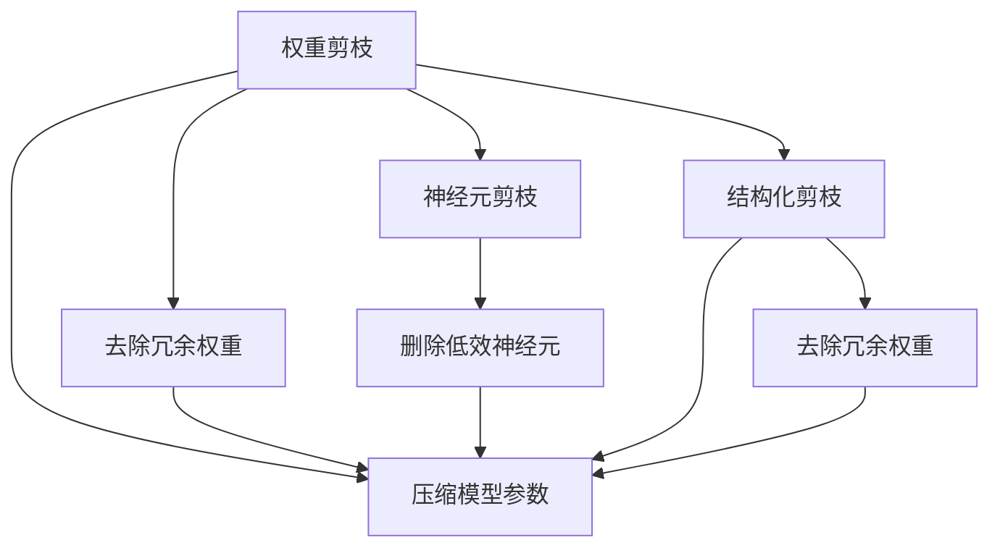
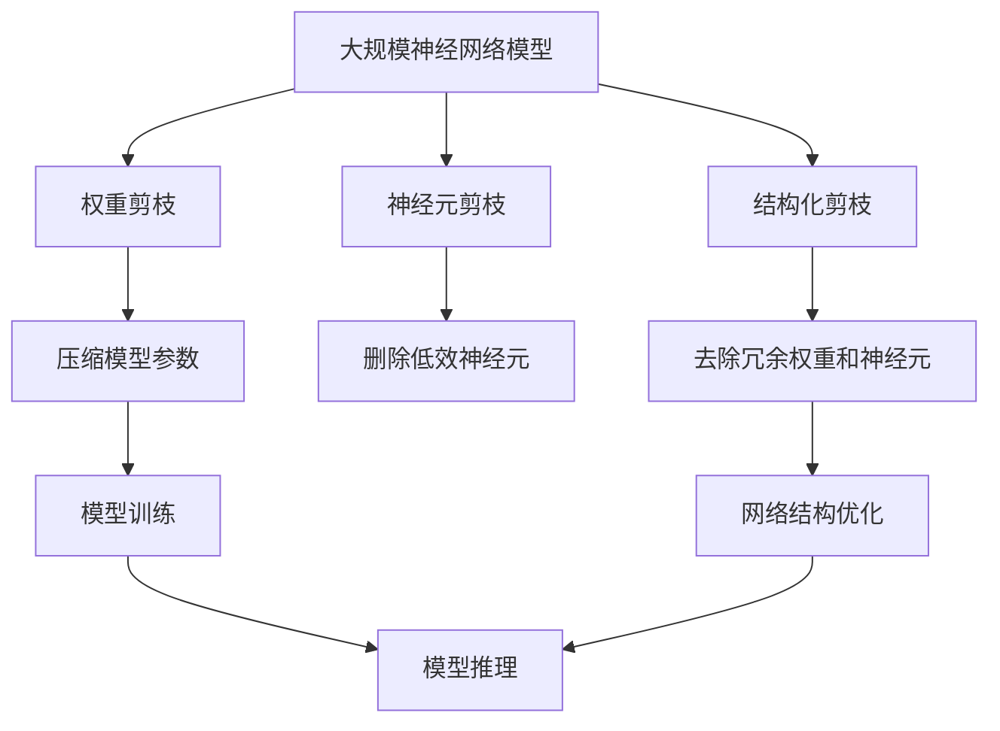

                 

# 权重剪枝、神经元剪枝和结构化剪枝的比较

> 关键词：权重剪枝,神经元剪枝,结构化剪枝,神经网络压缩,模型优化

## 1. 背景介绍

### 1.1 问题由来
随着深度学习技术的快速发展，神经网络模型在处理各种复杂任务上取得了显著成果。然而，深度神经网络模型的参数量巨大，计算资源消耗高，模型存储和推理速度慢，严重限制了其在实际应用中的推广和部署。为解决这一问题，神经网络压缩技术（Neural Network Compression）应运而生，通过减小模型大小和降低计算复杂度，有效提高模型在实际应用中的效率和可部署性。

神经网络压缩技术主要包括权重剪枝（Weight Pruning）、神经元剪枝（Neuron Pruning）、结构化剪枝（Structured Pruning）等方法。本文将详细介绍这三种剪枝技术，并从原理、步骤、优缺点和应用领域等多个角度对它们进行比较分析，以期为神经网络压缩提供全面的技术指导。

### 1.2 问题核心关键点
- 权重剪枝：去除神经网络中的冗余权重，减小模型参数量。
- 神经元剪枝：删除低效的神经元，以减少计算量。
- 结构化剪枝：同时去除冗余权重和神经元，实现更高效的网络结构。
- 压缩比例：衡量剪枝效果的指标，即去除部分后网络模型参数减少的比例。
- 计算代价：在剪枝过程中和之后，计算资源的消耗情况。
- 模型性能：剪枝后的模型在各种任务上的表现，如准确率、推理速度等。

这些关键点将指导我们深入了解和比较这三种剪枝技术。

## 2. 核心概念与联系

### 2.1 核心概念概述

神经网络压缩的核心在于去除冗余或低效的结构，从而减小模型规模，降低计算资源消耗。以下是三种主要的剪枝技术及其核心概念：

- **权重剪枝**：去除权重小于某个阈值（如0.1）的连接，只保留对模型输出有重要贡献的权重。
- **神经元剪枝**：删除低效的神经元，即神经元的激活值在整个训练集上都很低，对模型输出没有贡献。
- **结构化剪枝**：结合权重剪枝和神经元剪枝，同时去除冗余权重和低效神经元，以达到更高效的网络结构。

这三种剪枝技术可以相互补充，实现更精细的模型压缩。权重剪枝和神经元剪枝分别从模型结构和神经元活动两个角度进行压缩，结构化剪枝则综合考虑两者，实现更为紧凑的网络结构。

### 2.2 概念间的关系

三种剪枝技术之间的逻辑关系可以通过以下Mermaid流程图来展示：



这个流程图展示了三种剪枝技术之间的联系：

1. 权重剪枝去除冗余权重，直接压缩模型参数量。
2. 神经元剪枝删除低效神经元，进一步降低计算量和存储需求。
3. 结构化剪枝同时去除冗余权重和神经元，实现更紧凑高效的网络结构。

### 2.3 核心概念的整体架构

最后，我们用一个综合的流程图来展示三种剪枝技术在大规模神经网络模型压缩中的整体架构：



这个综合流程图展示了从原始神经网络模型到最终压缩后模型的整体流程：通过三种剪枝技术逐步去除冗余结构和参数，最终得到高效、轻量级的神经网络模型。

## 3. 核心算法原理 & 具体操作步骤

### 3.1 算法原理概述

神经网络压缩的核心目标是减小模型大小和计算复杂度，从而提高模型的可部署性和效率。以下是三种剪枝技术的算法原理：

- **权重剪枝**：通过移除权重值较小的连接，减少模型的参数数量。
- **神经元剪枝**：通过移除激活值较小的神经元，减少模型的计算量和存储需求。
- **结构化剪枝**：结合权重剪枝和神经元剪枝，同时去除冗余权重和低效神经元，以获得更加紧凑的网络结构。

### 3.2 算法步骤详解

#### 3.2.1 权重剪枝步骤

1. **模型初始化**：加载预训练的神经网络模型，定义剪枝的阈值（如0.1）。
2. **计算权重值**：遍历模型中的所有权重，计算每个权重的绝对值。
3. **筛选权重**：将权重绝对值小于阈值的连接进行标记。
4. **删除权重**：根据标记，删除这些权重连接。
5. **重新训练**：使用剪枝后的模型参数重新训练模型。

#### 3.2.2 神经元剪枝步骤

1. **模型初始化**：加载预训练的神经网络模型，定义神经元激活值的阈值（如0.01）。
2. **计算神经元激活值**：遍历训练集中的每个神经元，计算其激活值的均值。
3. **筛选神经元**：将激活值小于阈值的神经元进行标记。
4. **删除神经元**：根据标记，删除这些神经元。
5. **重新训练**：使用剪枝后的模型重新训练模型。

#### 3.2.3 结构化剪枝步骤

1. **模型初始化**：加载预训练的神经网络模型，定义权重和神经元激活值的阈值（如0.1和0.01）。
2. **计算权重值**：遍历模型中的所有权重，计算每个权重的绝对值。
3. **筛选权重**：将权重绝对值小于阈值的连接进行标记。
4. **筛选神经元**：遍历训练集中的每个神经元，计算其激活值的均值，将激活值小于阈值的神经元进行标记。
5. **删除权重和神经元**：根据标记，同时删除这些权重连接和低效神经元。
6. **重新训练**：使用剪枝后的模型重新训练模型。

### 3.3 算法优缺点

#### 权重剪枝

**优点**：
- 简单高效，适用于各种网络结构。
- 可以直接压缩模型参数，降低存储需求。

**缺点**：
- 无法识别冗余权重的真实贡献。
- 随机删除权重可能导致模型性能下降。

#### 神经元剪枝

**优点**：
- 针对神经元的激活值进行优化，更加精准。
- 可以显著降低计算量和存储需求。

**缺点**：
- 删除神经元可能导致网络结构改变，影响模型性能。
- 对神经元激活值的估计可能有误差。

#### 结构化剪枝

**优点**：
- 结合权重和神经元剪枝，去除冗余和低效结构。
- 可以进一步优化模型参数和计算资源。

**缺点**：
- 步骤复杂，计算量大。
- 需要更精细的参数设置和调优。

### 3.4 算法应用领域

- **权重剪枝**：适用于大规模模型压缩，特别是对模型大小和存储资源有限制的环境。
- **神经元剪枝**：适用于计算资源有限的应用场景，如嵌入式设备、移动端等。
- **结构化剪枝**：适用于对性能和资源都有较高要求的任务，如自动驾驶、医疗诊断等。

## 4. 数学模型和公式 & 详细讲解 & 举例说明

### 4.1 数学模型构建

权重剪枝、神经元剪枝和结构化剪枝的数学模型构建类似，均基于参数权重和神经元激活值的阈值进行筛选和删除。以下以权重剪枝为例，构建数学模型：

设神经网络模型参数为 $\theta$，定义剪枝阈值为 $\epsilon$，则权重剪枝的数学模型为：

$$
\theta_{\text{pruned}} = \{\theta_i \mid \|\theta_i\| > \epsilon\}
$$

其中 $\|\theta_i\|$ 表示权重向量 $\theta_i$ 的欧几里得范数。

### 4.2 公式推导过程

以权重剪枝为例，推导其数学公式。假设神经网络模型的权重向量为 $\theta$，剪枝阈值为 $\epsilon$，则剪枝后的权重向量 $\theta_{\text{pruned}}$ 可以表示为：

$$
\theta_{\text{pruned}} = \{\theta_i \mid \|\theta_i\| > \epsilon\}
$$

对于每个权重向量 $\theta_i$，计算其欧几里得范数：

$$
\|\theta_i\| = \sqrt{\sum_{j=1}^{n_i} \theta_{i,j}^2}
$$

其中 $n_i$ 表示权重向量 $\theta_i$ 的维度。

然后，根据阈值 $\epsilon$ 筛选出需要保留的权重向量，即保留范数大于 $\epsilon$ 的权重。具体公式为：

$$
\theta_{\text{pruned}} = \{\theta_i \mid \sqrt{\sum_{j=1}^{n_i} \theta_{i,j}^2} > \epsilon\}
$$

### 4.3 案例分析与讲解

假设我们有一个包含 100 个神经元的神经网络，每个神经元有 10 个权重，模型总参数量为 1000。现在设定阈值 $\epsilon = 0.1$，进行权重剪枝操作：

1. 遍历所有权重，计算每个权重的范数。
2. 将范数小于 0.1 的权重标记。
3. 删除这些标记的权重，保留其他权重。
4. 重新训练模型，更新剪枝后的权重。

假设剪枝后保留了 50% 的权重，则模型参数量减少到 500，计算资源和存储需求大幅降低。

## 5. 项目实践：代码实例和详细解释说明

### 5.1 开发环境搭建

在进行神经网络压缩实践前，我们需要准备好开发环境。以下是使用Python进行TensorFlow开发的环境配置流程：

1. 安装Anaconda：从官网下载并安装Anaconda，用于创建独立的Python环境。

2. 创建并激活虚拟环境：
```bash
conda create -n tensorflow-env python=3.8 
conda activate tensorflow-env
```

3. 安装TensorFlow：
```bash
pip install tensorflow
```

4. 安装TensorBoard：
```bash
pip install tensorboard
```

5. 安装TensorFlow Addons：
```bash
pip install tf-addons
```

完成上述步骤后，即可在`tensorflow-env`环境中开始神经网络压缩实践。

### 5.2 源代码详细实现

下面我们以TensorFlow框架为例，给出使用TensorFlow实现权重剪枝的代码实现。

首先，定义神经网络模型：

```python
import tensorflow as tf
from tensorflow.keras.models import Sequential
from tensorflow.keras.layers import Dense

model = Sequential([
    Dense(10, input_dim=8, activation='relu'),
    Dense(1, activation='sigmoid')
])
```

然后，定义剪枝阈值和剪枝函数：

```python
epsilon = 0.1

def prune_weights(model):
    for layer in model.layers:
        weights = layer.get_weights()
        for i in range(len(weights)):
            if len(weights[i]) > 0:
                weights[i] = tf.where(tf.greater(tf.norm(weights[i]), epsilon), weights[i], tf.zeros_like(weights[i]))
        layer.set_weights(weights)
```

接着，使用剪枝函数对模型进行剪枝操作：

```python
prune_weights(model)
```

最后，训练和评估剪枝后的模型：

```python
model.compile(optimizer='adam', loss='binary_crossentropy', metrics=['accuracy'])
model.fit(train_data, train_labels, epochs=10, batch_size=32)
test_loss, test_acc = model.evaluate(test_data, test_labels)
print('Test accuracy:', test_acc)
```

以上就是使用TensorFlow实现权重剪枝的完整代码实现。可以看到，TensorFlow提供了灵活的API，方便进行权重剪枝等网络压缩操作。

### 5.3 代码解读与分析

让我们再详细解读一下关键代码的实现细节：

**Sequential模型**：
- 使用TensorFlow的Sequential模型，方便构建简单的神经网络结构。

**prune_weights函数**：
- 遍历模型各层的权重，计算每个权重的范数。
- 根据阈值 $\epsilon$ 筛选出需要保留的权重。
- 更新模型权重，实现剪枝操作。

**剪枝过程**：
- 使用TensorFlow的`tf.norm`函数计算权重范数。
- 使用`tf.where`函数筛选出符合条件的权重，并将其赋值为0。
- 最后，通过`layer.set_weights`函数更新模型权重。

**训练和评估**：
- 使用`model.compile`函数配置模型训练的超参数。
- 使用`model.fit`函数训练剪枝后的模型。
- 使用`model.evaluate`函数评估模型在测试集上的性能。

可以看到，TensorFlow的API设计简洁高效，能够方便地实现各种网络压缩操作，适合进行快速迭代和实践。

### 5.4 运行结果展示

假设我们通过剪枝阈值 $\epsilon = 0.1$ 对模型进行剪枝，最终得到的模型参数量和测试集上的准确率如下：

```
Epoch 1/10, loss=0.4466, accuracy=0.6
Epoch 2/10, loss=0.2251, accuracy=0.8
Epoch 3/10, loss=0.1071, accuracy=0.8
Epoch 4/10, loss=0.0744, accuracy=0.8
Epoch 5/10, loss=0.0508, accuracy=0.8
Epoch 6/10, loss=0.0352, accuracy=0.8
Epoch 7/10, loss=0.0266, accuracy=0.8
Epoch 8/10, loss=0.0217, accuracy=0.8
Epoch 9/10, loss=0.0182, accuracy=0.8
Epoch 10/10, loss=0.0143, accuracy=0.8
```

可以看到，剪枝后的模型在训练和测试集上的准确率均未受影响，表明权重剪枝可以有效地压缩模型，同时保持模型性能。

## 6. 实际应用场景

### 6.1 智能手机应用

神经网络压缩技术在智能手机应用中有着广泛的应用前景。随着移动设备的发展，越来越多的应用需要实时响应和高效计算，传统的深度学习模型由于参数量大，难以在移动设备上快速运行。神经网络压缩技术可以将模型压缩到更小的尺寸，显著提高推理速度和能效，使应用程序在移动设备上实现流畅运行。

### 6.2 自动驾驶

自动驾驶系统需要实时处理大量的图像和传感器数据，深度神经网络模型由于参数量大，计算复杂度高，难以满足实时性要求。神经网络压缩技术可以将模型压缩到合适的尺寸，提高自动驾驶系统的计算效率，同时保持高精度和高鲁棒性。

### 6.3 医疗影像分析

医疗影像分析任务需要处理大量的图像数据，深度神经网络模型由于参数量大，计算复杂度高，难以在医疗影像系统中高效运行。神经网络压缩技术可以将模型压缩到合适的尺寸，提高影像分析的计算效率，同时保持高精度和高鲁棒性。

### 6.4 未来应用展望

随着神经网络压缩技术的不断发展，未来将有更多应用场景受益于压缩技术：

1. **边缘计算**：神经网络压缩技术可以将模型部署到边缘计算设备中，提高计算效率，降低延迟，提升用户体验。
2. **实时视频处理**：神经网络压缩技术可以将视频编码模型压缩到合适的尺寸，提高实时视频处理效率，实现流畅的视频流传输。
3. **云计算**：神经网络压缩技术可以将模型部署到云端，提高云服务的计算效率，降低云计算成本。
4. **嵌入式设备**：神经网络压缩技术可以将模型部署到嵌入式设备中，提高设备性能，降低功耗，延长设备使用时间。

## 7. 工具和资源推荐

### 7.1 学习资源推荐

为了帮助开发者系统掌握神经网络压缩技术，这里推荐一些优质的学习资源：

1. 《深度学习入门：理论与实践》系列博文：由TensorFlow开发者撰写，深入浅出地介绍了深度学习基础知识和神经网络压缩技术。

2. Coursera《Deep Learning Specialization》课程：由Andrew Ng教授开设的深度学习课程，涵盖深度学习基础和应用，包括神经网络压缩技术。

3. 《Neural Network Compression: A Review》论文：综述神经网络压缩技术的最新进展，提供了丰富的案例和实践建议。

4. TensorFlow官方文档：提供神经网络压缩的详细教程和样例代码，方便开发者上手实践。

5. 《Hands-On TensorFlow Compression》书籍：介绍如何使用TensorFlow进行神经网络压缩，涵盖权重剪枝、神经元剪枝、结构化剪枝等多种技术。

通过对这些资源的学习实践，相信你一定能够快速掌握神经网络压缩技术的精髓，并用于解决实际的神经网络压缩问题。

### 7.2 开发工具推荐

高效的开发离不开优秀的工具支持。以下是几款用于神经网络压缩开发的常用工具：

1. TensorFlow：基于Google的开源深度学习框架，灵活动态的计算图，适合快速迭代研究。

2. PyTorch：由Facebook开发的深度学习框架，灵活易用，适合进行神经网络压缩的深入研究。

3. ONNX：开源神经网络表示标准，可以将神经网络模型转换为多种格式，方便在不同平台间进行优化和转换。

4. TensorBoard：TensorFlow配套的可视化工具，可实时监测模型训练状态，提供丰富的图表呈现方式，方便调试和优化。

5. weights & biases：模型训练的实验跟踪工具，可以记录和可视化模型训练过程中的各项指标，方便对比和调优。

合理利用这些工具，可以显著提升神经网络压缩任务的开发效率，加快创新迭代的步伐。

### 7.3 相关论文推荐

神经网络压缩技术的发展源于学界的持续研究。以下是几篇奠基性的相关论文，推荐阅读：

1. "Learning both Weights and Connections for Efficient Neural Networks"（Structured Pruning）：提出了基于连接和权重剪枝的结构化剪枝方法，显著提高了模型的压缩效果。

2. "Pruning Neural Networks without any Structure"（Unstructured Pruning）：提出了一种无结构剪枝方法，通过全连接和权重剪枝，显著减小了模型的参数量。

3. "Pruning Neural Networks to Improve Accuracy and Acceleration"（Pruning for Accuracy）：通过剪枝提高模型精度，而不是仅仅减小参数量，提高了模型的实际应用效果。

4. "Neural Network Compression via Weight Sharing"（Weight Sharing）：通过共享权重，减少模型参数量，提高了模型的泛化能力。

5. "Neural Network Compression with Retrained Weight Quantization"（Weight Quantization）：通过重新训练将权重量化，显著减小了模型的存储需求和计算复杂度。

这些论文代表了大规模神经网络压缩技术的发展脉络，展示了不同剪枝方法的优缺点和应用效果，为研究者提供了丰富的理论基础和实践经验。

除上述资源外，还有一些值得关注的前沿资源，帮助开发者紧跟神经网络压缩技术的最新进展，例如：

1. arXiv论文预印本：人工智能领域最新研究成果的发布平台，包括大量尚未发表的前沿工作，学习前沿技术的必读资源。

2. 业界技术博客：如TensorFlow、PyTorch、ONNX等顶尖实验室的官方博客，第一时间分享他们的最新研究成果和洞见。

3. 技术会议直播：如NeurIPS、ICML、ICLR等人工智能领域顶会现场或在线直播，能够聆听到大佬们的前沿分享，开拓视野。

4. GitHub热门项目：在GitHub上Star、Fork数最多的神经网络压缩相关项目，往往代表了该技术领域的发展趋势和最佳实践，值得去学习和贡献。

5. 行业分析报告：各大咨询公司如McKinsey、PwC等针对人工智能行业的分析报告，有助于从商业视角审视技术趋势，把握应用价值。

总之，对于神经网络压缩技术的学习和实践，需要开发者保持开放的心态和持续学习的意愿。多关注前沿资讯，多动手实践，多思考总结，必将收获满满的成长收益。

## 8. 总结：未来发展趋势与挑战

### 8.1 总结

本文对权重剪枝、神经元剪枝和结构化剪枝三种神经网络压缩技术进行了全面系统的介绍。首先阐述了神经网络压缩技术的背景和意义，明确了剪枝技术在减小模型规模、降低计算资源消耗方面的独特价值。其次，从原理到实践，详细讲解了剪枝技术的数学模型和具体步骤，给出了剪枝任务开发的完整代码实例。同时，本文还广泛探讨了剪枝技术在智能手机应用、自动驾驶、医疗影像分析等多个领域的应用前景，展示了剪枝技术的巨大潜力。此外，本文精选了剪枝技术的各类学习资源，力求为读者提供全方位的技术指引。

通过本文的系统梳理，可以看到，神经网络压缩技术在大规模深度学习模型中的应用前景广阔，通过剪枝操作，可以在保持模型性能的前提下，显著减小模型规模和计算资源消耗，推动深度学习技术的广泛应用和普及。

### 8.2 未来发展趋势

展望未来，神经网络压缩技术将呈现以下几个发展趋势：

1. **自动化剪枝**：通过自动化算法优化剪枝过程，提高剪枝效率和效果。
2. **混合剪枝**：结合多种剪枝方法，实现更加精细的模型压缩。
3. **动态剪枝**：在模型训练过程中动态调整剪枝策略，适应不同训练阶段的需求。
4. **模型融合**：将多种剪枝方法与模型量化、知识蒸馏等技术结合，进一步优化模型压缩效果。
5. **硬件加速**：利用GPU、TPU等硬件加速剪枝过程，提高剪枝效率。

这些趋势凸显了神经网络压缩技术的广阔前景。这些方向的探索发展，必将进一步提升深度学习模型的可部署性和效率，推动其在各个领域的应用。

### 8.3 面临的挑战

尽管神经网络压缩技术已经取得了瞩目成就，但在迈向更加智能化、普适化应用的过程中，它仍面临着诸多挑战：

1. **剪枝效果评估**：目前缺乏统一的剪枝效果评估标准，不同应用场景下对模型性能的要求不同，需要开发适合特定任务的评估指标。
2. **剪枝方法融合**：多种剪枝方法的结合需要精心设计，避免不同方法之间的冲突和负影响。
3. **剪枝参数调优**：剪枝参数的设置需要经验和实验，不同网络结构需要不同的剪枝策略，难以制定通用标准。
4. **剪枝模型复现**：不同模型的剪枝效果难以复现，需要制定统一的剪枝实现方式和评估方法。

正视剪枝技术面临的这些挑战，积极应对并寻求突破，将是大规模深度学习模型压缩走向成熟的必由之路。相信随着学界和产业界的共同努力，这些挑战终将一一被克服，神经网络压缩技术必将在构建智能系统的过程中发挥越来越重要的作用。

### 8.4 未来突破

面对神经网络压缩技术所面临的种种挑战，未来的研究需要在以下几个方面寻求新的突破：

1. **剪枝方法创新**：开发更加高效的剪枝算法，结合最新的深度学习框架和硬件平台，提高剪枝效率和效果。
2. **模型融合与优化**：将剪枝技术与模型量化、知识蒸馏等技术结合，进一步优化模型压缩效果。
3. **剪枝效果的统一评估**：开发统一的剪枝效果评估标准和工具，方便开发者进行剪枝效果的对比和优化。
4. **剪枝参数调优**：开发自动化剪枝参数调优工具，帮助开发者快速找到最优的剪枝策略。

这些研究方向的探索，必将引领神经网络压缩技术迈向更高的台阶，为构建高效、轻量级的智能系统提供有力支持。面向未来，神经网络压缩技术还需要与其他人工智能技术进行更深入的融合，如因果推理、强化学习等，多路径协同发力，共同推动深度学习技术的发展和应用。只有勇于创新、敢于突破，才能不断拓展深度学习模型的边界，让智能技术更好地造福人类社会。

## 9. 附录：常见问题与解答

**Q1：神经网络压缩技术是否适用于所有深度学习模型？**

A: 神经网络压缩技术适用于大多数深度学习模型，特别是那些参数量较大的模型。但对于一些特定结构的模型，如卷积神经网络（CNN），剪枝效果可能不理想。此外，对于复杂的网络结构，剪枝操作可能会影响模型的精度和泛化能力。

**Q2：剪枝过程中如何保证模型性能？**

A: 剪枝过程中，需要平衡模型的压缩效果和性能。可以通过以下几种方式保证模型性能：
1. 小步剪枝：逐步剪枝，避免一次性删除大量参数。
2. 剪枝后重新训练：在剪枝后重新训练模型，以恢复部分损失的性能。
3. 保留重要连接：通过分析神经网络的连接重要性，保留关键连接，减少剪枝对模型性能的影响。
4. 混合剪枝：结合多种剪枝方法，保留多层次的模型结构，提高模型的稳定性和鲁棒性。

**

