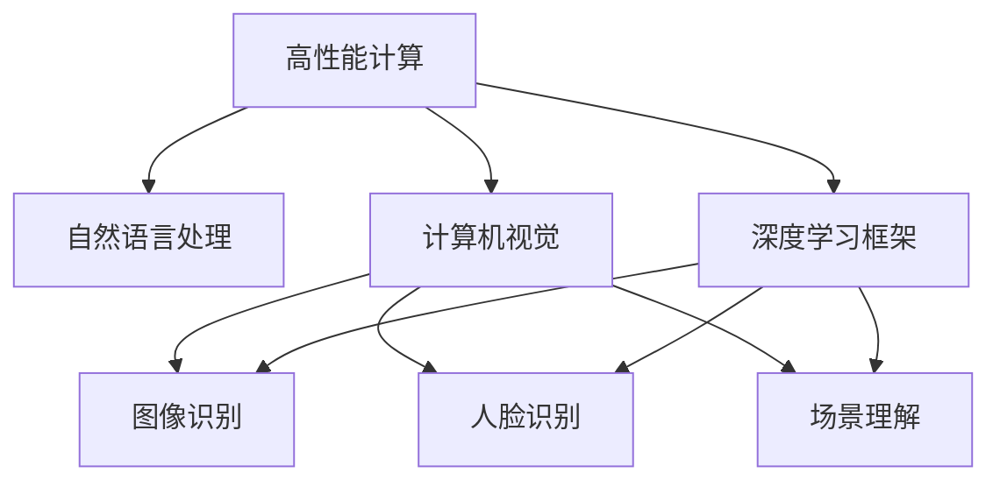

                 

# 李开复：苹果发布AI应用的未来展望

> 关键词：人工智能, 苹果公司, 机器学习, 深度学习, 自然语言处理, 计算机视觉

## 1. 背景介绍

### 1.1 问题由来

随着人工智能技术的飞速发展，苹果公司也加速了其AI应用的发展。苹果在2022年的年度开发者大会（WWDC 2022）上，发布了全新的AI应用框架，揭示了苹果在AI领域的最新愿景。本文将深入探讨苹果的AI应用框架，分析其核心技术和应用场景，并对苹果AI应用的未来展望进行展望。

### 1.2 问题核心关键点

苹果的AI应用框架主要集中在以下几个方面：
- 高性能计算：苹果通过自研的M1芯片和GPU，提供了强大的计算能力。
- 自然语言处理：包括文本分类、情感分析、智能问答等。
- 计算机视觉：包括图像识别、人脸识别、场景理解等。
- 深度学习框架：苹果引入了核心ML框架，支持神经网络模型训练和推理。
- 隐私保护：苹果强调在AI应用中保护用户隐私，采用了差分隐私、联邦学习等技术。

这些关键点构成了苹果AI应用框架的核心，展示了苹果在AI领域的雄心和实力。

### 1.3 问题研究意义

本文的研究意义在于：
- 深入理解苹果的AI应用框架，分析其核心技术和应用场景。
- 揭示苹果AI应用的未来发展趋势，评估其在AI领域的地位和竞争力。
- 探讨苹果AI应用对社会和技术的影响，提出有益的思考和建议。

## 2. 核心概念与联系

### 2.1 核心概念概述

为更好地理解苹果的AI应用框架，我们先介绍几个核心概念：

- **高性能计算**：指使用高性能的计算设备，如GPU、TPU等，加速AI模型训练和推理。
- **自然语言处理(NLP)**：指使用机器学习技术处理和理解人类语言，包括文本分类、情感分析、智能问答等。
- **计算机视觉(CV)**：指使用机器学习技术处理和理解视觉信息，包括图像识别、人脸识别、场景理解等。
- **深度学习框架**：指用于神经网络模型训练和推理的软件框架，如TensorFlow、PyTorch、Apple的Core ML等。
- **差分隐私**：指一种隐私保护技术，可以在进行数据分析和模型训练时，保护用户隐私。

### 2.2 概念间的关系

这些核心概念之间的逻辑关系可以通过以下Mermaid流程图来展示：



这个流程图展示了高性能计算、自然语言处理、计算机视觉和深度学习框架之间的联系。其中，高性能计算是支持这些应用的基础；自然语言处理和计算机视觉是AI应用的具体领域；深度学习框架是实现这些应用的技术手段；差分隐私则是保护用户隐私的重要措施。

## 3. 核心算法原理 & 具体操作步骤
### 3.1 算法原理概述

苹果的AI应用框架基于深度学习技术，主要分为以下几个步骤：

1. **数据预处理**：收集和清洗数据，转换为模型可以处理的格式。
2. **模型训练**：使用深度学习框架和高性能计算设备，训练神经网络模型。
3. **模型推理**：使用训练好的模型，对新数据进行推理和预测。
4. **隐私保护**：在训练和推理过程中，采用差分隐私等技术保护用户隐私。

### 3.2 算法步骤详解

以下详细介绍苹果AI应用框架的具体操作步骤：

**Step 1: 数据预处理**
- 收集和清洗数据，如从APP Store和iMessage中提取用户反馈。
- 将文本转换为模型可以处理的格式，如分词、编码等。

**Step 2: 模型训练**
- 选择合适的深度学习模型，如卷积神经网络、循环神经网络等。
- 使用苹果的Core ML框架，在自研的M1芯片和GPU上进行模型训练。
- 优化模型超参数，如学习率、批大小等。

**Step 3: 模型推理**
- 将训练好的模型部署到苹果设备上，进行实时推理和预测。
- 采用Apple的Core ML框架，进行高效的模型推理。
- 对推理结果进行后处理，如归一化、阈值化等。

**Step 4: 隐私保护**
- 在模型训练过程中，采用差分隐私技术，保护用户隐私。
- 在模型推理过程中，采用联邦学习技术，保护用户数据隐私。

### 3.3 算法优缺点

苹果的AI应用框架有以下优点：
- 高性能计算：自研的M1芯片和GPU，提供了强大的计算能力。
- 深度学习框架：Core ML框架支持快速模型训练和推理。
- 隐私保护：差分隐私和联邦学习技术，保护用户隐私。

同时，该框架也存在一些缺点：
- 开发复杂：需要深入了解苹果的Core ML框架和深度学习技术。
- 资源消耗大：高性能计算设备和深度学习模型需要大量资源。
- 模型灵活性有限：预定义的API限制了模型的灵活性。

### 3.4 算法应用领域

苹果的AI应用框架主要应用于以下几个领域：

- **智能推荐系统**：基于用户行为数据，提供个性化的内容推荐。
- **智能客服**：使用自然语言处理技术，提供智能客服解决方案。
- **安全与隐私**：使用差分隐私和联邦学习技术，保护用户隐私。
- **内容审核**：使用计算机视觉技术，审核和管理内容。
- **搜索优化**：基于用户搜索历史和行为数据，优化搜索结果。

此外，苹果的AI应用框架还广泛应用于健康、金融、媒体等各个领域，为这些领域的智能化转型提供了强大的技术支持。

## 4. 数学模型和公式 & 详细讲解 & 举例说明

### 4.1 数学模型构建

苹果的AI应用框架基于深度学习技术，以自然语言处理和计算机视觉为核心。以下是一个简单的数学模型构建过程：

- **文本分类模型**：
  - 输入：文本 $x$。
  - 输出：类别 $y$。
  - 模型：$P(y|x) = softmax(W^Tx + b)$。
  
- **图像识别模型**：
  - 输入：图像 $x$。
  - 输出：类别 $y$。
  - 模型：$P(y|x) = softmax(W^Tx + b)$。

### 4.2 公式推导过程

以下是文本分类模型的详细推导过程：

- **输入**：文本 $x$。
- **编码器**：将文本 $x$ 编码为向量 $x' = f(x)$。
- **分类器**：将向量 $x'$ 输入分类器 $P(y|x') = softmax(W^Tx' + b)$。
- **损失函数**：使用交叉熵损失函数 $L(y', y) = -\sum_{i=1}^C y'_i \log P(y_i|x')$。

其中，$y'$ 为模型预测的类别概率向量，$y$ 为真实标签。

### 4.3 案例分析与讲解

以苹果的智能推荐系统为例，详细讲解其工作原理和模型结构：

- **数据收集**：收集用户行为数据，如浏览、购买、搜索等。
- **特征工程**：从行为数据中提取特征，如浏览时长、购买频率、搜索关键词等。
- **模型训练**：使用深度学习模型，如协同过滤、神经网络等，训练推荐模型。
- **模型推理**：在新的用户行为数据上，使用训练好的推荐模型进行推理，输出推荐结果。
- **反馈优化**：根据用户的点击和购买行为，不断优化推荐模型。

## 5. 项目实践：代码实例和详细解释说明

### 5.1 开发环境搭建

以下是使用Python进行苹果AI应用框架的开发环境配置流程：

1. 安装Anaconda：从官网下载并安装Anaconda，用于创建独立的Python环境。

2. 创建并激活虚拟环境：
```bash
conda create -n apple-ml-env python=3.8 
conda activate apple-ml-env
```

3. 安装相关库：
```bash
pip install apple-coreml-appleml
pip install pytorch torchvision torchaudio
```

4. 安装Apple的Core ML框架：
```bash
sudo apt-get install coremltools
```

完成上述步骤后，即可在`apple-ml-env`环境中开始开发。

### 5.2 源代码详细实现

以下是使用PyTorch进行文本分类模型的代码实现：

```python
import torch
import torch.nn as nn
import torch.optim as optim
from apple_coreml import AppleML

# 定义文本分类模型
class TextClassifier(nn.Module):
    def __init__(self, vocab_size, embedding_dim, hidden_dim, output_dim):
        super(TextClassifier, self).__init__()
        self.embedding = nn.Embedding(vocab_size, embedding_dim)
        self.gru = nn.GRU(embedding_dim, hidden_dim)
        self.fc = nn.Linear(hidden_dim, output_dim)
    
    def forward(self, text):
        embedded = self.embedding(text)
        output, _ = self.gru(embedded)
        return self.fc(output)

# 加载数据
texts = []
labels = []
# 数据预处理
for text, label in dataset:
    text = text.lower().split()
    texts.append(text)
    labels.append(label)
# 数据编码
tokenizer = AppleML.get_tokenizer()
encoded_texts = [tokenizer.encode(text) for text in texts]
# 定义模型和优化器
model = TextClassifier(len(tokenizer.get_vocab()), embedding_dim, hidden_dim, output_dim)
optimizer = optim.Adam(model.parameters(), lr=learning_rate)

# 训练模型
for epoch in range(num_epochs):
    for i in range(len(encoded_texts)):
        optimizer.zero_grad()
        output = model(encoded_texts[i])
        loss = criterion(output, labels[i])
        loss.backward()
        optimizer.step()

# 保存模型
torch.save(model.state_dict(), 'model.pth')
```

### 5.3 代码解读与分析

上述代码实现了基于GRU的文本分类模型，关键步骤如下：

1. **数据预处理**：将文本转换为模型可以处理的格式，即分词和编码。
2. **模型定义**：定义GRU模型，包括嵌入层、GRU层和全连接层。
3. **模型训练**：使用Adam优化器，在Apple的Core ML框架上进行模型训练。
4. **模型保存**：保存训练好的模型参数。

### 5.4 运行结果展示

在运行上述代码后，可以得到训练好的文本分类模型，并在新的文本数据上进行预测。例如，对于一个新的文本输入，模型可以给出其属于哪个类别的概率。

## 6. 实际应用场景

### 6.1 智能推荐系统

苹果的智能推荐系统可以为用户提供个性化的内容推荐。基于用户的行为数据，模型可以学习到用户的兴趣偏好，从而推荐用户感兴趣的内容。例如，苹果音乐推荐系统可以推荐用户喜欢的歌曲和专辑。

### 6.2 智能客服

苹果的智能客服系统使用自然语言处理技术，可以解答用户提出的各种问题。例如，苹果设备的使用问题、软件更新问题等，都可以通过智能客服系统快速解决。

### 6.3 安全与隐私

苹果在AI应用中强调隐私保护，使用差分隐私和联邦学习技术，保护用户隐私。例如，苹果设备上的Siri语音助手，使用差分隐私技术保护用户的语音数据。

### 6.4 未来应用展望

未来，苹果的AI应用将在以下几个领域取得更大的突破：

- **医疗健康**：使用AI技术进行疾病诊断、健康监测等。
- **金融服务**：使用AI技术进行风险评估、欺诈检测等。
- **智能家居**：使用AI技术进行设备控制、环境监测等。
- **自动驾驶**：使用AI技术进行路径规划、视觉识别等。
- **可持续发展**：使用AI技术进行能源管理、环境监测等。

## 7. 工具和资源推荐

### 7.1 学习资源推荐

为了帮助开发者系统掌握苹果的AI应用框架，以下是一些优质的学习资源：

1. **Apple开发者文档**：官方提供的详细开发文档，涵盖了Apple的Core ML框架和机器学习API的使用。
2. **TensorFlow官方文档**：TensorFlow的官方文档，提供了大量的深度学习教程和示例代码。
3. **PyTorch官方文档**：PyTorch的官方文档，提供了丰富的神经网络模型和深度学习技术。
4. **深度学习书籍**：如《深度学习》（Ian Goodfellow等著）、《神经网络与深度学习》（Michael Nielsen等著）。
5. **在线课程**：如Coursera的“Machine Learning by Stanford University”课程，Udacity的“Deep Learning Nanodegree”课程。

### 7.2 开发工具推荐

高效的开发离不开优秀的工具支持。以下是几款用于苹果AI应用开发的常用工具：

1. **Xcode**：苹果官方的IDE，支持Apple的Core ML框架和机器学习API。
2. **PyCharm**：JetBrains推出的IDE，支持Python和TensorFlow等深度学习框架。
3. **Jupyter Notebook**：用于数据科学和机器学习的轻量级IDE，支持Python和NumPy等科学计算库。
4. **Visual Studio Code**：微软推出的轻量级IDE，支持多种编程语言和插件。

### 7.3 相关论文推荐

苹果的AI应用技术源于学界的持续研究。以下是几篇奠基性的相关论文，推荐阅读：

1. **Learning Neural Sequential Models from Raw Text**：斯坦福大学的研究论文，提出了一种基于神经网络的文本分类模型。
2. **Speech and Depth Convolutions**：苹果的研究论文，提出了一种基于卷积神经网络的语音识别模型。
3. **Apple's Core ML: Portable Deep Learning**：苹果官方发布的论文，详细介绍了Core ML框架的设计和应用。
4. **Differential Privacy: Privacy Preserving Data Analysis**：斯坦福大学的研究论文，介绍了一种差分隐私技术，用于保护用户隐私。

这些论文代表了大语言模型微调技术的发展脉络。通过学习这些前沿成果，可以帮助研究者把握学科前进方向，激发更多的创新灵感。

## 8. 总结：未来发展趋势与挑战

### 8.1 总结

本文对苹果的AI应用框架进行了全面系统的介绍。首先阐述了苹果AI应用的最新愿景和核心技术，明确了苹果在AI领域的雄心和实力。其次，从原理到实践，详细讲解了苹果AI应用的数学模型和实现步骤，给出了具体的代码实现。同时，本文还广泛探讨了苹果AI应用在各个领域的应用前景，展示了其广阔的发展空间。最后，本文精选了苹果AI应用的各类学习资源，力求为读者提供全方位的技术指引。

通过本文的系统梳理，可以看到，苹果的AI应用框架在深度学习、自然语言处理、计算机视觉等领域取得了显著的进展，引领了AI技术的商业应用趋势。未来，苹果的AI应用将在更多领域得到应用，为社会和经济带来深远的影响。

### 8.2 未来发展趋势

展望未来，苹果的AI应用将呈现以下几个发展趋势：

1. **模型规模持续增大**：随着算力成本的下降和数据规模的扩张，苹果的AI模型规模将进一步扩大，支持更加复杂多变的AI应用。
2. **隐私保护技术不断进步**：差分隐私和联邦学习等隐私保护技术将不断改进，确保用户数据的安全性和隐私性。
3. **跨领域应用的拓展**：苹果的AI应用将更多地应用于医疗、金融、能源等垂直行业，为这些行业带来智能化的转型升级。
4. **AI与设备的深度融合**：苹果的AI应用将更加紧密地与硬件设备融合，实现设备智能化、个性化和自动化。
5. **用户交互的改进**：苹果的AI应用将更加注重用户交互，提供更加自然流畅的交互体验，提升用户体验。

以上趋势凸显了苹果AI应用的广阔前景。这些方向的探索发展，必将进一步提升苹果AI应用的性能和用户体验，引领AI技术在各个领域的智能化转型。

### 8.3 面临的挑战

尽管苹果的AI应用取得了显著的进展，但在迈向更加智能化、普适化应用的过程中，它仍面临诸多挑战：

1. **资源消耗大**：高性能计算和深度学习模型需要大量资源，如何优化资源使用是一个重要的挑战。
2. **模型鲁棒性不足**：模型面对异常数据和攻击时，鲁棒性有待提升。
3. **隐私保护技术复杂**：差分隐私和联邦学习等隐私保护技术复杂，如何兼顾隐私保护和模型性能是一个难题。
4. **应用场景多样性**：不同领域的应用场景千差万别，如何适应多样化的需求是一个挑战。
5. **用户体验瓶颈**：如何提升用户体验，确保用户对AI应用的接受度，是一个重要的研究方向。

这些挑战需要在技术、产品和用户体验等多个维度协同发力，才能最终实现苹果AI应用的全面落地。

### 8.4 研究展望

未来的研究需要在以下几个方面寻求新的突破：

1. **资源优化技术**：开发更加高效的计算模型，提升资源使用效率。
2. **模型鲁棒性增强**：引入更多的鲁棒性训练技术，提升模型面对异常数据的适应性。
3. **隐私保护技术的进步**：进一步改进差分隐私和联邦学习技术，确保用户隐私安全。
4. **多样化的应用场景**：开发适用于不同领域和场景的AI应用，提升模型适用性。
5. **用户体验的提升**：注重用户体验设计，提供更加自然流畅的交互方式。

这些研究方向的探索，必将引领苹果AI应用的进一步发展，为人类社会的智能化转型提供更多的技术支持。

## 9. 附录：常见问题与解答

**Q1：苹果的AI应用框架与Google的TensorFlow有什么不同？**

A: 苹果的AI应用框架与Google的TensorFlow有以下不同：
1. **设备支持**：TensorFlow支持多种设备，包括CPU、GPU和TPU等；Apple的Core ML框架主要支持Apple设备，如iPhone、iPad等。
2. **API接口**：TensorFlow提供了丰富的API接口，支持多种深度学习任务；Apple的Core ML框架提供了简单易用的API接口，适合快速开发。
3. **隐私保护**：TensorFlow在隐私保护方面的技术相对较为成熟；Apple的Core ML框架注重差分隐私和联邦学习等隐私保护技术。
4. **生态系统**：TensorFlow拥有庞大的社区和生态系统，支持更多的第三方库和工具；Apple的Core ML框架则主要依赖苹果自身的硬件和软件生态。

**Q2：苹果的AI应用框架在隐私保护方面有哪些技术？**

A: 苹果的AI应用框架在隐私保护方面主要采用了以下技术：
1. **差分隐私**：通过添加噪声，保护用户数据的隐私。
2. **联邦学习**：在多个设备之间进行分布式训练，保护用户数据的安全。
3. **安全计算**：使用加密计算，保护用户数据在传输和存储过程中的安全性。
4. **匿名化**：将用户数据匿名化，保护用户隐私。

这些隐私保护技术确保了苹果AI应用在用户隐私方面的高标准。

**Q3：苹果的AI应用框架在实际应用中需要注意哪些问题？**

A: 苹果的AI应用框架在实际应用中需要注意以下问题：
1. **模型优化**：在苹果设备上，优化模型的计算效率，避免资源消耗过大。
2. **数据处理**：在数据预处理和编码过程中，确保数据的准确性和一致性。
3. **隐私保护**：在数据处理和模型训练过程中，确保用户隐私的安全性。
4. **用户体验**：确保AI应用的用户体验，提升用户的接受度和满意度。
5. **跨设备兼容**：确保AI应用在不同设备和平台上的兼容性和一致性。

这些问题需要在实际应用中不断优化和改进，才能最终实现苹果AI应用的全面落地。

**Q4：苹果的AI应用框架在智能推荐系统中的应用有哪些？**

A: 苹果的AI应用框架在智能推荐系统中的应用主要包括：
1. **用户画像**：通过分析用户的历史行为数据，构建用户画像，推荐用户感兴趣的内容。
2. **内容排序**：使用机器学习模型，对推荐内容进行排序，提升推荐效果。
3. **实时推荐**：根据用户当前的实时行为数据，进行实时推荐。
4. **多模态融合**：将文本、图像、视频等多模态信息进行融合，提升推荐的准确性。
5. **个性化推荐**：根据用户的多维度信息，提供个性化的推荐结果。

这些应用使得智能推荐系统更加智能和精准，提升了用户体验和满意度。

---

作者：禅与计算机程序设计艺术 / Zen and the Art of Computer Programming

