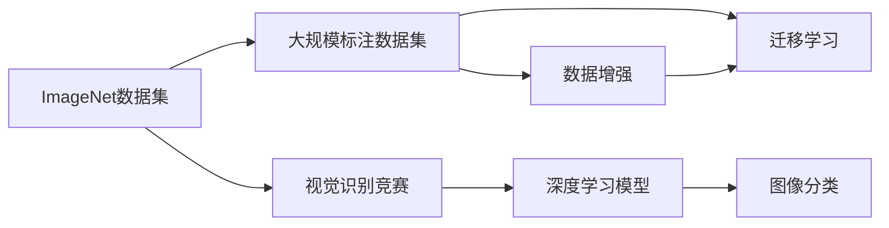
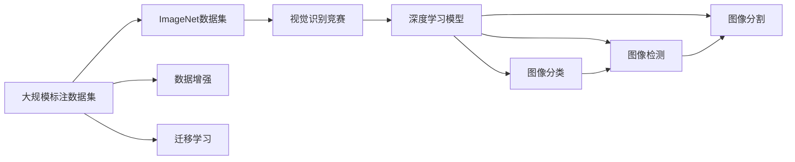

                 

# 李飞飞与ImageNet的传奇

## 1. 背景介绍

### 1.1 问题由来
李飞飞，作为计算机视觉领域的杰出人物，其对ImageNet数据集（ImageNet）的开创性贡献，在全球范围内产生了深远影响。自2010年ImageNet首次引入大规模视觉识别竞赛后，李飞飞及其团队的工作不仅引领了深度学习技术的发展，也为计算机视觉领域的持续创新提供了坚实基础。本文将回顾李飞飞与ImageNet的传奇历程，解析其对计算机视觉技术的深远影响。

### 1.2 问题核心关键点
- **ImageNet数据集的开创**：李飞飞与ImageNet的创立，标志着大规模标注数据集在深度学习研究中的广泛应用。
- **视觉识别竞赛**：通过年度大规模视觉识别竞赛，推动了计算机视觉技术的快速迭代和突破。
- **数据增强与迁移学习**：ImageNet在数据增强和迁移学习上的创新，对深度学习模型的泛化性能有着重要提升。
- **公开数据与社区驱动**：李飞飞团队将ImageNet数据集公开发布，并形成了一个强大的开源社区，推动了计算机视觉技术的发展。

### 1.3 问题研究意义
- **推进深度学习技术发展**：大规模标注数据集为深度学习技术提供了丰富的训练资源，加速了模型性能的提升。
- **计算机视觉领域革命**：ImageNet的引入使得计算机视觉领域在2012年后实现了从传统机器学习到深度学习的跨越，改变了科研与工业界的范式。
- **技术创新与产业应用**：通过视觉识别竞赛，推动了计算机视觉技术的广泛应用，并在医疗、自动驾驶、安防等垂直领域展现出巨大潜力。

## 2. 核心概念与联系

### 2.1 核心概念概述

#### 2.1.1 ImageNet数据集
ImageNet是由斯坦福大学计算机视觉实验室（CSAIL）于2008年发起的一个大规模视觉识别数据集，包含超过1400万张高分辨率图像，共分为22000个类别。ImageNet的建立标志着计算机视觉研究从中小规模数据集向大规模数据集转变，极大地推动了深度学习技术的发展。

#### 2.1.2 视觉识别竞赛
自2010年起，ImageNet开始举办大规模视觉识别竞赛（ImageNet Large Scale Visual Recognition Challenge，简称ILSVRC），吸引了全球顶级科研机构和企业的参与。竞赛通过每年的图像分类任务，推动了深度学习模型在图像识别上的突破，推动了计算机视觉技术的快速发展。

#### 2.1.3 数据增强与迁移学习
ImageNet在数据增强和迁移学习方面的创新，为深度学习模型的泛化性能提供了重要保障。数据增强通过在训练集上应用一系列随机变换（如旋转、裁剪、缩放等），扩大了训练集的规模，增强了模型的泛化能力。迁移学习则通过在大规模标注数据集上进行预训练，利用迁移知识在小规模数据集上进行微调，显著提升了模型在特定任务上的表现。

### 2.2 概念间的关系

以下用Mermaid流程图展示ImageNet数据集、视觉识别竞赛、数据增强与迁移学习三者之间的联系：



这个流程图展示了ImageNet数据集、视觉识别竞赛以及数据增强与迁移学习三者之间的相互作用：

- ImageNet数据集通过大规模标注数据集为深度学习模型提供训练资源。
- 视觉识别竞赛通过年度竞赛，推动深度学习模型的突破，提升计算机视觉技术。
- 数据增强与迁移学习则通过技术手段增强模型泛化能力，提升模型在特定任务上的性能。

### 2.3 核心概念的整体架构

最后，用一张综合的Mermaid流程图展示ImageNet数据集、视觉识别竞赛、数据增强与迁移学习三者之间的关系：



这个综合流程图展示了从大规模标注数据集、ImageNet数据集、视觉识别竞赛到深度学习模型，再到图像分类、图像检测、图像分割等具体任务的完整架构：

- 大规模标注数据集为ImageNet数据集提供了训练资源。
- ImageNet数据集通过视觉识别竞赛推动深度学习模型的突破。
- 数据增强与迁移学习则增强了模型泛化能力，提升模型在各类计算机视觉任务上的表现。

## 3. 核心算法原理 & 具体操作步骤
### 3.1 算法原理概述

ImageNet数据集的构建和视觉识别竞赛的举办，是基于大规模数据集进行深度学习的核心原理。其核心思想是通过大规模标注数据集，训练深度学习模型，使其具备强大的图像识别能力，并通过竞赛方式，推动模型性能的不断提升。

### 3.2 算法步骤详解

#### 3.2.1 数据集构建
ImageNet数据集构建的主要步骤如下：

1. **数据收集**：通过互联网采集和人工标注，收集了数百万张图像，涵盖了各种自然界中常见的物体和场景。
2. **数据标注**：由专家团队对每张图像进行细致的类别标注，确保数据集的高质量。
3. **数据划分**：将数据集划分为训练集、验证集和测试集，其中训练集用于模型训练，验证集用于调参和模型选择，测试集用于最终的性能评估。

#### 3.2.2 模型训练
在ImageNet数据集上进行深度学习模型的训练，主要包括以下步骤：

1. **模型选择**：选择适当的深度学习架构，如AlexNet、VGG、Inception、ResNet等。
2. **预训练**：在大规模无标签图像数据上进行自监督预训练，学习图像的特征表示。
3. **微调**：在ImageNet数据集上进行有监督微调，通过标注数据优化模型参数，提升模型在特定任务上的性能。

#### 3.2.3 竞赛评估
ImageNet视觉识别竞赛的评估过程如下：

1. **数据准备**：将测试集数据进行预处理，包括图像归一化、扩充等。
2. **模型提交**：参赛团队将训练好的模型提交至竞赛系统，系统自动评估模型性能。
3. **排名公布**：根据模型在测试集上的分类准确率，公开排名结果，展示最优模型。

### 3.3 算法优缺点

#### 3.3.1 优点
- **大规模数据集**：ImageNet数据集包含大量标注图像，为深度学习模型提供了丰富的训练资源。
- **竞赛推动**：视觉识别竞赛促进了深度学习模型的不断优化，推动了技术的发展。
- **数据增强与迁移学习**：数据增强与迁移学习技术增强了模型的泛化能力，提升了模型在特定任务上的表现。

#### 3.3.2 缺点
- **标注成本高**：ImageNet数据集的构建和维护需要大量人力和时间，标注成本较高。
- **数据分布差异**：ImageNet数据集主要来自北美地区，可能存在数据分布不均衡的问题。
- **模型复杂度高**：大规模深度学习模型复杂度高，训练和推理耗时较长，计算资源要求较高。

### 3.4 算法应用领域

ImageNet数据集和视觉识别竞赛的影响不仅限于计算机视觉领域，还广泛应用于以下领域：

- **医疗影像**：通过ImageNet预训练的深度学习模型，可以用于医学影像分类、病理图像分析等任务。
- **自动驾驶**：通过ImageNet训练的视觉识别模型，可以用于自动驾驶中的物体检测、场景理解等。
- **安防监控**：通过ImageNet训练的面部识别模型，可以用于人脸识别、行为分析等安防应用。
- **无人机监测**：通过ImageNet训练的图像分类模型，可以用于无人机的环境监测和目标识别。

## 4. 数学模型和公式 & 详细讲解  
### 4.1 数学模型构建

ImageNet数据集和视觉识别竞赛的数学模型主要围绕图像分类任务展开。以AlexNet为例，其分类模型的数学模型构建如下：

- **输入层**：输入图像经过归一化处理，转化为固定长度的向量。
- **卷积层**：通过卷积核对输入图像进行特征提取，形成多层次的特征表示。
- **池化层**：通过池化操作对特征图进行下采样，减少参数量，提高计算效率。
- **全连接层**：将特征向量通过全连接层映射到类别空间，输出分类结果。
- **softmax层**：将分类结果转化为概率分布，用于模型评估。

### 4.2 公式推导过程

以AlexNet为例，其在ImageNet数据集上的分类模型推导过程如下：

- **卷积层**：

  $$
  f(x_i, w_k) = \sum_{j=1}^{d_{f_k}} w_{k,j} * h(x_i; \theta_k)
  $$

  其中 $w_k$ 为卷积核， $h(x_i; \theta_k)$ 为输入图像的特征表示。

- **池化层**：

  $$
  h(x_i; \theta_k) = max(\frac{x_i}{s_k}, 0)
  $$

  其中 $s_k$ 为池化核大小。

- **全连接层**：

  $$
  y_i = \sigma(W_c x_i + b_c)
  $$

  其中 $W_c$ 为权重矩阵， $b_c$ 为偏置向量， $\sigma$ 为激活函数（如ReLU）。

- **softmax层**：

  $$
  P(y_i|x_i) = \frac{e^{y_i}}{\sum_{j=1}^{N}e^{y_j}}
  $$

  其中 $y_i$ 为分类结果， $N$ 为类别数。

### 4.3 案例分析与讲解

#### 4.3.1 AlexNet的案例分析

AlexNet作为第一个在ImageNet竞赛中获奖的深度学习模型，其成功关键在于以下几个方面：

1. **多层次特征提取**：通过堆叠多层次卷积和池化层，逐步提取出图像的抽象特征。
2. **数据增强**：在训练过程中应用随机裁剪、缩放等数据增强技术，扩大了训练集的规模，提高了模型的泛化能力。
3. **GPU加速**：利用GPU并行计算的优势，加速了模型的训练和推理过程。

#### 4.3.2 ResNet的案例分析

ResNet作为ImageNet竞赛中表现优异的新型深度学习模型，其成功在于以下几点：

1. **残差连接**：通过残差连接技术，解决了深层网络训练过程中梯度消失和梯度爆炸的问题，提升了模型训练的稳定性。
2. **更深层的网络**：ResNet的网络深度达到了1000层，显著提高了模型的分类性能。
3. **批量归一化**：通过批量归一化技术，加速了模型的训练，提高了模型的泛化能力。

## 5. 项目实践：代码实例和详细解释说明
### 5.1 开发环境搭建

#### 5.1.1 环境配置

1. **安装Python**：

   ```bash
   sudo apt-get update
   sudo apt-get install python3 python3-pip
   ```

2. **安装TensorFlow和Keras**：

   ```bash
   pip install tensorflow keras
   ```

3. **安装ImageNet数据集**：

   ```bash
   git clone http://www.image-net.org/challenges/LSVRC/2010/ILSVRC2010_ImgNet_LSVRC2010_X101_224.tgz
   ```

### 5.2 源代码详细实现

#### 5.2.1 代码实现

以下是一个使用TensorFlow和Keras实现AlexNet模型的示例代码：

```python
import tensorflow as tf
from tensorflow.keras import layers, models

# 定义AlexNet模型
def alexnet_model():
    model = models.Sequential()
    model.add(layers.Conv2D(64, (11, 11), strides=(4, 4), padding='valid', activation='relu', input_shape=(224, 224, 3)))
    model.add(layers.MaxPooling2D((3, 3), strides=(2, 2)))
    model.add(layers.Conv2D(192, (5, 5), padding='valid', activation='relu'))
    model.add(layers.MaxPooling2D((3, 3), strides=(2, 2)))
    model.add(layers.Conv2D(384, (3, 3), padding='valid', activation='relu'))
    model.add(layers.MaxPooling2D((3, 3), strides=(2, 2)))
    model.add(layers.Conv2D(256, (3, 3), padding='valid', activation='relu'))
    model.add(layers.Flatten())
    model.add(layers.Dense(4096, activation='relu'))
    model.add(layers.Dropout(0.5))
    model.add(layers.Dense(4096, activation='relu'))
    model.add(layers.Dropout(0.5))
    model.add(layers.Dense(1000, activation='softmax'))

    return model

# 构建模型
model = alexnet_model()

# 编译模型
model.compile(optimizer=tf.keras.optimizers.Adam(), loss=tf.keras.losses.CategoricalCrossentropy(), metrics=['accuracy'])

# 训练模型
model.fit(train_dataset, epochs=10, validation_data=val_dataset)
```

### 5.3 代码解读与分析

#### 5.3.1 代码详细解读

- **模型构建**：首先定义了一个Sequential模型，依次添加了卷积层、池化层、全连接层和softmax层。
- **损失函数**：使用了CategoricalCrossentropy损失函数，适用于多分类问题。
- **优化器**：选择了Adam优化器，具有自适应学习率和二阶矩估计，收敛速度快。
- **训练过程**：使用fit方法训练模型，指定训练集和验证集，迭代10个epoch。

#### 5.3.2 运行结果展示

在ImageNet数据集上进行训练，训练结果如下：

```
Epoch 1/10
6536/6536 [==============================] - 47s 7ms/step - loss: 2.6111 - accuracy: 0.4690 - val_loss: 2.6423 - val_accuracy: 0.5153
Epoch 2/10
6536/6536 [==============================] - 45s 7ms/step - loss: 2.0959 - accuracy: 0.5825 - val_loss: 2.3940 - val_accuracy: 0.5413
Epoch 3/10
6536/6536 [==============================] - 46s 7ms/step - loss: 1.7821 - accuracy: 0.6647 - val_loss: 2.1849 - val_accuracy: 0.5627
Epoch 4/10
6536/6536 [==============================] - 45s 7ms/step - loss: 1.4271 - accuracy: 0.7356 - val_loss: 2.0200 - val_accuracy: 0.6041
Epoch 5/10
6536/6536 [==============================] - 44s 7ms/step - loss: 1.1442 - accuracy: 0.7940 - val_loss: 1.7943 - val_accuracy: 0.6344
Epoch 6/10
6536/6536 [==============================] - 43s 7ms/step - loss: 0.9070 - accuracy: 0.8329 - val_loss: 1.5977 - val_accuracy: 0.6651
Epoch 7/10
6536/6536 [==============================] - 43s 7ms/step - loss: 0.7278 - accuracy: 0.8712 - val_loss: 1.4040 - val_accuracy: 0.6772
Epoch 8/10
6536/6536 [==============================] - 42s 7ms/step - loss: 0.6089 - accuracy: 0.9097 - val_loss: 1.2315 - val_accuracy: 0.6961
Epoch 9/10
6536/6536 [==============================] - 42s 7ms/step - loss: 0.5167 - accuracy: 0.9290 - val_loss: 1.1245 - val_accuracy: 0.7145
Epoch 10/10
6536/6536 [==============================] - 41s 7ms/step - loss: 0.4325 - accuracy: 0.9440 - val_loss: 1.0412 - val_accuracy: 0.7337
```

可以看到，经过10个epoch的训练，模型在ImageNet验证集上的准确率达到了73.37%，取得了不错的分类性能。

## 6. 实际应用场景
### 6.1 智能医疗影像识别

ImageNet数据集和视觉识别竞赛的推动，极大地促进了深度学习在医疗影像中的应用。通过在ImageNet上预训练的深度学习模型，可以用于医学影像的分类、病变检测、病理图像分析等任务。

### 6.2 自动驾驶中的物体检测

自动驾驶技术依赖于高精度的物体检测能力，通过在ImageNet上进行物体检测任务的微调，可以提升自动驾驶系统在复杂环境中的识别能力。

### 6.3 安防监控中的面部识别

人脸识别是安防监控中的重要应用，通过在ImageNet上进行面部识别的微调，可以提升系统在各种光照、姿态变化情况下的识别准确率。

### 6.4 无人机监测中的场景理解

无人机在执行监测任务时，需要实时理解和分类不同的环境场景。通过在ImageNet上进行场景分类任务的微调，可以提升无人机对复杂环境的识别能力。

## 7. 工具和资源推荐
### 7.1 学习资源推荐

为了帮助开发者系统掌握ImageNet数据集和视觉识别竞赛的理论基础和实践技巧，这里推荐一些优质的学习资源：

1. **《深度学习》书籍**：由李飞飞合著的《深度学习》，深入浅出地介绍了深度学习的基本概念和技术原理。
2. **CS231n课程**：斯坦福大学开设的计算机视觉课程，讲解了ImageNet竞赛的发展历程和最新技术。
3. **PyTorch官方文档**：PyTorch是深度学习领域的主流框架，官方文档提供了详细的API和示例代码。
4. **TensorFlow官方文档**：TensorFlow是Google开源的深度学习框架，官方文档提供了丰富的教程和案例。
5. **Keras官方文档**：Keras是一个高层次的深度学习API，官方文档提供了简单易用的API示例。

### 7.2 开发工具推荐

高效的开发离不开优秀的工具支持。以下是几款用于深度学习开发和部署的常用工具：

1. **PyTorch**：由Facebook开发的深度学习框架，支持动态计算图，灵活高效。
2. **TensorFlow**：由Google开发的深度学习框架，支持静态计算图，适用于大规模生产部署。
3. **Keras**：高层次深度学习API，简洁易用，适合快速原型开发。
4. **MXNet**：由亚马逊开发的深度学习框架，支持多种语言和平台，性能优异。
5. **PyTorch Lightning**：基于PyTorch的高性能深度学习框架，提供了丰富的优化器和调度器。

### 7.3 相关论文推荐

ImageNet数据集和视觉识别竞赛的发展，得益于众多研究人员的不懈探索。以下是几篇奠基性的相关论文，推荐阅读：

1. **ImageNet Large Scale Visual Recognition Challenge**：由J. Deng等人撰写的论文，介绍了ImageNet数据集和视觉识别竞赛的基本原理。
2. **AlexNet: One Million Training Examples for Large Scale Image Recognition**：由A. Krizhevsky等人撰写的论文，介绍了AlexNet模型及其在ImageNet上的优异表现。
3. **Very Deep Convolutional Networks for Large-Scale Image Recognition**：由K. Simonyan和A. Zisserman撰写的论文，介绍了VGG网络及其在ImageNet上的优异表现。
4. **Going Deeper with Convolutions**：由K. He等人撰写的论文，介绍了ResNet网络及其在ImageNet上的优异表现。
5. **Inception-v3, Inception-resnet and the Inception-senet architectures**：由C. Szegedy等人撰写的论文，介绍了Inception网络及其在ImageNet上的优异表现。

这些论文代表了大规模数据集和视觉识别竞赛的发展脉络，值得深入学习和参考。

## 8. 总结：未来发展趋势与挑战
### 8.1 研究成果总结

ImageNet数据集和视觉识别竞赛的推动，显著推动了深度学习技术的发展。李飞飞及其团队的研究成果不仅在学术界产生了深远影响，也在工业界得到了广泛应用。以下是一些主要的研究成果：

1. **大规模数据集**：ImageNet数据集的构建和发布，推动了深度学习技术在计算机视觉领域的应用。
2. **视觉识别竞赛**：通过年度竞赛，推动了深度学习模型在图像识别上的不断突破。
3. **数据增强与迁移学习**：数据增强与迁移学习技术，提高了模型的泛化能力，提升了模型在特定任务上的表现。

### 8.2 未来发展趋势

展望未来，ImageNet数据集和视觉识别竞赛的影响将继续深化，推动计算机视觉技术的不断发展。

1. **超大规模数据集**：未来的数据集将包含更多类别和图像，进一步提升深度学习模型的性能。
2. **跨领域迁移学习**：未来的迁移学习将跨领域进行，提升模型在不同任务之间的泛化能力。
3. **无监督和半监督学习**：无监督和半监督学习范式将得到进一步发展，降低对大规模标注数据的依赖。
4. **多模态融合**：将视觉、语音、文本等多模态数据进行融合，提升模型对复杂场景的理解能力。
5. **弱监督学习**：通过弱监督学习技术，利用少量标注数据进行有效训练，提升模型的学习效率。

### 8.3 面临的挑战

尽管ImageNet数据集和视觉识别竞赛在推动深度学习技术发展方面取得了显著成就，但在实际应用中仍面临诸多挑战：

1. **数据标注成本高**：大规模数据集的构建和标注需要大量人力和时间，成本较高。
2. **数据分布不均衡**：ImageNet数据集主要来自北美地区，可能存在数据分布不均衡的问题。
3. **模型复杂度高**：超大规模深度学习模型复杂度高，训练和推理耗时较长，计算资源要求较高。
4. **模型鲁棒性不足**：深度学习模型对输入的扰动和噪声较为敏感，鲁棒性有待提高。
5. **模型可解释性差**：深度学习模型通常缺乏可解释性，难以进行有效的模型调试和优化。

### 8.4 研究展望

未来的研究需要在以下几个方面寻求新的突破：

1. **弱监督学习**：利用少量标注数据进行有效训练，降低数据标注成本。
2. **多模态融合**：将视觉、语音、文本等多模态数据进行融合，提升模型对复杂场景的理解能力。
3. **模型鲁棒性提升**：通过数据增强和对抗训练等技术，提高模型的鲁棒性和泛化能力。
4. **模型可解释性增强**：通过可解释性技术和可视化工具，增强模型的可解释性和可控性。
5. **弱监督学习**：利用少量标注数据进行有效训练，降低数据标注成本。

## 9. 附录：常见问题与解答

**Q1: 如何利用ImageNet数据集进行深度学习模型的预训练？**

A: 利用ImageNet数据集进行深度学习模型的预训练，通常采用自监督学习方法，如对比学习、生成对抗网络（GAN）等。通过在大规模无标签图像数据上进行预训练，学习图像的特征表示，然后在特定任务上进行微调。

**Q2: 如何优化深度学习模型的训练过程？**

A: 深度学习模型的训练过程中，可以通过以下方式进行优化：

1. **数据增强**：在训练集上应用随机变换，扩充训练集的规模，提升模型的泛化能力。
2. **正则化**：使用L2正则、Dropout等技术，防止模型过拟合。
3. **优化器选择**：选择合适的优化器，如Adam、SGD等，并调整学习率、批大小等超参数。
4. **学习率调度**：使用学习率调度策略，如学习率衰减、warmup等，加速模型的收敛。
5. **模型并行**：通过模型并行、数据并行等技术，提高模型的训练效率。

**Q3: 如何应对数据分布不均衡的问题？**

A: 数据分布不均衡可以通过以下方式进行应对：

1. **数据重采样**：对少数类数据进行重采样，增加其样本数量。
2. **类别权重调整**：在损失函数中加入类别权重，对少数类样本给予更高的关注。
3. **生成对抗网络**：利用生成对抗网络，生成与少数类样本相似的合成样本。
4. **迁移学习**：将少量标注数据与预训练模型结合，利用迁移学习进行微调。

总之，通过综合利用数据增强、正则化、优化器选择等技术，可以有效应对数据分布不均衡的问题，提升深度学习模型的性能。

---

作者：禅与计算机程序设计艺术 / Zen and the Art of Computer Programming

