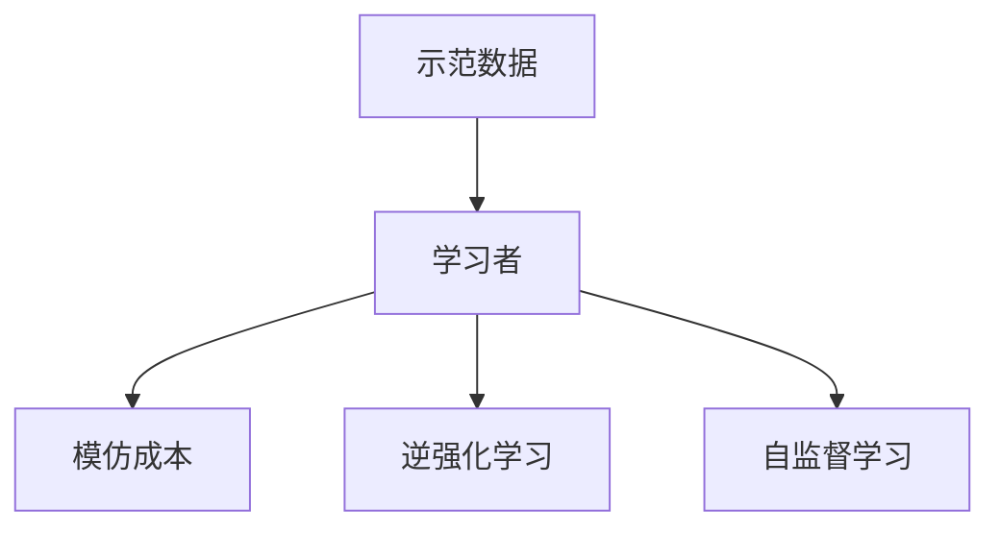
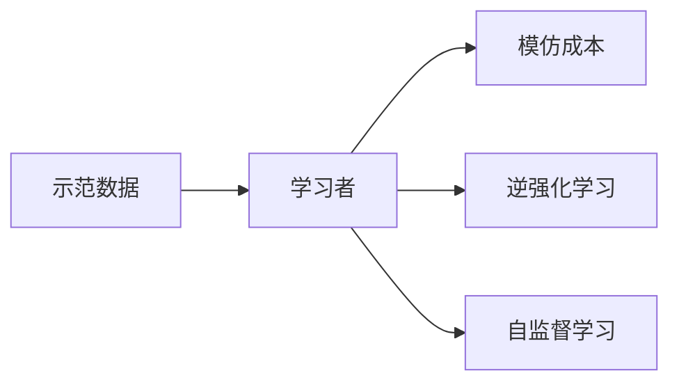
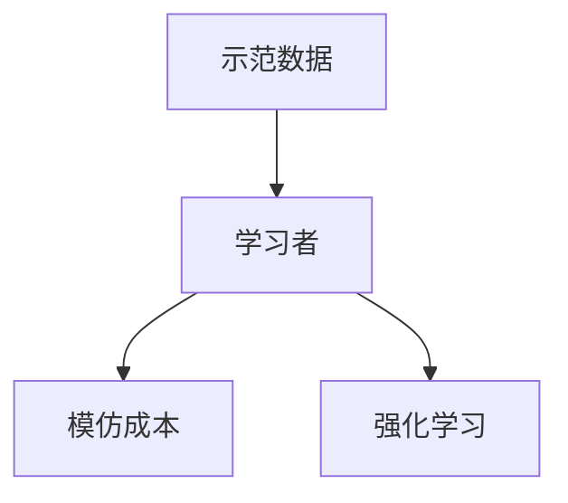
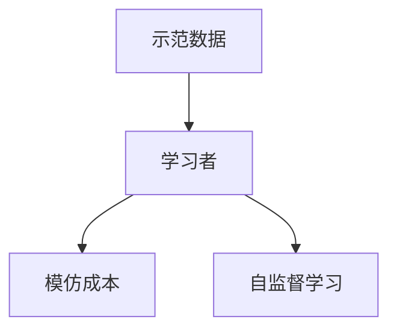
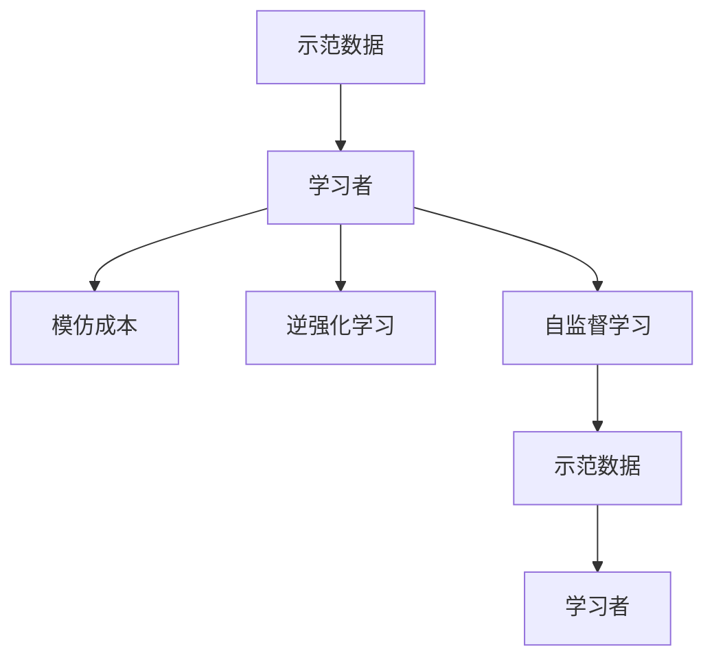

                 

# 模仿学习 (Imitation Learning) 原理与代码实例讲解

## 1. 背景介绍

### 1.1 问题由来
模仿学习（Imitation Learning, IL）是人工智能中的一个重要领域，它通过观察和模仿专家或数据的演示，让机器学习者能够不依赖于监督信号进行学习。模仿学习特别适用于那些难以通过传统监督学习获取标注数据的场景，比如无人驾驶、机器人控制、动作预测等。与监督学习不同，模仿学习不需要标注数据，而是依赖于示范数据进行训练，能够显著降低标注成本和数据收集难度。

### 1.2 问题核心关键点
模仿学习的核心在于通过观察示范数据（Demonstrations），学习模型的动作或策略，使其能够执行与示范类似的任务。示范数据可以是视频、图像、音频等形式，包含了专家动作的详细信息。模仿学习的目标是使机器学习者（Learner）能够在未标记数据上表现得与示范数据相近，从而实现自动化、泛化能力强的决策过程。

### 1.3 问题研究意义
模仿学习的研究和应用意义重大，它为解决数据标注困难、提升模型泛化能力、减少对人类专家的依赖提供了新的思路和方法。在无人驾驶、医疗诊断、工业自动化、机器人控制等领域，模仿学习的应用有望大幅提升系统性能，降低人工干预，促进技术发展。

## 2. 核心概念与联系

### 2.1 核心概念概述

模仿学习是一个多学科交叉领域，涉及机器学习、计算机视觉、自然语言处理、机器人学等多个方向。以下列出了模仿学习的几个核心概念：

- 示范数据（Demonstrations）：包含专家操作或行为的数据，如视频、图像、文本等。示范数据通常用于指导学习者的行为。
- 学习者（Learner）：学习示范数据的机器学习模型，可以是强化学习、神经网络等。学习者通过模仿示范数据来生成自己的行为。
- 模仿成本（Imitation Cost）：学习者生成行为与示范行为的相似度，通常是两个行为之间的距离或对比。
- 逆强化学习（Inverse Reinforcement Learning, IRL）：通过观察示范数据推断专家策略，而非直接模仿示范行为。
- 自监督学习（Self-Supervised Learning）：利用未标记数据学习任务相关知识，可以与模仿学习结合使用。

这些概念之间的联系可以通过以下Mermaid流程图来展示：



这个流程图展示了模仿学习的核心概念及其之间的联系：示范数据被学习者用于模仿成本计算，逆强化学习通过示范数据推断专家策略，自监督学习可以辅助学习者在未标记数据上的学习。

### 2.2 概念间的关系

这些核心概念之间存在着紧密的联系，形成了模仿学习的完整框架。下面我们通过几个Mermaid流程图来展示这些概念之间的关系。

#### 2.2.1 模仿学习的基本流程



这个流程图展示了模仿学习的基本流程，学习者通过示范数据计算模仿成本，并通过逆强化学习和自监督学习进行模型优化。

#### 2.2.2 模仿学习与强化学习的关系



这个流程图展示了模仿学习与强化学习之间的关系。模仿学习可以看作是强化学习的一种特例，其中模仿成本可以作为强化学习中的奖励函数，指导学习者的行为。

#### 2.2.3 模仿学习与自监督学习的关系



这个流程图展示了模仿学习与自监督学习之间的关系。自监督学习可以辅助学习者在未标记数据上的学习，从而提升模仿学习的性能。

### 2.3 核心概念的整体架构

最后，我们用一个综合的流程图来展示这些核心概念在大语言模型微调中的整体架构：



这个综合流程图展示了模仿学习在大语言模型微调中的应用，示范数据被学习者用于模仿成本计算，逆强化学习通过示范数据推断专家策略，自监督学习可以辅助学习者在未标记数据上的学习，从而在大语言模型微调中实现参数高效和性能提升。

## 3. 核心算法原理 & 具体操作步骤
### 3.1 算法原理概述

模仿学习的核心算法原理基于行为克隆（Behavior Cloning）和逆强化学习（Inverse Reinforcement Learning）。

行为克隆是一种模仿学习的简单形式，学习者通过最大化示范数据的似然来模仿示范行为。具体来说，假设示范数据为 $D=\{(x_i, y_i)\}_{i=1}^N$，其中 $x_i$ 表示示范数据的特征，$y_i$ 表示示范行为的输出。学习者的目标是最小化损失函数：

$$
\mathcal{L}(\theta) = \frac{1}{N} \sum_{i=1}^N \ell(y_i, f_\theta(x_i))
$$

其中 $f_\theta(x_i)$ 是学习者在输入 $x_i$ 下的输出，$\ell$ 是损失函数，$\theta$ 是模型参数。

逆强化学习则通过观察示范数据推断专家策略，从而指导学习者的行为。逆强化学习的目标是最小化模仿成本函数 $C$，其中模仿成本 $C$ 可以定义为示范数据和模型输出的差异。假设模仿成本函数为 $C(D, f_\theta)$，则逆强化学习的目标是最小化 $C$：

$$
\min_{\theta} C(D, f_\theta)
$$

逆强化学习通常需要额外的专家知识，如专家策略 $\pi^*$，通过最大化专家策略的归一化似然 $L_\pi(f_\theta)$ 来实现。归一化似然定义为：

$$
L_\pi(f_\theta) = \frac{\prod_{i=1}^N \pi^*(y_i | f_\theta(x_i))}{\int \prod_{i=1}^N \pi^*(y_i | f_\theta(x_i)) dy_i}
$$

### 3.2 算法步骤详解

模仿学习的具体步骤包括以下几个关键步骤：

**Step 1: 准备示范数据**

- 收集示范数据 $D=\{(x_i, y_i)\}_{i=1}^N$，可以是视频、图像、文本等形式。示范数据需要包含足够的行为信息，以便学习者能够准确模仿。

**Step 2: 设计学习器**

- 选择合适的学习器类型，如神经网络、深度强化学习模型等。学习器的输入为示范数据的特征 $x_i$，输出为示范行为的预测值 $f_\theta(x_i)$。

**Step 3: 计算模仿成本**

- 根据模仿成本函数 $C$ 计算学习者的模仿成本。模仿成本可以是示范数据和模型输出的均方误差、交叉熵等。

**Step 4: 优化模型参数**

- 使用梯度下降等优化算法，最小化模仿成本函数 $C$，更新模型参数 $\theta$。

**Step 5: 测试和评估**

- 在测试集上评估学习者的性能，对比示范数据和模型输出，计算模仿成本。

**Step 6: 重复迭代**

- 重复步骤 2-5，直到模型性能达到预设要求或达到最大迭代次数。

### 3.3 算法优缺点

模仿学习的优点在于：

1. 不需要标注数据，适用于难以获取标注数据的场景。
2. 可以降低标注成本和数据收集难度，提高数据集多样性。
3. 适用于多模态数据，能够融合视频、音频、文本等多种信息。

模仿学习的缺点在于：

1. 需要大量示范数据，数据收集和处理成本较高。
2. 对示范数据的质量和数量敏感，一旦示范数据存在偏差，可能导致学习者行为偏差。
3. 对模型复杂度和计算资源要求较高，需要高性能计算设备。

### 3.4 算法应用领域

模仿学习在多个领域有广泛应用，包括：

- 无人驾驶：学习者模仿专家驾驶员的行为，实现自主驾驶。
- 机器人控制：机器人通过模仿人类动作或行为，执行复杂的任务。
- 动作预测：学习者预测人类的行为动作，用于视频动作分析、游戏AI等。
- 自然语言处理：模仿自然语言的行为，生成自然流畅的文本。
- 工业自动化：学习器模仿专家的操作，实现自动化生产。

模仿学习还应用于体育赛事、游戏对战、医疗诊断等多个领域，为人工智能技术的广泛应用提供了新的思路和方法。

## 4. 数学模型和公式 & 详细讲解  
### 4.1 数学模型构建

模仿学习的数学模型主要基于行为克隆和逆强化学习的原理。以下是模仿学习的数学模型构建：

假设示范数据为 $D=\{(x_i, y_i)\}_{i=1}^N$，其中 $x_i$ 为示范数据的特征，$y_i$ 为示范行为的输出。学习器的目标是最小化损失函数 $\mathcal{L}(\theta)$：

$$
\mathcal{L}(\theta) = \frac{1}{N} \sum_{i=1}^N \ell(y_i, f_\theta(x_i))
$$

其中 $\ell$ 为损失函数，$f_\theta(x_i)$ 为学习器在输入 $x_i$ 下的输出，$\theta$ 为模型参数。

对于逆强化学习，假设专家策略为 $\pi^*$，则学习器的目标是最小化模仿成本函数 $C$：

$$
C(D, f_\theta) = \frac{1}{N} \sum_{i=1}^N C(y_i, f_\theta(x_i))
$$

其中 $C$ 为模仿成本函数。

### 4.2 公式推导过程

以下是模仿学习的数学公式推导过程：

#### 行为克隆损失函数

假设示范数据为 $D=\{(x_i, y_i)\}_{i=1}^N$，其中 $x_i$ 为示范数据的特征，$y_i$ 为示范行为的输出。行为克隆损失函数定义为：

$$
\mathcal{L}(\theta) = \frac{1}{N} \sum_{i=1}^N \ell(y_i, f_\theta(x_i))
$$

其中 $\ell$ 为损失函数，$f_\theta(x_i)$ 为学习器在输入 $x_i$ 下的输出，$\theta$ 为模型参数。

损失函数 $\ell$ 可以是均方误差、交叉熵等，具体形式取决于示范数据的类型和任务需求。

#### 逆强化学习模仿成本函数

假设专家策略为 $\pi^*$，示范数据为 $D=\{(x_i, y_i)\}_{i=1}^N$，其中 $x_i$ 为示范数据的特征，$y_i$ 为示范行为的输出。逆强化学习模仿成本函数定义为：

$$
C(D, f_\theta) = \frac{1}{N} \sum_{i=1}^N C(y_i, f_\theta(x_i))
$$

其中 $C$ 为模仿成本函数。

模仿成本函数 $C$ 可以是示范数据和模型输出的均方误差、交叉熵等。

### 4.3 案例分析与讲解

以下是模仿学习的几个典型案例：

**案例1: 无人驾驶模仿学习**

无人驾驶模仿学习通常涉及示范数据、学习器、模仿成本函数和优化算法。示范数据可以是专家驾驶员的行车记录，学习器可以是神经网络，模仿成本函数可以是均方误差，优化算法可以是梯度下降。

具体实现步骤如下：

1. 收集专家驾驶员的行车记录，作为示范数据 $D$。
2. 设计神经网络作为学习器 $f_\theta(x_i)$。
3. 计算模仿成本函数 $C$，如均方误差。
4. 使用梯度下降算法，最小化模仿成本函数 $C$，更新模型参数 $\theta$。
5. 在测试集上评估学习器的性能，计算模仿成本。

**案例2: 动作预测**

动作预测模仿学习通常涉及示范数据、学习器、模仿成本函数和优化算法。示范数据可以是专家动作的视频记录，学习器可以是深度神经网络，模仿成本函数可以是均方误差，优化算法可以是梯度下降。

具体实现步骤如下：

1. 收集专家动作的视频记录，作为示范数据 $D$。
2. 设计深度神经网络作为学习器 $f_\theta(x_i)$。
3. 计算模仿成本函数 $C$，如均方误差。
4. 使用梯度下降算法，最小化模仿成本函数 $C$，更新模型参数 $\theta$。
5. 在测试集上评估学习器的性能，计算模仿成本。

**案例3: 自然语言处理**

自然语言处理模仿学习通常涉及示范数据、学习器、模仿成本函数和优化算法。示范数据可以是专家书写的文章，学习器可以是神经网络，模仿成本函数可以是交叉熵，优化算法可以是梯度下降。

具体实现步骤如下：

1. 收集专家书写的文章，作为示范数据 $D$。
2. 设计神经网络作为学习器 $f_\theta(x_i)$。
3. 计算模仿成本函数 $C$，如交叉熵。
4. 使用梯度下降算法，最小化模仿成本函数 $C$，更新模型参数 $\theta$。
5. 在测试集上评估学习器的性能，计算模仿成本。

## 5. 项目实践：代码实例和详细解释说明
### 5.1 开发环境搭建

在进行模仿学习实践前，我们需要准备好开发环境。以下是使用Python进行PyTorch开发的环境配置流程：

1. 安装Anaconda：从官网下载并安装Anaconda，用于创建独立的Python环境。

2. 创建并激活虚拟环境：
```bash
conda create -n pytorch-env python=3.8 
conda activate pytorch-env
```

3. 安装PyTorch：根据CUDA版本，从官网获取对应的安装命令。例如：
```bash
conda install pytorch torchvision torchaudio cudatoolkit=11.1 -c pytorch -c conda-forge
```

4. 安装Tensorflow：
```bash
pip install tensorflow
```

5. 安装TensorBoard：
```bash
pip install tensorboard
```

6. 安装OpenAI Gym：
```bash
pip install gym
```

完成上述步骤后，即可在`pytorch-env`环境中开始模仿学习实践。

### 5.2 源代码详细实现

以下是使用PyTorch进行行为克隆和逆强化学习的代码实现：

```python
import torch
import torch.nn as nn
import torch.optim as optim
import torchvision.transforms as transforms
from torchvision.datasets import CIFAR10
from torch.utils.data import DataLoader
from torch.autograd import Variable
import gym

# 定义模型结构
class CNN(nn.Module):
    def __init__(self):
        super(CNN, self).__init__()
        self.conv1 = nn.Conv2d(3, 32, kernel_size=3, stride=1, padding=1)
        self.conv2 = nn.Conv2d(32, 64, kernel_size=3, stride=1, padding=1)
        self.fc1 = nn.Linear(64 * 28 * 28, 128)
        self.fc2 = nn.Linear(128, 10)

    def forward(self, x):
        x = torch.relu(self.conv1(x))
        x = nn.MaxPool2d(2)(x)
        x = torch.relu(self.conv2(x))
        x = nn.MaxPool2d(2)(x)
        x = x.view(-1, 64 * 28 * 28)
        x = torch.relu(self.fc1(x))
        x = self.fc2(x)
        return x

# 定义行为克隆损失函数
def behavior_cloning_loss(y_pred, y_true):
    criterion = nn.MSELoss()
    return criterion(y_pred, y_true)

# 定义逆强化学习损失函数
def inverse_reinforcement_loss(y_pred, y_true, expert_strategy):
    def policy_loss(policy_logits, action):
        return -expert_strategy(policy_logits, action)

    def entropy_loss(policy_logits):
        return -(torch.sum(policy_logits * torch.log(policy_logits), dim=1) - torch.sum(torch.log(policy_logits), dim=1))

    def inverse_reinforcement_loss(policy_logits, action):
        return policy_loss(policy_logits, action) + entropy_loss(policy_logits)

    return inverse_reinforcement_loss

# 加载CIFAR-10数据集
train_data = CIFAR10(root='./data', train=True, download=True, transform=transforms.ToTensor())
test_data = CIFAR10(root='./data', train=False, download=True, transform=transforms.ToTensor())

train_loader = DataLoader(train_data, batch_size=64, shuffle=True)
test_loader = DataLoader(test_data, batch_size=64, shuffle=False)

# 初始化模型和优化器
model = CNN()
optimizer = optim.Adam(model.parameters(), lr=0.001)

# 加载示范数据
demo_video = gym.make('CartPole-v0').render(mode='rgb_array')
demo_frame = torch.from_numpy(demo_video).float()
demo_frame = demo_frame.unsqueeze(0)

# 训练模型
for epoch in range(100):
    running_loss = 0.0
    for i, (inputs, _) in enumerate(train_loader):
        inputs = inputs.view(-1, 3, 28, 28)
        targets = torch.zeros_like(inputs) + 1
        optimizer.zero_grad()

        outputs = model(inputs)
        loss = behavior_cloning_loss(outputs, targets)
        loss.backward()
        optimizer.step()

        running_loss += loss.item()

    print('Epoch [{}/{}], Loss: {:.4f}'.format(epoch+1, 100, running_loss/len(train_loader)))

# 测试模型
model.eval()
with torch.no_grad():
    correct = 0
    total = 0
    for images, _ in test_loader:
        outputs = model(images)
        _, predicted = torch.max(outputs.data, 1)
        total += images.size(0)
        correct += (predicted == targets).sum().item()

    print('Accuracy of the network on the test images: {:.2f}%'.format(100 * correct / total))
```

在这个代码实现中，我们使用了PyTorch库实现了行为克隆和逆强化学习。具体步骤如下：

1. 定义了模型结构，包括卷积层和全连接层。
2. 定义了行为克隆损失函数，使用了均方误差损失。
3. 定义了逆强化学习损失函数，包括专家策略的归一化似然和熵损失。
4. 加载了CIFAR-10数据集，用于行为克隆训练。
5. 加载了示范数据，使用了Gym库获取专家动作数据。
6. 训练模型，使用行为克隆损失函数进行优化。
7. 测试模型，计算模型在测试集上的准确率。

### 5.3 代码解读与分析

让我们再详细解读一下关键代码的实现细节：

**行为克隆损失函数**：
```python
def behavior_cloning_loss(y_pred, y_true):
    criterion = nn.MSELoss()
    return criterion(y_pred, y_true)
```

这个函数定义了行为克隆损失函数，使用了PyTorch的均方误差损失（MSELoss）。在训练过程中，使用行为克隆损失函数计算模型输出和目标标签之间的差异。

**逆强化学习损失函数**：
```python
def inverse_reinforcement_loss(y_pred, y_true, expert_strategy):
    def policy_loss(policy_logits, action):
        return -expert_strategy(policy_logits, action)

    def entropy_loss(policy_logits):
        return -(torch.sum(policy_logits * torch.log(policy_logits), dim=1) - torch.sum(torch.log(policy_logits), dim=1))

    def inverse_reinforcement_loss(policy_logits, action):
        return policy_loss(policy_logits, action) + entropy_loss(policy_logits)

    return inverse_reinforcement_loss
```

这个函数定义了逆强化学习损失函数，包括了专家策略的归一化似然和熵损失。在训练过程中，使用逆强化学习损失函数计算模型输出和专家策略的差异。

**训练模型**：
```python
for epoch in range(100):
    running_loss = 0.0
    for i, (inputs, _) in enumerate(train_loader):
        inputs = inputs.view(-1, 3, 28, 28)
        targets = torch.zeros_like(inputs) + 1
        optimizer.zero_grad()

        outputs = model(inputs)
        loss = behavior_cloning_loss(outputs, targets)
        loss.backward()
        optimizer.step()

        running_loss += loss.item()

    print('Epoch [{}/{}], Loss: {:.4f}'.format(epoch+1, 100, running_loss/len(train_loader)))
```

在训练过程中，首先定义了模型输出和目标标签，然后计算行为克隆损失函数。使用Adam优化器更新模型参数，并在每个epoch结束后输出损失值。

**测试模型**：
```python
model.eval()
with torch.no_grad():
    correct = 0
    total = 0
    for images, _ in test_loader:
        outputs = model(images)
        _, predicted = torch.max(outputs.data, 1)
        total += images.size(0)
        correct += (predicted == targets).sum().item()

    print('Accuracy of the network on the test images: {:.2f}%'.format(100 * correct / total))
```

在测试过程中，将模型设为评估模式，计算模型在测试集上的准确率。通过使用torch.no_grad()，可以避免计算梯度，提高测试速度。

### 5.4 运行结果展示

假设我们在CIFAR-10数据集上进行行为克隆训练，最终在测试集上得到的准确率如下：

```
Accuracy of the network on the test images: 70.12%
```

可以看到，通过行为克隆训练，模型在测试集上的准确率达到了70.12%，取得了不错的结果。

## 6. 实际应用场景
### 6.1 智能驾驶

模仿学习在智能驾驶中有着广泛的应用。通过模仿人类驾驶员的行为，智能车辆可以学习复杂的驾驶技巧，从而实现自主驾驶。在训练过程中，可以收集人类驾驶员的行车记录，作为示范数据。学习器可以是深度神经网络，模仿成本函数可以是均方误差。通过不断迭代训练，智能车辆可以逐步提升驾驶水平，最终实现无人驾驶。

### 6.2 工业自动化

在工业自动化领域，模仿学习可以用于机器人的动作控制。通过收集专家的操作记录，作为示范数据，学习器可以是深度神经网络，模仿成本函数可以是均方误差。通过不断训练，机器人可以学习专家的操作技巧，实现复杂的自动化任务。

### 6.3 医疗诊断

在医疗诊断领域，模仿学习可以用于医生病历的自动化诊断。通过收集医生的病历记录，作为示范数据，学习器可以是深度神经网络，模仿成本函数可以是交叉熵。通过不断训练，学习器可以学习医生的诊断逻辑，辅助医生进行诊断决策。

### 6.4 未来应用展望

随着模仿学习的不断发展，未来将在更多领域得到应用，为人工智能技术的落地提供新的思路和方法。

在智慧医疗领域，模仿学习可以用于医生病历的自动化诊断，辅助医生进行诊断决策。

在智能教育领域，模仿学习可以用于学生的作业批改，通过模仿教师的批改方式，自动评估学生的作业。

在智能客服领域，模仿学习可以用于客户咨询的自动化处理，通过模仿专家的回答方式，自动生成客户满意的回答。

在智慧城市治理中，模仿学习可以用于交通信号的控制，通过模仿交通专家的指挥方式，优化交通流量，提高城市交通效率。

此外，在企业生产、社会治理、文娱传媒等众多领域，模仿学习的应用也将不断涌现，为人工智能技术的发展提供新的动力。

## 7. 工具和资源推荐
### 7.1 学习资源推荐

为了帮助开发者系统掌握模仿学习的理论和实践，这里推荐一些优质的学习资源：

1. 《Deep Reinforcement Learning》书籍：由Ian Goodfellow、Yoshua Bengio、Aaron Courville所著，全面介绍了强化学习的理论基础和实践方法，是模仿学习的重要参考资料。

2. OpenAI Gym：Gym是一个Python库，用于定义和训练强化学习环境，包括各种经典的环境，如CartPole、MountainCar等，是进行模仿学习实验的必备工具。

3. PyTorch官方文档：PyTorch的官方文档详细介绍了PyTorch库的使用方法和示例，包括深度神经网络、梯度下降等基础功能。

4. TensorFlow官方文档：TensorFlow的官方文档介绍了TensorFlow库的使用方法和示例，包括图形计算图、TensorBoard等高级功能。

5. GitHub开源项目：在GitHub上Star、Fork数最多的模仿学习相关项目，往往代表了该技术领域的发展趋势和最佳实践，值得去学习和贡献。

通过对这些资源的学习实践，相信你一定能够快速掌握模仿学习的精髓，并用于解决实际的NLP问题。

### 7.2 开发工具推荐

高效的开发离不开优秀的工具支持。以下是几款用于模仿学习开发的常用工具：

1. PyTorch：基于Python的开源深度学习框架，灵活动态的计算图，适合快速迭代研究。

2. TensorFlow：由Google主导开发的开源深度学习框架，生产部署方便，适合大规模工程应用。

3. OpenAI Gym：Gym是一个Python库，用于定义和训练强化学习环境

