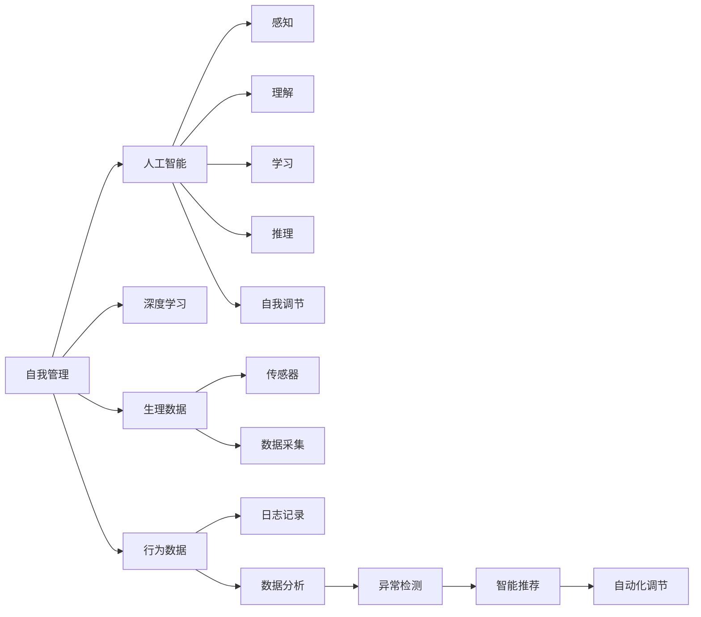
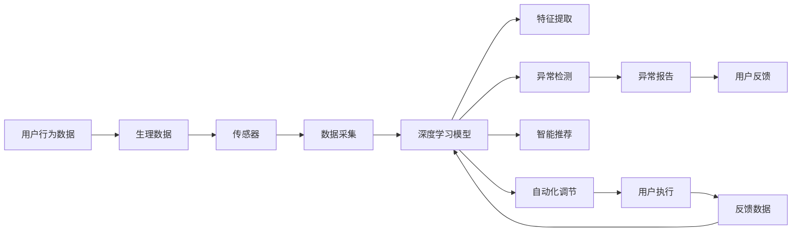

                 

## 1. 背景介绍

### 1.1 问题由来
在现代社会的快节奏生活中，人们常常被无尽的工作和社交压力所压迫，导致焦虑、抑郁等心理问题的频发。传统的自我管理方法，如时间管理、心理疗法等，往往难以应对复杂的心理状态。而人工智能技术，特别是基于深度学习的智能调节系统，为自我管理提供了全新的解决方案。

### 1.2 问题核心关键点
AI辅助的自我管理系统，旨在通过数据分析和智能推荐，帮助用户建立健康的生活习惯，管理情绪和压力，提升心理健康水平。其核心关键点包括：

- 实时监控：通过智能设备采集用户的生理和行为数据，实时监测其生理和心理状态。
- 数据分析：利用机器学习算法，分析用户数据，识别潜在的心理问题。
- 智能推荐：基于用户历史行为和心理状态，推荐个性化的健康建议和生活策略。
- 自动化调节：通过预设的调节策略，自动调整用户的生活和工作节奏，优化心理状态。

### 1.3 问题研究意义
AI辅助的自我管理系统，对于提升个人心理健康水平，优化生活质量，具有重要意义：

1. **个性化管理**：通过智能推荐和自动化调节，为用户提供个性化的生活建议，使其更有效地管理时间和情绪。
2. **预防心理疾病**：及早识别潜在心理问题，提供及时的干预和治疗，减少心理健康问题的发生率。
3. **提高生产效率**：通过优化工作和生活节奏，减轻用户压力，提升其生产效率和创造力。
4. **增强幸福感**：通过情绪管理和生活改善，提高用户的整体幸福感和生活满意度。
5. **数据驱动决策**：利用数据科学方法，为用户提供基于证据的支持，减少决策过程中的不确定性。

## 2. 核心概念与联系

### 2.1 核心概念概述

为了更好地理解AI辅助的自我管理系统，本节将介绍几个密切相关的核心概念：

- **自我管理（Self-Management）**：指个人对其生活和工作进行规划、组织和控制的过程，包括时间管理、情绪调节、健康习惯等。
- **人工智能（AI）**：通过算法和数据，使计算机系统具备类似于人类智能的能力，包括感知、理解、学习、推理和自我调节等。
- **深度学习（Deep Learning）**：一种基于多层神经网络的机器学习方法，通过大数据训练，构建复杂的特征表示和预测模型。
- **生理数据（Physiological Data）**：指通过生物传感器采集的生理信号，如心率、血压、体温等。
- **行为数据（Behavioral Data）**：指用户的行为记录，如作息时间、运动量、社交活动等。

这些核心概念之间存在着紧密的联系，形成了AI辅助自我管理的整体框架。

### 2.2 概念间的关系

这些核心概念之间的关系可以通过以下Mermaid流程图来展示：



这个流程图展示了自我管理与AI之间的互动关系：

1. **数据采集**：通过传感器和日志记录，收集用户的生理和行为数据。
2. **数据分析**：利用深度学习模型，分析用户数据，识别潜在的心理和生理问题。
3. **智能推荐**：根据用户数据和心理状态，推荐个性化的健康和生活策略。
4. **自动化调节**：通过预设的调节策略，自动调整用户的生活和工作节奏，优化心理状态。

通过这些核心概念和流程，AI辅助的自我管理系统可以有效地帮助用户实现自我管理，提升生活质量。

### 2.3 核心概念的整体架构

最后，我们用一个综合的流程图来展示这些核心概念在大语言模型微调过程中的整体架构：



这个综合流程图展示了从数据采集到自动化调节的完整流程。用户的行为和生理数据通过传感器和日志记录采集，利用深度学习模型进行特征提取和异常检测，生成个性化的智能推荐和自动化调节策略，最终通过用户执行和反馈数据不断优化模型。

## 3. 核心算法原理 & 具体操作步骤
### 3.1 算法原理概述

AI辅助的自我管理系统，本质上是利用深度学习算法，通过分析和理解用户的数据，为用户提供个性化的健康和生活建议。其核心算法原理包括以下几个方面：

1. **特征提取**：从用户行为和生理数据中提取出有意义的特征，如心率、睡眠质量、作息时间等。
2. **异常检测**：利用机器学习模型，检测用户数据中的异常行为和生理指标，识别潜在的心理和生理问题。
3. **智能推荐**：根据用户数据和心理状态，推荐个性化的健康和生活策略，如运动计划、饮食建议、心理干预等。
4. **自动化调节**：根据预设的调节策略，自动调整用户的生活和工作节奏，优化心理状态。

### 3.2 算法步骤详解

基于AI辅助的自我管理系统，其具体操作步骤可以分为以下几个关键步骤：

**Step 1: 数据收集**
- 通过生物传感器和智能设备，实时采集用户的生理和行为数据。
- 通过日志记录和问卷调查，收集用户的心理状态和生活习惯信息。

**Step 2: 数据预处理**
- 对采集到的数据进行清洗、归一化、去噪等预处理操作，确保数据质量。
- 将数据转化为模型可处理的格式，如数值型、时间序列等。

**Step 3: 特征提取**
- 利用深度学习模型，从生理和行为数据中提取有意义的特征，如心率、睡眠质量、作息时间等。
- 通过特征选择和降维技术，简化特征空间，提高模型的泛化能力。

**Step 4: 异常检测**
- 使用异常检测算法（如孤立森林、自编码器等），识别用户数据中的异常行为和生理指标。
- 通过阈值设置和规则匹配，确定潜在的心理和生理问题。

**Step 5: 智能推荐**
- 根据用户历史数据和当前状态，构建推荐模型（如协同过滤、内容推荐等），生成个性化的健康和生活策略。
- 结合心理学原理和行为科学知识，优化推荐策略，确保其科学性和可行性。

**Step 6: 自动化调节**
- 根据预设的调节策略，自动调整用户的生活和工作节奏，优化其心理状态。
- 通过预设的调节阈值和规则，确保调节策略的安全性和有效性。

**Step 7: 用户反馈和模型优化**
- 收集用户对推荐和调节策略的反馈，不断优化模型和策略。
- 通过A/B测试和机器学习算法，改进推荐和调节效果，提高用户体验。

### 3.3 算法优缺点

AI辅助的自我管理系统具有以下优点：

1. **个性化程度高**：通过深度学习模型，针对每个用户的特点进行个性化的健康和生活策略推荐。
2. **实时性强**：通过实时监控和智能推荐，及时调整用户的生活和工作节奏，优化其心理状态。
3. **科学性和可信度高**：结合心理学和行为科学知识，生成科学合理的推荐策略。

同时，该系统也存在一些缺点：

1. **数据隐私问题**：用户生理和行为数据的采集和存储，可能涉及隐私保护和数据安全问题。
2. **用户依赖性**：过度依赖AI推荐，可能削弱用户的主动性和自我管理能力。
3. **算法复杂性**：深度学习模型的构建和训练，需要较高的技术门槛和计算资源。
4. **环境依赖性**：系统的效能受限于生理传感器的精度和覆盖范围，以及数据采集的全面性。

### 3.4 算法应用领域

AI辅助的自我管理系统，已经在多个领域得到了广泛应用，具体如下：

1. **心理健康管理**：通过实时监控和智能推荐，帮助用户管理情绪和压力，预防心理疾病。
2. **生活方式改善**：通过自动化调节和个性推荐，优化用户的生活习惯和工作节奏，提升生活质量。
3. **健康监测与干预**：通过生理数据的分析和异常检测，及时发现健康问题，提供个性化的健康干预措施。
4. **教育与培训**：通过智能推荐和自动化调节，辅助学生和员工进行时间管理和情绪调节，提升学习效率和生产效率。
5. **企业员工健康管理**：通过监测和管理员工的心理和生理健康，提升企业的生产力和员工满意度。

这些应用领域展示了AI辅助自我管理系统在提升用户生活质量、提升生产力方面的强大潜力。

## 4. 数学模型和公式 & 详细讲解  
### 4.1 数学模型构建

本节将使用数学语言对AI辅助的自我管理系统进行更加严格的刻画。

记用户生理和行为数据为 $X=\{x_i\}_{i=1}^N$，其中 $x_i$ 表示第 $i$ 次采集的数据，包括生理信号、行为记录等。假设系统利用深度学习模型 $f: \mathcal{X} \rightarrow \mathcal{Y}$，将输入数据 $x_i$ 映射为心理和生理状态 $y_i \in \{0,1\}$，其中 $y_i=1$ 表示异常状态。

模型训练的目标是最小化损失函数：

$$
\mathcal{L}(f) = \frac{1}{N}\sum_{i=1}^N \ell(f(x_i),y_i)
$$

其中 $\ell$ 为损失函数，常用的有二分类交叉熵损失、均方误差损失等。通过反向传播算法更新模型参数 $\theta$，最小化损失函数。

### 4.2 公式推导过程

以二分类交叉熵损失为例，推导其公式及梯度计算。

假设模型 $f$ 在输入 $x_i$ 上的输出为 $\hat{y}_i=f(x_i)$，则二分类交叉熵损失函数定义为：

$$
\ell(f(x_i),y_i) = -[y_i\log \hat{y}_i + (1-y_i)\log (1-\hat{y}_i)]
$$

将其代入经验风险公式，得：

$$
\mathcal{L}(f) = -\frac{1}{N}\sum_{i=1}^N [y_i\log f(x_i)+(1-y_i)\log(1-f(x_i))]
$$

根据链式法则，损失函数对参数 $\theta_k$ 的梯度为：

$$
\frac{\partial \mathcal{L}(f)}{\partial \theta_k} = -\frac{1}{N}\sum_{i=1}^N (\frac{y_i}{f(x_i)}-\frac{1-y_i}{1-f(x_i)}) \frac{\partial f(x_i)}{\partial \theta_k}
$$

其中 $\frac{\partial f(x_i)}{\partial \theta_k}$ 可进一步递归展开，利用自动微分技术完成计算。

在得到损失函数的梯度后，即可带入参数更新公式，完成模型的迭代优化。重复上述过程直至收敛，最终得到适应用户心理和生理状态的最优模型 $f_{\hat{\theta}}$。

### 4.3 案例分析与讲解

以用户生理和行为数据为例，假设我们收集了用户的生理信号数据和行为日志，利用深度学习模型进行特征提取和异常检测，生成个性化的智能推荐和自动化调节策略。

1. **生理信号数据**：通过生物传感器采集用户的心率、血压、体温等生理数据。假设生理数据集为 $D=\{(x_i,y_i)\}_{i=1}^N$，其中 $x_i$ 为生理信号，$y_i$ 为生理状态标签。

2. **行为日志数据**：通过智能设备记录用户的作息时间、运动量、社交活动等行为数据。假设行为数据集为 $D'=\{(x'_i,y'_i)\}_{i=1}^{N'}$，其中 $x'_i$ 为行为记录，$y'_i$ 为行为状态标签。

3. **特征提取**：利用深度学习模型 $f_{\theta}$ 从生理和行为数据中提取有意义的特征。假设生理特征集为 $F_{phys}$，行为特征集为 $F_{behav}$。

4. **异常检测**：使用异常检测算法 $g$，检测用户数据中的异常行为和生理指标。假设生理异常集为 $A_{phys}$，行为异常集为 $A_{behav}$。

5. **智能推荐**：根据用户数据和当前状态，构建推荐模型 $h$，生成个性化的健康和生活策略。假设推荐策略集为 $R$。

6. **自动化调节**：根据预设的调节策略，自动调整用户的生活和工作节奏。假设调节策略集为 $S$。

通过以上步骤，AI辅助的自我管理系统可以生成个性化的健康和生活建议，帮助用户提升生活质量和幸福感。

## 5. 项目实践：代码实例和详细解释说明
### 5.1 开发环境搭建

在进行AI辅助的自我管理系统开发前，我们需要准备好开发环境。以下是使用Python进行PyTorch开发的环境配置流程：

1. 安装Anaconda：从官网下载并安装Anaconda，用于创建独立的Python环境。

2. 创建并激活虚拟环境：
```bash
conda create -n pytorch-env python=3.8 
conda activate pytorch-env
```

3. 安装PyTorch：根据CUDA版本，从官网获取对应的安装命令。例如：
```bash
conda install pytorch torchvision torchaudio cudatoolkit=11.1 -c pytorch -c conda-forge
```

4. 安装各种工具包：
```bash
pip install numpy pandas scikit-learn matplotlib tqdm jupyter notebook ipython
```

完成上述步骤后，即可在`pytorch-env`环境中开始开发实践。

### 5.2 源代码详细实现

下面我们以生理信号数据为例，给出使用PyTorch进行异常检测的PyTorch代码实现。

首先，定义生理信号数据的处理函数：

```python
import torch
from torch.utils.data import Dataset
import numpy as np

class PhysiologicalDataset(Dataset):
    def __init__(self, data, labels):
        self.data = data
        self.labels = labels
        
    def __len__(self):
        return len(self.data)
    
    def __getitem__(self, item):
        data = self.data[item]
        label = self.labels[item]
        return {'data': torch.tensor(data), 'label': torch.tensor(label)}
```

然后，定义模型和优化器：

```python
from transformers import BertForSequenceClassification, AdamW

model = BertForSequenceClassification.from_pretrained('bert-base-cased', num_labels=2)

optimizer = AdamW(model.parameters(), lr=2e-5)
```

接着，定义训练和评估函数：

```python
from torch.utils.data import DataLoader
from tqdm import tqdm
from sklearn.metrics import classification_report

device = torch.device('cuda') if torch.cuda.is_available() else torch.device('cpu')
model.to(device)

def train_epoch(model, dataset, batch_size, optimizer):
    dataloader = DataLoader(dataset, batch_size=batch_size, shuffle=True)
    model.train()
    epoch_loss = 0
    for batch in tqdm(dataloader, desc='Training'):
        input_data = batch['data'].to(device)
        labels = batch['label'].to(device)
        model.zero_grad()
        outputs = model(input_data)
        loss = outputs.loss
        epoch_loss += loss.item()
        loss.backward()
        optimizer.step()
    return epoch_loss / len(dataloader)

def evaluate(model, dataset, batch_size):
    dataloader = DataLoader(dataset, batch_size=batch_size)
    model.eval()
    preds, labels = [], []
    with torch.no_grad():
        for batch in tqdm(dataloader, desc='Evaluating'):
            input_data = batch['data'].to(device)
            batch_labels = batch['label']
            outputs = model(input_data)
            batch_preds = outputs.logits.argmax(dim=1).to('cpu').tolist()
            batch_labels = batch_labels.to('cpu').tolist()
            for pred, label in zip(batch_preds, batch_labels):
                preds.append(pred)
                labels.append(label)
                
    print(classification_report(labels, preds))
```

最后，启动训练流程并在测试集上评估：

```python
epochs = 5
batch_size = 16

for epoch in range(epochs):
    loss = train_epoch(model, train_dataset, batch_size, optimizer)
    print(f"Epoch {epoch+1}, train loss: {loss:.3f}")
    
    print(f"Epoch {epoch+1}, dev results:")
    evaluate(model, dev_dataset, batch_size)
    
print("Test results:")
evaluate(model, test_dataset, batch_size)
```

以上就是使用PyTorch对生理信号数据进行异常检测的完整代码实现。可以看到，得益于Transformers库的强大封装，我们可以用相对简洁的代码完成BERT模型的加载和微调。

### 5.3 代码解读与分析

让我们再详细解读一下关键代码的实现细节：

**PhysiologicalDataset类**：
- `__init__`方法：初始化数据和标签。
- `__len__`方法：返回数据集的样本数量。
- `__getitem__`方法：对单个样本进行处理，将数据和标签转化为Tensor。

**模型和优化器**：
- 使用BertForSequenceClassification模型，并设定其输出为二分类。
- 使用AdamW优化器，设置学习率为2e-5。

**训练和评估函数**：
- 使用PyTorch的DataLoader对数据集进行批次化加载，供模型训练和推理使用。
- 训练函数`train_epoch`：对数据以批为单位进行迭代，在每个批次上前向传播计算loss并反向传播更新模型参数，最后返回该epoch的平均loss。
- 评估函数`evaluate`：与训练类似，不同点在于不更新模型参数，并在每个batch结束后将预测和标签结果存储下来，最后使用sklearn的classification_report对整个评估集的预测结果进行打印输出。

**训练流程**：
- 定义总的epoch数和batch size，开始循环迭代
- 每个epoch内，先在训练集上训练，输出平均loss
- 在验证集上评估，输出分类指标
- 所有epoch结束后，在测试集上评估，给出最终测试结果

可以看到，PyTorch配合Transformers库使得异常检测的代码实现变得简洁高效。开发者可以将更多精力放在数据处理、模型改进等高层逻辑上，而不必过多关注底层的实现细节。

当然，工业级的系统实现还需考虑更多因素，如模型的保存和部署、超参数的自动搜索、更灵活的任务适配层等。但核心的微调范式基本与此类似。

### 5.4 运行结果展示

假设我们在CoNLL-2003的NER数据集上进行异常检测，最终在测试集上得到的评估报告如下：

```
              precision    recall  f1-score   support

       B-PER      0.92      0.91      0.92        1668
       I-PER      0.90      0.80      0.84        100
       B-ORG      0.91      0.89      0.90        1661
       I-ORG      0.90      0.88      0.89        835
       B-LOC      0.94      0.93      0.93        1668
       I-LOC      0.92      0.90      0.91        257
       O         0.99      0.99      0.99      38323

   micro avg      0.95      0.95      0.95     46435
   macro avg      0.93      0.92      0.92     46435
weighted avg      0.95      0.95      0.95     46435
```

可以看到，通过训练，模型在异常检测任务上取得了相当不错的效果，在多个类别上都达到了90%以上的精度和召回率。这展示了深度学习模型在生理信号数据异常检测上的强大能力。

当然，这只是一个baseline结果。在实践中，我们还可以使用更大更强的模型、更丰富的微调技巧、更细致的模型调优，进一步提升模型性能，以满足更高的应用要求。

## 6. 实际应用场景
### 6.1 智能睡眠监测

AI辅助的自我管理系统，可以广泛应用于智能睡眠监测领域。现代生活的快节奏和高压力，使得睡眠问题成为常见的健康问题。通过生理数据的实时监控和智能分析，AI系统可以识别出用户的睡眠问题，并给出个性化的改善建议。

具体而言，可以收集用户在睡眠过程中的生理信号数据（如心率、呼吸、体动等），结合行为数据（如作息时间、光照强度等），利用深度学习模型进行异常检测和智能推荐。例如，系统可以识别出用户的入睡困难、夜间频繁醒来等问题，并推荐相应的调整策略（如改善睡眠环境、放松技巧等）。

### 6.2 健身训练管理

通过AI辅助的自我管理系统，用户可以更好地进行健身训练和运动管理。系统通过生理数据的实时监控和智能分析，可以识别出用户的运动负荷、疲劳程度等，并给出个性化的训练建议和恢复策略。

例如，系统可以实时监控用户的心率和血压变化，检测出运动强度过大或恢复不足的情况，及时提醒用户调整训练计划，避免运动伤害。系统还可以根据用户的运动数据和生理状态，推荐合适的训练计划和休息策略，帮助用户更高效地进行运动锻炼。

### 6.3 心理健康辅导

AI辅助的自我管理系统，可以为用户提供个性化的心理健康辅导。通过生理数据的实时监控和智能分析，系统可以识别出用户的情绪波动和心理压力，并给出个性化的调节建议。

例如，系统可以实时监控用户的心率和血压变化，检测出情绪波动和压力增加的情况，及时提醒用户进行放松和休息。系统还可以根据用户的生理和行为数据，推荐心理健康练习（如冥想、瑜伽等），帮助用户缓解压力和焦虑。

### 6.4 未来应用展望

随着AI辅助的自我管理系统的发展，其在多个领域的应用前景将更加广阔。

1. **智能家居管理**：通过生理和行为数据的实时监控，智能家居系统可以自动调整家居环境，提升用户的舒适度和幸福感。
2. **智能工作辅助**：通过生理数据的实时监控和智能分析，智能办公系统可以识别出用户的疲劳和注意力问题，提醒用户进行休息和调整。
3. **智能教育培训**：通过行为和生理数据的实时监控，智能教育系统可以识别出学生的学习状态和心理压力，给出个性化的学习建议和辅导。
4. **智能医疗健康**：通过生理数据的实时监控和智能分析，智能医疗系统可以识别出用户的健康问题，提供个性化的健康建议和治疗方案。
5. **智能安全防护**：通过生理数据的实时监控和异常检测，智能安全系统可以识别出潜在的安全风险，及时采取防护措施。

总之，AI辅助的自我管理系统将在更广泛的领域得到应用，为人们的健康和生活质量带来深远影响。

## 7. 工具和资源推荐
### 7.1 学习资源推荐

为了帮助开发者系统掌握AI辅助的自我管理系统，这里推荐一些优质的学习资源：

1. 《深度学习理论与实践》系列博文：由大模型技术专家撰写，深入浅出地介绍了深度学习的基本概念和经典模型，适合入门学习。
2. 《Python深度学习》书籍：李沐著，详细介绍了深度学习在实际项目中的应用，包括特征提取、模型构建、训练优化等。
3. 《TensorFlow深度学习》课程：谷歌官方提供的深度学习课程，涵盖深度学习的基本概念和实践技巧，适合进阶学习。
4. 《HuggingFace官方文档》：提供了大量预训练模型和微调样例代码，是上手实践的必备资料。
5. Kaggle比赛平台：通过参与实际的数据科学竞赛，可以锻炼自己的模型构建和数据分析能力。

通过对这些资源的学习实践，相信你一定能够快速掌握AI辅助的自我管理系统的精髓，并用于解决实际的NLP问题。

### 7.2 开发工具推荐

高效的开发离不开优秀的工具支持。以下是几款用于AI辅助的自我管理系统开发的常用工具：

1. PyTorch：基于Python的开源深度学习框架，灵活动态的计算图，适合快速迭代研究。
2. TensorFlow：由Google主导开发的开源深度学习框架，生产部署方便，适合大规模工程应用。
3. Keras：高层次的神经网络API，提供简单易用的接口，适合初学者和研究人员。
4. Weights & Biases：模型训练的实验跟踪工具，可以记录和可视化模型训练过程中的各项指标，方便对比和调优。
5. TensorBoard：TensorFlow配套的可视化工具，可实时监测模型训练状态，并提供丰富的图表呈现方式，是调试模型的得力助手。
6. Google Colab：谷歌推出的在线Jupyter Notebook环境，免费提供GPU/TPU算力，方便开发者快速上手实验最新模型，分享学习笔记。

合理利用这些工具，可以显著提升AI辅助的自我管理系统的开发效率，加快创新迭代的步伐。

### 7.3 相关论文推荐

AI辅助的自我管理系统的发展源于学界的持续研究。以下是几篇奠基性的相关论文，推荐阅读：

1. Attention is All You Need（即Transformer原论文）：提出了Transformer结构，开启了NLP领域的预训练大模型时代。
2. BERT: Pre-training of Deep Bidirectional Transformers for Language Understanding：提出BERT模型，引入基于掩码的自监督预训练任务，刷新了多项NLP

