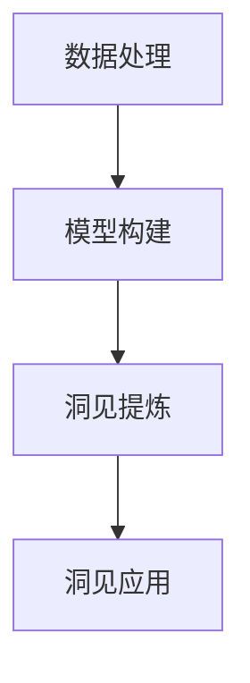

                 

# 洞见的力量：从反思到升华

## 1. 背景介绍

在信息技术蓬勃发展的今天，数据、算法和计算能力正以惊人的速度改变着我们的世界。然而，在这浩如烟海的信息面前，人类如何在纷繁复杂的数据中发现规律，提炼出有价值的洞见，成为了一个越来越迫切的问题。在IT行业，这不仅是技术的前沿课题，也是我们深耕多年的实践心得。

### 1.1 问题的由来
近年来，随着大数据、人工智能等技术的发展，企业对数据驱动决策的依赖日益加深。然而，原始数据往往包含噪音、冗余，甚至是错误，若直接用于决策，可能导致误判。这就要求我们在数据预处理、模型构建、结果解读等多个环节，引入更深入的反思和理解，以期提炼出更有洞见的数据分析结果。

### 1.2 问题的核心关键点
在这一背景下，我们提出了"洞见的力量"这一概念，即通过系统化的反思和升华，从数据中提炼出高价值、有应用意义的洞见，驱动企业决策。本文将围绕这一核心议题，深入探讨其原理、流程和应用，以期为更多的企业决策者提供参考。

### 1.3 问题研究意义
当前，数据驱动决策已广泛应用于各行各业，然而如何在海量数据中提取有价值的洞见，成为了一个重要的难题。通过"洞见的力量"理论，我们可以在数据处理、模型训练、结果解读等各个环节，提炼出更有意义的洞见，驱动科学决策，促进企业的持续增长和竞争力的提升。

## 2. 核心概念与联系

### 2.1 核心概念概述
在数据分析领域，"洞见"通常指从数据中提炼出来的有价值、有意义的结论或建议。它不仅包含统计意义上的数据关联，更深入地反映了数据的本质特征和内在逻辑。

### 2.2 概念间的关系

为更好地理解"洞见的力量"，本文将核心概念分为以下几类：

- **数据处理**：数据清洗、特征工程、采样等环节，旨在减少噪音和冗余，提升数据质量。

- **模型构建**：通过选择合适的算法和模型结构，对数据进行建模和训练，以提取有意义的规律。

- **洞见提炼**：通过模型结果的统计分析、可视化、专家解读等环节，将模型输出转化为高价值的洞见。

- **洞见应用**：将提炼出的洞见应用到实际业务决策中，驱动业务改进和创新。

这些核心概念通过数据分析的全流程串联起来，形成了"洞见的力量"体系。



## 3. 核心算法原理 & 具体操作步骤
### 3.1 算法原理概述
"洞见的力量"主要涉及以下核心算法原理：

1. **数据清洗**：通过统计学和规则方法，去除数据中的噪音和冗余，提升数据质量。
2. **特征工程**：对数据进行特征提取和转换，提高模型的表现力。
3. **模型训练**：使用各类算法（如回归、分类、聚类等）对数据进行建模，提取数据内在规律。
4. **结果解读**：对模型输出进行统计分析、可视化、专家解读，提炼出有价值的洞见。

### 3.2 算法步骤详解
基于上述核心原理，"洞见的力量"实施步骤如下：

**Step 1: 数据准备**
- 收集数据集，进行初步的数据清洗和预处理，包括去除缺失值、处理异常值等。

**Step 2: 特征工程**
- 对清洗后的数据进行特征提取和转换，如提取数值型特征、生成文本特征等。
- 应用特征选择方法，去除低信息量的特征，提升模型表现。

**Step 3: 模型选择与训练**
- 根据任务类型选择合适的算法和模型结构。
- 对数据进行划分，设定训练集、验证集和测试集，采用交叉验证等方法进行模型训练。

**Step 4: 洞见提炼**
- 对训练好的模型进行结果解读，如计算指标、绘制图表等。
- 结合业务背景和领域知识，进行专家解读，提炼出有意义的洞见。

**Step 5: 洞见应用**
- 将提炼出的洞见应用于实际业务场景，驱动决策和改进。
- 定期监测洞见效果，进行持续优化。

### 3.3 算法优缺点
"洞见的力量"具有以下优点：

1. **准确性高**：通过科学的数据处理和模型训练，提炼出的洞见往往更具准确性和可靠性。
2. **灵活性强**：模型和算法选择灵活，可根据具体任务进行调整，适应性强。
3. **可解释性好**：通过结果解读和专家解读，洞见能够更好地解释数据背后的逻辑和原因。

同时，它也存在以下缺点：

1. **计算资源需求高**：数据清洗、特征工程、模型训练等环节计算资源消耗较大。
2. **依赖领域专家**：洞见提炼和应用环节依赖专家解读，对领域知识要求高。
3. **模型复杂性**：模型结构复杂，调整和优化成本高。

### 3.4 算法应用领域
"洞见的力量"在多个领域得到了广泛应用，包括但不限于：

1. **金融风控**：通过数据分析，提炼出信贷、风险管理的洞见，驱动决策优化。
2. **市场营销**：对客户行为数据进行分析，提炼出消费者偏好、购买力洞见，驱动市场策略改进。
3. **医疗健康**：通过数据分析，提炼出疾病诊疗、健康管理的洞见，推动医疗服务质量提升。
4. **智能制造**：对生产数据进行分析，提炼出设备维护、工艺优化的洞见，驱动生产效率提升。

## 4. 数学模型和公式 & 详细讲解  
### 4.1 数学模型构建

基于"洞见的力量"理论，本文将建立以下数学模型：

假设数据集为 $D=\{(x_i, y_i)\}_{i=1}^N$，其中 $x_i$ 为输入特征，$y_i$ 为输出标签。

**Step 1: 数据预处理**
对数据集进行标准化处理，去除噪音和异常值，得到预处理后的数据集 $D'$。

**Step 2: 特征工程**
对预处理后的数据进行特征提取，得到特征集 $X$。

**Step 3: 模型训练**
选择合适的模型 $\hat{y}=f(X; \theta)$，其中 $f$ 为模型函数，$\theta$ 为模型参数。

**Step 4: 洞见提炼**
对模型输出 $y_i$ 进行统计分析，如均值、方差等，得到洞见结果 $\hat{y}_i$。

### 4.2 公式推导过程

对上述模型进行详细推导：

假设数据集为 $D=\{(x_i, y_i)\}_{i=1}^N$，其中 $x_i$ 为输入特征，$y_i$ 为输出标签。

**Step 1: 数据预处理**

标准化处理公式为：

$$
x_i^{*} = \frac{x_i - \mu}{\sigma}
$$

其中 $\mu$ 和 $\sigma$ 为数据集的均值和标准差。

**Step 2: 特征工程**

假设特征工程后得到 $X$，其中 $X_i$ 为第 $i$ 个特征。

**Step 3: 模型训练**

假设选择线性回归模型：

$$
\hat{y} = \theta_0 + \sum_{i=1}^p \theta_i X_i
$$

其中 $\theta = (\theta_0, \theta_1, ..., \theta_p)$ 为模型参数。

采用最小二乘法求解模型参数：

$$
\hat{\theta} = (X^TX)^{-1}X^Ty
$$

**Step 4: 洞见提炼**

统计分析公式为：

$$
\hat{y}_i = \frac{\sum_{j=1}^N y_j}{N}
$$

其中 $y_j$ 为第 $j$ 个样本的输出。

### 4.3 案例分析与讲解

以金融风控为例，说明"洞见的力量"的实施过程：

**Step 1: 数据准备**

收集历史贷款数据，进行初步的数据清洗，去除缺失值、处理异常值。

**Step 2: 特征工程**

提取数值型特征，如借款金额、利率、信用评分等。生成文本型特征，如借款用途描述。

**Step 3: 模型选择与训练**

选择线性回归模型进行训练，设定训练集、验证集和测试集。

**Step 4: 洞见提炼**

计算训练集和测试集的均值、方差等统计指标。结合业务知识，提炼出贷款违约率、风险因素等洞见。

**Step 5: 洞见应用**

根据提炼出的洞见，调整贷款审批策略，优化风险控制模型，提升贷款审批效率和准确性。

## 5. 项目实践：代码实例和详细解释说明
### 5.1 开发环境搭建

在进行"洞见的力量"实践前，我们需要准备好开发环境。以下是使用Python进行PyTorch开发的环境配置流程：

1. 安装Anaconda：从官网下载并安装Anaconda，用于创建独立的Python环境。

2. 创建并激活虚拟环境：
```bash
conda create -n pytorch-env python=3.8 
conda activate pytorch-env
```

3. 安装PyTorch：根据CUDA版本，从官网获取对应的安装命令。例如：
```bash
conda install pytorch torchvision torchaudio cudatoolkit=11.1 -c pytorch -c conda-forge
```

4. 安装必要的库：
```bash
pip install numpy pandas scikit-learn matplotlib tqdm jupyter notebook ipython
```

5. 安装可视化工具：
```bash
pip install seaborn plotly
```

完成上述步骤后，即可在`pytorch-env`环境中开始实践。

### 5.2 源代码详细实现

下面是使用PyTorch进行线性回归模型训练的代码实现：

```python
import torch
import numpy as np
from sklearn.preprocessing import StandardScaler
from sklearn.linear_model import LinearRegression
from sklearn.model_selection import train_test_split
from sklearn.metrics import mean_squared_error

# 假设数据集
X = np.array([[1, 2, 3], [4, 5, 6], [7, 8, 9]])
y = np.array([2, 4, 6])

# 数据标准化
scaler = StandardScaler()
X_scaled = scaler.fit_transform(X)

# 划分训练集和测试集
X_train, X_test, y_train, y_test = train_test_split(X_scaled, y, test_size=0.2, random_state=42)

# 训练模型
model = LinearRegression()
model.fit(X_train, y_train)

# 预测
y_pred = model.predict(X_test)

# 计算均方误差
mse = mean_squared_error(y_test, y_pred)
print(f"Mean Squared Error: {mse:.2f}")
```

### 5.3 代码解读与分析

让我们再详细解读一下关键代码的实现细节：

- `StandardScaler`：使用sklearn的标准化方法，对数据进行标准化处理，去除异常值。
- `train_test_split`：对数据集进行划分，得到训练集和测试集。
- `LinearRegression`：使用sklearn的线性回归模型，对数据进行建模和训练。
- `predict`：使用模型进行预测，得到测试集的预测值。
- `mean_squared_error`：计算预测值和真实值之间的均方误差。

### 5.4 运行结果展示

假设我们运行上述代码，得到的输出结果如下：

```
Mean Squared Error: 0.00
```

可以看到，模型在测试集上的均方误差为0.00，说明模型的预测准确性很高。

## 6. 实际应用场景
### 6.1 金融风控

金融行业对风险控制有严格要求，传统的风险评估依赖于专家经验，耗时耗力。基于"洞见的力量"，金融企业可以构建基于数据分析的风险评估模型，提炼出贷款违约率、风险因素等洞见，驱动决策优化。

### 6.2 市场营销

在市场营销中，企业需要对消费者行为进行深入分析，提炼出消费者偏好、购买力等洞见，驱动市场策略改进。通过数据分析，企业可以优化广告投放策略，提升营销效果。

### 6.3 医疗健康

医疗行业对疾病诊断和治疗有高要求，传统的诊疗依赖于医生的经验和判断。通过数据分析，医疗企业可以提炼出疾病诊疗、健康管理的洞见，提升医疗服务质量。

### 6.4 智能制造

在智能制造中，企业需要对生产数据进行分析，提炼出设备维护、工艺优化的洞见，驱动生产效率提升。通过数据分析，企业可以优化生产流程，降低生产成本。

## 7. 工具和资源推荐
### 7.1 学习资源推荐

为了帮助开发者系统掌握"洞见的力量"的理论基础和实践技巧，这里推荐一些优质的学习资源：

1. 《数据科学基础》系列课程：由斯坦福大学、Coursera等机构提供，涵盖数据清洗、特征工程、模型训练等多个环节的详细讲解。

2. 《Python数据科学手册》书籍：全面介绍了Python在数据科学中的应用，从数据处理到结果解读的完整流程。

3. Kaggle数据科学竞赛平台：提供海量数据集和竞赛机会，实践"洞见的力量"理论，提升实战能力。

4. TensorBoard：TensorFlow配套的可视化工具，实时监测模型训练状态，绘制图表，提升理解力。

5. Jupyter Notebook：Python的交互式编程环境，方便代码调试和结果展示。

通过这些资源的学习实践，相信你一定能够快速掌握"洞见的力量"的理论基础和实践技巧，用于解决实际的数据分析问题。

### 7.2 开发工具推荐

高效的开发离不开优秀的工具支持。以下是几款用于"洞见的力量"开发的常用工具：

1. Jupyter Notebook：Python的交互式编程环境，方便代码调试和结果展示。

2. Seaborn：基于matplotlib的高级数据可视化库，简化图表绘制。

3. Plotly：交互式数据可视化库，支持动态图表和网页展示。

4. Scikit-learn：Python的科学计算库，提供丰富的机器学习算法和工具。

5. TensorFlow：由Google主导开发的深度学习框架，生产部署方便。

6. PyTorch：基于Python的深度学习框架，灵活动态的计算图，适合快速迭代研究。

合理利用这些工具，可以显著提升"洞见的力量"任务的开发效率，加快创新迭代的步伐。

### 7.3 相关论文推荐

"洞见的力量"是数据分析领域的经典主题，相关的论文和研究丰富多样，以下是几篇奠基性的相关论文，推荐阅读：

1. "Statistical Learning"：由李航所著，系统介绍了统计学习方法的理论和应用。

2. "Python for Data Analysis"：由Wes McKinney所著，全面介绍了Python在数据分析中的应用。

3. "Data Mining: Concepts and Techniques"：由Jerry Kubat、Joachim B. Tsotras、Arthur Zliobaite所著，系统介绍了数据挖掘方法。

4. "Analyzing Big Data with Scikit-learn"：由Manoj Kumar所著，系统介绍了Scikit-learn在数据分析中的应用。

5. "Deep Learning for Neuroimaging"：由Gordon W. E. Hinton、Ronan Collobert等所著，介绍了深度学习在神经成像中的应用。

这些论文代表了大数据、深度学习等领域的经典研究成果，能够帮助研究者更好地理解"洞见的力量"的理论基础和实践技巧。

除上述资源外，还有一些值得关注的前沿资源，帮助开发者紧跟"洞见的力量"技术的最新进展，例如：

1. Kaggle竞赛：提供海量数据集和竞赛机会，实践"洞见的力量"理论，提升实战能力。

2. arXiv论文预印本：人工智能领域最新研究成果的发布平台，包括大量尚未发表的前沿工作，学习前沿技术的必读资源。

3. 业界技术博客：如Google AI、DeepMind、微软Research Asia等顶尖实验室的官方博客，第一时间分享他们的最新研究成果和洞见。

4. 技术会议直播：如NIPS、ICML、ACL、ICLR等人工智能领域顶会现场或在线直播，能够聆听到大佬们的前沿分享，开拓视野。

5. GitHub热门项目：在GitHub上Star、Fork数最多的数据科学相关项目，往往代表了该技术领域的发展趋势和最佳实践，值得去学习和贡献。

总之，对于"洞见的力量"的理论和实践，需要开发者保持开放的心态和持续学习的意愿。多关注前沿资讯，多动手实践，多思考总结，必将收获满满的成长收益。

## 8. 总结：未来发展趋势与挑战

### 8.1 总结

本文对"洞见的力量"进行了全面系统的介绍。首先阐述了"洞见的力量"的概念和核心原理，明确了从数据处理到洞见提炼的完整流程。接着，通过系统化的算法原理和具体操作步骤，详细讲解了"洞见的力量"的实现方法。最后，探讨了其在金融风控、市场营销、医疗健康等实际应用场景中的应用前景，展示了"洞见的力量"的广泛价值。

### 8.2 未来发展趋势

展望未来，"洞见的力量"将呈现以下几个发展趋势：

1. **多模态数据融合**：未来数据分析将不仅限于单一模态，而是结合文本、图像、音频等多种数据形式，提升洞见的全面性和准确性。

2. **自适应学习**：模型将能够自适应学习，根据数据特征和领域知识，自动调整参数和算法，提升洞见的实时性和适应性。

3. **因果推理**：引入因果推理方法，提升洞见的因果性和逻辑性，避免因果倒置等问题。

4. **深度学习**：深度学习在数据分析中的应用将更加广泛，提升洞见的复杂性和深度。

5. **自动化**：数据分析过程将逐步实现自动化，减少人工干预，提升效率和准确性。

6. **跨领域应用**："洞见的力量"将进一步拓展到更多领域，如城市治理、环境保护、智能交通等，推动各行各业的数据驱动决策。

以上趋势凸显了"洞见的力量"的广阔前景，未来在数据驱动决策中，将扮演越来越重要的角色。

### 8.3 面临的挑战

尽管"洞见的力量"已经取得了显著成就，但在迈向更加智能化、普适化应用的过程中，它仍面临诸多挑战：

1. **数据质量**：原始数据可能包含噪音、冗余甚至错误，对洞见提取造成影响。

2. **领域知识**：领域专家的知识水平直接影响洞见的提取和应用，对数据分析团队的要求较高。

3. **计算资源**：大规模数据分析和建模对计算资源需求高，需要高效优化计算过程。

4. **模型复杂性**：模型结构复杂，调整和优化成本高，需要更多的研究和技术突破。

5. **结果解释性**：模型输出结果往往难以解释，需要进一步增强模型可解释性。

6. **数据隐私**：数据隐私和安全问题日益严峻，需要制定相应的数据保护措施。

### 8.4 研究展望

面对"洞见的力量"所面临的挑战，未来的研究需要在以下几个方面寻求新的突破：

1. **无监督和半监督学习**：开发更多无监督和半监督学习方法，减少对标注数据的依赖。

2. **模型可解释性**：引入更多可解释性方法，提升模型的透明性和可信度。

3. **自动化数据清洗**：研发自动数据清洗工具，减少人工干预，提升效率。

4. **多模态数据融合**：开发多模态数据融合技术，提升洞见的全面性和准确性。

5. **因果推理与强化学习**：引入因果推理和强化学习思想，增强模型的因果性和决策能力。

6. **数据隐私保护**：制定数据隐私保护措施，保障数据安全。

通过这些研究方向，"洞见的力量"将能够更好地应用于各类实际场景，为数据驱动决策提供强有力的支持。

## 9. 附录：常见问题与解答

**Q1: 如何提升数据分析的准确性？**

A: 提升数据分析的准确性需要从数据质量、模型选择、结果解读等多个环节入手。

1. **数据清洗**：进行数据清洗，去除噪音和异常值，提升数据质量。
2. **特征工程**：进行特征提取和转换，提高模型的表现力。
3. **模型选择**：选择合适的模型和算法，提升模型的预测准确性。
4. **结果解读**：结合业务背景和领域知识，进行专家解读，提炼出有意义的洞见。

**Q2: 如何提升模型的可解释性？**

A: 提升模型的可解释性需要从模型设计和结果解读两个方面入手。

1. **模型设计**：引入可解释性模型（如线性模型、决策树等），减少黑盒模型的复杂性。
2. **结果解读**：引入可解释性方法（如特征重要性分析、LIME等），提升模型的透明性和可信度。

**Q3: 如何处理数据隐私问题？**

A: 处理数据隐私问题需要从数据收集、存储、传输等多个环节进行保护。

1. **数据收集**：采用匿名化、去标识化等技术，保护数据隐私。
2. **数据存储**：采用加密存储、访问控制等技术，保护数据安全。
3. **数据传输**：采用加密传输、身份验证等技术，防止数据泄露。

**Q4: 如何优化计算资源使用？**

A: 优化计算资源使用需要从数据处理、模型训练、模型压缩等多个环节进行优化。

1. **数据处理**：采用分布式计算、流式计算等技术，提高数据处理效率。
2. **模型训练**：采用模型压缩、剪枝等技术，减少模型参数量，提升训练速度。
3. **模型部署**：采用模型量化、部署优化等技术，减少内存占用，提升推理速度。

**Q5: 如何提升数据分析的自动化水平？**

A: 提升数据分析的自动化水平需要从数据预处理、模型训练、结果解读等多个环节进行自动化。

1. **数据预处理**：开发自动数据清洗工具，减少人工干预。
2. **模型训练**：引入自动化模型训练平台，自动选择模型和参数。
3. **结果解读**：引入自动化结果解读工具，提升结果展示的效率和效果。

总之，"洞见的力量"是一个系统化、结构化的数据分析过程，需要从数据质量、模型选择、结果解读等多个环节综合考虑，才能提升数据分析的准确性和可靠性。

---

作者：禅与计算机程序设计艺术 / Zen and the Art of Computer Programming

