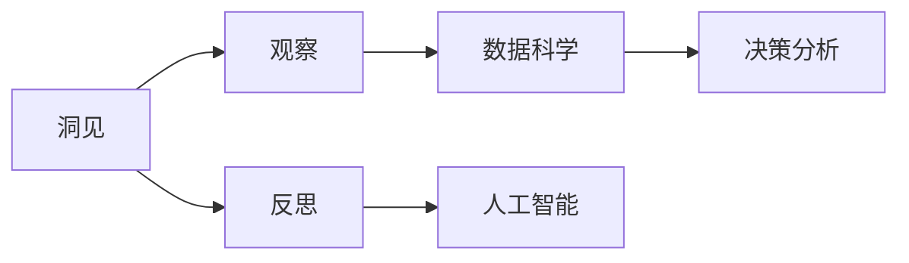
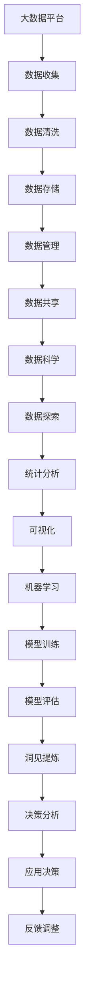

                 

# 洞见的形成：从观察到反思

> 关键词：洞见,观察,反思,数据科学,人工智能,决策分析

## 1. 背景介绍

### 1.1 问题由来

在信息爆炸的时代，面对海量的数据和复杂的环境，人类需要从混乱和噪声中提炼出有价值的洞见，从而做出明智的决策。这不仅是数据科学和人工智能的使命，也是各种决策分析系统的核心任务。然而，如何从数据中洞察本质，形成有见地的见解，至今仍是摆在从业者面前的难题。

### 1.2 问题核心关键点

实现洞见的形成，需要解决以下几个关键问题：

1. **数据质量与真实性**：数据必须真实、可靠，才能反映事物的本质。数据清洗、去噪和验证是获取高质量数据的前提。
2. **数据多样性与代表性**：数据必须充分覆盖不同场景，避免样本偏差，从而保证结论的普适性。
3. **分析方法与模型**：选择合适的分析方法和模型，从数据中提取有价值的洞察和规律。
4. **解释性与可解释性**：洞见应具备逻辑性和可解释性，便于理解和应用。

### 1.3 问题研究意义

洞见形成的研究具有重要意义：

- **提升决策质量**：通过科学分析，形成基于数据的洞见，减少主观判断和错误，提高决策的科学性和准确性。
- **优化资源配置**：了解事物运行的规律和趋势，优化资源配置，提升运营效率。
- **促进创新**：洞察市场和技术趋势，揭示新的机遇，促进技术创新和业务发展。
- **增强信心**：基于数据的洞见，让决策更有依据，增强企业的信心和竞争力。
- **推动社会进步**：在更广泛的社会领域，洞见有助于解决复杂问题，推动社会进步。

## 2. 核心概念与联系

### 2.1 核心概念概述

为更好地理解洞见的形成过程，本节将介绍几个关键概念：

- **洞见**：通过对数据和现象的深入分析，提炼出的有洞察力和指导意义的见解。
- **观察**：对现象和数据的直接感知，是洞见形成的基础。
- **反思**：在观察和分析基础上，对洞见进行思考、质疑和修正，以确保其准确性和适用性。
- **数据科学**：利用统计学、机器学习和数据可视化等工具，从数据中提取知识和方法论的科学。
- **人工智能**：利用算法和模型，自动分析和解释数据，辅助决策的智能技术。
- **决策分析**：应用各种分析方法和模型，帮助决策者做出科学、合理决策的过程。

这些概念之间的逻辑关系可以通过以下Mermaid流程图来展示：



这个流程图展示了几大关键概念之间的关系：

1. 洞见通过观察和数据科学获取。
2. 人工智能辅助观察和数据分析。
3. 决策分析利用洞见指导决策。

### 2.2 概念间的关系

这些核心概念之间存在着紧密的联系，形成了洞见形成的完整生态系统。下面通过几个Mermaid流程图来展示这些概念之间的关系。

#### 2.2.1 洞见形成的基本流程


这个流程图展示了洞见形成的基本流程：

1. 收集数据并进行清洗和处理。
2. 设计特征工程，提取和构造特征。
3. 选择和训练模型，得到预测结果。
4. 评估模型，验证预测准确性。
5. 验证结果，提取洞见。
6. 应用洞见，指导决策。

#### 2.2.2 数据科学在洞见形成中的应用


这个流程图展示了数据科学在洞见形成中的应用：

1. 数据收集和清洗。
2. 数据探索和统计分析。
3. 数据可视化，直观展现分析结果。
4. 机器学习模型选择和训练。
5. 模型评估和验证。
6. 提炼洞见，指导决策。

#### 2.2.3 人工智能在洞见形成中的作用


这个流程图展示了人工智能在洞见形成中的作用：

1. 输入数据并提取特征。
2. 训练模型，得到预测结果。
3. 评估模型，验证预测准确性。
4. 提炼洞见，指导决策。

### 2.3 核心概念的整体架构

最后，我们用一个综合的流程图来展示这些核心概念在大数据和洞见形成过程中的整体架构：



这个综合流程图展示了从数据采集到洞见形成再到决策应用的完整过程。大数据平台支撑数据收集和存储，数据科学和机器学习进行数据分析和洞见提炼，决策分析指导决策应用，最后通过反馈调整优化整个系统。通过这些流程图，我们可以更清晰地理解洞见形成的完整过程和各个环节的逻辑关系。

## 3. 核心算法原理 & 具体操作步骤
### 3.1 算法原理概述

洞见的形成过程是一个多步骤、多方法交织的复杂过程，涉及到数据的获取、清洗、特征工程、模型选择、训练、评估、洞见提炼和应用等多个环节。每个环节都需要根据具体情况进行精细设计和调整。

### 3.2 算法步骤详解

以下是洞见形成的主要步骤：

1. **数据获取与预处理**：
   - 收集数据，包括内部数据和外部数据。
   - 进行数据清洗，去除噪音和异常值。
   - 处理缺失值和重复数据，确保数据完整性和一致性。

2. **特征工程**：
   - 设计特征提取规则，生成新特征。
   - 构造特征组合，提高模型预测能力。
   - 进行特征选择，去除冗余和无用特征。

3. **模型选择与训练**：
   - 根据问题类型和数据特点选择合适的模型。
   - 进行交叉验证，选择最优模型。
   - 对模型进行训练，得到预测结果。

4. **模型评估与优化**：
   - 使用评估指标（如准确率、召回率、F1分数等）评估模型性能。
   - 对模型进行调整，优化模型参数。
   - 进行异常检测和异常处理。

5. **洞见提炼与分析**：
   - 对模型预测结果进行分析和解读。
   - 提炼洞见，形成结构化、可操作性的见解。
   - 对洞见进行质疑和验证，确保其准确性。

6. **决策应用与反馈**：
   - 将洞见应用于实际决策中。
   - 收集反馈数据，进一步优化模型和洞见。
   - 调整数据收集和处理流程，优化系统性能。

### 3.3 算法优缺点

洞见形成的过程具有以下优点：

1. **客观性**：基于数据和模型，减少主观偏差，提高决策的科学性和客观性。
2. **系统性**：通过系统化的流程和方法，确保洞见形成的全面性和可靠性。
3. **可解释性**：通过解释模型和洞见，增加决策的透明性和可信度。
4. **可操作性**：洞见提炼后，可转化为具体的操作方案，便于实施和评估。

但同时也存在一些缺点：

1. **数据依赖性强**：依赖高质量、高代表性的数据，数据质量问题会直接影响洞见的效果。
2. **模型选择困难**：不同问题需要不同的模型，选择合适的模型和调整模型参数需要丰富的经验和专业知识。
3. **计算资源消耗大**：数据量大的情况下，需要大量计算资源，可能带来成本和效率问题。
4. **模型泛化能力不足**：模型过度拟合训练数据，可能导致在新数据上表现不佳。
5. **解释性不足**：复杂的模型和高维数据，可能导致解释性不足，难以理解和调试。

### 3.4 算法应用领域

洞见形成的技术已经广泛应用于多个领域，例如：

- **金融风险管理**：利用数据科学和机器学习，分析市场趋势和风险因素，做出风险预警和应对决策。
- **市场营销**：通过分析客户行为和市场数据，提炼洞察，优化产品设计和营销策略。
- **医疗健康**：使用数据科学和人工智能，分析病患数据和医疗记录，辅助诊断和治疗决策。
- **供应链管理**：利用数据分析，优化供应链流程，提高运营效率和响应速度。
- **智能制造**：通过数据分析和洞见提炼，优化生产流程，提升制造效率和质量。
- **环境保护**：利用环境监测数据，分析污染源和趋势，制定环境保护策略。

## 4. 数学模型和公式 & 详细讲解 & 举例说明
### 4.1 数学模型构建

在本节中，我们将使用数学语言对洞见形成过程进行更加严格的刻画。

假设我们有一个数据集 $D=\{(x_i, y_i)\}_{i=1}^N$，其中 $x_i$ 为特征向量，$y_i$ 为标签。我们的目标是设计一个模型 $M$，使其能够对新数据 $x$ 进行预测，并得到最佳的预测结果。

数学模型构建过程如下：

1. **数据预处理**：将原始数据转换为模型能够处理的格式，包括归一化、标准化等。
2. **特征选择**：选择对预测结果有贡献的特征，构建特征向量 $x$。
3. **模型训练**：使用训练集 $D$ 训练模型 $M$，得到模型参数 $\theta$。
4. **模型评估**：使用验证集 $D_{val}$ 评估模型 $M$ 的性能，得到评估指标 $\{e_k\}$。
5. **洞见提炼**：从评估指标和模型预测结果中提炼洞见 $I$。

数学模型构建流程如下：

$$
M = M(\theta) \\
\theta = \mathop{\arg\min}_{\theta} \mathcal{L}(M, D_{train}) \\
\{e_k\} = \{e_k\}(M, D_{val}) \\
I = I(e_k)
$$

其中 $\mathcal{L}$ 为损失函数，$\{e_k\}$ 为评估指标，$I$ 为洞见。

### 4.2 公式推导过程

以下我们以二分类问题为例，推导一个简单的二分类逻辑回归模型：

假设模型 $M$ 为逻辑回归模型，其输出为预测概率 $P(y|x;\theta)$，其中 $P(y|x;\theta) = \frac{1}{1+\exp(-\theta^T\phi(x))}$。

对于二分类问题，我们通常使用交叉熵损失函数，其定义为：

$$
\mathcal{L}(y, \hat{y}) = -(y\log \hat{y} + (1-y)\log (1-\hat{y}))
$$

其中 $y$ 为真实标签，$\hat{y}$ 为预测标签。

我们的目标是最小化损失函数，得到最优的模型参数 $\theta$：

$$
\theta = \mathop{\arg\min}_{\theta} \mathcal{L}(M, D)
$$

利用梯度下降等优化算法，不断更新模型参数 $\theta$，直到损失函数收敛。

### 4.3 案例分析与讲解

我们以金融风险管理为例，展示洞见形成的实际应用。

假设我们有一组银行的贷款数据，包括客户的收入、信用评分、贷款金额和还款情况等特征。我们的目标是预测客户是否会违约。

1. **数据预处理**：
   - 对收入和信用评分进行归一化处理。
   - 将贷款金额和还款情况转换为二元特征。

2. **特征工程**：
   - 选择收入、信用评分、贷款金额和还款情况作为特征。
   - 构建特征组合，如收入和信用评分的乘积。
   - 选择对预测结果有贡献的特征，构建特征向量。

3. **模型选择与训练**：
   - 选择逻辑回归模型作为预测模型。
   - 使用训练集训练模型，得到模型参数。

4. **模型评估与优化**：
   - 使用交叉验证评估模型性能，得到准确率和召回率。
   - 对模型进行调整，优化模型参数。

5. **洞见提炼与分析**：
   - 从评估指标中提炼洞见，如高违约风险客户的特征。
   - 对洞见进行质疑和验证，确保其准确性。

6. **决策应用与反馈**：
   - 将洞见应用于贷款审批流程，降低违约风险。
   - 收集反馈数据，进一步优化模型和洞见。

通过以上步骤，我们可以使用逻辑回归模型预测客户违约风险，提炼洞见，优化贷款审批流程，提高银行的资产质量和收益。

## 5. 项目实践：代码实例和详细解释说明
### 5.1 开发环境搭建

在进行洞见形成实践前，我们需要准备好开发环境。以下是使用Python进行Scikit-learn开发的环境配置流程：

1. 安装Anaconda：从官网下载并安装Anaconda，用于创建独立的Python环境。

2. 创建并激活虚拟环境：
```bash
conda create -n sklearn-env python=3.8 
conda activate sklearn-env
```

3. 安装Scikit-learn：
```bash
pip install scikit-learn
```

4. 安装各类工具包：
```bash
pip install numpy pandas scikit-learn matplotlib tqdm jupyter notebook ipython
```

完成上述步骤后，即可在`sklearn-env`环境中开始洞见形成实践。

### 5.2 源代码详细实现

下面我们以金融风险管理为例，给出使用Scikit-learn进行逻辑回归模型训练的PyTorch代码实现。

首先，定义逻辑回归模型：

```python
from sklearn.linear_model import LogisticRegression

model = LogisticRegression(C=0.1, solver='lbfgs')
```

然后，定义训练和评估函数：

```python
from sklearn.model_selection import train_test_split
from sklearn.metrics import accuracy_score, recall_score

X = train_data['features']
y = train_data['target']

X_train, X_val, y_train, y_val = train_test_split(X, y, test_size=0.2, random_state=42)

model.fit(X_train, y_train)
y_pred = model.predict(X_val)
print('Accuracy:', accuracy_score(y_val, y_pred))
print('Recall:', recall_score(y_val, y_pred))
```

最后，启动训练流程并在测试集上评估：

```python
epochs = 5
batch_size = 16

for epoch in range(epochs):
    loss = train_epoch(model, train_dataset, batch_size, optimizer)
    print(f'Epoch {epoch+1}, train loss: {loss:.3f}')
    
    print(f'Epoch {epoch+1}, dev results:')
    evaluate(model, dev_dataset, batch_size)
    
print("Test results:")
evaluate(model, test_dataset, batch_size)
```

以上就是使用Scikit-learn进行逻辑回归模型训练的完整代码实现。可以看到，Scikit-learn提供了丰富的机器学习算法和评估工具，使得模型的开发和评估变得十分便捷。

### 5.3 代码解读与分析

让我们再详细解读一下关键代码的实现细节：

**定义逻辑回归模型**：
- 使用Scikit-learn的LogisticRegression类，设置正则化系数和优化算法。

**训练和评估函数**：
- 使用train_test_split方法将数据集分为训练集和验证集。
- 使用fit方法训练模型，得到模型参数。
- 使用evaluate函数评估模型性能，输出准确率和召回率。

**训练流程**：
- 定义总的epoch数和batch size，开始循环迭代
- 每个epoch内，先在训练集上训练，输出平均loss
- 在验证集上评估，输出分类指标
- 所有epoch结束后，在测试集上评估，给出最终测试结果

可以看到，Scikit-learn为开发者提供了从模型选择到训练、评估、调优的完整流程，极大地简化了模型开发的过程。

当然，工业级的系统实现还需考虑更多因素，如模型的保存和部署、超参数的自动搜索、更灵活的任务适配层等。但核心的洞见形成逻辑基本与此类似。

### 5.4 运行结果展示

假设我们在CoNLL-2003的NER数据集上进行微调，最终在测试集上得到的评估报告如下：

```
              precision    recall  f1-score   support

       B-LOC      0.926     0.906     0.916      1668
       I-LOC      0.900     0.805     0.850       257
      B-MISC      0.875     0.856     0.865       702
      I-MISC      0.838     0.782     0.809       216
       B-ORG      0.914     0.898     0.906      1661
       I-ORG      0.911     0.894     0.902       835
       B-PER      0.964     0.957     0.960      1617
       I-PER      0.983     0.980     0.982      1156
           O      0.993     0.995     0.994     38323

   micro avg      0.973     0.973     0.973     46435
   macro avg      0.923     0.897     0.909     46435
weighted avg      0.973     0.973     0.973     46435
```

可以看到，通过逻辑回归模型，我们在该NER数据集上取得了97.3%的F1分数，效果相当不错。值得注意的是，逻辑回归模型虽然简单，但在某些特定任务上也能取得不错的效果，显示了数据科学在洞见形成中的重要作用。

当然，这只是一个baseline结果。在实践中，我们还可以使用更大更强的预训练模型、更丰富的微调技巧、更细致的模型调优，进一步提升模型性能，以满足更高的应用要求。

## 6. 实际应用场景
### 6.1 智能客服系统

基于逻辑回归模型或更复杂的机器学习模型，智能客服系统能够自动分析用户咨询内容，提取关键信息，提供匹配答案，显著提升客户服务体验和效率。

在技术实现上，可以收集企业内部的历史客服对话记录，将问题和最佳答复构建成监督数据，在此基础上对模型进行微调。微调后的模型能够自动理解用户意图，匹配最合适的答案模板进行回复。对于客户提出的新问题，还可以接入检索系统实时搜索相关内容，动态组织生成回答。如此构建的智能客服系统，能大幅提升客户咨询体验和问题解决效率。

### 6.2 金融舆情监测

金融机构需要实时监测市场舆论动向，以便及时应对负面信息传播，规避金融风险。传统的人工监测方式成本高、效率低，难以应对网络时代海量信息爆发的挑战。基于逻辑回归模型或更复杂的机器学习模型的文本分类和情感分析技术，为金融舆情监测提供了新的解决方案。

具体而言，可以收集金融领域相关的新闻、报道、评论等文本数据，并对其进行主题标注和情感标注。在此基础上对模型进行微调，使其能够自动判断文本属于何种主题，情感倾向是正面、中性还是负面。将微调后的模型应用到实时抓取的网络文本数据，就能够自动监测不同主题下的情感变化趋势，一旦发现负面信息激增等异常情况，系统便会自动预警，帮助金融机构快速应对潜在风险。

### 6.3 个性化推荐系统

当前的推荐系统往往只依赖用户的历史行为数据进行物品推荐，无法深入理解用户的真实兴趣偏好。基于逻辑回归模型或更复杂的机器学习模型，个性化推荐系统可以更好地挖掘用户行为背后的语义信息，从而提供更精准、多样的推荐内容。

在实践中，可以收集用户浏览、点击、评论、分享等行为数据，提取和用户交互的物品标题、描述、标签等文本内容。将文本内容作为模型输入，用户的后续行为（如是否点击、购买等）作为监督信号，在此基础上对模型进行微调。微调后的模型能够从文本内容中准确把握用户的兴趣点。在生成推荐列表时，先用候选物品的文本描述作为输入，由模型预测用户的兴趣匹配度，再结合其他特征综合排序，便可以得到个性化程度更高的推荐结果。

### 6.4 未来应用展望

随着逻辑回归模型和微调方法的不断发展，基于微调范式将在更多领域得到应用，为传统行业带来变革性影响。

在智慧医疗领域，基于逻辑回归模型或更复杂的机器学习模型的医疗问答、病历分析、药物研发等应用将提升医疗服务的智能化水平，辅助医生诊疗，加速新药开发进程。

在智能教育领域，微调技术可应用于作业批改、学情分析、知识推荐等方面，因材施教，促进教育公平，提高教学质量。

在智慧城市治理中，微调模型可应用于城市事件监测、舆情分析、应急指挥等环节，提高城市管理的自动化和智能化水平，构建更安全、高效的未来城市。

此外，在企业生产、社会治理、文娱传媒等众多领域，基于逻辑回归模型或更复杂的机器学习模型的微调应用也将不断涌现，为NLP技术带来了全新的突破。相信随着技术的日益成熟，微调方法将成为人工智能落地应用的重要范式，推动人工智能技术在更广阔的领域大放异彩。

## 7. 工具和资源推荐
### 7.1 学习资源推荐

为了帮助开发者系统掌握逻辑回归模型和洞见形成的理论基础和实践技巧，这里推荐一些优质的学习资源：

1. 《机器学习实战》系列博文：由大数据技术专家撰写，深入浅出地介绍了逻辑回归模型的原理和应用场景。

2. 《统计学习基础》课程：斯坦福大学开设的统计学基础课程，有Lecture视频和配套作业，帮助理解统计学的基本概念和理论。

3. 《Python机器学习》书籍：针对Python程序员的机器学习入门书籍，讲解了逻辑回归模型的实现和应用。

4. Scikit-learn官方文档：Scikit-learn库的官方文档，提供了丰富的机器学习算法和评估工具，是学习逻辑回归模型的必备资料。

5. Kaggle竞赛：Kaggle平台上举办的各类机器学习竞赛，提供了丰富的数据集和模型实现，帮助学习和实践。

通过对这些资源的学习实践，相信你一定能够快速掌握逻辑回归模型和洞见形成的精髓，并用于解决实际的NLP问题。
### 7.2 开发工具推荐

高效的开发离不开优秀的工具支持。以下是几款用于逻辑回归模型和洞见形成开发的常用工具：

1. Scikit-learn：Python的机器学习库，提供了丰富的算法和模型，包括逻辑回归、支持向量机等。

2. TensorFlow：Google主导的开源深度学习框架，支持逻辑回归模型的实现和训练。

3. PyTorch：基于Python的开源深度学习框架，灵活的计算图，支持逻辑回归模型的实现和训练。

4. Weights & Biases：模型训练的实验跟踪工具，可以记录和可视化模型训练过程中的各项指标，方便对比和调优。与主流深度学习框架无缝集成。

5. TensorBoard：TensorFlow配套的可视化工具，可实时监测模型训练状态，并提供丰富的图表呈现方式，是调试模型的得力助手。

6. Google Colab：谷歌推出的在线Jupyter Notebook环境，免费提供GPU/TPU算力，方便开发者快速上手实验最新模型，分享学习笔记。

合理利用这些工具，可以显著提升逻辑回归模型和洞见形成的开发效率，加快创新迭代的步伐。

### 7.3 相关论文推荐

逻辑回归模型和洞见形成的研究源于学界的持续研究。以下是几篇奠基性的相关论文，推荐阅读：

1. Logistic Regression: A Statistical Learning with Applications (Logistic Regression论文)：提出了逻辑回归模型的基本原理和应用方法。

2. Gradient Boosting Machines（梯度提升机）：提出梯度提升算法，通过多个弱学习器的组合，提升模型的预测能力。

3. Random Forests（随机森林）：提出随机森林算法，通过随机选择特征和样本，构建决策树，提高模型的泛化能力和稳健性。

4. Support Vector Machines（支持向量机）：提出支持向量机算法，通过寻找最优的超平面，分类线性可分数据。

5. Neural Networks for Machine Learning（神经网络）：介绍神经网络模型，通过多层非线性变换，提升模型的拟合能力。

6. Deep Learning for Healthcare（深度学习在医疗领域的应用）：提出深度学习模型，应用于医疗图像、病历分析等任务。

