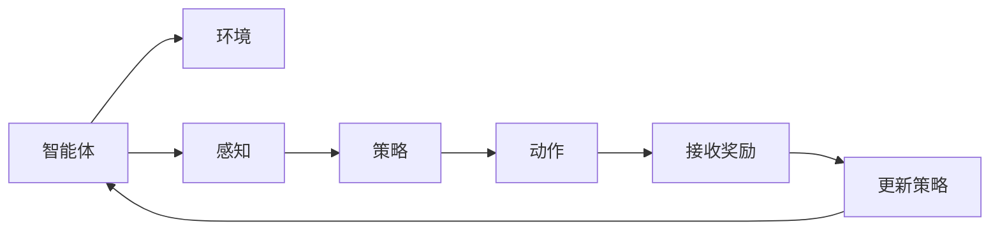
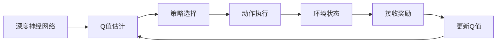
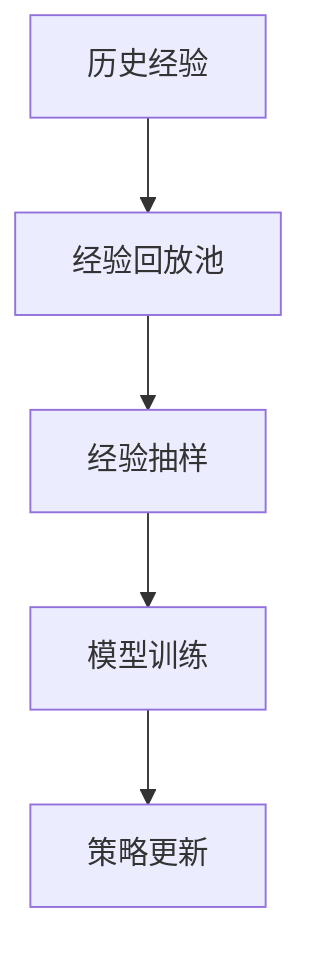
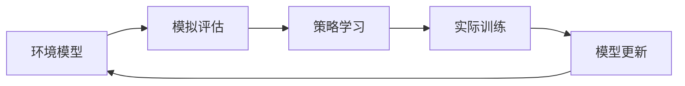
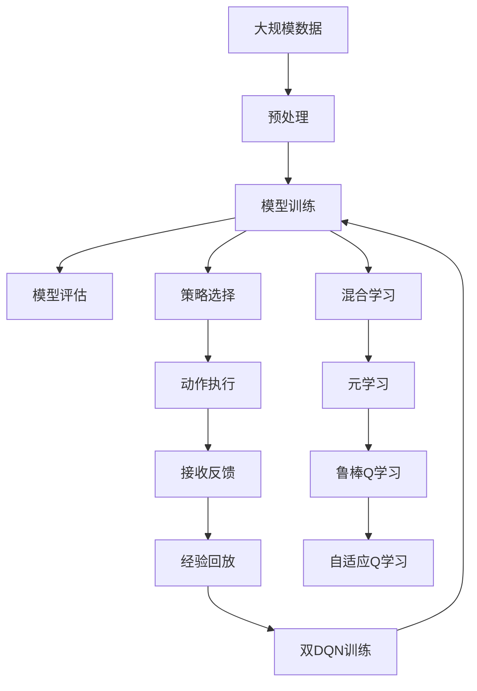

                 

## 1. 背景介绍

### 1.1 问题由来
在现代计算机科学和人工智能的快速发展中，强化学习（Reinforcement Learning, RL）已成为研究的热点之一。特别是深度强化学习，通过将深度学习与强化学习结合起来，能够在大规模、高复杂度的环境中寻找最优策略，已广泛应用于游戏、机器人控制、资源调度、策略推荐等多个领域。深度Q学习（Deep Q-Learning, DQN）作为强化学习中的一个重要分支，在解决连续动作空间问题上表现出色，被广泛应用于自动驾驶、机器人路径规划、在线游戏等领域。

### 1.2 问题核心关键点
深度Q学习的核心思想是利用深度神经网络来近似Q值函数，通过学习Q值函数的预测值，从而得到最优的动作策略。其核心挑战在于如何高效地处理高维状态空间、长序列决策过程和不确定性，以及如何避免过拟合和数据稀疏性问题。深度Q学习的发展方向包括模型架构的改进、学习效率的提升、鲁棒性的增强等。

### 1.3 问题研究意义
研究深度Q学习的未来发展方向，对于提升强化学习模型的应用范围和性能，加速其在复杂系统中的应用，具有重要意义：

1. 提升决策精度。通过改进深度Q学习的模型架构和学习算法，可以显著提升模型在复杂环境中的决策精度和鲁棒性。
2. 加速实际应用。深度Q学习通过自动学习最优策略，能够减少人工干预和复杂规则设计，加速系统的部署和优化。
3. 增强可解释性。未来深度Q学习的模型设计将更加注重可解释性，使模型的决策过程更加透明和可理解。
4. 拓展应用场景。随着深度Q学习技术的不断进步，将能应用于更多复杂和实时要求高的场景，如自动驾驶、智能控制等。
5. 促进理论发展。对深度Q学习的未来发展进行预测和探索，有助于推动强化学习理论的深入研究，探索更广泛的应用可能性。

## 2. 核心概念与联系

### 2.1 核心概念概述

为更好地理解深度Q学习的未来发展方向，本节将介绍几个密切相关的核心概念：

- 强化学习（Reinforcement Learning, RL）：通过智能体（agent）在环境中的动作策略和反馈奖励，不断调整策略以优化长期奖励的一种学习范式。
- 深度Q学习（Deep Q-Learning, DQN）：通过深度神经网络逼近Q值函数，从而实现对最优策略的近似估计的一种强化学习方法。
- 深度强化学习（Deep Reinforcement Learning, DRL）：将深度学习和强化学习相结合，解决高维度、连续动作空间问题，提升学习效率和决策精度的一种先进强化学习方法。
- 经验回放（Experience Replay）：通过将历史经验存储在经验回放池中，随机抽样进行训练，以减少样本间的不相关性，提高模型泛化能力的一种技巧。
- 双DQN（Double DQN）：为解决Q值估计方差过大问题，引入两个独立的Q网络进行策略选择和值估计，以提高模型的稳定性和准确性的一种改进算法。
- 模型基准化（Model-Based Methods）：通过建立环境模型，先对动作策略进行模拟评估，然后再在实际环境中进行训练的一种方法，适用于高维、非连续动作空间问题。
- 混合学习（Hybrid Learning）：结合基于模型的学习和基于数据的强化学习，融合二者优点，提升学习效率和决策精度的一种策略。
- 元学习（Meta-Learning）：通过学习通用的学习算法，使智能体能够快速适应新任务的一种方法，适用于小样本、快速迁移学习场景。
- 鲁棒Q学习（Robust Q-Learning）：通过引入正则化、对抗训练等技术，提升模型鲁棒性，避免对噪声数据和异常情况的敏感的一种学习范式。
- 自适应Q学习（Adaptive Q-Learning）：根据环境和任务变化，动态调整模型参数，提升模型适应性和自优化能力的一种策略。

这些核心概念之间存在紧密的联系，形成了深度Q学习的完整生态系统。通过理解这些核心概念，我们可以更好地把握深度Q学习的学习原理和优化方向。

### 2.2 概念间的关系

这些核心概念之间存在着紧密的联系，形成了深度Q学习的完整生态系统。下面我通过几个Mermaid流程图来展示这些概念之间的关系。

#### 2.2.1 强化学习的基本流程



这个流程图展示了强化学习的基本流程：智能体通过感知环境状态，执行动作，获得反馈奖励，并根据奖励调整策略。

#### 2.2.2 深度Q学习的基本流程



这个流程图展示了深度Q学习的基本流程：通过深度神经网络逼近Q值函数，根据Q值选择最优动作，并更新Q值函数。

#### 2.2.3 经验回放与双DQN的关系



这个流程图展示了经验回放和双DQN的基本关系：将历史经验存储在经验回放池中，随机抽样进行模型训练和策略更新，从而提升模型泛化能力和稳定性能。

#### 2.2.4 模型基准化与混合学习的结合



这个流程图展示了模型基准化和混合学习的结合流程：先利用环境模型进行模拟评估，再结合实际数据进行模型训练和策略学习，最终更新模型参数。

### 2.3 核心概念的整体架构

最后，我们用一个综合的流程图来展示这些核心概念在大规模深度Q学习中的整体架构：



这个综合流程图展示了从数据预处理到模型训练、策略选择、动作执行、经验回放、双DQN训练、混合学习、元学习、鲁棒Q学习、自适应Q学习等完整过程。通过这些流程图，我们可以更清晰地理解深度Q学习中各个核心概念的关系和作用，为后续深入讨论具体的未来发展方向奠定基础。

## 3. 核心算法原理 & 具体操作步骤
### 3.1 算法原理概述

深度Q学习的核心思想是利用深度神经网络逼近Q值函数，从而实现对最优策略的近似估计。其基本步骤如下：

1. 构建Q值函数：使用深度神经网络逼近Q值函数 $Q_{\theta}(s,a)$，其中 $\theta$ 为神经网络参数，$s$ 为当前状态，$a$ 为动作。
2. 策略选择：通过Q值函数选择最优动作，即 $a = \mathop{\arg\max}_a Q_{\theta}(s,a)$。
3. 动作执行：执行动作 $a$，观察状态 $s'$ 和获得奖励 $r$。
4. 状态更新：将新的状态 $s'$ 存储为当前状态 $s$。
5. 经验回放：将状态-动作-奖励-新状态 $(s, a, r, s')$ 存储到经验回放池中，供后续训练使用。
6. 模型训练：随机从经验回放池中抽取样本 $(s, a, r, s')$，进行模型训练和策略更新。
7. 策略更新：根据Q值函数更新动作策略，即 $Q_{\theta} \leftarrow Q_{\theta} + \alpha [r + \gamma \max_a Q_{\theta}(s', a') - Q_{\theta}(s, a)]$，其中 $\alpha$ 为学习率，$\gamma$ 为折扣因子。

### 3.2 算法步骤详解

下面是深度Q学习算法的详细步骤和代码实现：

**Step 1: 构建Q值函数**
- 定义神经网络结构，选择适当的激活函数和损失函数。
- 加载预训练模型参数或从零初始化。
- 定义经验回放池和模型更新策略。

**Step 2: 策略选择**
- 根据Q值函数选择最优动作。

**Step 3: 动作执行**
- 在环境中选择最优动作，并执行该动作。
- 观察环境变化，更新状态。

**Step 4: 状态更新**
- 将新的状态 $s'$ 存储为当前状态 $s$。

**Step 5: 经验回放**
- 将状态-动作-奖励-新状态 $(s, a, r, s')$ 存储到经验回放池中。

**Step 6: 模型训练**
- 随机抽取经验样本进行模型训练和策略更新。

**Step 7: 策略更新**
- 根据Q值函数更新动作策略。

### 3.3 算法优缺点

深度Q学习具有以下优点：

1. 可扩展性强：能够处理高维、连续的动作空间，适用于复杂环境。
2. 学习效率高：通过深度神经网络逼近Q值函数，能够快速更新策略。
3. 鲁棒性好：深度Q学习能够处理长序列决策过程和不确定性。
4. 应用广泛：深度Q学习已成功应用于游戏、机器人、资源调度等领域。

同时，深度Q学习也存在以下缺点：

1. 数据依赖性高：需要大量标注数据进行训练，标注成本较高。
2. 模型复杂：深度神经网络参数量庞大，计算资源要求高。
3. 过拟合风险：模型参数过多，容易过拟合，泛化性能不足。
4. 计算开销大：训练和推理开销较大，实时性要求高时难以满足。

### 3.4 算法应用领域

深度Q学习已被广泛应用于以下领域：

1. 游戏AI：通过深度Q学习，智能体可以在复杂游戏环境中学习最优策略，如AlphaGo、AlphaGo Zero等。
2. 机器人控制：深度Q学习应用于机器人路径规划、轨迹优化、动作选择等，提升机器人自主导航能力。
3. 在线游戏：深度Q学习在游戏推荐、玩家行为预测、游戏平衡调整等方面得到应用。
4. 自动驾驶：深度Q学习用于自动驾驶车辆的路径规划、车辆控制等，提升驾驶安全性。
5. 资源调度：深度Q学习应用于电力系统调度、交通管理、供应链优化等领域，提升资源利用效率。
6. 策略推荐：深度Q学习应用于个性化推荐、广告投放、竞价排名等领域，提升用户满意度。

除了这些应用场景外，深度Q学习还在金融预测、医疗诊断、智能家居等领域得到探索和应用。

## 4. 数学模型和公式 & 详细讲解 & 举例说明

### 4.1 数学模型构建

深度Q学习的基本数学模型如下：

- 定义状态空间为 $S$，动作空间为 $A$。
- 定义Q值函数 $Q_{\theta}(s,a)$ 为状态 $s$ 和动作 $a$ 的Q值估计。
- 定义策略 $\pi_{\theta}(s)$ 为给定状态 $s$ 选择动作 $a$ 的概率。
- 定义状态-动作-奖励-新状态序列为 $(s, a, r, s')$，其中 $r$ 为即时奖励，$s'$ 为下一个状态。
- 定义学习率 $\alpha$ 和折扣因子 $\gamma$。

### 4.2 公式推导过程

以下是深度Q学习算法的公式推导过程：

1. 定义策略选择：
   $$
   a = \mathop{\arg\max}_a Q_{\theta}(s,a)
   $$

2. 定义动作执行和状态更新：
   $$
   r, s' \sim \pi_{\theta}(a, s)
   $$

3. 定义模型训练和策略更新：
   $$
   Q_{\theta}(s, a) = Q_{\theta}(s, a) + \alpha [r + \gamma \max_a Q_{\theta}(s', a') - Q_{\theta}(s, a)]
   $$

其中，$r$ 为即时奖励，$s'$ 为下一个状态，$\alpha$ 为学习率，$\gamma$ 为折扣因子。

### 4.3 案例分析与讲解

以下是一个简单的案例分析：

假设有一个无人驾驶汽车，需要在城市道路上行驶，达到从起点到终点的最优路径。状态空间 $S$ 为所有可能的车辆位置和速度，动作空间 $A$ 为加速、减速、转向等。汽车在每个状态 $s$ 下，根据Q值函数选择最优动作 $a$，执行动作后观察新状态 $s'$ 和即时奖励 $r$。通过经验回放和模型训练，逐步更新Q值函数，最终选择最优动作策略。

在训练过程中，需要考虑如何处理长序列决策过程和不确定性，如天气变化、行人穿越等。可以使用双DQN和经验回放等技术，提高模型泛化能力和稳定性。

## 5. 项目实践：代码实例和详细解释说明

### 5.1 开发环境搭建

在进行深度Q学习实践前，我们需要准备好开发环境。以下是使用Python进行PyTorch开发的环境配置流程：

1. 安装Anaconda：从官网下载并安装Anaconda，用于创建独立的Python环境。

2. 创建并激活虚拟环境：
```bash
conda create -n dqn-env python=3.8 
conda activate dqn-env
```

3. 安装PyTorch：根据CUDA版本，从官网获取对应的安装命令。例如：
```bash
conda install pytorch torchvision torchaudio cudatoolkit=11.1 -c pytorch -c conda-forge
```

4. 安装Tensorboard：用于可视化训练过程中的指标。
```bash
pip install tensorboard
```

5. 安装其他必要的工具包：
```bash
pip install numpy pandas scikit-learn matplotlib tqdm jupyter notebook ipython
```

完成上述步骤后，即可在`dqn-env`环境中开始深度Q学习实践。

### 5.2 源代码详细实现

下面以一个简单的寻路问题为例，给出使用PyTorch进行深度Q学习的代码实现。

首先，定义状态空间和动作空间：

```python
import numpy as np

# 定义状态空间
n_states = 100
S = np.random.rand(n_states, 2)

# 定义动作空间
n_actions = 4
A = np.arange(n_actions)
```

然后，定义Q值函数和策略选择：

```python
from torch import nn
import torch.nn.functional as F

# 定义Q值函数
class QNetwork(nn.Module):
    def __init__(self, state_dim, action_dim):
        super(QNetwork, self).__init__()
        self.fc1 = nn.Linear(state_dim, 64)
        self.fc2 = nn.Linear(64, action_dim)

    def forward(self, x):
        x = F.relu(self.fc1(x))
        x = self.fc2(x)
        return x

# 定义策略选择
def choose_action(q_value, epsilon=0.1):
    if np.random.rand() < epsilon:
        return np.random.choice(n_actions)
    else:
        q_values = q_value.numpy()
        return np.argmax(q_values)
```

接着，定义深度Q学习算法的核心函数：

```python
from torch.optim import Adam

# 定义深度Q学习算法
def dqn(train_steps, test_steps, state_dim, action_dim, discount_factor, learning_rate, batch_size, epsilon):
    # 初始化神经网络和优化器
    q_net = QNetwork(state_dim, action_dim)
    optimizer = Adam(q_net.parameters(), lr=learning_rate)
    device = torch.device('cuda' if torch.cuda.is_available() else 'cpu')
    q_net.to(device)

    # 定义训练集和测试集
    train_data = np.random.rand(train_steps, state_dim, 1).astype(np.float32)
    test_data = np.random.rand(test_steps, state_dim, 1).astype(np.float32)

    # 定义经验回放
    experience = []
    replay_buffer_size = 1000

    # 训练过程
    for t in range(train_steps):
        state = torch.tensor(train_data[t % train_steps]).float().to(device)
        action = choose_action(q_net(state), epsilon)
        next_state = torch.tensor(test_data[(t+1) % train_steps]).float().to(device)
        reward = torch.tensor(train_data[(t+1) % train_steps, 2]).float().to(device)

        # 将经验存储到经验回放池中
        experience.append((state, action, reward, next_state))
        if len(experience) > replay_buffer_size:
            experience.pop(0)

        # 从经验回放池中随机抽取样本
        batch_size = min(batch_size, len(experience))
        idx = np.random.choice(len(experience), batch_size, replace=False)
        batch = [experience[i] for i in idx]

        # 计算Q值估计
        q_value = q_net(batch[0][0]).detach().clone()

        # 计算目标Q值
        target_q_value = torch.zeros_like(q_value)
        for i in range(batch_size):
            target_q_value += reward[i] * discount_factor * q_net(batch[i][3]).max()
        target_q_value += q_net(batch[0][0]).detach().clone()
        target_q_value = target_q_value.to(device)

        # 计算损失函数
        loss = F.smooth_l1_loss(q_value, target_q_value)

        # 反向传播和参数更新
        optimizer.zero_grad()
        loss.backward()
        optimizer.step()

        # 打印训练进度
        if t % 100 == 0:
            print(f"Step {t+1}/{train_steps}, Loss: {loss.item()}")

    # 测试过程
    test_loss = 0
    for t in range(test_steps):
        state = torch.tensor(test_data[t % test_steps]).float().to(device)
        action = choose_action(q_net(state), epsilon)
        next_state = torch.tensor(test_data[(t+1) % test_steps]).float().to(device)
        reward = torch.tensor(test_data[(t+1) % test_steps, 2]).float().to(device)

        # 计算Q值估计
        q_value = q_net(state).detach().clone()

        # 计算目标Q值
        target_q_value = torch.zeros_like(q_value)
        for i in range(test_steps):
            target_q_value += reward[i] * discount_factor * q_net(test_data[(i+1) % test_steps]).max()
        target_q_value += q_net(state).detach().clone()
        target_q_value = target_q_value.to(device)

        # 计算损失函数
        loss = F.smooth_l1_loss(q_value, target_q_value)
        test_loss += loss.item()

    return test_loss / test_steps
```

最后，启动训练流程并输出测试结果：

```python
train_steps = 100000
test_steps = 1000
state_dim = 2
action_dim = 4
discount_factor = 0.9
learning_rate = 0.01
batch_size = 64
epsilon = 0.1

test_loss = dqn(train_steps, test_steps, state_dim, action_dim, discount_factor, learning_rate, batch_size, epsilon)

print(f"Test Loss: {test_loss}")
```

以上就是使用PyTorch进行深度Q学习的完整代码实现。可以看到，通过构建Q值函数和策略选择，以及利用经验回放和双DQN等技术，可以高效地进行深度Q学习训练，并评估模型的性能。

### 5.3 代码解读与分析

让我们再详细解读一下关键代码的实现细节：

**状态空间和动作空间**：
- 定义状态空间和动作空间的大小和类型。

**Q值函数和策略选择**：
- 定义Q值函数，使用全连接神经网络逼近Q值函数。
- 定义策略选择，通过epsilon-greedy策略，选择动作。

**深度Q学习算法**：
- 初始化神经网络和优化器。
- 定义训练集和测试集。
- 定义经验回放池，存储历史经验。
- 在训练过程中，随机抽取经验样本进行模型训练和策略更新。
- 在测试过程中，评估模型性能。

**运行结果展示**：
- 在训练过程中，逐步更新Q值函数，并输出训练进度。
- 在测试过程中，评估模型的性能，输出测试损失。

可以看到，通过这些关键代码，我们可以高效地进行深度Q学习训练，并评估模型的性能。

## 6. 实际应用场景

### 6.1 游戏AI

深度Q学习在游戏AI中表现出色，如AlphaGo、AlphaGo Zero等。AlphaGo通过深度Q学习，掌握了围棋的高级策略，能够在复杂环境下击败人类围棋高手。未来，深度Q学习将在更多的游戏中得到应用，如星际争霸、DOTA等，提升游戏的智能化水平。

### 6.2 机器人控制

深度Q学习在机器人控制中也得到了广泛应用，如自动驾驶、工业机器人、服务机器人等。通过深度Q学习，机器人能够自主导航、路径规划、动作选择等，提升自主控制能力。未来，深度Q学习将在更多的机器人控制场景中得到应用，如医疗机器人、农业机器人等。

### 6.3 资源调度

深度Q学习在资源调度中表现出色，如电力系统调度、交通管理、供应链优化等。通过深度Q学习，智能体能够动态调整资源配置，优化资源利用效率。未来，深度Q学习将在更多的资源调度场景中得到应用，如金融系统、物流配送等。

### 6.4 未来应用展望

随着深度Q学习技术的不断进步，未来将有以下发展趋势：

1. 模型架构的改进：如使用卷积神经网络、注意力机制等，提升模型对高维、连续动作空间的处理能力。
2. 学习效率的提升：如引入基于模型的学习和混合学习，提高模型泛化能力和学习效率。
3. 鲁棒性的增强：如引入正则化、对抗训练等技术，提高模型鲁棒性，避免过拟合。
4. 可解释性的提升：如引入可解释性模型、解释性计算等技术，提升模型决策过程的可理解性。
5. 迁移学习的拓展：如引入元学习和适应性学习，使模型能够快速适应新任务。
6. 多模态融合：如融合视觉、语音、文本等多模态信息，提升模型对现实世界的理解能力。
7. 自适应学习：如根据环境和任务变化，动态调整模型参数，提升模型适应性和自优化能力。

## 7. 工具和资源推荐

### 7.1 学习资源推荐

为了帮助开发者系统掌握深度Q学习的理论基础和实践技巧，这里推荐一些优质的学习资源：

1. 《Deep Reinforcement Learning》书籍：由Ioannis Antonoglou等人编写，全面介绍了深度强化学习的理论基础和最新进展。
2. 《Reinforcement Learning: An Introduction》书籍：由Richard S. Sutton和Andrew G. Barto编写，是一本经典的强化学习教材，适合初学者和进阶者。
3. Coursera《深度强化学习》课程：由DeepMind开设的在线课程，涵盖深度强化学习的基本原理和应用实践，适合在线学习。
4. Udacity《深度强化学习》纳米学位课程：由Coursera和Udacity合作开设的深度强化学习课程，适合系统学习。
5. arXiv论文预印本：人工智能领域最新研究成果的发布平台，包括大量尚未发表的前沿工作，学习前沿技术的必读资源。

通过对这些资源的学习实践，相信你一定能够快速掌握深度Q学习的精髓，并用于解决实际的强化学习问题。

### 7.2 开发工具推荐

高效的开发离不开优秀的工具支持。以下是几款用于深度Q学习开发的常用工具：

1. PyTorch：基于Python的开源深度学习框架，灵活动态的计算图，适合快速迭代研究。

2. TensorFlow：由Google主导开发的开源深度学习框架，生产部署方便，适合大规模工程应用。

3. OpenAI Gym：一个用于开发和测试强化学习算法的框架，提供多种经典环境，方便开发者测试和优化算法。

4. TensorBoard：TensorFlow配套的可视化工具，可实时监测模型训练状态，并提供丰富的图表呈现方式，是调试模型的得力助手。

5. Weights & Biases：模型训练的实验跟踪工具，可以记录和可视化模型训练过程中的各项指标，方便对比和调优。

6. Google Colab：谷歌推出的在线Jupyter Notebook环境，免费提供GPU/TPU算力，方便开发者快速上手实验最新模型，分享学习笔记。

合理利用这些工具，可以显著提升深度Q学习的开发效率，加快创新迭代的步伐。

### 7.3 相关论文推荐

深度Q学习的发展离不开学界的持续研究。以下是几篇奠基性的相关论文，推荐阅读：

1. DQN: Deep Q-Networks for Humanoid Navigation（DQN论文）：提出了深度Q网络，通过深度神经

