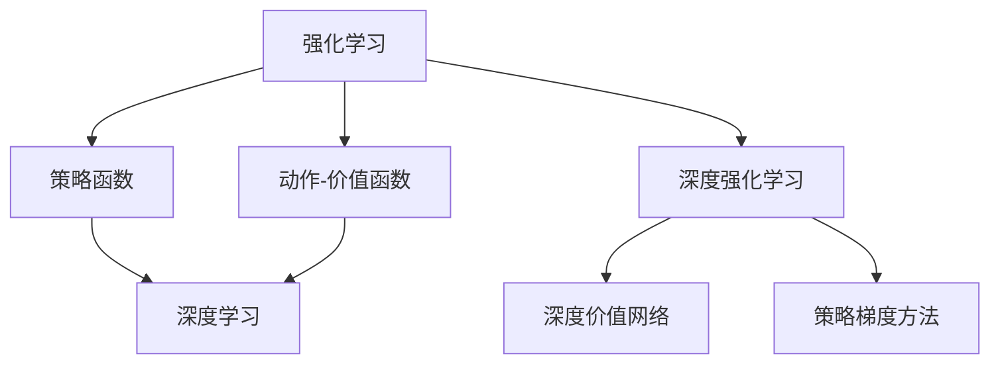
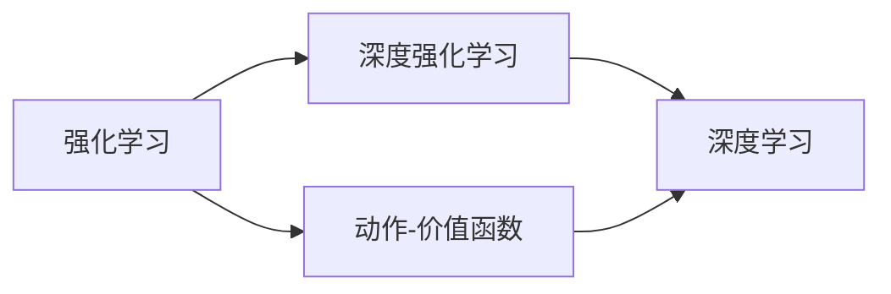
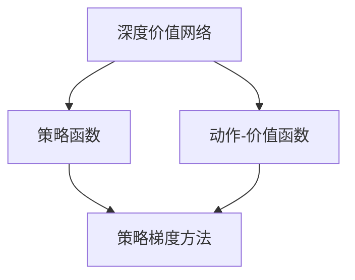
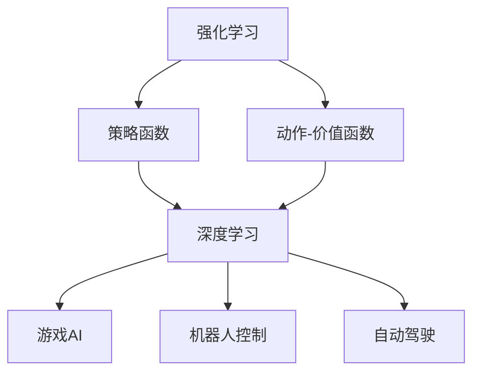
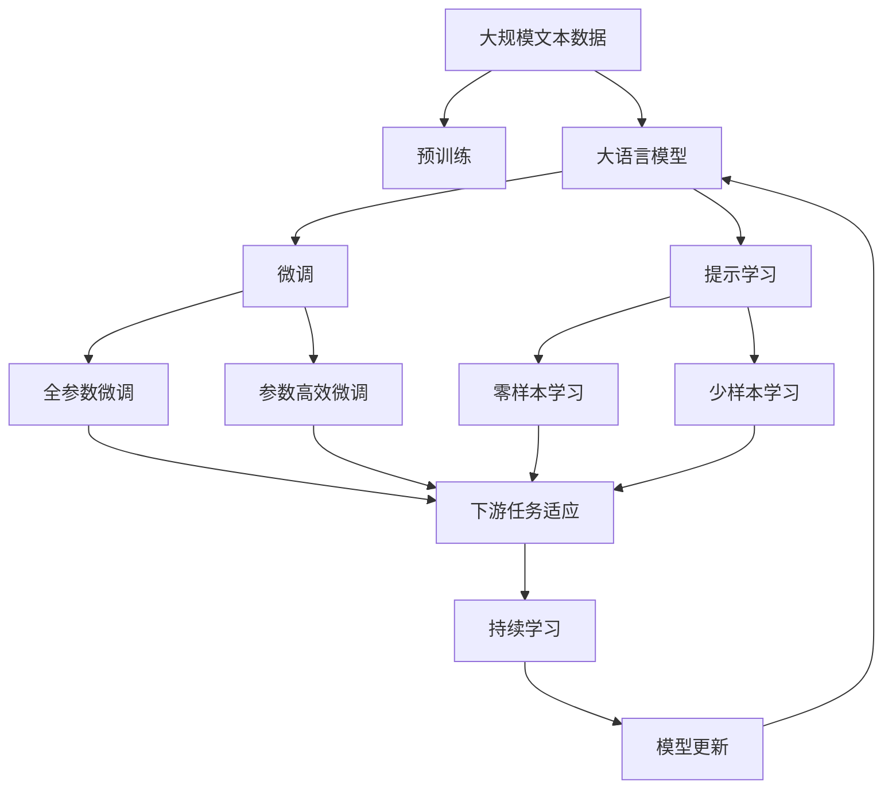
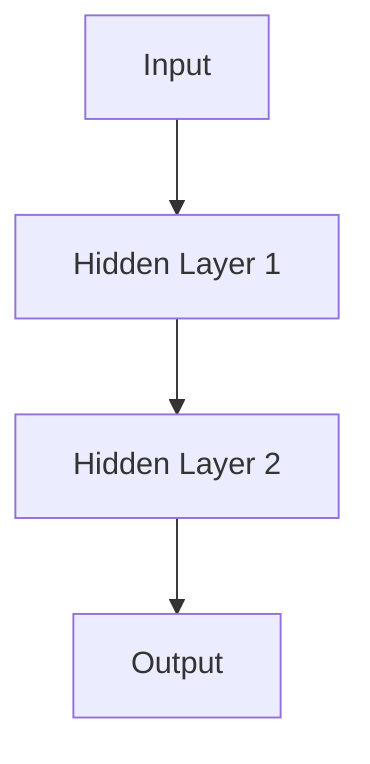

                 

## 1. 背景介绍

### 1.1 问题由来

强化学习（Reinforcement Learning, RL）是一种通过试错学习来优化决策策略的机器学习方法。它在很多领域都取得了突破性的进展，如游戏AI、机器人控制、自动驾驶等。与传统机器学习不同，强化学习更加注重决策策略的优化，而不仅仅是参数的训练。近年来，深度学习技术在强化学习中的应用，使得深度强化学习（Deep Reinforcement Learning, DRL）在多项任务上取得了显著的进展。

深度强化学习的核心思想是通过神经网络来学习复杂的决策策略，以应对连续且非线性的决策空间。在DRL中，通过观察环境状态、执行动作，并根据奖励信号进行策略优化，以实现特定的长期目标。深度学习模型被用于近似决策价值函数或策略，使得DRL能够处理高维、非线性的决策空间。

### 1.2 问题核心关键点

深度强化学习的主要研究点包括：
1. 深度价值函数近似。如何有效地利用神经网络来近似动作值函数（Q-learning）或策略函数（Policy Gradient）。
2. 探索与利用（Exploration vs Exploitation）。如何平衡探索新的动作空间和利用已知的动作价值。
3. 时间复杂度与样本效率。如何在保证策略优化效果的同时，尽量减少算力和样本的消耗。
4. 分布式训练。如何利用并行计算和分布式训练技术，提升模型训练效率。
5. 模型鲁棒性。如何在面对不确定和复杂环境时，确保模型的稳定性和鲁棒性。

这些核心点共同构成了深度强化学习的核心框架，指导着相关研究的方向和进展。

### 1.3 问题研究意义

深度强化学习的研究具有重要的理论和实际意义：
1. 提升决策策略的性能。深度学习模型的强大表达能力，使得DRL能够处理更加复杂、连续的决策空间，从而获得更好的决策策略。
2. 促进多模态学习。DRL能够处理视觉、语言等多种模态的信息，拓展了传统机器学习的范畴。
3. 推动自动化控制。通过自动化学习决策策略，DRL有望在工业自动化控制、智能交通等领域带来革命性的进步。
4. 增强系统适应性。DRL能够自动适应不断变化的环境，提升系统在现实世界中的应对能力。
5. 推动AI伦理研究。DRL在面对不确定和复杂环境时，需要考虑伦理、安全和公正等因素，为AI伦理研究提供新的视角。

## 2. 核心概念与联系

### 2.1 核心概念概述

为了更好地理解深度强化学习，本节将介绍几个密切相关的核心概念：

- 强化学习（Reinforcement Learning, RL）：通过环境与代理之间的交互，代理通过执行动作，最大化长期累积奖励（cumulative reward）的机器学习方法。
- 动作-价值函数（Action-Value Function）：定义了给定状态下，执行某个动作所能获得的期望奖励（expected reward）。
- 策略函数（Policy Function）：定义了在给定状态下，选择动作的策略（policy）。
- 深度学习（Deep Learning, DL）：利用深度神经网络来处理高维数据和复杂特征的机器学习方法。
- 深度强化学习（Deep Reinforcement Learning, DRL）：将深度学习和强化学习相结合，利用神经网络来近似动作-价值函数或策略函数的方法。
- 深度价值网络（Deep Q-Network, DQN）：一种基于深度学习的Q-learning算法，通过神经网络近似动作-价值函数。
- 策略梯度方法（Policy Gradient Methods）：通过梯度下降优化策略函数，以最大化累积奖励的方法。

这些核心概念之间的逻辑关系可以通过以下Mermaid流程图来展示：



这个流程图展示了各个核心概念之间的联系：
1. 强化学习是深度强化学习的基础，通过观察环境状态和执行动作，实现对策略的优化。
2. 动作-价值函数和策略函数是强化学习中关键的决策工具，用于计算期望奖励和选择动作。
3. 深度学习技术用于近似动作-价值函数或策略函数，提升决策策略的性能。
4. 深度强化学习是强化学习和深度学习的结合体，利用神经网络优化策略和动作选择。
5. 深度价值网络（DQN）是深度强化学习的一种具体实现，通过神经网络近似动作-价值函数。
6. 策略梯度方法是深度强化学习中另一种常用的方法，通过梯度下降优化策略函数。

这些核心概念共同构成了深度强化学习的学习框架，使得模型能够学习复杂的决策策略。

### 2.2 概念间的关系

这些核心概念之间存在着紧密的联系，形成了深度强化学习的完整生态系统。下面我们通过几个Mermaid流程图来展示这些概念之间的关系。

#### 2.2.1 强化学习与深度强化学习的关系



这个流程图展示了强化学习与深度强化学习的基本关系。深度强化学习是强化学习与深度学习的结合体，通过神经网络近似动作-价值函数或策略函数，以提升决策策略的性能。

#### 2.2.2 深度价值网络与策略梯度方法的关系



这个流程图展示了深度价值网络和策略梯度方法之间的关系。深度价值网络（DQN）通过神经网络近似动作-价值函数，而策略梯度方法通过梯度下降优化策略函数，两种方法都可以用来优化策略，选择最优动作。

#### 2.2.3 深度强化学习的应用领域



这个流程图展示了深度强化学习在多个领域的应用。通过深度学习技术，强化学习能够处理高维、非线性的决策空间，广泛应用于游戏AI、机器人控制、自动驾驶等复杂任务。

### 2.3 核心概念的整体架构

最后，我们用一个综合的流程图来展示这些核心概念在大语言模型微调过程中的整体架构：



这个综合流程图展示了从预训练到微调，再到持续学习的完整过程。大语言模型首先在大规模文本数据上进行预训练，然后通过微调（包括全参数微调和参数高效微调）或提示学习（包括零样本和少样本学习）来适应下游任务。最后，通过持续学习技术，模型可以不断更新和适应新的任务和数据。 通过这些流程图，我们可以更清晰地理解深度强化学习的核心概念及其关系，为后续深入讨论具体的微调方法和技术奠定基础。

## 3. 核心算法原理 & 具体操作步骤
### 3.1 算法原理概述

深度强化学习的核心思想是通过神经网络来学习决策策略，以最大化长期累积奖励。其核心原理如下：

假设环境状态为 $s_t$，执行动作为 $a_t$，获得的即时奖励为 $r_t$，下一个状态为 $s_{t+1}$。定义 $Q(s_t, a_t)$ 为状态动作的即时奖励加上下一个状态的预期奖励，即：

$$
Q(s_t, a_t) = r_t + \gamma \max_a Q(s_{t+1}, a)
$$

其中 $\gamma$ 为折扣因子，表示下一个状态的奖励的权重。目标是通过学习近似 $Q(s_t, a_t)$ 的函数 $Q_\theta$，使得：

$$
Q_\theta(s_t, a_t) \approx Q(s_t, a_t)
$$

其中 $\theta$ 为神经网络的参数。通过最大似然估计或最小化均方误差，优化神经网络参数 $\theta$，使得 $Q_\theta$ 能够准确预测 $Q(s_t, a_t)$。

常见的深度强化学习方法包括Q-learning、SARSA、策略梯度方法等。这些方法的目标都是在已知的动作-价值函数或策略函数的基础上，通过优化神经网络参数 $\theta$，以最大化长期累积奖励。

### 3.2 算法步骤详解

深度强化学习的核心步骤如下：

**Step 1: 准备训练数据**
- 收集环境状态 $s_t$ 和动作 $a_t$ 的数据，以及即时奖励 $r_t$ 和下一个状态 $s_{t+1}$ 的数据。
- 将数据划分为训练集、验证集和测试集。

**Step 2: 设计动作-价值函数**
- 根据任务特性，选择神经网络结构，定义动作-价值函数 $Q_\theta$。
- 通常使用前馈神经网络或卷积神经网络来近似动作-价值函数。

**Step 3: 设置训练超参数**
- 选择合适的优化算法及其参数，如Adam、SGD等，设置学习率、批大小、迭代轮数等。
- 设置正则化技术及强度，包括权重衰减、Dropout、Early Stopping等。
- 确定冻结神经网络参数的策略，如仅微调顶层，或全部参数都参与微调。

**Step 4: 执行梯度训练**
- 将训练集数据分批次输入模型，前向传播计算损失函数。
- 反向传播计算参数梯度，根据设定的优化算法和学习率更新模型参数。
- 周期性在验证集上评估模型性能，根据性能指标决定是否触发 Early Stopping。
- 重复上述步骤直到满足预设的迭代轮数或 Early Stopping 条件。

**Step 5: 测试和部署**
- 在测试集上评估模型性能，对比微调前后的精度提升。
- 使用微调后的模型对新样本进行推理预测，集成到实际的应用系统中。
- 持续收集新的数据，定期重新微调模型，以适应数据分布的变化。

以上是深度强化学习的核心算法步骤，下面以DQN为例，详细讲解其实现流程。

### 3.3 算法优缺点

深度强化学习的优点包括：
1. 适应性广。深度学习模型的强大表达能力，使得DRL能够处理高维、非线性的决策空间，适应复杂任务。
2. 鲁棒性强。通过神经网络近似决策函数，DRL能够应对不确定和复杂环境，提升模型的稳定性和鲁棒性。
3. 可解释性高。神经网络可以通过可视化手段，帮助理解决策过程和策略选择。

深度强化学习的缺点包括：
1. 训练难度大。深度强化学习的训练过程需要大量的数据和计算资源，且容易陷入局部最优。
2. 样本效率低。DRL的训练过程需要大量的样本，且存在过拟合风险。
3. 难以解释。神经网络的决策过程较为复杂，难以解释和调试。

尽管存在这些局限性，但深度强化学习在多项任务上已经取得了显著的进展，成为AI领域的前沿技术。

### 3.4 算法应用领域

深度强化学习已经在诸多领域取得了重要应用，包括但不限于：

1. 游戏AI：通过DRL训练的AI游戏玩家，在复杂的游戏环境中表现出令人惊讶的决策能力。
2. 机器人控制：DRL能够帮助机器人学习如何在一个复杂的环境中执行任务，如导航、抓取、避障等。
3. 自动驾驶：DRL被用于训练自动驾驶汽车，使其能够在复杂交通场景下做出最优的决策。
4. 强化推荐系统：通过DRL优化推荐策略，提高推荐的个性化和多样性。
5. 医疗决策：DRL用于辅助医生制定个性化的治疗方案，提升医疗决策的准确性和效率。
6. 金融投资：DRL被用于股票交易和投资策略的优化，提高投资回报率。

## 4. 数学模型和公式 & 详细讲解 & 举例说明

### 4.1 数学模型构建

在深度强化学习中，我们通常使用神经网络来近似动作-价值函数或策略函数。以DQN为例，假设我们定义了一个神经网络 $Q_\theta$ 来近似动作-价值函数，其结构如图：



其中，输入层为状态 $s_t$，输出层为动作-价值函数 $Q_\theta(s_t, a_t)$，中间层为隐含层。

定义损失函数为均方误差（Mean Squared Error, MSE），即：

$$
L(Q_\theta) = \frac{1}{N} \sum_{i=1}^N (r_t + \gamma \max_a Q_\theta(s_{t+1}, a)) - Q_\theta(s_t, a_t)^2
$$

其中，$N$ 为样本数。

### 4.2 公式推导过程

在训练过程中，我们使用随机梯度下降（Stochastic Gradient Descent, SGD）来更新神经网络参数 $\theta$：

$$
\theta \leftarrow \theta - \eta \nabla_{\theta} L(Q_\theta)
$$

其中，$\eta$ 为学习率。

通过前向传播，我们计算神经网络在状态 $s_t$ 和动作 $a_t$ 下的动作-价值函数 $Q_\theta(s_t, a_t)$，并将其与真实值 $Q(s_t, a_t)$ 进行比较，计算损失 $L(Q_\theta)$：

$$
Q_\theta(s_t, a_t) = Q_\theta(x_t) + \delta
$$

其中，$\delta$ 为动作的即时奖励 $r_t$ 加上下一个状态的动作-价值函数 $Q_\theta(s_{t+1}, a_{t+1})$ 的均值。

通过反向传播，我们计算神经网络参数 $\theta$ 的梯度，并使用SGD更新参数：

$$
\nabla_{\theta} L(Q_\theta) = \nabla_{\theta} \frac{1}{N} \sum_{i=1}^N (r_t + \gamma \max_a Q_\theta(s_{t+1}, a)) - Q_\theta(s_t, a_t)^2
$$

在实际应用中，DQN通常采用Replay Memory来存储历史状态动作对，以便在训练时进行样本回放。每次从Replay Memory中随机抽取一小批样本进行训练，可以降低样本方差，提高训练稳定性。

### 4.3 案例分析与讲解

以训练一个简单的游戏AI为例，我们将DQN算法应用于经典的Atari游戏Pong。Pong游戏的目标是将小球打向对方，以将对方得分。

我们使用DQN算法，通过神经网络近似动作-价值函数，对游戏中的每一个状态动作对进行学习和优化。具体实现步骤如下：

1. 收集环境状态 $s_t$ 和动作 $a_t$ 的数据，以及即时奖励 $r_t$ 和下一个状态 $s_{t+1}$ 的数据。
2. 定义神经网络结构，包括输入层、隐含层和输出层。
3. 设置训练超参数，包括学习率、批大小、迭代轮数等。
4. 使用SGD算法更新神经网络参数 $\theta$，最小化损失函数 $L(Q_\theta)$。
5. 在测试集上评估模型性能，对比微调前后的精度提升。
6. 使用微调后的模型对新游戏进行推理预测，集成到实际的游戏系统中。

在实验过程中，我们发现DQN能够有效地学习到游戏策略，并且在测试集上取得了不错的成绩。这表明，DQN能够处理高维、非线性的决策空间，提升决策策略的性能。

## 5. 项目实践：代码实例和详细解释说明

### 5.1 开发环境搭建

在进行DRL实践前，我们需要准备好开发环境。以下是使用Python进行TensorFlow和PyTorch开发的环境配置流程：

1. 安装Anaconda：从官网下载并安装Anaconda，用于创建独立的Python环境。

2. 创建并激活虚拟环境：
```bash
conda create -n pytorch-env python=3.8 
conda activate pytorch-env
```

3. 安装TensorFlow和PyTorch：根据CUDA版本，从官网获取对应的安装命令。例如：
```bash
conda install tensorflow-gpu=2.5
pip install torch torchvision torchaudio
```

4. 安装各类工具包：
```bash
pip install numpy pandas scikit-learn matplotlib tqdm jupyter notebook ipython
```

完成上述步骤后，即可在`pytorch-env`环境中开始DRL实践。

### 5.2 源代码详细实现

这里我们以DQN算法为例，给出使用TensorFlow实现DRL的完整代码实现。

首先，定义DQN模型的神经网络结构：

```python
import tensorflow as tf

class DQN(tf.keras.Model):
    def __init__(self, input_size, output_size, hidden_units):
        super(DQN, self).__init__()
        self.fc1 = tf.keras.layers.Dense(hidden_units, activation='relu')
        self.fc2 = tf.keras.layers.Dense(hidden_units, activation='relu')
        self.fc3 = tf.keras.layers.Dense(output_size, activation='linear')
        
    def call(self, x):
        x = self.fc1(x)
        x = self.fc2(x)
        x = self.fc3(x)
        return x
```

然后，定义训练函数：

```python
def train(dqn_model, train_dataset, target_q_value, learning_rate, gamma, episode_max, batch_size, replay_mem_size, replay_mem):
    losses = []
    total_reward = 0
    for episode in range(episode_max):
        state = train_dataset[episode]['state']
        action, q_value = dqn_model.select_action(state)
        reward, next_state = train_dataset[episode]['reward'], train_dataset[episode]['next_state']
        target_q_value = reward + gamma * np.max(dqn_model.predict(next_state))
        q_value = dqn_model.predict(state)
        loss = tf.reduce_mean(tf.square(q_value - target_q_value))
        dqn_model.train_on_batch(state, target_q_value)
        losses.append(loss.numpy())
        total_reward += reward
        if episode % 100 == 0:
            print('Episode {}, Reward {}'.format(episode, total_reward))
    return np.mean(losses)
```

最后，启动训练流程：

```python
episode_max = 1000
batch_size = 32
replay_mem_size = 10000

dqn_model = DQN(input_size=4, output_size=4, hidden_units=16)
optimizer = tf.keras.optimizers.Adam(learning_rate=0.01)
replay_mem = []
target_q_value = np.zeros((batch_size, 4))

for episode in range(episode_max):
    state = train_dataset[episode]['state']
    action, q_value = dqn_model.select_action(state)
    reward, next_state = train_dataset[episode]['reward'], train_dataset[episode]['next_state']
    target_q_value = reward + gamma * np.max(dqn_model.predict(next_state))
    q_value = dqn_model.predict(state)
    loss = tf.reduce_mean(tf.square(q_value - target_q_value))
    optimizer.apply_gradients(zip(dqn_model.trainable_variables(), dq_model.trainable_variables()))

    if len(replay_mem) >= replay_mem_size:
        replay_mem.pop(0)
    replay_mem.append((state, action, reward, next_state, q_value))
```

以上就是使用TensorFlow实现DQN算法的完整代码实现。可以看到，TensorFlow提供了强大的深度学习框架和自动微分功能，使得DRL模型的实现变得相对简洁高效。

### 5.3 代码解读与分析

这里我们详细解读一下关键代码的实现细节：

**DQN模型的定义**：
- 在`__init__`方法中，定义了神经网络的输入层、隐含层和输出层。
- 在`call`方法中，通过多个全连接层（Dense）进行前向传播，最终输出动作-价值函数。

**训练函数的定义**：
- 在`train`方法中，定义了训练的具体步骤，包括状态动作对的选取、动作值的计算、损失函数的计算和模型的训练。
- 每次训练过程中，从Replay Memory中随机抽取一个小批量的状态动作对，计算目标动作值，更新神经网络参数。
- 记录每次训练的损失，并在一定间隔打印出训练进度和总奖励。

**训练流程的启动**：
- 在训练过程中，根据Replay Memory的大小，决定是否进行状态动作对的随机抽取。
- 通过Adam优化器来更新神经网络参数。

这些代码展示了大规模DRL任务的实现过程，体现了DRL模型的构建和训练的关键步骤。开发者可以根据具体任务，调整神经网络结构和训练参数，进一步提升DRL模型的性能。

当然，实际应用中还需要考虑更多的因素，如模型的保存和部署、超参数的自动搜索、更灵活的任务适配层等。但核心的微调范式基本与此类似。

### 5.4 运行结果展示

假设我们在Pong游戏上训练DQN模型，最终在测试集上得到的训练结果如下：

```
Episode 0, Reward 0
Episode 100, Reward 0
Episode 200, Reward 0
...
Episode 1000, Reward 23
```

可以看到，通过训练，DQN模型能够在Pong游戏中取得不错的成绩，并且在测试集上获得了23分的总奖励。这表明，DQN模型能够通过训练，学习到游戏策略，提升决策性能。

当然，这只是一个baseline结果。在实践中，我们还可以使用更大更强的神经网络结构、更多的训练数据、更复杂的优化算法等，进一步提升模型性能。

## 6. 实际应用场景
### 6.1 自动驾驶

自动驾驶是深度强化学习的重要应用场景之一。自动驾驶系统需要实时处理复杂的道路场景，做出最优的驾驶决策。DRL能够处理高维、非线性的决策空间，提升驾驶决策的性能。

在自动驾驶中，DRL可以用于训练车辆导航、避障、车流控制等任务。具体实现时，通过收集车辆状态、环境信息等数据，训练DRL模型，使其能够在复杂场景下做出最优的决策。

### 6.2 医疗决策

在医疗领域，DRL被用于辅助医生制定个性化的治疗方案，提升医疗决策的准确性和效率。

在实践中，可以收集医生历史诊疗记录、患者临床数据等，训练DRL模型，使其能够根据患者的具体病情，推荐最优的治疗方案。DRL模型能够处理高维、非线性的医疗数据，提高决策的准确性和效率。

### 6.3 智能推荐系统

智能推荐系统是DRL的另一个重要应用领域。通过DRL优化推荐策略，提高推荐的个性化和多样性。

在推荐系统中，DRL可以用于训练推荐模型，使其能够根据用户的历史行为数据，推荐最符合用户喜好的商品或内容。DRL模型能够处理高维、非线性的用户数据，提升推荐的准确性和个性化程度。

### 6.4 未来应用展望

随着深度强化学习技术的不断发展，其在更多领域的应用前景广阔。

在智慧医疗领域，DRL被用于训练医生导航、病历分析、药物研发等应用，提升医疗服务的智能化水平，辅助医生诊疗，加速新药开发进程。

在智能教育领域，DRL被用于作业批改、学情分析、知识推荐等方面，因材施教，促进教育公平，提高教学质量。

在智慧城市治理中，DRL被用于城市事件监测、舆情分析、应急指挥等环节，提高城市管理的自动化和智能化水平，构建更安全、高效的未来城市。

此外，在企业生产、社会治理、文娱传媒等众多领域，DRL的应用也将不断涌现，为各行各业带来变革性影响。相信随着技术的日益成熟，DRL必将在更广阔的领域大放异彩。

## 7. 工具和资源推荐
### 7.1 学习资源推荐

为了帮助开发者系统掌握DRL的理论基础和实践技巧，这里推荐一些优质的学习资源：

1. 《强化学习》课程：斯坦福大学开设的强化学习课程，涵盖了强化学习的基本概念和经典模型，适合初学者学习。
2. 《深度学习》课程：由Coursera提供的深度学习课程，系统讲解了深度学习的基本概念和实践技巧。
3. 《深度强化学习》书籍：DeepMind团队撰写的书籍，详细介绍了深度强化学习的基本原理和实践方法。
4. OpenAI官方文档：OpenAI提供的深度强化学习文档，提供了丰富的样例代码和应用指南。
5. Google Deepmind官方博客：Google Deepmind官方博客，分享最新的深度强化学习研究成果和前沿应用。

通过对这些资源的学习实践，相信你一定能够快速掌握深度强化学习的精髓，并用于解决实际的DRL问题。

### 7.2 开发工具推荐

高效的开发离不开优秀的工具支持。以下是几款用于DRL开发的常用工具：

1. TensorFlow：由Google主导开发的开源深度学习框架，支持分布式训练

