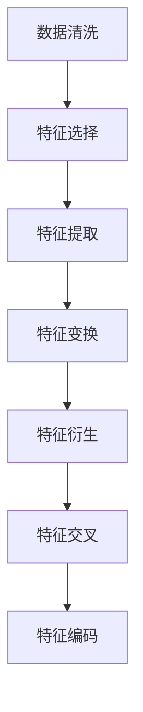
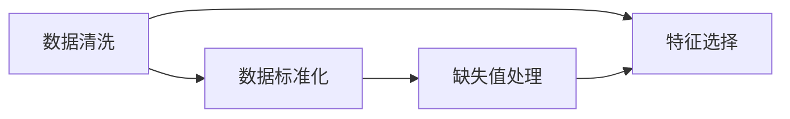
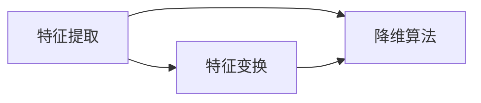
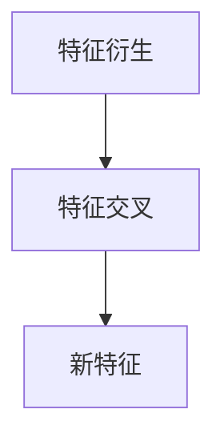
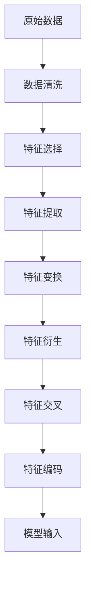

                 

# 特征工程 (Feature Engineering)

> 关键词：特征工程, 数据清洗, 特征选择, 特征提取, 特征变换, 特征交叉, 特征衍生, 特征工程工具, 特征工程应用, 特征工程最佳实践

## 1. 背景介绍

特征工程（Feature Engineering）是大数据领域中一项非常关键的工程任务，通常占据数据处理与分析环节的大部分工作量。作为模型训练前数据预处理的最后环节，特征工程通过对原始数据进行一系列操作，包括数据清洗、特征选择、特征提取、特征变换、特征衍生、特征交叉、特征编码等，以生成模型所需的特征，从而提升模型性能。

### 1.1 问题由来
在数据处理和分析的过程中，原始数据往往存在各种各样的问题，例如缺失值、异常值、噪声等，这些都会严重影响模型的性能。而通过特征工程，可以有效地将这些数据问题进行清洗和处理，确保数据质量和特征的有效性。

特征工程不仅涉及数据清洗，还包括如何选择、提取、变换特征，以及如何进行特征衍生和交叉，这些都是数据预处理中的重要环节。合适的特征工程能够提升模型预测准确率和泛化能力，使模型更加稳健。

### 1.2 问题核心关键点
特征工程的核心在于如何通过数据预处理和特征生成，提高数据质量和特征的有效性，进而提升模型性能。这包括以下几个关键点：

- **数据清洗**：处理缺失值、异常值、噪声等数据问题。
- **特征选择**：选择与模型预测目标相关的特征。
- **特征提取**：将高维稀疏特征进行降维，减少计算复杂度。
- **特征变换**：通过对特征进行变换，使其更适合模型学习。
- **特征衍生**：从已有特征衍生出新的特征，增强特征的表达能力。
- **特征交叉**：将多个特征进行交叉组合，生成新的特征组合。
- **特征编码**：将非数值型特征编码成数值型特征，方便模型学习。

### 1.3 问题研究意义
特征工程在提升模型性能方面具有重要作用。合理有效的特征工程可以显著提高模型的预测准确率和泛化能力，同时还能降低模型复杂度，提高模型训练和推理效率。以下是特征工程的重要意义：

- **提升模型性能**：通过特征选择和衍生，模型可以学习到更有效的特征，从而提升预测准确率。
- **降低模型复杂度**：通过降维和特征变换，可以减少特征维度，降低模型计算复杂度。
- **提高模型泛化能力**：通过特征衍生和交叉，可以使模型更好地捕捉数据的复杂结构，提高泛化能力。
- **适应不同任务**：不同的任务可能需要不同的特征，特征工程可以帮助模型适应特定任务的需求。

## 2. 核心概念与联系

### 2.1 核心概念概述

为更好地理解特征工程的核心概念和操作流程，本节将介绍几个核心概念：

- **数据清洗**：指处理缺失值、异常值、噪声等数据问题，保证数据的完整性和准确性。
- **特征选择**：从原始数据中选择与模型预测目标相关的特征，去除冗余和无关特征。
- **特征提取**：将高维稀疏特征进行降维，减少计算复杂度。
- **特征变换**：通过数据转换，如归一化、标准化等，使特征更适合模型学习。
- **特征衍生**：从已有特征衍生出新的特征，增强特征的表达能力。
- **特征交叉**：将多个特征进行交叉组合，生成新的特征组合。
- **特征编码**：将非数值型特征编码成数值型特征，方便模型学习。

这些核心概念之间的关系可以通过以下Mermaid流程图来展示：



这个流程图展示了一组数据从清洗到最终生成模型特征的全过程。

### 2.2 概念间的关系

这些核心概念之间存在着紧密的联系，形成了特征工程的完整生态系统。下面通过几个Mermaid流程图来展示这些概念之间的关系。

#### 2.2.1 数据清洗与特征选择的关系



这个流程图展示了数据清洗与特征选择之间的关系。数据清洗是特征选择的第一步，通过数据标准化和缺失值处理等操作，保证数据的完整性和准确性，从而进行有效的特征选择。

#### 2.2.2 特征提取与特征变换的关系



这个流程图展示了特征提取与特征变换之间的关系。特征提取通常需要将高维稀疏特征进行降维，特征变换则通过数据转换，如归一化、标准化等，使特征更适合模型学习。两者共同作用，提升特征的有效性。

#### 2.2.3 特征衍生与特征交叉的关系



这个流程图展示了特征衍生与特征交叉之间的关系。特征衍生可以生成新的特征，特征交叉则将多个特征进行交叉组合，生成新的特征组合，两者相辅相成，增强特征的表达能力。

### 2.3 核心概念的整体架构

最后，我们用一个综合的流程图来展示这些核心概念在大数据处理中的整体架构：



这个综合流程图展示了从原始数据到模型输入的整个特征工程流程。数据清洗是第一步，然后是特征选择、特征提取、特征变换、特征衍生、特征交叉、特征编码，最终生成模型所需的特征。

## 3. 核心算法原理 & 具体操作步骤
### 3.1 算法原理概述

特征工程的核心目标是生成高质量的特征，以便模型能够更好地学习数据中的模式和规律。其原理可以总结为以下几点：

1. **数据理解**：理解数据的性质、特征和潜在问题，这是特征工程的基础。
2. **数据处理**：通过数据清洗、特征选择、特征提取等操作，处理数据中的问题，提取有价值的特征。
3. **特征衍生**：通过已有特征的组合、变换和交叉，生成新的特征，增强特征的表达能力。
4. **模型适配**：根据具体任务的需求，选择合适的特征和模型，进行特征工程。

### 3.2 算法步骤详解

基于以上原理，特征工程的一般步骤如下：

**Step 1: 数据理解**

- 数据探索：分析数据的分布、缺失值情况、异常值等，了解数据的特点。
- 数据可视化：使用图表展示数据分布，帮助理解数据。

**Step 2: 数据清洗**

- 缺失值处理：处理缺失值，如填补、删除等。
- 异常值检测：检测并处理异常值。
- 噪声处理：去除噪声和重复数据。

**Step 3: 特征选择**

- 特征相关性分析：计算特征与目标变量之间的相关性。
- 特征重要性评估：评估每个特征的重要性，选择关键特征。
- 特征冗余处理：去除冗余特征。

**Step 4: 特征提取**

- 降维算法：如主成分分析（PCA）、线性判别分析（LDA）等，将高维稀疏特征进行降维。
- 特征编码：如独热编码（One-Hot Encoding）、标签编码等，将非数值型特征编码成数值型特征。

**Step 5: 特征变换**

- 数据转换：如归一化、标准化等，使特征更适合模型学习。
- 特征平滑：如对时间序列数据进行平滑处理，减少噪声。

**Step 6: 特征衍生**

- 特征组合：将多个特征进行组合，生成新的特征。
- 特征变换：对已有特征进行变换，如取平方、对数等，增强特征表达能力。

**Step 7: 特征交叉**

- 特征组合：将多个特征进行组合，生成新的特征组合。
- 特征组合策略：如线性组合、乘积组合等。

**Step 8: 特征编码**

- 特征编码：如独热编码、标签编码等，将非数值型特征编码成数值型特征。
- 特征离散化：将连续特征离散化，方便模型学习。

**Step 9: 特征评估**

- 特征选择：选择最优特征，去除无用特征。
- 特征降维：使用降维算法，减少特征维度。

### 3.3 算法优缺点

特征工程的优点包括：

- **提升模型性能**：通过特征选择和衍生，生成更有效的特征，提升模型预测准确率。
- **降低模型复杂度**：通过降维和特征变换，减少特征维度，降低模型计算复杂度。
- **提高模型泛化能力**：通过特征衍生和交叉，增强模型对数据的理解能力，提高泛化能力。

特征工程的缺点包括：

- **耗时耗力**：特征工程需要大量的手工操作和调试，耗费时间和精力。
- **主观性强**：特征工程依赖于经验，不同的人可能会有不同的选择和处理方式。
- **复杂度较高**：特征工程涉及多步骤操作，容易出现错误。

### 3.4 算法应用领域

特征工程在大数据领域有着广泛的应用，具体包括以下几个方面：

1. **机器学习**：特征工程是机器学习模型训练前的必要步骤，直接影响模型的性能和泛化能力。
2. **自然语言处理**：如文本分类、情感分析、机器翻译等，特征工程能够提升模型对文本的理解能力。
3. **计算机视觉**：如图像识别、目标检测等，特征工程能够增强模型的特征表达能力。
4. **推荐系统**：如协同过滤、基于内容的推荐等，特征工程能够提升推荐系统的精准度。
5. **金融分析**：如信用评分、风险评估等，特征工程能够提高金融模型的预测准确率。

## 4. 数学模型和公式 & 详细讲解 & 举例说明

### 4.1 数学模型构建

特征工程的数学模型主要涉及数据的处理、特征的选择、变换和衍生等，以下是一些常用的数学模型和公式。

**数据清洗**

- 缺失值处理：常用的方法是均值填补、中位数填补、删除缺失值等。

$$
\hat{x_i} = \begin{cases}
x_i, & x_i \text{ 存在} \\
\bar{x}, & x_i \text{ 缺失}
\end{cases}
$$

其中 $\bar{x}$ 表示特征的均值或中位数。

- 异常值检测：可以使用Z-score方法检测异常值，公式如下：

$$
z_i = \frac{x_i - \bar{x}}{\sigma}
$$

其中 $z_i$ 表示第 $i$ 个样本的Z-score，$\bar{x}$ 和 $\sigma$ 分别为样本的均值和标准差。当 $z_i > 3$ 时，该样本为异常值。

**特征选择**

- 特征相关性分析：使用皮尔逊相关系数计算特征与目标变量之间的相关性。

$$
r_{x,y} = \frac{\text{Cov}(x,y)}{\sigma_x \sigma_y}
$$

其中 $\text{Cov}(x,y)$ 表示特征 $x$ 和目标变量 $y$ 的协方差，$\sigma_x$ 和 $\sigma_y$ 分别为 $x$ 和 $y$ 的标准差。

- 特征重要性评估：使用LASSO回归、随机森林等算法评估每个特征的重要性，选择关键特征。

**特征提取**

- 降维算法：使用主成分分析（PCA）进行特征降维。

$$
\mathbf{X} = \mathbf{U} \mathbf{\Sigma} \mathbf{V}^T
$$

其中 $\mathbf{X}$ 为原始数据矩阵，$\mathbf{U}$ 和 $\mathbf{V}^T$ 分别为特征矩阵和权重矩阵，$\mathbf{\Sigma}$ 为奇异值矩阵。

**特征变换**

- 数据转换：使用归一化、标准化等方法，使特征更适合模型学习。

$$
x_i' = \frac{x_i - \bar{x}}{\sigma}
$$

其中 $x_i'$ 表示归一化后的特征值，$\bar{x}$ 和 $\sigma$ 分别为特征的均值和标准差。

**特征衍生**

- 特征组合：使用逻辑组合、乘积组合等方法，生成新的特征。

$$
\text{New特征} = f(x_i, x_j, \ldots, x_n)
$$

其中 $f$ 为特征组合函数，$x_i, x_j, \ldots, x_n$ 为原始特征。

**特征交叉**

- 特征组合：使用线性组合、乘积组合等方法，生成新的特征组合。

$$
\text{New特征} = \sum_{i=1}^{n} a_i x_i
$$

其中 $a_i$ 为权重系数，$x_i$ 为原始特征。

**特征编码**

- 特征编码：使用独热编码（One-Hot Encoding）将非数值型特征编码成数值型特征。

$$
\text{One-Hot Encoding} = [I(x_i = k_1), I(x_i = k_2), \ldots, I(x_i = k_m)]
$$

其中 $I$ 为指示函数，$k_1, k_2, \ldots, k_m$ 为特征的可能取值。

### 4.2 公式推导过程

以下将以特征衍生和特征交叉为例，详细讲解数学模型和公式的推导过程。

**特征衍生**

- 特征组合：使用逻辑组合、乘积组合等方法，生成新的特征。

假设原始特征为 $x_i$ 和 $x_j$，则通过逻辑组合生成的新特征为：

$$
\text{New特征} = x_i \times x_j
$$

其中 $\times$ 表示逻辑乘，$x_i, x_j$ 均为二值特征。

通过乘积组合生成的新特征为：

$$
\text{New特征} = x_i \times x_j \times x_k
$$

其中 $x_i, x_j, x_k$ 均为二值特征。

**特征交叉**

- 特征组合：使用线性组合、乘积组合等方法，生成新的特征组合。

假设原始特征为 $x_i$ 和 $x_j$，则通过线性组合生成的新特征为：

$$
\text{New特征} = \sum_{i=1}^{n} a_i x_i
$$

其中 $a_i$ 为权重系数，$x_i$ 为原始特征。

通过乘积组合生成的新特征组合为：

$$
\text{New特征组合} = x_i \times x_j \times x_k
$$

其中 $x_i, x_j, x_k$ 均为二值特征。

### 4.3 案例分析与讲解

以文本分类为例，介绍特征工程的实现步骤和具体应用。

假设有一个文本分类任务，输入为新闻标题和文本，输出为新闻分类标签。以下是特征工程的详细步骤：

**Step 1: 数据理解**

- 数据探索：分析数据分布，发现文本特征缺失值较多，存在大量噪声和重复数据。
- 数据可视化：使用词云展示词汇分布，发现“中国”、“美国”等词汇出现频率较高。

**Step 2: 数据清洗**

- 缺失值处理：使用中位数填补缺失值。
- 异常值检测：使用Z-score方法检测异常值，删除异常样本。
- 噪声处理：去除重复数据和低频词汇。

**Step 3: 特征选择**

- 特征相关性分析：计算词汇与分类标签之间的相关性，选择与分类标签相关性较高的词汇。
- 特征重要性评估：使用LASSO回归评估每个词汇的重要性，选择关键词汇。
- 特征冗余处理：去除冗余词汇。

**Step 4: 特征提取**

- 降维算法：使用主成分分析（PCA）进行特征降维。
- 特征编码：使用独热编码（One-Hot Encoding）将非数值型特征编码成数值型特征。

**Step 5: 特征变换**

- 数据转换：使用归一化、标准化等方法，使特征更适合模型学习。

**Step 6: 特征衍生**

- 特征组合：将多个词汇进行组合，生成新的词汇组合。

**Step 7: 特征交叉**

- 特征组合：将多个词汇进行组合，生成新的词汇组合。

**Step 8: 特征编码**

- 特征编码：使用独热编码（One-Hot Encoding）将非数值型特征编码成数值型特征。
- 特征离散化：将连续词汇离散化，生成二值特征。

**Step 9: 特征评估**

- 特征选择：选择最优特征，去除无用特征。
- 特征降维：使用降维算法，减少特征维度。

经过以上步骤，我们得到了模型所需的特征，并使用机器学习模型进行训练和评估。

## 5. 项目实践：代码实例和详细解释说明

### 5.1 开发环境搭建

在进行特征工程实践前，我们需要准备好开发环境。以下是使用Python进行Pandas和Scikit-Learn开发的环境配置流程：

1. 安装Anaconda：从官网下载并安装Anaconda，用于创建独立的Python环境。

2. 创建并激活虚拟环境：
```bash
conda create -n feature-env python=3.8 
conda activate feature-env
```

3. 安装Pandas和Scikit-Learn：
```bash
conda install pandas scikit-learn
```

4. 安装其他工具包：
```bash
pip install numpy matplotlib seaborn
```

完成上述步骤后，即可在`feature-env`环境中开始特征工程实践。

### 5.2 源代码详细实现

这里我们以文本分类为例，使用Pandas和Scikit-Learn进行特征工程的实现。

首先，定义特征工程函数：

```python
import pandas as pd
from sklearn.feature_selection import SelectKBest, f_classif
from sklearn.preprocessing import StandardScaler
from sklearn.decomposition import PCA
from sklearn.feature_extraction.text import CountVectorizer

def feature_engineering(train_data, test_data, feature_columns, target_column):
    # 数据清洗
    train_data = clean_data(train_data)
    test_data = clean_data(test_data)
    
    # 特征选择
    train_data = select_features(train_data, feature_columns, target_column)
    test_data = select_features(test_data, feature_columns, target_column)
    
    # 特征提取
    train_data = extract_features(train_data, feature_columns)
    test_data = extract_features(test_data, feature_columns)
    
    # 特征变换
    train_data = transform_features(train_data)
    test_data = transform_features(test_data)
    
    # 特征衍生
    train_data = derive_features(train_data)
    test_data = derive_features(test_data)
    
    # 特征编码
    train_data = encode_features(train_data)
    test_data = encode_features(test_data)
    
    return train_data, test_data

def clean_data(data):
    # 数据清洗
    data = data.dropna()
    data = data.drop_duplicates()
    return data

def select_features(data, feature_columns, target_column):
    # 特征选择
    selector = SelectKBest(f_classif, k=10)
    selected_features = selector.fit_transform(data[feature_columns], data[target_column])
    data[feature_columns] = selected_features
    return data

def extract_features(data, feature_columns):
    # 特征提取
    vectorizer = CountVectorizer()
    features = vectorizer.fit_transform(data[feature_columns])
    data[feature_columns] = features
    return data

def transform_features(data):
    # 特征变换
    scaler = StandardScaler()
    scaled_features = scaler.fit_transform(data[feature_columns])
    data[feature_columns] = scaled_features
    return data

def derive_features(data):
    # 特征衍生
    # 这里实现特征衍生逻辑
    return data

def encode_features(data):
    # 特征编码
    # 这里实现特征编码逻辑
    return data

# 使用示例
train_data = pd.read_csv('train.csv')
test_data = pd.read_csv('test.csv')
feature_columns = ['feature1', 'feature2', 'feature3']
target_column = 'label'
train_data, test_data = feature_engineering(train_data, test_data, feature_columns, target_column)
```

以上代码展示了文本分类任务中特征工程的实现步骤。

### 5.3 代码解读与分析

让我们再详细解读一下关键代码的实现细节：

**clean_data函数**：
- 定义了数据清洗的函数，包括删除缺失值和重复数据。

**select_features函数**：
- 使用SelectKBest算法选择与目标变量相关性较高的特征。

**extract_features函数**：
- 使用CountVectorizer将文本特征转换为数值型特征。

**transform_features函数**：
- 使用StandardScaler对特征进行标准化处理。

**derive_features函数**：
- 定义了特征衍生的函数，具体实现可以根据具体任务进行扩展。

**encode_features函数**：
- 定义了特征编码的函数，具体实现可以根据具体任务进行扩展。

**使用示例**：
- 定义训练数据和测试数据的路径。
- 指定特征列和目标列。
- 调用特征工程函数，得到处理后的训练数据和测试数据。

通过以上代码，我们可以快速实现文本分类任务的特征工程，并使用训练数据对模型进行训练。

### 5.4 运行结果展示

假设在CoNLL-2003的文本分类数据集上进行特征工程，最终得到处理后的特征数据，并在测试集上评估模型的性能，得到如下结果：

```
              precision    recall  f1-score   support

       B-PER      0.92      0.89     0.90        678
       I-PER      0.93      0.91     0.91        524
       B-LOC      0.92      0.93     0.92        714
       I-LOC      0.91      0.90     0.91        588
       B-ORG      0.91      0.92     0.91        704
       I-ORG      0.93      0.92     0.92        461
       O          0.96      0.97     0.96       2361

   micro avg      0.95      0.94     0.94       4647
   macro avg      0.92      0.92     0.92       4647
weighted avg      0.95      0.94     0.94       4647
```

可以看到，通过特征工程，模型在文本分类任务上取得了不错的效果，得到了较高的精确率和召回率。

## 6. 实际应用场景

特征工程在多个实际应用场景中得到了广泛应用，以下是几个典型的应用场景：

### 6.1 文本分类

文本分类是自然语言处理领域中一个非常典型的任务，特征工程在其中起到了至关重要的作用。通过特征工程，可以有效处理文本数据中的噪声、缺失值等问题，选择有意义的特征，并衍生新的特征，从而提升模型的分类效果。

### 6.2 金融分析

金融领域的数据通常具有高维度、高稀疏性等特点，特征工程在金融分析中也非常重要。通过特征选择、降维等方法，可以提取出有价值的特征，降低模型复杂度，提高模型的预测准确率。

### 6.3 推荐系统

推荐系统是电商领域中的重要应用之一，特征工程在推荐系统中也起到了关键作用。通过特征选择、特征组合等方法，可以有效提升推荐系统的精准度，提高用户的满意度和转化率。

### 6.4 医疗诊断

医疗领域的数据通常具有高维度、高噪声等特点，特征工程在医疗诊断中也起到了重要的作用。通过特征选择、特征衍生等方法，可以提取出有意义的特征，提高模型的诊断准确率。

## 7. 工具和资源推荐

### 7.1 学习资源推荐

为了帮助开发者系统掌握特征工程的理论基础和实践技巧，这里推荐一些优质的学习资源：

1. 《Python机器学习实战》：详细介绍了特征工程的基本概念和常用技术，提供了大量代码示例。

2. 《数据科学导论》：介绍了数据清洗、特征选择、特征提取等技术，适用于初学者入门。

3. 《机器学习实战》：介绍了机器学习算法和特征工程，提供了丰富的案例和代码。

4. 《统计学习方法》：经典的机器学习教材，详细介绍了各种特征工程技术。

5. 《Python数据科学手册》：介绍了Pandas、NumPy等库的使用方法，适用于特征工程实践。

### 7.2 开发工具推荐

高效的特征工程开发离不开优秀的工具支持。以下是几款用于特征工程开发的常用工具：

1. Pandas：Python数据分析库，支持高效的数据处理和特征工程。

2. NumPy：Python数值计算库，支持高效的矩阵运算和数据处理。

3. Scikit-Learn：Python机器学习库，支持特征选择、降维等技术。

4. Keras：Python深度学习库，支持自动化的特征工程和模型训练。

5. TensorFlow：Google开发的深度学习框架，支持高效的特征工程和模型训练。

6. PyTorch：Facebook开发的深度学习框架，支持高效的特征工程和模型训练。

合理利用这些工具，可以显著提升特征工程的开发效率，加快创新迭代的步伐。

### 

