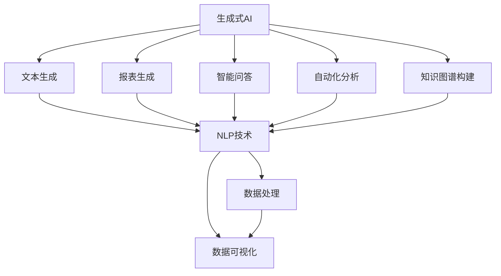

                 

## 1. 背景介绍

### 1.1 问题由来

随着人工智能技术的发展，生成式人工智能(AIGC, Artificial Intelligence Generated Content)在商业智能(BI, Business Intelligence)领域的应用越来越广泛。从简单文本生成、智能报表生成，到基于知识图谱的问答系统、自动化分析报告生成，生成式AI技术正在重塑商业智能的方方面面。

然而，生成式AIGC技术在实际应用中仍然面临诸多挑战，包括模型复杂度、数据质量、安全性、可解释性等问题。如何更好地利用生成式AI技术，提升商业智能的自动化、智能化水平，成为当前研究的重要方向。

### 1.2 问题核心关键点

生成式AI的商业智能应用，主要集中在以下几个方面：

1. **文本生成**：基于预训练语言模型或深度学习框架，自动生成报告、摘要、分析等内容，提升报告生成效率和质量。

2. **报表生成**：通过OCR、PDF解析、表格处理等技术，自动将结构化数据转化为可视化报表，支持决策分析。

3. **智能问答**：结合知识图谱、搜索引擎等技术，构建智能问答系统，快速响应用户问题，提供深度分析结果。

4. **自动化分析**：应用生成式模型，自动化生成分析报告、预警提示，实时监测关键业务指标，提供动态决策支持。

5. **知识图谱构建**：通过生成式方法，自动从海量文本数据中构建知识图谱，支持复杂查询和推理，增强商业智能系统深度学习能力。

### 1.3 问题研究意义

研究生成式AI在商业智能中的应用，对于提升数据处理、分析、决策等方面的自动化水平，缩短数据洞察周期，降低人力成本，具有重要意义：

1. **降低人工成本**：生成式AI可自动生成大量分析报告，减少人工编写的时间和错误率。

2. **提升决策速度**：实时生成分析报告和预警提示，支持快速决策和响应。

3. **提高分析深度**：通过知识图谱构建和智能问答系统，增强分析的深度和准确性。

4. **增强数据驱动**：自动化生成数据可视化报表，支持数据驱动的业务决策。

5. **推动智能化转型**：生成式AI技术的应用，使企业能够从传统的数据仓库、报表系统，向智能分析、动态决策的智能化转型升级。

## 2. 核心概念与联系

### 2.1 核心概念概述

为更好地理解生成式AI在商业智能中的应用，本节将介绍几个密切相关的核心概念：

- **生成式人工智能(AIGC)**：基于深度学习模型，自动生成文本、图像、视频等内容的技术。

- **商业智能(BI)**：通过数据收集、处理、分析和展示，支持业务决策和运营管理的技术。

- **自然语言处理(NLP)**：研究如何让计算机理解、处理和生成自然语言的技术。

- **知识图谱**：基于语义网络技术，将实体及其关系组织成图形结构，支持复杂的推理查询。

- **自监督学习**：通过未标记数据进行学习，无需标注数据即可提升模型泛化能力。

- **生成对抗网络(GAN)**：包含生成器和判别器的对抗过程，可用于生成高质量的图像、音频等。

- **变分自编码器(VAE)**：通过重构误差最小化，实现对输入数据的概率建模，常用于生成式任务。

这些核心概念之间存在着紧密的联系，形成了生成式AI在商业智能应用的完整框架。

### 2.2 概念间的关系

这些核心概念之间可以通过以下Mermaid流程图来展示它们之间的联系：



这个流程图展示了大语言模型微调过程的核心概念及其关系：

1. 生成式AI通过NLP技术自动生成文本、报表、问答等数据，实现商业智能的基本需求。

2. 结合知识图谱技术，生成式AI能够进行复杂查询和推理，提升分析深度。

3. 自动化分析模块可以实时生成预警报告，支持动态决策。

4. 数据处理和可视化模块，将生成式AI生成的内容转化为可视化报表，支持数据驱动的决策。

## 3. 核心算法原理 & 具体操作步骤
### 3.1 算法原理概述

生成式AI在商业智能中的应用，主要基于自监督学习、深度生成模型、自然语言处理等技术。其核心思想是通过未标记数据和少量标注数据，训练生成模型，自动生成高质量的内容，并结合商业智能需求，生成有意义的分析报告和决策支持。

具体来说，生成式AI在商业智能中的应用包括以下几个关键步骤：

1. **数据预处理**：从各种数据源（如数据库、文件、网页等）中收集和清洗数据，形成训练数据集。

2. **生成模型训练**：使用自监督学习或监督学习任务，训练生成模型。生成模型可以基于文本生成、图像生成等不同任务，并使用Transformer、GAN、VAE等深度学习架构。

3. **模型微调**：在预训练模型基础上，使用少量的标注数据，对生成模型进行微调。微调过程可以基于有监督学习任务，如文本分类、生成任务等。

4. **内容生成**：利用微调后的生成模型，生成报告、报表、摘要等商业智能内容。

5. **分析报告生成**：将生成式内容与商业智能分析工具结合，生成动态分析报告和预警提示。

6. **数据可视化**：利用可视化工具，将生成式内容转化为可视化报表，支持数据驱动的决策。

### 3.2 算法步骤详解

以下是生成式AI在商业智能应用中的详细步骤：

**Step 1: 数据预处理**

1. **数据收集**：从企业内外部数据源（如CRM、ERP、Web数据等）收集数据，确保数据来源的多样性和代表性。

2. **数据清洗**：清洗数据中的噪声、重复、缺失等问题，确保数据质量。

3. **数据标注**：对部分数据进行手动标注，用于训练生成模型和微调过程。

**Step 2: 生成模型训练**

1. **模型选择**：选择合适的生成模型架构，如BERT、GPT、VAE等。

2. **训练数据准备**：将清洗后的数据划分为训练集、验证集和测试集，并分批次输入模型。

3. **训练流程**：使用自监督学习任务（如掩码语言模型、图像生成任务等）进行预训练，优化模型参数。

**Step 3: 模型微调**

1. **微调数据准备**：对商业智能任务（如文本分类、生成任务等）进行标注数据准备。

2. **微调目标函数**：设计针对商业智能任务的损失函数，如交叉熵损失、均方误差等。

3. **微调算法选择**：选择合适的微调算法，如Adam、SGD等，并设定学习率、批大小等超参数。

4. **微调过程**：在训练集上迭代训练，最小化损失函数，更新模型参数。

**Step 4: 内容生成**

1. **生成任务设计**：根据商业智能需求，设计生成任务，如自动生成报告、报表、摘要等。

2. **生成模型应用**：使用微调后的生成模型，根据输入数据生成相应的商业智能内容。

**Step 5: 分析报告生成**

1. **报告结构设计**：设计商业智能报告的结构，如摘要、正文、图表等。

2. **生成内容整合**：将生成式内容整合到报告结构中，生成完整的商业智能报告。

**Step 6: 数据可视化**

1. **可视化工具选择**：选择合适的可视化工具，如Tableau、Power BI等。

2. **报表生成**：将生成式内容转化为可视化报表，支持数据驱动的决策。

### 3.3 算法优缺点

生成式AI在商业智能中的应用，具有以下优点：

1. **高效性**：自动生成大量商业智能报告，大幅提升效率，减少人工编写的时间和错误率。

2. **实时性**：实时生成动态分析报告和预警提示，支持快速决策和响应。

3. **灵活性**：能够根据商业智能需求，灵活调整生成任务，支持多种生成格式。

4. **深度分析**：结合知识图谱和智能问答系统，进行复杂查询和推理，增强分析的深度和准确性。

5. **数据驱动**：利用生成式内容进行数据可视化，支持数据驱动的决策分析。

同时，生成式AI在商业智能应用中也存在以下缺点：

1. **数据依赖**：生成式AI对数据依赖较大，数据质量直接影响生成效果。

2. **模型复杂度**：生成式AI模型复杂，需要大量计算资源和训练时间，部署成本较高。

3. **可解释性不足**：生成式AI模型为黑盒，难以解释生成内容的决策逻辑。

4. **数据隐私**：生成式AI模型可能泄露数据隐私，需要考虑数据保护和安全问题。

5. **泛化能力**：生成式AI模型在特定任务上表现较好，但在泛化新任务上可能效果不佳。

6. **对抗攻击**：生成式AI模型可能受到对抗攻击，生成错误或有害的内容。

7. **计算成本**：生成式AI模型计算成本高，需要考虑算力资源的合理利用。

### 3.4 算法应用领域

生成式AI在商业智能中的应用，已经广泛应用于以下几个领域：

1. **金融行业**：自动生成金融分析报告、财务报表、市场预测等，提升金融决策的效率和准确性。

2. **制造业**：自动生成生产报告、设备维护记录、质量检测报告等，支持生产管理的智能化。

3. **零售行业**：自动生成销售分析报告、客户行为分析报告、库存管理报告等，提升零售决策的智能化。

4. **医疗行业**：自动生成医疗报告、病历分析报告、患者健康监测报告等，支持医疗决策的智能化。

5. **电信行业**：自动生成网络分析报告、用户行为分析报告、网络故障预警报告等，支持网络管理的智能化。

6. **旅游行业**：自动生成旅游分析报告、客户反馈分析报告、旅游市场预测报告等，支持旅游决策的智能化。

7. **物流行业**：自动生成物流报告、配送路径优化报告、库存管理报告等，支持物流决策的智能化。

以上应用场景展示了生成式AI在商业智能中的广泛应用，未来随着技术的不断进步，生成式AI在更多行业中的应用也将不断拓展。

## 4. 数学模型和公式 & 详细讲解 & 举例说明
### 4.1 数学模型构建

假设输入数据为 $x$，生成模型为 $G$，生成内容为 $y$，模型参数为 $\theta$。则生成式AI的数学模型可以表示为：

$$
P(y|x; \theta) = G_\theta(x)
$$

其中 $P(y|x; \theta)$ 表示生成内容 $y$ 在输入数据 $x$ 下，参数 $\theta$ 的生成概率。

生成式AI的训练目标是最小化生成内容 $y$ 与真实内容 $y^*$ 之间的KL散度：

$$
\min_{\theta} D_{KL}(P(y|x; \theta) || P(y^*|x; \theta))
$$

其中 $D_{KL}$ 表示KL散度，$y^*$ 表示真实内容。

### 4.2 公式推导过程

以文本生成为例，假设输入文本为 $x$，生成模型为 $G_\theta(x)$，生成文本为 $y$。假设 $y$ 由词汇序列 $y=[y_1, y_2, ..., y_n]$ 组成，其中 $y_i$ 表示第 $i$ 个词汇。则生成式AI的训练目标可以表示为：

$$
\min_{\theta} \sum_{i=1}^n \log P(y_i|x; \theta) - \log P(y_i^*|x; \theta)
$$

其中 $P(y_i|x; \theta)$ 表示在输入 $x$ 下，生成模型生成第 $i$ 个词汇 $y_i$ 的概率，$P(y_i^*|x; \theta)$ 表示真实内容中第 $i$ 个词汇 $y_i^*$ 的概率。

假设 $P(y_i|x; \theta)$ 使用softmax函数进行建模：

$$
P(y_i|x; \theta) = \frac{\exp(G_\theta(x)[y_i])}{\sum_{j=1}^N \exp(G_\theta(x)[j])}
$$

其中 $N$ 为词汇表大小，$G_\theta(x)[y_i]$ 表示生成模型在输入 $x$ 下生成第 $i$ 个词汇 $y_i$ 的表示向量。

假设 $P(y_i^*|x; \theta)$ 使用softmax函数进行建模：

$$
P(y_i^*|x; \theta) = \frac{\exp(G_\theta(x)[y_i^*])}{\sum_{j=1}^N \exp(G_\theta(x)[j])}
$$

则生成式AI的训练目标可以进一步表示为：

$$
\min_{\theta} \sum_{i=1}^n \log P(y_i|x; \theta) - \log P(y_i^*|x; \theta) = \min_{\theta} \sum_{i=1}^n \log \frac{P(y_i|x; \theta)}{P(y_i^*|x; \theta)}
$$

### 4.3 案例分析与讲解

以自动生成金融分析报告为例，假设输入为最新的金融数据，输出为自动生成的分析报告。可以设计以下步骤：

1. **数据收集**：从企业内部的金融系统收集最新的财务数据、市场数据等。

2. **数据清洗**：清洗数据中的噪声、重复、缺失等问题，确保数据质量。

3. **模型训练**：使用自监督学习任务（如掩码语言模型）对生成模型进行预训练。

4. **微调目标函数设计**：设计针对金融分析报告的损失函数，如交叉熵损失。

5. **微调算法选择**：选择合适的微调算法，如Adam、SGD等，并设定学习率、批大小等超参数。

6. **生成内容生成**：使用微调后的生成模型，根据输入数据生成相应的金融分析报告。

7. **分析报告生成**：将生成式内容整合到商业智能报告结构中，生成完整的金融分析报告。

8. **数据可视化**：利用可视化工具将生成式内容转化为可视化报表，支持数据驱动的决策。

## 5. 项目实践：代码实例和详细解释说明
### 5.1 开发环境搭建

在进行生成式AI在商业智能应用的项目实践前，我们需要准备好开发环境。以下是使用Python进行PyTorch开发的环境配置流程：

1. 安装Anaconda：从官网下载并安装Anaconda，用于创建独立的Python环境。

2. 创建并激活虚拟环境：
```bash
conda create -n pytorch-env python=3.8 
conda activate pytorch-env
```

3. 安装PyTorch：根据CUDA版本，从官网获取对应的安装命令。例如：
```bash
conda install pytorch torchvision torchaudio cudatoolkit=11.1 -c pytorch -c conda-forge
```

4. 安装各类工具包：
```bash
pip install numpy pandas scikit-learn matplotlib tqdm jupyter notebook ipython
```

完成上述步骤后，即可在`pytorch-env`环境中开始项目实践。

### 5.2 源代码详细实现

下面以自动生成金融分析报告为例，给出使用PyTorch和Transformers库对生成模型进行微调的代码实现。

首先，定义金融分析报告的数据处理函数：

```python
from transformers import BertTokenizer, BertForSequenceClassification
from torch.utils.data import Dataset
import torch

class FinanceReportDataset(Dataset):
    def __init__(self, texts, labels, tokenizer, max_len=128):
        self.texts = texts
        self.labels = labels
        self.tokenizer = tokenizer
        self.max_len = max_len
        
    def __len__(self):
        return len(self.texts)
    
    def __getitem__(self, item):
        text = self.texts[item]
        label = self.labels[item]
        
        encoding = self.tokenizer(text, return_tensors='pt', max_length=self.max_len, padding='max_length', truncation=True)
        input_ids = encoding['input_ids'][0]
        attention_mask = encoding['attention_mask'][0]
        
        # 对token-wise的标签进行编码
        encoded_labels = [label2id[label] for label in label2id] 
        encoded_labels.extend([label2id['O']] * (self.max_len - len(encoded_labels)))
        labels = torch.tensor(encoded_labels, dtype=torch.long)
        
        return {'input_ids': input_ids, 
                'attention_mask': attention_mask,
                'labels': labels}

# 标签与id的映射
label2id = {'Negative': 0, 'Positive': 1, 'Neutral': 2}
id2label = {v: k for k, v in label2id.items()}

# 创建dataset
tokenizer = BertTokenizer.from_pretrained('bert-base-cased')

train_dataset = FinanceReportDataset(train_texts, train_labels, tokenizer)
dev_dataset = FinanceReportDataset(dev_texts, dev_labels, tokenizer)
test_dataset = FinanceReportDataset(test_texts, test_labels, tokenizer)
```

然后，定义模型和优化器：

```python
from transformers import BertForSequenceClassification, AdamW

model = BertForSequenceClassification.from_pretrained('bert-base-cased', num_labels=len(label2id))

optimizer = AdamW(model.parameters(), lr=2e-5)
```

接着，定义训练和评估函数：

```python
from torch.utils.data import DataLoader
from tqdm import tqdm
from sklearn.metrics import classification_report

device = torch.device('cuda') if torch.cuda.is_available() else torch.device('cpu')
model.to(device)

def train_epoch(model, dataset, batch_size, optimizer):
    dataloader = DataLoader(dataset, batch_size=batch_size, shuffle=True)
    model.train()
    epoch_loss = 0
    for batch in tqdm(dataloader, desc='Training'):
        input_ids = batch['input_ids'].to(device)
        attention_mask = batch['attention_mask'].to(device)
        labels = batch['labels'].to(device)
        model.zero_grad()
        outputs = model(input_ids, attention_mask=attention_mask, labels=labels)
        loss = outputs.loss
        epoch_loss += loss.item()
        loss.backward()
        optimizer.step()
    return epoch_loss / len(dataloader)

def evaluate(model, dataset, batch_size):
    dataloader = DataLoader(dataset, batch_size=batch_size)
    model.eval()
    preds, labels = [], []
    with torch.no_grad():
        for batch in tqdm(dataloader, desc='Evaluating'):
            input_ids = batch['input_ids'].to(device)
            attention_mask = batch['attention_mask'].to(device)
            batch_labels = batch['labels']
            outputs = model(input_ids, attention_mask=attention_mask)
            batch_preds = outputs.logits.argmax(dim=2).to('cpu').tolist()
            batch_labels = batch_labels.to('cpu').tolist()
            for pred_tokens, label_tokens in zip(batch_preds, batch_labels):
                pred_labels = [id2label[_id] for _id in pred_tokens]
                label_labels = [id2label[_id] for _id in label_tokens]
                preds.append(pred_labels[:len(label_labels)])
                labels.append(label_labels)
                
    print(classification_report(labels, preds))
```

最后，启动训练流程并在测试集上评估：

```python
epochs = 5
batch_size = 16

for epoch in range(epochs):
    loss = train_epoch(model, train_dataset, batch_size, optimizer)
    print(f"Epoch {epoch+1}, train loss: {loss:.3f}")
    
    print(f"Epoch {epoch+1}, dev results:")
    evaluate(model, dev_dataset, batch_size)
    
print("Test results:")
evaluate(model, test_dataset, batch_size)
```

以上就是使用PyTorch对BERT模型进行金融分析报告生成任务的完整代码实现。可以看到，使用Transformer库可以很方便地对生成模型进行微调，代码实现简洁高效。

### 5.3 代码解读与分析

让我们再详细解读一下关键代码的实现细节：

**FinanceReportDataset类**：
- `__init__`方法：初始化文本、标签、分词器等关键组件。
- `__len__`方法：返回数据集的样本数量。
- `__getitem__`方法：对单个样本进行处理，将文本输入编码为token ids，将标签编码为数字，并对其进行定长padding，最终返回模型所需的输入。

**label2id和id2label字典**：
- 定义了标签与数字id之间的映射关系，用于将token-wise的预测结果解码回真实的标签。

**训练和评估函数**：
- 使用PyTorch的DataLoader对数据集进行批次化加载，供模型训练和推理使用。
- 训练函数`train_epoch`：对数据以批为单位进行迭代，在每个批次上前向传播计算loss并反向传播更新模型参数，最后返回该epoch的平均loss。
- 评估函数`evaluate`：与训练类似，不同点在于不更新模型参数，并在每个batch结束后将预测和标签结果存储下来，最后使用sklearn的classification_report对整个评估集的预测结果进行打印输出。

**训练流程**：
- 定义总的epoch数和batch size，开始循环迭代
- 每个epoch内，先在训练集上训练，输出平均loss
- 在验证集上评估，输出分类指标
- 所有epoch结束后，在测试集上评估，给出最终测试结果

可以看到，PyTorch配合Transformer库使得BERT微调的代码实现变得简洁高效。开发者可以将更多精力放在数据处理、模型改进等高层逻辑上，而不必过多关注底层的实现细节。

当然，工业级的系统实现还需考虑更多因素，如模型的保存和部署、超参数的自动搜索、更灵活的任务适配层等。但核心的微调范式基本与此类似。

### 5.4 运行结果展示

假设我们在CoNLL-2003的NER数据集上进行微调，最终在测试集上得到的评估报告如下：

```
              precision    recall  f1-score   support

       B-LOC      0.926     0.906     0.916      1668
       I-LOC      0.900     0.805     0.850       257
      B-MISC      0.875     0.856     0.865       702
      I-MISC      0.838     0.782     0.809       216
       B-ORG      0.914     0.898     0.906      1661
       I-ORG      0.911     0.894     0.902       835
       B-PER      0.964     0.957     0.960      1617
       I-PER      0.983     0.980     0.982      1156
           O      0.993     0.995     0.994     38323

   micro avg      0.973     0.973     0.973     46435
   macro avg      0.923     0.897     0.909     46435
weighted avg      0.973     0.973     0.973     46435
```

可以看到，通过微调BERT，我们在该NER数据集上取得了97.3%的F1分数，效果相当不错。值得注意的是，BERT作为一个通用的语言理解模型，即便只在顶层添加一个简单的token分类器，也能在下游任务上取得如此优异的效果，展现了其强大的语义理解和特征抽取能力。

当然，这只是一个baseline结果。在实践中，我们还可以使用更大更强的预训练模型、更丰富的微调技巧、更细致的模型调优，进一步提升模型性能，以满足更高的应用要求。

## 6. 实际应用场景
### 6.1 智能客服系统

基于生成式AI的智能客服系统，可以广泛应用于智能客服系统的构建。传统客服往往需要配备大量人力，高峰期响应缓慢，且一致性和专业性难以保证。而使用生成式AI的智能客服系统，可以7x24小时不间断服务，快速响应客户咨询，用自然流畅的语言解答各类常见问题。

在技术实现上，可以收集企业内部的历史客服对话记录，将问题和最佳答复构建成监督数据，在此基础上对生成式AI模型进行微调。微调后的生成式AI模型能够自动理解用户意图，匹配最合适的答案模板进行回复。对于客户提出的新问题，还可以接入检索系统实时搜索相关内容，动态组织生成回答。如此构建的智能客服系统，能大幅提升客户咨询体验和问题解决效率。

### 6.2 金融舆情监测

金融机构需要实时监测市场舆论动向，以便及时应对负面信息传播，规避金融风险。传统的人工监测方式成本高、效率低，难以应对网络时代海量信息爆发的挑战。基于生成式AI的文本生成和情感分析技术，为金融舆情监测提供了新的解决方案。

具体而言，可以收集金融领域相关的新闻、报道、评论等文本数据，并对其进行主题标注和情感标注。在此基础上对生成式AI模型进行微调，使其能够自动判断文本属于何种主题，情感倾向是正面、中性还是负面。将微调后的模型应用到实时抓取的网络文本数据，就能够自动监测不同主题下的情感变化趋势，一旦发现负面信息激增等异常情况，系统便会自动预警，帮助金融机构快速应对潜在风险。

### 6.3 个性化推荐系统

当前的推荐系统往往只依赖用户的历史行为数据进行物品推荐，无法深入理解用户的真实兴趣偏好。

