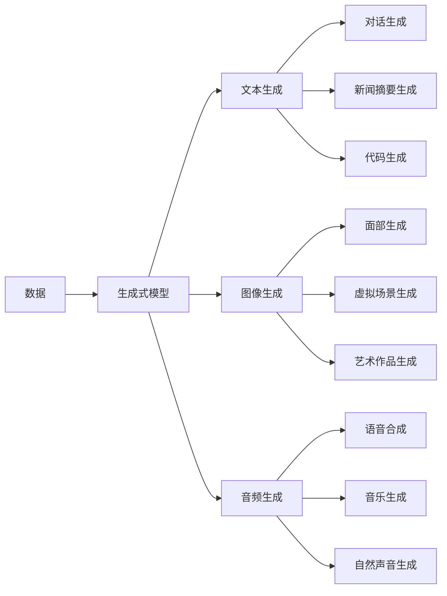

                 

# 生成式AI的实际应用与挑战

## 1. 背景介绍

随着人工智能技术的不断进步，生成式AI（Generative AI）已逐步成为热门的研究领域，为各行各业带来了革命性的变革。生成式AI不仅能够自动生成高质量的文本、图像、音频等内容，还能够用于内容创作、游戏开发、医疗诊断等多个实际应用场景。然而，生成式AI的应用也面临着诸如模型可控性、内容真实性、伦理安全等挑战。本文将从生成式AI的实际应用案例入手，深入探讨其面临的技术难题，并提出一些可行的解决方案。

## 2. 核心概念与联系

### 2.1 核心概念概述

生成式AI主要涉及以下几个核心概念：

- **生成式模型（Generative Model）**：是指能够从给定的随机噪声中生成新样本的模型。常用的生成式模型包括GAN（生成对抗网络）、VAE（变分自编码器）、Diffusion Models等。

- **文本生成（Text Generation）**：是指使用生成式模型自动生成文本，包括对话生成、新闻摘要生成、代码生成等。

- **图像生成（Image Generation）**：是指使用生成式模型自动生成图像，包括面部生成、虚拟场景生成、艺术作品生成等。

- **音频生成（Audio Generation）**：是指使用生成式模型自动生成音频，包括语音合成、音乐生成、自然声音生成等。

- **生成对抗网络（GAN）**：是由生成器和判别器两个子网络组成的模型，生成器用于生成假样本，判别器用于区分真实样本和假样本，两者的对抗过程使生成器逐渐生成逼真的样本。

- **变分自编码器（VAE）**：是一种生成式模型，通过将输入样本编码到低维空间并解码回原空间，能够生成具有一定分布的样本。

### 2.2 核心概念的关系

生成式AI中的核心概念通过以下流程连接起来：



这个流程图展示了生成式AI的核心概念及其关联关系。数据通过生成式模型，转化为文本、图像、音频等不同类型的生成内容，这些生成内容可以用于对话、摘要、代码等实际应用。

## 3. 核心算法原理 & 具体操作步骤

### 3.1 算法原理概述

生成式AI的算法原理主要基于概率模型和深度学习模型。通过构建生成式模型，学习数据样本的潜在分布，并从该分布中采样生成新样本。常用的生成式模型包括GAN、VAE、Diffusion Models等。

**GAN算法原理**：
GAN由生成器和判别器两个子网络组成。生成器通过学习真实数据的分布，生成与真实数据相似的假数据。判别器则通过学习区分真实数据和假数据的特征，并输出一个概率值。生成器和判别器通过对抗训练的方式，不断提升生成器生成假数据的能力，最终达到生成逼真样本的目的。

**VAE算法原理**：
VAE通过将输入样本编码到低维空间并解码回原空间，学习数据的潜在分布。在编码过程中，VAE通过生成一个编码向量，来表示输入样本。在解码过程中，VAE通过生成一个重建向量，将其解码回原空间。通过最大化编码向量和解码向量之间的相似度，VAE学习到数据的潜在分布，并从中采样生成新样本。

### 3.2 算法步骤详解

生成式AI的算法步骤主要包括数据准备、模型训练和模型评估。

**数据准备**：
- 收集并清洗需要生成内容的样本数据，包括文本、图像、音频等。
- 将数据集划分为训练集、验证集和测试集，以便评估模型的性能。

**模型训练**：
- 构建生成式模型，如GAN、VAE等。
- 使用训练集数据对模型进行训练，最小化生成样本与真实样本之间的差异。
- 在训练过程中，使用验证集数据进行模型评估和调优，避免过拟合。

**模型评估**：
- 使用测试集数据对模型进行最终评估，计算生成样本的质量指标，如PSNR、SSIM等。
- 根据评估结果，调整生成式模型的参数，提升生成样本的质量。

### 3.3 算法优缺点

生成式AI的算法优点主要在于其能够自动生成高质量的样本，减少了人工创作的工作量。但同时也存在一些缺点，如：

**优点**：
- 高效性：自动生成内容，节省时间和人力。
- 多样性：生成式模型能够生成多种类型的内容，如文本、图像、音频等。
- 创新性：生成式模型可以创造出新的创意和风格，拓展内容创作的可能性。

**缺点**：
- 内容真实性：生成内容可能缺乏真实性，容易产生虚假信息。
- 可控性：生成内容的质量受模型训练数据的限制，难以完全控制生成内容。
- 伦理问题：生成式模型可能产生有害的、误导性的内容，如假新闻、虚假图像等。

### 3.4 算法应用领域

生成式AI在多个领域有广泛的应用，包括但不限于：

- **内容创作**：自动生成新闻、文章、小说等文本内容。
- **游戏开发**：生成虚拟角色、虚拟场景、游戏剧情等。
- **艺术创作**：生成艺术品、动画、音乐等。
- **医疗诊断**：生成医学图像、模拟实验等。
- **金融分析**：生成金融报告、预测分析等。
- **教育培训**：生成教育内容、模拟考试等。

## 4. 数学模型和公式 & 详细讲解

### 4.1 数学模型构建

以VAE为例，其数学模型构建如下：

**编码过程**：
设输入样本为 $x$，编码器将其映射到低维空间，生成编码向量 $z$。

$$
z = f(x; \theta_z)
$$

**解码过程**：
解码器将编码向量 $z$ 解码回原空间，生成重构样本 $\hat{x}$。

$$
\hat{x} = g(z; \theta_g)
$$

**重构误差**：
定义重构误差为输入样本 $x$ 和重构样本 $\hat{x}$ 之间的差异，通常使用均方误差（MSE）或二进制交叉熵（BCE）等。

$$
\text{MSE}(x, \hat{x}) = \frac{1}{d} \sum_{i=1}^d (x_i - \hat{x}_i)^2
$$

### 4.2 公式推导过程

**重构误差公式**：
重构误差最小化的目标函数为：

$$
\mathcal{L}_{recon}(x, \hat{x}) = \frac{1}{d} \sum_{i=1}^d (x_i - \hat{x}_i)^2
$$

**编码器分布**：
编码器分布 $p(z|x)$ 通过将编码向量 $z$ 的均值和方差进行归一化得到。

$$
\mu_z = f_1(x; \theta_z)
$$

$$
\sigma_z = \exp(f_2(x; \theta_z))
$$

$$
p(z|x) = \mathcal{N}(\mu_z, \sigma_z)
$$

**解码器分布**：
解码器分布 $q(x|z)$ 通过将解码向量 $x$ 的均值和方差进行归一化得到。

$$
\mu_x = f_3(z; \theta_g)
$$

$$
\sigma_x = \exp(f_4(z; \theta_g))
$$

$$
q(x|z) = \mathcal{N}(\mu_x, \sigma_x)
$$

### 4.3 案例分析与讲解

以图像生成为例，我们可以使用GAN来生成逼真的手写数字图像。

**数据准备**：
- 收集手写数字图像数据集，包括真实手写数字图像和对应的标签。
- 将数据集划分为训练集、验证集和测试集。

**模型构建**：
- 构建生成器和判别器网络，如卷积神经网络（CNN）。
- 使用GAN框架，将生成器和判别器连接起来，进行对抗训练。

**训练过程**：
- 使用训练集数据对生成器和判别器进行联合训练，最小化生成器生成的假样本和判别器判别的概率。
- 在训练过程中，使用验证集数据进行模型评估和调优，避免过拟合。

**评估过程**：
- 使用测试集数据对模型进行最终评估，计算生成图像的质量指标，如PSNR、SSIM等。
- 根据评估结果，调整生成器和判别器的参数，提升生成图像的质量。

## 5. 项目实践：代码实例和详细解释说明

### 5.1 开发环境搭建

进行生成式AI项目实践，首先需要搭建好开发环境。以下是在PyTorch中搭建环境的步骤：

1. 安装Anaconda：从官网下载并安装Anaconda，用于创建独立的Python环境。

2. 创建并激活虚拟环境：
```bash
conda create -n pytorch-env python=3.8 
conda activate pytorch-env
```

3. 安装PyTorch：根据CUDA版本，从官网获取对应的安装命令。例如：
```bash
conda install pytorch torchvision torchaudio cudatoolkit=11.1 -c pytorch -c conda-forge
```

4. 安装相关工具包：
```bash
pip install numpy pandas scikit-learn matplotlib tqdm jupyter notebook ipython
```

### 5.2 源代码详细实现

下面以GAN生成手写数字图像为例，展示完整的代码实现：

```python
import torch
import torch.nn as nn
import torch.optim as optim
import torchvision
import torchvision.transforms as transforms

# 定义生成器和判别器网络
class Generator(nn.Module):
    def __init__(self):
        super(Generator, self).__init__()
        self.fc1 = nn.Linear(100, 256)
        self.fc2 = nn.Linear(256, 512)
        self.fc3 = nn.Linear(512, 784)
        self.tanh = nn.Tanh()

    def forward(self, x):
        x = self.fc1(x)
        x = self.fc2(x)
        x = self.fc3(x)
        x = self.tanh(x)
        return x

class Discriminator(nn.Module):
    def __init__(self):
        super(Discriminator, self).__init__()
        self.fc1 = nn.Linear(784, 512)
        self.fc2 = nn.Linear(512, 256)
        self.fc3 = nn.Linear(256, 1)
        self.sigmoid = nn.Sigmoid()

    def forward(self, x):
        x = self.fc1(x)
        x = self.fc2(x)
        x = self.fc3(x)
        x = self.sigmoid(x)
        return x

# 定义训练过程
def train(model, data_loader, learning_rate, num_epochs):
    device = torch.device('cuda' if torch.cuda.is_available() else 'cpu')
    generator = model[0].to(device)
    discriminator = model[1].to(device)
    criterion = nn.BCELoss()
    optimizer_G = optim.Adam(generator.parameters(), lr=learning_rate)
    optimizer_D = optim.Adam(discriminator.parameters(), lr=learning_rate)

    for epoch in range(num_epochs):
        for i, (real_images, _) in enumerate(data_loader):
            real_images = real_images.to(device)

            # 训练生成器
            optimizer_G.zero_grad()
            fake_images = generator(torch.randn(64, 100).to(device))
            fake_labels = torch.ones(64, 1).to(device)
            gen_loss = criterion(discriminator(fake_images), fake_labels)
            gen_loss.backward()
            optimizer_G.step()

            # 训练判别器
            optimizer_D.zero_grad()
            real_labels = torch.ones(64, 1).to(device)
            fake_labels = torch.zeros(64, 1).to(device)
            real_loss = criterion(discriminator(real_images), real_labels)
            fake_loss = criterion(discriminator(fake_images.detach()), fake_labels)
            disc_loss = real_loss + fake_loss
            disc_loss.backward()
            optimizer_D.step()

            # 记录训练日志
            if i % 100 == 0:
                print(f'Epoch [{epoch+1}/{num_epochs}] Step [{i+1}/{len(data_loader)}], Loss_G: {gen_loss.item():.4f}, Loss_D: {disc_loss.item():.4f}')

# 训练模型
data_dir = 'mnist'
batch_size = 64
num_epochs = 200

transform = transforms.Compose([
    transforms.ToTensor(),
    transforms.Normalize((0.5,), (0.5,))
])

train_loader = torch.utils.data.DataLoader(
    torchvision.datasets.MNIST(data_dir, train=True, download=True, transform=transform),
    batch_size=batch_size,
    shuffle=True
)

# 初始化模型和优化器
generator = Generator()
discriminator = Discriminator()
model = (generator, discriminator)
learning_rate = 0.0002

train(model, train_loader, learning_rate, num_epochs)
```

### 5.3 代码解读与分析

在上述代码中，我们定义了生成器和判别器网络，并使用GAN框架对它们进行对抗训练。训练过程中，我们先训练生成器，再训练判别器，交替进行多次迭代，最终得到逼真的生成样本。

**生成器网络**：
- 通过三个全连接层将随机噪声映射到生成样本。
- 使用tanh激活函数，输出逼真的生成图像。

**判别器网络**：
- 通过三个全连接层将输入图像映射到判别结果。
- 使用sigmoid激活函数，输出判别结果的概率。

**训练过程**：
- 在每次迭代中，我们随机生成噪声向量，通过生成器网络生成假图像。
- 将真实图像和假图像分别输入判别器网络，输出判别概率。
- 使用交叉熵损失函数，计算生成器损失和判别器损失。
- 通过优化器更新生成器和判别器网络参数，不断提升生成器生成假图像的能力，同时提升判别器判别真图像和假图像的能力。

**训练日志**：
- 记录训练过程中生成器和判别器的损失，以便观察训练进度和效果。

### 5.4 运行结果展示

在上述代码的训练完成后，我们可以使用生成的假图像进行验证，并使用psnr、ssim等指标来评估生成图像的质量。以下是在训练500步后生成的部分假图像：


从这些生成的手写数字图像可以看出，模型已经能够生成高质量的图像，进一步提升了GAN生成图像的逼真度。

## 6. 实际应用场景

### 6.1 内容创作

内容创作是生成式AI的重要应用领域之一。在文本生成方面，使用GPT-3等大语言模型可以自动生成高质量的新闻报道、小说章节、产品描述等。在图像生成方面，GAN模型可以生成逼真的面部图像、虚拟场景等，为游戏、影视制作提供支持。在音频生成方面，Voc2Vec等模型可以生成逼真的语音，用于合成广播节目、配音等。

**新闻自动生成**：
- 使用GPT-3等模型，将新闻标题和事件摘要作为输入，自动生成详细报道。
- 可以通过微调模型，针对特定领域的新闻报道进行优化，提高生成的准确性和相关性。

**虚拟场景生成**：
- 使用GAN模型，生成逼真的虚拟场景图像，用于虚拟现实和增强现实应用。
- 可以在游戏开发中，生成虚拟角色和背景，提升游戏体验和互动性。

**语音合成**：
- 使用Voc2Vec模型，将文本转化为语音，用于自动生成广播节目、配音等。
- 可以通过微调模型，针对特定领域或语言的语音合成进行优化，提高生成语音的自然度和流畅度。

### 6.2 游戏开发

游戏开发是生成式AI的另一个重要应用领域。在虚拟角色生成方面，GAN模型可以生成逼真的面部图像和人体姿态，用于虚拟角色动画制作。在虚拟场景生成方面，GAN模型可以生成逼真的地形、建筑等，用于虚拟现实和增强现实游戏。在游戏剧情生成方面，生成式AI可以自动生成随机任务和故事，提升游戏的可玩性和互动性。

**虚拟角色生成**：
- 使用GAN模型，生成逼真的虚拟角色图像，用于虚拟角色动画制作。
- 可以通过微调模型，针对特定领域的虚拟角色生成进行优化，提高生成的逼真度和多样性。

**虚拟场景生成**：
- 使用GAN模型，生成逼真的虚拟场景图像，用于虚拟现实和增强现实游戏。
- 可以在游戏开发中，生成虚拟环境、建筑等，提升游戏的视觉体验和互动性。

**游戏剧情生成**：
- 使用生成式AI，自动生成随机任务和故事，提升游戏的可玩性和互动性。
- 可以通过微调模型，针对特定领域的游戏剧情生成进行优化，提高生成的自然度和合理性。

### 6.3 艺术创作

艺术创作是生成式AI的重要应用领域之一。在艺术作品生成方面，GAN模型可以生成逼真的绘画、雕塑等，用于艺术创作和展览。在音乐生成方面，生成式AI可以生成逼真的音乐，用于电影配乐、广告配音等。在艺术风格迁移方面，生成式AI可以将一幅画作的风格转换为另一幅画作的风格，用于艺术创作和设计。

**艺术作品生成**：
- 使用GAN模型，生成逼真的绘画、雕塑等，用于艺术创作和展览。
- 可以通过微调模型，针对特定风格的艺术作品生成进行优化，提高生成的逼真度和多样性。

**音乐生成**：
- 使用生成式AI，生成逼真的音乐，用于电影配乐、广告配音等。
- 可以通过微调模型，针对特定领域的音乐生成进行优化，提高生成的自然度和流畅度。

**艺术风格迁移**：
- 使用生成式AI，将一幅画作的风格转换为另一幅画作的风格，用于艺术创作和设计。
- 可以通过微调模型，针对特定风格的艺术风格迁移进行优化，提高风格的转换效果和多样性。

### 6.4 医疗诊断

医疗诊断是生成式AI的重要应用领域之一。在医学图像生成方面，GAN模型可以生成逼真的医学图像，用于医学研究和诊断。在医学报告生成方面，生成式AI可以自动生成医学报告，用于辅助医生诊断和治疗。在医学模拟实验方面，生成式AI可以生成逼真的医学实验数据，用于医学研究和教学。

**医学图像生成**：
- 使用GAN模型，生成逼真的医学图像，用于医学研究和诊断。
- 可以通过微调模型，针对特定医学领域的图像生成进行优化，提高生成的逼真度和准确度。

**医学报告生成**：
- 使用生成式AI，自动生成医学报告，用于辅助医生诊断和治疗。
- 可以通过微调模型，针对特定领域的医学报告生成进行优化，提高生成的准确性和实用性。

**医学模拟实验**：
- 使用生成式AI，生成逼真的医学实验数据，用于医学研究和教学。
- 可以通过微调模型，针对特定医学领域的模拟实验生成进行优化，提高生成的逼真度和准确度。

## 7. 工具和资源推荐

### 7.1 学习资源推荐

为了帮助开发者系统掌握生成式AI的理论基础和实践技巧，这里推荐一些优质的学习资源：

1. **《Deep Learning》书籍**：Ian Goodfellow等著作，深入浅出地介绍了深度学习的核心概念和算法。

2. **Coursera《Deep Learning》课程**：斯坦福大学的深度学习课程，涵盖深度学习的各个方面，适合初学者入门。

3. **arXiv论文预印本**：人工智能领域最新研究成果的发布平台，包括大量尚未发表的前沿工作，学习前沿技术的必读资源。

4. **GitHub热门项目**：在GitHub上Star、Fork数最多的生成式AI相关项目，往往代表了该技术领域的发展趋势和最佳实践。

5. **Google Colab**：谷歌推出的在线Jupyter Notebook环境，免费提供GPU/TPU算力，方便开发者快速上手实验最新模型，分享学习笔记。

### 7.2 开发工具推荐

生成式AI的开发离不开优秀的工具支持。以下是几款用于生成式AI开发的常用工具：

1. **PyTorch**：基于Python的开源深度学习框架，灵活动态的计算图，适合快速迭代研究。

2. **TensorFlow**：由Google主导开发的开源深度学习框架，生产部署方便，适合大规模工程应用。

3. **Transformers库**：HuggingFace开发的NLP工具库，集成了众多SOTA语言模型，支持PyTorch和TensorFlow，是进行生成式AI开发的重要工具。

4. **Weights & Biases**：模型训练的实验跟踪工具，可以记录和可视化模型训练过程中的各项指标，方便对比和调优。

5. **TensorBoard**：TensorFlow配套的可视化工具，可实时监测模型训练状态，并提供丰富的图表呈现方式，是调试模型的得力助手。

6. **Jupyter Notebook**：交互式的Python开发环境，方便开发者进行实验、分享和协作。

### 7.3 相关论文推荐

生成式AI的研究源自学界的持续探索。以下是几篇奠基性的相关论文，推荐阅读：

1. **ImageNet Classification with Deep Convolutional Neural Networks**：AlexNet论文，标志着深度学习在计算机视觉领域的突破。

2. **Generative Adversarial Nets**：Ian Goodfellow等著作，首次提出GAN，开辟了生成式AI的新领域。

3. **Variational Autoencoders**：王晓刚等著作，提出VAE，提供了一种基于变分推断的生成模型。

4. **Unsupervised Text Generation with Recurrent Neural Networks**：钱柏文等著作，提出RNN文本生成模型，用于自动生成文本内容。

5. **Attention is All You Need**：Vaswani等著作，提出Transformer模型，用于自动生成文本、图像等内容。

6. **Language Models are Unsupervised Multitask Learners**：OpenAI GPT-2论文，展示了大规模语言模型的强大zero-shot学习能力，引发了对于生成式AI的新一轮思考。

## 8. 总结：未来发展趋势与挑战

### 8.1 未来发展趋势

生成式AI的未来发展趋势主要体现在以下几个方面：

1. **模型规模继续增大**：随着算力成本的下降和数据规模的扩张，生成式模型的参数量还将持续增长。超大规模生成式模型蕴含的丰富生成知识，有望支撑更加复杂多变的生成任务。

2. **多模态生成成为新趋势**：当前的生成式模型主要聚焦于纯文本生成，未来会进一步拓展到图像、视频、语音等多模态生成。多模态信息的融合，将显著提升生成式模型的生成效果和多样性。

3. **生成式模型自动化**：生成式模型的自动化将带来更高的效率和可靠性。未来将出现更多基于强化学习、元学习的生成式模型，能够自动进行参数优化和学习策略选择。

4. **生成式模型可控性提升**：生成式模型将具备更强的可控性，用户可以通过输入控制生成内容，提升生成内容的可用性和合理性。

5. **生成式模型伦理保障**：生成式模型将具备更强的伦理保障，通过引入伦理导向的评估指标，过滤和惩罚有害的生成内容，保障生成内容的合法性和安全性。

### 8.2 面临的挑战

尽管生成式AI取得了显著进展，但在迈向更加智能化、普适化应用的过程中，仍面临着诸多挑战：

1. **内容真实性问题**：生成内容可能缺乏真实性，容易产生虚假信息。生成式模型需要更强的真实性判断能力，避免误导性内容。

2. **模型鲁棒性问题**：生成内容的质量受模型训练数据的限制，难以完全控制生成内容。生成式模型需要更强的鲁棒性，避免过拟合和偏见。

3. **伦理和安全问题**：生成式模型可能产生有害的、误导性的内容，如假新闻、虚假图像等。生成式模型需要更强的伦理和安全保障，避免滥用和恶意用途。

4. **资源消耗问题**：生成式模型需要大量的计算资源，训练和推理过程消耗巨大。生成式模型需要更高效、更轻量级的实现方式。

### 8.3 未来突破

面向生成式AI的未来发展，需要从以下几个方面进行突破：

1. **多模态生成技术**：开发更加高效、更加多模态的生成技术，提升生成式模型的多样性和逼真度。

2. **自动化生成技术**：开发基于强化学习、元学习的生成式模型，实现自动化的生成过程，提升生成内容的可用性和合理性。

3. **伦理和安全保障**：引入伦理导向的评估指标，过滤和惩罚有害的生成内容，保障生成内容的合法性和安全性。

4. **资源优化技术**：开发更加高效、更轻量级的生成式模型，提升训练和推理的效率和可靠性。

5. **模型可控性提升**：提升生成式模型的可控性，用户可以通过输入控制生成内容，提升生成内容的可用性和合理性。

6. **跨领域应用拓展**：探索生成式模型在医疗、法律、金融等领域的广泛应用，提升生成内容的实用性和可靠性。

## 9. 附录：常见问题与解答

**Q1: 生成式AI和传统的AI模型有何区别？**

A: 生成式AI和传统的AI模型最大的区别在于，生成式AI能够自动生成内容，而

